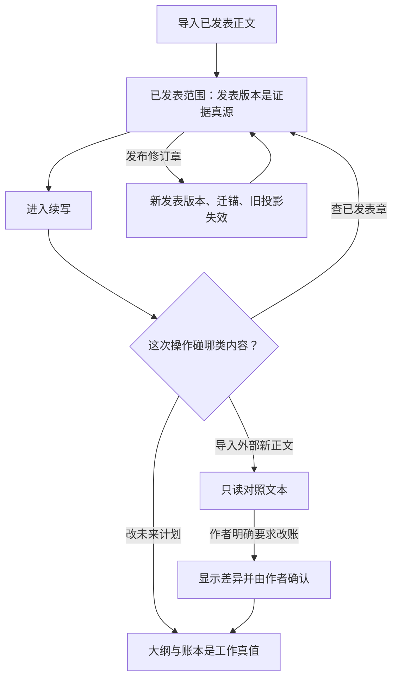

✅ 结论：你们拍下的两种真值是合理的，而且比公开写作软件更清楚。

公开产品普遍允许“已发稿、季纲、人物库、后续草稿”同时存在，但在我查到的官方资料里，没有产品把“前 N 章正文为准、N 章以后大纲为准”做成明确的真值规则。最接近的是影视流程：已经发给剧组的剧本保住页码和场号，未来集数继续按季纲和故事圣经规划。

因此最稳的设计不是给整个项目切换一次真值，而是按内容范围判断：

- 已发表范围：当前生效的发表版本是证据真源。
- 未来创作范围：大纲和各本账是工作真值。
- 作者外写的新正文：只是对照文本，默认没有真值资格。
- 一次检查跨过边界时，拆成两段分别求真，不能先压成一份摘要再判断。

下面只用公开资料论证，没有把附件当证据。调查日期为 2026 年 8 月 14 日。

## 1. 行业有没有“两套权威”

有接近的工作流，没有查到完整的“前 N 章/后 N 章真值路由”。

| 产品/流程          | 公开做法                                                     | 能解决什么、不能解决什么                                     |
| ------------------ | ------------------------------------------------------------ | ------------------------------------------------------------ |
| Final Draft、Celtx | 剧本发给剧组后锁页、锁场号。新增内容使用 21A、21B 一类编号，避免后面所有页码漂移。 | 保住生产引用，但“锁”并不等于正文不可修改，也不规定大纲和剧本冲突时谁是真值。[Final Draft 锁页说明](https://kb.finaldraft.com/hc/en-us/articles/27817054455828-How-do-I-lock-or-unlock-script-pages-and-use-the-locking-tools)、[Celtx Revision Mode](https://support.celtx.com/hc/en-us/articles/205174450-Revision-Mode) |
| Arc Studio         | 同一项目中维护季纲、故事圣经、单集大纲、单集剧本；未来集数先留在季纲，成熟后再建立剧本。它也提供剧本锁页。 | 这是最接近“已完成集按剧本、未来集按季纲”的公开产品，但官方没有声明语义冲突的优先级，也没有逐章真值字段。[Arc 季纲与故事圣经](https://help.arcstudiopro.com/guides/season-outlines-bibles)、[Arc 锁页](https://help.arcstudiopro.com/all-how-tos/how-do-i-lock-my-script-pages) |
| Scrivener          | 把将来会进入成书的稿件放在 Draft/Manuscript，把研究资料放在 Research；章节状态可以由作者自定义为草稿、修改中、定稿等。 | 分开了稿件和参考资料，但状态只是组织标签，不参与自动求真。[Scrivener 三类根目录](https://scrivener.tenderapp.com/help/kb/features-and-usage/the-three-root-folders)、[章节状态](https://www.literatureandlatte.com/blog/three-ways-to-mark-the-status-of-items-in-your-scrivener-project) |
| Novelcrafter       | 正文、计划、Codex 人物世界库并存；场景可标 Outline、Draft、Final。用户也可以显式点击 Extract，把聊天或片段内容送进 Codex、章节或场景节拍。 | 有“显式抽取”动作，但公开工作流没有说明源版本、stale 状态或冲突优先级。[场景标签](https://www.novelcrafter.com/help/docs/organization/labeling-scenes)、[Extract 功能](https://www.novelcrafter.com/help/docs/organization/the-extract-feature) |

🔥 一个容易误解的点：影视软件所谓“锁稿”，通常锁的是页码和场号，不是文字本身。你们更适合叫“当前生效的发表版本”，旧版本不可覆盖，但允许产生一个新的发表修订版。

后台也不要只存一个 `N=第125章`。插入序章、拆章、合章都会让 N 失真。应该给每个稳定章节 ID 标角色：

- `published_evidence`：已发表证据。
- `planning_canon`：未来规划真值。
- `reference_only`：只读对照正文。

“前 N 章”可以是界面表现，不能是底层唯一判断条件。

## 2. 投影和真源不一致时谁赢

写作产品目前没有统一做法，很多仍靠作者手工整理。派生数据系统的规则反而更成熟：派生结果必须记住自己来自哪个源版本，源一变，旧结果就失效。

PostgreSQL 刷新“物化视图”时，会重新执行源查询并替换旧内容；dbt 会把数据新鲜度显示成状态，还能在源过期时阻止后续作业；语言服务器也要求文件变化后重新计算诊断，用新结果替换旧结果。[PostgreSQL 物化视图刷新](https://www.postgresql.org/docs/current/sql-refreshmaterializedview.html)、[dbt Source Freshness](https://docs.getdbt.com/docs/deploy/source-freshness)、[LSP 诊断刷新讨论](https://github.com/microsoft/language-server-protocol/issues/1217)

把这套规则翻到小说产品里：

| 冲突                                   | 谁赢                   | 另一方怎么处理                   |
| -------------------------------------- | ---------------------- | -------------------------------- |
| 已发表正文 v12 与按 v11 抽取的事实冲突 | v12 正文               | 投影立即标 `stale`，不再参加求真 |
| 大纲/账本与作者新写正文冲突            | 大纲/账本              | 新正文只产生差异报告             |
| 两次模型抽取互相冲突                   | 谁都不赢               | 都是候选投影，回原句或交作者判断 |
| 作者觉得抽取结果正确、正文写错了       | 不能直接改投影冒充真相 | 修正文并发布新版本，然后重做投影 |
| 作者要让账本跟随新正文                 | 作者明确确认后的账本赢 | 走“改账”事务，新正文仍是对照来源 |

建议至少保留五种状态：

- `fresh`：仍对应当前源版本。
- `stale`：源已经变了。
- `orphaned`：原句锚找不到。
- `conflicted`：找到多个位置或多个候选。
- `superseded`：已被新投影替代，只留审计。

🔥 stale 必须在源修改成功的同一刻标上，不能等后台重新抽取完才标。否则那段空窗期里，旧结果正在冒充现状。

避免投影慢慢长成第二真源，靠四道硬隔离：

- 投影存放区和账本分开，投影可以整批删除重建。
- 投影不能普通编辑。用户只能选择“重抽”“修源”或“明确写入账本”。
- 真值查询默认不读取 stale 投影。
- 每条投影必须带源版本、原句锚、抽取时间、抽取器版本和来源身份。

来源身份最好拆成两个字段。比如作者接受了一条模型建议：

- 提案来源仍是“模型建议”。
- 批准来源记“作者声明”。

不能因为作者接受了，就抹掉它曾是模型建议；旧稿反推同理。

## 3. 新正文不是真值，仍然可以量产指导

可以。其实核心就一件事：把新正文当“被检查对象”，不要当“世界设定来源”。

| 指导类型                       | 新正文的角色       | 权威从哪里来     | 允许输出                   |
| ------------------------------ | ------------------ | ---------------- | -------------------------- |
| 节奏、重复、视角漂移、信息密度 | 被观察文本         | 不涉及世界真值   | 问题、位置、原因、检查清单 |
| 大纲覆盖检查                   | 已写表现           | 大纲             | 哪些计划已表现、缺失或含糊 |
| 连贯性检查                     | 实际写法           | 账本及已发表证据 | 差异报告，不自动改账       |
| 改账候选                       | 提供比对材料       | 仍需作者决定     | 带来源标签的候选补丁       |
| 后续规划建议                   | 可提供局部写作状态 | 大纲、账本       | 模型建议，不能冒充作者决定 |

参照新正文不会自动让它升格。真正会“偷偷升格”的情况是：

- 把新正文放进模型默认的真值资料池；
- 自动把抽取事实写入账本；
- 后续任务把指导报告当成事实来源；
- 输出时不再区分“正文里这样写”和“世界里确实如此”。

成熟批注系统早就把两者分开了。W3C Web Annotation 明确区分“被批注的目标”和“批注内容”；GitHub 的修改建议也只是评论，作者点击提交后才真正改变分支。[W3C Web Annotation 模型](https://www.w3.org/TR/annotation-model/)、[GitHub 接受修改建议](https://docs.github.com/en/pull-requests/how-tos/review-pull-requests/incorporating-feedback-in-your-pull-request)

你们可以照这个思路做权限隔离：

- 指导任务能读取账本和对照正文。
- 它没有写账权限。
- 输出只能进入“指导报告”或“待确认建议”。
- 只有作者发起“改账”，选中的差异才进入大纲/账本。

产品不代写正文也完全不影响这套能力，因为输出可以限制为诊断、提问、缺口和修改方向，不生成替换段落。

## 4. 修已发表章时，锚点和规划引脚怎么迁

推荐把“正在修”和“修订已发布”分开。公开内容系统也保留这种边界：WordPress 会保存每次草稿或已发布更新的修订历史；编辑已发布文章期间，自动保存不会立刻改掉公开版本，明确保存后才生效。[WordPress 修订记录](https://wordpress.org/documentation/article/revisions/)、[已发布内容的编辑与保存](https://wordpress.com/support/page-post-revisions/)

发布修订后，不要覆盖旧章，而是：

1. 产生新的发表版本 ID，旧版本继续可查。
2. 当前证据真源指向新版本。
3. 旧版本抽出的事实、检查结果立即 stale。
4. 迁移句子锚。
5. 检查哪些未来规划依赖了被修改内容。
6. 对语义发生变化的依赖标“需复核”，不能静默改计划。

锚点至少要组合四层信息：

- 稳定的章节、场景或段落 ID；
- 当前发表版本 ID；
- 原句全文，加前后少量原文；
- 字符位置，仅用来加速定位。

W3C 同时定义了“字符位置锚”和“原句＋前后文锚”，并直接警告：只存字符位置，对文档改动非常脆弱；任何编辑都可能改变选区。[W3C TextQuoteSelector 与 TextPositionSelector](https://www.w3.org/TR/annotation-model/#text-position-selector)

迁移结果不要只有成功/失败，而应有四档：

- `exact`：原句和上下文完全匹配。
- `moved`：原句没变，只是位置移动。
- `ambiguous`：有多个可能位置。
- `orphaned`：无法找到。

发生后两种时，不能让模型挑一个“看起来差不多”的位置偷偷接上。

公开翻车主要有三类：

- Hypothesis 承认网页或 PDF 改动后可能找不到原锚，产品把这些批注放进 Orphans，而不是删除或假装已迁移。[Hypothesis Orphans](https://web.hypothes.is/help/what-are-orphans-and-where-are-they/)
- GitHub 明确记录：后续提交修改了对应行，行级评论可能变成 outdated；接口还保留原提交和原始行信息。[GitHub 行评论版本规则](https://docs.github.com/en/rest/pulls/comments)
- ProseMirror 编辑器文档说明，文档一改，旧位置可能失效或含义改变，所以必须把位置沿编辑操作进行映射。[ProseMirror Position Mapping](https://prosemirror.net/docs/guide/#transform.mapping)

“改一句全文锚全飞”不是夸张：如果所有锚只存整本书的绝对字符位置，在开头插入十个字，后面所有位置都会偏十个字。

规划引脚则不要直接钉在句子坐标上。更稳的是：

- 引脚主要指向稳定的规划条目、人物、场景或线索 ID；
- 如果它依赖某个已发表事实，再附一个正文证据锚；
- 正文修订后，证据锚可以迁，规划条目 ID 不变；
- 如果事实含义变了，引脚进入“需复核”，不能自动改指附近句子。

模型摘要可以帮助人快速看，但不能充当迁移锚或替代原文。

## 5. 建议的真值切换图

四种动作的落地规则：

| 动作                   | 改谁                                                         | 不改谁                                                       |
| ---------------------- | ------------------------------------------------------------ | ------------------------------------------------------------ |
| 导入期                 | 保存发表正文版本；建立句子锚；产生可重建的事实/大纲投影      | 抽取结果不直接成为账本真值；模型建议不冒充作者声明           |
| 进入续写               | 作者接受的内容写成工作大纲和账本；未来编辑只改这些工作真值   | 已发表范围仍回正文求证；未接受投影保持候选                   |
| 修已发表章             | 发布一个新正文版本；迁锚；重做受影响投影；把相关规划引脚标为需复核 | 不静默修改未来大纲和账本；旧发表版本不删除                   |
| 作者要求账本跟随新正文 | 生成明确差异；作者选中后修改相应大纲/账项；保留“旧稿反推/模型建议＋作者批准”两层来源；重新检查一致 | 新正文仍不自动成为默认真源；未选差异不改；不把改账顺手扩大到其他条目 |

⚠️ “改账完成”也不要顺手发“已发生编号”。是否从计划变成已发生，应是另一个明确动作；至少要满足已经写成，并由作者确认进入正式故事事实。单纯模型抽取、旧稿反推或规划调整都不能发号。

如果只保留三条产品红线，我会选：

- 任一源版本变化，相关投影立即 stale。
- 对照正文的指导任务没有写账权限。
- 锚点迁移、正文升格、计划转已发生，都不能静默完成。

来源：ChatGPT