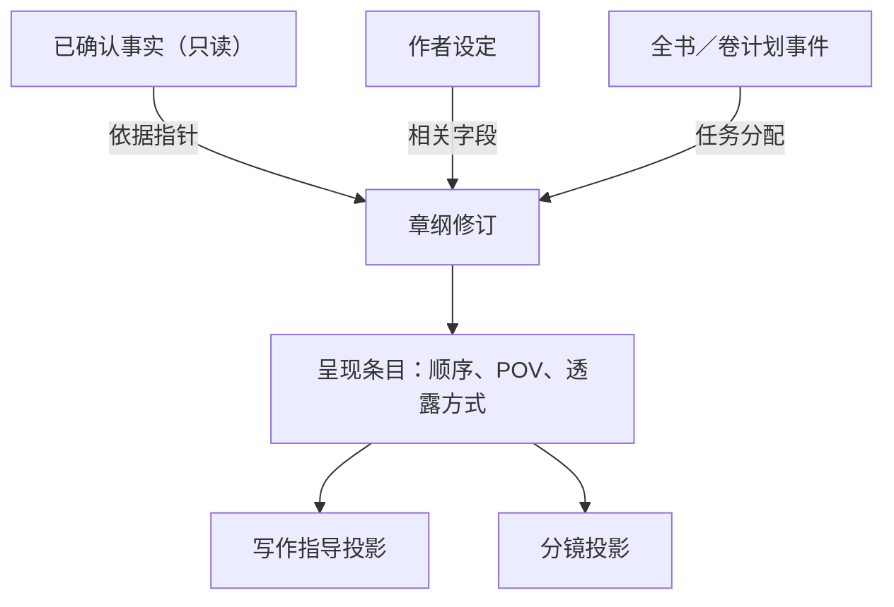

✅ 结论：最稳的结构是——**另张指导单，不另存一套剧情；另设“读者看到的顺序”，不把它写死在计划事件里；章纲只引用上游，不复制上游。**

你可以直接理解成：

这里的“指针”，说白了就是只记原条目的 ID 和版本，点一下能回到原处。界面可以显示一行摘要，但摘要不能独立改成另一套内容。

公开产品里能看到几个稳定方向：

| 产品               | 公开做法                                                     | 对你们的启示                                                 |
| ------------------ | ------------------------------------------------------------ | ------------------------------------------------------------ |
| Plottr             | 场景卡只关联人物、地点、标签，可按这些关系筛选时间线         | 设定应按场景关联下传，不是整本故事圣经全灌进去。[官方文档](https://docs.plottr.com/article/71-outline-linking-characters-places-tags) |
| Dabble             | 情节线是列、场景是行；写作侧栏看到的仍是同一批情节点         | 规划视图、场景视图可以不同，但底层事件应是同一个。[官方文档](https://www.dabblewriter.com/docs/planning-story-notes/using-the-plot-grid/) |
| Final Draft        | Beat Board 与线性 Outline 共用 beat，修改一处会同步另一处；还能标目标页数 | 上层节拍、场序列、长度预算可以共享对象。[官方文档](https://kb.finaldraft.com/hc/en-us/articles/27613546469652-How-do-I-use-the-Outline-Editor) |
| Aeon Timeline      | 事件可关联参与者、目击者、地点、故事线；发生顺序与讲述顺序分开 | 很适合回答“谁在场”和“倒叙怎么存”。[事件关系](https://help.aeontimeline.com/article/20-key-concepts)、[独立叙述结构](https://www.aeontimeline.com/guides/organize-a-separate-story-structure) |
| Sudowrite／NovelAI | 只把明确提到或命中条件的设定送进当前上下文                   | 执行包应该做相关性筛选，并能解释某条设定为什么被带入。[Sudowrite](https://docs.sudowrite.com/using-sudowrite/1ow1qkGqof9rtcyGnrWUBS/saliency-engine/4KL8gFeLZNvk8CEeXpfwB2)、[NovelAI Lorebook](https://docs.novelai.net/en/text/lorebook/) |

## 1｜上游怎样下传，才不会把全书设定糊进每章

推荐采用“**任务种子 → 相关关系扩一圈 → 按字段裁剪**”。

章纲先拿本章明确分配到的计划事件和卷任务，再沿关系向外找一圈：

- 这些事件依赖哪些已确认事实。
- 谁参与、谁目击、谁只是被提到。
- 人物进入本章时的伤势、物品、身份、关系、知识状态。
- 场景涉及哪个地点、时间和移动条件。
- 哪条世界规则会被触发，以及它对应的例外、代价、失效条件。
- 前章留下了哪些承诺、问题或不可逆状态。
- 本章出口要把什么交给下一章。

人物卡也不要整张下传。只取这一章有用的“切片”，例如：

- 当前目标，而不是一生所有目标。
- 当前关系，而不是完整关系史。
- 当前知道什么，而不是作者知道的全部真相。
- 当前伤势、身份暴露程度、持有物。
- 与这场冲突有关的性格和禁忌。

执行包建议分三层：

- **硬核区**：计划事件、事实指针、不可违反项、人物在场与知识状态、规则和适用例外。不能省略。
- **相关摘要区**：人物背景、地点气氛、势力概况等；必须带来源 ID 和版本。
- **未装载区**：本章无关的卷内容和世界设定，只保留可展开入口，不送给模型。

每条入包材料最好附两个解释字段：

- `include_reason`：为什么本章需要它。
- `source_revision`：它来自哪个版本。

这样出了错误，可以直接判断是“漏检索”“摘要损失”还是“上游本来就缺”。

### 高风险漏项

公开资料里没有可靠的行业频次统计。下面这些是从写作工具反复保存的关系字段、影视连续性记录和时间线依赖反推出来的高风险项。影视里的剧本监督会专门记录动作、对白、服装、道具和人物连续性，也说明这类信息很容易在逐场传递时丢掉。[ScreenSkills](https://www.screenskills.com/job-profiles/browse/film-and-tv-drama/technical/script-supervisor-film-and-tv-drama/)

1. **漏不可逆变化**

   常见于死亡、重伤、身份公开、秘密被谁听见、物品易主、门派决裂、契约成立。

   最少要存：变化前、变化后、生效时间、受影响对象、是否可逆、反转条件。不能只存“发生了打斗”。

2. **漏谁在场、谁看见、谁知道**

   “人在场”和“知道此事”不是一回事。建议区分：

   - 参与者
   - 目击者
   - 听说者
   - 被提到但不在场
   - POV 人物
   - 读者已知／人物未知

   Aeon 明确区分 Participant 和 Witness，这比一张简单人物名单更可靠。

3. **漏世界规则例外**

   不能只下传“铁牢里无法施法”，还得带上“皇族血脉例外”“需要付出记忆”“仅满月有效”等条件。

   建议规则至少有：触发条件、适用范围、例外指针、代价、权限来源、有效期。摘要如果装不下这些条件，就不能摘要，必须读取原规则。

4. **漏因果前提和移动时间**

   例如某人尚未拿到令牌却已经开门，两地相隔三日却同夜到达。时间工具通常用依赖关系解决这类问题；Aeon 也允许事件依赖前一事件及时间偏移。[依赖关系文档](https://help.aeontimeline.com/article/61-dependencies)

5. **漏承诺、所有权和未结任务**

   物品重复出现、线索凭空消失、前章承诺无人处理，都属于边界状态没有下传。

## 2｜卷任务怎样装进章纲，以及怎样检查装不装得下

卷任务应在四个格子里分别承担不同职责：

- **章目标**：说明本章结束时哪种状态必须改变，并挂父任务指针。不要只写“推进门派冲突”，要写成“主角从怀疑内奸，变成掌握一条可验证线索”。
- **必写承接**：列出本章被分配的硬任务、已确认事实前提、不可违反项。每项标明是“完成、推进、铺垫、回收”。
- **场序列**：给每个硬任务安排真正的宿主场和计划事件。只在章目标里提到，但没有落到任何一场，算没有承接。
- **出口钩子**：记录本章交出去的新压力、读者问题或下一任务。钩子也要指向已有计划任务，不能临时编一个无来源的大反转。

检查“装不装得下”至少跑五关：

1. **覆盖关**：每个卷任务是否有宿主场和计划事件。
2. **变化关**：宿主场是否真的容纳目标、阻力、转折和状态变化。Save the Cat 会检查冲突与情绪变化，Story Grid 会检查事件是否形成转折和结果；不必照搬它们的方法，但“场不能只有信息堆放”是共同信号。[Save the Cat](https://savethecat.com/how-to-write-a-novel)、[Story Grid](https://storygrid.com/scenes/)
3. **因果关**：前提是否已经成为事实或排在更早的计划事件里；人物、时间、地点是否可达。
4. **容量关**：场的最低字数估算、转场成本、独立转折数量、人物和规则首次介绍量，是否超过章节预算。
5. **出口关**：本章完成后的状态能否接上下章；是否把未完成任务明确交出去。

不要用固定的“每条事件 500 字”当行业真理。更稳的做法是让作者填写或系统逐渐学习本项目的场均长度，再估算最低容量。

装不下时，提示应像这样：

> 本章分配了 5 个硬任务，但现有场序列只承载 3 个。
> “揭露内奸线索”和“令牌易主”没有宿主场。按当前场估算，最低需要约 4,200 字，章节预算为 3,000 字。
> 可选：增加场、拆章、提高预算、把任务改为“仅推进”，或回卷纲调整分配。系统不会自动选择。

告警等级建议：

- 🔴 **阻断**：违反事实、违反适用规则、因果前提不存在、人物不可能在场。
- 🟠 **容量不足**：字数明显超载、硬任务没有宿主场、一个场塞入多个互不相关的转折。
- 🟡 **结构欠账**：章目标有承接，但没有出口；钩子未指向后续任务。

Dabble 在移动带情节点的场景时，会明确询问“场景与情节点一起移动，还是只移动场景”，而不是替用户猜。[Dabble 移动确认](https://www.dabblewriter.com/docs/planning-story-notes/using-the-plot-grid/#move-a-scene-that-has-plot-points) Final Draft 则用目标页数和超出标红显示容量问题。这两种交互都适合借鉴。

父任务到章、章到场、场到下游应保持双向可追踪：既能从卷任务看到落在哪些章，也能从一个分镜追回哪条卷任务。工程里的需求管理同样依靠父子链接检查遗漏和变更影响，这个思路可以借用，但内容仍是小说规划。[NASA](https://www.nasa.gov/reference/4-0-system-design-processes/)、[IBM DOORS](https://www.ibm.com/docs/en/engineering-lifecycle-management-suite/doors/9.7.1?topic=requirements-links-traceability)

## 3｜写作指导是不是另张单，怎样与分镜共用事件

✅ **界面上另张指导单，数据上不是另一套故事。**

原因很简单：段落级指导太细，硬塞进章纲会把章纲淹没；但如果指导单自己保存“发生了什么”，它迟早会与章纲分叉。

建议在章纲和两个下游之间增加一个很薄的“呈现条目”。它表达：

- 引用哪个计划事件或事实。
- 放在哪一场。
- 读者在这里看到它的第几部分。
- 是现场发生、回忆、转述、暗示还是正式揭露。
- POV 是谁。
- 读者和人物的知识状态怎样变化。

写作指导读取呈现条目，再增加：

- 这一段完成哪几个事实或信息任务。
- 信息透露顺序。
- 情绪进入状态和离开状态。
- 哪句话只能暗示，哪句话可以确认。
- 节奏、视角、措辞等表达建议。

分镜读取同一个呈现条目，再增加：

- 必须看见的人物、动作、地点和关键物品。
- 谁在画内、谁在画外。
- 对白意图，不另写新剧情。
- 连续性进入状态和离开状态。
- 视觉重点、反应、空间关系。

🔥 最重要的限制是：

> 写作指导和分镜只能给计划事件加“怎么表达”的标注，不能直接新增“发生了什么”。

如果用户在指导单里写入一个新事件，产品应提供“提交为规划变更”，把它带回章纲修改；如果它碰撞已确认事实，则直接提示冲突。不能悄悄把它留在指导单里。

两个下游还应保存同一个 `chapter_outline_revision_id`。章纲变化后，将旧指导和旧分镜标成“来源版本已变化”，由作者选择刷新或保留对照，不自动覆盖。

这和 Final Draft 的“同一个 beat 在白板与线性大纲同步”、Dabble 的“同一情节点在规划区与场景侧栏出现”是同一路数。你们只取它们的对象共用方式，不需要采用“发送到正文”。

## 4｜五条事实句的叙述顺序应该存在哪里

✅ 推荐答案：**单独保存“呈现条目顺序”，它是对计划事件／事实的有序引用。**

不建议把顺序写成计划事件自身的数组位置，原因有三点：

- 插入一个事件后，数组位置会整体变化。
- 同一事件可能先被暗示，后来正式揭露，再被另一人物回忆；它没有唯一的“第几位”。
- 多线叙事只有各线内部的先后和汇合点，不一定存在一个可靠的全局事件顺序。

也不能只把顺序放在写作指导里，否则章纲无法检查信息释放，分镜也读不到同一顺序。

推荐的呈现条目大致包含：

- `event_ref`：引用哪个事件。
- `scene_ref`：放在哪一场。
- `order_key`：读者看到的顺序。
- `mode`：现场、转述、回忆、预示、正式揭露。
- `pov_ref`：谁的视角。
- `reader_knowledge_delta`：读者新增知道什么。
- `character_knowledge_delta`：哪些人物新增知道什么。
- `thread_ref`：属于哪条故事线。

叙事学一直区分“事件发生的顺序”和“读者接收信息的顺序”。两者重新排列，会制造悬念、好奇和惊讶。[剑桥《Time and Space》](https://resolve.cambridge.org/core/services/aop-cambridge-core/content/view/EC6CB2FDFD80FE9BDCB1F21487121617/9781139001533c04_p52-65_CBO.pdf/time_and_space.pdf)、[The Living Handbook of Narratology](https://lhn.sub.uni-hamburg.de/index.php/Narrativity.html) Aeon 甚至直接把事件日期和 narrative position 分开：移动叙述位置不会改变事件日期，但人物、标题等内容仍然共用。[Aeon Narrative](https://www.aeontimeline.com/3-4-guides/narrative)

具体落法：

- **线性网文**：默认让场顺序等于呈现顺序，普通用户只看一个列表。内部仍存有序引用，发生倒叙或延迟揭露时再显示“发生顺序与呈现顺序不同”。
- **倒叙**：过去事件保持原时间和事实身份；当前章节增加一个指向它的“回忆／揭露”呈现条目。
- **多线**：每条线有自己的顺序和人物知识状态，章内再有一个读者阅读顺序。汇合处检查人物有没有使用另一条线尚未获得的信息。
- **写作指导**：只继续细分呈现条目内部的微观顺序，例如先给异常结果，再给原因线索；不负责定义全章唯一的叙述顺序。

## 5｜建议字段对照表

标记说明：

- **P 必须指针**：保存稳定 ID，能回到原条目。
- **S 允许摘要**：可生成短摘要，但必须带来源 ID 和版本，不能当新真值。
- **X 禁止复制**：禁止产生可独立编辑的另一份剧情或规则。界面临时显示文字不算复制。

| 上游字段                 | 章纲放在哪                           | 写作指导读取什么                       | 分镜读取什么                         | 传递规则                                      |
| ------------------------ | ------------------------------------ | -------------------------------------- | ------------------------------------ | --------------------------------------------- |
| 已确认事实句／状态变化   | 必写承接、不能违反、场进入／离开状态 | 本段要建立或确认的事实；读者知道前／后 | 连续性、人物状态、动作结果、对白事实 | **P＋S＋X**                                   |
| 全书／卷计划事件         | 章目标、必写、场序列、出口钩子       | 本段服务哪个计划事件、透露到什么程度   | 镜头任务、动作和对白意图             | **P＋S＋X**                                   |
| 卷任务／人物弧任务       | 章目标及任务分配                     | 情绪变化、关系推进目标                 | 反应、空间关系、视觉转折             | **P＋S＋X**                                   |
| 因果前提／事件依赖       | 不能违反、场顺序、开场条件           | 信息不能早于哪个前提出现               | 转场、时间连续性、必要铺垫           | **P＋X**                                      |
| 前章出口／未结承诺       | 开场承接、必写、出口交接             | 何时回应、延迟还是回收                 | 开场画面、关键物品、视觉钩子         | **P＋S＋X**                                   |
| 人物身份及当前状态       | POV、在场人物、场目标／阻力          | 情绪、知识、关系、对白权限             | 外观、动作、站位、伤势               | **P＋S＋X**                                   |
| 在场／目击／知识状态     | 在场名单、POV、不能违反              | 谁可以说什么；读者与人物的信息差       | 画内／画外、谁能目击反应             | **P＋X**                                      |
| 世界规则及例外           | 不能违反、场约束                     | 行为边界、规则透露顺序                 | 动作、效果、道具、对白限制           | **P＋X**；只有不丢条件时才 **S**              |
| 地点、时间、历法         | 场头、转场、时间预算                 | 感官信息、时间压力、节奏               | 环境、光线、服装、空间关系           | **P＋S＋X**                                   |
| 物品、势力、关系、所有权 | 场进入／离开状态、必写变化           | 冲突来源、事实和情绪含义               | 关键道具、站位、交接动作             | **P＋S＋X**                                   |
| 作者明确“必须／禁止”     | 必写、不能违反                       | 每条指导都受它过滤                     | 每个镜头和对白要点都受它过滤         | **P＋X**                                      |
| 风格、语气、节奏偏好     | 章级写法约束                         | 句段节奏、视角距离、措辞建议           | 视觉气质、对白节奏                   | **P＋S**；局部覆盖另存为覆盖项                |
| 叙述／信息释放顺序       | 场序列下的呈现条目                   | 段落和句级透露顺序                     | 镜头任务和对白揭露顺序               | **P 指向呈现条目＋X**；禁止拿事件数组位置代替 |
| 远端世界史、整卷说明     | 默认折叠的来源入口                   | 只读本章命中的相关切片                 | 只读画面真正需要的部分               | **S**，并保留来源；禁止整份复制               |
| 字数和场数预算           | 章字数预估、各场预算                 | 每项信息应展开到多细                   | 镜头密度和场内重点                   | 配置用 **P**，估算结果可派生                  |

这套设计守住了三个边界：

- 事实仍然是事实，计划不会改写它。
- 章纲负责分配“这一章做什么”和“读者怎样依次看到”。
- 指导与分镜只回答“怎样表达同一批计划事件”，不会长出第二、第三套剧情。

本调查只使用公开外部资料和你消息中明确给出的约束，没有把附件内容当成调查证据。产品文档能证明功能形状，但不能证明这些做法一定带来更高创作质量；关于漏项的部分属于跨产品、叙事方法与影视连续性工作的综合判断。

来源：ChatGPT