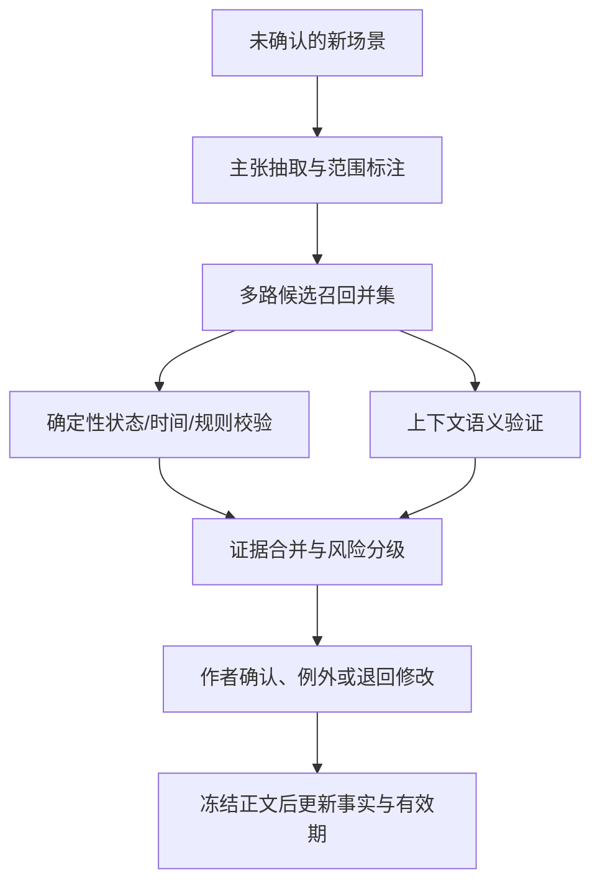

# 长篇“吃书”检测：几千条旧事实下的高召回、可回验一致性检查

**版本：** R01  
**证据检索截止：** 2026-08-09  
**状态：** 研究建议；不改写现有项目拍板，不代表生产方案已冻结或已通过真实盲测

## 一页结论

最可行的方案不是“把全书塞给长上下文模型”，也不是“向量检索后对每个句子跑一次 NLI”。推荐采用：

> **关系型真值账 + 多路高召回候选检索 + 确定性约束校验 + 带证据的上下文验证器 + 作者裁决。**

关键设计只有五条：

1. **以新场景中的新事实为锚。** 先把新内容拆成带实体、状态槽、故事时间、叙事范围、知情者和证据位置的主张，再去找可能冲突的旧事实；不要让模型从整本书里自由“找茬”。
2. **候选集取多路并集，不押注单一向量召回。** 实体/别名、谓词槽、故事线、时间区间、角色知情、世界规则、BM25 和向量近邻各自会捞到不同错误。硬规则和同槽状态不能受普通 top-k 截断。
3. **能计算的冲突不用语言模型猜。** 死亡—存活、同一时段两地出现、年龄/数量不可能、时间先后成环、角色尚无获知路径等，优先交给状态机、区间约束和图遍历；模型负责从文本抽约束及判断语义例外。
4. **验证器至少四分类。** `矛盾`、`合法状态更新`、`相容`、`证据不足`。二分类 NLI 会把“过去是黑发、后来染成白发”误报成矛盾，也容易把谎言、梦境、闪回、计划和事实混在一起。
5. **红灯必须可回到两端原文。** 红灯只给“已确认硬事实/硬规则 + 明确冲突 + 可回验新旧证据”；隐含、多跳、人物动机或不可靠叙述进入橙色复核，不应伪装成已证实冲突。系统没找到冲突时只能说“当前覆盖范围内未检出”，不能说“确定无冲突”。

在“5,000 条旧事实、一个场景抽出 8 条新主张”的示例里，穷举是 40,000 对。若多路检索去重后每条新主张保留约 50–150 个候选，则强验证量约为 400–1,200 对，即约 **33–100 倍缩减**。这是容量估算，不是已测性能；真实预算必须由本项目盲测校准。

**证据口径：** 论文数字只在各自数据集与设置内解释；产品能力只按官方公开文档描述，不把厂商措辞当准确率；本报告提出的候选预算和验收线均标为工程建议，不伪装成项目实测。

## 1. 与现有项目边界怎样对齐

这项设计遵守现有材料中的已拍方向：

- 冻结正文是最终证据，事实句是可重建的结构化中间表示；每次报警都必须带来源编号、原文位置、版本和 SHA。
- 计划事件、未确认场景稿和 AI 推断不能冒充已发生事实。可以在未确认稿上预检，但预检结果不得反写真值。
- 状态、知情、因果、义务、规则和证据各有职责；长线账引用事实编号，不复制第二份事实正文。
- 事实句伸缩压缩是读取视图，不是第二套真值库；正文向量分片可以作为补充召回通道，但不升级成产品核心真值路线。
- 对应现有决策：D11（事实句伸缩压缩）、D13（硬冲突红灯）、D21（知情分层）、D26（世界规则来源分级）、D37（先关系数据库＋引用，有性能证据再上图引擎）。

因此，本报告建议新增的是**一致性检查的查询与裁决管线**，不是重开一套正史。

## 2. 公开研究实际告诉了我们什么

### 2.1 结论不能由一个“NLI 准确率”概括

不同论文测的任务并不相同：有的把一条矛盾人工插进文档，有的判断前传是否违反原著，有的检查书籍摘要，有的只测五句物理事件。下表保留任务边界，避免把成绩横向误读成同一排行榜。

| 研究 | 任务与规模 | 代表性结果 | 对本项目的含义 | 主要限制 |
|---|---|---|---|---|
| [ContraDoc（NAACL 2024）](https://aclanthology.org/2024.naacl-long.362.pdf) | 449 篇 Wikipedia、新闻和故事文档；人工核验的注入式自相矛盾 | 整篇二分类接近随机；GPT-4 在 top-5 证据句定位上为 70%，但故事子集证据命中仅 62.4%；若先给出一端矛盾句，找另一端可到 77.2% | **新事实应作为已知锚点**，先检索另一端，再验证；让模型无锚扫描整本书代价高且漏检多 | 英文、注入式矛盾；不是长篇生产稿 |
| [FlawedFictions（COLM 2025）](https://arxiv.org/html/2504.11900) | 从公版小说前段抽命题，在后文做否定和局部修补；短集 414 篇、长集 200 篇，最长不足 4k 词；要求分类并定位新旧证据 | 长集最佳约 accuracy .61、定位式 CEEval .53，“全部预测无错误”基线已有 .51/.51；MNLI dev 约 91% 的 DeBERTa-v3-large 在短/长 CEEval 只有 .04/.00 | 最直接地证明“通用 NLI 高分”不能代替叙事证据定位，也说明类别不平衡会让普通 accuracy 看起来虚高 | 合成修改可能留痕；仍远短于长篇；长集人工复核不完全 |
| [FACTTRACK（NAACL 2025）](https://aclanthology.org/2025.naacl-long.144.pdf) | 用 pre-fact、post-fact、static fact 和有效区间跟踪叙事状态 | ContraDoc 上直接基线 P/R/F1 为 89.29/5.57/10.48；FactTrack 为 52.71/62.81/57.32。其叙事 NLI 在 GPT-4 标注集上约 60% 精确率、60% 召回率 | 有效期和“状态改变”建模能大幅改善召回；通用 NLI 分数不能直接代表叙事事实对 | 主实验多为 2k–3k 词大纲；标签大量来自模型；非顺叙和时间解析仍是开放问题 |
| [PRELUDE（2025）](https://arxiv.org/html/2508.09848v1) | 13 部中英文小说、795 个“前传是否符合原著”实例；361 个矛盾中 267 个为全局矛盾 | 最佳模型 Gemini 2.5 Pro macro-F1 65.1，人工 81.7；88% 实例需跨原著多处取证。GPT-4o 无 RAG 为 57.8，约 20k token 的检索上下文升至 62.9 | 这是最接近“新内容 vs 长篇旧正史”的公开证据：RAG 有帮助，但全局、多证据推理仍远未解决 | 前传判定不等于逐场 QC；数据规模不大；模型和提示会变 |
| [FIND（ACL Findings 2026）](https://aclanthology.org/2026.findings-acl.1675.pdf) | 375 篇长文，每篇一处专家插入的不一致；中位 35k token，25% 超过 78k | GPT-5 与 Gemini 2.5 Pro 的任务召回分别约 64% 和 61%；顶级模型平均每增加 10k token 下降约 2.6 个百分点；20% 文档被 7 个闭源模型全部漏掉 | “上下文装得下”不等于“能可靠找出矛盾”；长度与结构都会压低召回 | 主要不是小说；每篇只放一处错误；下降是相关性而非严格因果 |
| [ConStory-Bench（ACL Findings 2026）](https://aclanthology.org/2026.findings-acl.410.pdf) | 2,000 个提示、4 种任务、目标 8k–10k 词故事；5 大类 19 子类矛盾 | 在 1,000 个注入错误上，其分类引导检查器 P/R/F1 为 .884/.550/.678；时间类 F1 .692，人物类 .742，叙事/风格类仅 .507 | 分类专家和证据链比单次自由检查更好；高精度仍伴随约一半漏检 | 自动模型裁判、注入错误、生成故事；距离几百章生产稿仍远 |
| [FABLES（2024）](https://arxiv.org/html/2404.01261v2) | 26 部新近小说的长篇摘要核验；3,158 条人工主张标注 | 错误中状态 38.6%、事件 31.5%、因果 11.2%；50.2% 不忠实主张需间接推理。最佳整书自动核验的不忠实 F1 仅 .582 | 状态、事件、因果需要分开建账；单一 passage RAG 对跨书、多跳主张尤其弱 | 核验的是摘要，不是新场景；仅部分书能放入整书上下文 |
| [LIFESTATE-BENCH（ACL 2026）](https://aclanthology.org/2026.acl-long.1659.pdf) | 《哈姆雷特》与合成多集剧本；测自我认知、事件记忆和关系变化 | 《哈姆雷特》最佳总体约 67.3，关系变化仅 58.7；合成集上关系变化也只有 62.9 | 关系状态和“谁知道什么”应独立建模，不能只靠人物卡或最近摘要 | 数据量小；含合成材料；经典文本可能有模型记忆污染 |

补充证据也指向同一结论：[TRIP](https://aclanthology.org/2021.findings-emnlp.422.pdf) 在五句物理故事上，终局判断可到 78%，但同时答对故事标签、冲突证据和物理状态的比例最高仅 11%；[PASTA](https://aclanthology.org/2023.tacl-1.73.pdf) 的短故事参与者状态推断中，最佳模型仍低于人工。**只给对/错标签，不能证明系统真的找对了证据和状态链。**

### 2.2 句对 NLI：适合当部件，不适合当最终裁判

通用 NLI 模型在 MNLI 之类数据上可以很高，例如 [DeBERTaV3](https://arxiv.org/pdf/2111.09543) 报告的 base 模型 MNLI matched accuracy 为 90.6%。但领域和任务一变，这个数字会迅速失真：

| 证据 | 结果 | 正确解读 |
|---|---|---|
| [Dialogue NLI](https://aclanthology.org/P19-1363.pdf) | ESIM 在人物设定/对话的域内人工 gold test 上 accuracy 92.45%；只用 SNLI 训练后零样本仅 47.03% | “新事实—旧事实”局部句对经过叙事域训练可以做得好；通用 NLI 不能零样本照搬。该任务假定冲突能装进一个句对，不覆盖三句以上推理 |
| [ANLI](https://arxiv.org/pdf/1910.14599) | RoBERTa 在 SNLI/MNLI 约 91–93%，在对抗式 ANLI 合并集仅 53.7% | 普通测试集上的 90% 不能代表困难、反捷径输入 |
| [ConTRoL](https://ojs.aaai.org/index.php/AAAI/article/download/17580/17387) | 平均 premise 452 词；BART-NLI 零样本 accuracy 45.02、域内微调 60.95，人工 87.06 | 只把 premise 拉长并不会保留句对 NLI 的高分；信息整合、共指、逻辑和时间都会带来落差 |

小说叙事又额外改变了“矛盾”的定义：

- “A 住在上海”与“十年后 A 搬到北京”表面冲突，实际上是合法状态更新。
- “A 说 B 已死”只证明 A 作出陈述，不必证明 B 真死。
- “A 从没见过钥匙”与“A 用钥匙开门”可能需要联合“钥匙此前被 C 暗中放入口袋”等第三条事实。
- 人物别名、叙述视角、闪回、梦境、分支世界和修辞会改变断言范围。

FACTTRACK 在叙事域里约 60/60 的精确率与召回率，比通用基准更接近现实预期。PRELUDE、FIND 和 FABLES 进一步说明，长距离、多证据和隐含矛盾会显著掉点。因此建议：

- 小型 NLI/cross-encoder 用作**候选重排或低风险直冲突筛查**；
- 中高风险候选必须带 2–8 条相邻状态/时间/因果证据交给上下文验证器；
- “NLI 判不矛盾”不能独自把高风险候选丢掉；
- 验证器输出必须包含双方证据编号和冲突维度，不能只输出概率。

### 2.3 Retrieve-then-verify：先丢证据，后面的模型救不回来

事实核验和多跳问答不是小说矛盾检测，但它们提供了最清楚的候选召回误差账：

| 研究 | 候选召回结果 | 对本项目的启示 |
|---|---|---|
| [FEVER](https://aclanthology.org/N18-1074.pdf) | TF-IDF 的完整证据覆盖在 top-1/5/10/25/100 分别为 25.31/55.30/65.86/75.92/86.59%；给 gold evidence 后，域内分类器 accuracy 88.00% | 验证器再强，top-5 先丢掉约 45% 完整证据，端到端都不可能补回。检索与验证必须分开汇报 |
| [HoVer](https://aclanthology.org/2020.findings-emnlp.309.pdf) | TF-IDF top-100 找齐 gold 文档：2-hop 80.02%、3-hop 39.18%、4-hop 15.59%；gold evidence NLI accuracy 81.2%，严格 HoVer score 仅 14.5 | 多跳不是“再多取几条相似句”就能解决；缺任一桥接证据会导致整条证明失败 |
| [Entity-centric multi-hop retrieval](https://aclanthology.org/D19-5816.pdf) | HotpotQA 的 all-supporting-evidence accuracy@10：BM25 25.9%、BERT 重排 34.7%、实体链模型 61.2% | 实体规范化、别名和实体链扩展能补回词面不重叠的跨章事实 |
| [AdMIRaL](https://aclanthology.org/2022.emnlp-main.411.pdf) | BM25 + 证据条件重排 + 动态充分性判断，使 FEVER two-hop Recall@5 从 .150 升至 .705，HoVer Recall@100 从 .397 升至 .817 | “稀疏首召回—条件化重排—证据够了再停”是可借鉴范式；数值不能直接当小说成绩 |

因此，工程优化顺序应是：先把 `all-evidence recall@K` 做高，再提高验证器。对需要三条以上证据的候选，首跳结果应生成第二跳实体/关系查询；不能只做一次 ANN/BM25。

小说长度上的邻近证据同样保守：[NoCha（EMNLP 2024）](https://aclanthology.org/2024.emnlp-main.948/) 用 67 本英文小说、平均约 98,587 词，要求在真/假最小差异命题中两条都答对；GPT-4o pair accuracy 为 55.8%，BM25+GPT-4o 从 top-5 的 28.2% 升到 top-50 的 49.7%，全局证据题平均 41.6%、句级证据题 59.8%。它测的是“命题是否被原著支持”而非故事内部冲突，但清楚显示：增大 K 能补召回，也会把更多噪声交给验证器；全局命题仍比局部证据难得多。

### 2.4 时间一致性：语言模型抽取，约束程序计算

时间问题至少要拆成三层：

1. **叙事顺序**：读者先看到哪一场；
2. **故事顺序**：事件在虚构世界里何时发生；
3. **状态有效期**：某事实从何时起、到何时止成立。

[EventHopNLI](https://aclanthology.org/2025.clasp-main.2.pdf) 的多跳时间 NLI 中，RoBERTa 宏 F1 约 .762、GPT-4o 约 .36，而可解析后运行的图算法能得到确定答案；[TORQUE](https://aclanthology.org/2020.emnlp-main.88.pdf) 的新闻时间问答里，RoBERTa-large exact match 约 51%，落后人工约 30 个百分点。[TimeBank-Dense](https://aclanthology.org/P14-2082.pdf) 的新闻事件关系中有 46% 被标为 `VAGUE`，论文也指出全事件两两比较是 \(O(n^2)\)；[MATRES](https://aclanthology.org/P18-1122.pdf) 通过区分主事实、意图、观点、假设等时间轴，只比较同轴事件，基线 F1 从旧设置的 .48 提高到 .69。这不意味着模型不能抽时间，而是说明**先分真值轴，再把“加时长、传先后、查环、判重叠”交给约束程序**更可靠。

“识别三天后”与“全书时间线正确”也不是一件事。[SUTime 在 TempEval-3](https://aclanthology.org/S13-2013.pdf) 的时间表达识别 relaxed/strict F1 为 90.32/79.57，但标准化 value F1 只有 67.38；[TempEval-3](https://aclanthology.org/S13-2001.pdf) 原始文本端到端 temporal awareness 最佳 F1 仅 30.98。前者说明规则/统计混合的日期表达解析相对成熟，后者说明事件抽取、锚定和关系链接会逐层累积错误。且这些是英文新闻，不可直接当中文非线性小说成绩。

推荐保存部分时间而不是强迫所有事件有精确日期：

```text
story_time = {
  anchor,                 # 绝对日期 / 相对某事件 / 同日 / 未知
  start_lower, start_upper,
  end_lower, end_upper,
  relations[],            # before / after / overlaps / during / same_day
  certainty,
  source_evidence_id
}
narrative_order = {chapter_id, scene_id, local_order}
```

程序可直接检查：`before` 图成环、持续时间与日期不相容、同一角色在重叠区间处于互斥地点、年龄/资源数量不可能、死亡后的普通行动、规则冷却期未结束等。模型只需处理表达解析、模糊区间和例外解释。

### 2.5 实体状态与知情：显式账本有效，但长篇证据仍缺

公开状态追踪基准大多很短，不能证明几百章小说的效果；它们仍提供了“为什么要把状态和知情做成显式对象”的直接证据：

| 研究 | 覆盖范围与结果 | 可借鉴之处 | 不能外推之处 |
|---|---|---|---|
| [TRIP](https://aclanthology.org/2021.findings-emnlp.422/) 与 [Breakpoint Transformer](https://aclanthology.org/2022.emnlp-main.658/) | 五句物理故事，约 20 类人物/物品状态；普通 RoBERTa 的准确率/一致性/可验证性约 72.9/19.1/9.1，引入显式 breakpoint 状态推理后约 80.55/53.83/32.37 | 要把“最终标签、冲突位置、前后状态”一起评估；显式中间状态能显著减少捷径 | 家庭物理活动、五句文本；无长程角色知识和复杂世界规则 |
| [OpenToM（ACL 2024）](https://aclanthology.org/2024.acl-long.466/) | 696 篇短叙事、16,008 题；GPT-4 Turbo 零样本在细粒度位置的一阶/二阶信念 macro-F1 仅 .507/.269，人工约 .990/.993；CoT 对部分粗粒度题有帮助，却让细粒度更差 | 世界状态、角色一阶知识、二阶信念必须分账；“模型讲出推理链”也不保证细状态正确 | 平均约 194 token，通常仅 2 人、1 物体和少量容器 |
| [SymbolicToM（ACL 2023）](https://aclanthology.org/2023.acl-long.780/) | 显式维护真实世界图和嵌套角色信念图；在 ToMi/OOD 模板任务上把多项 GPT-3.5/4 成绩从个位数或几十提升到接近 100 | “事实只更新给见证事件的角色”是可直接借鉴的更新规则；知情泄漏适合符号账 + 模型解析 | 模板化位置故事，增益高度依赖正确解析；不能视为长篇小说准确率 |

目前没有发现一个公开、人类穷尽标注、小说长度且分别报告人物生死、位置、物品、知情状态的统一基准。最稳妥的评测组合是：长篇矛盾用 ConStory/FlawedFictions/PRELUDE 作外部参照，物理状态借鉴 TRIP，知情借鉴 OpenToM/SymbolicToM，再自建带本项目证据合同的真实跨章 ledger 测试集。

## 3. 产品公开能力：从“记忆辅助”到主动体检，仍缺少可比较成绩

截至检索日，公开产品页能证明的是功能范围，不能证明准确率。没有发现 Sudowrite、NovelAI 或主流中文长篇工具公布按小说级盲测的矛盾精确率/召回率。营销措辞不得当作效果验证。

| 产品 | 公开可核能力 | 更像哪一层 | 尚不能从公开材料确认 |
|---|---|---|---|
| [Sudowrite](https://docs.sudowrite.com/using-sudowrite/1ow1qkGqof9rtcyGnrWUBS/feedback/7Ew1KgpEwabQSgvijq8QNr) | Story Bible 保存角色/世界观；Chapter Continuity 串联最多 25 个文档、生成时读取最多 20,000 词前文；用户可触发 Feedback 对场景、章节或全书审阅，Developmental Edits 包含 plot holes，Chat 可按具体问题查时间线/矛盾 | 预防性上下文 + 用户触发式审阅；未证实持续自动报警 | 未公布小说级盲测、检索召回、误报率，也未证明维护时间/知情状态账。正式 [Chapter Continuity 文档](https://docs.sudowrite.com/using-sudowrite/1ow1qkGqof9rtcyGnrWUBS/chapter-continuity/4KL8gFeLZQ6GSBjDWtSbV6) 更接近上下文机制，不能仅凭营销文称为自动扫描器 |
| [NovelAI Lorebook](https://docs.novelai.net/en/text/lorebook/) 与 [Memory](https://docs.novelai.net/en/text/editor/storysettings/) | Memory 常驻上下文；Lorebook 按最近文本中的关键词/正则激活角色、地点、物件、阵营等条目，并插入模型上下文 | 关键词触发的上下文注入 | 不是公开意义上的主动矛盾扫描器；未见证据链或准确率评测 |
| [阅文“作家助手”](https://apps.apple.com/eg/app/%E4%BD%9C%E5%AE%B6%E5%8A%A9%E6%89%8B/id1044537226) | 当前商店说明列出“查设定、找伏笔、算数值、理线索、挖角色”；版本记录显示“妙笔通鉴·问全书”及回答展示原文片段。早期公开介绍还包括世界观、角色、场景和打斗辅助 | 中文长篇全书问答、设定/线索辅助 | 未公布冲突分类、端到端召回、误报率或独立盲测；“问全书”不等于自动一致性检查 |
| [马良写作“全书一致性体检”](https://maliangwriter.com/blog/whole-book-consistency-check-guide/) | 厂商称以知识图谱做写作时设定冲突提醒，并于 2026-08-01 上线全书体检：扫描人设/能力、世界规则、伏笔、时间线，输出原文、章节跳转、修复建议和三级问题清单 | 按厂商说明属于主动检查，是中文市场中较接近本任务的公开案例 | 上线距检索日仅 8 天，全部效果证据来自厂商；时间线标注为试验能力，深层跨章逻辑仍在内测；无独立 precision/recall。厂商称单次上限 150 万字、400 章约 30–45 分钟，也说明它更像批处理而非每场即时强验证 |
| [番茄作家助手公开功能说明](https://fanqienovel.com/writer/zone/article/7327136545129906238) | 可核到 AI 起名等创作辅助；应用商店公开重点还包括错字检测、同步和发布 | 码字与局部创作辅助 | 未找到公开的长程矛盾检测或评测材料 |

产品启示不是“照抄某个竞品”，而是先分清三个成熟度层级：**Story Bible/Lorebook 解决“把什么放进生成上下文”；全书问答解决“用户知道该问什么时怎么回取”；主动检测才解决“系统能否发现用户尚不知道的冲突”。** 第三层还需要候选召回、状态演化、证据链和风险门。马良的公开形态值得观察，但其新上线、自报结果不能替代独立盲测。本项目已有冻结证据与分层真值设计，反而具备比单纯上下文记忆更适合做可审计 QC 的底座。

## 4. 推荐架构



### 4.1 数据不是一张“事实句”表，而是几种可引用对象

仍以关系数据库为主，图关系先由关联表和递归查询表达；只有查询画像证明需要时再引入图引擎。

| 对象 | 最小关键字段 | 解决的问题 |
|---|---|---|
| `fact_assertion` | `fact_id`、主语/客体实体、谓词族、值/单位、极性、模态、断言者、正史状态、世界/分支范围、故事线、证据 ID | 可判断真假的基本主张；区分“叙述确认”和“角色声称” |
| `entity_alias` | `entity_id`、别名、别名有效期、来源、歧义候选 | 同一人物改名、称谓、代号；避免名字相似即合并 |
| `state_interval` | 实体、状态槽、值、`valid_from/to`、变化事件、替代前态、证据 | 区分矛盾与合法变化；保存当前态和历史态 |
| `temporal_edge` | 事件 A/B、关系、上下界、确定度、证据 | 先后、重叠、包含、同日和持续时间传播 |
| `knowledge_state` | 知情者、命题 ID、`knows/believes/suspects/denies/unknown`、获得/失去时间、获知事件 | 检测“角色知道了不该知道的信息”，不把作者真值当角色知识 |
| `story_constraint` | 规则/义务/承诺、触发条件、例外、状态、硬度、来源类别、相关实体/故事线 | 世界硬规则、债务、冷却期、承诺和待回收线索 |
| `causal_edge` | 原因事实、结果事实、必要/充分/推测、证据 | 多跳因果和后果追踪；不复制事实正文 |
| `source_evidence` | 冻结来源 ID、版本、字符/段落位置、SHA、逐字片段 | 让报警能够机械回验 |

特别要保存以下范围字段，否则误报会集中爆发：

- `assertion_mode`：旁白事实、角色对白、内心、传闻、假设、计划、梦境、文本内文本；
- `world_scope`：主线、分支、回忆、模拟、幻境、平行世界；
- `story_time` 与 `narrative_order` 分离；
- `status`：确认、候选、作者声明、正文确认、AI 推断、已废止；
- `supersedes/retcon_of/exception_to`：作者有意改史或设例外时保留历史，不静默覆盖。

在“数千事实”规模，先做下列关系型/检索索引就足够验证路线，不需要先上图数据库：

| 索引 | 建议键 | 备注 |
|---|---|---|
| 实体与别名 | `(work_id, normalized_alias)` → 多个 `entity_id`；`(work_id, entity_id)` | 精确键优先，拼写近似/三元组索引只负责提出歧义候选，不能自动合并人物 |
| 状态槽 | `(work_id, world_scope, entity_id, predicate_family, status)` | 直接找到同一人物同一可冲突维度；谓词族需有互斥/可变/不可变元数据 |
| 故事线 | `(work_id, storyline_id, story_time_bucket, fact_id)` | 切回旧故事线时取该线末态和未闭合义务；一条事实允许挂多线关联表 |
| 时间区间 | `(work_id, world_scope, entity_id/state_slot, interval)` | 对可数值化的故事时间用区间索引；无法数值化的先后关系存稀疏边和连通分量 |
| 知情 | `(work_id, knower_id, proposition_id, valid_from/to)` | `proposition_id` 指向事实/命题，不复制世界真值；支持知道、相信、怀疑、否认、未知 |
| 规则触发 | `(work_id, active, trigger_type, entity_type/location_id/action_type)` | 所有适用硬规则进入候选，不受语义 top-k 截断 |
| 词法 | 事实句、别名、数字/单位、短证据的 BM25/全文索引 | 对专名、数字、否定和罕见词通常比向量更稳 |
| 语义 | 事实句与短证据 embedding + ANN | 只补同义改写；向量记录模型版本，可重建，不充当真值 |
| 证据 | `(source_id, version, span_start/end, sha)` | 报警回取和机械校验的稳定入口 |

### 4.2 新场景先抽“可比较主张”

新场景仍是投影。扫描前生成临时 `new_claim`：

```json
{
  "subject_ids": ["CHAR_17"],
  "predicate_family": "location",
  "object_or_value": "PLACE_09",
  "polarity": "positive",
  "assertion_mode": "narrator_fact",
  "story_time": {"anchor": "EVENT_233 + 2h"},
  "storyline_ids": ["LINE_B"],
  "world_scope": "MAIN",
  "source_span": "SCENE_DRAFT_88:421-446"
}
```

抽取器必须允许“证据不足/实体歧义”，并保留逐字跨度。不要为凑结构把含混描写硬改成确定事实。一个句子可以产生多个原子主张；一个主张也可以引用跨句证据。

### 4.3 候选召回用并集，并记录“为什么被召回”

每条新主张运行以下通道，最后按旧事实 ID 去重：

| 召回通道 | 查询键/范围 | 主要抓什么 | 截断策略 |
|---|---|---|---|
| 实体—谓词槽 | 同一 `entity_id`、谓词族、互斥槽 | 发色、身份、生死、位置、所有权、关系状态 | 硬槽不按普通 top-k 截断；先按范围/有效期过滤 |
| 当前态＋相邻历史态 | 当前状态、前一次变化、变化事件 | 合法更新与“旧态突然复活” | 至少取当前、前态和建立它的事件 |
| 时间区间 | 相交区间、before/after 邻居、同日桶 | 两地同时出现、年龄/时长错误、顺序成环 | 取所有可能相交或能形成约束路径者 |
| 故事线/因果/义务 | 同线最近节点、未闭合义务、因果 1–2 跳 | 忘掉代价、承诺、触发条件、跨章后果 | 未完成硬义务和硬规则全部保留 |
| 知情账 | 同一角色 × 同一命题/实体；获知路径邻居 | 知情泄漏、错误记忆、误信与真相混淆 | 对含“说、认出、知道、猜到”的新主张强制运行 |
| 词法 BM25 | 新证据文本、别名、谓词同义词 | 复现用语、专名、数值、否定词 | 建议起始 top-20，按本地评测调 |
| 稠密向量 | 事实句和短证据片段的语义向量 | 不同措辞的同义/反义事实 | 建议起始 top-30；只能作补充召回 |
| 全局规则触发 | 规则适用实体类型、动作、地点、能力 | 魔法规则、资源上限、禁区、不可逆设定 | 适用的激活硬规则全部保留 |
| 安全探索 | 长尾/随机小样本、章节边界附近 | 发现索引盲区并监控召回偏差 | 仅用于离线评估或低频审计 |

上述 top-20/top-30 只是**起跑配置**。可先把每条新主张的去重候选预算设在 50–150；生死、身份、数值、位置、秘密和世界规则等高风险槽自动扩到 200 或进入全相关槽扫描。与实体/硬规则直接命中的候选，不能因为语义分数低而被排除。

每个候选必须附 `retrieval_reasons`。这既支持调试，也能测出“向量找到了多少、时间索引补回多少、规则通道又补回多少”。没有这项记录，端到端漏检无法归因。

### 4.4 重排与上下文打包

不要把孤立的两个事实句直接交给最终验证器。每个候选应打成小包：

- 新主张及其原文前后句；
- 旧候选及冻结证据前后句；
- 同状态槽的当前态、前态与变化事件；
- 相关时间边、知情获得事件、规则及例外；
- 所有对象的版本、范围和正史状态。

重排器按“可能冲突且证据足够”排序，但按冲突家族保留多样性，防止 20 个同义发色候选挤掉唯一一条时间矛盾。建议先用便宜 cross-encoder/NLI 排序，最终只对高风险、边界和多跳包调用更强模型。

### 4.5 确定性检查优先

以下类别可先产出机器可复算的候选冲突：

- 同一范围、重叠有效期内的互斥状态；
- `before/after` 图成环或区间上下界无解；
- 同一实体在重叠时段处于互斥地点；
- 数量守恒、年龄、路程、冷却期和资源上限不成立；
- `alive=false` 后出现不带例外范围的普通行动；
- 角色作出依赖命题 P 的明确陈述，但知情账没有 P 的获得路径；
- 硬规则触发而例外条件不成立。

程序检查结果仍需文本验证器确认抽取是否忠实。例如“死透了”可能只是角色夸张，“一天抵达”可能因传送规则而合法。程序负责证明**结构化表示互斥**，模型/作者负责确认表示和例外。

### 4.6 最终验证器的输出合同

建议强制结构化输出：

```json
{
  "label": "CONTRADICTION | VALID_UPDATE | COMPATIBLE | INSUFFICIENT",
  "conflict_type": "STATE | TIME | KNOWLEDGE | RULE | IDENTITY | CAUSAL | OTHER",
  "new_evidence_id": "...",
  "old_evidence_ids": ["..."],
  "reasoning_chain_fact_ids": ["..."],
  "scope_check": "same | different | unclear",
  "exception_or_update_event": "... | null",
  "confidence": 0.0,
  "author_question": "... | null"
}
```

验证器先做三项门检：是不是同一实体/命题、是不是同一世界与故事时间、旧事实是否仍在有效期。然后才判断语义冲突。对拟报红的结果再运行一次独立反证检查：“是否存在状态更新、谎言/误信、闪回、例外规则或实体消歧，使二者相容？”

风险等级不应把硬冲突和文艺建议混在一个概率里：

| 等级 | 条件 | 产品动作 |
|---|---|---|
| 红 | 已确认硬事实/硬规则；范围明确；新旧证据直接互斥；独立复核仍成立 | 阻止静默入账，展示两端原文和修复/例外入口 |
| 橙 | 多跳或隐含冲突、证据链不全、实体/时间范围尚有歧义 | 请求作者判断；不声称已证实 |
| 灰 | 证据不足或当前覆盖未发现 | 保留查询轨迹；不写“绝对一致” |
| 黄 | 节奏、人物弧线、伏笔质量、风格等软性问题 | 进入现有黄色建议体系，不污染事实红灯 |

### 4.7 作者裁决与真值更新

预检发生在未确认场景上，不写底账。作者可选择：

- 修改新场景；
- 标注合法状态变化并补变化事件；
- 标注角色在说谎/误信，更新的是知情账而非世界真值；
- 创建规则例外、分支或有意改史，并保留 `exception_to/retcon_of`；
- 驳回误报，作为评测和阈值校准样本。

只有场景确认并冻结后，程序才关闭旧状态有效期、开启新状态、登记时间/知情/因果边并生成新事实编号。作者“驳回报警”也不能自动证明旧抽取错了；需要区分模型误判、事实抽取错、实体消歧错和作者确实改史。

## 5. 怎样评测，才能知道瓶颈究竟在哪

### 5.1 必须拆三段测

1. **候选检索**：金标准冲突证据是否进入候选集；
2. **条件验证**：已把正确候选交给验证器时，它是否判断正确并引用正确证据；
3. **端到端**：从新场景到最终报警是否命中。

若暂时把新主张当作金标准，检查器的误差账近似为：

\[
R_{checker} \approx R_{candidate} \times R_{verify\mid retrieved}
\]

接回真实抽取器后：

\[
R_{e2e} \approx R_{new\ claim\ extraction} \times R_{candidate} \times R_{verify}
\]

这不是三个环节统计独立的定理，只是非常实用的错误预算。例如候选召回 95%、验证召回 80%，检查器召回最多约 76%；三个环节若都只有 90%，端到端约 72.9%。只汇报最终 F1，会看不出是“新事实没抽到”“没找到旧事实”还是“找到了但判错”。

### 5.2 指标面板

| 层 | 必报指标 | 为什么 |
|---|---|---|
| 抽取 | 新主张 recall、实体链接准确率、范围/模态/时间字段准确率、证据跨度命中 | 上游把谎言抽成真值，后面再强也会误报 |
| 检索 | candidate recall@K、all-evidence recall@K、每通道增量召回、平均/95 分位候选数、压缩比 | 单条证据命中不代表多跳证明所需证据已找齐 |
| 验证 | 按类别 P/R/F1、`VALID_UPDATE` 与 `CONTRADICTION` 混淆矩阵、校准误差 | 句对总准确率会掩盖稀有矛盾和状态更新误报 |
| 证据 | 双端 evidence hit、完整证据链命中、来源/SHA 回验通过率 | 防止“标签碰巧对、理由是错的” |
| 端到端 | 场景级与冲突级 P/R/F1、直接/隐含/多跳分层、严重度加权漏检 | 对齐作者真正看到的结果 |
| 产品 | 每万字假红灯数、每场需人工复核数、作者确认/驳回/改史占比、处理时长 | 误报过多会让作者关闭功能 |
| 系统 | p50/p95 延迟、模型 token/成本、缓存命中、索引更新时间 | 证明每场检查可持续运行 |

### 5.3 建议的初始验收线

以下是产品工程目标建议，不是论文给出的行业标准，也不是当前已达成绩：

- 直接硬冲突集：candidate recall@预算 **≥98%**；端到端 recall **≥95%**；
- 红灯 precision **≥90%**，双端证据命中 **≥95%**；
- 假红灯 **≤1/万字**，其余高召回可落入橙色；
- 时间/状态/规则的确定性检查对已正确结构化案例应接近 100%，并单独统计上游抽取错；
- 隐含/多跳矛盾先不承诺红灯召回，以橙色人工复核召回和负担共同优化。

正式门槛应在本项目真实作者试用后冻结，并报告置信区间。样本很小时，“这批没有漏”不等于真实漏检率为零。

为了发现索引本身的盲区，应在分层抽样章节上离线运行一次昂贵的近全量 pair shadow audit，与线上候选并集对照；同时做通道消融和交集分析，找出“只有时间索引捞到”“只有别名链捞到”的案例。线上不能长期穷举，但离线近全量审计是估计 candidate recall 的必要参照。

### 5.4 本地评测集怎样构造

按“书/作者”切分，不能把同一本书的事实对随机拆到训练与测试两侧。建议同时包含：

- **真实自然冲突**：编辑或作者实际发现的吃书案例；价值最高，但采集慢；
- **最小反事实注入**：只改一个实体、数值、时间、状态或知情条件，保留自然文风；
- **合法变化负例**：搬家、染发、关系变化、复活规则、计划取消、谎言、误信、梦境、闪回、分支；
- **多跳难例**：至少需要 2、3、4 条旧事实才能证明，分别统计；
- **检索对抗例**：别名、代词、同义改写、跨故事线、相似人物、相似数字；
- **全局规则例**：规则被间接违反、规则例外成立/不成立；
- **无冲突真实场景**：测每万字假红灯，不要让数据集矛盾比例远高于生产分布。

标注至少包括新旧双端证据、冲突类型、故事时间/范围、最小推理链，以及“是否允许唯一答案”。隐含矛盾由两名标注者独立判断，分歧由作者/高级编辑裁决。模型生成的标签只能预标，不能作为最终金标准。

评测顺序应是：

1. 用金标准新主张测检索；
2. 用金标准候选包测验证器；
3. 接入真实抽取器测端到端；
4. 在盲书上锁阈值；
5. 小流量影子运行，只记录不打红灯；
6. 达标后才开放红灯，并持续监控作者驳回率。

## 6. 隐含矛盾的能力边界

当前模型最不可靠的不是“眼睛颜色前后不同”，而是以下问题：

- 要联合三条以上分散事实才能推出冲突；
- 冲突依赖未明说的常识、地理距离、制度或社会规范；
- 人物动机、性格弧线或关系变化“不像他会做的事”；
- 不可靠叙述、讽刺、隐喻、梦境、戏中戏、角色说谎；
- 角色应当知道/不知道某事，但获知过程只被暗示；
- 世界规则有未登记例外，或作者有意制造谜面；
- 时间只给相对暗示，且叙事非线性。

PRELUDE 中 88% 实例需跨多处证据，最佳模型仍与人工相差约 16.6 个 macro-F1 点；FABLES 中约一半不忠实主张需间接推理；FIND 中 20% 长文被 7 个闭源模型全部漏过。这些证据共同支持一个保守产品承诺：

> **第一版应把“直接、可结构化、可回验的硬冲突”做可靠；对隐含和人物层冲突提供带证据的橙色线索，不宣传自动查尽。**

可提升但不能消除限制的办法包括：多路检索、分类型专家、检索迭代、时间/知情图、反证提示、两模型复核和作者反馈。它们都应在真实盲书上用“增量召回 vs 新增误报/成本”来决定是否保留。

## 7. 推荐实施顺序

### 阶段 A：先做可证明的硬冲突

范围限定为生死、身份、稳定属性、位置重叠、数值/资源、明确时间先后、世界硬规则和已登记知情。完成结构字段、索引、确定性检查、双端证据 UI 和分段评测。

### 阶段 B：加入语义并集与合法更新识别

接 BM25、稠密向量和 NLI 重排；验证器四分类；建立作者驳回原因。目标不是更多报警，而是在 candidate recall 不下降时压低强模型调用和假红灯。

### 阶段 C：多跳、因果、义务与主动审计

加入 1–2 跳事实包、故事线切回、未闭合义务和角色知情路径。高风险场景可扩检索预算；低风险场景保持轻量。只有盲测证明增益时才考虑专门图引擎或 agent 式反复搜索。

## 8. 最终建议清单

- **采用：** 关系型底账与稳定 ID、状态有效区间、故事时间图、知情账、规则/义务表、多路候选并集、确定性校验、带证据四分类验证器、作者确认门。
- **谨慎采用：** 向量检索、句对 NLI、长上下文、agent 迭代搜索；它们是补充通道或验证器，不是真值层。
- **不要采用：** 仅按全文分块做 top-k RAG、只看一个总准确率、把未检出写成“无冲突”、模型自动改正史、把人物弧线问题点成硬红灯。
- **先证明：** candidate recall、合法更新误报、双端证据命中、每万字假红灯和作者处理负担，再讨论换更大模型或上图数据库。

## 关键资料链接

### 长篇矛盾与故事一致性

- [ContraDoc: Understanding Self-Contradictions in Documents（NAACL 2024）](https://aclanthology.org/2024.naacl-long.362.pdf)
- [FlawedFictions（COLM 2025）](https://arxiv.org/html/2504.11900)
- [FACTTRACK: Time-Aware Fact Tracking for Long-Form Narrative Consistency（NAACL 2025）](https://aclanthology.org/2025.naacl-long.144.pdf)
- [PRELUDE: Evaluating Long-Context Consistency with Novel Prequels（2025）](https://arxiv.org/html/2508.09848v1)
- [FIND: Long-Document Inconsistency Detection（ACL Findings 2026）](https://aclanthology.org/2026.findings-acl.1675.pdf)
- [ConStory-Bench（ACL Findings 2026）](https://aclanthology.org/2026.findings-acl.410.pdf)
- [FABLES: Evaluating Faithfulness and Content Selection in Book-Length Summarization（2024）](https://arxiv.org/html/2404.01261v2)
- [LIFESTATE-BENCH（ACL 2026）](https://aclanthology.org/2026.acl-long.1659.pdf)
- [NoCha: Novel Challenge for Long-Context Models（EMNLP 2024）](https://aclanthology.org/2024.emnlp-main.948/)

### 状态、NLI 与时间推理

- [Dialogue NLI（ACL 2019）](https://aclanthology.org/P19-1363.pdf)
- [ANLI（2020）](https://arxiv.org/pdf/1910.14599)
- [ConTRoL（AAAI 2021）](https://ojs.aaai.org/index.php/AAAI/article/download/17580/17387)
- [FEVER（NAACL 2018）](https://aclanthology.org/N18-1074.pdf)
- [HoVer（EMNLP Findings 2020）](https://aclanthology.org/2020.findings-emnlp.309.pdf)
- [AdMIRaL（EMNLP 2022）](https://aclanthology.org/2022.emnlp-main.411.pdf)
- [TRIP: Tracking Physical State Changes in Procedural Text（EMNLP Findings 2021）](https://aclanthology.org/2021.findings-emnlp.422.pdf)
- [Breakpoint Transformer（EMNLP 2022）](https://aclanthology.org/2022.emnlp-main.658/)
- [PASTA: Participant States and Counterfactual Story Revisions（TACL 2023）](https://aclanthology.org/2023.tacl-1.73.pdf)
- [OpenToM（ACL 2024）](https://aclanthology.org/2024.acl-long.466/)
- [SymbolicToM（ACL 2023）](https://aclanthology.org/2023.acl-long.780/)
- [EventHopNLI: Multi-Hop Temporal Natural Language Inference（CLASP 2025）](https://aclanthology.org/2025.clasp-main.2.pdf)
- [TORQUE: Temporal Ordering Question Answering（EMNLP 2020）](https://aclanthology.org/2020.emnlp-main.88.pdf)
- [TempEval-3（SemEval 2013）](https://aclanthology.org/S13-2001.pdf)
- [SUTime at TempEval-3（SemEval 2013）](https://aclanthology.org/S13-2013.pdf)
- [TimeBank-Dense（ACL 2014）](https://aclanthology.org/P14-2082.pdf)
- [MATRES（ACL 2018）](https://aclanthology.org/P18-1122.pdf)
- [DeBERTaV3（2021）](https://arxiv.org/pdf/2111.09543)

### 产品公开资料

- [Sudowrite Chapter Continuity](https://sudowrite.com/blog/how-to-avoid-plot-holes/)
- [Sudowrite Feedback 官方文档](https://docs.sudowrite.com/using-sudowrite/1ow1qkGqof9rtcyGnrWUBS/feedback/7Ew1KgpEwabQSgvijq8QNr)
- [NovelAI Lorebook](https://docs.novelai.net/en/text/lorebook/)
- [NovelAI Story Settings / Memory](https://docs.novelai.net/en/text/editor/storysettings/)
- [阅文作家助手公开应用说明](https://apps.apple.com/eg/app/%E4%BD%9C%E5%AE%B6%E5%8A%A9%E6%89%8B/id1044537226)
- [阅文妙笔早期公开介绍（中国作家网）](https://www.chinawriter.com.cn/n1/2023/0719/c404023-40039252.html)
- [马良写作“全书一致性体检”官方说明](https://maliangwriter.com/blog/whole-book-consistency-check-guide/)
- [番茄作家助手 AI 功能公开通知](https://fanqienovel.com/writer/zone/article/7327136545129906238)

来源：ChatGPT
