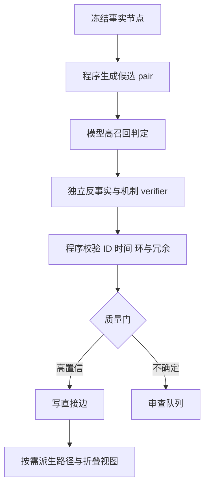

# 调查任务 8：叙事因果图——事件因果怎么抽、怎么判定、链怎么控制长度？

版本：R01  
检索截止：2026-08-09  
适用对象：以“冻结文本 → 事实句/事实节点 → 长线因果账”为主线的小说理解系统

## 结论先行

这项能力目前仍不是“把小说交给模型，稳定得到正确因果图”的成熟任务。现有高质量工作大多落在新闻、五句短故事或已经给定事件 mention 的关系分类上；真正的长篇小说还同时包含事件边界、叙述顺序与故事时间错位、隐式常识、人物误信和长距离回指。可复现的性能边界大致是：显式、句内、候选已给定的任务相对可做；跨句、隐式、开放式找边明显更难；长文档上即使只判给定事件对，因果 F1 常在 30–40 多分，零/少样本 LLM 直接画边可能更低。

对当前设计，最重要的修正有五条：

1. **“没有 A，B 还成立吗？”不能单独定义 `CAUSE`。** 学界更常把严格的 “but-for” 关系定义为 `ENABLE/PRECONDITION`；`CAUSE` 还需要正向的生成机制——A 使 B 发生，而不只是 A 是背景条件。过度决定、抢先原因和定义性前提都会让单一反事实规则出错。
2. **真值层只存相邻、直接、可举证的边。** `A→B→C` 存 `A→B`、`B→C`；`A→C` 只作为带完整路径的派生可达关系，不冒充直接因果。MAVEN-ERE 的人工标注正是先做“最小边集”，再自动补闭包。
3. **不要给整张图设置总链长硬上限。** 一部长篇可以有真实的十几段因果链。应限制的是“自动归因跨度”：默认只把 1 跳当直接边，2 跳用于派生解释，3 跳进入审查或按需展开，4 跳及以上只展示路径，不生成“远端 A 直接导致 Z”的真值边。
4. **动机、条件、时序与事件因果分层。** “他想复仇，所以去买枪”中的心理解释是 `MOTIVATES`；“有枪才能开枪”是 `ENABLES`；“扣动扳机使枪响”是 `CAUSES`；“买枪早于开枪”只是 `BEFORE`。把它们塞进同一种箭头会同时污染反事实判断和链闭包。
5. **“可回退折叠”没有可直接照搬的叙事标注标准。** 最接近的是无损图摘要、子事件层级和抽象事件聚类。可借用“超级节点 + 成员/边映射 + 精确展开”的结构，但“受伤→痊愈可折叠”应明确作为产品新规则，并且只折叠展示层；底层事实节点、直接边和证据指针不能删除。

## 一、方法与数据集对照

下表中的数字不能简单横比：有的任务已给定事件和候选 pair，有的还要找跨度；有的是句内显式关系，有的是跨句隐式关系；有的报告 pair 分类 F1，有的报告完整关系抽取 F1 或人类一致性。

| 工作 / 数据集 | 任务与节点 | 方法或标注方式 | 代表结果 | 语言 / 与小说的距离 |
|---|---|---|---|---|
| [Causal-TimeBank](https://aclanthology.org/C14-1198.pdf) | 给定事件 mention，抽取主要由显式 causal signal 连接的句内 CLINK | 规则与监督分类；可使用金标或自动 causal signal | 监督模型使用金标 signal：P 74.67 / R 35.22 / F1 47.86；自动 signal 时 F1 33.88 | 英文新闻；显式、句内，离小说隐式连图较远 |
| [EventStoryLine](https://aclanthology.org/W17-2711.pdf) / [文档级模型](https://aclanthology.org/N19-1179.pdf) | 事件 mention 为节点，识别同句和跨句因果；建文档级事件结构 | 局部神经分类 + 文档级分布与 ILP 约束 | 2019 实验中整体 P 36.2 / R 49.5 / F1 41.9；句内 F1 44.6，跨句 F1 40.6 | 英文新闻 storyline；跨句和隐式成分多，是较接近长文的基准 |
| [CaTeRS](https://aclanthology.org/W16-1007.pdf) | 320 个五句 ROCStories；事件跨度为节点；每对只取一个主要语义关系 | 专家标注 `CAUSE/ENABLE/PREVENT/CAUSE-TO-END` 与时间关系 | 事件跨度 κ=.91；完整语义图 κ=.49，基础闭包后 .51 | 英文短故事；最接近“小型小说情节图”，但篇幅极短 |
| [RED](https://aclanthology.org/W16-5706.pdf) / [早期因果试验](https://aclanthology.org/W14-2903.pdf) | 开放式事件发现 + `CAUSE/PRECONDITION` + 时间/子事件等 | 从单一 counterfactual 改为 `CAUSE=给定 A，B 不可避免`、`PRECONDITION=无 A 则无 B` | 早期 10 文档 realistic IAA F1=.5753；最终 RED 双标 raw F1 中 `BEFORE/CAUSES` 22.8、`BEFORE/PRECONDITION` 24.4 | 英文新闻、论坛与叙事；说明开放找节点+找边的一致性很低 |
| [MAVEN-ERE](https://aclanthology.org/2022.emnlp-main.60.pdf) / [代码](https://github.com/THU-KEG/MAVEN-ERE) | 112,276 事件 mention；统一 coreference、时间、因果、子事件 | 58 名训练标注员，每文档 3 人；因果标 `CAUSE/PRECONDITION`；人工只标最小边，闭包后补 | 4,480 文档、57,992 因果关系；因果 Cohen κ=69.5%；23.9% 因果关系可由闭包推出 | 英文 Wikipedia；规模最大、关系层最全，仍不是小说 |
| [Causal News Corpus](https://aclanthology.org/2022.lrec-1.246.pdf) / [RECESS](https://aclanthology.org/2023.ijcnlp-main.6.pdf) | 单句中抽 cause/effect/signal span；含显式、AltLex 与隐式表达 | 多轮众包、五项因果诊断；RoBERTa 等 span 模型 | RECESS 整体 span F1 70.51；含多条因果关系的句子 F1 53.97 | 英文新闻；适合显式/隐式对照，但无跨句图 |
| [COPES / “Event Causality Is Key”](https://aclanthology.org/2024.naacl-long.191.pdf) | 把五句故事的每个句子简化为一个节点，输出 `Node A -> Node B`；另测 GLUCOSE 因果生成 | 少样本 ChatGPT 或监督模型 | COPES 上 ChatGPT-3.5：Acc 74.26、Micro-F1 57.42、Macro-F1 69.49；GLUCOSE 直接事件因果 F1 60.75 | 英文短故事；节点已极度简化，不能外推到任意事实句长篇 |
| [LLMERE](https://aclanthology.org/2025.coling-main.500.pdf) | MAVEN-ERE 上联合生成时间、因果、子事件关系 | 文档切分、指令微调、coreference 与传递链 rationale | 最佳 Llama-3 因果 P 35.0 / R 37.2 / F1 36.0；少样本 GPT-4 仅 P 10.4 / R 6.0 / F1 7.6 | 英文长文事件关系；直接说明通用 LLM 不能无校验入库 |
| [SemDI](https://aclanthology.org/2024.emnlp-main.87.pdf) | ESC/CTB 句内候选 pair；直接测试 GPT-3.5/4 的 yes/no 因果判断 | LLM prompt 与语义依赖干预模型对比 | GPT-4 在 ESC 为 P 30.7 / R 85.7 / F1 45.2；CTB 为 P 4.6 / R 84.6 / F1 8.7 | 英文新闻；高召回、极低精度，直接量化“过连边” |
| [ECE-CCKS / DualCor](https://aclanthology.org/2022.coling-1.201.pdf) / [ICE](https://aclanthology.org/2023.emnlp-main.420.pdf) | 7,000 个中文金融句；端到端抽成对 cause/effect 事件及论元 | BERT/RoBERTa 结构化抽取；迭代约束增强 | ICE 的 ECE P 59.13 / R 51.44 / F1 55.02；同论文附录中 ChatGPT F1 6.87 | 中文金融；可做中文结构化抽取起点，不是小说常识因果 |
| [中文 News Causality Corpus](https://www.nature.com/articles/s41598-024-83678-9) / [代码](https://github.com/twinkle121/CNC) | 8,206 中文新闻句、45,919 事件对，其中 5,569 因果 pair | 层级特征增强的 pair 分类 | HFEPA P 81.9 / R 80.5 / F1 81.2；只做句内 pair 分类 | 中文新闻；论文把正边称作“explicit”，却未给 cue-based 显/隐切分，不能把 81.2 当纯显式成绩 |
| [CEG / ReCo](https://aclanthology.org/2022.emnlp-main.431.pdf) | 中文开放域因果事件图；连接 pair 成链，再判链是否可靠 | 序列标注抽 pair、聚类泛化；链模型检测 threshold effect 与 scene drift | CEG 约 160 万事件、360 万边；论文展示 pair 可对而链仍会因阈值/场景冲突而错 | 中文新闻自动图；适合作为候选常识先验，不适合作为小说事实真值 |
| [叙事因果图生成 WNU 2025](https://aclanthology.org/2025.wnu-1.10.pdf) | 对章节/短篇生成 agent-centered 节点和因果图，并评估粒度、动机、层级 | LLM 摘要节点 + RoBERTa/语言学特征 + 多轮图构造 | 在 100 个章节/故事上报告相对 GPT-4o/Claude 的偏好胜出；主要依赖人类/LLM judge，无可横比 gold F1 | 英文叙事；是少数直接做长叙事图的工作，但证据强度仍有限 |

### 现状判断

- **显式句内抽取已经有可用模型，但召回仍受 signal 检测影响。** Causal-TimeBank 使用金标 signal 时精度高、召回低；自动 signal 又明显掉分。这适合当高精度候选生成器，不足以覆盖小说中的隐式原因。
- **跨句隐式关系是主要瓶颈。** EventStoryLine 的 2019 处理版本包含 5,625 条因果链接，其中只有 117 条带显式 causal signal，约 2.1%；跨句候选的正例率只有 8%，类别极稀疏。文档级结构约束把整体 F1 推到 41.9，但离可直接写入真值层仍远。[论文](https://aclanthology.org/N19-1179.pdf)
- **“小说级”公开金标几乎空缺。** CaTeRS 和 COPES 的确是故事，但只有五句；WNU 2025 开始碰章节级文本，却没有标准化 gold 边和严格的 precision/recall。当前产品必须自建一小套长篇、冻结事实句、双盲标注的内部基准。
- **中文资源能支持预训练和局部模块，不能直接代表中文小说。** ECE-CCKS 偏金融结构化事件，中文 CNC 偏新闻 pair 分类，CEG 又含自动抽取与聚类误差。它们适合提供词法、句法和常识候选，不应作为产品标注合同的唯一依据。
- **没有找到公认的中文小说叙事因果图 benchmark。** 现成中文数据主要是财经、事故/突发新闻或自动构建的开放域事件图；产品仍需用自己的事实句定义建立中文长篇金标。

## 二、显式因果与隐式因果差多少？

没有一个跨数据集通用的“隐式比显式低 X%”。目前最可信的同集对照给出的量级是：**隐式通常低 5–14 个百分点；在一个关系抽取误差分析中，隐式漏检率约为显式的两倍。**

| 同一数据/设置 | 显式或 AltLex | 隐式 | 差值 | 该数字能说明什么 |
|---|---:|---:|---:|---|
| RECESS 人类对完整 causal span 的完全一致 | 约 69% | 约 55% | 约 14 pp | 隐式连人都更难定边界与关系 |
| RECESS 基线漏掉的金标关系 | 10/122，约 8% | 11/63，约 17% | 约 9 pp；隐式漏率 >2× | 同一模型的直接漏边差异；样本不大 |
| ESC 正例 pair 上 GPT-3.5 判断正确率 | 88.5% | 79.8% | 8.7 pp | 只看已知正例，不能反映假阳性 |
| ESC 正例 pair 上 GPT-4 判断正确率 | 100% | 94.4% | 5.6 pp | 同上，不能当完整图 precision |
| DPJL 在 ESC/CTB 的 cue 分组 Accuracy | 图读约 82% / 73% | 图读约 69% / 66% | 约 13 / 7 pp | 来自论文柱状图近似读数，不是表格 F1 |

RECESS 的对照来自其[论文](https://aclanthology.org/2023.ijcnlp-main.6.pdf)；ESC 的 LLM 对照来自 [Is ChatGPT a Good Causal Reasoner?](https://aclanthology.org/2023.findings-emnlp.743.pdf)。后者同时发现 ChatGPT 倾向高召回、低精度，即会把非因果 pair 也判为因果，所以“正例上 94.4%”绝不等于“画图准确率 94.4%”。

DPJL 的近似读数来自其[显式 signal + 隐式事件语义双任务论文](https://aclanthology.org/2022.coling-1.200.pdf)中的 Figure 4–5，只能用来判断量级。三组同集证据合起来支持“隐式通常低若干到十余个百分点”，仍不支持宣称一个统一差值。

产品评测必须分别报告：

- `explicit_precision / explicit_recall / explicit_f1`
- `implicit_precision / implicit_recall / implicit_f1`
- `intra_sentence / cross_sentence`
- `candidate_pair_classification` 与 `open_graph_extraction`
- `direct_edge` 与 `derived_path`

如果把这些混成一个 F1，模型可能靠抓“因为、导致、使得”拿到漂亮数字，却漏掉真正决定长线剧情的隐式边。

## 三、反事实判定：学界怎么用，为什么不能单独用

### 3.1 确有实践，但通常把 but-for 归为前提/使能

[RED 的早期试验](https://aclanthology.org/W14-2903.pdf) 一开始采用“若 X 未发生，Y 就不会发生”作为因果定义，随后中止并修改，因为它会把“允许核查”“定义项目”一类背景或制度性条件标成原因。修订后的 RED、[最终语料](https://aclanthology.org/W16-5706.pdf) 和 [MAVEN-ERE](https://aclanthology.org/2022.emnlp-main.60.pdf) 都把两类关系拆开：

- `CAUSE`：给定 A，B 作为结果发生，或在该标注体系中近似“不可避免”；
- `PRECONDITION / ENABLE`：如果没有 A，B 不会发生或显著更不可能发生。

[CaTeRS](https://aclanthology.org/W16-1007.pdf) 也采用相同方向：`CAUSE` 做正向的“发生 A 后，B 最可能作为结果发生”，`ENABLE` 做反向的“若 A 不发生，B 最可能不发生”。因此，当前设计中的那句反事实问题非常有用，但它更像 `ENABLE` 检测器，而不是完整的 `CAUSE` 定义。

### 3.2 人与人并不能天然标得一致

- RED 早期 10 文档、开放式找节点找关系的 realistic IAA F1 只有 .5753；更严格的情形更低。最终 RED 的双标 raw F1 也很低，部分原因是事件跨度、候选 pair 和融合关系标签同时分歧。[早期试验](https://aclanthology.org/W14-2903.pdf)、[最终 RED](https://aclanthology.org/W16-5706.pdf)
- CaTeRS 即使只有五句、事件边界一致性 κ=.91，完整语义关系图也只有 κ=.49；做基础闭包后 .51。[CaTeRS](https://aclanthology.org/W16-1007.pdf)
- 真实新闻事件图 CRAB 对 0–100 因果强度分四档时，众包 Krippendorff α=.28；把争议 pair 交给 3 名专家复核后，相关子集可到 α=.70。[CRAB](https://aclanthology.org/2023.emnlp-main.940.pdf)
- 显式候选、重训练可以显著提高一致性。基于 force dynamics 的 CCEP 只标显式 causal construction，在严格训练与筛选标注员后，causal type Cohen κ=.83；这不能外推到开放式小说连边。[CCEP](https://aclanthology.org/2022.law-1.18.pdf)

结论不是“人也不行”，而是：**先冻结节点、先生成候选 pair、再判边与类型**，会比让标注员/模型同时找节点、找 pair、定方向、定类型可靠得多。

### 3.3 单一 counterfactual 的已知失败

| 情形 | 例子 | 单一 but-for 会怎样 | 应对 |
|---|---|---|---|
| 背景条件 | 有氧气，火才燃烧 | 把氧气误当本段剧情的直接原因 | 标 `BACKGROUND/ENABLE` 或不连长线边；要求局部机制与叙事显著性 |
| 定义/预设 | 第一次婚姻是“再婚”的逻辑前提 | 形式上通过，但不是剧情推动原因 | `PRESUPPOSITION` 排除项 |
| 过度决定 | 两枪任一都足以致死 | 删除任一枪，死亡仍成立，于是漏掉贡献原因 | 若文本有明确独立机制，可标 `CONTRIBUTING_CAUSE`，并记录替代充分原因 |
| 抢先原因 | 第一枚石头先击碎玻璃，第二枚随后到达 | 第二枚在实际世界没有产生结果 | 要求实际机制链/接触路径，而非只看潜在能力 |
| 人物心理 | 他误以为朋友背叛，于是报复 | “背叛”未必是真事实，动机却成立 | 以“角色信念/目标”节点连 `MOTIVATES`，不要把假命题写成世界事实 |
| 时间偏误 | A 发生在 B 前 | 人容易把先后误判成原因 | `BEFORE` 只是必要门，不是充分证据 |

### 3.4 LLM 做反事实判定的证据

- [CRASS](https://aclanthology.org/2022.lrec-1.229.pdf) 是 274 个高质量英文 premise-counterfactual 三选一题；人工 top-1 98.18%，早期 GPT-3 Davinci 58.39%，T0pp 72.63。它测的是“反事实世界里哪个后果最可能”，不是开放式事件连边。
- [Causal Reasoning and Large Language Models](https://arxiv.org/pdf/2305.00050) 重测 CRASS 时 GPT-4 达 92.44%，但在 BIG-Bench causal judgment 只有 67.6%；对新写的结构化 actual-causality 小样本，GPT-4 的 necessity 92.8%、sufficiency 78.5%。短题高分不能外推到长文档。
- [CRAB](https://aclanthology.org/2023.emnlp-main.940.pdf) 更接近真实产品：GPT-4 二元 pair 因果 Macro-F1 73.9，四级强度 45.6；mediation/confounding/collider 等链结构的 exact match 约 5.4%–20.9%。
- 2026 年的[事实/反事实分解 ECI](https://aclanthology.org/2026.findings-eacl.220.pdf) 要求“删除 A，但固定所有不受 A 影响的事实”，分别估计事实世界和最小变化反事实世界；多采样并集成 GPT-3.5 与 Qwen 后，受控 EventStoryLine 子集准确率约从 66–71% 提升到 72–77%，同时显著降低过预测/漏预测偏差。仍不足以自动写入永久边。

## 四、可直接执行的反事实判定合同

### 4.1 候选输入

只让模型判断程序已经生成的候选 `A,B`，不要让它自由枚举整张图。每次输入至少包含：

- `source_fact_id=A`、`target_fact_id=B`
- 两条原子事实句及其最小上下文
- `story_time`，不是叙述出现顺序
- 相关角色、物件、地点的稳定 ID
- 可引用的冻结文本 span / 事实 ID
- 已知替代原因与状态快照；没有则明确 `unknown`

候选生成可以用同场景/相邻场景、共享实体、显式 signal、状态读写冲突、角色目标等规则提高召回；不能只按句距，因为倒叙和跨章伏笔会漏边。

### 4.2 六道判定门

1. **实际性门**：A、B 都是当前真值层实际发生/成立的事实；假设、计划、角色误信转去各自层。
2. **时间门**：A 的故事时间不晚于 B 的起因阶段；允许 overlap，不以文本先后代替故事时间。
3. **正向机制门**：A 是否回答“为什么 B 在这里发生”，并能说出局部机制？只有共现、同主题、常见相邻或时间先后则不通过。
4. **最小变化反事实门**：删除 A，保持所有不受 A 影响的事实不变。B 是 `UNCHANGED / LESS_LIKELY / FAILS / UNKNOWN` 哪一种？不要强迫“绝对不可能”。
5. **替代原因门**：是否存在独立、足以产生 B 的 C？若有，but-for 失败不能自动否定 A；但只有文本明确支持 A 的实际机制时，才可标贡献原因。
6. **证据门**：必须返回支持方向、机制和反事实判断的事实/文本 ID；无法举证或需要补写新事件时输出 `UNCERTAIN`。

### 4.3 类型决策

```text
if B 在最小变化世界中同样成立，且无独立的实际机制证据:
    NONE
elif A 使 B 不发生、停止或显著降低其发生可能:
    PREVENTS_OR_TERMINATES
elif A 是角色的目标、欲望、情绪或信念，B 是其有意行动:
    MOTIVATES
elif 删除 A 会使 B 失败/显著更不可能，但 A 本身不生成 B:
    ENABLES
elif A 通过局部实际机制使 B 发生:
    CAUSES
else:
    UNCERTAIN
```

如果 `CAUSES` 同时满足 but-for，可额外写 `necessary_in_context=true`；不要因此再造一条重复的 `ENABLES` 边。

### 4.4 推荐输出结构

```json
{
  "source_fact_id": "F012",
  "target_fact_id": "F019",
  "verdict": "YES",
  "edge_type": "ENABLES",
  "direction": "F012_TO_F019",
  "story_time_gate": "PASS",
  "mechanism": "钥匙解除门锁这一局部障碍；它不主动生成进入行为",
  "counterfactual": {
    "intervention": "REMOVE_F012",
    "held_fixed_fact_ids": ["F013", "F015"],
    "changed_fact_ids": ["F019"],
    "target_outcome": "FAILS"
  },
  "alternative_sufficient_causes": [],
  "support_mode": "TEXT_EXPLICIT",
  "evidence_fact_ids": ["F012", "F019"],
  "evidence_span_ids": ["S88", "S94"],
  "confidence": "HIGH",
  "uncertainty_reason": null
}
```

`confidence` 应是离散审查级别，不应直接把模型自报的 0.87 当校准概率。程序负责验证 ID 存在、方向不违反故事时间、证据 span 属于冻结文本、边未重复；模型只做语义判断，不能给自己签质量结论。

## 五、传递边、链长与“强度衰减”

### 5.1 `A→C` 要不要存？

推荐明确分成三种对象：

| 对象 | 是否写入长线真值账 | 例子 | 用途 |
|---|---|---|---|
| `DIRECT_EDGE` | 是 | `A→B`、`B→C` | 有独立文本/事实证据的局部因果 |
| `DERIVED_PATH` | 否；可缓存、可重建 | `A-[A→B→C]->C` | 查询、解释、影响分析 |
| `DIRECT_LONG_EDGE` | 只有 A→C 本身另有证据才是 | 文本明确说 A 直接触发 C，即使中间也有 B | 不能靠两条邻边自动升级 |

[MAVEN-ERE](https://aclanthology.org/2022.emnlp-main.60.pdf) 要求人先做最小标注：已有 A→B、B→C 时，A→C 可以不标，之后程序自动完成；其 23.9% 因果关系可由传递规则推出。这与“底层只存独立位置、不跳存”的意向高度一致。通用图论里，这接近 DAG 的[传递约简](https://epubs.siam.org/doi/10.1137/0201008)：保存仍能保持可达性的最小边集。

还有两个更直接的工程先例：[proScript](https://aclanthology.org/2021.findings-emnlp.184/) 要求金标是无环、无 shortcut edge 的 transitive-reduction DAG；[IncSchema](https://aclanthology.org/2023.acl-long.312/) 在全局去环后，对时序边与层级边分别做传递约简。它们不是纯小说因果标注，但共同支持“直接边与可重建闭包分层”。反过来，EventStoryLine 原始的宽泛 `PLOT_LINK` 被作者明确视为非传递关系，这也说明只有经过类型白名单的边才能闭包。

但不要把“闭包可推出”理解成“实际因果普遍可传递”。哲学和结构因果文献有大量 switching、short circuit、threshold mismatch 反例；[Halpern](https://www.cs.cornell.edu/home/halpern/papers/transitivity.pdf) 专门研究因果在什么附加条件下才可传递。中文 [ReCo](https://aclanthology.org/2022.emnlp-main.431.pdf) 也给出两个非常产品化的断链原因：

- **threshold effect**：A 只带来少量 B，而 B→C 需要大量 B；
- **scene drift**：两条边里的同名 B 实际属于不同场景。

所以派生路径必须保留中间节点、场景和阈值，不应把它压成新的直接边。

### 5.2 哪些类型允许派生？

MAVEN-ERE 使用的白名单是：

- `CAUSE + CAUSE => CAUSE`
- `CAUSE + PRECONDITION => PRECONDITION`
- `PRECONDITION + PRECONDITION => PRECONDITION`

它没有把所有排列都设为传递。对产品应再保守一层：右侧统一写成 `DERIVED_CAUSAL_PATH`，并附 `derived_role={cause_like, enable_like}`，而不是生成新的 `DIRECT CAUSE/PRECONDITION`。`ENABLE + CAUSE`、`MOTIVATES + CAUSE`、`BEFORE + CAUSE` 不做自动闭包。

### 5.3 链长定几跳？

文献没有一个经过跨语料验证的“小说因果最多 3 跳”标准，也没有普遍采用的固定指数衰减。相关工作更常做传递闭包、GNN 高阶推理或专门判链可靠性，而非用统一长度截断。把“3 跳”说成学界共识是不准确的。

建议采用下面的**产品起始合同**，并在内部金标上调参：

| 跳数 | 系统动作 | 能否写成“远端 A 导致 Z” |
|---:|---|---|
| 1 | 独立判边；通过证据和质量门后写 `DIRECT_EDGE` | 可以 |
| 2 | 自动生成 `DERIVED_PATH`，用于解释和检索；不造直边 | 只能说“经由 B 影响” |
| 3 | 默认不自动归因；进入 verifier/人工审查，或用户按需展开 | 必须展示完整路径和不确定项 |
| ≥4 | 仅路径导航、摘要视图或影响候选 | 不允许压成单句强因果 |

依据不是神秘的“叙事三环定律”，而是三类可观测风险：

- 每一跳都有边误差，路径全对的机会会快速下降。只作压力测算，若相邻边正确率为 .75 且暂时假设误差独立，2/3/4 跳全对约为 .56/.42/.32；真实误差会相关，不能把这些当正式概率。
- ReCo 证明即使两条 pair 各自合理，拼接仍可能出现阈值冲突或场景漂移。
- CRAB 中 GPT-4 对链结构的 exact match 只有约 5–21%，说明“pair 会判”不等于“链会拼”。
- [CURIE](https://aclanthology.org/2022.csrr-1.7/) 把 1 跳称为 immediate、>1 跳称为 eventual；其 50 条两跳生成路径内部一致性只有 58%，与 gold 一致约 48%，再次显示多跳不是边的机械相乘。

全图的真实链可以无限延伸；被限制的是自动闭包、查询默认深度和自然语言归因强度。这样既避免无限传递，又不会删除长篇中真实存在的中间剧情。

### 5.4 是否建“随链长衰减”的分数？

可以建**排序分数**，不应叫“因果概率”：

```text
path_rank = min(calibrated_edge_supports) × hop_penalty(h)
hop_penalty(h) = λ^(h-1),  λ 初始可设 0.8
```

`min` 表示整条链受最弱边限制；`λ` 只用于检索/UI 排序，0.8 是待实验的工程先验，不是文献常数。永久判断仍看每条边的证据、场景与阈值。若边分数尚未做独立校准，宁可用 `HIGH/MEDIUM/LOW + hop_count`，不要相乘制造伪精度。

## 六、叙事事件图应该怎样表示

### 6.1 现有表示的节点粒度

现有工作至少有五种粒度：

- **事件 mention**：文本中的动词、状态或事件跨度，如 EventStoryLine、RED、MAVEN-ERE；适合精确证据对齐。
- **谓词-论元事件**：predicate + protagonist/typed dependency，如[叙事事件链](https://aclanthology.org/P08-1090.pdf)；适合 schema 学习，但会丢掉具体时空。
- **整句事件**：COPES 把每句当一个节点；便于 LLM 输出，但一句多事件时会混边。
- **过程/子事件层级**：一个粗事件包含若干原子 subevent，如 [APSI](https://aclanthology.org/2020.emnlp-main.119.pdf)、HiEve/MAVEN-ERE；适合展开与收起。
- **跨实例抽象事件**：[ACCESS](https://aclanthology.org/2025.naacl-long.49.pdf) 把 GLUCOSE 中相似事件 mention 聚成 725 个抽象节点、1,494 条因果关系；适合常识图，不是单部小说的事实节点。

当前系统已经把事实句作为中间真值节点，推荐继续坚持，但增加一个原子性门：**一个节点只陈述一个可定时、可指认参与者的发生或状态变化。** “他拔枪并射伤甲，乙因此逃跑”至少拆成拔枪、射伤、逃跑三个节点；否则任何一条边都无法精确引用。

### 6.2 边类型草案

建议不要只做 `causal=true/false`，而是把“实际因果图”“解释图”“时间/结构图”“规则层”分开：

| 层 | 边类型 | 含义 | 是否做因果闭包 |
|---|---|---|---|
| 实际因果 | `CAUSES` | A 通过局部实际机制使 B 发生 | 只产生带路径的派生关系 |
| 实际因果 | `ENABLES` | 无 A 则 B 失败/显著更不可能；A 本身不足以生成 B | 只按白名单派生 |
| 实际因果 | `PREVENTS` | A 阻止 B 发生 | 否 |
| 实际因果 | `TERMINATES` | A 使已持续的 B 状态/过程结束 | 否；可视作有相位信息的特殊因果 |
| 人物解释 | `MOTIVATES` | 角色的目标、情绪、欲望或信念解释其有意行动 | 否；source 必须带角色视角 |
| 时间 | `BEFORE / OVERLAPS / CONTAINS` | 故事时间关系 | 只做时间闭包，不能推因果 |
| 结构 | `SUBEVENT_OF / PART_OF` | 细事件属于粗事件/episode | 只做层级展开 |
| 指称 | `COREF / SAME_EVENT` | 两个 mention 指同一事件 | 用于节点归一，不是剧情边 |
| 条件/规则 | `IF_THEN / TRIGGER_WHEN` | 计划、世界规则、约束；未必实际触发 | 放计划/约束层，不写入已发生因果图 |

动机应与因果分开。[CICERO](https://aclanthology.org/2022.acl-long.344.pdf) 把 cause、subsequent event、prerequisite、motivation、emotion 作为五个不同推断维度；[GLUCOSE](https://aclanthology.org/2020.emnlp-main.370.pdf) 也把“直接事件原因/使能”和“情绪或基本驱动力造成的动机”拆开。更早的 [Story Intention Graph / PersonaBank](https://aclanthology.org/anthology-files/pdf/L/L16/L16-1163.pdf) 直接把故事事实的 timeline layer 与人物意图/计划的 interpretive layer 分层。这和本项目“事实、计划、人物认知不能互相污染”完全同向。

MVP 可以在 UI 上只露出四类：`导致 / 使能 / 阻止或结束 / 动机`；时间、指称、层级和条件仍在后台独立维护。

Cause 与 Enable 本身也可能难以稳定区分：GLUCOSE 的标注设计最终把“direct cause or enable”合并为一个维度。产品可以保留两类以服务反事实与推理，但应允许 `CAUSE_OR_ENABLE / UNRESOLVED_CAUSAL` 进入审查队列，避免模型为了满足枚举而制造假精确。

## 七、“可回退折叠”：先例、差距与推荐实现

### 7.1 有没有直接先例？

截至检索日，没有找到把“角色状态从 S0 变 S1 又回到 S0”定义为可折叠叙事因果段的通用标注方案。最接近的三类工作解决的是不同问题：

1. **无损图摘要。** [Graph Summarization with Bounded Error](https://www.snl.salk.edu/~navlakha/pubs/sigmod2008.pdf) 用“超级节点/超级边 + 修正集”表示原图；[SLUGGER](https://www.computer.org/csdl/proceedings-article/icde/2022/088300a472/1FwFvwzkqbu) 支持可嵌套超级节点，并能精确重建原图；[MoSSo](https://dl.acm.org/doi/10.1145/3394486.3403074) 让动态图在增删边时增量更新无损摘要。
2. **子事件层级。** MAVEN-ERE/HiEve 用 `SUBEVENT` 把原子事件组织成较粗过程，保留上下层展开关系，但不以状态是否恢复决定折叠。
3. **抽象事件聚类。** ACCESS 将跨故事的相似事件实例归入一个抽象节点，保留实例成员；这是“类型抽象”，不是同一故事中的连续片段折叠。
4. **显著子图摘要。** [Event Graph Summarization](https://aclanthology.org/2021.emnlp-main.519/) 从新闻事件图选共享论元、时序连贯且结构显著的子图；这是有损摘要，不保证逐节点复原，但可借其“保留关键因果头尾”的显著性思想。

因此能抄的是**表示结构**，不能抄“可回退”这一语义判据。

### 7.2 推荐：只折叠视图，不折叠真值

建立 `EPISODE_VIEW` 超级节点：

```json
{
  "episode_view_id": "EV07",
  "member_fact_ids": ["F101", "F102", "F103"],
  "member_direct_edge_ids": ["E41", "E42"],
  "entry_ports": ["F101"],
  "exit_ports": ["F103"],
  "covered_story_time": ["T81", "T86"],
  "net_state_delta": [],
  "durable_residue": [],
  "summary": "甲受伤并在治疗后恢复",
  "expandable": true
}
```

只有同时满足下面条件才自动标为“可折叠候选”：

- 成员是故事时间连续、内部连通的子图；
- 所有外部边都能通过明确的 entry/exit port 重接，不能产生悬空边；
- 对受控状态字段，结束快照等于开始快照，即 `net_state_delta=0`；
- 没有永久变化：死亡、断肢、身份、承诺、债务、所有权、关系、阵营、公开秘密、已获得知识等；
- 没有未清的伏笔、条件、计划或跨段因果尾；
- 超级节点保存成员 fact/edge ID，可精确展开；摘要本身不是新的事实真值。

“受伤→痊愈”也不一定可折叠：若角色因此得知幕后凶手、欠下人情、错过决战，身体状态虽恢复，`durable_residue` 仍非空。是否可折叠必须做**多字段净变化检查**，不能只看生命值回满。

### 7.3 不可回退状态怎样收缩

“断臂”可以提升为人物永久字段，但不要删除来源：

```json
{
  "character_id": "C03",
  "field": "left_arm_status",
  "value": "LOST",
  "effective_from_fact_id": "F220",
  "origin_fact_id": "F220",
  "caused_by_edge_ids": ["E88", "E89"],
  "supersedes_state_id": "CS17"
}
```

展示层可以把“埋伏→爆炸→断臂→送医”收成一个 episode；底层边仍在，永久字段通过 `origin_fact_id` 和 `caused_by_edge_ids` 反向展开。这正好满足“压缩视图可重建、不能成为第二份真值”的系统约束。

## 八、LLM 直接连边：可靠性、幻觉与约束

### 8.1 可靠性边界

“幻觉率”在 ECI 论文里不是统一指标。为了贴近产品，可把 `1-precision` 当“预测边中不受 gold 支持的比例代理”，把 `1-recall` 当漏边率；它们只对该数据和标签有效，不能代表开放小说的绝对幻觉率。

| 设置 | P | R | F1 | 假边代理 `1-P` | 漏边率 `1-R` |
|---|---:|---:|---:|---:|---:|
| GPT-4 5-shot，MAVEN-ERE causal | 10.4 | 6.0 | 7.6 | 89.6% | 94.0% |
| GPT-3.5 5-shot，MAVEN-ERE causal | 3.9 | 4.8 | 4.3 | 96.1% | 95.2% |
| 指令微调 LLMERE Llama-3，MAVEN-ERE causal | 35.0 | 37.2 | 36.0 | 65.0% | 62.8% |
| GPT-4 yes/no，ESC 句内 pair | 30.7 | 85.7 | 45.2 | 69.3% | 14.3% |
| GPT-4 yes/no，Causal-TimeBank pair | 4.6 | 84.6 | 8.7 | 95.4% | 15.4% |

前三行来自 [LLMERE](https://aclanthology.org/2025.coling-main.500.pdf)，后两行来自 [SemDI](https://aclanthology.org/2024.emnlp-main.87.pdf)。同一个 GPT-4 可以在一种 prompt 下同时少报，在另一种 yes/no prompt 下严重过报，说明“幻觉率/漏边率”不是模型常数，而是任务定义、负例比例、候选生成与输出协议的共同产物。这些极低结果也包含严格输出格式、稀疏标签和长文档联合关系任务的难度；它们不意味着 GPT-4 在任何两句因果题上都只有 7.6 F1。相反，COPES 的五句、句子级节点可到 Macro-F1 69.49。合起来看：**节点越干净、候选越受控、上下文越短，LLM 越可用；开放长文全图生成最危险。**

CRAB 又补上一层：GPT-4 二元 pair 可到 73.9 Macro-F1，但四级强度只 45.6，链结构 exact match 约 5–21%。系统不能因为 pair 分类看起来尚可，就让模型自由补齐整条因果链。

### 8.2 哪些约束已有实证支持？

| 约束 | 证据 | 结论 |
|---|---|---|
| 文档级全局结构约束 | EventStoryLine 的局部模型加 ILP 后，整体 F1 从约 35.1 提到 41.9 | 全局一致性和结构分布确有帮助 |
| 上下文切分 + 关系 rationale | LLMERE 去掉 coreference rationale，causal F1 降 1.0；去掉 transitive-chain rationale，降 0.7 | 让模型显式利用已验证关系和 coreference 有小而稳定的收益 |
| 最小变化反事实 + 事实/反事实分解 + 多采样 | 2026 ECI 受控子集准确率约提升 4–6 pp，过预测/漏预测偏差明显下降 | 比一句 yes/no counterfactual 更可靠，但仍需质量门 |
| 候选 pair 与负例控制 | EventStoryLine 跨句正例仅约 8%；LLMERE 专门做负采样与文档 partition | 必须正视稀疏性，不能只喂正例或让模型自由枚举 |
| 程序校验时间/传递/ID | 多个 ERE 工作用 ILP、闭包或逻辑规则后处理 | 机械约束应交给程序，不消耗模型判断 |
| 原子边列表，不一次生成整链 | GLUCOSE 上结构化 `Causal Graph` 箭头输出 F1 60.75，完整 `Event Chain` 只 43.71 | 局部边输出明显优于一次拼整链 |
| 多关系专家 + judge | [Koupaee et al.](https://aclanthology.org/2025.acl-long.1269.pdf) 中 GPT-4o causal-F1 由 66.17 提到 75.62；整体 graph-level Macro-F1 由 71.48 到 79.21 | 分解 temporal/discourse/precondition/common-sense 后再裁决有效，但调用成本更高 |
| 全文 grounded verifier + 补漏 | [CALLMSAE](https://aclanthology.org/2025.naacl-long.112.pdf) 的人工 causal-edge correctness 从 0.48 提到 0.65 | 逐边核验提精度，但 0.65 仍不能当自动 gold |
| 分阶段生成 + yes/no/unknown + 去环/约简 | [IncSchema](https://aclanthology.org/2023.acl-long.312/) 相对一次性 DOT 图，temporal F1 20.9→28.1、hierarchy F1 17.5→48.5 | 先分关系、再逐对验证和全局后处理优于一把生成 |

值得特别注意：同一 [Sun et al. 2024](https://aclanthology.org/2024.naacl-long.191.pdf) 实验中，只在 prompt 里塞入“若无 A 则无 B”的 counterfactual 定义，GLUCOSE F1 只有 49.12，低于结构化箭头边列表的 60.75。反事实适合做第二阶段 verifier，不适合单独承担候选生成和类型定义。

### 8.3 哪些常见做法尚没有强证据？

- **要求引用证据**非常适合审计和阻止模型补写不存在的事实，但公开 ECI 研究尚不足以证明它在所有语料上直接提高边 F1。应把它作为入库必要条件，同时单独实验其 precision/recall 影响。
- **限制每节点出边数**没有通用学术阈值。真实事故或秘密曝光可能合法地造成很多后果。可限制“每个 target 首轮提交最多 2 条高置信入边、其余进候选队列”，但这应是审查预算，不是真值规则；否则会系统性漏掉分叉。
- **让模型自报 confidence**通常未校准，不能当质量证明。应以开发集校准、双模型一致、证据充分度和抽样人工审查组合成外部质量分。

### 8.4 推荐抽取流水线



关键点：

- 候选生成和语义判定分开；
- 每轮只判一种关系，推荐顺序为 `coreference/hierarchy → story-time → causal/motivation`；前序结果只作为约束，不混成同一标签；
- 显式与隐式用不同阈值，隐式边默认需要第二次验证；
- verifier 看不到第一次模型的结论措辞，只看候选和证据，降低顺从偏差；
- 对容易反向的 pair 分别询问 `A→B`、`B→A`，允许 `yes/no/unknown`；若两向都 yes，交给冲突解析而非任选一个；
- 只允许引用现有 fact/span ID，输出的新自然语言不得创建事实；
- 程序拒绝故事时间逆向、重复、违反类型白名单的闭包以及无证据 ID 的边；
- 删除低支持边后可做 2–3 轮补漏，直到没有新边；轮数是计算预算，不是因果链上限；
- 每次抽取保存模型版本、提示版本、候选集、拒绝原因，便于回归测试；
- 评测同时算 edge precision/recall、方向、类型、证据命中、图级 path exact match 和分叉/汇合保持率。

## 九、给当前设计的三条具体建议

### 建议 A：把反事实标准改成“双轴 + 三态”

不要再用“成立→不连边”这一条二元规则。改为：

- 轴 1 `productive_mechanism`：A 是否通过实际局部机制使 B 发生？
- 轴 2 `counterfactual_dependence`：在最小变化世界移除 A，B 是否失败或显著更不可能？
- 输出 `YES / NO / UNCERTAIN`，并从 `CAUSES / ENABLES / PREVENTS / TERMINATES / MOTIVATES / NONE` 中选类型。

判定矩阵：

| 正向机制 | 反事实依赖 | 默认结果 |
|---|---|---|
| 是 | 是 | `CAUSES`，并记 `necessary_in_context=true` |
| 是 | 否 | 有替代充分原因时可为 `CONTRIBUTING_CAUSE`；否则复核 |
| 否 | 是 | `ENABLES/PRECONDITION` |
| 否 | 否 | `NONE` |
| 任一未知 | 任一未知 | `UNCERTAIN` |

所有正边必须含最小变化说明、机制、替代原因检查和证据 ID。

### 建议 B：链不截断，归因按 1/2/3 跳分级

- **存储层**：只存 1 跳直接边；真实链长度不限。
- **派生层**：2 跳自动派生但不物化为直边；必须显示中间节点。
- **审查层**：3 跳需要链可靠性检查，尤其查 threshold effect、scene drift、角色/物件 coreference。
- **表达层**：4 跳及以上只展示“路径/影响链”，禁止写成一句强因果。

这比“最多三环，后面全部砍掉”更符合长篇，也与最小边集、可重建视图的架构一致。初始阈值应在 50–100 个真实章节的内部金标上，根据 2-hop/3-hop path precision 再调整。

### 建议 C：MVP 边清单分层，不混成一张万能因果图

- 真值因果：`CAUSES / ENABLES / PREVENTS / TERMINATES`
- 人物解释：`MOTIVATES`
- 时间骨架：`BEFORE / OVERLAPS / CONTAINS`
- 结构骨架：`SUBEVENT_OF / COREF`
- 计划与规则：`IF_THEN / TRIGGER_WHEN`

查询时可以联合展示，存储和闭包必须分开。尤其是 `MOTIVATES`：source 绑定角色视角的目标/信念/情绪，target 只能是该角色的有意行动；它不自动推导物理后果。

## 十、建议的最小实验

在任何大规模小说回填前，先做一个能回答设计争议的小金标：

- 取 60–100 个章节，覆盖顺叙、倒叙、多 POV、隐式因果、群像、分叉汇合；
- 先由一组人冻结事实节点，再由另一组人只在固定候选 pair 上判边，避免把节点分歧混进关系 IAA；
- 每条候选由 3 人独立标 `type + direction + evidence + counterfactual outcome + mechanism + uncertain`，多数票后专家裁决；
- 报告 pair 级 precision/recall/F1、Cohen/Fleiss κ、图级 path exact match、2/3/4 跳路径精度；
- 显式/隐式、句内/跨句、动机/物理因果、可回退/永久状态分别切片；
- 对比四个系统：直接全图 prompt、受控 pair prompt、pair + 独立 verifier、pair + verifier + 程序闭包/冗余过滤；
- 折叠单独评测：可展开重建率必须 100%，外部边重接正确率 100%，`durable_residue` 漏检率优先压低。

一个务实的上线门槛是：先追求**直接边高 precision**，把不确定和隐式长距边放入候选层；不要以低 precision 换表面上完整的图。因为漏边仍可后补，错误的永久因果边会污染人物字段、召回、摘要和后续创作。

## 关键论文与数据集入口

### 叙事与文档级事件因果

- [EventStoryLine Corpus](https://aclanthology.org/W17-2711.pdf)
- [Modeling Document-level Causal Structures for ECI](https://aclanthology.org/N19-1179.pdf)
- [CaTeRS](https://aclanthology.org/W16-1007.pdf)
- [RED](https://aclanthology.org/W16-5706.pdf) 与 [RED Guidelines](https://github.com/timjogorman/RicherEventDescription/blob/master/guidelines.md)
- [MAVEN-ERE](https://aclanthology.org/2022.emnlp-main.60.pdf) 与 [GitHub](https://github.com/THU-KEG/MAVEN-ERE)
- [Event Causality Is Key to Computational Story Understanding](https://aclanthology.org/2024.naacl-long.191.pdf)
- [Beyond LLMs: Causal Graph Generation from Narrative Texts](https://aclanthology.org/2025.wnu-1.10.pdf)
- [IncSchema: Incremental Event Schema Induction](https://aclanthology.org/2023.acl-long.312/) 与 [代码](https://github.com/raspberryice/inc-schema)
- [CALLMSAE: Multi-Step LLM Event Graph Extraction](https://aclanthology.org/2025.naacl-long.112/) 与 [代码](https://github.com/Xingwei-Tan/CALLMSAE)
- [Collaborative Causal Graph Generation](https://aclanthology.org/2025.acl-long.1269/) 与 [代码](https://github.com/StonyBrookNLP/causal-graphs)

### 反事实、标注与 LLM

- [Challenges of Adding Causation to RED](https://aclanthology.org/W14-2903.pdf)
- [CCEP / Force Dynamics Annotation](https://aclanthology.org/2022.law-1.18.pdf)
- [Causal News Corpus](https://aclanthology.org/2022.lrec-1.246.pdf) 与 [RECESS](https://aclanthology.org/2023.ijcnlp-main.6.pdf)
- [CRASS](https://aclanthology.org/2022.lrec-1.229.pdf) 与 [数据](https://github.com/apergo-ai/CRASS-data-set)
- [Causal Reasoning and Large Language Models](https://arxiv.org/pdf/2305.00050) 与 [代码](https://github.com/py-why/pywhy-llm)
- [CRAB](https://aclanthology.org/2023.emnlp-main.940.pdf) 与 [数据](https://github.com/epfl-nlp/CRAB)
- [Fact–Counterfact Decomposition for ECI](https://aclanthology.org/2026.findings-eacl.220.pdf)
- [LLMERE](https://aclanthology.org/2025.coling-main.500.pdf)
- [SemDI: Direct LLM ECI and Semantic Intervention](https://aclanthology.org/2024.emnlp-main.87.pdf)

### 中文

- [DualCor / ECE-CCKS](https://aclanthology.org/2022.coling-1.201.pdf) 与 [GitHub](https://github.com/cuishiyao96/ECE)
- [ICE / Iterative Constraint Enhancement](https://aclanthology.org/2023.emnlp-main.420.pdf)
- [Chinese News Causality Corpus](https://www.nature.com/articles/s41598-024-83678-9) 与 [GitHub](https://github.com/twinkle121/CNC)
- [ReCo / Chinese Event Graph chain reliability](https://aclanthology.org/2022.emnlp-main.431.pdf)

### 图传递、抽象与折叠

- [MAVEN-ERE 的最小边与闭包规则](https://aclanthology.org/2022.emnlp-main.60.pdf)
- [Aho et al., Transitive Reduction of Directed Graphs](https://epubs.siam.org/doi/10.1137/0201008)
- [Halpern, Sufficient Conditions for Causality to be Transitive](https://www.cs.cornell.edu/home/halpern/papers/transitivity.pdf)
- [ACCESS: Abstract Causal Event Discovery](https://aclanthology.org/2025.naacl-long.49.pdf)
- [Graph Summarization with Bounded Error](https://www.snl.salk.edu/~navlakha/pubs/sigmod2008.pdf)
- [SLUGGER: Lossless Hierarchical Summarization](https://www.computer.org/csdl/proceedings-article/icde/2022/088300a472/1FwFvwzkqbu)
- [MoSSo: Incremental Lossless Graph Summarization](https://dl.acm.org/doi/10.1145/3394486.3403074)
- [Event Graph Summarization](https://aclanthology.org/2021.emnlp-main.519/) 与 [代码](https://github.com/limanling/event-graph-summarization)

## 证据边界

- 报告优先采用论文、官方数据集页和作者代码库；未把二手博客当作结论依据。
- 不同任务的 F1、accuracy、IAA 不可直接比较，正文已尽量标出候选是否给定、是否开放找跨度、是否只看正例。
- “1/2/3 跳分级”“λ=0.8 排序惩罚”“可回退折叠门槛”是基于现有证据提出的工程起始假设，不是学界标准，必须用项目自己的中文长篇金标验证。
- 当前最强的可迁移共识是：节点先冻结、关系分型、最小边存储、闭包派生、证据可追溯、不确定性不强判。
