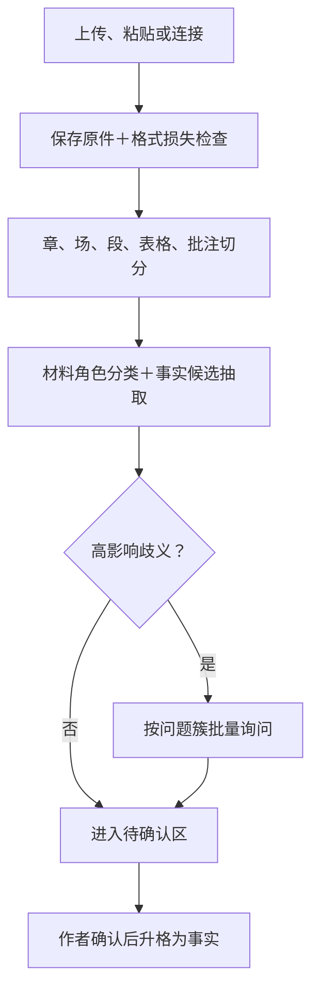

# 故事创作工具「输入侧」深度调查

截至 2026 年 8 月 13 日。

先给核心结论：

- 没有公开、可信的“首次输入六类占比”。竞品入口、社区帖子和功能投票只能证明需求存在，不能换算市场比例。
- 输入侧首先是“来源、权属、生命周期和可信度分诊”，其次才是文件解析。分类成功不等于可以写入事实账。
- 最值得优先支持的是粘贴、TXT、DOCX/WPS、Markdown，以及人物表/时间线常见的 CSV/XLSX；Scrivener、Notion、幕布、EPUB放第二层。
- “一坨字”可以自动分类，但只能生成可逆的候选标签。章节错序、正文漏失、AI推测被当成事实，容忍度接近零。
- 拆书至少是三种产品：自己的旧稿、别人的爆款、同人原作。
- 热点写作真实存在，短故事尤甚；正确产品不是“热搜一键成文”，而是“来源化事实卡→抽象议题→人物与隐私风控→匿名虚构或授权改编”。

证据标记：

- 【强】官方文档/更新日志、法律法规、法院案例、同行评审研究。
- 【中】官方反馈板、厂商未披露方法的数据、媒体从业者采访、多条一致社区证据。
- 【弱】单个论坛帖子、自媒体经验、营销宣传。
- “实锤”表示产品方或法院确认；“抱怨”表示用户自述，不能证明发生率。

------

## 1. 首次输入的真实分布

### 结论：六类输入都存在，但没有一组可辩护的百分比

| 首次状态                     | 公开证据                                                     | 能得出的结论                                               |
| ---------------------------- | ------------------------------------------------------------ | ---------------------------------------------------------- |
| 空白开始                     | Novelcrafter 官方原话：“Most people start…with a blank canvas.” [官方帮助](https://www.novelcrafter.com/help/getting-started/general/getting-started-with-novelcrafter)【中】 | 厂商观察到空白开始常见；未给样本、时间和分母，不能推算占比 |
| 一句话点子                   | Sudowrite Story Bible 支持从简单 Braindump 逐步生成梗概、人物、世界和大纲。[官方说明](https://docs.sudowrite.com/using-sudowrite/1ow1qkGqof9rtcyGnrWUBS/what-is-story-bible/jmWepHcQdJetNrE991fjJC)【强】 | 入口真实存在                                               |
| 梗概                         | Sudowrite 可从已有信息生成或导入 Synopsis，再推进到大纲。[官方说明](https://docs.sudowrite.com/using-sudowrite/1ow1qkGqof9rtcyGnrWUBS/synopsis/r4GGUdR23VKcK2WrQVdheb)【强】 | 入口真实存在                                               |
| 人设＋世界观                 | Sudowrite 分别提供 Characters、Worldbuilding 智能导入；Plottr、Campfire也有独立人物/地点模块。【强】 | 大量工具把它当独立材料类型，但没有首用比例                 |
| 完整或半成品大纲             | Sudowrite 支持直接粘贴或上传 Outline；CSV可避免AI改写。[官方导入文档](https://docs.sudowrite.com/using-sudowrite/1ow1qkGqof9rtcyGnrWUBS/importing-files/rbGUgrZM6tNuXFG1hjDFyS)【强】 | 成熟作者带计划迁移是明确场景                               |
| 已写章节、完整书稿或混合材料 | Sudowrite 明确承接 partial/complete manuscript，甚至原话所说的“less-than-organized pile of notes”；Novelcrafter也提供旧稿导入。【强】 | 旧稿和混合材料不能被当成边缘场景                           |

需求强度的旁证：

- Novelcrafter“导入完整书稿并自动建立 Codex”在调研时约有120票，用户问：“Why do I need to re-add all the details…”；团队标记为 planned。[反馈板](https://feedback.novelcrafter.com/feedback/p/import-a-completed-novel-and-build-an-automatic-codex)【需求信号·中】
- 原生 Scrivener 导入约43票。[反馈板](https://feedback.novelcrafter.com/feedback/p/scrivener-import)【需求信号·中】
- World Anvil旧稿导入建议有32名投票者，但投票体系不同，不能横向比较。[反馈板](https://www.worldanvil.com/community/voting/suggestion/a3a1f070-144c-48b5-92a5-d975c6957950/view)【需求信号·中】

因此，不建议做任何“空白开始40%、大纲20%……”式市场结论。

产品上线时应直接补齐这个数据空白：首次让用户自选以下入口，同时记录系统检测结果。

1. 我只有一个点子；
2. 我有梗概、设定或大纲；
3. 我已经写了部分正文；
4. 我有完整旧书；
5. 多种材料混在一起；
6. 我想拆一本参考作品或使用热点材料。

三个月后再用真实事件数据决定首页排序。

------

## 2. 存量材料格式盘点

### 2.1 作者的材料不是一种“格式”，而是几套存储生态

没有可信的中国小说作者格式占比。唯一接近的公开调查来自非虚构作者，其中61%以 Word 为主要工具；人群明显不匹配，不能外推中国网文作者。[调查](https://bernoff.com/blog/most-authors-still-use-microsoft-word-but-other-writing-tools-have-their-fans)【弱方向性证据】

| 存放位置                             | 实际交换格式                                          | 导入建议                                                     |
| ------------------------------------ | ----------------------------------------------------- | ------------------------------------------------------------ |
| Word、WPS、本地文件夹                | DOC/DOCX/WPS、TXT、RTF、ODT                           | 主通道。DOCX是跨工具最大公约数；TXT必须识别UTF-8、GBK等编码  |
| 石墨、腾讯文档、在线WPS、Google Docs | 通常导出DOCX、PDF或TXT                                | 把平台当“存放位置”，不要要求用户理解解析器；提供一屏式导出指引。[石墨导出](https://shimo.im/help/articles/AWJBB6SGABTK6.html)、[腾讯文档](https://docs.qq.com/) |
| Notion                               | Markdown＋CSV ZIP、HTML、PDF                          | 优先接 Markdown/CSV ZIP，保留页面层级和数据库字段。[官方导出](https://www.notion.com/help/export-your-content) |
| 幕布                                 | Word、HTML、OPML、PDF                                 | OPML最适合保留大纲层级，Word作为通用回退。[官方说明](https://mubu.com/help/articles/pc/advanced_skills/de546d9a568748b38707b5242fe9c76f/) |
| Scrivener                            | `.scriv`项目或ZIP，内含正文、Synopsis、Research、批注 | 不应简单压成一篇DOCX，否则会丢文件夹、摘要和研究材料         |
| EPUB                                 | 已出版或下载版本                                      | 更像“完成品/参考源”，不是可编辑真源；导入后默认放入旧书或外部参考层 |
| 番茄、阅文等作家后台草稿             | 平台草稿、复制文本、偶有批量TXT工作流                 | 初期用粘贴/TXT兜底；直接连接器需有真实需求后再做             |

### 2.2 竞品导入支持矩阵

| 工具                                                         | 直接支持                                                 | 结构切分                                | 自动语义抽取                         | 主要限制                                              |
| ------------------------------------------------------------ | -------------------------------------------------------- | --------------------------------------- | ------------------------------------ | ----------------------------------------------------- |
| [Sudowrite](https://docs.sudowrite.com/using-sudowrite/1ow1qkGqof9rtcyGnrWUBS/importing-files/rbGUgrZM6tNuXFG1hjDFyS) | TXT、DOC、DOCX、RTF、ODT、Scrivener ZIP；部分模块支持CSV | 可自动拆章；Scrivener可保留文件夹       | 有：人物、世界观、详细大纲           | 优化到约12万词；通常聚焦5—7名主要人物；可能制造占位名 |
| [Novelcrafter](https://www.novelcrafter.com/help/getting-started/quick-start/importing-your-novel) | DOCX、Markdown、HTML                                     | H1/H2识别卷章，`***`分场；导入前Preview | 局部Extract有；整书自动Codex仍在规划 | 用户先选“正文”或“场景摘要”；摘要不能自动逐场生成      |
| [Plottr](https://docs.plottr.com/article/13-importing-from-scrivener) | DOCX、Scrivener、Snowflake Pro                           | 可映射章、场，但依赖固定标题和文件夹    | 没有通用语义识别                     | 更像严格模板映射，不适合混合文档                      |
| [Campfire](https://campfirewriting.com/learn/manuscript-import-tutorial) | DOCX、EPUB、BLAZE                                        | 自动拆章                                | 没有整稿自动分桶                     | EPUB更适合完成稿；历史上发生过顺序和空章节问题        |
| [World Anvil](https://www.worldanvil.com/learn/world/import-world) | 没有通用整书迁移                                         | 基本手工                                | 无                                   | 官方路线仍是建类别、复制文章、整理时间线              |
| [Scrivener](https://scrivener.tenderapp.com/help/kb/features-and-usage/importing-work-into-scrivener) | RTF、DOC/DOCX、ODT、TXT、FDX、Fountain、OPML等           | 支持按样式或分隔符拆分                  | 无                                   | Word Track Changes不能直接带入；批注兼容与平台有关    |

### 2.3 丢格式、丢批注、章节切错：抱怨与实锤

- 【实锤·强】Campfire官方更新日志承认并修复过EPUB章节错序、空章节，以及DOCX粗体/斜体错误。[错序](https://www.campfirewriting.com/learn/update39)、[空章节](https://campfirewriting.com/learn/update35)、[字体格式](https://www.campfirewriting.com/learn/update25)。这证明缺陷曾发生，不代表当前仍存在。
- 【实锤·强】Sudowrite在2026年修复过“识别到Worldbuilding，却静默漏掉Characters”的导入问题。[更新日志](https://feedback.sudowrite.com/changelog/sonnet-5-folder-exports-and-more)
- 【团队确认·中强】Novelcrafter用户报告重新导入后Scene变成Chapter、出现空场景，团队确认标题处理存在问题。[缺陷报告](https://feedback.novelcrafter.com/bug-reports/p/export-and-re-import)
- 【产品边界＋抱怨·中】Scrivener支持人员明确表示Word Track Changes要先在Word中处理；一名用户的原话是：“All that transfers over is my original work.” [讨论](https://forum.literatureandlatte.com/t/how-to-transfer-docx-to-scrivener-and-include-comments-and-edits/132476)
- 【单例抱怨·弱】有Sudowrite用户报告重复人物卡、把原文不存在的外貌统一写入人物资料。[案例一](https://www.reddit.com/r/WritingWithAI/comments/1oj8yz0/not_built_for_experienced_writers_with_actual/)、[案例二](https://www.reddit.com/r/WritingWithAI/comments/1nki27x/wondering_about_thoughts_on_sudowrite_vs_gpt/)

产品机会不是“支持更多扩展名”，而是导入前给出一份损失报告：章节数、顺序、字数、批注数、修订痕迹、图片/表格、未识别样式分别保留了多少。

------

## 3. “一坨字自动分桶”

### 3.1 现有工具做到什么程度

| 产品         | 当前方式                                                     | 判断                                                         |
| ------------ | ------------------------------------------------------------ | ------------------------------------------------------------ |
| Sudowrite    | 完整稿、半成品或杂乱笔记可自动生成角色、世界观和大纲；人物导入后提供候选排除/合并 | 当前最接近自动分桶，但官方缺陷日志证明仍会漏人物             |
| Novelcrafter | 导入时先由用户选择“正文”或“场景摘要”；主要按标题机械切分；Codex Extract通常需用户触发 | 不是整稿自动建事实账。“自动跟踪”更多是追踪已有Codex条目的出现 |
| World Anvil  | 先建分类树，再复制到Articles，之后手工整理Timeline           | 本质是人工迁移，不是自动分诊                                 |

Novelcrafter用户对理想状态的原话很直接：

> “The point of AI should be able to scrub through the text and gather that data.”

[自动Codex需求](https://feedback.novelcrafter.com/feedback/p/import-a-completed-novel-and-build-an-automatic-codex)【需求信号·中】

### 3.2 用户期待的是“省录入”，不是“让AI静默决定真相”

没有公开、可信的“用户可容忍15%错分”之类数据。现有证据只支持按错误后果分级：

| 错误                                | 容忍度                 | 产品处理                                        |
| ----------------------------------- | ---------------------- | ----------------------------------------------- |
| 正文漏失、顺序变化、章节/场景边界错 | 极低                   | 导入前Preview；原文字数和坐标核对；未确认不提交 |
| 大纲、设定、灵感之间的可逆错分      | 中等                   | 一段可多标签；支持批量改桶、拆分、合并          |
| 别名拆成两人、人物漏掉、地点误认    | 中低                   | 候选人物表＋别名合并/排除                       |
| AI补出不存在的设定、因果、伏笔      | 接近零                 | 只能是“AI推断候选”，绝不自动写入可信事实        |
| 批注、修订、格式丢失                | 视用途而定，但不能静默 | 导入前明确列出损失，保留原文件                  |

关键设计不是先判断“整份文件是什么”，而是：

1. 先无损拆成章、场、段、列表项、表格行、批注；
2. 每个最小语义单元允许多标签；
3. 再提取人物、事件、时间、关系和疑似伏笔；
4. 所有抽取结果先进入待确认区。

------

## 4. 拆书需求细分

### 4.1 “拆书”其实是三套产品合同

| 对象       | 用户目标                       | 应优先输出                                                   |
| ---------- | ------------------------------ | ------------------------------------------------------------ |
| 自己的旧书 | 续写、修文、找回上下文、查冲突 | 反向章纲、人物当前状态、时间线、知情范围、伏笔回收表、原文证据 |
| 别人的爆款 | 学习结构和读者反馈机制         | 开篇钩子、冲突升级、情绪/爽点曲线、章节卡点、角色功能、结构模板 |
| 同人原作   | 吃透原作，控制OOC和偏离点      | 原作事实/合理推断/粉丝共识/作者自设四层、时间线、关系与人物声音 |

自己的旧稿不应只做摘要。[Marlowe](https://authors.ai/pricing/)会分析情节、人物弧、节奏、主题和冲突，官方强调：“It does not generate or rewrite text.”【功能·强】。社区里长稿用户最常见的抱怨是通用模型混淆人物、漏事件甚至伪造原句。[长稿案例](https://www.reddit.com/r/WritingWithAI/comments/1hbsnck/ai_tools_that_can_handle_analysis_of_longer/)【抱怨·弱】

拆别人的爆款时，用户确实在找“爽点、钩子、节奏、角色功能”。[笔灵拆书](https://ibiling.cn/chaishu)已经把“爆款大纲、开篇公式、角色塑造、读者嗨点”产品化。【需求存在·强；分析准确性·弱】

同人作者的典型人工工作流，是分别记录原作时间线、人物表，并标明“原作明说、合理推断、自己补写”。[具体工作流](https://www.reddit.com/r/FanFiction/comments/1to9xor/how_do_you_guys_study_the_canon_when_writing_your/)【单例·弱；与其他讨论一致后为中】

建议不要输出“同款文风”。更稳妥的是输出可观察特征：句长、视角、对话比例、叙事距离、信息密度和章节奖励机制，并提供“只学结构、不仿表达”开关。

### 4.2 工具与人工服务价格

价格为检索当日，促销可能变化。

| 服务                                                         | 当前公开价格                                                | 评价证据                                                     |
| ------------------------------------------------------------ | ----------------------------------------------------------- | ------------------------------------------------------------ |
| [Marlowe](https://authors.ai/pricing/)                       | 单次Pro报告29.95美元；月付19.95美元含4次；年付159美元含48次 | 功能/价格【强】；用户评价有认为指出真实问题，也有认为缺少人的判断，[样例](https://www.reddit.com/r/BetaReadersForAI/comments/1stmcpr/review_marlowe_pro_dev_edit_report_from_authors_ai/)【弱】 |
| [AutoCrit Pro](https://www.autocrit.com/pricing/)            | 30美元/月；年付折合15美元/月                                | 官方覆盖时间线、伏笔、人物、冲突等【强】；长稿误报评价来自单个社区帖子，[正面](https://www.reddit.com/r/selfpublish/comments/18ixpy4/autocrit_anyone/)、[负面](https://www.reddit.com/r/selfpublish/comments/1kt2mvl/autocrit_story_analyzer/)【弱】 |
| [笔灵小说拆书](https://ibiling.cn/active/huodong)            | 当前活动199元终身，赠50万AI字数                             | 价格和功能存在【强】；未找到独立、可复核的拆书准确率测试     |
| [Reedsy稿件评估](https://reedsy.com/editing/editorial-assessment) | 平均约1.97美分/词；8万词约1,576美元                         | 人工整体评估，可作为AI旧稿拆解的高价基准【强】               |
| [Reedsy发展性编辑](https://reedsy.com/editing/developmental-editing) | 平均约3.05美分/词；6万词约1,830美元                         | 更深入并常含正文批注【强】                                   |
| [Fiverr Beta Read](https://www.fiverr.com/resources/guides/writing-and-copywriting/what-is-a-beta-reader) | 2万词常见约25美元；深度报告约50—100美元                     | 价格差异大；存在支付人工费却收到AI报告的投诉，[案例](https://www.reddit.com/r/selfpublish/comments/1l9c55z/either_overpay_on_reedsy_or_get_ai_slop_review_on/)【弱】 |

明确证据空白：没有标准化的国内“人工拆一部长篇小说结构”报价；国内常说的“拆书稿”很多是把非虚构书改成听书稿，不是小说反向工程。

------

## 5. 从一个点子到完整设定

### 结论：默认应是“少量提问＋多个方向”，不是二选一

[雪花写作法](https://www.advancedfictionwriting.com/articles/snowflake-method/)从一句话逐步扩成一段梗概、人物卡、长梗概和场景表。【方法存在·强】社区评价两极：有人觉得能逼自己补洞，也有人认为僵硬、机械、缺少探索阶段。[讨论](https://www.reddit.com/r/writing/comments/16vu8zz/the_snowflake_method_for_novel_writing_thoughts/)【弱】

Sudowrite的实际路径是：

```
Braindump → Synopsis → Characters / Worldbuilding → Outline → Scenes
```

但官方也说明，信息不足时系统会自行补全。这些内容必须是候选提案，而不是事实。[官方说明](https://docs.sudowrite.com/using-sudowrite/1ow1qkGqof9rtcyGnrWUBS/synopsis/r4GGUdR23VKcK2WrQVdheb)【强】

一项包含293名短篇写作者、约600名评分者的随机实验发现：允许获得最多5个AI点子的组，作品新颖度和有用性评分分别提升约8.1%和9%，但不同作者的作品也变得更相似。[《Science Advances》论文](https://pmc.ncbi.nlm.nih.gov/articles/PMC11244532/)【强】。它能支持“给多个方向有价值”，不能证明用户普遍偏爱“三版完整世界观”。

对37名故事创作者的研究则发现，作者希望自己控制AI何时介入，以及只能给抽象提示还是可以给具体方案。[Holding the Line](https://arxiv.org/html/2404.13165v1)【中】

推荐默认流程：

1. 最多问3个高信息量问题：主角最想要什么、核心冲突是什么、哪些东西AI绝对不能改。
2. 给3张简短“方向卡”，在冲突机制、人物关系或世界规则上真正不同。
3. 用户选择、合并，或要求继续被提问。
4. 选定后再逐层扩展人物、世界、时间线和因果。
5. 所有AI新增项标记为候选，用户确认后才进入事实账。

同时保留三个显式模式：

- 帮我问出来；
- 给我几个方向；
- 我已经想清楚，只帮我查缺口。

------

## 6. 蹭热点写作

### 6.1 普遍度：短故事和公众号明确存在，长篇不可夸大

- 番茄曾官方征集5千—3万字热点短故事，要求“抓住核心热点进行实时创作”；三个多月收到6200多部、签约800多部。[番茄征文](https://fanqienovel.com/writer/zone/article/7166131869119938590)、[中国作家网数据](https://www.chinawriter.com.cn/n1/2023/0407/c404023-32659188.html)【强】。这证明有规模化供给，不能换算成全站占比。
- 一名在知乎、番茄和UC签约过的短篇作者观察：“有些人能在一天之内就写出蹭热度的小说”，例如核污水新闻转成末世背景。[新周刊采访转载](https://news.qq.com/rain/a/20231101A035T800)【中】
- 盐言作者工具会提供近7天浏览增长最快的TOP50问题，说明“按热度选题”已经进入工作流；但问题热、题材热不一定是真人新闻。[作者小助手](https://www.zhihu.com/question/530428048/answer/2461354670)【机制·强】
- 新榜2018年统计的44.42万个活跃公众号中，24.36万个至少追过其选定的77个热点，约54.8%。这是“全部公众号内容”的历史数据，不是虚构故事占比，也不能直接代表今天。[新榜年报](https://www.newrank.cn/report/detail/286)【历史量化·强；外推·弱】
- 长篇网文更多是把当日的社会矛盾、情绪或案件元素嵌入已有故事，而不是当天新开一本完整长篇。没有可信的番茄长篇热点占比。

### 6.2 时效窗口

| 场景                     | 可支持的窗口                           | 证据等级                                                     |
| ------------------------ | -------------------------------------- | ------------------------------------------------------------ |
| 公众号新闻评论、知识解释 | 同班次至24小时；有独家材料可延到72小时 | 行业后台经验，非平台规则。[经验文](https://www.woshipm.com/operate/665345.html)【弱】 |
| 番茄等热点短故事         | 同日到数日                             | 官方要求实时；从业者观察有人一天成稿【中】                   |
| 盐言短故事               | 约3—7日的选题响应                      | 工具看近7天增长问题；具体写作天数缺少官方数据【中】          |
| 长篇网文                 | 不宜设统一窗口                         | 更适合抽取“冲突、情绪、场景素材”而非生成整本书               |

产品上，越靠近事件发生时刻，越不应直接生成真人戏剧化情节：

- 0—4小时：只做多源事实卡，标明“未确认/传闻/官方通报”；
- 4—24小时：允许抽象公共议题，不补受害者私生活；
- 1—7日：事实较稳定后，再进入匿名化虚构或授权改编。

这是建议的风控节奏，不是法律规定。

### 6.3 真人真事改编的边界

| 风险         | 边界                                                         |
| ------------ | ------------------------------------------------------------ |
| 名誉权       | 《民法典》第1027条：以真人真事或特定人为对象，含侮辱、诽谤并侵害名誉，要承担责任；仅情节偶然相似且不指向特定人，通常不承担该项责任。[民法典全文](https://www.court.gov.cn/zixun/xiangqing/233181.html) |
| 隐私权       | 真实也可能侵权。私密生活、活动和信息未经同意不得公开；“事情是真的”不是隐私抗辩。[司法部说明](https://www.moj.gov.cn/pub/sfbgw/zwgkztzl/2025nianzhuanti/2025mfdxcy/2025mfdxcy_mfdql/202505/t20250507_518708.html) |
| 公开个人信息 | 《个人信息保护法》第27条只允许合理范围内处理；本人拒绝或对权益有重大影响时应取得同意。医疗、金融、行踪、未满14周岁儿童信息属于高风险类别。[中国人大网](https://www.npc.gov.cn/npc/c2/c30834/202108/t20210820_313088.html) |
| 死者         | 《民法典》第994条继续保护死者姓名、肖像、名誉、隐私等，近亲属可主张责任。[条文说明](https://xfb.beijing.gov.cn/ztzl/pfyz/202208/t20220817_2794089.html) |
| 著作权       | 客观事实、题材和公有素材原则上不受保护；新闻报道的具体文字、结构、影像和原创分析仍可能受保护。[最高法指导案例81号](https://www.court.gov.cn/shenpan/xiangqing/37642.html) |
| 平台治理     | 网信办要求社会事件标来源、旧闻标时间地点，虚构/演绎应显著标识；不得以虚构细节恶意蹭炒灾难和社会热点。[自媒体管理通知](https://www.cac.gov.cn/2023-07/10/c_1690638496047430.htm) |
| AI标识       | 《人工智能生成合成内容标识办法》已于2025年9月实施，文本等生成内容按适用情形需显式或隐式标识。[网信办](https://www.cac.gov.cn/2025-03/14/c_1743654684782215.htm) |

“改名”“纯属虚构”免责声明都不是免死金牌：如果职业、地域、亲属、日期和独特案件细节组合后仍能识别真人，风险仍在。

实际案例：

- 小说《祸祟》歪曲真实烈士并虚构私生活，法院认定侵害死者名誉，判赔精神损害5万元；出版方也负审查义务。[最高法公报](https://gongbao.court.gov.cn/Details/fcb76d8f1080d5156ff2423e0ea0f7.html)【强】
- 小说《荷花女》使用真实姓名并虚构道德、生活作风，法院判停止继续出版、连续刊登道歉，并由作者和报社分别赔偿。金额是早年标准，不能作为当前赔偿基准。[最高法公报](https://gongbao.court.gov.cn/Details/421091e2ac67fa9b513dbce7fecc2a.html)【强】
- “秦朗巴黎丢作业”被认定为策划摆拍、以虚构包装真实社会新闻，相关人员和公司受到行政处罚，多平台封号。[新华社](https://www.news.cn/legal/20240517/c64260ffc3fe44509000bc38d71c2466/c.html)【强】
- 2026年番茄处置批量产出低质、同质化AI内容的账号855个，报道提到拉黑、拒稿及追回稿费等措施。这不是“蹭热点处罚”，但说明批量热点成文同时面临平台质量风控。[中新网](https://www.chinanews.com/cul/2026/03-09/10584016.shtml)【中强】

法律部分适合作为产品风控底线，不替代具体稿件的律师审查。

------

## 7. 导入与分诊标准

### 7.1 格式优先级

| 优先级 | 格式/来源                                                    | 必做能力                                                     |
| ------ | ------------------------------------------------------------ | ------------------------------------------------------------ |
| P0     | 粘贴、TXT、DOC/DOCX、WPS、Markdown；CSV/XLSX人物表和时间线；多文件ZIP | UTF-8/GBK识别；标题/列表/表格解析；批注与修订检测；原文坐标；批量上传 |
| P1     | RTF、ODT、HTML、Notion ZIP、幕布OPML、Scrivener ZIP/项目、EPUB | 保留页面/文件夹层级；EPUB标记为完成稿或外部参考；结构预览    |
| P2     | PDF、扫描件/OCR、图片；石墨/腾讯/Notion直连；番茄/阅文等平台连接器 | OCR置信度、页码坐标、权限与删除链；以真实需求量决定连接器顺序 |

P0的核心验收不是“能打开”，而是：

- 正文零静默漏失；
- 原顺序可复核；
- 批注、Track Changes、表格和不可转换对象有损失清单；
- 原文件、规范化文本、抽取结果三层可分别删除和导出。

### 7.2 推荐处理流程



### 7.3 不要只有一套“桶”

至少要有三条互相独立的轴：

1. **材料角色**
   - 正文；
   - 大纲/计划；
   - 人设或世界观陈述；
   - 灵感/备选方案；
   - 批注/TODO；
   - 外部参考；
   - 待分类。
2. **权威与生命周期**
   - 工作稿证据；
   - 冻结稿证据；
   - 作者明确确认；
   - 尚未确定的计划；
   - AI推断；
   - 外部资料。
3. **语义索引**
   - 人物、地点、组织、物品；
   - 事件、时间、因果；
   - 关系、知情范围、人物状态；
   - 世界规则；
   - 疑似铺垫、回收和矛盾。

“人物、时间线、伏笔”不是与“正文、大纲”并列的文件桶，而是从各种材料中抽出的语义索引。一段正文可以同时产生人物状态、时间事件和疑似伏笔。

每条事实建议至少保存：

```
主语—关系—宾语 / 故事时间 / 说话者或视角 / 肯定、否定或可能 / 原文坐标 / 材料权威 / 模型置信度 / 用户确认状态
```

尤其不能把人物台词中的说法直接当成客观事实。

### 7.4 自动分类规则

| 类型        | 典型信号                                             | 默认处理                                     |
| ----------- | ---------------------------------------------------- | -------------------------------------------- |
| 正文        | 连续叙事、对话、动作、场景描写；章标题               | 作为稿件证据，保持可变；抽取事实但不自动升格 |
| 大纲        | 编号章、列表、短句事件链、未来式或计划语气           | 作为计划，不代表故事已经发生                 |
| 人设/世界观 | 属性表、无具体场景的规则陈述、“姓名/年龄/能力”等字段 | 作者陈述候选；冲突时询问                     |
| 灵感        | “也许、或者、方案A、待定、脑洞、如果……”              | 永远保持候选，不进入事实                     |
| 批注        | Word评论、修订、TODO、编辑建议、括号指令             | 独立保存，不能并入正文                       |
| 外部参考    | URL、引用、第三方EPUB/PDF、新闻、原作资料            | 与当前故事事实隔离；保存来源、时间和权属     |
| 疑似伏笔    | 反常强调、未解释物件/信息、后文呼应可能              | 标“疑似铺垫/回收”，不要断言作者意图          |

### 7.5 什么时候问用户

只在“错了会改变真相或权利”的地方问：

- 这是自己的稿件、获授权材料，还是第三方参考？
- 这段到底是正文、尚未采用的大纲，还是作者已经决定的设定？
- 文件标题/目录标签与内容判断冲突；
- 两个姓名是否为同一人物；
- 新抽取事实与已确认事实冲突；
- 是否要冻结稿件或把候选升格为事实；
- 涉及真人、犯罪、疾病、性关系、未成年人、住址、行踪或受害者隐私。

可把以下数值作为工程起点，而不是市场事实：

- 置信度≥0.90：自动放入候选桶，不弹窗；
- 0.65—0.90：按问题簇批量审核；
- ＜0.65：进入待分类；
- 无论多高置信度，AI推断、权属判断和“升格为事实”都必须确认。

不要逐段审问用户。一次展示：“34段像大纲、12段像设定、5段无法判断”，让用户批量接受后再处理例外。

### 7.6 各入口的第一次可信结果

| 用户带来的东西 | 第一次应返回什么                                 |
| -------------- | ------------------------------------------------ |
| 一句话点子     | 最多3个问题＋3张差异明显的方向卡                 |
| 梗概/大纲      | 原结构预览、缺口和矛盾候选；不宣称故事已经发生   |
| 已写3—20章     | 章/场索引＋围绕一个真实问题给出带原文证据的回答  |
| 完整旧书       | 先问“续写、修文还是反向拆解”，再决定抽取范围     |
| 混合文档       | 材料地图＋批量分桶确认，不先生成整套百科         |
| 别人的爆款     | 建立隔离的“结构研究项目”，默认只学结构、不仿表达 |
| 同人原作       | 原作事实/推断/粉丝说法/作者自设四层              |
| 热点资料       | 来源化事实卡＋状态核验＋可识别性和隐私闸门       |

### 7.7 建议的首版验收指标

- 导入成功率；
- 正文、顺序、章节标题、批注的保留率；
- 章/场切分准确率；
- 每万字需人工改桶次数；
- 人物别名合并错误率；
- 从上传到第一个“可点回原文”的可信答案所需时间；
- 高影响错误自动写入事实账的次数——目标必须是零；
- 用户能否完整导出、删除原件和全部派生数据。

最终建议：首版不要把“整本书自动深拆并直接生成百科”设为默认承诺。对常见的部分书稿，先完成保真索引，再围绕用户的一个真实问题取证；只有用户确认有长期价值的内容，才逐步进入人物、设定、时间线和伏笔账。这会比一次性生成一套看似完整、实则混有幻觉的故事圣经更可信。

来源：ChatGPT