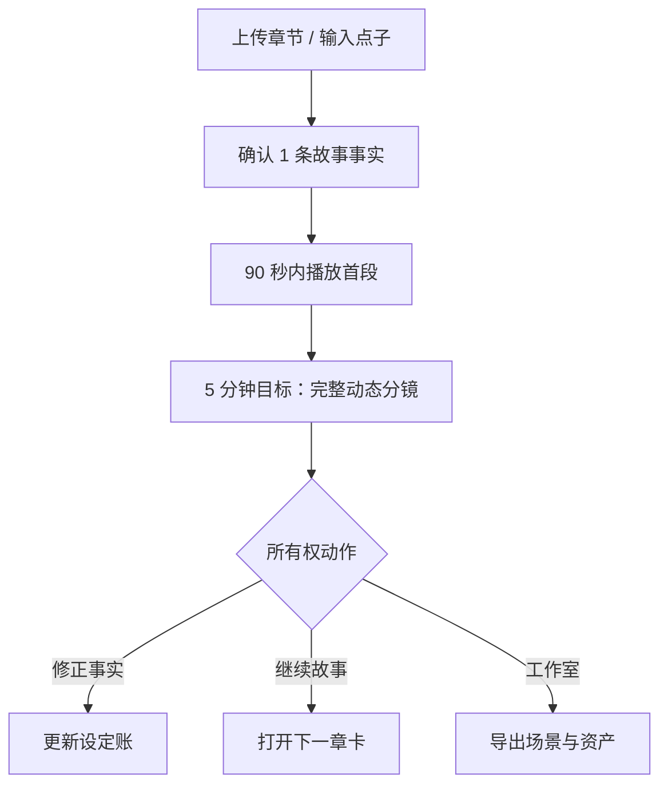

# 创作类产品的新用户激活：首屏、最快“哇”时刻与新手教程

调查截止：2026-08-13  
适用产品：故事引擎（结构化设定账、一致性检查、续写辅助、插图/动画预览）

## 执行摘要

结论不是“动画预览不值得做”，而是要拆开两个事件：

- **情绪性 aha**：用户第一次看到“这是我的故事”——10 分钟有声动态分镜很适合承担这个任务。
- **可预测留存的 activation**：用户确认/修正一条故事事实、接受一份下一章材料、生成第二版或导出可编辑资产。仅播放预览不能证明采用。

九个竞品与公开实验共同指向一条路径：**先让用户用自己的材料得到可见结果，再在真实任务里教；模板是提示，示例是可跳过的支路，视频是按需帮助。** 没有可靠公开数据能证明“动画预览本身提升故事工具的 D7 留存”，因此它仍是假设，不是已验证事实。

对当前故事引擎，建议首屏不要只写“说出你的故事点子”。现有产品文件把首发核心用户定义为已有 3–20 章、正要续写的作者，并把首版验证链定为“真实问题→精确证据→作者确认→安全更新→一周内再用”。因此推荐双入口：

1. 默认入口：**粘贴/上传你的开头或章节**；
2. 次入口：**我只有一个点子**，大输入框配 3–5 个题材提示；
3. 辅助入口：**先玩 60 秒示例**，不强迫所有人经过。

生成过程中先展示 3 条带出处的故事事实，让用户确认一条；90 秒内给 20–30 秒可播放片段，5 分钟目标交付 1–3 分钟版本，10 分钟硬兜底为“有声动态分镜”。

## 研究口径与证据等级

- **强**：2025–2026 官方功能、官方价格/性能边界、同行评审论文或完整逐屏记录。
- **中**：公司负责人披露的实验、厂商客户案例、官方功能加独立拆解；数字可靠性尚可，但外推有限。
- **弱**：单条社区评价、营销自述、二手教程或依据公开步骤作出的时间估算。
- 步数按“有意义的用户动作”计；验证码、权限弹窗、付费试用过场不逐屏计数。
- 除明确标“官方”的时长外，分钟数都是公开流程推算，不冒充产品遥测。
- 平台、地区、年龄和实验分流会改变首屏。本表描述调查日可核的主路径。

## ① Onboarding 拆解表

| 产品 | 新用户首屏 | 从注册到第一个成就感 | 教程形态 | 用户原话与证据 |
|---|---|---|---|---|
| **Sudowrite** | 项目首页＋功能导览；可新建、导入或进入 Story Bible。快速路径并不要求先填完整设定账 | 新建→写/粘贴约 20 词→`Write`→看到两张续写卡→插入；**5–7 步、约 2–5 分钟（估）**。官方完整快速视频 **<11 分钟** | 可重放产品导览＋短视频；Braindump→Synopsis→Characters→Outline→Scenes 是较深路径 | 👍 “**Story Bible is just amazing… I can babble in the Braindump.**” [Reddit](https://www.reddit.com/r/WritingWithAI/comments/1f2xa4h/any_writing_ai_software_that_has_the_storybible/)；⚠️ “**Sudowrite has a big learning curve.**” [Reddit](https://www.reddit.com/r/WritingWithAI/comments/1ihjo22/sudowrite_iskinda_expensive/)；流程：[Quick Start，2026](https://docs.sudowrite.com/getting-started/dQph1snuwbfMWG9wRjsNug/quick-start/2A4FjtiocrtxHPUyz6WZgR)【流程强，口碑弱】 |
| **Novelcrafter** | 小说库＋`First Steps` 清单；询问是否使用 AI，AI 用户才增加相应任务 | 注册官方约 **5 分钟**；建空项目 3 步。得到首个 AI 输出还需连接 OpenRouter、选模型并发消息；**约 10–20 分钟（估）** | 动态任务清单＋18 节课程；官方建议建 `test novel` 练手 | ⚠️ “**getting the AI end… seems complicated… I don't understand OpenRouter.**” [Reddit](https://www.reddit.com/r/WritingWithAI/comments/1gayjrb/opinions_on_novelcrafter/)；流程：[First Steps，2026](https://www.novelcrafter.com/help/getting-started/quick-start/first-steps-tutorial)、[OpenRouter](https://www.novelcrafter.com/help/docs/ai-connections/openrouter)【流程强，口碑弱】 |
| **彩云小梦** | App 同时给“世界广场/已有世界”和创建故事入口；公开 Web 页突出“创建故事” | 登录→创建→输入标题/开头→可选世界设定/风格→生成并选择续文；**5–7 步、约 2–5 分钟（估）**。旧版一次给 3 个续写，2026 版本是否固定为 3 个未确认 | 首次创作流程本身承担教学，设定与人物词条逐步展开 | “**刚开始的时候是很方便的**”，但同一用户又说“**姓名…性别变来变去**”。[App Store 评论](https://apps.apple.com/cn/app/%E5%BD%A9%E4%BA%91%E5%B0%8F%E6%A2%A6/id1564619616?platform=iphone&see-all=reviews)；[产品说明](https://apps.apple.com/cn/app/%E5%BD%A9%E4%BA%91%E5%B0%8F%E6%A2%A6/id1564619616)【流程中，口碑弱】 |
| **笔灵 AI 小说** | 明显的工具/题材库：中长篇、短篇、黄金开头、大纲、拆书、100+生成器、教程并列 | 登录→选生成器→填名称/风格/角色/世界观等字段→生成→编辑；**4–6 步、约 3–8 分钟（估）** | 表单向导＋独立视频教程库；不是一条收敛的首次路径 | ⚠️ “**笔灵AI写作和笔灵小说写作等都是要分别付费的**”。[知乎](https://www.zhihu.com/question/637880484)；独立自然好评很少，搜索结果多为推广，应视为证据缺口。[官方小说导航](https://ibiling.cn/novel-navigation/detail/1)【布局中，时间/口碑弱】 |
| **Character.AI** | 移动端先看 3 个价值说明页，再注册；进入后是带标签和互动量的角色卡片流 | 玩现成角色：3 页说明→注册→选角色→发一句→收到回复；**5–6 步、约 1–3 分钟（估）**。自建角色官方称 **5 分钟上线** | 核心流程即教程；头像、问候语可让 AI 代写 | UX 拆解称注册墙是“**a significant point of friction**”。[逐屏拆解](https://screensdesign.com/showcase/character-ai-chat-talk-text)；[5 分钟创建，官方 2026](https://support.character.ai/hc/en-us/articles/50608869548699-2-Creating-a-Character-Quickstart-Guide-%CF%89)【流程强，评价中弱】 |
| **星野** | 首屏随机推荐数百万现成智能体，自建入口居次；即“先逛、先聊” | 选现成智能体并得到回应：**4–6 步、约 1–3 分钟（估）**；自建约 9 屏、**5–10 分钟（估）** | 自建角色向导＋AI 形象生成；语音与推荐回复按需出现 | 👍 “**真的非常好玩**”；⚠️ “**语音会和情感不太统一**”。[App Store 评论](https://apps.apple.com/cn/app/6463076337?l=en-GB&platform=iphone&see-all=reviews)；[官方产品页](https://apps.apple.com/cn/app/%E6%98%9F%E9%87%8E-%E6%89%80%E5%BB%BA%E7%9A%86%E4%BD%A0%E6%89%80ai/id6463076337)【流程中强，口碑弱】 |
| **剪映 / CapCut** | 首页大号 `New project/Create project`，同时给 Templates；可从空项目或成片模板开始 | 模板→选模板→Use Template→选素材→预览/编辑→导出；**5–6 步、约 2–5 分钟（估）**。新账号完整录屏含登录、角色选择等约 12 步，约 4–8 分钟（估） | 编辑器内短 tooltip，要求用户当场做动作；边做边教 | 👍 “**So quick and easy to use.**” [Reddit](https://www.reddit.com/r/graphic_design/comments/1k7y928/whats_your_take_on_capcut/)；⚠️ “**Why does every template require pro!**” [App Store](https://apps.apple.com/ag/app/1500855883?platform=iphone&see-all=reviews)；[官方模板流程](https://www.capcut.com/help/use-and-export-templates-in-capcut)、[2026 新手指南](https://www.capcut.com/resource/capcut-tutorial-for-beginners)【流程强，口碑弱】 |
| **Canva** | 先问主要用途，再把用户带到相关设计类型/模板；首页也是搜索＋模板，不给纯空白画布当唯一选择 | 注册→选用途→选模板→改一处→下载；**5–7 步、约 3–8 分钟（估）**。当前逐屏捕获可达 17 屏，认证、个性化与 Pro 提示会随实验变化 | 模板＋渐进提示。早期经典版本用 23 秒视频，再让用户拖拽现成素材完成小胜利 | 👍 “**very simple… content always looks great**”；⚠️ “**sometimes you don't even know what to pick**”。[App Store](https://apps.apple.com/us/app/canva-ai-video-photo-editor/id897446215)；[当前流程拆解](https://userpilot.com/blog/onboarding-ux-examples/)、[早期 23 秒挑战](https://review.firstround.com/canvas-path-to-product-market-fit-2/)【流程强，口碑弱】 |
| **Suno** | 有发现内容流，但 `Create` 是明确主行动；Simple Mode 为大文本框，输入题材、情绪、风格或歌词 | SSO→Create→写一句→Create→播放两版；**约 5 步**，官方称完整歌曲 **少于 5 分钟** | 几乎无独立教程；例子写在输入框里，Advanced Mode 后置 | 👍 “**It is very easy to use.**” [App Store](https://apps.apple.com/us/app/suno-ai-songs-music-lyrics/id6480136315)；⚠️ 简单提示会得到“**very generic**”的歌。[Reddit](https://www.reddit.com/r/SunoAI/comments/1i3ep5k/100_music_prompts_to_get_your_tracks_rightso_they/)；[官方 Simple Mode](https://help.suno.com/en/articles/3726657)、[官方 <5 分钟，2026](https://suno.com/hub/how-to-make-a-song)【流程强，口碑弱】 |

### 跨产品模式

1. **最快的“哇”都直接进入核心动作。** Suno 是一句话→歌，Character.AI/星野是选角色→回复，剪映/Canva 是模板→替换→成品。
2. **深层结构通常后置。** Sudowrite 没要求先填完 Story Bible；Canva 不要求先懂版式；Suno 不先暴露高级参数。
3. **外部配置是明显反例。** Novelcrafter 在首个 AI 结果前要求理解 OpenRouter、模型和授权，公开评价直接把它称为复杂。
4. **模板既降低门槛，也制造选择过载。** Canva 的“相关模板”与笔灵的“大工具目录”代表这条连续谱的两端。
5. **现成内容能促成消费，不自动促成创作。** Character.AI/星野证明“先玩”很快，却没有公开数据证明玩家随后会建立自己的故事资产。

## ② “魔法时刻”先例与数据

### 公开的 activation / aha 案例

| 产品/研究 | 公开定义与数字 | 可迁移判断 | 强度 |
|---|---|---|---|
| **Canva** | 激活定义为“新用户成功创建一个设计”。对 5% 新用户做海报用途个性化，2–3 周达到统计显著，激活 **+10%**；后续缩略图/文案优化约 **+12%**。[历史案例，来源页未标清发布日期](https://www.appcues.com/blog/canva-growth-process) | 创作产品应把“产出自己的东西”当激活候选；轻量用途分流可优于统一空白入口 | **中**：负责人数据，但由 onboarding 厂商发布，未披露样本和置信区间 |
| **Fender Play** | 原流程先看 **26 分钟**逐步指南，团队改成开场就“play a song”；称转化与次日回访改善，漏斗每一步 engagement **约 +4%**。[历史客户案例，来源页未标清发布日期](https://amplitude.com/blog/aha-moment-fender) | 对创作/技能产品，“先完成一个可感知成果”优于长前置教学 | **中**：实名负责人和产品数据，未公开实验设计与样本 |
| **Duolingo** | 允许先做一课、后注册，DAU **约 +20%**；继续优化软/硬注册墙又 **+8.2%**。有意义徽章让 DAU +2.4%、课程完成 +4.5%，仅因注册发徽章无效。[负责人访谈，约 2017](https://review.firstround.com/the-tenets-of-a-b-testing-from-duolingos-master-growth-hacker/) | 先给价值再索取承诺；庆祝真实完成，不庆祝“注册/看完教程” | **中强**：真实 A/B 结果，未公开完整统计细节；非创作产品 |
| **Blip** | 激活定义为发布并测试 chatbot；引导优化后完成率 **28.4%→63.74%（+124%）**，中位 TTV **1.1 小时→6.8 分钟（9.7×）**。[客户案例](https://www.appcues.com/customer-stories/how-blip-used-appcues-to-increase-activation-by-124-and-reduce-time-to-value-by-9-7x) | “完成并测试作品”比“创建项目”更像有效激活 | **中**：厂商案例，非叙事创作 |
| **Slack** | 团队达到 2,000 条消息后，**93%** 当时仍在使用；但创建团队者中 90% 以上从未邀请成员或真正使用。[历史创始人访谈](https://review.firstround.com/from-0-to-1b-slacks-founder-shares-their-epic-launch-strategy/) | 建项目、上传文件都不是激活；需要能预测后续采用的行为 | **中**：大规模观察相关性，不是因果实验 |
| **Amplitude 2025 基准** | 2,600 多家公司里，首周激活领先者有 **69%** 同时处于三个月留存领先组；D7 回访 **7%** 即进入前四分位。[报告](https://amplitude.com/resources/product-benchmark-report)、[解释](https://amplitude.com/blog/7-percent-retention-rule) | 早期价值与长期留存相关，但各产品仍需找自己的行为事件 | **中**：大样本观察，激活口径不等于故事创作 aha |
| **Intercom** | 明确区分 aha（发现价值的认知/情绪）与 activation（可观测、可预测留存的行为），并发现不同用途会有不同 aha。[公司研究](https://www.intercom.com/blog/understanding-your-aha-moments-and-putting-them-to-work/) | 动画不能被设为小白、作者、工作室唯一 aha | **中**：内部定性研究 |

### “先看到成品”是否比“先学习”激活率更高？

**方向性答案：对简单、可探索的首次任务，是；对复杂工作流，应该“先有小成果，再在当前步骤教学”。** 但没有找到创作产品对“成品优先 vs 完整教程优先”的统一随机实验，也没有 Sudowrite、Novelcrafter、剪映、Suno 公开的首次行为→D7/D30 留存数字。任何精确胜率都不可信。

| 教程形态 | 公开证据 | 对故事引擎的解释 | 强度 |
|---|---|---|---|
| **无独立教程，直接做任务** | NN/g：70 人、4 款简单 App。看卡片教程成功率 **91%**，跳过为 **94%**，无显著差异；看教程者反而觉得更难，易用评分 4.92 vs 5.49，`p=.047`。[研究](https://www.nngroup.com/articles/mobile-tutorials/) | 不要在首屏前放 3–5 页功能说明 | **中强**：有对照和统计，但任务简单、样本不大 |
| **上下文提示** | CHI 2012：超过 **45,000** 名玩家。最复杂游戏中，教程使时长最高 +29%、进度最高 +75%；上下文提示相较前置说明使时长 +16%、进度 +40%。两款简单游戏无显著收益。[论文](https://grail.cs.washington.edu/projects/game-abtesting/chi2012/chi2012.pdf) | 设定账、证据层和资产管理只在用户走到那一步时教 | **强**：大规模多变量实验；游戏到创作工具的迁移仍有限 |
| **纯视频** | Pause-and-Play：15 名软件新手中 13 人偏好与操作同步的视频，但时间和错误率无显著改善。[论文](https://grail.cs.washington.edu/wp-content/uploads/2015/08/pongnumkul2011pal.pdf) | 视频可解释概念，不应成为首个结果前的门槛 | **中弱**：实验直接，样本小 |
| **视频＋步骤导航/互动** | ToolScape：12 名 Photoshop 新手；互动版自我效能 3.8→5.2，基线只到 3.9；盲评中 9/12 作品更好，时间无显著差异。[论文](https://up.csail.mit.edu/other-pubs/toolscape-tochi-web.pdf) | 若做视频，应拆成 30–60 秒、可跳、可重播并与当前步骤联动 | **中**：创作软件贴近，但样本很小 |
| **交互式任务清单** | Adobe LevelUp：5,350 名 Photoshop 用户中，Level 1/2/3 完成率 **62%/49%/35%**。[CHI 2014](https://affect.media.mit.edu/pdfs/14.Dontcheva-Morris-Gerber-Brandt-CHI.pdf)；2025 Userpilot B2B 基准的 checklist 平均完成率 19.2%、中位 10.1%。[基准](https://userpilot.com/saas-product-metrics/) | 任务必须是真实作品动作；清单完成率只是诊断，不代表留存 | **中弱**：真实规模，但无“无清单”对照，且 B2B 外推弱 |
| **修改现成示例** | 设计研究元分析汇总 43 项研究、1,229 人：示例平均改善新颖性/质量，也会缩窄探索范围、使作品更像示例；一个不常见示例效果更好。[元分析](https://www.sciencedirect.com/science/article/abs/pii/S0142694X15000290) | 示例适合小白的可选支路，不应强迫职业作者先玩，也不要给一排同质套路 | **中强**：研究汇总；不是软件 onboarding 留存实验 |

## ③ 10 分钟有声动画故事预览：2026 可行性与成本

### 结论边界

截至调查日：

- **可稳定承诺**：10 分钟内交付 1–3 分钟“有声动态分镜/animatic”——8–12 张一致性插图、推拉摇移、分层景深、字幕、转场、TTS、背景音乐，并给少量关键镜头做图生视频。
- **不应承诺**：10 分钟内交付 1–3 分钟连续、高一致性、可直接发布的 AI 动画成片。

建议文案是：

> **10 分钟内，看你的故事开头变成第一版有声动态分镜。**

不要写“10 分钟生成动画片”或“一键精品动态漫”。

### 三种成本档位

金额采用 2026-08-13 官方 API 标价与工程估算；未计税，失败重试另算。人民币仅按 `$1≈¥6.75` 粗算。

| 方案 | 媒体构成 | 典型耗时 | 单次可变成本 | 10 分钟承诺 |
|---|---|---:|---:|---|
| **A. 有声动态分镜，默认** | 8–12 图＋确定性推拉/景深/字幕/转场＋TTS＋音乐 | **1.5–4 分钟** | **$0.25–$0.60**（约 ¥1.7–¥4.1） | **可承诺**，需静帧降级 |
| **B. 混合预览，升级** | A＋3–4 个 5 秒关键动态图生视频镜头 | **2–6 分钟** | **$1.1–$2.0**（约 ¥7.4–¥13.5） | 可作 SLO，不宜无条件保证 |
| **C. 全生成视频** | 60–180 秒都由 4–10 秒生成视频拼接 | 常超过 10 分钟 | **$3–$18 起**，重试后更高 | **不适合 onboarding 默认** |

价格拆解：

- Runway Gen-4 Image Turbo 为 **$0.02/图**，8–12 张约 $0.16–$0.24；Turbo 参考图通常可在约 10 秒生成。[Runway 定价](https://docs.dev.runwayml.com/guides/pricing/)、[API 更新记录](https://docs.dev.runwayml.com/api-details/api_changelog/)【强，官方】
- Runway Gen-4 Turbo 视频为 **$0.05/秒**；15–20 秒关键镜头约 $0.75–$1.00，60–180 秒全视频约 $3–$9。[Runway 定价](https://docs.dev.runwayml.com/guides/pricing/)【强，官方】
- Veo 3.1 Lite 约 $0.05/秒、Fast 约 $0.10/秒；单请求官方时延范围约 11 秒到高峰 6 分钟，只宜作非阻塞增强。[Veo 文档](https://ai.google.dev/gemini-api/docs/veo)、[Gemini API 定价](https://ai.google.dev/gemini-api/docs/pricing)【强，官方】
- OpenAI `tts-1` 为 $15/百万字符；1–3 分钟中文旁白按约 250–750 字推算仅 $0.004–$0.012。高质量第三方 TTS 可把语音成本抬到约 $0.01–$0.08。[TTS 模型页](https://developers.openai.com/api/docs/models/tts-1)、[ElevenLabs API 定价](https://elevenlabs.io/pricing/api)【官方价强，字数换算中】
- 30 秒生成音乐可低至约 $0.04；也可用已授权循环音乐让边际成本接近零。[Gemini API 定价](https://ai.google.dev/gemini-api/docs/pricing)【强，官方】
- Remotion 官方样例中 1 分钟视频渲染约 15.5–18.9 秒、$0.017–$0.021；1–3 分钟轻动效推算约 $0.02–$0.06。[成本样例](https://www.remotion.dev/docs/lambda/cost-example)【样例强，外推中】

### 可兑现的 10 分钟时序

| 时间 | 系统动作 | 用户可见反馈 |
|---:|---|---|
| T+0–30 秒 | 从开头/章节中提取 6–10 个视觉节拍、人物与场景 | 显示“采用了哪些原文”和 3 条带出处事实；用户确认 1 条 |
| T+30–90 秒 | 生成角色参考、首批场景图；TTS/字幕/音乐并行 | 不显示空转进度条；逐张展示可编辑 story beats |
| T+90 秒 | 合成第一批镜头 | **必须可播放 20–30 秒片段** |
| T+2–5 分钟 | 补齐 8–12 图和 3–4 个关键动态镜头 | 目标交付 1–3 分钟版本 |
| T+7 分钟 | 冻结素材集 | 未完成的视频镜头自动改为静帧推拉，不再阻塞 |
| T+10 分钟 | 确定性合成兜底 | 保证交付有声动态分镜；MP4 可后台继续导出 |

主要失败点及降级：

- 章节过长：只取首个 hook 单元或 300–800 字，清楚标出采用范围；先交 30 秒再扩展。
- 人物漂移：先做角色卡与参考图；首版只保留 1–2 个主角；失败时换背影、局部、道具或场景镜头。
- 视频队列/审核：单素材 60–90 秒预算，最多一次自动重试；失败即回静帧。
- 中文人名误读：人名词典＋分句，字幕始终可见；失败退回中性旁白。
- 音乐延迟：默认已授权循环音乐，生成音乐后台替换。
- 成本失控：onboarding 每个素材最多一次重试；精修由用户主动触发并显示额度。

### 已有“一段文字→动态内容”先例

| 产品 | 已有能力 | 与故事引擎的距离 | 证据 |
|---|---|---|---|
| **CapCut AI Storytelling** | 点子/脚本→分镜、画面、旁白、节奏、视频 | 已教育大众接受“一句话到有声视频”的入口 | [官方产品页](https://www.capcut.com/create/ai-storytelling-generator)【强，功能存在；时延为厂商自述】 |
| **LTX Studio** | 脚本→storyboard/animatic/video，对白、音效、口型 | 与目标形态最接近，但专业用户仍需编辑 | [Script to Video](https://ltx.studio/platform/script-to-video)【强，功能存在】 |
| **Fliki** | 一句话→脚本、素材、旁白、字幕、音乐 | 快速社媒视频，官方称“in minutes” | [Idea to Video](https://fliki.ai/features/idea-to-video)【中，厂商声明】 |
| **Katalist** | 导入脚本→一致性人物/场景分镜→视频镜头 | 证明先结构化 shots、再生媒体是成熟路径 | [官网](https://www.katalist.ai/)【强，功能存在】 |
| **阅文 DramaBuddy** | 小说理解、改编、设定提取、分镜、批量图/视频/音频 | 国内动态漫生产工具，仍强调人工精修 | [官网](https://aicomic.yuewen.com/)、[广电总局报道，2026](https://www.nrta.gov.cn/art/2026/3/26/art_3731_72968.html)【中强】 |
| **白日梦 / AI 推文视频** | 小说、文案或原文→分镜、动效、多角色配音 | 国内“一键文字转漫画视频”品类已出现 | [白日梦 App](https://apps.apple.com/us/app/id6630381346)、[AI 推文视频](https://apps.microsoft.com/detail/xp9cc0t8xcw61h?gl=CN&hl=zh-CN)【中弱，商店说明】 |

### 质量接受度

没有公开对照实验能证明自动预览会把故事产品激活率提升多少。已有证据只支持较窄的结论：**用户愿意接受“几分钟得到可编辑粗稿”，不愿接受把随机、错配的粗稿包装成可发布成片。**

- 2026 CHI 对 26 名生成式 3D 工具用户的研究中，14 名休闲创作者更容易接受“good enough”，12 名专业人士会更严格评估并丢弃不合格输出；多数人跳过教程，靠试错进入。[论文](https://arxiv.org/abs/2603.29118)【强，定性研究；3D 到故事视频的迁移为中】
- 自动视频用户一面称 CapCut 可“**spins up a usable draft in minutes**”，一面称 Runway“**not always predictable**”。[Reddit](https://www.reddit.com/r/ProductMarketing/comments/1n7rrj7/i_tested_5_ai_video_tools_capcut_runway_invideo/)【弱，单用户】
- Fliki 用户称“**visuals felt generic sometimes**”；另一用户说“**you'll def need to do manual edits**”。[评价一](https://www.reddit.com/r/NewTubers/comments/1byjs7g/what_is_your_experience_using_fliki/)、[评价二](https://www.reddit.com/r/NewTubers/comments/1l0w4xn/ai_video_creation_softwares/)【弱】
- OpenAI 官方承认重复角色的一致性可能失败；Runway 建议为长片准备人物多角度 reference plates，说明身份漂移仍是工程事实。[OpenAI 图像指南](https://developers.openai.com/api/docs/guides/image-generation)、[Runway 长视频指南](https://help.runwayml.com/hc/en-us/articles/26871350018835-How-to-create-longer-videos-and-films)【强，官方限制】
- 广电总局 2026 报道称，市场认可的精品漫剧并非“一键”完成，全部 AI 且无人干预的作品很难符合市场要求；报道中的一部作品精修 38 天。[报道](https://www.nrta.gov.cn/art/2026/3/26/art_3731_72968.html)【中强，行业报道；不代表 onboarding 粗稿】

## ④ 首屏三选一与教程建议

### A / B / C 证据对比

| 方案 | 成功先例与数字 | 优点 | 风险 | 推荐角色 |
|---|---|---|---|---|
| **A 大输入框** | Suno：约 5 步、官方 <5 分钟出完整歌；Sudowrite/彩云也是“输入→续写” | 下一步清楚；用户输入与成品归因强；最容易产生“这是我的” | 空白页焦虑；短/模糊输入易得到 generic 成品；纯“点子”入口忽略已有章节的核心作者 | **主路径，但升级为双 tab**：默认上传/粘贴章节，次 tab 输入点子；给 3–5 个 chips，不给纯空框 |
| **B 模板/题材库** | Canva 用途分流激活 +10%；CapCut 模板约 5–6 步到导出 | 识别快、减少表达成本、可控制输入质量 | 过多会像笔灵的工具百货；题材锚定、作品同质化 | **只做轻提示**：3–5 个常用题材或“帮我补全”，不做首屏大库 |
| **C 先玩示例** | Character.AI/星野约 1–3 分钟体验；Canva 早期 23 秒视频＋互动挑战 | 降低恐惧，复杂价值更易理解，可在无素材时展示完整结果 | 容易停留在消费；示例与真实材料差距大；会锚定风格 | **可跳过的逃生口**：“先玩 60 秒示例”，结束立即出现“换成我的故事” |

推荐组合不是三选一，而是：**A 做主路径，B 做少量提示，C 做可跳过支路。**

### 推荐首屏

**标题**

> 10 分钟，把你的故事开头变成第一版有声动态分镜

**主卡片**

- Tab 1（默认）：`我已经写了开头/章节`
  - 拖入文件或粘贴文本；
  - 明示“只取开场片段生成，全文仍用于人物与事实核对”；
  - CTA：`生成我的开头预览`。
- Tab 2：`我只有一个点子`
  - 一个大输入框；
  - 3–5 个可点题材/语气 chips；
  - CTA 同上。
- 卡片下方：`还没准备好？先玩 60 秒示例`。

首屏不展示：模型商、API、Token、完整 Story Bible 表单、多角色配音参数、十几种画风、计费公式。画风与声音最多各给 3 个默认选项，并允许跳过。

### 首次流程

“所有权动作”比播放更接近激活：用户修正/确认、保存、继续、生成第二版或导出，说明他不是只看了一眼。

### 推荐教程形态

1. 不做注册后的强制视频或卡片轮播。
2. 首次输出后出现不超过 3 项的任务清单：
   - 看完第一段；
   - 确认或修正一条事实；
   - 继续下一段、保存或导出。
3. 结构化设定账、一致性证据、角色资产等复杂能力，在用户触发时用 tooltip 教。
4. 视频只放在“不会用？”里，每段 30–60 秒，可跳、可重播、与当前步骤相连。
5. 示例项目只给一个短、非热门套路的故事；允许作者和工作室跳过。

### 指标定义

建议把指标分三层：

- **速度/可靠性**：10 分钟交付率、TTV `p50/p90`、T+90 秒首播率、等待阶段退出率、生成失败/降级率、单位成功预览成本。
- **aha**：预览观看 50%/90%、“这像我的故事”1–5 分、人物/场景错配率。
- **activation 候选**：看预览后完成至少一次确认/修正/保存/继续/第二版/导出；再验证该行为是否预测 D1、D7、D30 与同项目二次使用。

对现有产品定位，正式主激活不宜改成 `preview_played`。更稳的候选是：

> `personalized_preview_50%` **且** `ownership_action`；核心作者还需 `evidence_confirmed_or_corrected`。

产品当前真相文件已经把第一版验证写成“真实问题→精确证据→作者确认→安全更新→一周内再用”，并明确首版不以高成本视觉生成为中心。因此动画应是获客与情绪 aha，证据核对和下一章工作仍承担留存验证。[产品北极星](sandbox:/workspace/scratch/4095da203649/project_sources/05-01_PRODUCT_NORTH_STAR-6-.md)、[市场与风险登记](sandbox:/workspace/scratch/4095da203649/project_sources/09-08_VALIDATION_MARKET_AND_RISK_REGISTER.md)

## ⑤ 概念测试：证据推演，不是实访结果

本次调查没有接触你们的小白、网文作者或工作室受访者，也没有跑可用原型。以下是公开证据推演出的**待验证假设**，不能写成“用户已经证明会继续使用”。

| 人群 | 对“10 分钟有声动态开头”的初始说服力 | 能说服继续使用的条件 | 主要拒绝理由 | 推荐 activation 候选 |
|---|---|---|---|---|
| **创作小白** | **高**：成品替他跨过空白页，休闲创作者更能接受 good-enough 粗稿 | 预览后立刻能改一个剧情点、选择下一步，并看到自己的选择改变结果 | 看完当玩具；成品 generic；不知道接下来做什么 | 看预览＋修改一个剧情点/生成下一段 |
| **网文作者** | **中或中低**：动画有趣，但未必解决续写与一致性痛点 | 先证明系统读懂人物、设定和因果；每条判断能回到原文章节；预览可控且不改写作者意图 | 人物漂移、剧情误读、风格被覆盖、隐私担忧；认为动画是噱头 | 确认/修正证据＋再次调用一致性/下一章材料；动画只作辅助 |
| **工作室** | **中**：10 分钟粗剪对提案、dailies、客户沟通有价值 | 镜头、角色、配音、字幕都可编辑/替换；有稳定资产 ID、批量重生成、导出与成本/SLA | 不能交给后期、角色不一致、重试不可控、授权不清；粗稿被宣传成成片 | 导出场景卡/资产包、生成第二版本或进入生产工序 |

用户数据政策还要求：稿件默认不用于训练；把正文、角色参考或派生视觉节拍发送给第三方模型前，应明确处理方、用途、保留期限与删除路径。建议 onboarding 只发送生成所需的最小片段，并允许用户关闭外部视觉生成。[用户数据权利政策](sandbox:/workspace/scratch/4095da203649/project_sources/08-USER_DATA_RIGHTS_AND_SECURITY_POLICY.md)

### 概念测试设计

**阶段 1：真实材料的形成性测试**

- 每类 8–12 人；小白带一句点子，作者带真实开头/3–20 章，工作室带一个真实 brief 或脚本片段。
- 不先解释功能；记录他们如何理解首屏、是否选对入口、第一次犹豫在哪里。
- 90 秒播放首段、5 分钟交完整动态分镜；让用户指出“像/不像我的故事”的具体证据。
- 不问抽象的“你会不会继续用”为主问题；观察是否主动修正、保存、继续、导出，24 小时后是否回来。

**阶段 2：首屏实验**

- 核心作者先比较：`上传/粘贴为默认` vs `点子输入为默认`。
- 小白再比较：`点子＋chips` vs `先改一个示例`。
- 示例入口始终可见但不强迫；视频始终只作帮助。
- 主要指标为 `preview_50% + ownership_action`，并用 D7 同项目回访验证预测力；不要把三类人混成一个平均数。

若当前激活率约 25%，希望检测绝对 +5 个百分点，双侧 `α=.05`、80% 把握度，约需**每组 1,250 人**。流量不足时，不要用几十人的“无显著差异”决定路线；先用 8–12 人/人群排除明显理解与质量问题，再累计行为数据。

### 决策门槛

“10 分钟预览”可以进入默认 onboarding，至少应同时满足：

- T+90 秒首播率和 10 分钟交付率达到预设 SLO；
- 多数用户能说出预览与自己文本的对应关系；
- 相较无动画对照，`ownership_action` 有实质提升；
- 提升能延伸到 D7 同项目回访，而不是只提高播放；
- 核心作者的一致性信任、隐私接受度和下一章任务没有下降；
- 单个激活用户的媒体成本在可承受获客预算内。

## 最终建议

1. **做动画预览，但把它命名为“第一版有声动态分镜”。** 这是 2026 技术与用户预期都能承受的质量承诺。
2. **首屏用双入口，不用纯“说出点子”。** 默认服务已有章节的核心作者；点子入口承接小白；示例是可跳过支路。
3. **90 秒就给首段，10 分钟只做兜底。** 用户不应盯着进度条等十分钟。
4. **把情绪 aha 与正式激活拆开。** 预览负责“哇”，带出处的事实确认与后续动作负责“留下来”。
5. **教程藏进首次真实产出。** 输出后 3 步清单、上下文提示、按需短视频；不在首屏讲全套系统。
6. **按人群设不同价值事件。** 小白是“继续发展”，作者是“确认它读懂了”，工作室是“导出可加工资产”。
7. **没有实测前，不宣称该概念提升留存。** 公开证据支持方向和工程可行性，不替代你们自己的分人群 D7 实验。

来源：ChatGPT
