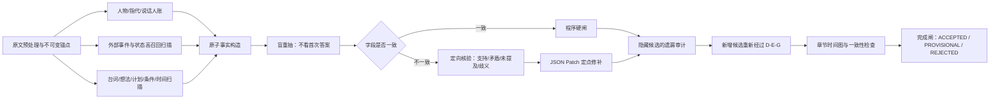

# 中文网文事实抽取：同一 Flash API 的多步纠错与上下文工程方案

> **版本**：v1.0  
> **日期**：2026-07-31  
> **目标场景**：中文网络小说逐章抽取原子事实、原文锚点、人物归一、来源／否定／情态／条件／时间与先后关系；尽量只使用同一个低价 Flash API，不引入更高级模型。  
> **核心目标**：把“第一次抽得不稳定”改造成“高召回提名 → 独立重建 → 证据核验 → 定点修补 → 程序闸门”的可审计流水线。

---

## 0. 最终结论

### 0.1 可以反复调用同一个 Flash，但不能让它直接“审自己的整份答案”

研究证据并不支持下面这种朴素做法：

```text
第一次：抽取整章事实
第二次：请检查上面的事实是否正确
第三次：请修正后重新输出完整列表
```

原因有三类：

1. **无外部反馈的自我纠错并不稳定**。有研究发现，模型仅依靠自身能力重新反思，可能不改、改错，甚至使原本正确的答案退化。[S8]
2. **同模型评委存在自我偏好**。模型可能更喜欢与自身表达习惯相似的答案，不能把“它觉得自己写得好”当成独立证据。[S12][S13]
3. **整表重写会引入回归**。每次重写都可能把正确主体、锚点、否定或时间关系改坏。

可行的路线是：

> **同一个模型，不同的隔离岗位；每个岗位只看完成自己任务所需的最小信息；由原文、精确字符锚、字段遮蔽重抽和程序检查提供外部反馈。**

这与 Chain-of-Verification 的关键思想一致：先生成，再设计核验问题，核验时尽可能独立作答，最后只根据已经发现的冲突修正。[S6]

### 0.2 “90%以上”必须拆成多个指标，不能只报一个总体正确率

至少分别计算：

- **事实精确率 Precision**：系统收下的事实中，多少是真的；
- **事实召回率 Recall**：金标事实中，系统找到了多少；
- **主体／指代正确率**；
- **来源正确率**：旁白事实、人物说法、人物想法、传闻是否分开；
- **否定正确率**；
- **情态正确率**：已发生、计划、愿望、可能、条件、反事实；
- **时间锚正确率**；
- **事件先后边正确率**；
- **证据锚正确率**；
- **格式通过率**。

推荐把生产目标写成：

```text
A. 自动放行区事实精确率的章节级 95% 置信下界 ≥ 90%
B. 全量事实召回率 ≥ 90%
C. 主体、否定、来源、条件、时间等高危字段分别报告
D. 无法确认的项目允许进入 PROVISIONAL，而不是强行猜测
```

**不能承诺仅靠改 Prompt 一定达到 90%**。是否达到，必须用人工金标集测量。若同一个 Flash 在多种独立视角下持续犯同一种系统性错误，继续增加同模型调用次数通常只是在重复相关错误，需要把那一类送入本地专用模型、人工或更强模型的极少量升级队列。

---

## 1. 论文与大厂做法给出的共同结论

| 证据方向 | 研究／官方结论 | 对小说事实抽取的工程含义 | 证据强度 |
|---|---|---|---|
| 详细标注规则 | GoLLIE 的消融研究显示，详细 annotation guidelines 是零样本信息抽取的重要因素。[S1] | 不只写字段名；必须写“什么算、什么不算、边界如何处理、错误例子”。 | 强 |
| 多轮拆解抽取 | ChatIE 把复杂 IE 改造成两阶段、多轮问答，分别处理类型识别和结构抽取。[S2] | 不要一次完成实体、事件、指代、时间、纠错和补漏。 | 强 |
| 定义＋示例＋解释 | PromptNER 使用实体定义、少量示例和候选解释改善少样本 NER。[S3] | 字段定义要具体；示例要包含边界和解释，而不只是成品 JSON。 | 中强 |
| 抽取后自验证 | GPT-NER 用自验证降低把 NULL 输入过度标成实体的问题。[S4] | 每个候选事实必须再做“是否真的属于该类型”的定向核验。 | 中强 |
| 原子事实 | FActScore 将长文本拆成原子事实，再逐条判断是否有可靠来源支持。[S5] | 一条记录只表达一个可独立判断的事实，不能把多个动作和推论揉在一起。 | 强 |
| 独立核验 | CoVe 发现，独立回答核验问题比在原答案上下文中联合作答更能减少幻觉。[S6] | 验证器应重新从原文恢复字段，不应先看到首次抽取的理由。 | 强 |
| 迭代修订可有效 | Self-Refine 在多个任务上显示，同模型反馈和修订可以改善输出。[S7] | 同模型多轮有价值，但必须给出具体反馈维度和停止条件。 | 中 |
| 朴素自纠错会退化 | “LLMs Cannot Self-Correct Reasoning Yet”发现，没有外部反馈时，自我纠错可能失败或下降。[S8] | “再检查一遍”不是验证机制；必须引入原文锚、程序结果或字段重建。 | 强 |
| 工具反馈更可靠 | CRITIC 强调外部工具反馈对纠错的重要性。[S9] | 字符串匹配、JSON Schema、跨度校验、时间图环检测都应作为外部反馈。 | 强 |
| 关键字段遮蔽核验 | ProCo 通过遮蔽关键条件并重新预测来做 verify-then-correct。[S10] | 把主体、否定、情态、来源、时间分别遮蔽重抽，比问“整条是否正确”更可靠。 | 中强 |
| 多样本不一致检测 | SelfCheckGPT 利用同模型多次采样的不一致性识别风险。[S11] | 不一致可作为“需要复核”的信号；一致不能单独证明正确。 | 中 |
| 同模型评委偏差 | LLM 评委会识别并偏好自己的生成；迭代同模型还可能出现 reward hacking。[S12][S13] | 禁止让同一模型基于文风或整体印象打分；只做有原文依据的字段分类。 | 强 |
| 长上下文位置偏差 | Lost in the Middle 显示，相关信息放在长上下文中间时，模型利用率可能显著下降。[S14] | 不要把整本历史、全章规则和所有候选一起塞进一个请求；使用局部窗口与分阶段任务。 | 强 |
| 文学指代是独立难题 | LitBank、中文零指代研究及 BookNLP 都把名字聚类、代词指代、说话人归因视为独立组件。[S15][S16][S17] | 人物归一不能只是最终 JSON 的一个顺手字段，必须先建立 mention ledger。 | 强 |
| 时间关系不是文本顺序 | 叙事时间研究把事件时间关系作为单独任务；故事中叙述顺序与发生顺序并不总一致。[S18] | 同时保存“叙述位置”和“故事时间”，用部分有序图而不是强行编号 1、2、3。 | 强 |
| 例子与结构化提示 | Anthropic 建议相关、多样、结构化的 3–5 个示例，并对长文先提取直接引用；Google 也建议具体且多样的 few-shot 示例。[S19][S20][S23] | 每个岗位放少量高度相关示例，先找证据再归一，不要堆大量泛化示例。 | 官方实践 |
| 评估应是分类而非开放生成 | OpenAI 的评估指南建议任务化评测、持续记录，并指出模型更擅长分类／比较而不是开放式评判。[S21] | 验证阶段使用 `SUPPORTED / CONTRADICTED / NOT_STATED / AMBIGUOUS` 等离散标签。 | 官方实践 |
| JSON 只解决格式 | 千问结构化输出可保证返回可解析 JSON，但官方仍要求下游校验字段、类型和格式。[S22] | JSON mode 不能证明事实正确；语义闸门必须另外做。 | 官方实践 |
| 固定前缀可缓存 | 千问当前文档列出 qwen3.7-flash 支持上下文缓存，适合重复使用固定规则、Schema 和示例。[S24] | 静态规则放固定前缀，章节正文与局部状态放动态尾部。 | 官方实践 |

---

## 2. 先把错误拆开：你面对的不是一个“准确率问题”

一次性抽取容易把不同错误混在一起。建议至少维护以下错误族：

| 错误族 | 典型表现 | 最适合的检查方式 |
|---|---|---|
| `UNSUPPORTED_FACT` | 原文没有，模型补全常识或后文 | 精确锚点＋支持分类 |
| `OMISSION` | 原文有但没抽到 | 段落覆盖账＋隐藏候选的补漏扫描 |
| `SUBJECT_WRONG` | 动作主体张冠李戴 | mention ledger＋主体遮蔽重抽 |
| `COREF_WRONG` | 他／她／其／老人等归错人物 | 独立指代分类；允许 UNRESOLVED |
| `ZERO_PRONOUN` | 中文省略主语，被错误沿用上一人物 | 零指代候选＋局部语法窗口 |
| `DEICTIC_WRONG` | “此事／那件东西／这一幕”被错误解释 | 事件／命题指代账，不只做人名指代 |
| `SPEAKER_WRONG` | 台词说话人错误 | 引号边界＋说话人独立归因 |
| `SOURCE_CONFUSION` | 人物说法写成旁白确认 | `epistemic_source` 字段核验 |
| `NEGATION_LOST` | “没有去”写成“去了” | 否定词锚＋polarity 遮蔽重抽 |
| `MODALITY_LOST` | 计划、猜测、可能写成已发生 | modality 遮蔽重抽 |
| `CONDITION_LOST` | “如果……才……”条件被删 | 条件跨度强制字段 |
| `TIME_ANCHOR_WRONG` | 三年前、翌日、片刻后归错 | 时间表达层＋锚点图 |
| `ORDER_WRONG` | 叙述顺序误当发生顺序 | narrative order / story time 分账 |
| `CAUSE_INVENTED` | 先后关系误写成因果 | 因果关系单独抽；无因果词则不强推 |
| `OVER_MERGE` | 一条事实包含多个动作、主体或时间 | 原子化检查 |
| `OVER_SPLIT` | 同一状态被拆成大量重复事实 | 去重与事件簇 |
| `FORMAT_ERROR` | 缺字段、类型错误、JSON 截断 | JSON mode＋jsonschema |
| `REGRESSION` | 修一处时把原正确内容改坏 | JSON Patch 定点修补，不整表重写 |

---

## 3. 推荐总架构



核心原则：

1. **候选提名者不能批准自己的事实。**
2. **验证者不看首次抽取的思考过程。**
3. **盲重抽阶段甚至不看首次字段值，只看原文锚点。**
4. **程序负责可以确定的事情，模型只负责语义判断。**
5. **所有修复都是补丁，不重新生成整份账。**
6. **所有“无法确定”必须显式保留，不能被强制猜成某人、某时。**
7. **遗漏检查不看现有事实文本，避免被现有答案锚定。**

---

## 4. 先建立不可变数据层

### 4.1 原文锚点

在任何模型调用之前，由程序生成：

```json
{
  "book_id": "BOOK_001",
  "chapter_id": "C0042",
  "source_sha256": "...",
  "paragraphs": [
    {
      "paragraph_id": "C0042-P0001",
      "char_start": 0,
      "char_end": 84,
      "text": "……"
    }
  ],
  "sentences": [
    {
      "sentence_id": "C0042-S0001",
      "paragraph_id": "C0042-P0001",
      "char_start": 0,
      "char_end": 26,
      "text": "……"
    }
  ]
}
```

规则：

- `char_start/char_end` 永远针对原始正文；
- 模型不能创造跨度；
- 模型给出的 `quote` 必须等于 `source[char_start:char_end]`；
- 章节清洗、繁简转换、标点替换若会改变位置，必须先形成固定版本并记录哈希；
- 后续所有事实、人物、时间边都只引用这些不可变 ID。

### 4.2 人物、实体与“这件事”分账

实体指代和事件指代要分开：

```json
{
  "mention_id": "M-C0042-0018",
  "span_id": "C0042-S0012",
  "surface": "这件事",
  "mention_type": "DEICTIC_EVENT",
  "referent_type": "EVENT_CLUSTER",
  "candidate_referent_ids": [
    "EC-C0042-003",
    "EC-C0041-011"
  ],
  "resolved_referent_id": null,
  "resolution_status": "UNRESOLVED",
  "cue_span_ids": []
}
```

人物提及：

```json
{
  "mention_id": "M-C0042-0007",
  "surface": "他",
  "mention_type": "PRONOUN",
  "candidate_entity_ids": ["CHAR_001", "CHAR_009"],
  "resolved_entity_id": "CHAR_001",
  "resolution_status": "RESOLVED",
  "cue_span_ids": ["C0042-S0006"]
}
```

中文零主语：

```json
{
  "mention_id": "M-C0042-ZP0002",
  "surface": "",
  "mention_type": "ZERO_PRONOUN",
  "insertion_char": 628,
  "candidate_entity_ids": ["CHAR_001", "CHAR_009"],
  "resolved_entity_id": null,
  "resolution_status": "UNRESOLVED"
}
```

**禁止规则：**

- 不得把 `他／她／其／那人／老人`直接存为最终 canonical name；
- 不得把“这件事”强行归到某个人；
- 不得因为候选只有一个就自动认定，仍需原文线索；
- 无法确定时，事实可以保留 `surface_subject`，但不得进入自动放行区。

### 4.3 最终事实记录

```json
{
  "fact_id": "F-C0042-0017",
  "status": "ACCEPTED",
  "fact_type": "EVENT",

  "subject": {
    "surface": "他",
    "entity_id": "CHAR_001",
    "resolution_status": "RESOLVED"
  },

  "predicate": {
    "surface": "推开",
    "normalized": "打开"
  },

  "object": {
    "surface": "木门",
    "entity_id": "OBJ_014",
    "normalized_text": "木门"
  },

  "polarity": "AFFIRMED",
  "modality": "ACTUAL",

  "epistemic_source": {
    "type": "NARRATOR",
    "entity_id": null
  },

  "condition": null,

  "time": {
    "anchor_id": "T-C0042-03",
    "surface": "片刻后",
    "story_time_status": "AFTER_REFERENCE",
    "reference_fact_id": "F-C0042-0012"
  },

  "location": {
    "entity_id": "LOC_008",
    "surface": "祠堂"
  },

  "evidence": [
    {
      "sentence_id": "C0042-S0015",
      "char_start": 702,
      "char_end": 714,
      "quote": "片刻后，他推开了木门"
    }
  ],

  "verification": {
    "blind_reextract_pass_id": "BR-C0042-02",
    "support_label": "SUPPORTED",
    "recovered_fields_match": {
      "subject": true,
      "polarity": true,
      "modality": true,
      "source": true,
      "condition": true,
      "time": true
    },
    "contradiction_span_ids": []
  },

  "risk_flags": []
}
```

### 4.4 建议枚举

```text
fact_type:
EVENT | STATE | STATE_CHANGE | SPEECH_CLAIM | BELIEF |
PERCEPTION | INTENTION | PLAN | RULE | RELATION | IDENTITY

polarity:
AFFIRMED | NEGATED | MIXED | UNKNOWN

modality:
ACTUAL | ONGOING | HABITUAL | PLANNED | INTENDED |
DESIRED | POSSIBLE | CONDITIONAL | COUNTERFACTUAL | REPORTED

epistemic_source.type:
NARRATOR | CHARACTER_SPEECH | CHARACTER_THOUGHT |
DREAM | VISION | RUMOR | DOCUMENT | UNKNOWN

resolution_status:
RESOLVED | MULTIPLE_POSSIBLE | UNRESOLVED

support_label:
SUPPORTED | CONTRADICTED | NOT_STATED | AMBIGUOUS
```

不要让模型自由发明枚举值。

---

## 5. 上下文到底注入什么

## 5.1 固定静态前缀

建议作为稳定的 system prompt，并保持字节、顺序、字段顺序尽可能一致，便于千问上下文缓存：

1. 岗位定义；
2. 事实准入标准；
3. 事实类型定义；
4. 各字段定义；
5. 错误族；
6. 允许 `UNRESOLVED / AMBIGUOUS / NOT_STATED`；
7. 输出 JSON Schema；
8. 3–5 个相关、结构化、包含边界情况的示例；
9. 禁止推测和完成条件。

GoLLIE、PromptNER 以及 Anthropic／Google 的官方指南共同支持“详细规则＋少量具体示例”，而不是只给字段名。[S1][S3][S19][S23]

## 5.2 每章动态注入

只注入当前调用真正需要的内容：

```text
<book_card>
题材、主角 ID、关键别名、会影响字面理解的世界规则
控制在 5–12 行
</book_card>

<active_entities>
只列当前窗口内出现或高概率出现的实体：
entity_id / canonical_name / aliases / last_seen_scene
</active_entities>

<prior_scene_tail>
上一窗口末尾 1–2 个自然段，或结构化的最后场景状态
</prior_scene_tail>

<current_time_state>
当前章节可确认的日期、时段、场景锚；不确定则 UNKNOWN
</current_time_state>

<unresolved_ledger>
上一窗口仍未解决的代词、零主语、这件事／那个东西
</unresolved_ledger>

<source_text>
带 paragraph_id、sentence_id、字符位置的当前原文
</source_text>

<task>
本轮唯一任务
</task>
```

### 5.3 不应注入

- 整本小说大纲；
- 几百条历史事实；
- 所有人物的完整档案；
- 首次抽取的长篇解释；
- 其他验证器的推理过程；
- 无关题材知识；
- “请全面仔细准确”一类空泛句；
- 让一个调用同时做抽取、合并、纠错、时间排序、补漏和总结。

Lost in the Middle 说明，长上下文中的关键信息可能因为位置而被忽略。[S14]  
因此，**局部窗口＋岗位拆分**通常比“把一切都塞进去”更可靠。

## 5.4 推荐排列

在 Qwen API 中可以使用：

```text
SYSTEM（固定，可缓存）
  规则 → Schema → 错误族 → 3–5 个示例

USER（动态）
  原文及元数据
  → 当前实体子表
  → 上一场景尾部
  → 当前唯一任务与输出要求放在末尾
```

Anthropic 对长文档的官方建议是将长文放在上方、具体问题放到末尾，并先提取相关直接引用。[S19]  
这不是 Qwen 的绝对规律，因此上线前应对 Qwen3.7-Flash 做两种排列的 A/B 测试；但无论哪种排列，都要避免把最关键的当前任务埋在大量历史材料中间。

## 5.5 初始切窗参数

以下是工程起点，不是通用定律：

```text
正文窗口：1,500–3,000 个中文字符
边界：按自然段切，不在句中截断
重叠：前后各 1 个自然段
上一场景状态：300–800 tokens
活动实体：通常 10–30 个；只取相关子集
示例：3–5 个；按当前错误类型动态检索
```

章节较短时可整章处理，但人物／时间／补漏仍应分岗位调用。

---

## 6. 完整多步流程

## P0｜程序预处理：零模型调用

输出：

- 段落、句子、字符 ID；
- 引号区间；
- 明显时间词候选；
- 已知人物别名的精确命中；
- 原文哈希；
- 切窗；
- 上一窗口尾部状态。

程序此时**不判断语义主体**，只提供可验证的外部结构。

---

## P1｜人物、指代、零主语和说话人账

### 目标

只解决：

- 哪些文本跨度是人物／实体提及；
- 名称、称谓、代词和零主语可能指向谁；
- 台词是谁说的；
- “此事／此物／这一幕”指向实体、事件还是命题；
- 无法确定的项目明确留空。

### 为什么必须独立

文学文本中的名字聚类、代词指代和说话人归因本身就是独立难题；BookNLP 也把它们拆成不同组件。[S15][S17]

### 输入

- 当前窗口原文；
- 活动实体子表；
- 上下各一段；
- 不提供首次事实列表。

### 输出

`mentions[]`、`quote_speakers[]`、`unresolved_mentions[]`。

### 放行要求

- 每个解析必须有 cue span；
- 两个候选都合理时必须 `MULTIPLE_POSSIBLE`；
- 零主语不得因“最近人物”规则直接自动认定；
- 说话人和台词内容中的事件主体分开。

---

## P2A｜外部事件、状态和状态变化高召回扫描

逐段扫描以下内容：

- 明确发生的动作；
- 进入／离开／获得／失去；
- 生死、受伤、醒来、突破等状态变化；
- 人物关系变化；
- 地点状态；
- 规则被触发、违反或生效。

只输出**原文候选跨度**，不要先写完整事实句。

每个段落都必须返回：

```json
{
  "paragraph_id": "C0042-P0008",
  "scan_status": "CANDIDATES_FOUND",
  "candidate_span_ids": ["SPAN-C0042-031"],
  "no_fact_reason": null
}
```

若没有候选：

```json
{
  "paragraph_id": "C0042-P0009",
  "scan_status": "NO_TARGET_FACT",
  "candidate_span_ids": [],
  "no_fact_reason": "仅环境描写，无目标类型的状态或事件"
}
```

这份“逐段覆盖账”是后续发现漏项的基础。

---

## P2B｜台词、想法、计划、条件、来源和时间扫描

与 P2A 分开，专门找：

- 人物说法；
- 人物认知、怀疑、误判；
- 愿望、计划、决定；
- 条件句；
- 否定；
- 可能性、推测；
- 梦境、幻觉、传闻；
- 明示时间、相对时间、回忆切换；
- 场景切换。

原因：若把所有类型放进一个高召回扫描，Flash 容易只抓显眼动作，漏掉情态、条件和来源。

---

## P3｜原子事实构造

输入：

- P1 mention ledger；
- P2A/P2B 候选跨度；
- 原文局部窗口。

规则：

1. 每条只含一个可独立判断的断言；
2. 先保留原词，再做 normalized 字段；
3. 人物台词不是旁白事实；
4. 计划不是已发生；
5. 条件不丢失；
6. 不把先后写成因果；
7. 不清楚的主体或时间保持未知；
8. 同一跨度可以支持多个原子事实，但必须分别判断；
9. 每条事实必须有精确 quote 和字符跨度。

FActScore 的核心经验是，长文本中正确与错误信息混合时，原子级核验比整段二元判断更适合。[S5]

---

## P4A｜盲重抽：验证的核心

### 关键设计

对每条候选，不把第一次生成的字段交给验证器。只给：

- `fact_id`；
- 原文证据跨度；
- 必要的上下文；
- 活动实体候选；
- 要恢复的字段列表。

验证器重新恢复：

```text
subject_entity_id
predicate_normalized
object
polarity
modality
epistemic_source
condition
time_anchor
location
```

程序再比较首次记录和盲重抽记录。

### 为什么比“请检查是否正确”更可靠

- 首次答案不会直接锚定验证器；
- 验证任务变成字段抽取，而不是对自己进行主观评分；
- 可精确定位是主体、否定、情态还是时间不一致；
- 符合 CoVe 的独立核验思想，也可视为把 ProCo 的关键条件遮蔽迁移到事实字段。[S6][S10]

### 自动比较

```text
所有高危字段一致 + 精确证据存在
    → 进入程序硬闸

任一高危字段不一致
    → 进入 P4B 定向核验

盲重抽返回 AMBIGUOUS / UNRESOLVED
    → 进入 PROVISIONAL，不能自动放行
```

高危字段：

```text
subject
speaker / epistemic_source
polarity
modality
condition
time_anchor / temporal_relation
```

---

## P4B｜定向支持分类

只处理 P4A 不一致的项目。

验证器看到：

- 原文局部窗口；
- 候选事实；
- P3 与 P4A 的两个不同字段值；
- 不看双方解释，不知道哪个是“原始答案”。

输出只允许：

```text
SUPPORTED
CONTRADICTED
NOT_STATED
AMBIGUOUS
```

并返回：

- 最短支持跨度；
- 最短反证跨度；
- 正确字段值或 `UNRESOLVED`；
- 允许的补丁操作。

OpenAI 的评估指南指出，模型通常更擅长分类和比较，而不是开放式评判；同时应使用明确 rubric 并防位置偏差。[S21]  
因此若提供 A/B 两个候选值，应随机交换顺序，并记录两次顺序是否改变结果。

---

## P5｜隐藏候选的遗漏审计

### 错误做法

```text
下面是已经抽出的事实，请看看还漏了什么。
```

模型会被现有列表锚定，容易只做近似改写。

### 推荐做法

遗漏审计只看：

- 原文；
- 已覆盖的字符区间或 sentence_id；
- 各段扫描状态；
- 不看现有事实的自然语言内容。

任务：

```text
找出仍未被覆盖、但表达目标类型事实的最短原文跨度。
不要复述已覆盖跨度。
无法确认是否是新事实时标 AMBIGUOUS。
```

建议做两次正交扫描：

1. `EVENT_STATE_OMISSION`：事件、状态、状态变化、关系；
2. `EPISTEMIC_TEMPORAL_OMISSION`：台词、想法、计划、条件、否定、时间、场景、规则。

新增候选不能直接加入最终账，必须重新经过 P3 → P4 → 程序闸。

---

## P6｜时间层：不要让每条事实自己随便写时间

## 6.1 分开“叙述位置”和“故事时间”

```json
{
  "fact_id": "F-C0042-0021",
  "narrative_index": 21,
  "scene_id": "SC-C0042-04",
  "story_time_anchor_id": "T-PAST-003",
  "temporal_cue": "三年前"
}
```

“后出现的句子”可能是在回忆更早发生的事情，因此：

```text
narrative_index 只表示文本中第几个被提及
story_time_anchor 才表示故事世界中的发生时间
```

## 6.2 时间锚

```json
{
  "anchor_id": "T-C0042-03",
  "anchor_type": "RELATIVE",
  "surface": "翌日清晨",
  "reference_anchor_id": "T-C0042-02",
  "normalized_relation": "NEXT_DAY_MORNING",
  "resolution_status": "RESOLVED"
}
```

## 6.3 时间边

```json
{
  "edge_id": "TE-C0042-004",
  "source_fact_id": "F-C0042-0012",
  "target_fact_id": "F-C0042-0017",
  "relation": "BEFORE",
  "evidence_span_ids": ["C0042-S0015"],
  "status": "ACCEPTED"
}
```

允许关系：

```text
BEFORE | AFTER | OVERLAP | SAME_INTERVAL |
CONTAINS | STARTS | ENDS | UNKNOWN
```

### 规则

- 不强行给所有事实生成一个总排序；
- 无直接或可靠语义依据时用 `UNKNOWN`；
- 仅对同场景、同锚点或有明确时间词的事件建边；
- 程序检测 `BEFORE` 图中的环；
- 出现环时，只复核构成环的边，不重跑整章；
- 场景切换、回忆开始、回忆结束作为独立 anchor；
- 因果边和时间边分开。

叙事时间关系研究将事件顺序视为独立结构任务，而不是事实抽取的附属字段。[S18]

---

## P7｜只输出补丁，不重新生成整份事实

建议自定义 Patch 协议：

```json
{
  "patch_id": "PATCH-C0042-009",
  "op": "REPLACE_FIELD",
  "fact_id": "F-C0042-0017",
  "path": "/subject/entity_id",
  "old_value": "CHAR_009",
  "new_value": "CHAR_001",
  "evidence_span_ids": ["C0042-S0015"],
  "reason_code": "SUBJECT_WRONG"
}
```

允许操作：

```text
REPLACE_FIELD
ADD_FACT
REJECT_FACT
SPLIT_FACT
MERGE_DUPLICATE
RELINK_MENTION
ADD_TEMPORAL_EDGE
REMOVE_TEMPORAL_EDGE
MARK_PROVISIONAL
```

程序应用前检查：

- `old_value` 是否仍与数据库一致；
- 证据跨度是否真实存在；
- Patch 是否会破坏 Schema；
- 是否引入新的时间环；
- 是否修改了未被本次核验触及的字段。

补丁应用后，仅对修改字段重新盲重抽一次。  
这能避免“修主体时顺便改坏时间和锚点”。

---

## 7. 程序硬闸：免费而且比模型稳定

程序不能解决复杂语义，但应拦下所有可确定的问题。

### 7.1 JSON 与字段

- JSON 可解析；
- JSON Schema 通过；
- 枚举合法；
- 必填字段存在；
- ID 唯一；
- 数组／字符串类型正确；
- 输出未截断；
- 不允许额外字段。

千问官方支持 qwen3.7-flash 的 JSON mode，但仍明确建议下游验证输出。[S22]

### 7.2 锚点

```python
assert quote == source[char_start:char_end]
assert 0 <= char_start < char_end <= len(source)
```

另外检查：

- `sentence_id` 与跨度一致；
- quote 不得是模型改写；
- 一个事实不能完全没有证据；
- 证据不应超长到覆盖整段而失去可核验性；
- 支持跨度与反证跨度不能完全相同却给出相反标签。

### 7.3 指代

- canonical name 不允许是“他／她／其／此人／那东西”；
- `RESOLVED` 必须指向 registry 中存在的 ID；
- `UNRESOLVED` 不得被自动改成最近实体；
- 事件指代不得写入人物 ID；
- 同一 mention 不能在同一版本中解析到两个实体。

### 7.4 来源与情态

- `SPEECH_CLAIM` 必须有 speaker；
- `CHARACTER_THOUGHT` 必须有 experiencer；
- `NEGATED` 必须能找到否定 cue；
- `PLANNED / INTENDED / POSSIBLE / CONDITIONAL` 必须有相应 cue 或核验依据；
- 人物说“某人死了”不能自动改成旁白确认“某人已死”。

### 7.5 原子性与重复

程序可用启发式触发复核：

- 一条事实含多个并列谓词；
- 多个主体；
- 多个时间锚；
- 同一主体、谓词、对象和锚点高度重复；
- 同一证据生成大量近义记录；
- 事实句包含“所以／因此”但原文无因果线索。

程序不必直接判错，只需打 `RISK_FLAG`。

### 7.6 时间图

- `BEFORE` 图无环；
- `SAME_INTERVAL` 做并查集合并后仍一致；
- 同一对事实不能同时 `BEFORE` 与 `AFTER`；
- `UNKNOWN` 不参与传递闭包；
- 不从文本先后自动生成故事时间边。

---

## 8. 同一个 Flash 的提示词模板

以下模板刻意把岗位隔离。生产中应把字段定义、枚举和示例展开为固定静态前缀。

## 8.1 P1 人物／指代账

```text
SYSTEM:
你是“中文小说提及与指代标注员”，不是剧情总结员。

唯一任务：
识别输入窗口中的人物、实体、代词、称谓、零主语、
说话人，以及“这件事/那个东西/这一幕”等事件或命题指代。

规则：
1. 保留原始 surface，不得用规范名覆盖原词。
2. 只能从 active_entities 中选择 entity_id；不确定则 UNRESOLVED。
3. 最近出现的人物不等于必然先行词。
4. 台词说话人与台词中动作主体分开。
5. 省略主语时建立 ZERO_PRONOUN 记录。
6. “这件事”可能指事件或命题，不能强行归为人物。
7. 每个 RESOLVED 结果必须给 cue_span_ids。
8. 只输出 JSON。

USER:
<active_entities>...</active_entities>
<source_text>...</source_text>

<task>
逐项输出 mentions、quote_speakers、unresolved_mentions。
</task>
```

## 8.2 P2 候选跨度扫描

```text
SYSTEM:
你是“证据跨度盘点员”。

你只标记原文中可能表达目标事实的最短连续跨度。
不要归一人物，不要改写事实句，不要推断，不要合并远距离内容。

本轮目标类型：
EVENT, STATE, STATE_CHANGE, RELATION

要求：
1. 按 paragraph_id 逐段返回 scan_status。
2. 每个候选必须复制原文 quote 和字符跨度。
3. 没有目标事实也必须返回 NO_TARGET_FACT 和简短原因。
4. 一段可有多个候选。
5. 只输出 JSON。

USER:
<source_text>...</source_text>
<task>完成逐段跨度盘点。</task>
```

P2B 仅替换目标类型为：

```text
SPEECH_CLAIM, BELIEF, PERCEPTION, INTENTION, PLAN,
CONDITION, NEGATION, TIME, SCENE_SHIFT, RULE
```

## 8.3 P3 原子事实构造

```text
SYSTEM:
你是“原子事实编译器”。

输入已经给出候选证据跨度和指代账。
你的任务只是把每个跨度编译成一个或多个原子事实记录。

硬规则：
1. 一条记录只能有一个核心断言。
2. 不得添加证据跨度之外的信息。
3. 人物说法、想法、梦境和传闻必须保留来源。
4. 计划、愿望、可能、条件不能写成 ACTUAL。
5. 主体不明则保留 surface 并标 UNRESOLVED。
6. 时间不明则 UNKNOWN，不得按文本顺序猜测。
7. 先保留 surface，再填写 normalized。
8. 每条必须引用 evidence span。
9. 只输出 JSON。

USER:
<mention_ledger>...</mention_ledger>
<candidate_spans>...</candidate_spans>
<source_text>...</source_text>
<task>编译原子事实。</task>
```

## 8.4 P4A 盲重抽

```text
SYSTEM:
你是“独立字段重建员”。

你没有看到、也不需要猜测其他模型此前写了什么。
请只依据原文及标记证据，重新恢复字段。

对每个 item 恢复：
subject_entity_id
predicate_normalized
object
polarity
modality
epistemic_source
condition
time_anchor
location

规则：
1. 候选实体只能从 active_entities 选择。
2. 无法唯一确定时返回 UNRESOLVED 或 AMBIGUOUS。
3. 不得因为输出看起来应完整而补值。
4. 给出最短 cue_span_ids。
5. 不输出整体评分，不评价文风。
6. 只输出 JSON。

USER:
<active_entities>...</active_entities>
<items>
  <item fact_id="F-C0042-0017">
    <local_context>...</local_context>
    <marked_evidence>...</marked_evidence>
  </item>
</items>
<task>独立恢复字段。</task>
```

## 8.5 P4B 定向核验

```text
SYSTEM:
你是“原文支持分类器”。

候选事实和字段值可能正确，也可能错误。
只依据 source_text 分类：

SUPPORTED:
原文直接支持核心断言及其主体、否定、情态、来源和条件。

CONTRADICTED:
原文明确与候选冲突。

NOT_STATED:
原文没有足够信息支持或否定。

AMBIGUOUS:
原文存在多个合理解释，无法唯一判断。

要求：
1. 先返回 label。
2. 返回最短 support_span_ids 和 contradiction_span_ids。
3. 若字段有误，返回 corrected_field；无法确定则 UNRESOLVED。
4. 不允许使用模型常识、后文记忆或候选措辞作为证据。
5. 只输出 JSON。

USER:
<source_text>...</source_text>
<candidate>...</candidate>
<alternative_field_values random_order="true">...</alternative_field_values>
<task>完成支持分类。</task>
```

## 8.6 P5 遗漏审计

```text
SYSTEM:
你是“隐藏候选的遗漏审计员”。

你看不到已有事实文本，只看到原文和已经覆盖的证据区间。
找出仍未覆盖的目标事实证据跨度。

规则：
1. 不复述 covered_spans。
2. 同一跨度若表达另一个独立事实，可以提出，但要解释为何是不同断言。
3. 按 paragraph_id 逐段扫描。
4. 只提交最短证据跨度，不直接宣布事实通过。
5. 无法判断是否遗漏时标 AMBIGUOUS。
6. 只输出 JSON。

USER:
<covered_spans>...</covered_spans>
<source_text>...</source_text>
<target_types>...</target_types>
<task>找出未覆盖候选跨度。</task>
```

## 8.7 P6 时间图

```text
SYSTEM:
你是“叙事时间图标注员”。

输入事实已经通过语义核验。
你只负责：
1. 识别时间表达和场景锚；
2. 区分文本叙述顺序与故事发生时间；
3. 在有依据时建立事件时间关系。

允许：
BEFORE, AFTER, OVERLAP, SAME_INTERVAL,
CONTAINS, STARTS, ENDS, UNKNOWN

规则：
1. 叙述在后不等于发生在后。
2. 回忆、梦境、预言、计划需使用独立时间域。
3. 没有依据则 UNKNOWN。
4. 每条非 UNKNOWN 边必须有证据。
5. 不抽因果。
6. 只输出 JSON。

USER:
<accepted_facts>...</accepted_facts>
<source_text>...</source_text>
<task>建立 anchors、scenes、temporal_edges。</task>
```

## 8.8 P7 Patch 修复

```text
SYSTEM:
你是“事实账补丁生成器”。

你只能根据已确认的核验结果输出补丁。
禁止重新输出完整事实表，禁止修改无关字段。

允许操作：
REPLACE_FIELD, ADD_FACT, REJECT_FACT, SPLIT_FACT,
MERGE_DUPLICATE, RELINK_MENTION,
ADD_TEMPORAL_EDGE, REMOVE_TEMPORAL_EDGE, MARK_PROVISIONAL

每个补丁必须含：
op, target_id, path, old_value, new_value,
evidence_span_ids, reason_code

若证据不足，输出 MARK_PROVISIONAL，不得猜测。
只输出 JSON。
```

---

## 9. 典型中文网文边界示例

### 9.1 意图不等于动作

```text
原文：
她本想转身离开，却终究没有动。

错误：
她转身离开。

正确拆分：
1. 她产生过转身离开的意图。modality=INTENDED
2. 她最终没有移动。polarity=NEGATED, modality=ACTUAL
```

### 9.2 条件计划

```text
原文：
若天亮前他还没回来，众人便撤出山谷。

错误：
众人撤出山谷。

正确：
在“天亮前他仍未回来”的条件下，众人计划撤出山谷。
modality=CONDITIONAL / PLANNED
```

### 9.3 人物说法不是客观事实

```text
原文：
李二压低声音道：“城主已经死了。”

可确认：
李二声称城主已经死亡。

不可直接确认：
城主已经死亡。
```

### 9.4 代词主体

```text
原文：
王虎盯着赵青。片刻后，他提刀冲了出去。

处理：
“他”至少有两个候选；若局部语法和后文仍不能唯一判断，
主体必须 UNRESOLVED，不能按最近实体强行选赵青。
```

### 9.5 事件指代

```text
原文：
守门人擅自放走了囚犯。此事很快传到宗主耳中。

“此事”应链接到：
EVENT_CLUSTER=守门人放走囚犯

不是：
人物“守门人”或“囚犯”
```

### 9.6 回忆

```text
原文：
他合上门。三年前，他第一次来到这里时，门还没有锁。

叙述顺序：
合门 → 回忆到来

故事时间：
三年前到来 → 当前合门
```

---

## 10. 自动放行规则

### Tier A｜自动接受

同时满足：

```text
1. JSON Schema 通过
2. quote 与字符跨度完全匹配
3. P3 与 P4A 的高危字段全部一致
4. P4B（若触发）为 SUPPORTED
5. 无 contradiction span
6. 主体与来源已解析
7. polarity / modality / condition 有对应 cue
8. 时间字段不强行猜测
9. 不引入时间图冲突
10. 无 CRITICAL risk flag
```

### Tier B｜暂存／待补证

包括：

- 主体有两个候选；
- “这件事”指代不明；
- 台词说话人不明；
- 时间锚不明；
- 事实核心有支持，但某个非核心字段无法唯一确定；
- 多次采样不一致。

Tier B 不等于错误，但不能作为确定事实直接回答用户。

### Tier C｜拒绝或重做

- 原文无锚；
- `NOT_STATED / CONTRADICTED`；
- 把计划写成发生；
- 把人物说法写成客观事实；
- 丢否定或条件；
- 主体明显错误；
- 引入无法消除的时间冲突；
- 输出通过格式但语义不支持。

---

## 11. 多次采样怎么用

SelfCheckGPT 表明，不同采样结果之间的冲突可用于发现潜在幻觉。[S11]  
但在小说抽取里应当谨慎：

### 适合

只对以下高风险项目追加 2–3 次采样：

- 两个人都可能是“他”；
- 时间锚有两种解释；
- `ACTUAL` 与 `PLANNED` 冲突；
- P3 与 P4A 不一致；
- P4B 返回 AMBIGUOUS。

### 不适合

- 对整章重复抽 5 次后多数投票；
- 把三次一致直接当成真；
- 让多个实例互相辩论到“达成共识”。

同一模型的错误高度相关；一致只能提高信心，不能代替原文证据。  
更稳妥的使用方式是：

```text
不一致 → 风险上升，进入复核
一致 + 原文硬锚 + 盲重抽一致 → 才可能放行
```

---

## 12. 调用次数与成本档位

## 12.1 最低三步档

适合快速原型，不建议直接宣称 90%：

1. P1＋P2 合并：指代账＋跨度盘点；
2. P3：原子事实；
3. P4A＋P5 合并：盲重抽、风险项与补漏。

缺点：岗位仍然偏多，时间层容易不足。

## 12.2 推荐生产档

每章通常由 6 个逻辑阶段组成，物理请求数量按章节长度和批次变化：

1. P1 指代／说话人；
2. P2A 外部事件／状态；
3. P2B 来源／情态／条件／时间；
4. P3 原子事实；
5. P4A 全量盲重抽；
6. P4B 仅处理冲突项；
7. P5 章节级遗漏审计；
8. P6 章节级时间图；
9. P7 仅在有修复时调用。

不是每条事实都需要 9 次调用。  
P4A 可批量处理 10–30 个局部证据项；P4B、P7 仅针对少量冲突项。

## 12.3 自适应省钱

```text
低风险：
P1 → P2 → P3 → P4A → 程序放行

中风险：
追加 P4B

高遗漏章节：
追加第二类 P5

时间复杂章节：
追加 P6 的定向边复核

仍歧义：
进入 PROVISIONAL，不继续无限重试
```

千问当前文档列出 qwen3.7-flash 支持上下文缓存。固定规则、Schema 和示例应保持为公共前缀；动态正文放后，以减少多步调用的重复输入成本。[S24]

---

## 13. API 与参数起点

以下必须实测，不应当作固定真理：

| 阶段 | temperature 起点 | 目的 |
|---|---:|---|
| P1 指代 | 0.0–0.1 | 降低随意归一 |
| P2 高召回 | 0.1–0.2 | 保持稳定，同时不过度保守 |
| P3 原子化 | 0.0–0.1 | 结构稳定 |
| P4A 盲重抽 | 0.0 | 可重复字段恢复 |
| P4B 分类 | 0.0 | 稳定判类 |
| P5 补漏 | 0.1–0.3 | 避免完全复制首次注意模式 |
| 风险多采样 | 0.4–0.6 | 只用于观察不一致性 |
| P6 时间图 | 0.0 | 关系稳定 |

千问官方 FAQ 也建议通过降低随机性参数提高确定性，但这可能牺牲多样性。[S25]

结构化输出：

```python
response_format={"type": "json_object"}
```

同时：

- Prompt 中明确出现 JSON；
- 代码端继续用 `jsonschema`；
- 不把“能解析”当作“语义正确”；
- 每阶段输出小而固定的 Schema；
- 避免让一个请求输出超大整章账；
- 按千问当前结构化输出文档，启用该模式时应避免人为设置过小的 `max_tokens` 导致 JSON 被截断。[S22]

---

## 14. 评估：怎样真正证明达到 90%

## 14.1 建立金标

建议首轮：

```text
5 种题材 × 10 章 = 50 章
至少覆盖：
- 高对话密度
- 多人物同场
- 零主语
- 大量别名
- 回忆／插叙
- 条件与计划
- 梦境／传闻
- 战斗与快速动作
```

人工标注：

1. 原子事实；
2. 精确证据跨度；
3. canonical entity；
4. 来源；
5. polarity；
6. modality；
7. condition；
8. time anchor；
9. 关键 temporal edges；
10. 遗漏与错误族。

至少一部分章节双人独立标注并仲裁，避免把单人金标错误当模型错误。

## 14.2 指标

```text
Fact Precision / Recall / F1
Evidence Exact Match
Evidence Span Overlap F1
Subject Entity Accuracy
Coreference Link Accuracy
Speaker Attribution Accuracy
Polarity Accuracy
Modality Accuracy
Condition Accuracy
Epistemic Source Accuracy
Time Anchor Accuracy
Temporal Edge Precision / Recall / F1
Format Pass Rate
False COMPLETE Rate
Provisional Rate
Calls / chapter
Tokens / accepted fact
Latency / chapter
```

### 不能只看 Micro-F1

同时报告：

- 按事实数加权的 micro；
- 按章节平均的 macro；
- 按书平均；
- 按题材平均；
- 各错误族；
- 最差 10% 章节。

否则一批容易章节会掩盖多人物、插叙章节的失败。

## 14.3 90% 的放行判断

建议以章节为重采样单位做 bootstrap 置信区间，而不是把同一章里的几百条事实假设为完全独立。

生产放行可写成：

```text
自动接受 Tier A：
Precision 95% CI lower bound ≥ 0.90

全量系统：
Recall 点估计 ≥ 0.90
且各题材不低于预设最低线

高危字段：
主体、来源、否定、情态、条件、时间分别达标
```

## 14.4 消融实验

一次只改变一个变量：

| 实验 | 比较 |
|---|---|
| A1 | 一次性整章抽取 vs P1/P2/P3 拆分 |
| A2 | 直接“检查答案” vs P4A 盲重抽 |
| A3 | 整表重写 vs Patch 修复 |
| A4 | 只给正例 vs 正例＋边界反例 |
| A5 | 随机示例 vs 按错误类型检索示例 |
| A6 | 整章历史注入 vs 活动实体子表 |
| A7 | 无补漏 vs 隐藏候选补漏 |
| A8 | 文本顺序编号 vs 时间图 |
| A9 | 无程序闸 vs 程序硬闸 |
| A10 | 静态前缀缓存 vs 无缓存 |

每组报告精确率、召回率、各字段错误率、调用成本和延迟。  
OpenAI 官方评估指南也强调任务化评测、记录日志、自动化评分并持续用人工标注校准。[S21]

---

## 15. 失败后如何调整

| 主要失败 | 优先调整 | 不建议 |
|---|---|---|
| 漏事实多 | 加强 P2 段落覆盖和 P5 正交补漏；补充同类示例 | 直接把 Prompt 再写长 |
| 虚构多 | 缩短窗口；强制精确锚；P4B 支持分类 | 只要求“不要幻觉” |
| 主体错 | P1 独立；活动实体子表；主体盲重抽 | 在最终事实里顺手替换代词 |
| 这事／那物错 | 建事件／命题指代账 | 全部转成人物实体 |
| 来源错 | 单独抽说话人和 epistemic source | 把台词内容都当客观事实 |
| 否定／情态错 | 字段遮蔽重抽；相关反例 | 依赖整体置信度 |
| 时间错 | 锚点层＋部分有序图＋环检测 | 按文本顺序强行排序 |
| 修复后退化 | Patch＋修改字段复验 | 重写完整 JSON |
| 多次调用仍同错 | 标记系统性盲点；增加本地专用组件或升级队列 | 无限自我反思 |
| 格式错 | Qwen JSON mode＋jsonschema | 再让模型解释格式错误 |

---

## 16. 推荐实施顺序

### 第 1 周：先把事实账变得可审计

1. 建不可变段落／句子／字符 ID；
2. 上 JSON Schema；
3. 保存所有请求、响应、参数、Prompt 版本；
4. 建错误族；
5. 不再允许无原文锚事实进入最终库。

### 第 2 周：解决最危险的语义错

1. 上 P1 mention ledger；
2. 上 P4A 盲重抽；
3. 上支持四分类；
4. 主体、来源、否定、情态、条件不通过就 PROVISIONAL。

### 第 3 周：解决漏项和时间

1. 上 P2A/P2B 双扫描；
2. 上逐段覆盖账；
3. 上隐藏候选的 P5；
4. 上时间锚和部分有序图；
5. 上环检测。

### 第 4 周：测 90% 而不是凭感觉

1. 冻结 50 章金标；
2. 做 A1–A10 消融；
3. 设 Tier A 放行阈值；
4. 统计每种错误的边际成本；
5. 决定哪些错误值得追加调用。

---

## 17. 最终建议

对你的场景，最值得先实现的不是“更长的万能 Prompt”，而是下面四项：

1. **P1 指代／说话人独立账**：解决代词、别名、零主语、“这件事”；
2. **P4A 盲重抽**：验证器不看首次答案，重新恢复高危字段；
3. **P5 隐藏候选补漏**：发现事件账完全没覆盖的事实；
4. **P6 时间图**：分离叙述顺序与故事时间，并由程序检查冲突。

这四项可以全部继续使用同一个 Qwen Flash API。  
真正的“独立性”不是换了模型名称，而是：

```text
不同输入视角
+ 不共享首次推理
+ 字段遮蔽重建
+ 原文精确锚
+ 程序硬反馈
+ 只修冲突字段
+ 允许不确定
```

当这些条件成立时，同模型多步调用才是纠错流水线；否则只是同一个模型反复表达自己的第一次判断。

---

# 参考资料

**[S1]** Oscar Sainz et al., *GoLLIE: Annotation Guidelines improve Zero-Shot Information-Extraction*, ICLR 2024.  
https://arxiv.org/abs/2310.03668

**[S2]** Xiang Wei et al., *ChatIE: Zero-Shot Information Extraction via Chatting with ChatGPT*.  
https://arxiv.org/abs/2302.10205

**[S3]** Dhananjay Ashok, Zachary C. Lipton, *PromptNER: Prompting For Named Entity Recognition*.  
https://arxiv.org/abs/2305.15444

**[S4]** Shuhe Wang et al., *GPT-NER: Named Entity Recognition via Large Language Models*, NAACL Findings 2025.  
https://aclanthology.org/2025.findings-naacl.239/

**[S5]** Sewon Min et al., *FActScore: Fine-grained Atomic Evaluation of Factual Precision in Long Form Text Generation*, EMNLP 2023.  
https://aclanthology.org/2023.emnlp-main.741/

**[S6]** Shehzaad Dhuliawala et al., *Chain-of-Verification Reduces Hallucination in Large Language Models*, ACL Findings 2024.  
https://aclanthology.org/2024.findings-acl.212/

**[S7]** Aman Madaan et al., *Self-Refine: Iterative Refinement with Self-Feedback*.  
https://arxiv.org/abs/2303.17651

**[S8]** Jie Huang et al., *Large Language Models Cannot Self-Correct Reasoning Yet*.  
https://arxiv.org/abs/2310.01798

**[S9]** Zhibin Gou et al., *CRITIC: Large Language Models Can Self-Correct with Tool-Interactive Critiquing*.  
https://arxiv.org/abs/2305.11738

**[S10]** Zhaofeng Wu et al., *Large Language Models Can Self-Correct with Key Condition Verification (ProCo)*.  
https://arxiv.org/abs/2405.14092

**[S11]** Potsawee Manakul et al., *SelfCheckGPT: Zero-Resource Black-Box Hallucination Detection for Generative Large Language Models*.  
https://arxiv.org/abs/2303.08896

**[S12]** Arjun Panickssery et al., *LLM Evaluators Recognize and Favor Their Own Generations*.  
https://arxiv.org/abs/2404.13076

**[S13]** Jane Pan et al., *Spontaneous Reward Hacking in Iterative Self-Refinement*.  
https://arxiv.org/abs/2407.04549

**[S14]** Nelson F. Liu et al., *Lost in the Middle: How Language Models Use Long Contexts*.  
https://arxiv.org/abs/2307.03172

**[S15]** David Bamman et al., *An Annotated Dataset of Coreference in English Literature (LitBank)*, LREC 2020.  
https://aclanthology.org/2020.lrec-1.6/

**[S16]** Shisong Chen et al., *Tackling Zero Pronoun Resolution and Non-Zero Coreference Resolution Jointly*, CoNLL 2021.  
https://aclanthology.org/2021.conll-1.40/

**[S17]** BookNLP 官方仓库：人物名称聚类、指代、说话人归因和事件标注。  
https://github.com/booknlp/booknlp

**[S18]** Rujun Han et al., *Contextualized Word Embeddings Enhanced Event Temporal Relation Extraction for Story Understanding*.  
https://arxiv.org/abs/1904.11942

**[S19]** Anthropic, *Prompting best practices*: 示例、XML 结构、长上下文排列和先抽直接引用。  
https://platform.claude.com/docs/en/build-with-claude/prompt-engineering/claude-prompting-best-practices

**[S20]** Anthropic, *Reduce hallucinations*: 允许不确定、直接引用、逐项核对来源。  
https://platform.claude.com/docs/en/test-and-evaluate/strengthen-guardrails/reduce-hallucinations

**[S21]** OpenAI, *Evaluation best practices*: 任务化评测、持续评估、分类／比较、评委偏差与人工校准。  
https://developers.openai.com/api/docs/guides/evaluation-best-practices

**[S22]** Alibaba Cloud Model Studio, *Qwen Structured Output*.  
https://help.aliyun.com/en/model-studio/qwen-structured-output

**[S23]** Google, *Gemini API Prompt Design Strategies*.  
https://ai.google.dev/gemini-api/docs/prompting-strategies

**[S24]** 千问 AI 平台，*上下文缓存*：当前文档列出 qwen3.7-flash 支持显式／隐式／会话缓存。  
https://platform.qianwenai.com/docs/developer-guides/run-and-scale/context-cache

**[S25]** Alibaba Cloud Model Studio, *FAQ*: 严格限定来源、分解步骤、降低随机性与后处理验证。  
https://help.aliyun.com/en/model-studio/faq-about-alibaba-cloud-model-studio

**补充阅读：**

- *NovelCR: A Large-Scale Bilingual Dataset Tailored for Long-Span Coreference Resolution*  
  https://aclanthology.org/2025.findings-acl.268/
- *A Unified Framework for Event Temporal Relation Extraction*  
  https://arxiv.org/abs/2305.17607
- Qwen Prompt 指南  
  https://help.aliyun.com/zh/model-studio/prompt-engineering-guide
