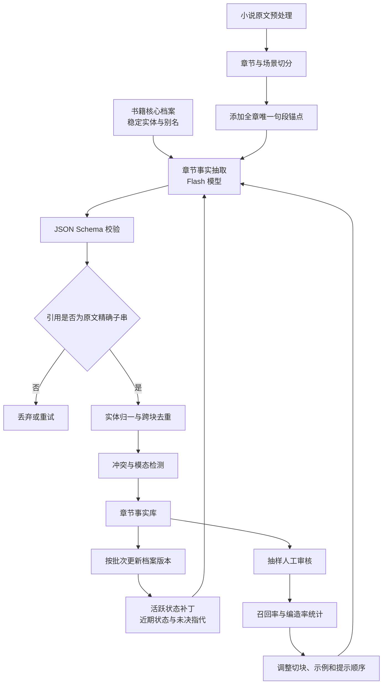

# 中文网络小说章节级事实抽取：上下文选择、排列与两段式提示工程研究

## 执行摘要

结论是：对低成本 Flash 档模型，最稳的结构不是单纯“指令全放前面”或“全放后面”，而是**前置固定规则—中间放档案与原文—末尾重复极短任务约束**。书籍档案只负责人物消歧，事实证据必须逐字来自本章；静态提示放在公共前缀以命中缓存，长章按场景切块并做多轮抽取，程序端强制校验引用原文，可同时改善召回、编造率和成本。citeturn16search0turn19search0turn19search1turn24search28

## 研究结论与做法对比

检索截至 **2026 年 7 月 31 日**。现有证据大多来自英文问答、分类、检索或通用文档抽取；直接针对“中文长篇网络小说、低价 Flash 模型、章节级事实抽取”的公开研究很少。因此，下面会区分三种证据：论文直接结论、厂商经验结论、结合你任务得到的工程推论。

### 核心判断

你的任务里有三类信息，不能混在一起处理：

- **规则**：什么算事实、什么不能抽、JSON 字段含义、证据要求。
- **档案**：人物别名、实体编号、已确认身份、当前卷背景，只用于消歧。
- **本章原文**：唯一允许支撑新事实的证据源。

最重要的设计原则是：**档案可以帮助模型理解“他是谁”，但不能证明“他做了什么”**。每条事实都必须带本章中的连续原文引用，并由程序检查引用是否真的是原文子串。这样即使档案陈旧、模型错误理解人物关系，也不容易直接生成无法落地的事实。

### 关键做法对比

| 做法名称 | 出处与日期 | 适用条件 | 与任务匹配度 | 优点 | 缺点与风险 |
|---|---|---|---|---|---|
| 关键指令只放开头 | OpenAI 通用提示建议；GPT‑4.1 指南，2025-04 citeturn19search0 | 中短上下文；只允许出现一份指令 | **中**：适合放静态定义，但长章节后模型可能遗忘 | 简单、缓存友好、规则优先级清楚 | 低端模型读完长原文后，容易漏掉前面的证据和格式约束 |
| 长资料在前、问题在末尾 | Anthropic 官方，当前文档；Google Gemini 指南，2026-06 citeturn19search10turn17search1turn17search10 | 文档通常达到数万 token，问题相对较短 | **高**：适合“档案＋章节→抽取请求” | 输出前刚看到具体任务，长文档问答通常更稳 | 若所有安全规则也只放末尾，部分模型的角色和格式约束可能变弱 |
| “三明治”结构：开头规则＋末尾短提醒 | OpenAI GPT‑4.1 长上下文指南；长指令遵循研究 citeturn19search0turn23view0turn23view1 | 长上下文、格式要求严格、轻量模型 | **高**：推荐默认方案 | 同时照顾前置指令优势和末尾近因效应 | 不能完整重复长规则，否则浪费 token；末尾只重复关键四五条 |
| 重要证据避免埋在超长上下文中部 | Liu 等，TACL 2024 citeturn16search0turn23view2 | 上下文中有大量干扰信息，目标事实位置不固定 | **高**：长章节、档案膨胀时风险明显 | 解释了为什么不能无限追加全书设定和历史摘要 | “中间丢失”程度随模型和任务变化，不能只靠换顺序解决 |
| 静态公共内容放在前缀，动态章节放后面 | OpenAI、Anthropic、Google、DeepSeek、阿里云缓存文档 citeturn19search1turn19search3turn17search25turn17search2turn20search1 | 大量章节共享规则、示例、书籍档案 | **高**：500–2000 章具有很高复用率 | 可显著降低重复输入的实际推理费用与延迟 | 档案每章改变会破坏缓存；需要版本化和稳定前缀 |
| 多次小范围抽取，而不是一次“抽尽所有事实” | Google LangExtract，2025-07 citeturn24search0turn24search28 | 单章信息密集、事实类型多、召回优先 | **高**：适合长章或重点章 | 多遍、小上下文通常比单次巨型任务召回更好 | 调用数增加；必须合并去重，建议按条件触发而非全量多遍 |
| 压缩背景档案，不压缩本章原文 | LongLLMLingua、RECOMP citeturn16search3turn16search7turn21search1 | 成本高、背景冗余、证据无需逐字还原时 | **高/低组合**：压缩档案为高，压缩原文为低 | 档案可明显减 token、降低注意力稀释 | token 级或摘要式压缩可能破坏原句，不能用于需要精确引用的章节正文 |
| 为正文预先添加句子或行号 | Google LangExtract 的精确来源定位思路；社区人工审核流水线 citeturn24search0turn24search2 | 输出需要可审计锚点 | **高**：直接对应你的核心目标 | 模型只需复制锚点，不必计算字符偏移；程序容易验证 | 行号必须在调用前生成；分块重叠时需保持全章唯一编号 |
| 使用少量正例和空结果示例 | Few-shot 排序研究、DeepSeek JSON 官方指南 citeturn16search1turn17search8 | 低端模型对字段语义或“无事实”情况理解不稳 | **高** | 能明显约束输出形状和“不该抽时不抽” | 示例顺序和内容会产生偏差；示例过多增加成本并诱导过拟合 |

**综合建议：采用“三明治＋稳定公共前缀”。**固定任务规则和少量示例放在最前面；书籍核心档案、动态状态补丁、本章原文依次放入；在原文后用约 80–160 个汉字重申“只抽本章、档案不可作证、必须逐字引用、只输出 JSON”。这同时符合 OpenAI 的首尾重复建议、Anthropic/Google 的长资料在前而具体请求在后的建议，也适合前缀缓存。citeturn19search0turn19search10turn17search1turn19search1

## 学术与实证研究

### 长上下文中的位置偏差

| 文献 | 主要结论 | 实验设置 | 适用条件 | 局限性 | 匹配度 |
|---|---|---|---|---|---|
| **Liu 等，《Lost in the Middle》，TACL 2024** citeturn16search0turn22view1turn23view2 | 相关信息在上下文开头或结尾时通常表现较好，放在中部时明显下降，形成近似 U 型位置曲线；标称支持长上下文不代表能稳定使用上下文各位置。 | 多文档问答和合成 key-value 检索；测试 MPT‑30B‑Instruct、LongChat‑13B、GPT‑3.5‑Turbo、Claude 1.3 等；控制文档数量和答案所在位置。 | 提示中同时放档案、长正文、示例和格式定义；目标证据可能位于章节任意位置。 | 主要是英文问答和人工检索任务；模型较旧；没有直接评价中文叙事抽取和引用忠实度。 | **高**：解释了为什么应控制档案长度、切分超长章、末尾重复任务；但不能直接推导某个固定位置对所有 Flash 模型都最好。 |
| **Liu 等的 query-aware contextualization 消融，2024** citeturn15view0 | 将查询同时放在上下文前后，对合成 key-value 检索改善很大，但对真实多文档问答帮助有限；说明重复任务有用，但不是万能修复。 | 在相同长上下文任务中，对比只放一次查询与首尾重复查询。 | 任务目标明确、答案可由局部精确检索得到。 | 对需要语义整合、人物指代和复杂事件理解的任务收益更不确定。 | **高**：支持“首尾放短约束”，但不支持重复完整长提示。 |
| **RULER，Hsieh 等，2024** citeturn21search2turn21search5 | 简单“针藏草堆”测试会高估长上下文能力；加入多针、多跳追踪和聚合后，模型随长度增长明显下降。17 个长上下文模型中，即使都声明至少 32K，上下文达到 32K 时只有约一半仍保持令人满意的表现。 | 13 个合成任务，包含检索、多跳、聚合和问答；上下文从 4K 扩到 128K。 | 需要从章节中抽取多条分散事实，而不是只找到一个关键词。 | 合成基准与自然小说差距较大；“令人满意”的阈值依论文定义。 | **高**：你的任务是多事实召回，比单针检索更接近 RULER 的多针与聚合场景。 |

对你的任务来说，RULER 比普通 needle-in-a-haystack 更有参考价值，因为一章里可能同时存在人物出现、动作、关系变化、物品转移、地点、时间和否定事件。只测“能否找到一条埋在正文里的句子”，会严重高估实际章节抽取能力。citeturn21search2turn24search28

中文任务还应单独做长度压力测试。OneRuler 的多语言实验发现，随着上下文从 8K 增长到 128K，高资源语言与低资源语言之间的表现差距会扩大；虽然中文不一定属于其最弱语言，但这说明英文长上下文结论不能不经测试地照搬到中文小说。citeturn21search8

### 示例顺序、近因偏差与指令遗忘

| 文献 | 主要结论 | 实验设置 | 适用条件 | 局限性 | 匹配度 |
|---|---|---|---|---|---|
| **Lu 等，《Fantastically Ordered Prompts》，ACL 2022** citeturn16search1turn16search5 | 完全相同的 few-shot 示例，仅改变排列顺序，表现就可能从接近随机变成接近最佳；某个模型上的好顺序不一定迁移到另一个模型。 | 在多种文本分类数据集和 GPT‑2/GPT‑3 式模型上枚举或搜索示例排列。 | 提示中放人物关系、事件、空输出等示例。 | 主要是分类，不是长文本生成；研究对象较旧；没有给出适用于所有任务的固定最佳顺序。 | **中**：说明示例必须固定并做模型级 A/B 测试，但不能直接决定档案与正文顺序。 |
| **Zhao 等，《Calibrate Before Use》，ICML 2021** citeturn16search6turn22view2turn23view3 | few-shot 对提示格式、示例选择和顺序非常敏感，存在多数标签偏差、近因偏差和常见 token 偏差；用无内容输入校准输出分布，部分任务最高提升 30 个绝对百分点。 | GPT‑2、GPT‑3；文本分类、事实检索和信息抽取；通过 `N/A` 等无内容输入估计标签先验。 | 有固定枚举标签、能获得各标签概率或 logit。 | 你的生成式 JSON API 通常拿不到完整标签概率；直接校准方法不易套用。 | **中**：更适合作为评测警告。可测试事实类型是否被示例频率带偏，但不建议直接照搬概率校准。 |
| **Robinette 等，《We Are What We Repeatedly Do》，Findings of EACL 2026** citeturn21search0turn23view0turn23view1 | 指令遵循率会随多轮上下文变长而下降；重新提示、重写、教学式提醒、摘要等缓解方式在部分模型上有效，最高改善约 79%，但小模型上的组合策略有时反而下降。 | VerIFY：28 种可验证指令、1–50 轮对话；Gemma 7B/27B、Llama 3 8B/70B；比较六类提示或模型侧缓解方法。 | 长上下文中必须持续遵守“只引用原文”“输出严格 JSON”等规则。 | 多轮对话、样式和安全指令为主；未研究单次章节抽取；实验没有系统角色。 | **高**：支持在正文后重复极短、可验证的硬约束；也提醒不要在 7B/Flash 档堆叠复杂自我检查话术。 |

示例顺序没有通用答案。对章节抽取，更稳的起点是：

1. 一个包含两三条**明确事实及精确引用**的正例；
2. 一个包含传闻、假设、心理猜测等干扰，但应输出空数组或仅输出带正确模态事实的反例；
3. 两个示例的顺序固定，不要随章节随机变化；
4. 在目标 Flash 模型升级或切换后重新跑顺序 A/B 测试。

这里不建议放很多不同题材的小说示例。示例越多，越可能稀释章节正文，也可能让模型模仿示例里的谓词和事实类型，而不是覆盖本章真实信息。Few-shot 排列高度敏感，且好顺序不稳定迁移，说明“少量、高质量、固定顺序”比“尽可能多”更适合成本敏感流水线。citeturn16search1turn16search6

### 上下文选择与压缩

| 文献 | 主要结论 | 实验设置 | 适用条件 | 局限性 | 匹配度 |
|---|---|---|---|---|---|
| **LongLLMLingua，Jiang 等，ACL 2024** citeturn16search3turn16search7turn16search11 | 通过问题感知的文档排序和 token 压缩，提高关键信息密度、减轻位置偏差和成本；论文报告在部分长上下文任务上，以约四倍压缩获得更好结果，约 10K token 提示压缩 2–6 倍时端到端延迟提升约 1.4–2.6 倍。 | Natural Questions、LooGLE 等长上下文问答；使用较小模型判断 token 或段落重要性，再交给目标模型。 | 背景资料、检索结果、历史摘要中存在大量冗余。 | 可能删掉代词、否定词、时间词和原句片段；压缩文本不能稳定支持逐字引用。 | **高/低**：压缩书籍档案为高；压缩本章证据原文为低。 |
| **RECOMP，Xu 等，ICLR 2024** citeturn21search1turn21search4 | 用抽取式或生成式压缩器将检索文档压成短摘要；发现资料无关时可返回空字符串，避免无用上下文干扰。 | 检索增强语言模型；训练抽取式和生成式压缩器，在问答及语言建模任务评价。 | 先检索大量历史设定，再选出与当前章节有关的小部分。 | 生成式摘要可能遗漏或改写事实；需要额外模型或训练；实验不是精确证据抽取。 | **中**：适合制作“本章活跃档案”，不适合替代正文引用。 |

因此，压缩应当有明确边界：

- **可以压缩**：人物稳定属性、别名表、势力关系、当前卷背景、前章遗留状态。
- **不应压缩**：本章正文、直接引语、否定词、时间与数量表达、事实引用片段。
- **不应让模型自行裁掉正文再抽取**：一旦第一阶段漏掉一句话，后续抽取不可能恢复召回。

这属于结合论文与任务约束得到的工程推论。压缩论文优化的是问答效果和 token，而你的审计目标还要求原句完整可回查，因此正文应保持原样，只压缩非证据背景。citeturn16search3turn21search1turn24search0

## 大厂官方指南

各厂商看起来存在“指令应该放前面还是后面”的冲突，其实针对的层次不同：

- 角色、安全、输出格式等**全局约束**适合放系统消息或提示开头。
- 长文档之后要执行的**具体问题或当前任务**适合放文档末尾。
- 长上下文中，可在末尾再重申一份短约束。
- 为了缓存，跨请求不变的内容必须在前，动态内容放后。

### 官方建议对比

| 厂商与来源 | 官方推荐做法及理由 | 适用条件 | 与任务匹配度 |
|---|---|---|---|
| **OpenAI GPT‑4.1 Prompting Guide，2025-04-14** citeturn19search0 | 长上下文中，指令同时放在上下文开头和结尾，比只放上方或下方表现更好；只能放一次时，放在上下文上方更好。 | GPT‑4.1；长上下文任务。其他模型需单独验证。 | **高**：直接支持“系统规则前置＋章末短提醒”。 |
| **OpenAI Prompt Caching，当前文档** citeturn19search1 | 缓存命中要求精确公共前缀；静态指令和示例放前面，用户特定或变化内容放后面。 | 支持提示缓存的 OpenAI 模型/API。 | **高**：500–2000 章共享规则、schema 和档案，节省空间很大。 |
| **Anthropic Claude Prompting Best Practices，当前文档** citeturn19search10 | 处理 20K token 以上长资料时，将文档放在顶部，查询、指令和示例放在后面；官方称复杂多文档测试中，查询置后最高改善约 30%。 | Claude 长上下文、多文档分析；数值未承诺迁移到其他模型。 | **高**：支持章节正文后紧接抽取请求，但应保留系统级前置硬规则。 |
| **Anthropic Prompt Caching，当前文档** citeturn19search3 | 稳定的系统指令、背景、长上下文和示例适合缓存；可按不同变化频率设置缓存断点；缓存内容应位于提示开头。 | Claude API，尤其是多轮和大文档处理。 | **高**：支持把通用规则、示例、书籍核心档案分成多个稳定层。 |
| **Google Gemini Prompt Design，2026-06-10** citeturn17search1turn17search10 | 关键行为限制、角色和输出格式放系统指令或用户提示开头；大量文档或代码先放完整上下文，再把具体问题和指令放在末尾，并用“依据以上信息”一类锚定语句。 | Gemini 长上下文，包括整本书、代码库等。 | **高**：与推荐的“三明治”结构几乎一致。 |
| **Google Context Caching，当前文档** citeturn17search25 | 将大型公共内容放在提示开头，并尽量让请求共享相似前缀，以提高隐式缓存命中概率。 | 支持 Gemini 缓存的模型；具体最小 token 和价格会变化。 | **高**：适合固定书籍档案后连续处理章节。 |
| **DeepSeek JSON Output，当前文档** citeturn17search8turn17search14 | 使用 `response_format: {"type":"json_object"}`；提示中明确出现 JSON 并给目标格式示例；合理设置最大输出长度，避免 JSON 截断；官方说明偶尔可能返回空内容。 | 支持 JSON Output 的 DeepSeek API 模型。 | **高**：能减少解析失败，但“合法 JSON”不等于事实正确，仍需引用校验。 |
| **DeepSeek Context Caching，2024-08-02 起** citeturn17search2turn17search5 | 后续请求与前次请求具有相同前缀时，重叠部分可从磁盘缓存读取；官方发布时声称缓存命中可大幅降低输入成本。 | DeepSeek API；费用和模型支持范围应以调用时文档为准。 | **高**：规则、示例、书籍档案应保持字节级稳定。 |
| **DeepSeek 关于长提示中资料与指令的具体排序** | 本次检索未找到类似 OpenAI、Anthropic、Google 那样明确的官方位置实验结论。 | 未说明。 | **中**：建议用 DeepSeek V4 Flash 自建位置 A/B 测试，不把其他厂商结论当作保证。 |
| **阿里云百炼 Prompt 指南，更新于 2026-05-12** citeturn20search0turn20search4 | 建议提示包含与任务密切相关的背景、明确目标、输出形式等元素；本次检索未找到“长文档一定放前或放后”的明确官方实验结论。 | 千问及百炼模型的一般提示设计。 | **中**：结构元素有参考价值，顺序仍需针对 Qwen Flash 测试。 |
| **阿里云降低幻觉 FAQ，更新于 2026-07-22** citeturn20search2turn20search9 | 明确要求模型只依据提供文档；信息不足时承认不知道；要求给出具体引用；复杂任务可拆分成多步。 | RAG、资料问答、事实性任务。 | **高**：与“只依据本章、每事实必须有引用、无证据不输出”完全对应。 |
| **阿里云上下文缓存，当前文档** citeturn20search1turn20search6 | 缓存请求的公共前缀；显式缓存可保证相同输入的确定性命中，隐式缓存自动识别公共前缀。 | 支持缓存的千问模型；具体价格、有效期和门槛可能调整。 | **高**：建议建立书籍级和卷级档案版本，而不是每章重写全部档案。 |

### 对厂商分歧的落地解释

在你的任务中，不建议二选一：

```text
方案甲：长系统指令 → 档案 → 本章正文
方案乙：档案 → 本章正文 → 全部指令
```

更稳的是：

```text
短系统硬规则
→ 固定少量示例
→ 书籍核心档案
→ 本卷/本章动态状态
→ 本章原文
→ 极短任务重申
→ 紧凑输出契约
```

其中，开头的规则解决角色、证据边界和结构化输出问题；末尾的重申让低成本模型在生成前重新聚焦；公共部分位于前缀，方便缓存。该组合不是任何一家厂商给出的原样模板，而是对 OpenAI、Anthropic、Google 和缓存文档的一致部分做的综合设计。citeturn19search0turn19search10turn17search1turn19search1turn17search25

## 开源与社区实例

### 两段式上下文工程实例

| 项目或实例 | 两段式结构与实现细节 | 已报告效果 | 适用条件与局限 | 匹配度 |
|---|---|---|---|---|
| **Anthropic Contextual Retrieval，官方工程博客与 Cookbook，2024-09** citeturn24search1turn24search21turn6search0 | 将完整文档和当前 chunk 同时交给模型，生成约 50–100 token 的 chunk 专属背景，再把背景前置到原 chunk，用于向量和 BM25 索引；通过提示缓存降低重复处理整篇文档的成本。 | 官方实验中，相对普通嵌入，Contextual Embeddings 将检索失败率降低约 35%；结合 BM25 约 49%；再加重排约 67%。这些是检索指标，不是事实抽取精确率。 | 适合让被切开的段落知道“人物是谁、当前部分属于什么主题”；生成背景可能带错误，不能作为最终事实证据。 | **高**：核心思想可直接改成“书籍档案＋章节块”，但证据仍必须来自原块。 |
| **Google LangExtract，开源库与官方博客，2025-07** citeturn24search0turn24search28 | 使用少量示例定义抽取任务；长文档分块并行处理；支持多次抽取以提升多事实召回；将抽取结果映射回精确原文位置，并可视化审计。 | 官方说明多次小范围处理用于改善长文档多事实召回，但 README/博客未给出统一的量化抽取准确率。 | 非完整的“档案生成阶段”，但非常接近你的第二阶段；默认独立分块可能丢失跨块指代和关系。 | **高**：精确来源映射、多遍抽取、结构化结果与目标高度一致。 |
| **LangExtract 跨块上下文问题，GitHub issue，2025-09** citeturn24search35 | 社区指出独立处理 chunk 会导致代词指代、人物消歧、跨块关系和连续事件信息损失；建议增加滑动上下文、实体追踪、重叠或后处理。 | 问题报告说明存在质量下降，但没有统一基准分数。 | 属于社区问题报告，不是受控论文；不同模型和文本差异较大。 | **高**：中文小说大量使用“他、她、此人、师兄”等省略和代词，正是档案层要解决的问题。 |
| **eggai-tech/qa-extraction-with-human-review** citeturn24search2turn6search10 | 提示向模型提供 Document Summary 和 Main Chunk；摘要负责语境，问题与答案必须由主 chunk 支撑；记录行号、chunk 来源，并通过 Label Studio 人工审核和质量过滤。 | 项目提供人工审核工作流，但未说明公开的精确率、召回率或幻觉率。 | QA 生成与事实抽取不同；摘要若含错误仍可能影响模型，需要强制“引用必须属于 Main Chunk”。 | **高**：是“背景档案先行、当前段落作证”的直接工程示例。 |
| **NVIDIA 社区式运行摘要提示** citeturn6search24 | 每处理一个新块，将“上一版运行摘要＋当前块”送入模型，要求更新限定长度的摘要，并明确只使用文档内容、不加入外部知识。 | 未找到针对事实抽取的公开量化评估。 | 适合顺序文档，但摘要会逐步丢失细节或累积错误；不宜让其成为事实证据。 | **中**：可用于维护“当前卷动态状态”，不适合维护全书完整事实库。 |
| **Chunker，开源项目，2026-04** citeturn24search3 | 先按结构制作层级摘要和语义树，再将每个 chunk 改写成可独立理解的版本，同时保留原始文本；改写时解析代词并补全隐含主体。 | README 未说明标准化准确率或召回率。 | “改写后的自包含文本”可能改变措辞，不可用作精确引用；原始文本必须并存。 | **中**：其“背景层＋原始层”思路有用，但事实抽取应从原始层引用。 |

### 从实例中可以复用的设计

两段式流程不应理解成“先把整本小说总结一遍，然后只看摘要抽事实”。更合适的是：

- **阶段 A：建立最小档案。**只保存实体 ID、别名、稳定身份、当前可见状态、重要地点和未解决指代，每一项都带来源章节。
- **阶段 B：逐章抽取。**同时提供最小档案和本章原文；档案负责解释代词和别名，本章原文负责证明事实。
- **阶段 C：程序合并。**引用校验、实体归一、重复合并、矛盾保留和档案更新都尽量由程序完成，而不是让模型在一个调用里完成全部工作。

Anthropic Contextual Retrieval 的效果说明，给局部 chunk 加上文档级背景可以明显改善局部信息的可检索性；LangExtract 和相关 issue 则说明，独立切块会丢失代词和跨块信息。两者共同支持使用“小而受控的档案”，但没有证据支持将生成式档案当成可靠事实源。citeturn24search21turn24search28turn24search35

## 推荐提示架构与产物格式

### 推荐分区顺序

下面的字数是**工程起始值**，不是模型硬限制。上线前应在 DeepSeek V4 Flash、Qwen Flash 等实际目标模型上，通过固定测试集调整。

| 顺序 | 分区名称 | 建议信息 | 字数或密度起点 | 注入角色 | 是否适合缓存 |
|---|---|---|---|---|---|
| 前置 | 静态任务契约 | 事实定义、证据边界、档案用途、禁止事项、模态和引用规则 | **200–400 汉字**；高密度，每句话都可验证 | `system` | 是，跨书共享 |
| 前置 | 字段语义与枚举 | 字段含义、允许的事实类型、`modality`、`polarity`、`grounding` | **150–350 汉字**；高密度 | `system`；原生 structured output 可移到 API schema | 是，跨书共享 |
| 前置 | 少量示例 | 一个正例、一个空结果或传闻反例；原文要短 | 总计 **500–1200 汉字** | 建议真实的 `user`/`assistant` 示例对 | 是，跨书或同题材共享 |
| 中部 | 书籍核心档案 | 实体 ID、别名、稳定身份、固定地点、长期关系；每项附来源章节 | **300–800 汉字**；极高密度 | `user` 中的结构化资料块 | 是，按书或按卷版本化 |
| 中部 | 活跃状态补丁 | 当前卷活跃人物、前章未结束状态、近期别名和地点 | **100–300 汉字**；只保留本章可能相关项 | `user` | 视更新频率而定 |
| 中后部 | 本章原文 | 完整、未经摘要的章节；每句或每段加唯一锚点 | 单章优先完整保留；超出实测有效长度时，每块约 **3000–6000 汉字**，重叠 2–4 段 | `user` | 否，每章变化 |
| 末尾 | 任务短提醒 | 只抽本章；档案不可作证；逐字引用；无证据不输出；只返回 JSON | **80–160 汉字**；极高密度 | `user`，紧跟正文 | 否，但成本很小 |
| 末尾 | 输出契约 | 必填字段、空输出形式、数组上限；已有 API schema 时不重复完整 schema | **150–350 汉字** | `user` 或 API structured output | 部分可缓存，但为保证近因可重复字段名 |

**角色选择建议：**

- `system` 只放跨章节不变的任务规则，不放整章正文。
- `assistant` 只用于展示经过人工确认的标准输出示例。
- 书籍档案和正文都放 `user` 数据块，并用明确标签隔开。
- 不建议把书籍档案伪装成上一轮 `assistant` 的结论。模型可能把它当成已确认答案，而不是仅供消歧的参考资料。
- 支持原生 JSON Schema、tool/function calling 或 strict structured output 时，把语法约束交给 API；提示词只说明字段语义。DeepSeek JSON 模式仍要求提示中明确 JSON 并给出格式引导。citeturn17search8turn17search11

### 档案应该保存什么

书籍档案应当短、可追溯、避免叙述性摘要。推荐结构：

```json
{
  "profile_version": "bookA-v007",
  "entities": [
    {
      "entity_id": "P0007",
      "canonical_name": "林玄",
      "aliases": ["林师弟", "玄儿", "黑衣少年"],
      "stable_identity": "青云宗外门弟子",
      "provenance_chapters": ["C0003", "C0011"]
    }
  ],
  "locations": [
    {
      "entity_id": "L0012",
      "canonical_name": "寒潭",
      "aliases": ["后山寒潭"],
      "provenance_chapters": ["C0018"]
    }
  ],
  "active_state": [
    {
      "entity_id": "P0007",
      "state": "左臂受伤，尚未明确痊愈",
      "since_chapter": "C0024"
    }
  ]
}
```

避免写成：

> 林玄是个心地善良但性格倔强的少年，经过许多磨难后已经成为大家信任的人……

这类描述信息密度低、主观性强，而且容易让模型把跨章推断当成当前章节事实。

档案中的动态状态最好采用**开放状态**而不是全历史：例如“仍携带玄铁令”“伤势未明确恢复”“正被赵家追捕”。状态在章节中明确终止后，从活跃档案移除，但底层事实数据库仍保留历史记录。

### 推荐流程图



### 示例系统提示词

```text
你是“中文小说章节事实抽取器”。

任务：
从用户给出的【本章原文】中抽取客观、可定位的章节事实，并输出严格 JSON。

证据规则：
1. 每条事实必须由【本章原文】中的连续原句直接支撑。
2. 【书籍核心档案】和【活跃状态补丁】只可用于人物、地点和别名消歧，不得作为事实证据。
3. evidence.quote 必须逐字复制本章原文，不得改写、补字或拼接不连续句子。
4. 没有本章原文证据的内容不得输出，即使档案、常识或前文已经说明。
5. 允许解析明确的代词指向，但 grounding 必须写 coreference_resolved。
6. 区分现实发生、计划、假设、传闻、转述、梦境和否定，不得把它们都写成已发生事实。
7. 无可抽取事实时返回 facts: []，不要为了填满结果而猜测。
8. 只输出符合约定结构的 JSON，不输出解释、Markdown 或思考过程。
```

### 示例用户提示词

```text
<book_core_profile version="bookA-v007">
{
  "entities": [
    {
      "entity_id": "P0007",
      "canonical_name": "林玄",
      "aliases": ["林师弟", "玄儿", "黑衣少年"]
    },
    {
      "entity_id": "P0015",
      "canonical_name": "赵无极",
      "aliases": ["赵长老"]
    }
  ]
}
</book_core_profile>

<active_state_delta>
- P0007：上一章左臂受伤，是否恢复尚未说明。
- P0015：上一章离开青云宗，当前去向未知。
注意：以上内容只用于消歧，不得作为本章事实的证据。
</active_state_delta>

<chapter_text chapter_id="C0025">
[C0025-L0001] 天色刚亮，林玄便推开了药庐的木门。
[C0025-L0002] 他左手仍缠着染血的布条，右手提着一只竹篮。
[C0025-L0003] 孙婆婆瞥了他一眼，道：“今日不要去后山。”
[C0025-L0004] 林玄口中答应，转身却沿着石阶向后山走去。
</chapter_text>

<final_task>
只抽取本章原文明示的事实。档案仅用于消歧，不得作证据。
每条事实必须附本章连续原句及锚点；不得补充前文、常识或推测。
区分实际行为、命令、语言承诺和身体状态。只返回 JSON。
</final_task>

<output_contract>
必填字段：fact_id、fact_type、subject、predicate、object、
polarity、modality、grounding、evidence。
无事实时输出 {"book_id":"bookA","chapter_id":"C0025","facts":[],"unresolved_mentions":[]}。
</output_contract>
```

### 示例输出

```json
{
  "book_id": "bookA",
  "chapter_id": "C0025",
  "source_hash": "sha256:...",
  "facts": [
    {
      "fact_id": "C0025-F001",
      "fact_type": "action",
      "subject": {
        "entity_id": "P0007",
        "mention": "林玄"
      },
      "predicate": "推开",
      "object": {
        "entity_id": null,
        "text": "药庐的木门",
        "value": null,
        "unit": null
      },
      "time": {
        "text": "天色刚亮",
        "normalized": null
      },
      "location": {
        "entity_id": null,
        "mention": "药庐"
      },
      "polarity": "affirmed",
      "modality": "actual",
      "grounding": "explicit",
      "evidence": [
        {
          "span_ids": ["C0025-L0001"],
          "quote": "天色刚亮，林玄便推开了药庐的木门。"
        }
      ]
    },
    {
      "fact_id": "C0025-F002",
      "fact_type": "physical_state",
      "subject": {
        "entity_id": "P0007",
        "mention": "他"
      },
      "predicate": "左手缠着",
      "object": {
        "entity_id": null,
        "text": "染血的布条",
        "value": null,
        "unit": null
      },
      "time": {
        "text": null,
        "normalized": null
      },
      "location": {
        "entity_id": null,
        "mention": null
      },
      "polarity": "affirmed",
      "modality": "actual",
      "grounding": "coreference_resolved",
      "evidence": [
        {
          "span_ids": ["C0025-L0002"],
          "quote": "他左手仍缠着染血的布条，右手提着一只竹篮。"
        }
      ]
    },
    {
      "fact_id": "C0025-F003",
      "fact_type": "movement",
      "subject": {
        "entity_id": "P0007",
        "mention": "林玄"
      },
      "predicate": "沿石阶前往",
      "object": {
        "entity_id": null,
        "text": "后山",
        "value": null,
        "unit": null
      },
      "time": {
        "text": null,
        "normalized": null
      },
      "location": {
        "entity_id": null,
        "mention": "石阶"
      },
      "polarity": "affirmed",
      "modality": "actual",
      "grounding": "explicit",
      "evidence": [
        {
          "span_ids": ["C0025-L0004"],
          "quote": "林玄口中答应，转身却沿着石阶向后山走去。"
        }
      ]
    }
  ],
  "unresolved_mentions": []
}
```

这里没有把“孙婆婆命令林玄不要去后山”直接写成“林玄没有去后山”，也没有根据上一章档案断言“林玄左臂仍处于受伤状态”。模型只抽取本章可直接表达的“左手仍缠着染血布条”；伤势是否存在、严重程度如何，可由后续规则或人工标注决定。

### 示例 JSON Schema

```json
{
  "$schema": "https://json-schema.org/draft/2020-12/schema",
  "title": "NovelChapterFacts",
  "type": "object",
  "additionalProperties": false,
  "required": [
    "book_id",
    "chapter_id",
    "source_hash",
    "facts",
    "unresolved_mentions"
  ],
  "properties": {
    "book_id": {
      "type": "string"
    },
    "chapter_id": {
      "type": "string"
    },
    "source_hash": {
      "type": ["string", "null"]
    },
    "facts": {
      "type": "array",
      "items": {
        "$ref": "#/$defs/fact"
      }
    },
    "unresolved_mentions": {
      "type": "array",
      "items": {
        "type": "object",
        "additionalProperties": false,
        "required": ["mention", "span_ids", "reason"],
        "properties": {
          "mention": {
            "type": "string"
          },
          "span_ids": {
            "type": "array",
            "items": {
              "type": "string"
            },
            "minItems": 1
          },
          "reason": {
            "enum": [
              "unknown_entity",
              "ambiguous_coreference",
              "uncertain_time",
              "uncertain_location",
              "other"
            ]
          }
        }
      }
    }
  },
  "$defs": {
    "entity_ref": {
      "type": "object",
      "additionalProperties": false,
      "required": ["entity_id", "mention"],
      "properties": {
        "entity_id": {
          "type": ["string", "null"]
        },
        "mention": {
          "type": ["string", "null"]
        }
      }
    },
    "object_value": {
      "type": "object",
      "additionalProperties": false,
      "required": ["entity_id", "text", "value", "unit"],
      "properties": {
        "entity_id": {
          "type": ["string", "null"]
        },
        "text": {
          "type": ["string", "null"]
        },
        "value": {
          "type": ["number", "string", "null"]
        },
        "unit": {
          "type": ["string", "null"]
        }
      }
    },
    "time_value": {
      "type": "object",
      "additionalProperties": false,
      "required": ["text", "normalized"],
      "properties": {
        "text": {
          "type": ["string", "null"]
        },
        "normalized": {
          "type": ["string", "null"]
        }
      }
    },
    "evidence": {
      "type": "object",
      "additionalProperties": false,
      "required": ["span_ids", "quote"],
      "properties": {
        "span_ids": {
          "type": "array",
          "items": {
            "type": "string"
          },
          "minItems": 1
        },
        "quote": {
          "type": "string",
          "minLength": 1
        }
      }
    },
    "fact": {
      "type": "object",
      "additionalProperties": false,
      "required": [
        "fact_id",
        "fact_type",
        "subject",
        "predicate",
        "object",
        "time",
        "location",
        "polarity",
        "modality",
        "grounding",
        "evidence"
      ],
      "properties": {
        "fact_id": {
          "type": "string"
        },
        "fact_type": {
          "enum": [
            "identity",
            "alias",
            "action",
            "movement",
            "speech",
            "relationship",
            "physical_state",
            "mental_state_explicit",
            "possession",
            "transfer",
            "location",
            "time",
            "quantity",
            "death",
            "injury",
            "ability",
            "rule",
            "other"
          ]
        },
        "subject": {
          "$ref": "#/$defs/entity_ref"
        },
        "predicate": {
          "type": "string",
          "minLength": 1
        },
        "object": {
          "$ref": "#/$defs/object_value"
        },
        "time": {
          "$ref": "#/$defs/time_value"
        },
        "location": {
          "$ref": "#/$defs/entity_ref"
        },
        "polarity": {
          "enum": [
            "affirmed",
            "negated"
          ]
        },
        "modality": {
          "enum": [
            "actual",
            "reported",
            "planned",
            "ordered",
            "promised",
            "hypothetical",
            "rumor",
            "dream"
          ]
        },
        "grounding": {
          "enum": [
            "explicit",
            "coreference_resolved"
          ]
        },
        "evidence": {
          "type": "array",
          "items": {
            "$ref": "#/$defs/evidence"
          },
          "minItems": 1
        }
      }
    }
  }
}
```

### 低成本模型的 token 优化

**稳定前缀分层。**把通用系统规则、schema 语义、固定示例、书籍核心档案依次放在动态章节之前。核心档案不要每章改写，可按卷或每 20–50 章生成新版本；近期变化放在很短的 `active_state_delta`。这能保留较长公共前缀，提高各厂商缓存命中机会。具体版本周期需要按小说状态变化速度调整。citeturn19search1turn19search3turn17search25turn17search2turn20search1

**不要在提示里反复展开完整 JSON Schema。**API 支持 structured output 时，schema 由请求参数传递，提示只保留字段语义和一个小示例。仅支持 JSON mode 时，给一个紧凑示例和空数组示例即可。合法 JSON 与事实正确是两件事，引用子串验证仍要独立运行。citeturn17search8turn17search11

**锚点由程序生成。**不要让模型计算字符起止位置。中文标点、Unicode、清洗前后文本差异会让偏移量容易出错。预处理时生成 `[章节-L0001]` 形式的全局句段编号，模型只复制编号和原句；程序再计算真正的字符偏移。

**字段名保持短但可读。**不建议把 `subject` 缩成 `s`、`evidence` 缩成 `e`。极短字段虽然省少量 token，却会降低低端模型对字段语义的稳定理解。更有效的节省来自减少叙述性规则、控制档案长度和命中缓存。

**多遍抽取按风险触发。**普通短章只调用一次；长章、人物密集章或首遍事实密度异常低时，再启动分类补抽。例如第二遍只查“状态与关系变化”，第三遍只查“物品、数量、时间和地点”。LangExtract 采用分块、并行和多次抽取来应对长文档多事实召回，但调用次数增加，因此更适合条件触发。citeturn24search28

## 流水线执行与评测

### 切块与合并策略

单章在目标模型的实测有效范围内时，优先整章输入。超过有效范围后，按场景、空行、视角切换或明显叙事边界切分，不要只按固定 token 生硬截断。

推荐的分块规则是：

- 每块约 3000–6000 汉字作为测试起点，而不是固定标准。
- 相邻块重叠 2–4 个自然段，或约 10%。
- 每个块继续使用全章唯一行号，不能重新从 `L0001` 编号。
- 给当前块附上极短的活跃实体表，但不附完整历史。
- 跨块合并时，以“规范化主体＋谓词＋客体＋时间＋模态”作为候选键。
- 两条事实引用不同但语义相同，可合并并保留多个 evidence。
- 引用相同但模态不同、否定不同、时间不同，不能强行合并。

独立分块容易丢失代词指向和跨块事件，LangExtract 社区已经报告这一问题；结构感知切分、重叠、实体追踪和后处理比单纯扩大 chunk 更有针对性。citeturn24search35turn24search3

### 必须由程序执行的验证

| 检查项 | 实现方式 | 失败处理 |
|---|---|---|
| JSON 语法 | 标准 JSON parser | 可做一次“只修复格式、不增加事实”的低价重试 |
| Schema 合法性 | JSON Schema validator | 缺字段可修格式；枚举越界则退回重抽 |
| 引用存在 | 检查 `quote in chapter_text` | 事实直接拒绝，不让模型解释 |
| 锚点一致 | 将 `span_ids` 对应文本拼出，确认包含 quote | 拒绝或标记人工审核 |
| 证据来自本章 | 锚点章节号必须等于当前章 | 直接拒绝 |
| 引用连续 | quote 必须是单一连续子串 | 拒绝拼接式“证据” |
| 档案污染 | 检查 quote 是否只出现在档案、未出现在正文 | 直接拒绝 |
| 主体可解析 | entity ID 存在，或进入 unresolved | 不强行新建实体 |
| 重复事实 | 规范化键＋引用重叠度 | 合并 evidence，不丢引用 |
| 模态冲突 | actual、rumor、planned、dream 分开比较 | 保留冲突，禁止自动覆盖 |

引用存在检查成本极低，却能挡住大量“看似合理但原文没有”的输出。它不能证明模型对原句的解释一定正确，因此还要抽样检查语义蕴含：即原文是否真的能够推出结构化事实，而不仅是包含了相同词语。

### 推荐评测指标

| 指标 | 定义 | 优先级 |
|---|---|---|
| 事实精确率 | 输出事实中，经人工判定被本章明确支持的比例 | 极高 |
| 事实召回率 | 金标事实中被系统成功抽到的比例 | 极高 |
| 无依据编造率 | 没有本章有效证据的事实数 ÷ 全部输出事实数 | 极高 |
| 引用精确匹配率 | quote 能作为本章连续子串找到的比例 | 极高 |
| 引用充分率 | 引用是否足以支撑主体、谓词、客体和模态 | 极高 |
| 模态准确率 | 传闻、计划、否定、梦境等是否被误写成现实事实 | 高 |
| 实体归一准确率 | 别名和代词是否映射到正确 entity ID | 高 |
| 章节级全通过率 | JSON、schema、引用和实体检查全部通过的章节比例 | 高 |
| 每万字输入成本 | 包含缓存命中后的实际输入费用 | 高 |
| 每章重试率 | 格式、空输出或引用失败导致的重试比例 | 中 |
| 重复事实率 | 合并前重复事实数占比 | 中 |

金标集不必覆盖几千章。更实用的起点是抽取约 100–200 章，按章节长度、人物数量、对话比例、战斗/日常、视角切换、回忆、梦境和传闻进行分层。重点比较五种变量：指令只前置、只后置、首尾重复；有无档案；档案长度；整章与切块；单遍与条件式多遍。RULER 和长上下文研究都说明，模型的标称窗口不能替代真实任务评测。citeturn21search2turn16search0

低成本模型尤其要测试**空结果能力**。准备一些几乎只有环境描写、心理活动、假设、重复回顾或无法确定主体的片段，观察模型是否为了满足任务而硬凑事实。空输出示例、严格证据约束和程序引用校验应一起测试，不能只看 JSON 是否有效。

### 不超过三百字的执行建议

将流水线拆成档案维护与章节抽取两层：按书或卷缓存稳定的实体别名档案，仅用短补丁记录近期状态；正文预先添加全章唯一锚点，长章按场景切块并保留少量重叠。每块独立抽取后，由程序检查 JSON、原文子串和锚点，再按实体—谓词—客体—时间—模态合并。普通章节单遍处理，长章或事实密度异常时触发分类补抽。随机复核 1%–5%，并全量复核引用失败、实体冲突、模态异常和档案更新项，以持续估算召回率与编造率。