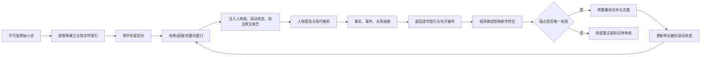

# 长篇中文叙事文本的小模型事实抽取：喂料策略研究与工程方案

## 执行摘要

面向中文网文章节级事实抽取，最稳妥的低成本方案不是“尽量把整章甚至整本书塞进模型”，而是采用**章节作为外层边界、句子感知的 token 窗口作为内层边界**：短章整章处理，长章按约 **800–1,600 token** 的正文窗口切分，默认 **10%–20% 重叠**，并在每个窗口前注入一份带证据的滚动人物状态，而不是累计注入越来越长的章节摘要。人物应使用全书稳定的 `character_id`，别名表只作为辅助上下文；原文不能直接替换，否则字符位会失真。事实抽取时，小模型只负责返回**逐字短引、句子编号和人物 ID**，字符位由程序在不可变原文上确定性计算。这样可以把“语义判断”和“精确定位”拆开，避免让小模型同时做事实理解、共指消解、字符串复制和数字计数。现有证据表明，长上下文模型仍存在明显的“中间信息利用下降”，书级共指性能也显著低于短文本；重叠窗口、结构化切分、上下文摘要和精细引用均可能改善效果，但目前没有一项公开研究直接给出“中文网文事实抽取”的普适最优窗口，因此下文参数应视为**可上线的初始配置**，再用自己的章节样本做小规模网格评测。citeturn4view7turn5view0turn5view1turn4view1turn8view5turn8view8

## 证据基础与关键判断

公开文献对这个问题的证据并不完全对齐。分块研究大多来自 RAG、长文摘要和通用文档抽取；叙事研究则主要评估人物识别、小说共指和说话人归属。它们可以共同支持工程设计，但不能把某个金融问答或法律摘要实验中的最佳参数，直接当成中文网文的定论。

| 证据方向 | 主要发现 | 对中文网文抽取的含义 |
|---|---|---|
| 长上下文利用 | 相关信息位于长输入中间时，模型表现经常明显下降；标称上下文长度不等于有效上下文长度。citeturn4view7turn4view0 | 即使模型支持 16K、128K，也不宜默认整章整书直灌；当前正文应保持在输入尾部附近。 |
| 分块大小 | 多数据集研究发现，短事实型答案偏好更小的块，分散、解释型答案需要更大的块；512 和 1,024 token 经常是较强基线，但不同数据集最优值不同。citeturn4view3turn9view3turn4view0 | 单句事实可用较小窗口，人物关系变化、跨句事件应适当扩大；不要只维护一个固定块大小。 |
| 重叠窗口 | NVIDIA 的 FinanceBench 实验在测试的 10%、15%、20% 中以 15% 最好，但不是完整参数搜索；其他系统使用 500/50 token，即 10% 重叠；结构化摘要研究使用两句重叠。citeturn9view3turn10view3turn10view1 | 10%–20% 是合理起点，不是普适最优值；小说对话密集或指代密集处可提高到 20%–25%。 |
| 结构化切分 | 固定长度过大容易带入无关内容，过小则破坏语义完整性；结构或语义感知切分通常能改善检索或局部内容选择，但也可能产生跨块连贯性损失。citeturn10view0turn10view2 | 章节、场景、段落和完整句应优先于机械 token 边界；仍需硬上限和重叠来兜底。 |
| 长文抽取 | SLIDE 在其长文知识图谱抽取实验中报告，重叠局部窗口提升了实体和关系抽取；LMDX 则要求模型返回原文片段和段落标识，并以确定性子串验证过滤幻觉。citeturn4view1turn7view0turn8view5 | “局部语义窗口 + 原文机械验证”比“模型自行回忆全书并计算位置”更符合成本敏感场景。 |
| 小说共指 | 中文小说包含姓名、别名、昵称、普通名词称谓、代词和零代词；说话人信息能帮助共指，但中文小说零代词仍明显困难。citeturn4view5turn5view2turn5view3 | 人物解析不能只靠姓名字符串；对话说话人、视角、亲属称谓和省略主语都要进入状态。 |
| 书级处理 | BOOKCOREF 显示，即使专门的长文共指系统，在整本书上的分数也显著低于切成较短窗口后的结果。citeturn5view0turn5view1 | “上下文越长越好”不成立；全书状态应压缩成结构化记忆，不应重复塞入原始全文。 |
| 输出格式与锚点 | 一项覆盖 280 多组实验的研究发现，仅改变输出格式，部分设置的 F1 就可变化超过 40%；token 级格式常有优势，但没有一种格式在所有任务和模型上始终最好。citeturn6view6turn8view6turn8view7 | 输出格式本身必须纳入评测。小模型生产环境宜使用短而固定的 JSON，并把偏移计算留给程序。 |

由此可以得到三个关键判断。

**章节适合作为语义容器，不适合作为唯一的推理窗口。** 章节边界通常比固定 token 更接近作者的叙事组织，但网文章节长度、对话密度和场景数量差异很大。最合理的做法是“按章管理、章内再切”：保留章节 ID、标题和顺序，章内按照场景或段落边界合并完整句，直到接近 token 预算。

**重叠主要解决局部边界，不能解决全书人物记忆。** 两三句重叠能保住“他说”“她转身”等紧邻先行词，却不能解释十章前出现的旧称谓。跨章问题要靠稳定人物 ID、别名表、最近状态和带证据的开放事件来解决。

**字符位不应由小模型直接计数。** 数字偏移是一项机械工作，模型更适合挑出原文短引。LMDX 的做法正是先要求文本片段与段落标识，再检查片段是否确实存在；LongCite 也把粗粒度定位进一步拆成句子级证据抽取。citeturn7view0turn8view5turn7view5turn8view9

## 分块与滑动窗口参数

### 推荐的切分层级

推荐顺序是：

```text
小说
  └─ 卷
      └─ 章                         ← 外层管理单位
          └─ 场景/明显时间地点切换   ← 有可靠规则时优先
              └─ 段落
                  └─ 完整句          ← 实际拼装窗口的最小单位
```

固定 token 只用于限制窗口上限，不应在一个中文句子或引号中间强行截断。结构化切分研究指出，过大的块会引入无关信息，过小的块则缺乏语义完整性；按结构切分后再用少量句子重叠，可以降低硬边界带来的上下文断裂。citeturn10view0turn10view1turn10view2

具体拼装逻辑可以直接写成：

```text
按章节遍历
→ 按段落切分
→ 段落内按完整句切分
→ 从前向后累加句子，直到达到 target_tokens
→ 若加入下一句会超过 max_tokens，则结束当前块
→ 下一块从前一块末尾 overlap_tokens 或至少 overlap_sentences_min 句开始
→ 永远不在引号、括号、句子中间切断
```

### 不同上下文窗口的初始参数

表中的“上下文窗口”指模型输入和输出的总预算，不是可全部用于正文的预算。系统提示、任务定义、别名表、跨章状态、输出 JSON 和安全余量都要占用 token。考虑到长输入的位置偏差和输出空间，成本敏感配置只让正文使用总窗口的大约 35%–55%；质量优先配置可适当扩大，但仍不建议把窗口填满。长上下文研究和 RAG 实验都表明，增加上下文利用率并不必然提高效果。citeturn4view0turn4view7

中文字符与 token 没有统一换算率，因为不同 tokenizer 的词表、合并规则和中文覆盖不同，tokenizer 选择也会改变成本与有效序列长度。上线前应在目标模型上抽取至少 100 个真实段落，计算：

```text
r = 中位数(token_count / Unicode字符数)
推荐字符窗口 = token窗口 / r
```

下表字符数按 `r = 0.7～1.2 token/字符` 给出宽范围，仅作冷启动估值；实际配置应以目标模型 tokenizer 为准。Tokenizer 的 fertility，即表示文本所需 token 数量，会因模型和语言而变。citeturn11search14turn11search25

| 模型总上下文 | 成本敏感正文窗口 | 质量优先正文窗口 | 建议重叠 | 成本敏感步长 | 中文字符冷启动范围 | 大致完整句数 | 适用方式 |
|---|---:|---:|---:|---:|---:|---:|---|
| 2K | 650–850 token | 850–1,050 token | 12%–18%，至少 2 句 | 520–750 token | 约 540–1,210 字符 | 10–22 句 | 仅适合局部事实。别名表必须裁剪到当前活跃人物，输出字段保持极简。 |
| 4K | 1,000–1,300 token | 1,400–1,800 token | 12%–18%，2–4 句 | 820–1,140 token | 约 830–2,570 字符 | 18–38 句 | 推荐的小模型默认档；能覆盖多数单场景网文章节片段。 |
| 8K | 1,400–1,900 token | 2,200–3,000 token | 15%–20%，3–6 句 | 1,120–1,615 token | 约 1,170–4,290 字符 | 25–65 句 | 可处理关系变化和较长对话，但仍应分块，不要整章硬塞。 |
| 16K | 1,800–2,600 token | 3,000–4,500 token | 15%–20%，3–8 句 | 1,440–2,210 token | 约 1,500–6,430 字符 | 35–95 句 | 适合多场景章或二次核验；关键别名和规则放在输入前部，正文靠后。 |
| 超长或近似无限 | 1,500–3,000 token | 3,000–5,000 token | 10%–20% | 随窗口变化 | 由 tokenizer 实测 | 30–110 句 | 仍以局部窗口抽取；超长能力用于全章索引、冲突核验或检索，不用于每次整书直灌。 |

这些数值是综合建议，不是某篇论文直接得出的中文网文最优解。其依据包括：事实型检索常在 256–512 或 512 token 附近表现较好，复杂上下文任务常偏向 1,024 token；极小的 128 token 和过大的 2,048 token 在多组文档实验中经常不如中间档；另一项长文检索研究则发现，短答案可偏向 64–128 token，分散答案需要 512–1,024 token。小说事件通常跨越多个句子，并带有对话和指代，因此正文抽取窗口应比纯事实检索块略大。citeturn9view3turn4view3turn4view0

### 按章节长度选择参数

| 章节情况 | 推荐策略 | 默认参数 | 理由 |
|---|---|---|---|
| 短章：整章正文不超过当前正文预算的 70% | 整章单块 | 不做章内重叠；额外附前章末尾 2 句 | 章节结构完整，没必要制造重复调用。 |
| 中章：约为正文预算的 0.7–2 倍 | 章内句子窗口 | 1,000–1,500 token，15% 重叠 | 多数网文章节的默认处理方式。 |
| 长章：约为正文预算的 2–6 倍 | 先按场景或段落簇切，再做句子窗口 | 1,200–1,800 token，15%–20% 重叠 | 防止场景混杂，也避免关系和对话被切断。 |
| 超长章：超过约 10K token，场景很多 | 粗扫加精抽两阶段 | 粗扫 500–800 token；精抽 1,200–2,000 token | 粗扫只找人物、事件候选和高风险指代，再对候选附近做精确抽取。 |
| 对话密集、代词密集 | 增加句子重叠，不盲目扩大整块 | 至少 4–6 句，或 20%–25% | 小说研究表明，说话人和对话信息与人物共指相互帮助。citeturn7view6turn5view2 |
| 动作流水账、人物少 | 减小窗口和重叠 | 700–1,100 token，10%–12% | 事实局部性强，较小块能减少无关叙述。 |
| 关系转折、身份揭示、回忆插叙 | 扩大窗口并触发二次核验 | 1,800–3,000 token，20% 左右 | 这类事实常依赖远处前提，不宜只看单句。 |

### 可直接复制的两套配置

成本敏感版适合 4K 左右的小模型：

```yaml
chunking:
  outer_unit: chapter
  boundary_priority:
    - scene_break
    - paragraph
    - sentence
  target_tokens: 1100
  max_tokens: 1350
  overlap_tokens: 150
  overlap_ratio_max: 0.18
  overlap_sentences_min: 2
  overlap_sentences_max: 4
  never_split_inside:
    - sentence
    - quotation
    - bracket_pair

context:
  previous_raw_tail_sentences: 2
  state_budget_tokens: 180
  alias_budget_tokens: 220
  max_active_characters: 12
  output_budget_tokens: 450

inference:
  passes: 1
  retry_only_when:
    - quote_not_found
    - ambiguous_alias
    - invalid_json
  temperature: 0
```

质量优先版适合 8K–16K 模型：

```yaml
chunking:
  outer_unit: chapter
  boundary_priority:
    - scene_break
    - paragraph
    - sentence
  target_tokens: 2200
  max_tokens: 2800
  overlap_tokens: 380
  overlap_ratio_max: 0.20
  overlap_sentences_min: 4
  overlap_sentences_max: 8

context:
  previous_raw_tail_sentences: 4
  state_budget_tokens: 400
  alias_budget_tokens: 600
  max_active_characters: 30
  include_open_events: true
  include_recent_locations: true
  output_budget_tokens: 900

inference:
  passes:
    - mention_and_coreference
    - fact_extraction
    - boundary_conflict_check
  temperature: 0
  require_grounding: true
```

## 跨章状态与上下文注入

跨章信息不应通过“把前面所有章节摘要不断累加”来保留。累计摘要会越来越长，还可能把早期抽取错误固化成后续模型的前提。更合适的是维护一份**滚动状态包**，只保存当前章节可能用到的角色、最近位置、开放事件和未解决指代，而且每条状态必须带原文证据引用。

Meta-Chunking 研究提出用全局信息生成补充摘要，弥补局部块缺少的背景和关系；Contextual RAG 也会为每个块生成一小段“它在整篇文档中处于什么位置”的说明。它们共同支持“给局部块补一份短小全局背景”，但不支持把全局摘要当作可引用原文。citeturn9view2turn10view3

推荐状态结构如下：

```json
{
  "chapter_id": "ch_018",
  "story_time": {
    "value": "当夜",
    "confidence": 0.84,
    "evidence": ["ch_017:S044"]
  },
  "current_location": {
    "value": "沈府",
    "confidence": 0.96,
    "evidence": ["ch_017:S051"]
  },
  "active_characters": [
    {
      "character_id": "C001",
      "canonical_name": "沈砚",
      "recent_aliases": ["少爷", "沈少爷"],
      "last_seen": "从正厅离开",
      "last_seen_evidence": "ch_017:S052"
    }
  ],
  "open_events": [
    {
      "event_id": "E033",
      "description": "沈老爷命人叫沈砚去书房",
      "status": "open",
      "participants": ["C001", "C003"],
      "evidence": ["ch_017:S050-S051"]
    }
  ],
  "unresolved_mentions": [
    {
      "mention": "那位客人",
      "candidate_ids": ["C021", "C028"],
      "evidence": "ch_017:S048"
    }
  ]
}
```

每个新窗口的输入顺序建议固定为：

```text
任务与禁止事项
→ 当前活跃人物表
→ 前文滚动状态
→ 前一窗口或前一章末尾的少量原文
→ 当前原文窗口
→ 再重复一次最关键的输出约束
```

这样做有两个原因。关键人物 ID 和规则位于输入开头，当前正文位于靠近输出的尾部，可以减少“关键信息被埋在中间”的风险；前章只保留两到四句原文尾巴，能承接“他说”“于是她”等边界指代。长上下文位置研究发现，模型对开头和结尾信息通常利用得更好，而位于中间的信息更容易被忽略。citeturn4view7

状态更新应采用“候选—验证—写入”方式：



跨章状态要遵守以下约束：

| 约束 | 工程规则 |
|---|---|
| 摘要不能充当证据 | `state.description` 只能辅助推理，最终事实必须引用当前或历史原文句子。 |
| 状态不能无限增长 | 活跃人物保留最近出现或当前开放事件涉及的人；其他人物只留在全书人物库。 |
| 不能静默覆盖冲突 | 新事实与旧状态矛盾时，创建 `conflict`，不要直接改写旧事实。 |
| 不确定指代不能强合并 | 保留 `UNRESOLVED` 或候选人物列表；CHARLES 的人物标注方案也专门设置了 UNKNOWN/UNRESOLVED 类别来处理无法唯一识别的别名。citeturn6view1turn8view1 |
| 每条状态必须可追溯 | 至少保存 `chapter_id + sentence_id`，最好同时保存字符位。 |
| 章节摘要应增量生成 | 只总结本章新增的人物状态、事件变化和未解决线索，不重复整本故事梗概。 |

## 人物别名、指代与叙事专门抽取

### 叙事文本为什么比普通实体抽取更难

小说中的“人物表示”不只包括姓名。中文小说研究明确列出了姓名、别名、昵称、代词、描述性名词短语和零代词，例如“头胎儿子”可以指代具体人物，而省略主语的动作也可能延续上一人物。该研究在一部中文小说上的非零共指 F1 为 70.62%，零代词 F1 只有 32.25%，说明省略主语仍是明显短板；加入对话说话人信息后，共指表现能够得到帮助。citeturn4view5turn5view2turn5view3

小说对话还存在三种难度不同的情况：

| 类型 | 示例 | 处理难度 |
|---|---|---|
| 显式说话人 | “我不去。”沈砚说道。 | 较低，可由姓名和言语动词定位。 |
| 回指式说话人 | “我不去。”他低声道。 | 需要先解决“他”指谁。 |
| 隐式说话人 | “我不去。”下一句直接换人回应。 | 需要对话轮次、最近人物和人物语言风格。 |

小说说话人归属研究指出，回指式和隐式引语往往需要局部对话模式、远距离人物链接，以及角色的风格、身份和性别等全局表示。FanfictionNLP 更进一步，把共指和说话人归属交错执行，用说话人结果反过来解析引语中的第一、第二人称代词。citeturn6view2turn8view2turn7view6turn8view0

因此，推荐流程不是“直接让一个提示一次性抽全部事实”，而是：

```text
显式姓名和称谓候选
→ 人物提及聚类
→ 对话检测和说话人归属
→ 利用说话人再次解析“我/你/咱们”
→ 事实、事件和关系抽取
→ 跨块人物与事实合并
```

在成本敏感模式下，可以让模型一次输出以上中间字段，但后端仍应按这个顺序校验；在质量优先模式下，人物解析和事实抽取应拆成两次调用。

### 别名处理方案比较

| 方法 | 做法 | 优点 | 风险与建议 |
|---|---|---|---|
| 稳定别名表 | 为每个人物设置全书不变的 `C001`、`C002`，列出已确认别名 | 最容易跨章合并；输出短；适合小模型 | 别名错误会向后传播。必须保存证据、置信度和 `do_not_merge`。 |
| 动态提及编号 | 给当前块内每个提及加 `M001`、`M002`，再链接到人物 ID | 能精确区分同名、同姓和重复代词 | 编号会增加输入长度；人物 ID 必须全书稳定，提及 ID 才能块内动态。 |
| 上下文内替换 | 将句首“他”替换成代表姓名，例如“沈砚〔原文：他〕” | 独立片段更易理解；已有小说关系研究使用代表别名替换第三人称主语。citeturn7view7turn8view4 | 会破坏原文字符位，也可能把错误共指伪装成事实。只能生成辅助视图，不能修改锚点原文。 |
| 原文加旁注 | 保留“他”，在句子旁提供 `他→C001?` | 不破坏原文，适合 grounding | 提示稍长；不确定时必须保留问号和候选。 |
| 只依赖模型临时判断 | 每个窗口重新猜人物 | 无前处理成本 | 跨章 ID 漂移最严重，不建议作为生产方案。 |

推荐采用**稳定别名表 + 块内提及编号 + 不可变原文**。上下文替换仅作为第二份“解析视图”，不能替代原文视图。

已有小说工程会把人物的最高频专名作为代表别名，并在独立片段中替换首次出现的第三人称主语，以提升片段可理解性。这个方法适合关系分类或摘要，但不适合直接生成字符位；更安全的改造是双视图输入：citeturn6view4turn8view4

```text
[原文视图，供引用]
阿七抬头看了他一眼。

[解析旁注，供推理]
句中“他”的候选：C001 沈砚，置信度 0.91。
```

### 别名表格式范例

JSON 适合程序直接注入：

```json
{
  "characters": [
    {
      "id": "C001",
      "canonical_name": "沈砚",
      "aliases": ["沈少爷", "少爷", "砚儿"],
      "titles_or_relations": ["沈老爷之子"],
      "pronoun_profile": ["他", "您"],
      "status": "active",
      "confidence": 0.98,
      "evidence_refs": ["ch_001:S003", "ch_004:S018"],
      "do_not_merge_with": ["C014"]
    },
    {
      "id": "C002",
      "canonical_name": "阿七",
      "aliases": ["七哥", "小七"],
      "titles_or_relations": ["沈府仆从"],
      "pronoun_profile": ["他", "我"],
      "status": "active",
      "confidence": 0.94,
      "evidence_refs": ["ch_002:S011"],
      "do_not_merge_with": []
    }
  ]
}
```

YAML 更适合人工检查：

```yaml
characters:
  - id: C001
    canonical_name: 沈砚
    aliases:
      - 沈少爷
      - 少爷
      - 砚儿
    roles:
      - 沈老爷之子
    recent_location: 沈府正厅
    confidence: 0.98
    evidence:
      - ch_001:S003
      - ch_004:S018
    do_not_merge_with:
      - C014

  - id: C002
    canonical_name: 阿七
    aliases:
      - 七哥
      - 小七
    roles:
      - 沈府仆从
    confidence: 0.94
    evidence:
      - ch_002:S011
```

纯文本最省 token，适合 2K–4K 小模型：

```text
人物表：
C001 沈砚｜别名：沈少爷、少爷、砚儿｜沈老爷之子｜勿与 C014 合并
C002 阿七｜别名：七哥、小七｜沈府仆从
C003 沈老爷｜别名：老爷、父亲｜C001 的父亲

规则：
- 输出人物时只能使用 Cxxx。
- “少爷”不自动等于 C001；只有上下文吻合时才能链接。
- 同姓、同称谓不代表同一人物。
- 无法唯一判断时输出 UNRESOLVED，不得猜测。
```

对于小模型，纯文本格式通常比深层嵌套 JSON 节省输入，但最终输出仍建议使用固定 JSON。输出格式研究显示，不同模型对等价格式的敏感程度很大，不能假定“更结构化一定更准”；需要在目标模型上至少比较简洁 JSON、元组和行式格式。citeturn6view6turn8view6turn8view7

### 别名与指代提示词模板

```text
你是中文小说人物解析器，不是续写器。

目标：
识别当前原文中的人物提及，并把每个提及链接到人物表中的稳定人物 ID。

人物表：
{alias_table}

前文状态：
{story_state}

规则：
1. 姓名完全匹配只是证据之一，不代表一定是同一人物。
2. 结合说话人、被称呼对象、亲属关系、当前地点、动作连续性判断。
3. 引号中的“我”通常指说话人；“你/您”通常指受话人，但若受话人不明确，标记 UNRESOLVED。
4. 中文省略主语时，可依据同一动作链和上一完整句判断，但不得仅凭“最近出现的人”强行合并。
5. 原文中的人物提及不得改写。
6. 不确定时返回 candidate_ids 和 reason，不得虚构人物。
7. 只输出合法 JSON。

输出格式：
{
  "mentions": [
    {
      "mention_text": "原文逐字片段",
      "sentence_id": "S0001",
      "resolved_character_id": "C001 或 UNRESOLVED",
      "candidate_ids": [],
      "mention_type": "name|alias|pronoun|zero_pronoun|description",
      "confidence": 0.0,
      "short_reason": "不超过30字"
    }
  ]
}

当前原文：
{numbered_raw_chunk}
```

## 原文锚点与字符位对齐

### 锚点是否会提高抽取质量

要求模型提供证据通常能提高可验证性，但“让模型生成答案的同时精确生成引用”也会增加任务负担。LongCite 的研究将长文本引用拆成粗粒度块定位和细粒度句子抽取，并报告经过引用数据训练的 8B/9B 模型获得更好的引用质量；该研究同时指出，单纯在提示中要求模型即时生成引用，可能比普通长上下文问答产生更不正确的回答。citeturn6view7turn8view8turn8view9

对便宜小模型，更稳的方式是三层输出：

```text
语义层：事实是什么、涉及谁
证据层：支持该事实的逐字原文短引和 sentence_id
定位层：程序把短引映射成字符位
```

不要要求模型一次完成：

```text
理解人物 → 推断事件 → 复制短引 → 自己数第几个字符 → 输出正确 JSON
```

后者把四种不同能力耦合在一起，一处出错就会使整条事实无法使用。

### 推荐的字符位契约

原文进入系统后应立刻生成不可变版本 `raw_text`。所有字符位都相对这份文本，采用统一约定：

```text
offset_unit: unicode_codepoint
index_base: 0
interval: half_open
示例：[7, 16) 表示包含第 7 个字符，不包含第 16 个字符
```

还应保存：

```json
{
  "document_id": "novel_001",
  "chapter_id": "ch_018",
  "chunk_id": "ch_018_ck_003",
  "chunk_global_start": 48213,
  "normalization_version": "raw_v1"
}
```

如果前处理需要统一空格、繁简转换、去 HTML 或修复换行，应同时保留可逆映射：

```text
normalized_index → raw_index
```

不能先规范化文本，再把规范化后的字符位当成原文字符位。某些证据系统也明确把 span offset 定义为相对于指定规范化证据字符串的 Unicode codepoint 索引，说明“相对于哪一份文本、采用什么索引单位”必须成为数据契约的一部分。citeturn3search24

### 最稳的定位算法

让模型输出：

```json
{
  "quote": "阿七抬头看了他一眼",
  "sentence_id": "S0002"
}
```

程序按以下顺序处理：

```text
在指定 sentence_id 内做精确子串搜索
→ 若唯一命中，计算 local_start/local_end
→ 加上句子在 chunk 内的起点
→ 再加 chunk_global_start，得到全书字符位
→ 检查 raw_text[start:end] 是否逐字等于 quote
→ 不相等则拒绝写入
```

LMDX 采用类似的“文本片段 + segment identifier”设计：模型预测的文本必须确实出现在指定原文 segment 中，否则整个实体被丢弃，从而阻止无法落地的生成结果进入最终抽取。citeturn7view0turn7view1turn8view5

可直接使用的 Python 核心函数如下：

```python
from dataclasses import dataclass


@dataclass(frozen=True)
class Anchor:
    quote: str
    local_start: int
    local_end: int
    global_start: int
    global_end: int


def locate_exact_quote(
    raw_chunk: str,
    quote: str,
    chunk_global_start: int,
    search_start: int = 0,
    search_end: int | None = None,
) -> Anchor:
    """
    这是干嘛的：
    在不可变原文块中查找逐字短引，并换算成全书字符位。

    字符位约定：
    - Python 字符串索引
    - 0 起始
    - 左闭右开 [start, end)
    """
    if not quote:
        raise ValueError("quote 不能为空")

    if search_end is None:
        search_end = len(raw_chunk)

    area = raw_chunk[search_start:search_end]
    first = area.find(quote)

    if first < 0:
        raise ValueError("短引未在指定原文范围内找到")

    second = area.find(quote, first + 1)
    if second >= 0:
        raise ValueError("短引在指定范围内重复出现，需补 sentence_id 或左右上下文")

    local_start = search_start + first
    local_end = local_start + len(quote)

    if raw_chunk[local_start:local_end] != quote:
        raise RuntimeError("内部校验失败")

    return Anchor(
        quote=quote,
        local_start=local_start,
        local_end=local_end,
        global_start=chunk_global_start + local_start,
        global_end=chunk_global_start + local_end,
    )
```

若短引在同一句重复出现，例如“好，好，好”，不要直接使用模糊匹配。让模型再返回短引左右各 6–12 个字符：

```json
{
  "quote": "好",
  "left_context": "他连声说道：“",
  "right_context": "，我马上去。”",
  "sentence_id": "S0142"
}
```

定位失败时可采用分层回退，但只有精确命中的结果可以自动入库：

| 层级 | 方法 | 是否可自动入库 |
|---|---|---|
| 精确层 | 指定句子内逐字匹配 | 是 |
| 空白回退 | 仅处理换行、多个空格等排版差异，并通过映射还原 raw offset | 是，但要保留映射日志 |
| 标点回退 | 模型可能漏掉引号或句末标点，尝试最小扩缩边界 | 需要二次校验 |
| 模糊匹配 | 编辑距离或语义相似 | 否，只能生成审核候选 |

有工程研究采用“精确匹配—空白规范化—部分数字匹配”的回退方式，并强调先进行机械 quote grounding；这类思路适用于小说，但普通事实不应像数字字段那样允许只匹配一个关键词，否则证据过短、歧义过大。citeturn4view6

### 截断、摘要和重叠时怎样保持锚点准确

**摘要不参与字符位计算。** 跨章摘要、人物状态、解析视图只辅助模型判断；短引必须来自当前提供的不可变原文，或来自带独立索引的历史原文块。

**每个窗口保存全局起点。**

```text
global_start = 当前块首字符在全书 raw_text 中的位置
global_offset = global_start + local_offset
```

**重叠部分不要重新编号。** 两个窗口中的相同原文字符必须拥有相同的全局 offset。窗口 B 即使包含窗口 A 的末尾，仍应引用原始全书索引。

**跨窗口事实要保留多个证据。** 例如人物在窗口 A 发出命令，在窗口 B 执行命令，应输出：

```json
"evidence": [
  {"chunk_id": "ck_010", "span": [8201, 8224]},
  {"chunk_id": "ck_011", "span": [8355, 8377]}
]
```

**去重时优先依赖证据位。** 推荐主键：

```text
fact_type
+ normalized_subject_id
+ normalized_object/value
+ evidence_span_set
```

同一事实在重叠窗口中被重复抽到时，若核心人物和值相同、证据 span 相同或高度重合，则合并；若证据不同，则保留为多证据，不要简单删除。

## 可直接复制的工程模板与示例

### 低成本生产提示词

下面的模板把共指、事实和证据短引放在一次调用中，适合 4K 小模型。字符位不让模型计算，由后端补全。

```text
你是中文小说事实抽取器。你只抽取原文明示或可由当前上下文唯一确定的事实，
不能续写、脑补、使用常识补全。

【人物表】
{compact_alias_table}

【前文状态】
{compact_story_state}

【抽取范围】
只抽取“当前原文”中新发生、被确认、被否定或发生变化的事实。
前文状态只能帮助判断人物身份，不能作为本次事实的原文证据。

【人物解析规则】
- 输出人物必须使用稳定 ID，例如 C001。
- 姓名、别名、称谓、代词和省略主语均可能指人物。
- 引号中的“我”优先指说话人，“你/您”优先指受话人。
- 同姓或同称谓不代表同一人物。
- 无法唯一判断时使用 UNRESOLVED，不得猜测。

【证据规则】
- evidence_quote 必须逐字复制当前原文中的连续片段。
- 不得改写、概括、修正标点或替换代词。
- evidence_sentence_id 必须来自当前原文的句子编号。
- 不要自行计算字符位。
- 一条事实没有可逐字定位的证据时，不输出。
- 短引尽量使用能独立支持事实的最短连续片段，通常不超过两句。

【输出规则】
只输出 JSON，不要解释。
没有事实时输出 {"facts": []}。

输出格式：
{
  "facts": [
    {
      "fact_type": "action|location|identity|relationship|possession|speech|state_change|event",
      "subject_id": "C001",
      "predicate": "简短标准化关系",
      "object": {
        "character_id": "C002 或 null",
        "text": "非人物值或 null"
      },
      "temporality": "current|past_recalled|planned|hypothetical|negated",
      "confidence": 0.0,
      "evidence_sentence_id": "S0001",
      "evidence_quote": "当前原文逐字短引",
      "coreference": [
        {
          "mention": "他",
          "resolved_id": "C001"
        }
      ]
    }
  ],
  "new_alias_candidates": [],
  "unresolved_mentions": []
}

【当前原文】
{numbered_raw_chunk}

再次确认：
证据必须是当前原文的逐字连续子串；不要输出你自己计算的字符位。
```

### 输入示例

假设这一原文块在全书中的起始字符位为 `1200`：

```text
人物表：
C001 沈砚｜别名：沈少爷、少爷
C002 阿七｜别名：小七｜沈府仆从
C003 沈老爷｜别名：老爷｜C001 的父亲

前文状态：
C001 刚回到沈府。
C003 在书房，曾命人找 C001。

当前原文：
[S0001] 沈砚推门进来。
[S0002] 阿七抬头看了他一眼，说：“少爷，老爷在书房等您。”
[S0003] 沈砚点点头，便往东厢房去了。
```

### 模型原始输出示例

```json
{
  "facts": [
    {
      "fact_type": "action",
      "subject_id": "C002",
      "predicate": "看向",
      "object": {
        "character_id": "C001",
        "text": null
      },
      "temporality": "current",
      "confidence": 0.96,
      "evidence_sentence_id": "S0002",
      "evidence_quote": "阿七抬头看了他一眼",
      "coreference": [
        {
          "mention": "他",
          "resolved_id": "C001"
        }
      ]
    },
    {
      "fact_type": "speech",
      "subject_id": "C002",
      "predicate": "告知",
      "object": {
        "character_id": "C001",
        "text": "C003在书房等C001"
      },
      "temporality": "current",
      "confidence": 0.94,
      "evidence_sentence_id": "S0002",
      "evidence_quote": "少爷，老爷在书房等您",
      "coreference": [
        {
          "mention": "少爷",
          "resolved_id": "C001"
        },
        {
          "mention": "老爷",
          "resolved_id": "C003"
        },
        {
          "mention": "您",
          "resolved_id": "C001"
        }
      ]
    },
    {
      "fact_type": "location",
      "subject_id": "C001",
      "predicate": "前往",
      "object": {
        "character_id": null,
        "text": "东厢房"
      },
      "temporality": "current",
      "confidence": 0.99,
      "evidence_sentence_id": "S0003",
      "evidence_quote": "沈砚点点头，便往东厢房去了",
      "coreference": []
    }
  ],
  "new_alias_candidates": [],
  "unresolved_mentions": []
}
```

### 后端补全后的最终输出

原文总长度为 46 个字符，采用 0 起始、左闭右开字符位。程序确定性映射后：

```json
{
  "facts": [
    {
      "fact_id": "F0001",
      "fact_type": "action",
      "subject_id": "C002",
      "predicate": "看向",
      "object_character_id": "C001",
      "evidence": {
        "quote": "阿七抬头看了他一眼",
        "chapter_id": "ch_018",
        "sentence_id": "S0002",
        "char_start": 1207,
        "char_end": 1216,
        "offset_unit": "unicode_codepoint",
        "interval": "half_open",
        "verified": true
      }
    },
    {
      "fact_id": "F0002",
      "fact_type": "speech",
      "subject_id": "C002",
      "predicate": "告知",
      "object_text": "C003在书房等C001",
      "evidence": {
        "quote": "少爷，老爷在书房等您",
        "chapter_id": "ch_018",
        "sentence_id": "S0002",
        "char_start": 1220,
        "char_end": 1230,
        "offset_unit": "unicode_codepoint",
        "interval": "half_open",
        "verified": true
      }
    },
    {
      "fact_id": "F0003",
      "fact_type": "location",
      "subject_id": "C001",
      "predicate": "前往",
      "object_text": "东厢房",
      "evidence": {
        "quote": "沈砚点点头，便往东厢房去了",
        "chapter_id": "ch_018",
        "sentence_id": "S0003",
        "char_start": 1232,
        "char_end": 1245,
        "offset_unit": "unicode_codepoint",
        "interval": "half_open",
        "verified": true
      }
    }
  ]
}
```

这里最重要的不是偏移数字本身，而是后端必须再次断言：

```python
assert whole_novel_text[1207:1216] == "阿七抬头看了他一眼"
assert whole_novel_text[1220:1230] == "少爷，老爷在书房等您"
assert whole_novel_text[1232:1245] == "沈砚点点头，便往东厢房去了"
```

任何断言失败的事实都不应直接入库。

### 推荐的完整生产流程

| 阶段 | 成本敏感实现 | 质量优先实现 |
|---|---|---|
| 原文准备 | 保留不可变 raw 文本，建立章、句、全局字符位 | 再增加场景边界和规范化到 raw 的可逆映射 |
| 分块 | 1,100 token，约 150 token 重叠 | 2,200 token，约 380 token 重叠 |
| 人物上下文 | 当前活跃 8–12 人的纯文本表 | 当前活跃人物加候选人物、关系与历史证据 |
| 模型调用 | 一次输出共指、事实、短引 | 人物解析一次，事实抽取一次，冲突核验按需一次 |
| 锚点 | 逐字短引加 sentence_id，程序精确匹配 | 同左，并允许多段证据 |
| 失败处理 | 只重试无法定位、非法 JSON、人物歧义项 | 调入前后相邻窗口进行局部复核 |
| 跨块合并 | 人物 ID、事实类型、对象和 span 去重 | 增加时间、否定、回忆与关系阶段变化判断 |
| 跨章记忆 | 150–250 token 滚动状态 | 300–600 token 带证据状态和开放事件表 |

建议先用自己的小说构建一套约 300–1,000 条人工标注验证集，至少同时评估：

```text
事实精确率 / 召回率
人物 ID 正确率
代词与零代词解析正确率
证据短引精确匹配率
字符位 exact match
无法定位率
跨重叠块重复率
每万字调用成本
```

参数评测不需要一开始覆盖很大的网格。成本敏感场景可先比较：

```text
窗口：800 / 1200 / 1600 token
重叠：10% / 15% / 20%
人物表：无 / 活跃人物 / 活跃人物加开放事件
抽取：单次 / 人物与事实两次
输出：短 JSON / 元组行式
```

现有研究已经表明，分块大小、重叠、结构切分、输出格式和长上下文利用都会影响结果，而且最优值随任务和模型改变。真正应锁定的不是某个论文中的单一数字，而是以下工程约束：**章节语义边界优先、局部窗口不过长、人物 ID 全书稳定、原文不可变、短引逐字复制、字符位由程序计算、无法定位即拒绝入库。** citeturn9view3turn4view3turn10view0turn6view6turn4view7turn8view5