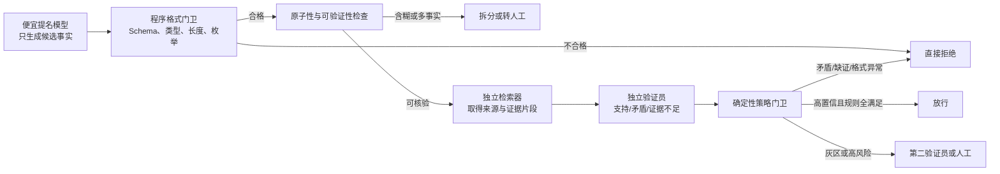
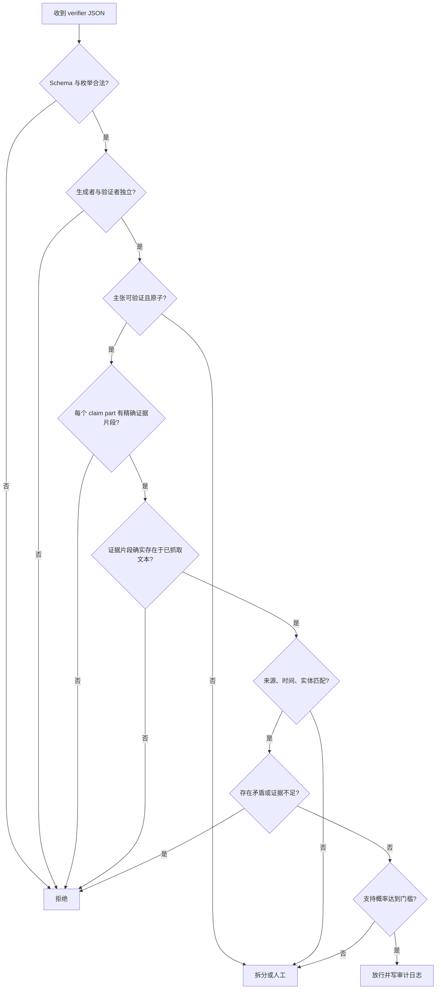

# 便宜模型抽取＋独立验证员流水线研究报告

## 执行摘要

✅ **结论：现行“便宜模型提名 → 程序验格式 → 另一便宜模型语义质检 → 程序门卫放行，且模型不能批准自己的输出”方向是对的。** 公开研究最稳定的共同结论不是“让模型多想一遍”，而是把生成、证据检索、判定和最终授权拆开，并让最终放行依赖可审计证据与确定性规则。FActScore、SAFE、VeriScore、FacTool、MiniCheck、NeMo Guardrails、TruLens 和 Azure Groundedness 都采用了这种“候选主张—证据—验证—聚合/阻断”的分层思路，只是开放程度和模型规模不同。citeturn18view4turn16view1turn16view2turn16view3turn16view4turn16view5

🔥 **最重要的证据有四组：**

| 结论 | 公开证据 |
|---|---|
| 长文本应拆成可独立核验的事实主张 | FActScore 把文本拆成 atomic facts，并按“被可靠来源支持的事实占比”计分；自动估计与人工 FActScore 的误差低于 2%。但它主要验证事实精确率，不直接衡量遗漏。citeturn18view4 |
| “同一个模型自检自己”并不可靠 | SCORE 在 LLaMA-2-13B 和 Gemma-7B 上发现，弱自验证器通常只带来约零点几百分点改善，部分任务还下降；换成 GPT-4 独立验证器后，五个任务上的提升明显扩大，最高单项达到 +12.1 个百分点。citeturn19view5 |
| 便宜专用验证器可以接近大模型 | 770M 参数的 MiniCheck-FT5 在十个数据集的平均平衡准确率为 74.7，GPT-4 为 75.3；论文估算在同一 13,000 条测试集上，前者成本为 0.24 美元，后者为 107 美元，相差约 446 倍。citeturn13view0turn19view0 |
| LLM 裁判不能直接充当最终授权者 | MT-Bench 的换位实验中，GPT-3.5 裁判只有 46.2% 的前后顺序一致性，GPT-4 也只有 65%；GPT-4 在默认数学裁判提示下把错误答案判为正确的失败率为 14/20，加入推理提示后降到 6/20，提供参考答案后降到 3/20。citeturn14view6 |

因此，推荐将生产架构收敛为：



推荐的关键政策是：**模型只能提交判定材料，不能提交“放行决定”；程序门卫只接受证据完整、主张全覆盖、来源和时间匹配、验证员身份独立的记录。** “Supported”不能理解成“看起来差不多”，而应理解成“主张中的每个组成部分，都能被给定证据直接支持，且不存在冲突证据”。这正是 VeriScore 的严格定义。citeturn18view1turn17view1

成本方面，若语义质检对象已经有本地文档证据，专用 355M–770M 验证器通常比通用 API 模型划算得多；若每条事实都要做开放网络搜索，主要成本和延迟往往转移到检索、网页读取和多轮查询，而不是验证器本身。SAFE 的公开实现估算一次长回答检查约 0.20–0.40 美元，其中包含大约 100 次搜索调用；MiniCheck 的纯“文档—主张”验证则约为每千条 0.0185 美元，但不包括检索成本。citeturn19view2turn19view0

## 方法与数据来源

本报告优先采用原始论文、论文作者官方代码库和厂商官方文档。学术证据集中在以下任务：

| 研究方向 | 主要来源 | 可复现内容 |
|---|---|---|
| 长文本原子事实评价 | FActScore、SAFE、VeriScore | 事实拆分、检索、验证标签、聚合指标、人工一致性 |
| 文档约束事实验证 | MiniCheck、LLM-AggreFact | 十个数据集、平衡准确率、成本、阈值实验、开源模型 |
| 自检与独立验证器 | SCORE、自我修正综述 | 自验证器 F1、最终准确率、强验证器和 oracle 对照 |
| LLM 裁判偏差 | MT-Bench / Chatbot Arena | 换位、提示变化、冗长攻击、自我偏好实验 |
| 工业与开源实现 | NeMo Guardrails、TruLens、Azure、FacTool | 提示词、输出字段、阻断逻辑、检索和解释模式 |

不同论文中的“准确率”不可直接混用。例如，FActScore 衡量被支持事实的比例，SAFE 使用事实级支持率及 F1@K，MiniCheck 主要报告平衡准确率，FacTool 同时报告 claim-level 和 response-level factuality。因此，本报告只在**相同测试集、相同论文设置**内做成本和质量比较，不把跨数据集数字拼成统一排行榜。citeturn18view1turn13view0turn16view2

文中“每条成本”和“平均延迟”有少量换算值。例如，MiniCheck-FT5 的 0.24 美元除以 13,000 条，得到约 0.0000185 美元/条；A6000 上 29,000 条用时 30 分钟，换算为约 62 毫秒/条。这些是依据论文和官方仓库数据计算的平均值，不代表线上 P99 延迟，也不包含检索、排队、序列化和网络通信。citeturn19view0turn19view1

公开资料存在三类明显缺口：

一是多数厂商没有公开生产 Groundedness 模型的参数量、训练集、分类阈值和误放率；二是论文常报告总体 F1 或平衡准确率，而不是生产团队更关心的“已放行样本中的错误率”；三是模型 API、硬件价格和检索价格会变化。因此，本报告对这些项目均标记“未公开/未找到”，不会把推测写成已知事实。

## 学术证据与实验结果

### 原子事实拆分与验证

**FActScore** 的做法是把长文本拆为“每条只包含一个信息点”的 atomic facts，再逐条判断是否被可靠知识源支持，最终用支持事实占总事实的比例表示 factual precision，即事实精确率。论文的人物传记实验中，ChatGPT 的人工 FActScore 只有 58%；作者开发的检索加语言模型自动评估器与人工结果误差低于 2%，并用它评估了 6,500 条生成文本，否则人工成本估算约为 26,000 美元。citeturn18view4

这个指标解决了“整段回答到底错了几处”的问题，但有两个限制。一个是它主要衡量精确率：只说一句正确但极不完整的话，也可能得到高分。另一个是早期拆分提示针对人物传记优化，跨领域时可能留下代词、时间和地点缺失。VeriScore 对此进行了系统分析，指出 FActScore 的拆分可能产生“His notable film credits…”这类脱离上下文后不可核验的主张。citeturn16view0

**SAFE** 在 FActScore 之上增加了四步处理：拆分事实、把事实改写为自包含表达、判断事实是否与用户问题相关、通过 Google Search 多轮检索后判定 Supported 或 Not Supported。官方实现输出原子事实总数、支持数、无关数和不支持数。citeturn16view1turn19view2

SAFE 在约 16,000 条事实上与众包人工标注的一致率约为 72%；在随机抽取的 100 个分歧案例中，复核者认为 SAFE 判对的比例为 76%，人工原判正确的比例为 19%。作者还估算 SAFE 比众包人工便宜二十倍以上。这个结果说明检索增强的强验证器可能优于一次性众包标注，但并不等于 SAFE 在所有领域都具有“超人”水平，因为实验事实来自特定数据分布，且分歧复核样本只有 100 个。citeturn18view3turn19view2

SAFE 使用 F1@K 缓解“回答越短越容易全对”的问题。其 precision 是支持事实占已生成事实的比例；recall 用支持事实数量与目标事实数量 \(K\) 的比值近似，并截断到 1；最终取二者调和平均。VeriScore 延续了这一思想，并按不同领域中事实数量的中位数设置 \(K\)。citeturn18view1

**VeriScore** 不再把所有句子都拆，而是只提取“能够与可靠外部知识核验的主张”。主观评价、建议、假设、个人经历等不进入事实验证；每个主张必须描述一个事件或状态，并补足必要的时间、地点和实体指代。其滑动窗口会把问题和相邻句子传给抽取器，以恢复省略的实体和时间信息。人工比较中，VeriScore 的抽取结果有 93% 的案例优于 SAFE 的抽取。citeturn16view0turn17view0

VeriScore 的人工验证研究采用三类判定：

- **Supported**：主张的所有部分都被证据支持，且没有证据与任何部分矛盾。
- **Contradicted**：至少一个部分被证据反驳，且不存在支持同一部分的证据。
- **Inconclusive**：至少一部分没有证据、证据相互冲突，或者实体指代不清。

在 50 条三人重复标注样本上，82% 获得三人完全一致，14% 获得两人一致，Fleiss κ 为 0.7316。320 条人工验证样本中，只有 55% 被支持，2.8% 被反驳，其余 42.2% 都是证据不足或不明确。这说明在开放网络场景里，**证据不足不是边缘状态，而是接近一半样本的常见结果**；把它强行挤进“通过/不通过”而不记录原因，会产生大量含糊放行。citeturn17view1turn17view4turn18view2

VeriScore 还发现，前五条搜索结果的单条有效率均超过 30%，第一条为 35.6%；第六至第九条约为 27.0%–29.2%，第十条降到 13.3%。这支持“先取前五条，灰区再扩到十条”的分级检索策略，而不是固定地为所有候选都进行很深的检索。citeturn18view2

在自动验证器实验中，VeriScore 用 320 条人工标注的“主张—搜索结果”样本测试了 Mixtral-8×22B、Claude 3 Opus、GPT-4 和 GPT-4o。GPT-4o 三分类提示转成二分类后总体 F1 为 0.841；Claude 3 二分类的 unsupported F1 最高，为 0.758。研究者随后用 13,403 条 GPT-4o 生成数据微调 Llama-3-8B-Instruct 和 Mistral-7B-Instruct，最终开源验证器在人工数据上达到 F1 0.841。citeturn18view0turn18view2

**MiniCheck** 面向另一种更适合生产系统的设定：输入是 grounding document 和一条 claim，输出支持概率及二分类标签。它聚合十个数据集形成 LLM-AggreFact，包含新闻、访谈、科学、医疗、对话、开放问答等文档—主张对，并使用平衡准确率：

\[
BAcc=\frac{TPR+TNR}{2}
\]

这能降低类别不平衡对普通准确率的误导。MiniCheck-FT5 使用 770M 参数的 Flan-T5-Large，在十个数据集上平均 BAcc 为 74.7；GPT-4 为 75.3，Claude 3 Opus 为 74.1，GPT-3.5 为 69.6。citeturn13view0turn13view1

⚠️ **原子化不是越多越好。** MiniCheck 发现，把每条原始 claim 再拆成 2–4 个 atomic facts，会让验证成本和延迟增加 2–4 倍，但 GPT-4 的平均 BAcc 只从 75.3 提高到 75.6；SummaC-CV 反而从 62.1 降到 58.8，QAFactEval 也下降 1.9 个百分点。研究者的结论是：原子化可能对检索必要，但并不一定提高已经拿到文档后的蕴含判定。citeturn19view0

这意味着生产系统不应无条件“把每个短句继续拆到最细”。更合理的触发条件是：一句里存在多个主谓结构、多个时间地点、并列数字、转折关系或证据需要分别检索时才拆分；已经是单一文档约束的短主张，可以直接交给专用验证器。

### 自检与独立验证器对比

下面的对比中，“self-verification”指生成模型自己判断自己的候选是否正确；“独立 verifier”指另外的模型或专用分类器做判断。SCORE 的任务是数学和常识推理，不是事实抽取，因此它不能直接给出抽取生产线的误放率，但它提供了目前较清楚的因果对照：同一个 refiner 不变，只替换验证器，看最终准确率如何变化。citeturn13view4turn19view5

| 实验设置 | 自验证结果 | 独立验证结果 | 结论与适用范围 | 来源 |
|---|---:|---:|---|---|
| LLaMA-2-13B，五个数学/常识任务 | 微调 self-verifier 的最终变化约为 +0.3、0.0、0.0、−0.3、−0.1 个百分点 | GPT-4 verifier 对应为 +4.2、+2.7、+2.7、+2.2、+9.7 | 弱模型通常无法可靠判断何时应修正；强独立验证器明显更有效 | citeturn19view5 |
| Gemma-7B，五个任务 | +0.4、0.0、+0.3、+0.2、−0.3 | +6.2、+12.1、+7.8、+7.8、+7.8 | 小模型即使学会“怎么改”，也可能不会“什么时候改” | citeturn19view5 |
| LLaMA-2-13B，GSM8K，初始准确率 42.7 | 自训练 verifier F1 47.3，最终 42.8，提升 +0.1 | GPT-4 verifier F1 89.2，最终 46.3，提升 +3.6；oracle 最终 51.4 | 验证质量是流水线瓶颈 | citeturn19view5 |
| 同一 GSM8K 实验使用 GPT-3.5 verifier | 不适用 | verifier F1 59.7，但最终准确率降至 31.5，下降 11.2 | “独立”本身不够；不可靠的独立验证器会错误触发修改，危害甚至大于不验证 | citeturn19view5 |
| 自我修正研究综述 | 无外部信息时，通用任务上的可靠反馈生成仍困难 | 工具、执行器、检索证据、强模型或专用 verifier 提供的可靠反馈效果更稳定 | 不应把“能根据正确反馈修改”误当成“能为自己生成正确反馈” | citeturn19view4 |

这里可以得出三个工程结论。

**生成和验证必须解耦。** 至少需要不同请求上下文、不同系统提示、不同输出 Schema，最好是不同模型或不同模型家族。仅仅对同一个模型说“现在你是审计员”，并没有消除相同知识盲区和相同推理偏差。

**独立验证器也必须被验证。** GPT-3.5 验证器在 SCORE 的一个设置中虽然比自验证器 F1 更高，却把最终准确率拉低 11.2 个百分点，说明错误的纠错路由会产生二次损害。citeturn19view5

**验证器不应直接改写并批准。** 更安全的方式是验证器输出标签、证据和错误原因；需要修正时，把任务退回候选生成器重新提名，再由新的验证请求复核。这样可以避免“验证员一边修改一边批准自己的修改”。

### LLM-as-a-judge 的可靠性与偏差

MT-Bench 使用 80 个多轮问题，覆盖写作、角色扮演、抽取、推理、数学、代码和知识等八类任务；论文比较了 pairwise comparison、单答案评分和参考答案辅助评分。citeturn13view2

**位置偏差。** 研究者让 GPT-3.5 以温度 0.7 为每个问题生成两份相近回答，再将 A/B 顺序交换，检查裁判是否保持一致。默认提示下：

| 裁判 | 换位后一致率 | 偏向第一位置 | 输出格式错误 |
|---|---:|---:|---:|
| Claude-v1 | 23.8% | 75.0% | 1.2% |
| GPT-3.5 | 46.2% | 50.0% | 2.5% |
| GPT-4 | 65.0% | 30.0% | 0.0% |

为 GPT-4 加入三个 few-shot 判例后，一致率由 65.0% 提高到 77.5%，但仍未完全消失。citeturn14view6turn14view5

在事实抽取质检中，位置偏差对应的不只是“A/B 哪个好”，还包括：

- 证据排列顺序；
- 支持证据与反驳证据谁先出现；
- 候选事实放在提示词前面还是后面；
- JSON 字段的顺序；
- few-shot 示例里通过案例和拒绝案例的比例与排列。

因此，支持与反驳证据应随机化或交叉排列；成对比较时应交换顺序执行两次；两次结论不一致时不能放行。

**冗长偏差。** MT-Bench 构造了“repetitive list”攻击：向答案加入看似丰富、实际重复的内容。23 个攻击样本中，Claude-v1 和 GPT-3.5 的裁判失败率均为 91.3%，GPT-4 为 8.7%。这说明便宜裁判尤其容易把“解释很多”误当成“证据充分”。citeturn14view6

对应的防护不是要求 verifier 写更长的理由，而是要求：

- 每个理由绑定具体 evidence ID；
- evidence quote 必须是来源文本中的原文子串；
- 每个主张成分必须逐项标记 covered/uncovered；
- 重复证据不增加分数；
- 没有直接证据时只能返回“证据不足”。

**提示敏感性。** GPT-4 判断十个数学问题、交换两种答案顺序，共二十次判定。默认提示下，错误答案被判为正确 14 次；要求裁判先进行链式推理后降到 6 次；提供参考答案后降到 3 次。另一个位置偏差实验中，把默认 pairwise 提示改成分别打分，GPT-4 的换位一致率反而由 65.0% 降到 51.2%。提示词变化并不保证单调改善。citeturn14view6

**自我偏好。** 相比人类投票，GPT-4 担任裁判时，GPT-4 生成答案的胜率高出约 10 个百分点；Claude-v1 对自己答案的胜率高出约 25 个百分点。论文同时强调，样本有限且难以只改变风格而不改变质量，因此这属于显著观察，不足以单独证明严格的因果性自我偏好。citeturn14view7

对当前架构来说，“任何模型不能批准自己的输出”是合理的强制控制。程序应检查 `producer_model_id != verifier_model_id`，更严格时还应要求 `producer_family != verifier_family`，并禁止验证器对自己生成的 correction 直接发出 approve。

## 工业与开源流水线实践

下面列出八个公开实现。FActScore、SAFE、VeriScore 和 FacTool 更接近“开放域事实核查”；MiniCheck、NeMo、TruLens 和 Azure 更接近“给定 grounding document 的在线质检”。

```mermaid
flowchart TB
    subgraph FACTSCORE[FActScore]
      F1[长文本] --> F2[原子事实拆分]
      F2 --> F3[知识源检索]
      F3 --> F4[逐事实支持判定]
      F4 --> F5[支持事实占比]
    end

    subgraph SAFE[Google DeepMind SAFE]
      S1[长文本] --> S2[事实拆分]
      S2 --> S3[自包含改写与相关性]
      S3 --> S4[多轮 Google Search]
      S4 --> S5[Supported / Not Supported]
      S5 --> S6[F1@K]
    end

    subgraph VERISCORE[VeriScore]
      V1[回答与上下文窗口] --> V2[仅提取可验证主张]
      V2 --> V3[Serper Top-N 搜索]
      V3 --> V4[支持 / 矛盾 / 证据不足]
      V4 --> V5[开源 Llama-3 8B 验证器]
    end

    subgraph FACTOOL[FacTool]
      T1[模型回答] --> T2[主张抽取]
      T2 --> T3[查询生成]
      T3 --> T4[Web / 领域工具取证]
      T4 --> T5[理由、错误、修正、事实性]
      T5 --> T6[主张级与回答级汇总]
    end
```

这些流程均明确区分了候选内容、检索证据和支持判定。FActScore 使用检索加语言模型自动估算事实精确率；SAFE 使用 Serper/Google Search 进行多轮查询；VeriScore 取最多十条搜索结果并检查主张全部组成部分；FacTool 输出 claims、queries、evidences、reasoning、error、correction 和 factuality 等完整中间字段。citeturn18view4turn19view2turn17view2turn16view2

```mermaid
flowchart TB
    subgraph MINICHECK[MiniCheck]
      M1[Grounding document] --> M3[专用 355M / 770M / 7B verifier]
      M2[单句 claim] --> M3
      M3 --> M4[支持概率与 0/1 标签]
      M4 --> M5[程序阈值门卫]
    end

    subgraph NEMO[NVIDIA NeMo Guardrails]
      N1[RAG relevant chunks] --> N3[self_check_facts]
      N2[候选回答] --> N3
      N3 --> N4[0.0 至 1.0]
      N4 -->|小于 0.5| N5[拒答并停止]
      N4 -->|超时无结论| N5
    end

    subgraph TRULENS[TruLens RAG Triad]
      R1[用户问题] --> R2[上下文相关性]
      R3[检索上下文] --> R4[回答拆为 claims]
      R4 --> R5[逐 claim 搜索支持证据]
      R5 --> R6[Groundedness]
      R6 --> R7[答案相关性]
    end

    subgraph AZURE[Azure Groundedness]
      A1[Source material] --> A3[Groundedness detector]
      A2[摘要或问答结果] --> A3
      A3 --> A4[快速二分类模式]
      A3 --> A5[带解释模式]
      A5 --> A6[可选 correctedText]
    end
```



MiniCheck 的官方接口是 `MiniCheck(document, sentence) -> [0,1]`，同时返回 `raw_prob`；官方建议多句 claim 先拆成句子。支持的开源主干包括 RoBERTa-Large、DeBERTa-v3-Large、Flan-T5-Large，以及 7B 的 Bespoke-MiniCheck。citeturn19view1

NeMo Guardrails 的官方示例提示要求裁判只使用 evidence，不依赖外部知识，并只回答 yes/no。动作输出 0.0–1.0；示例规则在分数低于 0.5 时拒绝并停止。若模型耗尽输出 token 而没有给出结论，系统返回 0.0，属于 fail-close，即失败时默认阻断。citeturn16view3

TruLens 的 RAG Triad 同时检查 context relevance、groundedness 和 answer relevance。Groundedness 会把回答拆成独立主张，并在已检索上下文中分别寻找支持证据。这比只做“回答和上下文整体相似度”更不容易漏掉局部幻觉。citeturn16view4

Azure Groundedness 提供低延迟的非推理二分类模式，以及能指出未扎根片段的推理模式；还可以返回依据来源修正后的 `correctedText`。官方没有公开底层模型、训练集、准确率、判定阈值或具体 verifier 提示，当前对英文内容优化。citeturn16view5

### 实现细节与公开判定规则

| 实例 | 候选与证据流程 | 模型与检索器 | Verifier 提示或规则摘录的中文要点 | 规则闸门与人工点 |
|---|---|---|---|---|
| FActScore | 文本 → 原子事实 → 可靠知识源 → 逐条支持判定 | 原论文使用检索器和强语言模型；自动模型具体组合随实现配置 | “将回答拆成每条一个信息点；判断每条是否被可靠知识源支持” | 以支持事实比例聚合；生产人工接入点未规定 |
| SAFE | 原子事实 → 自包含改写 → 相关性 → 多轮搜索 → 判定 | 默认公开配置为 GPT-3.5-Turbo-0125、Serper；每次搜索返回 3 条结果，可多轮查询 | 先提出新的搜索查询；最终必须说明具体依据并输出固定标签 Supported 或 Not Supported | 输出格式异常重试；公开实现没有通用人工灰区，生产中应补充 |
| VeriScore | 可验证主张 → 最多 10 条搜索结果 → 三分类或二分类 | Serper；抽取器用微调 Mistral-7B，验证器用微调 Llama-3-8B | “只有主张所有部分都被支持、没有任何部分被反驳时才 Supported；考虑链接是否可信” | 任一部分无证据或证据冲突即 Inconclusive/Unsupported |
| FacTool | 主张抽取 → 查询生成 → 证据 → 理由与修正 | GPT-3.5 或 GPT-4；KBQA 用 Serper，科学综述还用网页抓取服务 | 每条输出 `claim、reasoning、error、correction、factuality`，并保存查询和来源证据 | 回答级 factuality 由主张级结果汇总；人工点未公开 |
| MiniCheck | 文档＋单句主张 → 专用分类器 | RoBERTa 355M、DeBERTa 355M、Flan-T5 770M、7B 模型；不负责检索 | 输出 label 和 raw probability；论文默认阈值 0.5 | 阈值由程序控制；多句主张建议先拆句 |
| NeMo Guardrails | RAG chunks＋回答 → NLI 式蕴含判断 | 可用通用 LLM、AlignScore 或 Patronus Lynx；检索由 RAG 系统提供 | “只使用 evidence，不依赖外部知识；回答 yes/no” | `<0.5` 阻断；超长无结论返回 0.0；可选择阻断或警告 |
| TruLens | 问题、检索上下文、回答分别质检 | 可配置 judge；使用现有 RAG 检索上下文 | 拆分回答中的主张，并为每条在 context 中独立寻找支持证据 | 三项指标可设置阈值；官方没有统一生产阈值 |
| Azure Groundedness | Source＋text/query → 扎根性检测 | 厂商托管模型，细节未公开 | 快速模式返回 grounded/ungrounded；推理模式返回未扎根片段解释 | 阈值和误放率未公开；高风险案例应在应用层接人工 |

对应证据见 FActScore、SAFE、VeriScore、FacTool、MiniCheck、NeMo、TruLens 与 Azure 的论文和官方文档。citeturn18view4turn19view2turn17view1turn16view2turn19view1turn16view3turn16view4turn16view5

## 验证员提示词与程序门卫设计

下面的提示句是根据公开论文和代码整理的**推荐改写**，不是逐字复制。目标是让便宜验证员做窄任务：识别主张、对齐证据、输出结构化判定，而不是自由发挥。

### 推荐字段清单

| 字段名 | 说明 | 示例提示句 | 判定标准或可量化指标 | 为什么能防止含糊放行 | 证据出处 |
|---|---|---|---|---|---|
| `claim_id` | 候选事实的稳定编号 | “只评估 `claim_id=C-017`，不要合并其他候选。” | 非空、全局唯一、与输入一一对应 | 防止验证员跳过难项或把多条事实混成一条 | FActScore 和 SAFE 均逐事实计分；FacTool 保存逐 claim 结果。citeturn18view4turn16view1turn16view2 |
| `atomic_claim` | 单一、可独立判断的事实主张 | “将候选改写为一条自包含主张；若包含多个事件，返回 `NEEDS_SPLIT`。” | 主谓关系数量、并列实体/数字数；一条只描述一个事件或状态 | 便于精确找证据，避免“一半正确”整条通过 | VeriScore 要求每条描述单一事件或状态；MiniCheck 建议多句 claim 拆分。citeturn17view0turn19view1 |
| `verifiability` | 判断是否属于可外部核验事实 | “主观评价、建议、假设、个人体验返回 `NON_VERIFIABLE`。” | 枚举：`VERIFIABLE/NON_VERIFIABLE/AMBIGUOUS` | 防止把意见和营销性语言误判为事实正确 | VeriScore 明确排除意见、建议、假设和个人经历。citeturn17view0 |
| `entity_time_location` | 补齐实体、时间、地点和版本 | “列出主张涉及的完整实体、适用时间和地点；无法消解指代则拒绝。” | 指代是否唯一；时间范围是否覆盖证据发布日期或事件时间 | 防止“他、当时、目前、最新版本”等上下文丢失 | VeriScore 使用上下文窗口恢复人物、时间和地点；指代不清属于 Inconclusive。citeturn17view0turn17view1 |
| `evidence_source` | 证据来源标识、标题、发布日期和来源类型 | “每个判定必须列出实际使用的 source ID；不得只写‘多方资料显示’。” | 至少一条可访问来源；来源类型枚举；动态事实检查时效 | 没有可追溯来源就不能通过 | SAFE、VeriScore 和 FacTool 均显式保存搜索结果或来源证据。citeturn17view2turn16view2turn19view2 |
| `evidence_quote` | 来源中的原文证据片段 | “逐字摘出支持或反驳主张的最短片段，并给出 source ID。” | quote 必须是已抓取正文或摘要的精确子串；建议保存字符偏移 | 防止模型编造“证据大意”，也方便程序复核 | SAFE 最终判断要求展示支持证据；FacTool 保存 evidences；VeriScore 在证据级进行支持/矛盾判断。citeturn19view3turn16view2turn17view2 |
| `source_reliability` | 来源可信度与是否为一手材料 | “判断该来源是否直接、权威且与主张领域匹配；说明降级原因。” | 预设来源等级；官方/原始论文优先；匿名聚合页不得单独放行高风险事实 | 防止低质量页面碰巧出现相同文字 | VeriScore 提示明确要求考虑链接是否来自可信来源；Azure 建议使用最新可靠来源。citeturn17view1turn16view5 |
| `coverage` | 逐项检查主张所有组成部分 | “把主张拆成最小组成部分，并对每部分标记 `SUPPORTED/UNSUPPORTED`。” | `covered_parts / total_parts`；自动放行要求 100% | 防止日期正确、地点错误或数字只对一半时整条通过 | VeriScore 规定所有部分都被支持才算 Supported。citeturn18view1turn17view1 |
| `counterevidence` | 主动寻找反例、反驳和冲突证据 | “至少执行一个反向查询，例如加入‘not、incorrect、disputed、旧版’；报告冲突结果。” | 是否执行反向查询；冲突来源数量；冲突是否针对同一主张部分 | 防止只搜支持材料形成确认偏误 | SAFE 使用多步查询；VeriScore 把支持与反驳并存列为 Inconclusive。citeturn19view2turn18view1 |
| `verdict` | 最终语义判定 | “只允许 `SUPPORTED`、`CONTRADICTED`、`INSUFFICIENT_EVIDENCE`。” | 严格枚举；没有证据不得用 Supported | 把“不确定”保留下来，而不是含糊地塞进通过 | VeriScore 和事实核查数据普遍采用支持、反驳、证据不足三态。citeturn17view1turn18view2 |
| `support_probability` | 验证器对支持类别的原始分数 | “返回 0–1 支持概率；不要用自然语言‘比较有把握’。” | 校准后的 precision、recall、FPR、Brier score 或 ECE | 程序可以按风险分层，而不是解析模糊措辞 | MiniCheck 返回 `raw_prob`，论文默认以 0.5 转成标签。citeturn13view0turn19view1 |
| `reasoning` | 简短、证据绑定的判断理由 | “每句话必须引用 evidence ID；不得引入证据外知识。” | 无来源句数量必须为零；理由长度上限 | 限制自由发挥，降低裁判被措辞和冗长影响 | NeMo 明确要求只使用 evidence；MT-Bench 显示冗长会严重误导弱裁判。citeturn16view3turn14view6 |
| `error_type` | 失败类型 | “从 `WRONG_ENTITY/WRONG_TIME/WRONG_NUMBER/CONTRADICTION/MISSING_EVIDENCE/AMBIGUOUS` 中选择。” | 严格枚举；每个非通过结果必须有错误码 | 便于统计误放来源，也避免只给“可能不准确” | FacTool 输出 error 和 correction；VeriScore 分析了指代、复杂主张和间接证据等分歧类型。citeturn16view2turn17view2 |
| `reject_reason` | 面向程序和人工的拒绝原因 | “说明是证据不足、来源不可信、时间不匹配还是输出格式失败。” | 非 Supported 时必填；长度和枚举受控 | 防止验证员只输出 no 而无法审计 | NeMo 在未给出结论或分数不足时 fail-close；Azure 推理模式返回未扎根片段解释。citeturn16view3turn16view5 |
| `producer_model_id` / `verifier_model_id` | 记录生成者和验证者身份 | “不得验证由同一模型身份生成的候选或修正。” | 程序硬规则：两者不得相同；高风险时模型家族也不得相同 | 直接落实“不能批准自己的输出”，降低共同偏差 | SCORE 显示弱自验证器接近无效，强外部验证器明显更好。此字段是依据实验结果提出的治理设计。citeturn19view5 |
| `prompt_version` / `evidence_hash` | 审计与复现实验所需元数据 | “记录提示模板版本、模型版本、温度、证据哈希和运行时间。” | 所有字段必填；同一回放输入可重跑比较 | 提示和证据排序会改变裁判结果，必须能还原当时输入 | MT-Bench 显示提示与位置变化显著改变结果；VeriScore 实验固定温度为 0。citeturn14view6turn18view0 |

### 推荐 verifier 指令模板

```text
角色：
你是独立事实验证员。你不能批准、改写或补充候选事实，只能依据给定证据作出结构化判定。

限制：
1. 只允许使用 EVIDENCE 中的信息，不得使用记忆或外部常识。
2. SUPPORTED 的条件是：候选主张的每个组成部分都有直接证据，且没有冲突证据。
3. 任一组成部分无证据、指代不明、时间不匹配或来源相互冲突时，必须返回 INSUFFICIENT_EVIDENCE。
4. 任一组成部分被可靠证据直接否定时，返回 CONTRADICTED。
5. 不得把相关性、相似措辞或来源数量当作支持。
6. 每个判断必须引用 evidence_id 和精确 evidence_quote。
7. 不得验证由 verifier_model_id 自己生成或修正的候选。

输出 JSON：
{
  "claim_id": "...",
  "atomic_claim": "...",
  "verifiability": "VERIFIABLE | NON_VERIFIABLE | AMBIGUOUS",
  "claim_parts": [
    {
      "part": "...",
      "status": "SUPPORTED | CONTRADICTED | MISSING",
      "evidence_ids": ["..."],
      "evidence_quotes": ["..."]
    }
  ],
  "counterevidence_checked": true,
  "verdict": "SUPPORTED | CONTRADICTED | INSUFFICIENT_EVIDENCE",
  "support_probability": 0.00,
  "error_type": "...",
  "reject_reason": "...",
  "producer_model_id": "...",
  "verifier_model_id": "..."
}
```

这个模板融合了 VeriScore 的“全部组成部分必须被支持”、NeMo 的“只能使用 evidence”、SAFE 的“提供具体证据”、FacTool 的错误与修正字段，以及 MiniCheck 的概率输出。citeturn17view1turn16view3turn19view3turn16view2turn19view1

### 程序门卫的推荐逻辑

程序门卫不做语义推理，只做确定性校验。推荐按以下顺序执行：



建议的硬性拒绝条件是：

- JSON 解析失败、缺字段或出现枚举外值；
- `producer_model_id == verifier_model_id`；
- `evidence_quote` 不是抓取文本的精确子串；
- 任一 `claim_part` 未覆盖；
- verdict 为 `CONTRADICTED` 或 `INSUFFICIENT_EVIDENCE`；
- 动态事实的证据时间不满足业务时效；
- 验证模型超时、截断或未返回明确标签；
- 支持和反驳证据并存但没有进入人工复核；
- 提示注入内容出现在证据页，并试图改变验证员指令。

NeMo 对输出截断执行 fail-close，是这类设计的直接公开例子。citeturn16view3

对抗测试至少应覆盖：证据里夹带“忽略之前指令”、重复支持片段、同名实体、旧版信息、单位变换、日期边界、否定词、部分支持、支持与反驳并存、无关但措辞高度相似的证据，以及把正确证据放在列表末尾。MT-Bench 的位置和冗长实验说明，这些输入变化足以显著改变弱裁判结果。citeturn14view6

## 成本、质量与阈值权衡

### 同一公开基准上的成本质量对比

以下数据均来自 MiniCheck 论文的 LLM-AggreFact 13,000 条测试集。专用模型成本按 0.8 美元/GPU 小时折算，API 模型按论文实验期价格计算；这些是可复现实验口径，不是 2026 年厂商现价。citeturn19view0

| 验证器 | 平均 BAcc | 13,000 条成本 | 换算每千条 | 相对 MiniCheck-FT5 成本 | 观察 |
|---|---:|---:|---:|---:|---|
| AlignScore，355M | 70.4 | $0.20 | $0.0154 | 0.83× | 最便宜，但质量低 4.3 点 |
| MiniCheck-FT5，770M | 74.7 | $0.24 | $0.0185 | 1× | 接近 GPT-4 的低成本前沿 |
| GPT-3.5 | 69.6 | $4.75 | $0.365 | 19.8× | 更贵但平均质量更低 |
| Gemini-Pro | 66.2 | $5.24 | $0.403 | 21.8× | 不在该基准的成本质量前沿 |
| Mistral-8×7B API | 67.3 | $7.78 | $0.598 | 32.4× | 通用模型并未自动胜过专用小模型 |
| GPT-4 | 75.3 | $107 | $8.23 | 445.8× | 比 MiniCheck-FT5 高 0.6 点 |
| Claude 3 Opus | 74.1 | $165 | $12.69 | 687.5× | 质量略低于 MiniCheck-FT5，成本高很多 |
| GPT-4＋原子拆分 | 75.6 | $212 | $16.31 | 883.3× | 比普通 GPT-4 仅提升 0.3 点 |

质量数据和成本数据均来自同一论文表格；每千条成本和相对倍数为本报告换算。citeturn13view0turn13view1turn19view0

下面的散点图横轴使用论文成本的对数归一化，纵轴使用 BAcc 在 60–76 区间内归一化。它用于展示相对位置，原始数值以表格为准。

```mermaid
quadrantChart
    title LLM-AggreFact 成本—质量位置
    x-axis 低成本 --> 高成本
    y-axis 低平衡准确率 --> 高平衡准确率
    quadrant-1 高质量高成本
    quadrant-2 高质量低成本
    quadrant-3 低质量低成本
    quadrant-4 低质量高成本
    AlignScore: [0.00, 0.65]
    MiniCheck-FT5: [0.03, 0.92]
    GPT-3.5: [0.47, 0.60]
    Mistral-8x7B: [0.55, 0.46]
    GPT-4: [0.94, 0.96]
    Claude-3-Opus: [1.00, 0.88]
```

这组结果不代表 770M 模型在所有任务上都优于通用大模型。它说明的是：**当任务被压缩成“给定文档是否支持单句主张”时，合适的训练数据和专用分类目标比模型规模更重要。** MiniCheck 论文还发现，T5-XXL 虽有 11B 参数，却只达到 61.0 的平均 BAcc，明显低于 770M 的 MiniCheck-FT5。citeturn13view0turn18view5

### 延迟与检索成本

MiniCheck 官方仓库报告，Bespoke-MiniCheck-7B 在单张 NVIDIA A6000 上验证 29,000 条样本，启用 prefix caching 用时 30 分钟，未启用时为 55 分钟。换算平均约为：

- 开启缓存：约 62 毫秒/条；
- 未开启缓存：约 114 毫秒/条；
- 平均吞吐提升约 1.83 倍。

这个优化适合“一份文档验证多条候选事实”的场景，因为文档前缀的 KV cache 可以复用。citeturn19view1

开放网络核查的成本结构不同。SAFE 官方估算每个 prompt-response pair 约消耗 100 个 Serper credits 和 0.10 美元 GPT-3.5 API 成本，总计约 0.20 美元；长回答可能达到 0.40 美元。默认每次搜索返回三条结果。citeturn19view2

VeriScore 指出，SAFE 的自包含改写和相关性检查本身就有显著开销：用 GPT-4 串行处理 100 条主张约需 35 分钟，仅相关提示模板对应的 token 成本估算约为每 100 条 1.7 美元。VeriScore 因此把上下文恢复并入一次抽取，并微调 7B/8B 开源模型降低成本。其闭源 prompting pipeline 检查 400 条 GPT-4o 长回答曾花费 1,038 美元。citeturn17view3turn18view2

这说明成本优化应优先做三件事：

- 不对格式不合格、重复或明显无价值候选启动检索；
- 同一文档的多条事实批处理，并复用编码或 KV cache；
- 先查本地权威库和已有来源，只有灰区再进行开放网络搜索。

### 阈值与规则组合

MiniCheck 默认使用 0.5 阈值。在十个数据集上分别用验证集调阈值后，MiniCheck-FT5 的平均 BAcc 从 74.7 提高到 75.1，只增加 0.4 点；AlignScore 从 70.4 提高到 72.2；SummaC-CV 则从 62.1 提高到 71.3，说明有些模型严重依赖每个数据集单独校准，而 MiniCheck 相对稳定。citeturn13view1turn13view0

生产系统不应把论文里的 0.5 直接当“放行门槛”。0.5 只是分类边界，目标通常应是控制**误放率**，即 unsupported 候选被自动批准的概率。公开论文没有给出适用于所有行业的统一阈值，也没有公布当前架构对应的生产误放率，因此以下数值应视为启动配置，必须用本地人工标注集重新校准。

| 配置 | 自动放行 | 灰区 | 直接拒绝 | 适用场景 |
|---|---|---|---|---|
| 成本优先 | `p_support ≥ 0.85`，且全部规则通过 | 0.55–0.85 | `<0.55`、矛盾或缺证 | 内部低风险标签、可事后修正 |
| 默认推荐 | `p_support ≥ 0.90`，全部组成部分有直接证据，来源等级合格 | 0.60–0.90 | `<0.60`、任一部分缺证、冲突 | 一般知识库和内容抽取 |
| 高精度 | `p_support ≥ 0.97`，两个独立 verifier 一致，至少一条一手来源 | 0.70–0.97 | `<0.70` 或任一检查失败 | 财务、法律、医疗、公开发布 |
| 零自动误放导向 | 不自动放行高影响事实 | 全部进入人工 | 明确矛盾可自动拒绝 | 严格监管或不可逆决策 |

推荐把阈值优化目标写成：

\[
\max Recall \quad \text{subject to}\quad Precision_{\text{approved}}\ge P_{\text{target}}
\]

例如一般业务可以把自动放行 precision 目标设为 99%，高风险业务设为 99.9%，然后在本地验证集上选择满足目标的最低阈值。数据量不足时，宁可扩大灰区，也不要用整体 accuracy 最高的阈值。

每周应从自动放行样本中随机抽检，并计算：

\[
FalsePassRate =
\frac{\text{被自动放行但人工判为错误的候选数}}
{\text{自动放行候选总数}}
\]

同时分别统计 `WRONG_ENTITY`、`WRONG_TIME`、`WRONG_NUMBER`、`MISSING_EVIDENCE`、`SOURCE_CONFLICT` 和 `PROMPT_INJECTION`。公开研究通常报告 F1 或 BAcc，没有提供各工业实现的统一 false-pass rate，因此这里不能给出可信的行业通用数字。

### 推荐的成本控制策略

可以把单条候选的期望成本写成：

\[
C =
C_{\text{nomination}}
+q_{\text{schema-pass}}C_{\text{verification}}
+q_{\text{retrieval}}C_{\text{retrieval}}
+q_{\text{gray}}C_{\text{human}}
\]

其中最容易通过工程手段下降的是 \(q_{\text{retrieval}}\) 和 \(q_{\text{gray}}\)，而不是一味压缩 verifier 模型。

推荐的分级处理是：

| 层级 | 执行内容 | 成本特点 |
|---|---|---|
| 便宜层 | JSON Schema、类型、正则、枚举、去重、长度、禁止词、时间格式 | 几乎无模型成本 |
| 本地验证层 | MiniCheck/DeBERTa/Flan-T5 对本地证据做支持判断 | 约每千条美分级，取决于硬件和批处理 |
| 深检索层 | 扩展到前十条搜索结果、抓正文、反向查询 | 搜索和网络延迟开始占主导 |
| 强验证层 | 第二模型家族或更强 verifier | 只处理灰区，控制总成本 |
| 人工层 | 高影响、证据冲突、置信度灰区、随机审计 | 单条昂贵，但比例可以很低 |

## 结论与建议

✅ **可以直接保留的架构原则**

当前“便宜模型提名、程序验格式、另一模型语义质检、程序最终放行、禁止自批”的整体分工有充分公开证据支持。生成和授权必须分离；模型判定必须被程序规则约束；缺证、超时、格式错误和冲突应默认阻断，而不是默认通过。citeturn19view5turn16view3

✅ **在便宜小模型上仍然成立的结论**

| 结论 | 便宜模型上的证据 | 建议 |
|---|---|---|
| 窄任务专用 verifier 可以很强 | MiniCheck-FT5 770M 达到 74.7 BAcc，接近 GPT-4 的 75.3 | 把任务限制为“文档是否支持单句主张”，不要让验证员同时搜索、解释、修正和审批 |
| 合适训练数据比参数量更关键 | 770M MiniCheck 明显超过 11B T5-NLI；14K–35K 针对性数据带来明显收益 | 收集真实误放样本，做 hard-negative 和部分支持样本训练 |
| 原子主张和证据绑定仍有价值 | FActScore、SAFE、VeriScore 都依赖逐主张检查 | 在检索和审计层保持原子化，但不要对已经很短的 claim 反复拆分 |
| 规则门卫能补模型短板 | NeMo 对低分和无结论执行程序阻断 | 所有枚举、身份独立、证据子串、时间匹配和全覆盖都由程序检查 |
| 固定格式能减少含糊输出 | NeMo、FacTool、MiniCheck 均使用窄标签或结构化字段 | verifier 只输出严格 JSON，不输出自由散文审批意见 |
| 缓存和批处理收益明显 | MiniCheck 的前缀缓存将 29K 样本用时从 55 分钟降到 30 分钟 | 一份来源文档的候选事实集中验证 |

citeturn13view0turn18view5turn19view1turn16view3

⚠️ **在便宜模型上风险较高或并不成立的结论**

| 风险 | 公开证据 | 缓解方式 |
|---|---|---|
| “同一模型再看一遍就能发现自己的错” | LLaMA-2-13B 和 Gemma-7B 的 self-verifier 基本无提升，部分任务下降 | 使用不同模型家族或专用分类器；禁止模型批准自己的输出 |
| “独立模型一定比自检好” | GPT-3.5 verifier 在 SCORE 的一项实验中使最终准确率下降 11.2 点 | verifier 必须在本地数据上测 FPR、路由贡献和最终系统指标 |
| “写更多理由会更可靠” | 弱裁判在重复冗长攻击上失败率达 91.3% | 限制理由长度；每句话绑定证据 ID；重复证据不加分 |
| “一个二分类标签足够” | VeriScore 的人工样本中 42.2% 属于证据不足或不明确 | 对外保留三态；程序把证据不足视为不放行 |
| “拆得越细准确率越高” | 原子拆分令成本增加 2–4 倍，GPT-4 BAcc 仅增加 0.3，部分模型下降 | 只在多事实、需分别检索或部分支持风险高时拆分 |
| “0.5 是合理放行阈值” | 0.5 是分类默认值；不同模型阈值敏感性差异很大 | 按本地目标 precision 校准，设置人工灰区 |
| “搜索到相似句就算证实” | VeriScore 中大量 unsupported 案例没有直接反驳，只是缺乏主张各部分之间的连接证据 | 要求逐组成部分覆盖和直接证据，不接受纯语义相似 |
| “单次 judge 结论可复现” | 换位和提示变化可让裁判大幅翻转 | 固定模型版本与提示；记录哈希；高风险时换序双判 |

citeturn19view5turn14view6turn18view2turn19view0turn13view1

🔥 **推荐落地配置**

面向一般事实抽取场景，推荐采用“一便宜提名模型＋一专用小验证器＋一确定性门卫”，而不是两个相同通用聊天模型：

```text
提名器：
便宜指令模型，temperature 0–0.2
职责：只输出候选事实和来源线索，不得输出 approved

格式门卫：
JSON Schema + 枚举 + 去重 + 原子性启发式
不通过：直接拒绝，不启动语义验证

检索：
优先查随输入附带的原文、内部权威库和官方材料
默认 Top-5；灰区扩到 Top-10，并执行至少一个反向查询

验证器：
优先使用 MiniCheck-FT5、DeBERTa 类专用模型或微调后的 7B/8B verifier
输入：单一 claim + 限定证据
输出：三态标签、概率、逐组成部分覆盖、证据片段、错误类型

门卫：
默认自动放行门槛 p_support ≥ 0.90
要求 coverage = 100%
要求无冲突、无缺证、证据片段可回查、时间与实体匹配
producer_model_id 与 verifier_model_id 必须不同

人工：
0.60–0.90 灰区
高影响事实
来源冲突
时间敏感事实
随机抽检自动放行样本
```

若当前两个便宜模型是同一型号，至少应做到不同 checkpoint 或不同微调数据、不同服务身份、不同系统提示和完全隔离的上下文；更推荐让验证员使用判别式或 encoder-decoder 专用模型，因为它不会自然延续提名器的生成风格。MiniCheck 的结果说明，770M 的专用 Flan-T5 验证器已足以覆盖大量文档扎根场景。citeturn13view0turn19view1

真正决定系统安全性的，不是“用了几个模型”，而是下面这条不变量：

> **任何候选只有在证据可回查、所有组成部分被直接覆盖、没有冲突、验证者身份独立、规则门卫全部通过时，才能放行；任何不确定性都必须显式进入证据不足或人工灰区。**

来源：ChatGPT