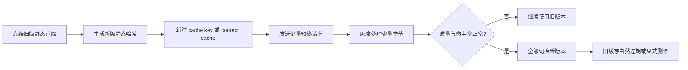

# 各大模型 API 的提示词缓存与成本工程优化研究

**资料获取日期：2026 年 7 月 31 日（America/Los_Angeles）**

## 执行摘要

你的场景非常适合做提示词缓存：每本书连续发出数百到上千次请求，字段定义、抽取规范、输出结构和书籍档案基本不变，只有章节正文变化。这个模式可以直接理解成：

> **长而稳定的前缀 + 每次变化的短尾部**

各厂商所谓的 Prompt Caching、Prefix Caching、Context Caching，通常不是缓存模型最终回答，而是缓存模型处理静态前缀时生成的 **KV Cache**，也就是模型内部的注意力计算状态。下一次请求开头完全相同时，服务端可以跳过这部分重复计算，因此降低输入 token 费用和首 Token 延迟。学术研究中，Prompt Cache 在长文档问答等场景中将首 Token 延迟提高了约 8 倍（GPU）至 60 倍（CPU）；SGLang 的 RadixAttention 也证明了用前缀树复用 KV 状态的可行性。citeturn17search1turn17search8

✅ **核心结论**

- **静态内容必须放前面，章节正文放最后。**绝大多数缓存按照“从第一个 token 开始的最长相同前缀”匹配，不是语义相似匹配。一个时间戳、随机 ID、字段顺序变化，甚至某些空格变化，都可能从变化位置开始切断缓存。OpenAI、DeepSeek、Mistral、xAI、Kimi 等都强调稳定的初始前缀。citeturn2view0turn5view1turn13search0turn15search0turn20view1
- **对一本书内部的连续抽取，缓存价值很高；不同书之间也可以复用“全局规则层”。**建议把前缀分成“平台级抽取规则”“任务版本”“本书档案”三层，再追加章节正文。支持最长前缀匹配的厂商，即使书籍档案不同，仍可能命中前面的全局规则。
- **不能只看缓存折扣，还要看最低门槛。**OpenAI 通常要求相同前缀至少达到 1,024 tokens；Kimi 要求前一次 prompt 超过 256 tokens；Gemini 常见模型要求 2,048 或 4,096 tokens；DeepSeek 历史公开粒度为 64 tokens。静态区只有 100 或 500 tokens 时，OpenAI、Gemini 等平台可能根本不会产生有效缓存。citeturn1search1turn20view1turn11search0turn4search2
- **Batch 和缓存能否叠加，厂商差异很大。**Anthropic 明确支持折扣叠加；火山引擎明确表示批量推理命中缓存后输入价格还可继续下降；xAI 的 Batch 折扣明确覆盖 cached tokens。Gemini 则明确表示常见 Batch 与隐式缓存折扣不叠加，缓存价格优先。阿里云部分 Batch 产品明确不支持上下文缓存。citeturn16search1turn8search1turn15search4turn18search15turn6search9
- **在你的典型场景中，缓存比压缩章节正文更值得先做。**静态区越长、重复次数越多，缓存价值越大；动态正文和输出占比越高，缓存对总账单的影响越小。
- 按本文代表性模型计算，当每次请求包含 **2,000 静态 tokens、500 动态 tokens、300 输出 tokens**，请求量为 1,000 次时：
  - 仅缓存约节省 **48.6% 总费用**；
  - 仅 Batch 约节省 **50%**；
  - 两者能完全叠加时约节省 **74.3%**。
- 若静态部分只有 100 tokens、动态正文 2,000 tokens，即便厂商允许缓存，缓存对总费用的贡献也只有约 **2.7%**；这种情况下，Batch、正文切分和减少输出长度更重要。
- **缓存不会增加上下文窗口。**已经缓存的 token 仍然占上下文长度，也仍可能产生“信息埋在长提示词中间、模型利用率下降”的问题。citeturn16search6turn17search3

文中所称“通义”指阿里云通义千问；百度对应的是百度智能云千帆与文心模型，两者是不同厂商，以下分开分析。

## 供应商缓存机制与规则对比

表中的“完全匹配”应保守理解为：**序列化请求经过厂商分词后，开头的 token 序列一致**。除非官方明确说明，否则不要假设厂商会忽略大小写、空格、换行、JSON 字段顺序或 Unicode 表示差异。

| 供应商 | 缓存机制与支持情况 | 命中条件与最低门槛 | 价格与折扣 | TTL 与失效 | 控制参数、观测字段与 Batch |
|---|---|---|---|---|---|
| **OpenAI** | 名称为 **Prompt Caching**。GPT-4o、GPT-4o mini、GPT-4.1 系列及后续模型支持自动缓存。GPT-3.5 Turbo 当前价格页没有 cached input 项，本次未找到其公开缓存支持依据。 | 必须是从请求开头开始的精确公共前缀。通常 prompt 至少 1,024 tokens，之后按 128-token 增量记录缓存。system/developer/user 消息、图片、音频、tools、Structured Outputs schema 都可成为前缀的一部分。metadata 不参与前缀，可用于放时间戳和追踪信息。工具顺序、schema 顺序或前部时间戳改变会破坏后续命中。 | GPT-4o：输入 $2.50/M、缓存 $1.25/M，约 50% 折扣；GPT-4.1：$2.00/M、缓存 $0.50/M，约 75%；GPT-4.1 mini：$0.40/M、缓存 $0.10/M；GPT-4.1 nano：$0.10/M、缓存 $0.025/M。新一代部分模型缓存折扣可达 90%。 | 默认内存缓存通常在 5–10 分钟无活动后开始淘汰，旧说明称最晚在最后使用后一小时内清除。部分新模型支持 24 小时扩展缓存；底层仍是尽力而为，路由、负载或上下文压缩都可能造成 miss。 | 自动缓存，无需创建 cache。可传 `prompt_cache_key` 提高同类请求的路由粘性，部分模型可用 `prompt_cache_retention`。响应 `usage.prompt_tokens_details.cached_tokens` 可观测命中量。Batch API 为输入和输出提供 50% 折扣、最长约 24 小时，但官方 Cookbook 提醒 GPT-5 之前的模型在 Batch 中不应假设支持缓存叠加。citeturn2view0turn1search1turn3search0turn3search2turn3search3turn3search5turn3search6turn3search8 |
| **Anthropic Claude** | 名称为 **Prompt Caching**。既支持顶层自动缓存，也支持在内容块上设置显式缓存断点。 | 断点之前的 tools、system、messages 等内容按前缀匹配。最低长度随模型变化；例如 Claude Opus 4.8 的公开门槛为 1,024 tokens。修改 system、工具定义、思考模式或部分推理配置，可能使相应断点失效。 | 5 分钟缓存写入按基础输入价的 **1.25 倍**；1 小时写入按 **2 倍**；读取按基础输入价的 **0.1 倍**，即缓存命中约节省 90%。 | `ttl` 支持 `5m` 和 `1h`，默认 5 分钟。到期后需要重新写入；频繁访问通常可持续刷新。 | `cache_control` 可放在顶层或具体 block 上。响应提供 `cache_creation_input_tokens`、`cache_read_input_tokens`。Message Batches 输入和输出 50% 折扣，且官方明确支持与缓存折扣叠加；但 Batch 并发异步执行，官方观察到的实际命中率约为 30%–98%。citeturn16search0turn16search1turn16search3turn16search4turn16search9 |
| **DeepSeek** | 名称为 **Context Caching / 上下文缓存**，所有用户自动启用，属于磁盘缓存。 | 匹配相同 token 前缀，而不是语义相似内容。历史实现公开过 64-token 存储单元，小于 64 tokens 不缓存；当前机制还会在用户输入、模型输出边界和固定 token 间隔建立持久点。分叉后的前两次请求有时仍 miss，之后才识别出公共前缀。 | 2026 年 7 月价格页中，DeepSeek-V4-Flash 缓存命中输入 ¥0.02/M、未命中 ¥1/M，约 98% 折扣；V4-Pro 命中 ¥0.025/M、未命中 ¥3/M，约 99.17% 折扣。 | 官方描述为数小时到数天，具体 TTL 未固定公开；缓存建立需要数秒，并可能按资源压力自动清理。 | 不需要、也没有公开的 `cache_id` 参数。响应提供 `prompt_cache_hit_tokens` 和 `prompt_cache_miss_tokens`。本次未在 DeepSeek 原生官方文档中找到类似 OpenAI Batch 的通用异步生成 Batch API 或对应折扣。citeturn5view0turn5view1turn4search2 |
| **阿里云通义千问 / DashScope** | 同时有 **显式上下文缓存、隐式上下文缓存**，部分 Responses 场景还有 Session Cache。 | 显式缓存由用户标记缓存区，命中更确定；隐式缓存自动运行，不能关闭，但是否命中取决于服务端。前缀内容、模型、工具和结构应保持一致。 | 显式缓存创建按标准输入价 **125%**，读取按 **10%**；隐式命中按标准输入价 **20%**。以 qwen-flash 中国区公开价格为例：普通输入 ¥1.2/M、隐式缓存 ¥0.24/M、显式创建 ¥1.5/M、显式命中 ¥0.12/M。 | 显式缓存典型 TTL 为 5 分钟；具体模型能力有差异。Session Cache 由会话机制管理。 | 显式内容通常通过 `cache_control` 等兼容字段标记；Responses Session Cache 可用 `x-dashscope-session-cache: enable` 请求头。Batch File 通常约为实时价格 50%，但官方 Batch Chat 文档明确标注其不支持上下文缓存等能力，因此不能统一假设折扣叠加。citeturn6search0turn6search1turn6search2turn6search9turn6search10turn6search14turn6search20 |
| **百度智能云千帆 / 文心** | 部分模型价格表公开了“缓存命中输入”计费，但本次未找到完整公开的缓存工作原理、最低长度、归一化或显式缓存 API 文档。 | 应按精确公共前缀设计；具体 token 粒度、哈希方式、空格和大小写规则均标记为 **未公开**。 | ERNIE 4.5 Turbo 公开价为普通输入 ¥0.8/M、缓存命中 ¥0.2/M，约 75% 折扣；输出 ¥3.2/M。并非所有 ERNIE 版本都在价格表中提供缓存价。 | TTL、LRU、手动删除与版本绑定规则均 **未公开**。 | ERNIE 4.5 Turbo 批量推理输入 ¥0.32/M、输出 ¥1.28/M，约为实时价格的 40%；Batch 价格行没有给出缓存命中项，因此不能假设缓存与 Batch 继续叠加。citeturn7search0turn7search8 |
| **火山引擎方舟 / 豆包** | 官方提供 **前缀缓存** 与 **Session 缓存**，并提供 Context API。 | 固定上下文可以创建缓存并在后续请求中引用。前缀模式适合多请求共享开头，Session 模式适合增长式多轮历史。精确分词粒度、空格归一化和最低门槛在本次可读取文档中未完整公开。 | 缓存费用包括缓存存储费和命中输入费，具体值按模型变化。官方 Batch 文档明确说明：批量推理价格最低约为在线价格的 50%，命中缓存的输入价格还能进一步降低 60%。 | 精确 TTL 和 LRU 规则按产品配置或模型变化；应以 Context API 创建结果及控制台为准。 | Context API 会产生可引用的上下文标识。Batch 与缓存是少数官方明确可进一步叠加的组合；若按 50% Batch 后再降 60% 计算，缓存输入约为实时普通输入的 20%，但这是根据两个折扣相乘得到的估算。citeturn8search0turn8search1turn8search2turn8search3turn8search4turn8search9 |
| **Google Gemini API / Vertex AI** | 名称为 **Context Caching**，分为隐式缓存和显式缓存。Gemini 2.5 及后续模型默认启用隐式缓存；GenerateContent 可使用显式缓存。 | 相同大段内容应放在 prompt 开头，并在较短时间内发送相似请求。常见最低门槛：Gemini 2.5 Flash/Pro 为 2,048 tokens；部分 Gemini 3.x 模型为 4,096 tokens。显式缓存通过缓存资源引用，命中更可预测。 | 多数支持模型的缓存输入约为普通输入的 10%，另收显式缓存存储费。Gemini 2.5 Flash 例：普通输入 $0.30/M、缓存 $0.03/M、缓存存储 $1/M-token-hour。 | 显式缓存默认 60 分钟，可通过 `ttl` 或 `expire_time` 设置和更新；隐式缓存按负载和复用频率淘汰，并在 24 小时内删除。 | 显式缓存创建后通过缓存资源名引用。Batch 通常 50% 折扣，但官方明确指出，常见隐式缓存与 Batch 折扣不相乘：缓存命中时 90% 缓存折扣优先于 50% Batch 折扣。不同模型价格表可能存在例外，应逐模型核对。citeturn11search0turn11search1turn11search2turn11search3turn18search5turn18search15turn18search21 |
| **Mistral AI** | 名称为 **Prompt Caching**，自动复用共享精确前缀。 | 适合固定 system prompt、多轮会话、FIM 代码补全。请求必须有兼容的相同开头；短提示词、无关请求或经常变化的前缀收益很低。最低 token 长度和空白归一化规则未公开。 | 缓存输入按标准输入价格的约 **10%** 计费。 | 精确 TTL 和淘汰时间未公开，属于尽力而为。 | 支持 `prompt_cache_key`，用于让同一会话或工作流更可能路由到相同缓存位置，但不保证命中。Batch Processing 约 50% 折扣、通常最长 24 小时；官方未明确说明两种折扣能否相乘，建议按“保守不叠加、乐观相乘”做预算。citeturn13search0turn13search1turn13search3turn13search4 |
| **xAI Grok** | 名称为 **Prompt Caching**，自动缓存从消息开头开始的相同内容。 | 要求相同 starting messages；路由键能提高请求进入同一服务器的概率。精确 token 门槛未公开。 | Grok 4.3 示例：普通输入 $1.25/M、缓存输入 $0.20/M，约 84% 折扣。 | 尽力而为；服务内存压力增大时可淘汰。固定 TTL 未公开。 | Chat Completions 可传 `x-grok-conv-id` 请求头；Responses API 支持 `prompt_cache_key`。当前部分模型的 Batch 折扣为 20%，且价格政策明确覆盖 input、output、cached 和 reasoning，因此可以叠加在缓存 token 上。citeturn15search0turn15search1turn15search3turn15search4turn15search5turn15search12 |
| **Kimi / Moonshot API** | 名称为 **Context Caching**，对所有模型请求自动开启，无需手动创建。 | 自动识别重复的初始上下文。前一个请求的 prompt 必须大于 256 tokens，新请求才可能命中；system prompt、知识文档、工具定义应放在前面并保持稳定。 | 官方场景说明称特定情况下最高可降本约 90%；具体模型的缓存单价需看实时价格页。 | 用户无需设置 TTL，生命周期由平台自动管理；精确时间未公开。 | 没有 cache ID 或额外参数。Kimi 已提供 OpenAI 风格 Batch API，但本次读取到的缓存文档没有明确说明 Batch 与缓存折扣如何叠加，因此应标记为未公开。citeturn20view1turn18search6turn21view0 |
| **Cohere** | 本次未在 Cohere 官方生成 API 和价格文档中找到 Chat Prompt Caching、Prefix Cache 或 cached-token 计费项。 | 不适用。应用侧保存模板不能减少服务端输入 token 费用，只能减少客户端构造工作。 | 未发现缓存折扣。 | 未公开。 | Cohere 有 Batch Embedding Jobs，主要面向十万级以上文档的嵌入生成；本次未找到与 Chat/Generate 对应的通用异步 Batch 生成接口。citeturn14search1turn14search2turn14search12 |
| **Amazon Bedrock** | 平台级支持 **Prompt Caching**，具体能力取决于底层模型，例如 Claude、Nova 等。 | 通过模型支持的缓存断点或请求格式指定可缓存区。模型、区域和 API 必须一致。 | Bedrock 将普通输入、缓存写入、缓存读取和输出分别计费，价格随模型而变。 | 按底层模型定义，例如 Claude 的 5 分钟或 1 小时规则。 | Bedrock 也提供 Batch Inference，但工具调用和 Structured Output 在部分 Batch 形式中不支持；缓存与 Batch 是否可组合需要逐模型、逐区域验证。citeturn18search1turn18search4turn18search14 |

### OpenAI 各模型的缓存价格差异

| 模型 | 普通输入价格 | 缓存输入价格 | 输入折扣 | 结论 |
|---|---:|---:|---:|---|
| GPT-4o | $2.50/M | $1.25/M | 50% | 支持自动 Prompt Caching |
| GPT-4o mini | $0.15/M | $0.075/M | 50% | 单价低，但缓存仍有价值 |
| GPT-4.1 | $2.00/M | $0.50/M | 75% | 比 GPT-4o 的缓存折扣更大 |
| GPT-4.1 mini | $0.40/M | $0.10/M | 75% | 适合大量结构化抽取 |
| GPT-4.1 nano | $0.10/M | $0.025/M | 75% | 输入成本极低，需同时评估抽取质量 |
| GPT-3.5 Turbo | $0.50/M | 未列出 | 未找到 | 不应把 GPT-4o/4.1 的缓存机制自动套用到 3.5 |

以上为资料获取日的公开价格，模型价格和支持状态可能调整。citeturn3search0turn3search2turn3search4turn3search5turn3search6turn3search8

从工程角度看，OpenAI 的 `prompt_cache_key`、Mistral 的同名字段、xAI 的路由键都不是“把缓存存在这个字符串下面”的传统 Redis cache key。它们主要用于**路由粘性**：帮助供应商把同类请求送往更可能拥有该 KV Cache 的机器。真正是否命中，仍取决于请求前缀是否一致、缓存是否还在以及服务端负载。OpenAI 还提醒，单个过热的 key 会因请求速率过高而溢出到其他机器，造成一次性 miss，因此不能让全平台所有书都共用一个 key。citeturn2view0turn13search0turn15search3

本次检索到的主流厂商价格表中，没有发现 streaming 单独享受更高或更低的缓存费率。流式和非流式通常只是响应交付方式不同；成本预算应继续按实际 input、cached input、output 等 usage 字段计算，而不是按是否 `stream=true` 计算。

## Batch 与缓存叠加模型

### 厂商 Batch 支持情况

| 供应商 | Batch 模式 | 典型计费方式 | 缓存能否叠加 | 工程判断 |
|---|---|---|---|---|
| OpenAI | 异步 JSONL Batch，通常 24 小时内完成 | 输入和输出约 50% 折扣；独立速率限制 | 模型与 API 形态相关。官方 Cookbook 明确提醒 GPT-5 之前模型不要假设在 Batch 中支持缓存 | GPT-4o、GPT-4.1 项目应把“仅 Batch”和“仅缓存”分别压测，不把折扣相乘写入预算 |
| Anthropic | Message Batches | 输入和输出 50% 折扣 | **明确支持叠加**，但命中率通常为 30%–98% | 最适合验证 Batch + Cache 的厂商之一 |
| DeepSeek | 未找到原生通用生成 Batch | 常规 API 按 token 计费 | 不适用 | 可在客户端并发和限速，但没有官方 Batch 价格优惠依据 |
| 阿里通义 | Batch File / Batch Chat | 常见约实时价格 50% | Batch Chat 文档明确不支持上下文缓存；其他 Batch 形式未发现统一叠加保证 | 保守按不叠加计算 |
| 百度千帆 | 模型级批量推理 | 折扣因模型而异；ERNIE 4.5 Turbo 约为在线价格 40% | Batch 价格表没有 cached token 行 | 保守按不叠加计算 |
| 火山引擎 | 批量推理 | 最低约在线价格 50% | **官方说明命中缓存输入还可再降 60%** | 可以按厂商模型价格做叠加实测 |
| Gemini | Batch Inference | 通常 50% | 常见情况下**不叠加**；90% 缓存折扣优先 | 动态 token 和输出享 Batch，命中静态 token 按 cached price |
| Mistral | Batch Processing | 约 50%，异步完成 | 未公开明确叠加规则 | 预算做保守和乐观区间 |
| xAI | Batch API | 当前部分模型 20% 折扣 | **明确覆盖 cached token** | 缓存价再乘模型对应的 Batch 系数 |
| Kimi | OpenAI 风格 Batch API | 已有 Batch 能力，具体折扣看模型价格页 | 未公开明确叠加规则 | 上线前做账单级实测 |
| Cohere | Embedding Batch | 面向嵌入任务 | Chat 不适用 | 不适合当前章节抽取任务 |

citeturn3search3turn16search1turn16search3turn6search1turn6search9turn7search0turn8search1turn8search2turn18search15turn13search1turn15search4turn21view0turn14search1

### 通用成本公式

定义：

- \(N\)：请求次数；
- \(X\)：每次请求中可缓存的静态前缀 tokens；
- \(Y\)：每次变化的章节正文及动态参数 tokens；
- \(O\)：平均输出 tokens；
- \(P_i\)：普通输入单价；
- \(P_o\)：输出单价；
- \(r\)：缓存读取价格相对普通输入的倍率，例如 90% 折扣时 \(r=0.1\)；
- \(w\)：首次缓存写入倍率；无写入溢价时 \(w=1\)，Anthropic 5 分钟缓存为 \(1.25\)；
- \(h\)：后续请求按 token 计算的缓存命中率；
- \(b_i,b_o\)：Batch 对输入、输出的价格倍率。

**无缓存：**

\[
C_{\text{normal}}
=
N\left[(X+Y)P_i+OP_o\right]
\]

**仅 Batch：**

\[
C_{\text{batch}}
=
N\left[b_i(X+Y)P_i+b_oOP_o\right]
\]

**仅缓存：**

\[
\begin{aligned}
C_{\text{cache}}
=&\;
(wX+Y)P_i+OP_o \\
&+(N-1)\left[
Y+X\big(h r+(1-h)\big)
\right]P_i\\
&+(N-1)OP_o
\end{aligned}
\]

其中：

\[
h r+(1-h)
\]

表示部分请求命中、部分请求未命中后的平均静态输入倍率。

**完整叠加：**

只有在厂商明确允许两种折扣相乘时，才可写成：

\[
C_{\text{stack}}
=
b_i \cdot C_{\text{cache,input}}
+
b_o \cdot C_{\text{output}}
\]

⚠️ Gemini 等厂商不能简单使用 \(b_i \times r\)。Gemini 的典型规则是：

\[
\text{静态命中 token 按 cached price}
\]

\[
\text{动态未命中 token 和输出按 Batch price}
\]

而不是把 cached price 再打五折。citeturn18search15

### 缓存写入的盈亏平衡

以 Anthropic 5 分钟缓存为例，写入倍率 \(w=1.25\)，读取倍率 \(r=0.1\)。

创建一次、复用一次时：

\[
1.25+0.1=1.35
\]

不缓存调用两次：

\[
1+1=2
\]

因此只要在 TTL 内成功复用一次，就已经低于两次普通输入成本。

1 小时缓存的写入倍率为 2：

\[
2+0.1=2.1>2
\]

复用一次还没有回本；复用两次时：

\[
2+0.1+0.1=2.2<3
\]

所以 1 小时缓存至少需要约两次有效复用才划算。Anthropic 官方在部分 Agent 场景中也给出过“大约第三次调用开始明显回本”的经验。citeturn16search3turn16search11

## 场景成本模拟与敏感性分析

### 模拟假设

为了让不同厂商能横向比较，本节使用一个**代表性价格模型**，不是任何单一厂商的报价：

| 参数 | 假设 |
|---|---:|
| 普通输入价格 | $1 / 百万 tokens |
| 输出价格 | $4 / 百万 tokens |
| 平均输出长度 | 300 tokens / 请求 |
| Batch 价格倍率 | 0.5 |
| 缓存首次写入倍率 | 1.25 |
| 缓存读取倍率 | 0.1 |
| 缓存命中率 | 第一次之后 100% |
| 两者叠加 | 假设厂商允许完整相乘 |
| 存储费 | 未计入 |
| 重试、错误请求、思考 tokens | 未计入 |

这组参数接近“50% Batch + 90% 缓存读取折扣 + 5 分钟写入溢价”的理想可叠加模型，可用于观察变量关系。实际供应商预算需要替换 \(P_i、P_o、r、w、b、h\)。

### 全场景数值模拟

单位：美元。

| N | 静态 X | 动态 Y | 无缓存 | 仅 Batch | 仅缓存 | Batch + 缓存 | 仅缓存节省 | 叠加节省 |
|---:|---:|---:|---:|---:|---:|---:|---:|---:|
| 100 | 100 | 500 | 0.1800 | 0.0900 | 0.1711 | 0.0856 | 4.9% | 52.5% |
| 100 | 100 | 2,000 | 0.3300 | 0.1650 | 0.3211 | 0.1606 | 2.7% | 51.4% |
| 100 | 500 | 500 | 0.2200 | 0.1100 | 0.1756 | 0.0878 | 20.2% | 60.1% |
| 100 | 500 | 2,000 | 0.3700 | 0.1850 | 0.3256 | 0.1628 | 12.0% | 56.0% |
| 100 | 2,000 | 500 | 0.3700 | 0.1850 | 0.1923 | 0.0962 | 48.0% | 74.0% |
| 100 | 2,000 | 2,000 | 0.5200 | 0.2600 | 0.3423 | 0.1712 | 34.2% | 67.1% |
| 500 | 100 | 500 | 0.9000 | 0.4500 | 0.8551 | 0.4276 | 5.0% | 52.5% |
| 500 | 100 | 2,000 | 1.6500 | 0.8250 | 1.6051 | 0.8026 | 2.7% | 51.4% |
| 500 | 500 | 500 | 1.1000 | 0.5500 | 0.8756 | 0.4378 | 20.4% | 60.2% |
| 500 | 500 | 2,000 | 1.8500 | 0.9250 | 1.6256 | 0.8128 | 12.1% | 56.1% |
| 500 | 2,000 | 500 | 1.8500 | 0.9250 | 0.9523 | 0.4762 | 48.5% | 74.3% |
| 500 | 2,000 | 2,000 | 2.6000 | 1.3000 | 1.7023 | 0.8512 | 34.5% | 67.3% |
| 1,000 | 100 | 500 | 1.8000 | 0.9000 | 1.7101 | 0.8551 | 5.0% | 52.5% |
| 1,000 | 100 | 2,000 | 3.3000 | 1.6500 | 3.2101 | 1.6051 | 2.7% | 51.4% |
| 1,000 | 500 | 500 | 2.2000 | 1.1000 | 1.7506 | 0.8753 | 20.4% | 60.2% |
| 1,000 | 500 | 2,000 | 3.7000 | 1.8500 | 3.2506 | 1.6253 | 12.1% | 56.1% |
| 1,000 | 2,000 | 500 | 3.7000 | 1.8500 | 1.9023 | 0.9512 | 48.6% | 74.3% |
| 1,000 | 2,000 | 2,000 | 5.2000 | 2.6000 | 3.4023 | 1.7012 | 34.6% | 67.3% |


[下载完整模拟 CSV](sandbox:/mnt/data/prompt_cache_cost_simulation.csv)

图中选择了最接近“大量章节抽取”的场景：\(N=1000\)、动态正文 \(Y=2000\)。可以看到：

- 静态区只有 100 tokens 时，缓存柱和无缓存柱几乎一样；
- 静态区增至 2,000 tokens 后，缓存效果明显；
- Batch 对所有输入和输出生效，因此即使静态区很短，也能稳定节省约 50%；
- 完整叠加的价值主要出现在“静态区长、重复次数多、命中率高”的任务。

### 最低门槛对实际结果的影响

上述 100-token、500-token 场景是数学上的敏感性模拟，不代表所有厂商真的能缓存。

| 静态前缀长度 | 实际可用性判断 |
|---:|---|
| 100 tokens | 大多数公共 API 无法有效缓存；DeepSeek 历史 64-token 粒度可能有机会，但仍需命中验证 |
| 500 tokens | Kimi 超过 256-token 门槛；DeepSeek可能有效；OpenAI和多数 Gemini 模型通常达不到门槛 |
| 2,000 tokens | OpenAI 通常可用；Gemini 2.5 刚达到典型 2,048 门槛附近，建议预留更多；Anthropic取决于模型 |
| 4,096 tokens 以上 | 基本覆盖 Gemini 3.x 等较高门槛模型，但要开始评估冗余信息、上下文占用和质量 |

这里的门槛看的是**从请求开头连续相同的全部内容**，不只是某个 system 字符串。例如：

```text
全局字段定义 800 tokens
+ 输出 schema 500 tokens
+ 本书档案 900 tokens
= 2,200 tokens 公共前缀
```

即使“全局字段定义”只有 800 tokens，只要后面的本书档案在同一本书的所有章节请求中也保持一致，OpenAI 仍可能形成超过 1,024 tokens 的公共缓存前缀。

### 命中率敏感性

取 \(N=1000、X=2000、Y=500、O=300\)：

| 后续请求命中率 | 仅缓存总费用 | 仅缓存节省 | 可完整叠加时总费用 | 叠加节省 |
|---:|---:|---:|---:|---:|
| 30% | $3.1610 | 14.6% | $1.5805 | 57.3% |
| 60% | $2.6216 | 29.1% | $1.3108 | 64.6% |
| 90% | $2.0821 | 43.7% | $1.0411 | 71.9% |
| 98% | $1.9383 | 47.6% | $0.9691 | 73.8% |
| 100% | $1.9023 | 48.6% | $0.9512 | 74.3% |

这个表也解释了 Anthropic Batch 官方为什么给出 30%–98% 的命中区间：异步请求并发启动时，很多请求可能在第一个缓存写入完成之前就开始执行，因此“所有请求前缀一样”不等于“所有请求都会命中”。citeturn16search1

### 你的场景可预期节省范围

以每本书 500–1,000 次请求估算：

| 场景 | 静态区占比 | 缓存命中情况 | 缓存单独节省总账单 | 加 Batch 后的总节省 |
|---|---:|---|---:|---:|
| 静态说明较短，正文较长 | 5%–20% | 70%–95% | 2%–15% | 40%–60% |
| 静态与正文长度相近 | 30%–60% | 80%–98% | 15%–45% | 55%–75% |
| 大型 schema、规则和档案，正文较短 | 60%–85% | 90%–99% | 35%–75% | 65%–90% |
| 供应商缓存折扣只有 50% | 60% 静态占比 | 90% 命中 | 约 27% 输入费用 | 取决于 Batch 是否叠加 |
| 供应商缓存折扣约 90% | 60% 静态占比 | 90% 命中 | 约 49% 输入费用 | 完全叠加时可进一步下降 |
| DeepSeek 98%–99% 缓存折扣 | 80% 静态占比 | 接近满命中 | 静态输入费用几乎消失 | 无原生 Batch 折扣依据 |

这些区间不是厂商承诺，而是把已公开的缓存倍率、Batch 倍率、静态占比和命中率代入公式后的预算范围。输出 tokens、推理 tokens、重试和存储费越高，缓存对总账单的节省比例越低。

## 静态前缀排布与落地方案

### 推荐的提示词结构

对你的书籍抽取任务，建议使用四层结构：

```text
┌──────────────────────────────────────────────┐
│ 全局静态区                                   │
│ - 任务角色                                   │
│ - 字段定义                                   │
│ - 输出规则                                   │
│ - JSON Schema / tools                        │
│ - 全局示例                                   │
├──────────────────────────────────────────────┤
│ 任务版本区                                   │
│ - prompt_version                             │
│ - schema_version                             │
│ - 模型相关兼容说明                           │
├──────────────────────────────────────────────┤
│ 本书静态区                                   │
│ - 书名、作者、年代、人物表、书籍档案         │
│ - 全书通用实体别名和抽取约束                 │
├──────────────────────────────────────────────┤
│ 章节动态区                                   │
│ - chapter_id                                 │
│ - chapter_title                              │
│ - 本章原文                                   │
│ - 仅本次有效的补充指令                       │
└──────────────────────────────────────────────┘
```

🔥 **不要把章节号、请求时间、随机 ID 放在最开头。**

错误排布：

```text
request_id: 91fe...
timestamp: 2026-07-31T10:32:15
chapter_id: 038

你是书籍信息抽取器……
字段定义……
输出规则……
本章原文……
```

这样每次请求从第一个 token 就不同，最长公共前缀接近零。

正确排布：

```text
你是书籍信息抽取器……
字段定义……
输出规则……
JSON Schema……
书籍档案……

以下内容仅属于本次请求：
chapter_id: 038
本章原文：
……
```

OpenAI 明确建议把 instructions、tools 和 schema 放在前面，把用户输入、动态值和时间戳放在后面；Kimi、Gemini、Mistral 等也明确建议保持初始上下文稳定。citeturn2view0turn20view1turn11search0turn13search0

### 可操作 Checklist

- ✅ **固定一个唯一的静态模板源文件。**不要在多个业务服务中复制粘贴后各自修改。
- ✅ **静态区采用确定性序列化。**JSON 字段顺序、缩进、换行、Unicode 表示必须稳定。
- ✅ **所有工具定义保持固定顺序。**不要从无序 `set`、数据库无排序查询或并发结果中生成 tools 数组。
- ✅ **JSON Schema 不在每次请求中动态重排。**
- ✅ **把任务说明、字段定义、输出 schema 放在最前。**
- ✅ **把本书档案放在全局规则之后。**这样换书时仍可能复用全局规则前缀。
- ✅ **把章节正文放在最后。**
- ✅ **把追踪字段放到 API metadata，或放在动态尾部。**
- ✅ **不要把当前时间写入 system prompt。**
- ✅ **同一本书的章节集中发送。**尽量在缓存 TTL 内完成，避免一本书和另一本文本交叉穿插。
- ✅ **显式缓存供应商设置两个断点。**一个断点放在全局规则后，一个放在本书档案后。
- ✅ **Batch 文件按相同前缀分组。**一个 Batch 尽量只包含相同任务版本和同一本书。
- ✅ **缓存 key 不包含章节 ID。**
- ✅ **缓存 key 包含模板版本、schema 版本和模型族。**
- ✅ **记录实际 cached tokens，不按“请求返回成功”推测命中。**
- ✅ **模板更新采用新旧版本并行预热，不直接覆盖旧 key。**
- ✅ **对 100、500、2,000-token 静态区分别压测，确认厂商最低门槛。**
- ✅ **同时记录 TTFT，也就是首 Token 延迟。**部分厂商的主要收益不仅是价格，还包括延迟。
- ⚠️ **缓存的是前缀计算，不是回答。**温度、输出仍可能不同。
- ⚠️ **缓存 token 仍占上下文窗口。**
- ⚠️ **自动重试会增加费用。**需要给每个逻辑章节设置幂等 ID，避免结果已成功却重复提交。

### 构造稳定静态区和 cache key

下面代码主要解决三个问题：

1. 保证静态内容每次序列化结果相同；
2. 给每个版本生成稳定哈希；
3. 不把章节 ID 混入缓存路由 key。

```python
from __future__ import annotations

import hashlib
import json
from dataclasses import dataclass
from typing import Any


@dataclass(frozen=True)
class PromptVersion:
    task: str
    prompt_version: str
    schema_version: str
    model_family: str


def canonical_json(data: Any) -> str:
    """
    这是把 JSON 转成稳定字符串：
    - key 固定排序
    - 不使用随机缩进
    - 中文不强制转成 \\uXXXX
    """
    return json.dumps(
        data,
        ensure_ascii=False,
        sort_keys=True,
        separators=(",", ":"),
    )


def sha256_short(text: str, length: int = 16) -> str:
    return hashlib.sha256(text.encode("utf-8")).hexdigest()[:length]


def build_static_prefix(
    global_rules: str,
    output_schema: dict[str, Any],
    book_profile: dict[str, Any],
    version: PromptVersion,
) -> tuple[str, str]:
    """
    返回：
    - static_prefix：真正发给模型的稳定前缀
    - cache_key：用于路由、日志和监控的稳定标识
    """

    schema_text = canonical_json(output_schema)
    book_text = canonical_json(book_profile)

    static_prefix = "\n".join(
        [
            "<global_rules>",
            global_rules.strip(),
            "</global_rules>",
            "<version>",
            canonical_json(
                {
                    "prompt_version": version.prompt_version,
                    "schema_version": version.schema_version,
                }
            ),
            "</version>",
            "<output_schema>",
            schema_text,
            "</output_schema>",
            "<book_profile>",
            book_text,
            "</book_profile>",
        ]
    )

    static_hash = sha256_short(static_prefix)

    # 不要加入 chapter_id、request_id 或时间戳
    cache_key = (
        f"{version.task}:"
        f"{version.model_family}:"
        f"p{version.prompt_version}:"
        f"s{version.schema_version}:"
        f"{static_hash}"
    )

    return static_prefix, cache_key


def build_dynamic_tail(
    chapter_id: str,
    chapter_title: str,
    chapter_text: str,
) -> str:
    """
    这是每次变化的尾部，必须追加在静态前缀之后。
    """
    return "\n".join(
        [
            "<current_chapter>",
            f"chapter_id: {chapter_id}",
            f"chapter_title: {chapter_title}",
            "<chapter_text>",
            chapter_text,
            "</chapter_text>",
            "</current_chapter>",
        ]
    )
```

示例 key：

```text
book_extract:gpt41:p3.2:s7:80e4e8ecfd19618a
```

不建议这样构造：

```text
book_extract:chapter_038:request_91fe:20260731
```

后者会让每个请求都形成不同路由 key。

### OpenAI 示例

这是给 OpenAI 路由器提供稳定提示的参数。它不是显式创建缓存，缓存仍然由服务端自动判断。

```python
from openai import OpenAI

client = OpenAI()

static_prefix, cache_key = build_static_prefix(
    global_rules=GLOBAL_RULES,
    output_schema=OUTPUT_SCHEMA,
    book_profile=BOOK_PROFILE,
    version=PromptVersion(
        task="book_extract",
        prompt_version="3.2",
        schema_version="7",
        model_family="gpt41",
    ),
)

dynamic_tail = build_dynamic_tail(
    chapter_id="038",
    chapter_title="第三十八章",
    chapter_text=chapter_text,
)

response = client.responses.create(
    model="gpt-4.1",
    prompt_cache_key=cache_key,
    input=[
        {
            "role": "developer",
            "content": static_prefix,
        },
        {
            "role": "user",
            "content": dynamic_tail,
        },
    ],
)

usage = response.usage
print(usage)
```

如果使用支持 24 小时扩展缓存的模型，可按该模型文档增加类似：

```python
prompt_cache_retention="24h"
```

不要为了“保持缓存”盲目开启 24 小时模式。一本书能在几分钟内处理完时，默认短缓存通常已经够用；扩展缓存主要适合跨小时重复引用同一大前缀的任务。OpenAI 的扩展缓存支持范围按模型变化。citeturn2view0

### Anthropic 示例

Anthropic 可在静态块末尾显式设置缓存断点：

```python
from anthropic import Anthropic

client = Anthropic()

response = client.messages.create(
    model="claude-sonnet-4-6",
    max_tokens=1200,
    system=[
        {
            "type": "text",
            "text": GLOBAL_RULES,
            "cache_control": {
                "type": "ephemeral",
                "ttl": "1h",
            },
        },
        {
            "type": "text",
            "text": (
                "<output_schema>\n"
                + canonical_json(OUTPUT_SCHEMA)
                + "\n</output_schema>\n"
                + "<book_profile>\n"
                + canonical_json(BOOK_PROFILE)
                + "\n</book_profile>"
            ),
            "cache_control": {
                "type": "ephemeral",
                "ttl": "1h",
            },
        },
    ],
    messages=[
        {
            "role": "user",
            "content": build_dynamic_tail(
                chapter_id="038",
                chapter_title="第三十八章",
                chapter_text=chapter_text,
            ),
        }
    ],
)

print(response.usage.cache_creation_input_tokens)
print(response.usage.cache_read_input_tokens)
```

两级断点有一个实际好处：

- 换书后，全局规则层可能继续命中；
- 同一本书内，全局规则加本书档案的更长前缀也能命中。

Anthropic 的工具、system、messages 等内容遵守固定顺序。修改前面任意层，后面的断点可能失效。citeturn16search0turn16search4

### 显式 cache ID 或 context ID 的管理

对于 Gemini、火山引擎等返回显式缓存资源 ID 的服务，建议在数据库中维护如下映射：

```text
vendor
model
region
static_hash
prompt_version
schema_version
cache_resource_id
created_at
expires_at
status
```

业务查询键应为：

```text
(vendor, model, region, static_hash)
```

不要只用 `book_id`，因为同一本书的 prompt 规则或 schema 升级后，旧缓存已经不再等价。

伪代码：

```python
def get_or_create_cache(vendor, model, region, static_prefix):
    static_hash = sha256_short(static_prefix, length=32)

    record = cache_repository.find_active(
        vendor=vendor,
        model=model,
        region=region,
        static_hash=static_hash,
    )

    if record and record.expires_at > now_plus_safety_margin(minutes=2):
        return record.cache_resource_id

    cache = vendor_client.create_context_cache(
        model=model,
        content=static_prefix,
        ttl="1h",
    )

    cache_repository.save(
        vendor=vendor,
        model=model,
        region=region,
        static_hash=static_hash,
        cache_resource_id=cache.id,
        expires_at=cache.expires_at,
    )

    return cache.id
```

这里留 2 分钟安全边界，是为了避免刚提交章节任务，缓存就在执行过程中到期。

### 版本迭代与失效策略

模板升级不要直接覆盖现有静态文本，推荐使用“版本切换”：

```text
book_extract:p3.1:s7:hash_old
book_extract:p3.2:s7:hash_new
```

推荐流程：



不要只改变 `cache_key` 而不改变提示词，然后以为得到了新缓存版本；也不要只改变提示词而继续使用完全相同的日志标识。最稳妥的做法是：**内容哈希、prompt version 和 schema version 同时进入业务缓存标识。**

### 必须记录的成本指标

每个请求至少记录：

```json
{
  "vendor": "openai",
  "model": "gpt-4.1",
  "prompt_version": "3.2",
  "schema_version": "7",
  "static_hash": "80e4e8ecfd19618a",
  "cache_key": "book_extract:gpt41:p3.2:s7:80e4e8ecfd19618a",
  "book_id": "book_001",
  "chapter_id": "038",
  "request_mode": "realtime",
  "input_tokens": 4350,
  "cached_read_tokens": 2180,
  "cache_write_tokens": 0,
  "cache_miss_tokens": 2170,
  "output_tokens": 286,
  "ttft_ms": 740,
  "total_latency_ms": 5200,
  "retry_count": 0,
  "estimated_cost": 0.0124
}
```

推荐用 **token 命中率**，而不是请求命中率：

\[
\text{Token Cache Hit Rate}
=
\frac{\sum cached\_read\_tokens}
{\sum cacheable\_static\_tokens}
\]

请求可能“部分命中”：前面的全局规则命中了，但本书档案之后没命中。仅记录“本请求命中/未命中”会掩盖这类问题。

## 学术与工程实证

### 前缀缓存为何特别适合当前任务

Prompt Cache 论文专门把 system messages、prompt templates 和重复文档列为可复用内容。其原型提前计算这些模块的注意力状态，在文档问答和推荐等长提示词场景中，GPU 首 Token 延迟最高改善约 8 倍，CPU 最高约 60 倍，同时保持输出一致性，不需要修改模型参数。citeturn17search1turn17search5turn17search9

SGLang 的 RadixAttention 使用基数树，也就是按 token 前缀组织的树，保留已经计算过的 prompt 和生成结果 KV Cache。新请求到来时寻找最长可复用前缀，并结合 LRU 淘汰和缓存感知调度提高命中率。这个设计与公共 API 的“静态区在前、动态区在后”要求完全一致。citeturn17search0turn17search8

DeepSeek 当前公开的持久点和公共前缀检测机制也说明，服务端不一定只能缓存一整块完整 prompt：它可以在消息边界或固定 token 间隔建立可复用节点。不过业务侧仍应保持严格前缀稳定，因为厂商并不承诺对中间任意相同片段进行语义复用。citeturn5view1

### 静态提示词越长，是否一定越好

没有研究支持“静态提示词越长越好”。需要分开看两个问题：

**从缓存经济性看：**

在命中率和折扣不变时，可缓存静态 token 越多，每次节省的绝对费用越高。没有一个统一的“超过某长度后缓存收益自动递减”阈值。只要这些 token 每次都需要、前缀稳定且成功命中，节省通常近似线性增长。

**从模型质量和上下文利用看：**

长静态提示会继续占用上下文窗口，也可能稀释关键信息。Anthropic 明确说明 cached prompt 仍计入上下文窗口。citeturn16search6

“Lost in the Middle”研究在多文档问答和键值检索任务中发现，模型往往在关键信息位于上下文开头或结尾时表现较好，位于中间时下降。这意味着把大量低价值规则、示例和档案堆在章节正文之前，虽然缓存费用低了，但不一定让抽取质量更好。citeturn17search3turn17search7

2026 年一项小说长上下文基准测试显示，所测七个前沿模型在超过 64k tokens 后都没有保持稳定理解能力。这个结果不能直接推导出“64k 是所有任务的硬上限”，但能说明上下文窗口标称支持长度不等于稳定信息利用长度。citeturn17search23

### 可操作的长度经验范围

下面是综合厂商门槛和研究结果得到的工程区间，不是统一行业标准：

| 静态前缀长度 | 建议 |
|---:|---|
| 少于 256 tokens | 不要把缓存作为主要降本手段；多数平台门槛不满足 |
| 256–1,024 tokens | Kimi、DeepSeek 等可能有效；OpenAI 通常还未达到自动缓存门槛 |
| 1,024–4,096 tokens | 最适合字段定义、schema、抽取规则和书籍档案；多数平台开始有稳定收益 |
| 4,096–10,000 tokens | 仍适合缓存，但应删除重复解释、无关示例和冗余 schema 描述 |
| 10,000–32,000 tokens | 建议同时做提示词压缩实验和位置敏感性测试 |
| 32,000–64,000 tokens | 应分层、检索或按任务选择性注入，不建议默认全部塞入 |
| 超过 64,000 tokens | 不能仅依赖缓存解决问题；需要做分块、检索、摘要或分阶段抽取 |

🔥 对当前书籍抽取任务，**1,000–4,000 tokens 的稳定静态前缀通常是比较舒服的区域**：超过 OpenAI 等平台门槛，又不至于因为规则冗余明显挤压章节正文。若书籍档案很大，应把“本章可能相关的人物与实体”筛选出来，而不是把全书所有档案无限追加。

### Prompt Compression 与缓存的关系

LongLLMLingua 对约 10k-token 长提示词进行 2–6 倍压缩时，端到端延迟提升约 1.4–2.6 倍；在 NaturalQuestions 中，以约 4 倍更少的 token 将 GPT-3.5 Turbo 表现提高最多 21.4%，在 LooGLE 上报告了最高约 94% 的成本下降。citeturn17search2turn17search6

这不表示应该直接用模型把所有静态规则“总结一下”。提示词压缩可能改变字段边界、否定规则或 JSON 约束，结构化抽取任务尤其容易因压缩损失细节。

更稳妥的顺序是：

1. 人工去重静态规则；
2. 用 JSON Schema 或 Structured Outputs 代替重复的自然语言格式说明；
3. 删除不会影响结果的示例；
4. 对书籍档案做结构化和按章筛选；
5. 保持压缩后的版本完全稳定，让它继续命中缓存；
6. 用真实章节做 A/B 测试，检查字段准确率、漏抽率和格式错误率。

2026 年一项生产环境提示词压缩研究发现，LLMLingua 在提示词长度、压缩比例和硬件匹配时可带来最高约 18% 的端到端加速；但在不合适的区间，压缩本身的计算时间会抵消收益。这说明“先额外调用一个模型压缩 prompt”并不一定省钱，静态内容更适合离线压缩一次、长期复用。citeturn17search22

### 缓存对质量的影响

只要厂商正确复用 KV 状态，并且 token 序列和位置保持一致，缓存本身理论上不应改变模型输出分布。Prompt Cache 论文报告在不修改模型参数的情况下保持输出准确性。citeturn17search1

但工程中仍会出现“开启缓存后结果变化”的假象，常见原因不是缓存计算错误，而是：

- 为了缓存而改变了消息角色或内容顺序；
- 把原来靠近章节正文的关键规则移动到了很前面；
- tools 或 schema 顺序变化；
- 模型 snapshot 或推理参数变化；
- Batch 和实时请求使用了不同模型版本；
- 缓存版本没有和 prompt 版本一起更新；
- 截断或上下文压缩改变了实际发送内容。

因此质量评估要比较“完全相同序列的缓存命中与未命中”，不能拿两个结构不同的 prompt 做比较。

## 建议方案与主要参考资料

### 推荐实施优先级

对“每本书数百至上千次章节抽取”，推荐采用下面的成本工程方案：

| 优先级 | 动作 | 预期效果 |
|---:|---|---|
| P0 | 把全局规则、schema、本书档案移到最前，章节正文放最后 | 建立可缓存公共前缀 |
| P0 | 固定 JSON、tools、schema 顺序和换行 | 避免无意义 cache miss |
| P0 | 记录 cached read/write/miss tokens | 判断缓存是否真的生效 |
| P0 | 按同一本书、同一模板版本集中调度 | 提高短 TTL 内命中率 |
| P1 | 建立 `task:model:prompt_version:schema_version:hash` 路由 key | 提高路由粘性并支持版本治理 |
| P1 | 对支持显式缓存的厂商建立 global + book 两层断点 | 跨书复用全局层、书内复用档案层 |
| P1 | 离线任务优先测试 Batch | 输出费用高时，Batch 往往比缓存更稳定 |
| P1 | 只在厂商明确支持时将 Batch 和缓存折扣相乘 | 避免预算严重低估 |
| P2 | 将冗余自然语言格式要求改为 schema | 同时减少 token 和格式错误 |
| P2 | 对超过 10k tokens 的静态区做离线压缩和 A/B 测试 | 控制上下文占用和位置偏差 |
| P2 | 按章节预筛书籍档案 | 减少无关人物和实体干扰 |
| P3 | 根据真实命中率做供应商路由 | 不只比较标价，也比较命中稳定性 |

若以结构化抽取为主要目标，供应商选择可以这样理解：

- **追求最低缓存输入价：**DeepSeek 当前公开缓存输入折扣很大，但缺少原生 Batch 折扣。
- **追求可控缓存和 Batch 明确叠加：**Anthropic 的规则最透明，但 Batch 实际命中率要实测。
- **已经使用 OpenAI：**GPT-4.1 的缓存输入折扣明显好于 GPT-4o；离线任务还需单独比较 Batch，因为 GPT-4.1 不应默认按 Batch + Cache 叠加。
- **国内云与批量任务：**火山引擎的 Batch + 缓存公开叠加说明比较有吸引力；阿里和百度需要逐模型核对，不能用统一平台规则推算。
- **超长书籍档案：**Gemini 显式缓存可控且 TTL 可设置，但最低缓存长度较高，并有存储费用。
- **希望零接入改动：**DeepSeek、Kimi、OpenAI 的自动缓存接入成本较低，但命中控制能力不如显式缓存。
- **Cohere：**本次未找到适合 Chat 抽取的 Prompt Cache 和生成 Batch 依据，不适合作为本项目的缓存降本主方案。

### 主要官方文档与工程资料

| 来源 | 主要内容 | 发布或更新信息 |
|---|---|---|
| OpenAI Prompt Caching 发布说明 | 1,024-token 门槛、128-token 增量、早期 TTL、cached token 字段 | 2024-10-01 citeturn1search1 |
| OpenAI Prompt Caching 201 Cookbook | 稳定前缀、`prompt_cache_key`、路由、扩展缓存、Batch/Flex 对比 | 2026-02-18 citeturn2view0 |
| OpenAI Batch API | 50% 折扣、24 小时异步窗口 | 获取于 2026-07-31 citeturn3search3 |
| OpenAI GPT-4o / GPT-4.1 模型价格页 | 普通输入、缓存输入、输出价格 | 获取于 2026-07-31 citeturn3search0turn3search8 |
| Anthropic Prompt Caching | 自动与显式断点、TTL、usage 字段 | 获取于 2026-07-31 citeturn16search0turn16search4 |
| Anthropic Pricing | 5m/1h 写入倍率、读取倍率、Batch 50% | 获取于 2026-07-31 citeturn16search3 |
| Anthropic Batch Processing | Batch 与缓存叠加、30%–98% 命中区间 | 获取于 2026-07-31 citeturn16search1 |
| DeepSeek Context Caching | 自动磁盘缓存、命中字段、持久点与失效 | 获取于 2026-07-31 citeturn5view1 |
| DeepSeek Context Caching 发布说明 | 64-token 粒度、历史延迟与成本数据 | 2024-08-02 citeturn4search2 |
| DeepSeek 当前价格页 | 缓存命中与未命中价格 | 获取于 2026-07-31 citeturn5view0 |
| 阿里云上下文缓存 | 显式与隐式缓存、写入与读取倍率 | 获取于 2026-07-31 citeturn6search0 |
| 阿里云显式缓存最佳实践 | 25% 写入溢价、90% 读取节省 | 2026-06-03 citeturn6search2 |
| 阿里云 Batch 文档 | Batch 折扣及与上下文缓存的兼容限制 | 获取于 2026-07-31 citeturn6search1turn6search9 |
| 百度千帆模型价格 | ERNIE 缓存输入和批量推理价格 | 更新于 2026-07-13 citeturn7search0 |
| 火山引擎方舟 Context API | 前缀缓存、Session 缓存和上下文资源 | 更新于 2026-07-31 citeturn8search0turn8search9 |
| 火山引擎批量推理 | Batch 价格及命中缓存后进一步折扣 | 更新于 2026-07-06 citeturn8search1 |
| Gemini Context Caching | 隐式与显式缓存、最低 token 门槛 | 获取于 2026-07-31 citeturn11search0turn11search3 |
| Google Vertex AI Context Caching 工程博客 | 90% 缓存折扣、隐式缓存最长保留范围 | 2025-10-15 citeturn18search5 |
| Gemini Batch Inference | Batch 50%，缓存折扣优先且不叠加 | 获取于 2026-07-31 citeturn18search15 |
| Mistral Prompt Caching | 精确前缀、10% 缓存输入价、`prompt_cache_key` | 获取于 2026-07-31 citeturn13search0turn13search3 |
| xAI Prompt Caching | 自动缓存、conversation ID、路由和淘汰 | 2026-03-16 citeturn15search0turn15search3 |
| xAI Batch Pricing | Batch 折扣覆盖 cached token | 更新于 2026-07-03 citeturn15search4 |
| Kimi Context Caching | 自动启用、256-token 门槛、无需 TTL/cache ID | 获取于 2026-07-31 citeturn20view1 |
| AWS Bedrock Prompt Caching | 平台级缓存及按读写 token 分项计费 | 获取于 2026-07-31 citeturn18search1turn18search14 |
| Prompt Cache 论文 | 模块化注意力复用、8×–60× TTFT 改善 | arXiv 2023，MLSys 2024 citeturn17search1turn17search5 |
| SGLang / RadixAttention | 前缀树 KV Cache、LRU、缓存感知调度 | arXiv 2023 citeturn17search0turn17search8 |
| LongLLMLingua | 长提示词压缩、成本、延迟与性能实验 | arXiv 2023 citeturn17search2turn17search6 |
| Lost in the Middle | 长上下文中的位置偏差 | TACL 2024 citeturn17search3turn17search7 |
| Prompt Compression in the Wild | 生产环境压缩收益与压缩开销抵消问题 | arXiv 2026 citeturn17search22 |