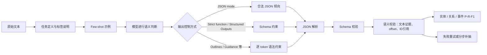

# 方向五｜输出格式与示例工程：Schema 约束与 Few-shot 的研究结论及可套用模板

## 执行摘要

结构化输出主要解决两个不同问题：**让结果“能被程序读取”**，以及**让结果“抽取得对”**。JSON mode、function calling 和 constrained decoding 对前一个问题帮助很大，但只有在 schema、标签定义、示例选择和校验流程设计合理时，才会稳定改善精确率、召回率和 F1。OpenAI 官方明确区分了两者：JSON mode 只保证输出是合法 JSON，不保证符合指定 schema；Structured Outputs 或开启 `strict` 的 function calling 才提供 schema 级约束。Anthropic 的 Structured Outputs 也采用类似思路，在支持范围内保证类型、必填字段和结构符合 schema。citeturn7view0turn2view2turn8view0

现有研究不支持“结构约束越强，抽取 F1 必然越高”这一简单结论。结构约束能消除括号缺失、字段漏写、类型错误等格式问题，但仍可能输出**结构完全合法、语义却错误或遗漏严重**的结果。另一方面，在低资源、生成式抽取等特定设置中，语法约束确实可能显著提高 F1：一项针对 211 篇临床试验摘要的研究中，grammar-constrained decoding 将两个数据集的 F1 分别从 0.062 提高到 0.413、从 0.102 提高到 0.470；但该结论来自经过微调的 Flan-T5、Longformer 类生成模型，不能直接当作闭源通用大模型 API 的预期增益。citeturn17view0turn17view1

对于通用抽取工程，建议采用以下默认方案：

| 决策点 | 推荐方案 | 核心理由 |
|---|---|---|
| 闭源 API 的普通抽取 | 优先使用严格 Structured Outputs；需要触发外部工具时才使用 function calling | 严格结构化输出保证 schema，而 JSON mode 只保证 JSON 语法。citeturn7view0turn2view2 |
| 自部署开源模型 | 使用 Guidance、Outlines、XGrammar 或推理引擎内置 grammar，并保留独立 JSON Schema 校验 | 不同 constrained-decoding 引擎对 schema 特性的覆盖率和性能差异很大，不能只看“支持 JSON Schema”的宣传。citeturn16view0 |
| Schema 字段名 | 稳定的英文或 ASCII 机器字段名，配目标语言的详细 `description` | 暂无充分证据证明英文字段名本身提高抽取准确率；稳定机器键便于接口治理，目标语言描述负责传达业务语义。详细标签定义对零样本抽取有明确帮助。citeturn19view0turn19view1 |
| 枚举 | 闭集任务提供完整枚举；不要用几个“示例值”冒充枚举约束 | `enum` 才是强约束；示例只是提示。过大的枚举和复杂 schema 需要单独压测引擎覆盖率、编译时间和语义混淆。citeturn16view0turn8view0 |
| 嵌套结构 | 实体扁平列表＋ID 引用关系；事件参数最多一到两层 | 深层嵌套增加生成路径、校验复杂度和局部遗漏风险。复杂 schema 在不同约束引擎上的支持差异明显。citeturn16view0 |
| 可选字段 | 字段全部声明为 required，需要缺省时使用 `null`；集合缺省使用 `[]` | OpenAI 严格 Structured Outputs 要求字段均为 required，可用与 `null` 的联合类型表达可选语义。citeturn7view1 |
| Few-shot 数量 | 从 0、2、4、8 个做阶梯实验，不预设固定最优值 | 更多示例在部分 NER、RE 设置中有上升趋势，但上下文长度、模型和负例比例会改变结果。citeturn18view0 |
| 示例选择 | 相似样本为主，兼顾标签覆盖、边界情况和难例；避免纯随机 | 检索式示例选择在多个任务上稳定优于随机选择；IE 研究也观察到语义检索优于随机抽样。citeturn17view3turn18view0 |
| 反例 | 少量、明确标注“错误”、紧跟正确答案的 hard negative | 只展示错误输出容易被模仿；对比式 IE 研究显示，纠正型 hard negative 可以提高表现，但过多负例会增加噪声并使效果波动。citeturn17view4turn18view0 |
| Chain-of-thought | 不要求输出完整思维链；复杂关系或事件采用“证据先抽取、结果后组装”的分步流程 | 显式长推理会消耗上下文并污染机器输出。部分模型的内部推理有帮助，但示例化推理对不同模型可能产生相反效果，应单独 A/B。citeturn8view2turn7view5turn11view6 |

## 研究口径与证据边界

评估结构化输出时，至少要把三个指标层面分开，否则很容易把“JSON 没坏”误认为“抽取得准”。

| 指标层面 | 主要问题 | 典型指标 |
|---|---|---|
| 语法有效性 | 能否被 JSON 解析器读取 | JSON parse success rate |
| Schema 合规性 | 字段、类型、枚举、必填项是否正确 | Schema-valid rate、字段缺失率、类型错误率 |
| 语义抽取质量 | 实体、关系、事件是否正确且完整 | Precision、Recall、F1、Exact Match、边界错误率 |

OpenAI 曾报告，在其“复杂 JSON schema 遵循”内部评测中，`gpt-4o-2024-08-06` 配合 Structured Outputs 达到 100%，而较早的 `gpt-4-0613` 不到 40%。这个数字衡量的是 schema adherence，不是实体或关系抽取 F1，不能据此推导“语义抽取达到 100%”。citeturn2view2

同样，constrained decoding 的机制是：在每个生成步骤屏蔽违反当前 grammar 或 schema 的 token，使最终输出落在合法结构集合中。这能保证“输出形式可接受”，却无法证明模型选择了正确实体、正确关系或正确事件类型。JSONSchemaBench 将 constrained decoding 分为效率、schema 覆盖和下游质量三个独立维度，正说明结构合规与语义质量不是同一件事。citeturn16view0



还要区分两类“输出格式研究”：

一类研究比较 JSON、tuple、inline XML、token-column 等**语义表示方式**。2026 年 EACL 一项超过 280 组实验的研究发现，在经过监督微调的 3B–32B decoder-only 模型上，只改变输出格式，个别设置的 F1 波动可以超过 40%；高密度、长文本中的 token-level 格式往往召回更高，而 standoff JSON 更短、更高效，但可能遗漏更多 span。该研究不等于比较 JSON mode 与 function calling，因为它研究的是训练目标的输出表示，且使用了微调后的开源模型。citeturn15view0turn15view1turn15view2

另一类研究比较 JSON mode、strict schema、grammar engine 等**解码控制方式**。这类方法主要改变合法输出空间，而不是直接改变标签定义或监督密度。目前缺少一个覆盖通用 NER、关系抽取、事件抽取，且在同一模型、同一 prompt、同一 schema 下全面比较这三类方式的公认基准。因此，下文会明确区分“有直接实验证据的结论”和“从现有证据得到的工程建议”。

## 结构化输出方法比较与质量影响

| 方法 | 结构保证 | 对 Precision / Recall / F1 的预期影响 | 常见失败与成本 | 更适合的场景 |
|---|---|---|---|---|
| 普通自然语言＋后处理 | 无强保证 | 可能保留模型最自然的表达，但解析错误、字段漂移会形成额外假阴性和假阳性 | Markdown 包裹、解释文字、漏字段、格式版本漂移 | 人工阅读、探索期、输出很简单 |
| JSON mode | 保证或强烈倾向于合法 JSON；不保证指定 schema | 通常降低“因 JSON 损坏导致的评测损失”，但不会自动解决漏实体、错标签或错误关系 | 字段名错误、类型错误、额外字段、内容截断；若 prompt 未明确要求 JSON，OpenAI 文档提示可能持续输出空白；必须校验与重试。citeturn7view0 | 旧模型、严格输出不可用、schema 经常动态变化 |
| Structured Outputs / JSON schema | 在供应商支持的 schema 子集内保证结构 | 能把格式类错误接近消除，使语义指标更干净；对语义 F1 的净影响仍依任务与 schema 设计而定 | 不支持的关键词会报错；拒答和截断需要单独处理；首次 schema 可能有编译延迟。citeturn2view0turn7view3turn8view0 | 机器消费的抽取结果、稳定数据接口 |
| Function calling，非 strict | 模型返回工具名和 JSON 参数，但未必严格匹配参数 schema | 比纯文本更稳定，但仍需验证参数 | 漏参数、错类型、调用了错误工具、附加字段 | 工具选择和参数填写容错较高的应用 |
| Function calling，`strict: true` | 参数严格匹配工具 schema | 与严格 Structured Outputs 类似，主要消除结构错误；若工具描述和参数语义含糊，仍可能“合法地调错工具” | 工具描述不足、工具过多、拒答、截断；复杂 schema 受供应商子集限制 | 抽取完成后确实要调用数据库、搜索、写入或业务动作 |
| Outlines | 可用 JSON Schema、正则或 grammar 约束生成，生成阶段保证结构 | 在自部署模型上可显著提高合规率；语义增益不固定 | 某些 schema 的编译或生成开销较高；JSONSchemaBench 中复杂关键词可能引发较长处理时间。citeturn2view5turn16view0 | Hugging Face 等本地模型、批处理、可缓存 schema |
| Guidance | 支持正则、CFG、JSON 等约束，并能把控制逻辑与生成交织 | JSONSchemaBench 中整体覆盖率和合规率表现较强，部分测试中生成还可能因跳过固定 token 而加速；结论依后端和版本而变 | 与特定模型后端、tokenizer 和 schema 特性有关；仍要做外部验证 | 复杂生成流程、局部生成、循环和工具逻辑混合 |
| 其他 grammar engine，如 llama.cpp、XGrammar | 由推理引擎逐 token 屏蔽非法输出 | 可获得稳定结构，但覆盖率、速度和 schema 语义等价性需要实测 | “接受 schema”不等于完整实现该 schema；引擎之间支持范围可相差约一倍。citeturn16view0 | 本地推理、性能敏感、可控制完整运行环境 |

**关于 F1，证据最强的几条结论如下。**

| 简明结论句 | 证据摘要 | 出处 | 适用条件 |
|---|---|---|---|
| JSON mode 不能替代 schema enforcement | OpenAI 官方文档明确表示，JSON mode 只保证合法 JSON；Structured Outputs 才保证匹配 schema，并建议在可用时优先采用后者。 | OpenAI Structured Outputs 文档。citeturn7view0 | 支持对应 API 的 OpenAI 模型；所有机器消费型任务 |
| Strict function calling 可以消除大部分参数结构错误，但不能保证参数语义正确 | `strict: true` 使函数参数匹配工具定义；官方同时强调工具名、参数名和说明应清晰详细。 | OpenAI Function Calling 官方文档。citeturn2view2turn7view4 | 工具调用、参数抽取；闭源 API |
| Grammar-constrained decoding 在低资源生成式抽取中可能大幅提高 F1 | 211 篇临床试验摘要、少量训练样本、微调 encoder-decoder 模型中，两个数据集 F1 分别由 0.062→0.413、0.102→0.470。 | Schmidt 与 Cimiano，Frontiers in AI 2024。citeturn17view0turn17view1 | 临床 PICO slot filling；Flan-T5、Longformer 类微调模型；几百条数据 |
| 不能默认把更强约束等同于更高 F1 | JSONSchemaBench 将合规率、覆盖率和下游质量分开评测；约束解码在其任务中最多改善约 4%，但不是通用 IE 专项结果。 | JSONSchemaBench。citeturn16view0 | 多类真实 JSON schema；多个开源和闭源引擎 |
| 输出表示本身可以显著改变 Recall 与 F1 | 微调开源模型研究中，格式变化可使 F1 波动超过 40%；长文本、高标注密度时 token-level 格式降低漏抽，而 standoff JSON 更紧凑。 | EACL 2026，Lost in Formatting。citeturn15view0turn15view1turn15view2 | 3B–32B 微调 decoder-only 模型；NER、事件检测、SRL；非嵌套 span |
| 不同 constrained-decoding 引擎不可视为等价替换 | 约 10K 个真实 schema 的测试中，最好与最差引擎的 schema 覆盖量约相差一倍；Outlines、Guidance、llama.cpp、XGrammar 等在编译和逐 token 开销上也不同。 | JSONSchemaBench。citeturn16view0 | 自部署模型；真实复杂 JSON Schema；结果受模型与后端影响 |
| 合法结构仍可能包含严重漏抽 | 结构约束限制输出形式，不会迫使模型发现所有实体；高密度长文本中，紧凑 standoff 输出可能降低召回。 | constrained decoding 机制及 EACL 输出格式实验。citeturn16view0turn15view1 | 长文档、多实体、多事件、召回优先任务 |

临床抽取研究中的约束前后 F1 如下。该结果用于说明“特定设置下约束可能改善语义质量”，不应当作为通用 API 模型的收益预测。citeturn17view1

```mermaid
xychart-beta
    title "低资源临床结构化抽取：Grammar 约束前后 F1"
    x-axis ["二型糖尿病", "青光眼"]
    y-axis "F1" 0 --> 0.5
    bar [0.062, 0.102]
    bar [0.413, 0.470]
```



**常见失败模式与处理方式：**

| 失败模式 | 表面现象 | 对指标的影响 | 推荐处理 |
|---|---|---|---|
| 合法 JSON、错误 schema | 字段拼错、数组变对象、类型不符 | 解析成功，但评测或下游写入失败 | 从 JSON mode 升级到 strict schema；否则使用 JSON Schema validator，并把具体校验错误返回模型修复 |
| Schema 合法、语义错误 | 错标签、错关系、把推断当事实 | Precision 下降 | 描述中加入“包含／不包含／边界／反事实规则”；要求逐项提供原文 evidence；增加纠正型难反例 |
| Schema 合法、漏实体或漏事件 | 数组很短但结构完美 | Recall 下降 | 召回优先时采用两步流程：候选 span 扫描→分类与关系组装；长而密集的文本按段落或句群切分后合并 |
| 枚举外标签被硬塞进最接近类别 | 所有值都合法，但标签语义错误 | Precision 下降，混淆矩阵集中 | 增加 `OTHER` 与 `type_other`；在描述中写清排除边界；不要强迫模型对不确定对象二选一 |
| 拒答或安全响应不符合 schema | 返回拒绝说明而非 JSON | 结构失败 | 单独检查 refusal 字段或供应商的拒答状态，不要把拒答内容交给普通 JSON parser。citeturn7view3turn8view0 |
| 输出被截断 | JSON 未闭合，数组只生成一部分 | 解析失败或 Recall 严重下降 | 检查 finish reason、token limit；缩短 description 和示例；拆分文档或按类型分步抽取 |
| Schema 使用了引擎不支持的关键词 | API 报错、引擎超时或偷偷弱化约束 | 无结果或合规率虚高 | 使用供应商支持的 JSON Schema 子集；建立 schema compatibility test suite。citeturn2view0turn16view0 |
| ID 引用断裂 | 关系引用不存在的实体 ID | 关系不可用 | 后处理检查引用完整性；关系评测时用实体 span 和类型，不用模型生成的任意 ID 直接比对 |
| offset 与文本不一致 | `text` 与 `source[start:end]` 不同 | span F1 下降 | 明确 0-based、end-exclusive、Unicode code point；在校验器中执行 substring 一致性检查 |
| 重复实体或重复关系 | 同一 span 多条记录 | Precision 下降 | 以 `(type, start, end)` 去重；关系以规范化后的主客体 span 和 relation type 去重 |
| 后处理“修好 JSON”却丢内容 | 正则删掉无法解析的片段 | Recall 被隐性损害 | 后处理只能做确定性的格式修复；无法恢复的部分应触发重试，而不是静默删除 |

## Schema 设计结论

| 简明结论句 | 证据摘要与推荐写法 | 出处 | 适用条件 |
|---|---|---|---|
| 没有充分证据证明英文字段名天然比目标语言字段名更准 | 现有研究更支持“标签定义和 annotation guideline 很重要”，而不是某种字段名语言必胜。工程上建议机器键保持英文／ASCII，`description` 使用输入语言或目标业务语言；跨语言模型不稳定时可写双语描述。该建议主要服务接口稳定性，不是已证实的 F1 定律。 | GoLLIE 证明详细指南有明显价值；跨语言 IE 仍存在对齐不均衡问题。citeturn19view2turn9search0 | 多语言抽取；需要长期 API 兼容；任意模型规模 |
| 字段描述应覆盖定义、包含项、排除项、边界规则和缺失规则 | GoLLIE 消融中，完整方案零样本平均 F1 为 55.3，移除全部 guideline 组件后降至 42.3；移除代表性候选也降至 49.9。仅写一句泛化定义通常不够。citeturn19view1 | GoLLIE；OpenAI 和 Anthropic 官方也强调详细工具、参数描述。citeturn7view4turn8view1 | 新领域、零样本、标签边界复杂的实体／事件抽取 |
| 描述应“足够完整”，而不是无上限堆字 | 复杂规则要写，但重复背景、营销语言和无关解释会占用上下文。Anthropic 官方把详细描述视为工具性能的重要因素，同时指出复杂示例会产生明显 token 成本。citeturn8view1 | 上下文较短、字段较多、示例较多的任务 |
| 闭集标签必须给完整 `enum` | 完整枚举既缩小生成空间，也让无效类别在生成时不可达；只给几个“例如”不会形成强约束。 | JSON Schema 及 Structured Outputs 的约束机制。citeturn16view0turn8view0 | 标签集合稳定、类别数适中 |
| 开放标签不要伪装成闭集枚举 | 类别持续新增时，应使用 `OTHER`＋自由文本补充字段，或分成“候选标签检索”和“抽取”两步；否则模型会把未知类别错误映射到合法枚举。 | 这是由枚举强约束和 IE 标签边界研究推导出的工程建议。GoLLIE 也观察到模型会受既有标签先验影响。citeturn19view0turn19view2 | 开放世界知识抽取、动态本体 |
| 正则和类型约束只能约束表面形式，不能证明语义正确 | `pattern` 可以约束日期、编码或 ID 的格式，却不能判断日期是否来自原文、金额单位是否正确。 | constrained decoding 只屏蔽违反语法约束的 token。citeturn16view0 | 日期、金额、证件号、代码、URL 等规范化字段 |
| 深层嵌套不是越“贴近业务对象”越好 | 不同 grammar engine 对复杂 JSON Schema 的覆盖和速度差异明显。推荐把实体放在顶层数组，关系和事件通过 ID 引用实体；通常控制在一到两层数组对象。 | JSONSchemaBench 的覆盖和效率实验。citeturn16view0 | 关系抽取、事件参数抽取、大批量生产 |
| 所有字段 required，语义可选字段用 `null` | OpenAI 严格结构输出要求字段标记为 required；可通过字符串／`null` 联合类型表达缺省。citeturn7view1 | OpenAI strict schema；为了跨供应商兼容也可沿用 |
| `[]` 与 `null` 必须区分 | 推荐：`[]` 表示已检查、没有对象；`null` 表示该单值字段不适用、未知或无法判断。不要让同一个集合字段有时返回 `null`、有时返回空数组。 | 这是为了稳定评测和下游语义的工程约定，与 required＋nullable 设计相配合。citeturn7view1 | 全部抽取任务 |
| 每条抽取结果都应保留原文证据或 offset | 这让系统能够检查模型是否凭空生成文本，并区分结构错误、边界错误和标签错误。严格 IE 评测通常要求 span 和标签同时匹配。citeturn15view1turn18view5 | 高可靠抽取、可审计领域、关系和事件抽取 |
| 模型自报 `confidence` 不应直接当作可信概率 | Schema 可以要求置信度字段，但不应在未经校准的情况下用于自动决策。更可靠的做法是保存证据、做重复采样一致性或使用开发集校准。c-ICL 也通过多次生成和一致性选择 hard negative，而不是直接相信单次输出。citeturn18view3 | 风险分级、人工复核队列 |

建议把字段注释写成固定结构：

```json
{
  "type": "string",
  "description": "定义：该字段表示什么。包含：哪些情况必须标注。不包含：哪些相似情况不要标注。边界：原文范围如何确定。缺失：无法判断时填什么。示例：一个正例和一个易混淆反例。"
}
```

例如，组织实体的描述不要只写“组织名称”，更合适的写法是：

```json
{
  "type": "string",
  "description": "组织在原文中的完整提及。包含公司、政府机关、学校、医院和正式协会；不包含泛指部门、产品品牌或没有明确名称的群体。保留原文完整边界，例如“华北制药集团”不得缩短为“华北制药”。"
}
```

对于特别复杂的标签，描述优先级应为：

**明确排除规则与边界规则 > 正式定义 > 正例 > 常规背景说明。**

原因是抽取错误往往发生在相邻标签和 span 边界，而不是模型完全不知道标签名称。GoLLIE 的误差分析也表明，定义含糊、类别过粗或数据标注与指南不一致时，即使模型能跟随 guideline，结果仍会受到限制。citeturn19view0turn19view2

## Few-shot 示例工程

| 简明结论句 | 证据摘要与推荐做法 | 出处 | 适用条件 |
|---|---|---|---|
| 示例质量通常比单纯增加数量更重要 | 检索式示例选择在多个 NLU、生成任务中持续优于随机选择；经过任务相关数据微调的检索器效果更好。citeturn17view3 | Liu 等，DeeLIO 2022 | 通用 ICL；原研究不只针对 IE |
| IE 正例应优先检索语义相似样本 | c-ICL 在 CoNLL03、NYT 上发现，语义检索正例优于随机抽样。citeturn18view0 | c-ICL | CodeLlama；NER、RE；英文数据 |
| 相似度检索还要加标签覆盖和多样性约束 | 纯 top-k 可能返回多个近乎重复示例，使少数标签占满上下文。推荐先取相似候选，再用标签覆盖、文档长度、边界类型做重排。这是建立在相似检索证据上的工程扩展。 | 相似检索证据来自 Liu 等及 c-ICL。citeturn17view3turn18view0 | 多标签、长尾类别、少样本 |
| 不存在跨模型通用的最优 shot 数 | c-ICL 在 CodeLlama-7B、13B 的 NER、RE 子实验中观察到 shots 增多时总体效果上升，但主实验使用 12–24 个示例和 8K 上下文；这不能直接推广为所有模型的固定数字。citeturn18view0 | c-ICL | CodeLlama；英文 NER、RE |
| 推荐用阶梯实验决定数量 | 工程起点可使用 2–4 个正例，随后测试 0、2、4、8；若每个示例很短且标签很多，再测试 12 或更多。应同时报告 token、延迟和 F1，而不是只看 F1。 | 该区间是实验起点，不是论文给出的普遍最优值；依据是 shots 收益与上下文噪声的共同证据。citeturn18view0turn8view1 | 任意模型；需要自行验证 |
| 示例应覆盖“空结果” | 至少加入一个文本中没有任何目标实体或关系、输出为空数组的正例，用于说明“没有结果也是合法答案”。这是控制 hallucination 和假阳性的工程建议，需要在具体数据上 A/B。 | GoLLIE 发现标签定义和代表性样本可降低模型对既有标签先验的依赖。citeturn19view1turn19view3 | 负样本占比高、Precision 优先 |
| 反例必须标记为错误并提供修正 | c-ICL 明确区分正例与错误例，并在错误例后加入正确答案；否则模型难以知道错误输出不可模仿。citeturn17view4turn18view3 | c-ICL | Few-shot NER、RE |
| 少量 hard negative 可能提高准确率，过多会产生反效果 | c-ICL 中，随着负例增加，效果先上升后波动；过多负例增加噪声和上下文长度。citeturn18view0 | c-ICL | CodeLlama-7B；300 条测试子集分析 |
| hard negative 应来自真实错误，而不是随手编造 | c-ICL 使用模型预测、自一致性和 F1 阈值选择“接近正确但仍错误”的样本，效果优于随机错误例。citeturn18view0 | c-ICL | 有开发集或标注训练集 |
| 示例顺序可能显著影响结果 | 早期 ICL 研究显示，同一组示例仅改变顺序就可能产生较大性能差异；长上下文研究还发现中间位置的信息利用往往弱于开头或结尾。citeturn11view4turn11view3 | 主要来自分类、QA 和检索任务；对当前 IE 模型需复验 |
| Schema 和静态示例适合放在输入文本之前，末尾再放简短检查清单 | 把稳定内容放前面便于 prompt caching；末尾重复最关键的输出规则，可以降低长上下文中规则被“淹没”的风险。citeturn8view3turn11view3 | 支持缓存的 API；长 prompt |
| 不建议让模型在最终 JSON 中输出完整 chain-of-thought | 对复杂任务，内部推理或分步处理可能有帮助；但完整思维过程会增加 token、破坏纯 JSON，并可能让模型模仿无关解释。OpenAI 还提示，在部分 reasoning models 上，工具示例未必有益。citeturn8view2turn7view5 | 推理模型、严格机器接口 |
| 关系和事件抽取可采用证据优先，而不是思维链外显 | 先识别候选实体及支持句，再生成关系或事件，有助于把推理限制在原文证据内。CoT-ER 研究也使用证据推理辅助关系抽取。citeturn11view6 | RE、事件参数抽取、跨句关系 |

推荐的示例组合不是“全找最像的”，而是：

| 示例角色 | 建议占比 | 解决的问题 |
|---|---:|---|
| 语义相似正例 | 约一半 | 告诉模型当前文档类型和常见抽取方式 |
| 标签或关系覆盖例 | 约四分之一 | 防止罕见类别完全没有演示 |
| 边界／嵌套／跨句难例 | 约四分之一 | 教模型处理最长实体、相邻实体、代词或事件参数 |
| 空结果例 | 至少一个，视负样本比例调整 | 降低无事实时强行输出 |
| 纠正型 hard negative | 初始放一个，最多一到两个后再 A/B | 展示最常见错误及正确修复方式 |

示例放置建议采用：

```text
系统角色与任务目标
→ 标签定义和抽取规则
→ JSON Schema
→ 正例
→ 空结果正例
→ 少量“错误＋原因＋正确输出”的反例
→ 当前输入文本
→ 最终检查清单
→ 只输出 JSON
```

不建议把错误示例放在最靠近待处理文本的位置，也不建议把错误 JSON 单独展示而不给正确答案。c-ICL 的设计中，错误示例后明确附带“该结果错误”和正确结果，正是为了避免模型把负例当作正常模式模仿。citeturn17view4

## 可直接套用的 Schema 与示例模板

下面是一份偏保守、适合跨供应商迁移的通用抽取 schema。它使用浅层结构、完整必填字段、空数组表示“没有结果”，并保留 evidence 和字符位置用于自动校验。

其中实体、关系、事件和角色枚举只是演示，正式项目应替换成任务的**完整标签集**。

```json
{
  "title": "GenericInformationExtraction",
  "type": "object",
  "additionalProperties": false,
  "required": [
    "document_id",
    "language",
    "entities",
    "relations",
    "events",
    "warnings"
  ],
  "properties": {
    "document_id": {
      "type": "string",
      "description": "输入文档的唯一标识，必须原样复制，不得改写。"
    },
    "language": {
      "type": "string",
      "enum": ["zh-CN", "en", "other"],
      "description": "输入文本的主要语言。"
    },
    "entities": {
      "type": "array",
      "description": "原文中明确出现的实体。没有符合条件的实体时返回空数组，不得返回 null。",
      "items": {
        "type": "object",
        "additionalProperties": false,
        "required": [
          "id",
          "type",
          "text",
          "start_char",
          "end_char",
          "normalized_name",
          "evidence"
        ],
        "properties": {
          "id": {
            "type": "string",
            "description": "文档内唯一实体 ID，按 e1、e2、e3 顺序编号。"
          },
          "type": {
            "type": "string",
            "enum": [
              "PERSON",
              "ORGANIZATION",
              "LOCATION",
              "PRODUCT",
              "DATE",
              "MONEY",
              "OTHER"
            ],
            "description": "实体类别。只能选择完整枚举中的值。无法归入已知类别时选择 OTHER。"
          },
          "text": {
            "type": "string",
            "description": "实体在原文中的完整连续文本。不得改写、翻译或缩短边界。"
          },
          "start_char": {
            "type": "integer",
            "description": "实体起始字符位置，0-based，按 Unicode code point 计数，包含该位置。"
          },
          "end_char": {
            "type": "integer",
            "description": "实体结束字符位置，0-based，按 Unicode code point 计数，不包含该位置；必须满足 source[start_char:end_char] 等于 text。"
          },
          "normalized_name": {
            "type": ["string", "null"],
            "description": "可以确定规范名称时填写；无法确定时为 null。不得凭常识补充原文没有依据的名称。"
          },
          "evidence": {
            "type": "string",
            "description": "支持该实体判断的最短原文片段，必须直接复制自输入。"
          }
        }
      }
    },
    "relations": {
      "type": "array",
      "description": "原文明确支持的实体间关系。仅有常识关联而无文本证据时不要输出。",
      "items": {
        "type": "object",
        "additionalProperties": false,
        "required": [
          "id",
          "type",
          "head_entity_id",
          "tail_entity_id",
          "evidence"
        ],
        "properties": {
          "id": {
            "type": "string",
            "description": "文档内唯一关系 ID，按 r1、r2、r3 顺序编号。"
          },
          "type": {
            "type": "string",
            "enum": [
              "EMPLOYED_BY",
              "LOCATED_IN",
              "ORG_RELEASED_PRODUCT",
              "PERSON_RESPONSIBLE_FOR_PRODUCT",
              "ACQUIRED",
              "OTHER"
            ],
            "description": "关系类别。关系方向由 head_entity_id 指向 tail_entity_id。"
          },
          "head_entity_id": {
            "type": "string",
            "description": "关系主体实体 ID，必须引用 entities 中已经存在的 ID。"
          },
          "tail_entity_id": {
            "type": "string",
            "description": "关系客体实体 ID，必须引用 entities 中已经存在的 ID。"
          },
          "evidence": {
            "type": "string",
            "description": "直接支持关系成立的原文片段。不得只写两个实体名称而省略关系证据。"
          }
        }
      }
    },
    "events": {
      "type": "array",
      "description": "原文中明确陈述的事件。没有事件时返回空数组。",
      "items": {
        "type": "object",
        "additionalProperties": false,
        "required": [
          "id",
          "type",
          "trigger",
          "arguments",
          "evidence"
        ],
        "properties": {
          "id": {
            "type": "string",
            "description": "文档内唯一事件 ID，按 ev1、ev2、ev3 顺序编号。"
          },
          "type": {
            "type": "string",
            "enum": [
              "PRODUCT_RELEASE",
              "ACQUISITION",
              "APPOINTMENT",
              "OTHER"
            ],
            "description": "事件类别。只能使用枚举值；未知事件使用 OTHER。"
          },
          "trigger": {
            "type": "object",
            "additionalProperties": false,
            "required": ["text", "start_char", "end_char"],
            "properties": {
              "text": {
                "type": "string",
                "description": "最能表示事件发生的原文触发词。"
              },
              "start_char": {
                "type": "integer",
                "description": "触发词起始位置，0-based，包含。"
              },
              "end_char": {
                "type": "integer",
                "description": "触发词结束位置，0-based，不包含。"
              }
            }
          },
          "arguments": {
            "type": "array",
            "description": "事件参数。每个参数应尽量引用已经抽取的实体。",
            "items": {
              "type": "object",
              "additionalProperties": false,
              "required": [
                "role",
                "entity_id",
                "text",
                "evidence"
              ],
              "properties": {
                "role": {
                  "type": "string",
                  "enum": [
                    "ACTOR",
                    "TARGET",
                    "PRODUCT",
                    "LOCATION",
                    "TIME",
                    "RESPONSIBLE_PERSON",
                    "OTHER"
                  ],
                  "description": "参数在事件中的角色。"
                },
                "entity_id": {
                  "type": ["string", "null"],
                  "description": "能对应 entities 中实体时填写实体 ID；无法对应时为 null。"
                },
                "text": {
                  "type": "string",
                  "description": "参数在原文中的文本。"
                },
                "evidence": {
                  "type": "string",
                  "description": "支持该参数角色的原文片段。"
                }
              }
            }
          },
          "evidence": {
            "type": "string",
            "description": "能够支持事件类型及主要参数的最短原文片段。"
          }
        }
      }
    },
    "warnings": {
      "type": "array",
      "description": "无法通过确定性规则解决的问题。正常情况下返回空数组。",
      "items": {
        "type": "object",
        "additionalProperties": false,
        "required": ["code", "message"],
        "properties": {
          "code": {
            "type": "string",
            "enum": [
              "AMBIGUOUS_BOUNDARY",
              "UNSUPPORTED_TYPE",
              "COREFERENCE_UNRESOLVED",
              "TRUNCATED_INPUT"
            ],
            "description": "预定义警告代码。"
          },
          "message": {
            "type": "string",
            "description": "简短说明问题及相关原文，不得输出完整推理过程。"
          }
        }
      }
    }
  }
}
```

**正例：实体、关系和事件同时存在**

```text
输入：
document_id = demo-pos-1
text = 2026年7月，星河科技在上海发布了Atlas机器人，由陈敏负责产品发布。
```

```json
{
  "document_id": "demo-pos-1",
  "language": "zh-CN",
  "entities": [
    {
      "id": "e1",
      "type": "ORGANIZATION",
      "text": "星河科技",
      "start_char": 8,
      "end_char": 12,
      "normalized_name": "星河科技",
      "evidence": "星河科技在上海发布了Atlas机器人"
    },
    {
      "id": "e2",
      "type": "LOCATION",
      "text": "上海",
      "start_char": 13,
      "end_char": 15,
      "normalized_name": "上海",
      "evidence": "在上海发布"
    },
    {
      "id": "e3",
      "type": "PRODUCT",
      "text": "Atlas机器人",
      "start_char": 18,
      "end_char": 26,
      "normalized_name": "Atlas机器人",
      "evidence": "发布了Atlas机器人"
    },
    {
      "id": "e4",
      "type": "PERSON",
      "text": "陈敏",
      "start_char": 28,
      "end_char": 30,
      "normalized_name": "陈敏",
      "evidence": "由陈敏负责产品发布"
    },
    {
      "id": "e5",
      "type": "DATE",
      "text": "2026年7月",
      "start_char": 0,
      "end_char": 7,
      "normalized_name": "2026-07",
      "evidence": "2026年7月"
    }
  ],
  "relations": [
    {
      "id": "r1",
      "type": "ORG_RELEASED_PRODUCT",
      "head_entity_id": "e1",
      "tail_entity_id": "e3",
      "evidence": "星河科技在上海发布了Atlas机器人"
    },
    {
      "id": "r2",
      "type": "PERSON_RESPONSIBLE_FOR_PRODUCT",
      "head_entity_id": "e4",
      "tail_entity_id": "e3",
      "evidence": "Atlas机器人，由陈敏负责产品发布"
    }
  ],
  "events": [
    {
      "id": "ev1",
      "type": "PRODUCT_RELEASE",
      "trigger": {
        "text": "发布",
        "start_char": 15,
        "end_char": 17
      },
      "arguments": [
        {
          "role": "ACTOR",
          "entity_id": "e1",
          "text": "星河科技",
          "evidence": "星河科技在上海发布"
        },
        {
          "role": "PRODUCT",
          "entity_id": "e3",
          "text": "Atlas机器人",
          "evidence": "发布了Atlas机器人"
        },
        {
          "role": "LOCATION",
          "entity_id": "e2",
          "text": "上海",
          "evidence": "在上海发布"
        },
        {
          "role": "TIME",
          "entity_id": "e5",
          "text": "2026年7月",
          "evidence": "2026年7月"
        },
        {
          "role": "RESPONSIBLE_PERSON",
          "entity_id": "e4",
          "text": "陈敏",
          "evidence": "由陈敏负责产品发布"
        }
      ],
      "evidence": "2026年7月，星河科技在上海发布了Atlas机器人，由陈敏负责产品发布。"
    }
  ],
  "warnings": []
}
```

**正例：没有目标事实**

```text
输入：
document_id = demo-pos-2
text = 会议讨论了未来规划，但未提及具体公司、人物、产品或日期。
```

```json
{
  "document_id": "demo-pos-2",
  "language": "zh-CN",
  "entities": [],
  "relations": [],
  "events": [],
  "warnings": []
}
```

**反例：实体边界被截短**

```text
输入：
document_id = demo-neg-1
text = 华北制药集团宣布收购康宁生物。
```

错误输出片段：

```json
{
  "id": "e1",
  "type": "ORGANIZATION",
  "text": "华北制药",
  "start_char": 0,
  "end_char": 4
}
```

错误原因：

```text
“华北制药”不是原文中的完整组织边界。正式名称在原文中连续出现为“华北制药集团”。
```

正确输出：

```json
{
  "document_id": "demo-neg-1",
  "language": "zh-CN",
  "entities": [
    {
      "id": "e1",
      "type": "ORGANIZATION",
      "text": "华北制药集团",
      "start_char": 0,
      "end_char": 6,
      "normalized_name": "华北制药集团",
      "evidence": "华北制药集团宣布收购康宁生物"
    },
    {
      "id": "e2",
      "type": "ORGANIZATION",
      "text": "康宁生物",
      "start_char": 10,
      "end_char": 14,
      "normalized_name": "康宁生物",
      "evidence": "收购康宁生物"
    }
  ],
  "relations": [
    {
      "id": "r1",
      "type": "ACQUIRED",
      "head_entity_id": "e1",
      "tail_entity_id": "e2",
      "evidence": "华北制药集团宣布收购康宁生物"
    }
  ],
  "events": [
    {
      "id": "ev1",
      "type": "ACQUISITION",
      "trigger": {
        "text": "收购",
        "start_char": 8,
        "end_char": 10
      },
      "arguments": [
        {
          "role": "ACTOR",
          "entity_id": "e1",
          "text": "华北制药集团",
          "evidence": "华北制药集团宣布收购"
        },
        {
          "role": "TARGET",
          "entity_id": "e2",
          "text": "康宁生物",
          "evidence": "收购康宁生物"
        }
      ],
      "evidence": "华北制药集团宣布收购康宁生物"
    }
  ],
  "warnings": []
}
```

**反例：把推测写成明确关系**

```text
输入：
document_id = demo-neg-2
text = 李然参加了远景汽车举行的发布会。
```

错误输出：

```json
{
  "type": "EMPLOYED_BY",
  "head_entity_id": "e1",
  "tail_entity_id": "e2",
  "evidence": "李然参加了远景汽车举行的发布会"
}
```

错误原因与正确做法：

```text
“参加发布会”不能推出“受雇于”。可以抽取人物李然和组织远景汽车，
但 relations 应为空数组，除非标签体系中另有“参加活动”关系。
```

推荐的主 prompt 片段：

```text
你是信息抽取引擎。你的输出将直接进入程序，不面向人工阅读。

任务：
从 <source_text> 中抽取符合 schema 和标签定义的实体、关系与事件。

抽取规则：
1. 只抽取原文明确表达的事实，不使用常识补全，不把可能性写成事实。
2. 实体 text 必须是原文中的连续完整片段。
3. start_char 使用 0-based、end-exclusive 的 Unicode 字符位置。
4. source_text[start_char:end_char] 必须与实体 text 或 trigger text 完全一致。
5. 关系主体和客体必须引用 entities 中存在的 ID。
6. 没有结果时返回空数组，不得为了填满字段而编造。
7. 枚举外的实体或事件使用 OTHER；不要创造新的枚举值。
8. 同一实体、关系或事件不要重复输出。
9. evidence 必须直接复制自原文。
10. 不输出解释、Markdown、代码围栏或思维过程，只输出最终 JSON。

<schema>
{{完整 JSON Schema}}
</schema>

<positive_examples>
{{正例，包括至少一个空结果例}}
</positive_examples>

<corrected_negative_examples>
{{少量“错误输出＋错误原因＋正确输出”}}
</corrected_negative_examples>

<source_document>
document_id: {{document_id}}
source_text: {{source_text}}
</source_document>

输出前自行检查：
- JSON 是否符合 schema；
- 所有 offset 是否能切回原文；
- 所有关系和事件参数引用是否存在；
- 是否把推测当成事实；
- 是否遗漏明显的同类实体。

只输出 JSON。
```

同一模板在不同模式中的使用方式如下：

| 模式 | Schema 放置方式 | 示例放置方式 | 必做校验 |
|---|---|---|---|
| JSON mode | 把 schema 完整写进 prompt；API 层只开启 JSON object mode。Prompt 中必须明确出现“JSON”要求。 | 作为普通 user/system 消息内容 | JSON parse、完整 JSON Schema 校验、语义校验、失败重试。JSON mode 本身不保证 schema。citeturn7view0 |
| OpenAI Structured Outputs | 将上述 schema 放入 `response_format` 的 JSON schema，并开启严格模式 | 任务规则和 few-shot 仍放消息中 | 处理 refusal、长度截断和供应商不支持的 schema 关键词。citeturn2view2turn2view0turn7view3 |
| OpenAI function calling | 定义一个如 `extract_information` 的工具，把 schema 作为 `parameters`，使用 `strict: true` | 示例可放 prompt，但工具名和参数说明本身也要详细 | 校验是否调用了正确工具；检查工具参数中的语义证据。citeturn2view1turn7view4 |
| Anthropic Structured Outputs / tool use | 使用 `input_schema` 或 Structured Outputs；复杂参数可使用 `input_examples` | 示例必须与 schema 一致，可展示可选参数和复杂嵌套结构 | 处理拒答、schema 复杂度限制和首次编译延迟。citeturn8view0turn8view1 |
| Outlines | 把同一 JSON Schema 编译为生成约束 | Prompt 中保留任务规则和示例，不能只给 grammar | 缓存编译结果；对复杂枚举、数组限制做超时测试；再次用标准 validator 验证。citeturn2view5turn16view0 |
| Guidance | 把 schema 转为 JSON／grammar 约束，并在生成流程中调用 | 可把候选生成、校验和局部重试组织在同一控制流程 | 固定模型、tokenizer 和后端做覆盖率与速度基准；升级版本后回归。citeturn2view6turn16view0 |

Function calling 不应仅仅为了“拿到 JSON”而使用。OpenAI 将 function calling 定位为连接模型与外部工具或系统的接口；若最终只是返回一份抽取结果，没有工具动作，直接 Structured Outputs 通常更清晰。citeturn2view1turn7view0

## 实验设计与评估方法

实验应采用**同一输入、同一模型、同一标签定义、同一最大输出长度的配对设计**。否则无法判断提升来自 schema、示例，还是模型版本和 prompt 变化。

推荐拆成三个实验阶段：

| 阶段 | 主要变量 | 保持不变 | 目的 |
|---|---|---|---|
| 输出控制实验 | 普通 JSON prompt、JSON mode、strict structured output、function calling、开源 grammar | 模型、schema 语义、示例、温度、测试集 | 判断结构合规、语义 F1、延迟和重试率 |
| Schema 消融实验 | 字段名语言、描述详略、完整枚举／无枚举、浅层／深层、nullable 设计 | 输出控制方式、模型、示例 | 找出 schema 设计对准确率的独立影响 |
| Few-shot 实验 | 0/2/4/8 shots、随机／相似检索／多样性重排、负例数量、示例位置 | schema、模型、解码方式 | 确定示例数量和检索策略 |

**建议的核心实验矩阵：**

| 变量 | 基线 | 对照方案 |
|---|---|---|
| 输出方式 | JSON mode | strict JSON schema |
| 工具接口 | Structured Outputs | strict function calling |
| 字段名 | 英文键 | 中文键 |
| 字段描述 | 一句话定义 | 定义＋包含＋排除＋边界＋缺失规则 |
| 枚举 | 仅文字列举标签 | JSON Schema 完整 `enum` |
| 结构 | 实体、关系、事件扁平＋ID | 事件中深层嵌套完整实体对象 |
| 可选字段 | 字段缺失 | required＋nullable |
| shot 数 | 0 | 2、4、8 |
| 选择方式 | 随机 | embedding 相似度 |
| 重排方式 | 只看相似度 | 相似度＋标签覆盖＋难度多样性 |
| 反例 | 无 | 1 个纠正型 hard negative、2 个纠正型 hard negative |
| 放置位置 | 示例在中间 | 示例靠前、末尾保留规则检查清单 |
| 推理方式 | 单步直接生成 | 候选抽取→关系／事件组装→校验 |

每次只改一个主要因素，或使用完整因子实验和统计模型分析交互项。不要同时把 JSON mode 换成 strict、把 schema 改写、再增加八个示例，然后把全部提升归因于“结构化输出”。

**语义评测定义：**

实体严格匹配建议使用：

```text
实体正确 ⇔
预测 type = 标注 type
且预测 start_char = 标注 start_char
且预测 end_char = 标注 end_char
```

关系严格匹配建议使用：

```text
关系正确 ⇔
relation type 正确
且主体实体 type、span 正确
且客体实体 type、span 正确
```

c-ICL 的关系严格 F1 也要求关系类型、实体 span 和实体类型全部正确。citeturn18view5

事件评测至少拆成：

```text
Trigger Identification：触发词 span 是否正确
Trigger Classification：触发词 span + 事件类型是否正确
Argument Identification：参数 span 是否正确
Argument Classification：参数 span + role 是否正确
Event Exact Match：事件类型、trigger、全部参数是否共同正确
```

Precision、Recall 和 F1 按集合匹配计算：

```text
Precision = TP / (TP + FP)
Recall    = TP / (TP + FN)
F1        = 2 × Precision × Recall / (Precision + Recall)
```

主结果推荐报告 micro-F1，因为通用抽取经常存在类别不均衡；同时报告 macro-F1 和每标签 F1，防止大类别掩盖长尾类别。严格 exact match 应作为主指标，宽松边界或语义匹配只能作为补充分析。生成式关系抽取研究也指出，单一严格匹配可能无法反映同义表达，但宽松指标若没有确定规则，又容易高估结果。citeturn13search4turn13search15

**必须单独报告的结构和系统指标：**

| 指标 | 计算方式 |
|---|---|
| JSON parse success | 可成功 `json.loads` 的样本数／总样本数 |
| Schema-valid rate | 通过完整 JSON Schema validator 的样本数／总样本数 |
| Semantic-valid rate | offset、evidence、ID 引用、去重规则全部通过的样本数／总样本数 |
| Empty-output accuracy | 金标准为空的文档中，正确返回空数组的比例 |
| Hallucinated-span rate | 输出 text 无法在原文或指定 offset 找到的比例 |
| Dangling-reference rate | 关系／事件参数引用不存在实体 ID 的比例 |
| Retry rate | 至少发生一次重试的请求数／总请求数 |
| Latency | p50、p95、p99；区分首次 schema 编译与缓存后延迟 |
| Token 和成本 | 输入、输出、重试 token 及单文档总成本 |
| Truncation rate | 因最大 token 或长度限制导致未完成输出的比例 |

对于温度大于零的生成，建议每个实验条件至少运行多个随机种子或重复请求；c-ICL 使用三个随机种子报告结果。citeturn18view5 对温度为零的 API，也不应默认服务端完全确定，应保存模型版本、请求参数、schema 哈希和原始响应，以便复现。

**统计显著性：**

最合适的是文档级配对重采样，而不是把两组整体 F1 当作两个独立数字进行普通 t 检验。

推荐流程：

```text
1. 对同一测试集上的系统 A、B 保存逐文档预测。
2. 以文档为单位有放回抽样，例如重复 10,000 次。
3. 每次重新计算系统 A、B 的完整 micro-F1。
4. 得到 ΔF1 = F1_B - F1_A 的经验分布。
5. 报告 ΔF1 的 95% bootstrap confidence interval。
6. 若置信区间跨过 0，则不声称存在稳定提升。
7. 可补充 paired approximate randomization 的 p-value。
```

NLP 评估研究建议使用 bootstrap confidence interval 来呈现系统差异及其不确定性；统计检验指南也把 paired bootstrap 和 approximate randomization 作为常用的非参数配对方法。citeturn13search0turn13search1turn13search22

当同时比较很多 schema 和 few-shot 组合时，应预先指定主对比，例如：

```text
主对比一：JSON mode vs strict schema
主对比二：简略描述 vs 完整 guideline
主对比三：随机 4-shot vs 相似检索 4-shot
主对比四：无负例 vs 一个纠正型 hard negative
```

其余组合标记为探索性结果，并做多重比较校正，避免从几十个配置中只挑一个偶然最高值。

**自动校验脚本思路：**

下面的代码先做 JSON Schema 校验，再检查字符位置、实体 ID 和关系引用。它主要解决“结构合法但不可用”的问题。

```python
import json
from typing import Any

from jsonschema import Draft202012Validator


def validate_extraction(
    raw_output: str,
    schema: dict[str, Any],
    source_text: str,
) -> tuple[dict[str, Any] | None, list[str]]:
    """
    作用：
    1. 检查输出是否是合法 JSON；
    2. 检查是否符合 JSON Schema；
    3. 检查实体和事件触发词的 offset；
    4. 检查关系、事件参数是否引用了存在的实体。
    """
    errors: list[str] = []

    try:
        data = json.loads(raw_output)
    except json.JSONDecodeError as exc:
        return None, [f"JSON_PARSE_ERROR: {exc}"]

    validator = Draft202012Validator(schema)
    for error in sorted(validator.iter_errors(data), key=lambda e: list(e.path)):
        path = ".".join(str(x) for x in error.path) or "<root>"
        errors.append(f"SCHEMA_ERROR at {path}: {error.message}")

    # Schema 已严重不合规时，后面的字段可能不存在。
    if errors:
        return data, errors

    entity_ids: set[str] = set()
    entity_keys: set[tuple[str, int, int]] = set()

    for index, entity in enumerate(data["entities"]):
        entity_id = entity["id"]
        entity_ids.add(entity_id)

        start = entity["start_char"]
        end = entity["end_char"]
        text = entity["text"]

        if not (0 <= start <= end <= len(source_text)):
            errors.append(
                f"ENTITY_OFFSET_RANGE_ERROR at entities[{index}]: "
                f"{start}:{end}"
            )
            continue

        actual = source_text[start:end]
        if actual != text:
            errors.append(
                f"ENTITY_OFFSET_TEXT_MISMATCH at entities[{index}]: "
                f"expected={text!r}, actual={actual!r}"
            )

        dedupe_key = (entity["type"], start, end)
        if dedupe_key in entity_keys:
            errors.append(
                f"DUPLICATE_ENTITY at entities[{index}]: {dedupe_key}"
            )
        entity_keys.add(dedupe_key)

        if entity["evidence"] not in source_text:
            errors.append(
                f"ENTITY_EVIDENCE_NOT_IN_SOURCE at entities[{index}]"
            )

    if len(entity_ids) != len(data["entities"]):
        errors.append("DUPLICATE_ENTITY_ID")

    for index, relation in enumerate(data["relations"]):
        head = relation["head_entity_id"]
        tail = relation["tail_entity_id"]

        if head not in entity_ids:
            errors.append(
                f"DANGLING_RELATION_HEAD at relations[{index}]: {head}"
            )
        if tail not in entity_ids:
            errors.append(
                f"DANGLING_RELATION_TAIL at relations[{index}]: {tail}"
            )
        if relation["evidence"] not in source_text:
            errors.append(
                f"RELATION_EVIDENCE_NOT_IN_SOURCE at relations[{index}]"
            )

    for event_index, event in enumerate(data["events"]):
        trigger = event["trigger"]
        start = trigger["start_char"]
        end = trigger["end_char"]

        if not (0 <= start <= end <= len(source_text)):
            errors.append(
                f"TRIGGER_OFFSET_RANGE_ERROR at events[{event_index}]"
            )
        elif source_text[start:end] != trigger["text"]:
            errors.append(
                f"TRIGGER_OFFSET_TEXT_MISMATCH at events[{event_index}]"
            )

        for arg_index, argument in enumerate(event["arguments"]):
            entity_id = argument["entity_id"]
            if entity_id is not None and entity_id not in entity_ids:
                errors.append(
                    "DANGLING_EVENT_ARGUMENT "
                    f"at events[{event_index}].arguments[{arg_index}]: "
                    f"{entity_id}"
                )

            if argument["evidence"] not in source_text:
                errors.append(
                    "EVENT_ARGUMENT_EVIDENCE_NOT_IN_SOURCE "
                    f"at events[{event_index}].arguments[{arg_index}]"
                )

        if event["evidence"] not in source_text:
            errors.append(
                f"EVENT_EVIDENCE_NOT_IN_SOURCE at events[{event_index}]"
            )

    return data, errors
```

校验失败后的处理应按错误类型分流：

```text
JSON_PARSE_ERROR / SCHEMA_ERROR
→ 携带校验错误进行一次结构修复重试

OFFSET_TEXT_MISMATCH
→ 要求模型只修正 text 和 offset，不重新判断全部标签

DANGLING_REFERENCE
→ 要求删除无效关系，或补充确有原文证据的实体

EVIDENCE_NOT_IN_SOURCE
→ 视为疑似 hallucination，重新执行语义抽取，不做纯字符串修补

结构全部合格但 Recall 低
→ 后处理无法恢复漏掉的实体，应运行候选召回阶段或第二抽取器
```

最终实验报告不应只给一个 F1。最低限度应同时给出：

```text
Micro Precision / Recall / F1
Macro-F1
每标签 F1
JSON parse success
Schema-valid rate
Semantic-valid rate
空结果准确率
平均重试次数
p50 / p95 延迟
输入与输出 token
单文档成本
ΔF1 的 95% 配对 bootstrap 置信区间
```

这套评估能够区分四种完全不同的结果：

```text
结构更稳，语义不变
结构更稳，Precision 提高
结构更稳，但 Recall 下降
结构和语义都提高
```

实际选型时，只有第四种可以直接称为整体提升；第一种主要是工程可靠性收益，第二和第三种则需要根据业务对漏抽与误抽的成本决定是否接受。