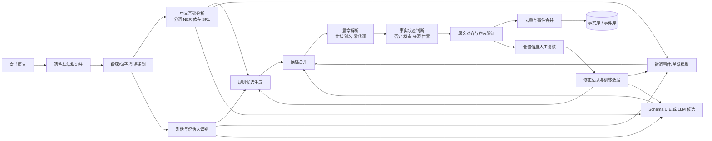

# 中文小说与网文“事实结构”自动抽取：可行方法、研究证据与工程方案

## 执行摘要

**结论是：这件事可做，但不应把目标简单定义成“找出包含主谓宾的句子”。** 小说中的有效事实经常跨句出现，人物可能被姓名、外号、身份词和零代词轮换指代；对话里的内容可能只是某个角色的说法；假设、梦境、回忆、隐喻和否定也不能直接写入同一个“事实库”。中文本身又允许大量主语、省略系词和零代词，单纯套用英文式主谓宾抽取会漏掉大量信息或弄错施事者。中文开放关系抽取研究和中文小说共指研究都明确观察到了这些问题。citeturn9view1turn8search0turn8search2

推荐将目标定义为一种**带证据、来源和事实状态的事件结构**：

\[
F=\langle predicate,\ arguments,\ qualifiers,\ polarity,\ modality,\ realis,\ source,\ world,\ evidence\rangle
\]

其中不仅保存“谁做了什么”，还保存时间、地点、否定、假设性、信息来源、所属叙事世界及原文证据。三元组可以从事件结构派生，但不建议反过来只保存三元组。

建议采用以下工程组合：

> **章节级切分与对话识别 → 中文基础分析 → 多路候选生成 → 人物共指与别名归并 → 事实性判定 → 规则校验与去重 → 低置信度人工复核。**

候选生成同时使用三条路径：

1. **依存句法和语义角色规则**，处理结构清楚的叙述句，保证可解释性和较高精度。
2. **微调的信息抽取模型或 UIE 模型**，补充规则覆盖不到的表达。
3. **大模型提示或小规模指令微调模型**，处理跨句、省略和复杂表达，但输出必须经过原文对齐、结构约束和规则验证。

这种混合方式比纯规则更有召回率，比纯大模型更稳定，也更适合持续维护。中文 CORE、LTP、PaddleNLP WordTag-IE、UIE、Doc2EDAG 和 OmniEvent 分别为规则抽取、基础语言分析、模式配置、统一结构生成、篇章事件抽取及事件工具链提供了可复用依据。citeturn9view1turn3search13turn11search1turn1search6turn1search0turn6search2

不建议把首版系统做成“整章扔给大模型，直接返回最终知识图谱”。指令模型在信息抽取上有明显潜力，但相关研究也发现，通用大模型在严格信息抽取任务中的表现可能明显落后于专用模型；生成式方法还会遇到标签生成错误、格式漂移和无法与原文精确对齐的问题。citeturn4search2turn9view2turn4search24

## 问题定义与任务边界

### “事实句子”的几种可选定义

“事实句子”不是自然语言处理领域中完全统一的术语。工程上至少有四种合理定义。

| 定义 | 形式 | 适用场景 | 主要缺陷 |
|---|---|---|---|
| 句子分类 | `sentence → factual / non-factual` | 过滤叙述、建立候选句池 | 一个句子可能同时包含事实、假设和角色观点 |
| 开放关系 | `(主体, 关系, 客体)` | 搜索、简单知识图谱、人物关系 | 难以表达多论元事件、时间、地点、来源 |
| 事件框架 | `事件类型/谓词 + 多个角色论元` | 情节理解、事件时间线、人物行为分析 | 标注和模型开发成本较高 |
| 篇章事实记录 | 事件框架 + 共指、来源、事实状态、证据 | 长篇小说知识库、情节追踪、问答 | 系统模块多，错误会跨模块传播 |

开放信息抽取通常把目标定义为从文本中抽取显式陈述的谓词—论元结构，例如主体、关系和客体；经典定义强调抽取文本中明确表达的关系，而不是任意推导隐含结论。citeturn7search0turn7search1 事件抽取则更关注事件触发词、事件类型以及施事者、受事者、时间、地点等论元。Doc2EDAG 进一步表明，篇章中的事件论元可能分散在多个句子里，甚至不存在一个稳定、明确的触发词。citeturn1search0

**本报告推荐采用“篇章事实记录”作为最终定义，以事件框架作为核心存储单位。**

建议的形式化结构如下：

```json
{
  "fact_id": "evt_ch12_0041",
  "predicate": {
    "text": "推开",
    "normalized": "打开",
    "event_type": "动作.开启"
  },
  "arguments": [
    {
      "role": "agent",
      "entity_id": "char_linwan",
      "mention": "林晚"
    },
    {
      "role": "patient",
      "entity_id": "obj_wooden_door",
      "mention": "木门"
    }
  ],
  "qualifiers": {
    "time": "当天夜里",
    "location": "旧宅",
    "manner": null
  },
  "polarity": "positive",
  "modality": "asserted",
  "realis": "actual",
  "source": "narrator",
  "world": "main_story_world",
  "confidence": 0.93,
  "evidence": [
    {
      "chapter_id": "ch12",
      "sentence_id": "s41",
      "text": "当天夜里，林晚推开了旧宅的木门。"
    }
  ]
}
```

这里的“事实”不是指现实世界中真实发生，而是：

> **文本直接支持、在某个指定叙事世界或某个指定信息源下成立的命题。**

因此需要区分：

- **叙述者断言**：“林晚已经离开京城。”
- **角色说法**：“赵四说林晚已经离开京城。”
- **角色想法**：“赵四以为林晚已经离开京城。”
- **假设条件**：“如果林晚离开京城……”
- **梦境事实**：“梦里，林晚回到了故乡。”
- **现实背景事实**：作品中引用的现实人物、地名或历史事件。

这几类内容都可以抽取，但不能使用完全相同的事实状态。推荐分别保存 `source`、`modality`、`realis` 和 `world`，而不是直接把它们合并成“林晚离开京城”。

### 目标粒度

建议同时输出三层结果：

| 层级 | 示例 | 用途 |
|---|---|---|
| 原子谓词层 | `推开(林晚, 门)` | 情节动作、检索 |
| 事件层 | `开启事件{施事=林晚, 对象=门, 时间=夜里}` | 时间线、因果链、人物行为 |
| 派生事实层 | `(林晚, 打开, 门)`、`(事件, 发生时间, 夜里)` | 知识图谱和问答 |

事件层是主结构，原子谓词和三元组是视图。这样既能支持“谁打开了门”这类查询，也能支持“夜里在旧宅发生了哪些事件”。

### 输入文本与语言约束

本需求未指定具体书目、吞吐量或部署环境，因此以下三项标记为**无特定约束**：

- 容错率：无特定约束。
- 实时性：无特定约束。
- 计算资源：无特定约束。

建议的默认工程假设是：**按章节离线处理，优先保证精度和可追溯性，不要求逐字实时返回。**

| 维度 | 本报告覆盖范围 | 对抽取系统的影响 |
|---|---|---|
| 文本长度 | 长篇小说、网文章节、连载文本 | 需要章节记忆和人物状态缓存 |
| 文本形态 | 叙述、对话、内心独白、书信、回忆 | 需要识别来源和叙事层级 |
| 中文特点 | 主语省略、零代词、流水句、连动句 | 不能只依赖显式主语 |
| 文学特点 | 修辞、比喻、拟人、反讽、意识流 | 需要事实性和字面性判断 |
| 叙事结构 | 插叙、倒叙、预叙、梦境、多世界 | 文本顺序不等于事件时间顺序 |
| 实体系统 | 名字、外号、身份词、尊称、错别字 | 需要实体聚类和别名表 |
| 目标内容 | 动作、状态、属性、关系、时间、地点 | 需要多种谓词和事件模式 |

中文网文还存在明显的体裁差异。GenWebNovel 由玄幻和历史两类中文网文章节构成，研究发现即使都属于文学文本，不同体裁的实体分布和嵌套模式仍有较大差异，通用领域或单一小说类型的实体模型难以直接覆盖所有网文。citeturn9view0turn10view0

长距离指代同样不能当作边缘问题。NovelCR 的中文部分包含大量跨多句的共指关系，论文报告中文数据中多数共指对跨越至少三个句子，现有基线与人工表现之间仍有较大差距。citeturn8search2

## 研究现状与方法比较

### 相关研究脉络

早期开放信息抽取主要依赖词性、短语和句法模式。ReVerb 使用动词关系短语的句法和词汇约束，试图减少不连贯或没有信息量的抽取结果。citeturn7search1 ClausIE、OLLIE、Stanford OpenIE 等系统进一步使用从句结构、依存关系、自然逻辑或多种抽取器组合；OpenIE 的研究史总体经历了规则、弱监督、序列标注和生成式模型几个阶段。citeturn7search4turn7search30

中文不能直接照搬英文规则。CORE 使用中文分词、词性标注、句法分析和抽取规则构建开放关系抽取系统。论文特别指出，中文缺乏英语式动词时态标记，且是高度依赖语篇、允许代词和系词省略的语言，关系判断往往需要更多上下文。citeturn9view1turn10view1

语义角色标注，也就是识别“谁对谁做了什么，以及何时、何地、用什么方式”，为事件结构提供了更自然的中间表示。Chinese PropBank 和 Chinese NomBank 建立了中文谓词—论元标注体系；LTP 则把分词、词性、命名实体、依存句法、语义依存和语义角色标注整合进中文工具链。citeturn3search8turn3search13turn10view3 使用语义角色进行开放信息抽取的研究发现，SRL 抽取质量可以优于只用浅层句法的系统，但速度更慢，因此较适合与快速规则抽取器组合。citeturn12search4

事件抽取研究由句子级触发词识别逐步走向篇章级事件记录。DuEE 提供了较大规模的中文现实场景事件数据，LEVEN 提供了大规模中文法律事件检测数据；这些数据证明了中文事件模式可以通过监督学习建模，但它们的新闻、金融或法律分布与网文仍有明显距离。citeturn1search5turn6search3 Doc2EDAG 面向中文金融篇章，专门处理论元跨句分散和同一文档多事件并存问题，其“无需固定触发词”的设计对小说状态事件和跨句事件尤其有启发。citeturn1search0turn1search8

文学文本有独立的研究难题。Literary Event Detection 将文学事件定义为小说想象世界中被描写为实际发生的事件，并指出复杂叙事、丰富的心理状态和比喻性语言都会让新闻领域事件模型失效。citeturn8search1turn6search33 中文小说研究还显示，角色解析不仅要处理代词，还要处理零代词、身份称呼和对话说话人；在“田福贤起初愣了半刻，随之便打断……”一类句子中，后半句主语没有显式出现。citeturn8search0

### 方法对比

| 方法 | 主要优点 | 主要缺点 | 实现复杂度 | 适用场景 |
|---|---|---|---|---|
| 正则、词典和表面模式 | 快、可解释、易控制误报 | 对改写、省略、跨句几乎无能为力 | 低 | 时间、数字、称谓、固定属性句 |
| 依存句法模板 / OpenIE | 能处理一般主谓宾、被动、介词结构 | 依赖分词与句法质量，文学长句误差大 | 中 | 清楚的动作句、属性句、简单关系 |
| SRL 加规则 | 直接获得谓词和施事、受事、时间、地点 | 对隐含论元、名词事件和复杂修辞覆盖有限 | 中 | 事件候选生成、动词型事实 |
| 触发词加论元模型 | 对固定事件类型可获得较稳定结果 | 需要事件模式和标注数据，跨类型扩展成本高 | 中高 | 战斗、死亡、移动、交易等核心情节 |
| OpenIE 神经模型 | 不要求预先枚举全部关系 | 输出关系词不统一，中文可用资源相对少 | 中高 | 发现未知关系、构建候选事实 |
| UIE / 统一结构生成 | 一个模型可表达实体、关系、事件等多类结构 | Schema 描述和训练数据质量影响很大，生成可能漂移 | 中高 | 快速试验、需求经常变化的系统 |
| 篇章事件抽取 | 能处理跨句论元和同篇多事件 | 实体聚类和组合搜索复杂，训练成本高 | 高 | 章节级事件记录、长文本 |
| 大模型提示 | 启动快，能理解复杂说明和少样本示例 | 幻觉、漏项、格式漂移、成本和版本稳定性问题 | 原型低，生产高 | 复杂候选补全、审核、弱标注 |
| 微调信息抽取模型 | 可获得稳定格式和较低推理成本 | 需要高质量领域数据，事件模式变更需再训练 | 高 | 稳定生产、大批量离线处理 |
| 混合 pipeline | 能兼顾精度、召回、解释性和扩展性 | 模块多，需要完整评估和错误追踪 | 高 | 中文小说生产系统 |

UIE 将实体、关系、事件和情感等任务统一为“文本到结构”的生成问题，并用 Schema 指示目标结构；PaddleNLP 还提供了可配置的信息抽取接口。citeturn1search6turn9view2turn11search2 InstructUIE 等工作进一步使用自然语言指令统一多个信息抽取数据集，显示指令微调可以改善零样本和多任务迁移，但研究同时指出，未经专门适配的通用大模型并不天然擅长严格的信息抽取。citeturn4search2

### 可复用的工程项目

| 项目 | 机构或团队 | 可复用内容 | 对中文小说的适配判断 |
|---|---|---|---|
| LTP / N-LTP | 哈尔滨工业大学 | 分词、词性、NER、依存、SRL、语义依存 | 适合作为规则系统的基础分析器 |
| PaddleNLP UIE | 百度 / 飞桨 | Schema 驱动实体、关系和事件抽取 | 适合原型和候选生成，需要小说数据校准 |
| WordTag-IE | 百度 / 飞桨 | 词类知识、词表和可配置规则抽取 | 适合高精度简单句和弱标注 |
| OmniEvent | 清华大学相关团队 | 事件检测、论元和事件关系的统一工具链 | 适合做监督模型实验框架 |
| OpenNRE | 清华大学 | 关系抽取训练与评估框架 | 适合已知人物关系类别 |
| DeepKE | 浙江大学相关团队 | NER、关系、属性、篇章和低资源场景 | 适合知识抽取平台化建设 |
| Doc2EDAG | 论文作者开源 | 中文篇章事件抽取 | 可借鉴跨句论元组合思路 |
| BookNLP | 加州大学伯克利团队 | 长篇书籍的实体、共指、说话人和事件分析 | 工程理念很有价值，但官方模型主要面向英文 |

LTP 是当前最直接可用于中文规则抽取的开源基础设施之一。citeturn0search5turn3search13 WordTag-IE 明确定位为基于词类知识和规则、可配置并覆盖简单句式的抽取工具，其输出还可以反过来作为模型训练样本。citeturn11search1 OmniEvent 支持事件检测、事件论元和事件关系，并统一处理多个中英文事件数据集。citeturn6search2turn6search6 OpenNRE 和 DeepKE 分别提供关系抽取及更广义知识抽取的训练框架。citeturn6search1turn6search4

BookNLP 可以在书籍尺度上处理词性、依存、实体、人物名称聚类、共指、引语说话人和事件，但其官方项目明确以英文长文档为主要对象，不能直接当作中文模型使用。citeturn2search3 FanfictionNLP 的经验也说明，对话说话人识别和共指消解最好互相提供信息，而不是完全独立串行处理。citeturn2search16

阿里开源的 SeqGPT 支持中英文，并将多种自然语言理解任务转化为分类和抽取组合，可作为指令抽取方向的候选底座，但它不是专门面向中文小说事件或人物共指设计的系统。citeturn5search1 本次检索没有发现字节或腾讯已经公开、同时满足“中文小说、事实事件结构、可复现实验”三项条件的专用工程，因此不建议为了覆盖公司名单而把无关的通用项目硬套进方案。

## 规则化抽取方案

### 基础处理

规则系统不应直接在原始字符串上工作。建议依次完成：

1. 保留章节、段落、句子、引号和字符偏移。
2. 识别直接引语、引号嵌套和引语外的说话动作。
3. 进行分词、词性、命名实体、依存和语义角色标注。
4. 建立当前场景中的人物、地点、时间和说话人缓存。
5. 在标注结果上执行依存、SRL、触发词和属性模板。
6. 对候选结构做共指补全、事实状态判断及类型校验。

LTP 已提供这类中文词法、句法和语义分析组件，适合作为第一版分析层。citeturn9view3turn10view3

### 依存句法模板

以下标签采用常见中文依存表示；实际使用时，应映射到所选解析器的标签。

| 模式 | 示例 | 归一化结果 |
|---|---|---|
| `SBV(谓词, 主体) + VOB(谓词, 客体)` | 林晚推开木门 | `推开(agent=林晚, patient=木门)` |
| 把字句 | 林晚把木门推开了 | 同上 |
| 被字句 | 木门被林晚推开了 | 同上，交换表层主客体 |
| 系词属性 | 林晚是沈家的长女 | `身份(林晚, 沈家长女)` |
| 无系词属性 | 林晚脸色苍白 | `属性(林晚, 脸色=苍白)` |
| 连动结构 | 林晚起身走进院子 | `起身(林晚)`、`进入(林晚, 院子)` |
| 并列谓词 | 他拔剑、转身、冲出房门 | 拆为三个事件，共享主语 |
| 介词论元 | 他在院中用剑击伤赵四 | `地点=院中`、`工具=剑` |
| 结果补语 | 他将赵四打倒在地 | `攻击`与`倒地`两个相关事件 |
| 存现句 | 屋里站着三个人 | `存在(三个人, 屋里)` |

伪规则示例：

```text
规则 SVO
条件：
  verb.pos ∈ VERB
  存在 subject --SBV--> verb
  存在 object  --VOB--> verb
动作：
  生成 Event(
    predicate = normalize(verb),
    agent = expand_np(subject),
    patient = expand_np(object)
  )
```

```text
规则 被动句
条件：
  出现“被/让/给”
  patient 是表层主语
  agent 是介词结构宾语或近邻人物
  verb 是核心动作
动作：
  生成 Event(
    predicate = normalize(verb),
    agent = agent,
    patient = patient,
    voice = passive
  )
```

```text
规则 连动共享主语
条件：
  v1 与 v2 构成 COO、连动或同一从句谓词
  v2 没有显式主语
  v1 有高置信度主语 s
  v1、v2 之间不存在场景或说话人切换
动作：
  将 s 作为 v2 的候选主语
  confidence *= 0.85
```

CORE 和 ReVerb 的经验说明，动词中心的句法与词汇约束能够高效获得关系候选，但中文省略和语篇依赖意味着，抽取规则必须加上上下文补全，而不能只看句内表面词序。citeturn7search1turn9view1

### 语义角色加规则

SRL 可以把每个谓词转成类似下面的结构：

```text
谓词：送
A0 / 施事：林晚
A1 / 主题：密信
A2 / 接收者：赵四
TMP / 时间：当天夜里
LOC / 地点：城南客栈
```

推荐的角色映射：

| SRL 角色 | 事实结构角色 | 说明 |
|---|---|---|
| A0 | agent / experiencer | 通常是动作发起者或状态体验者 |
| A1 | patient / theme | 被影响对象或内容 |
| A2–A4 | recipient、source、goal 等 | 需要结合谓词词典解释 |
| TMP | time | 时间 |
| LOC | location | 地点 |
| MNR | manner | 方式 |
| CAU | cause | 原因 |
| NEG | polarity | 否定 |

SRL 的优势是可以自然产生多论元事件，而不是强行压成主谓宾；缺点是 A0、A1 的具体含义随谓词而变，例如“害怕”中的 A0 是体验者，并不是主动施事者。Chinese PropBank 的角色体系及中文 SRL 研究为这种映射提供了基础，但领域谓词仍需额外词典。citeturn3search8turn3search20

### 触发词与事件模式库

建议建立一个可版本化的事件模式库：

```yaml
event_type: movement.enter
triggers:
  - 进入
  - 走进
  - 踏入
  - 闯入
  - 来到
roles:
  agent:
    entity_types: [PERSON, ANIMAL, ORGANIZATION]
    required: true
  destination:
    entity_types: [LOCATION, BUILDING, AREA]
    required: true
  source:
    entity_types: [LOCATION]
    required: false
  time:
    entity_types: [TIME]
    required: false
negative_cues:
  - 没有进入
  - 未能进入
metaphor_risks:
  - 进入状态
  - 走进内心
```

模式库不宜一开始覆盖几百种事件。更可行的初始集合是：

- 移动：进入、离开、到达、逃离。
- 交互：见面、对话、告知、请求、承诺。
- 冲突：攻击、受伤、死亡、俘获。
- 物品：获得、失去、交付、使用、损坏。
- 身份关系：属于、任职、亲属、师徒、婚姻。
- 心理状态：知道、相信、怀疑、害怕、决定。
- 状态变化：醒来、昏迷、晋级、变身、恢复。

事件类型应与产品用途绑定。如果目标只是生成章节摘要，五十个左右的粗粒度类型可能已经够用；如果目标是游戏化世界模型或人物战力系统，则需细化技能、境界、装备、阵营和状态变化。

### 否定、模态与来源规则

以下词语不能只当作普通修饰词处理：

| 类型 | 常见线索 | 建议状态 |
|---|---|---|
| 否定 | 不、没、未、并非、从未 | `polarity=negative` |
| 可能 | 也许、似乎、恐怕、可能 | `modality=uncertain` |
| 条件 | 如果、若、倘若、除非 | `realis=hypothetical` |
| 意图 | 想、准备、打算、决定要 | 区分“意图事件”和“预期动作” |
| 命令 | 去杀了他、给我停下 | `speech_act=command`，不代表动作已发生 |
| 问句 | 他已经走了吗 | `speech_act=question` |
| 传闻 | 据说、听闻、传言 | `source=hearsay` |
| 认知 | 认为、以为、猜测 | 生成认知事件和嵌入命题 |
| 回忆 | 想起、回忆起、当年 | 切换时间锚点 |
| 梦境 | 梦见、幻境中、醒来才发现 | 切换叙事世界 |

例如：

> “赵四以为林晚已经死了。”

应生成：

```text
认知事件：
  experiencer = 赵四
  content = proposition_001
  realis = actual

嵌入命题 proposition_001：
  predicate = 死亡
  patient = 林晚
  source = 赵四
  modality = believed
  narrator_asserted = false
```

不能直接输出一个无条件的“林晚已死亡”。

### 共指和零代词补全

推荐用“模型候选 + 精确规则”组合：

- 姓名完全一致和别名词典直接合并。
- “张宗主”“宗主”“他”结合当前场景候选排序。
- 引语中的“我”“你”分别链接说话人和听话人。
- 连续动作句中省略的主语优先继承上一谓词的施事者。
- 场景切换、段落切换或新人物进入时降低继承概率。
- 性别、称谓、阵营和人物是否在场作为约束，但不能设为绝对规则。
- 同名人物不能仅靠名字合并，需要章节、关系和上下文特征。

中文小说角色解析研究表明，说话人识别可以帮助处理引语中的一二人称，而零代词是小说角色信息聚合中的核心困难。citeturn8search0 长篇共指数据又表明，局部两三句窗口不能覆盖所有情况，因此系统需要章节级实体缓存，至少保留当前场景和近期出现人物。citeturn8search2

### 常识和类型约束

常识约束应作为**降权或复核信号**，不要轻易作为硬删除条件。玄幻和科幻小说会系统性地违反现实常识。

可采用的约束包括：

```text
进入：
  agent 通常可移动
  destination 通常是地点或空间

说话：
  speaker 通常是人物、拟人实体或智能系统

死亡：
  patient 通常是生命体
  同一世界线中死亡后再行动，需要复活、回忆或身份误判解释

获得：
  recipient 通常是人物或组织
  object 通常是物品、能力、身份或信息
```

小说系统更适合维护两层类型：

- `surface_type`：文本表面类型，例如“剑”“妖兽”“系统”。
- `functional_type`：事件约束所需的功能类型，例如“可持有物”“生命体”“可说话主体”。

### 完整伪代码

```python
def extract_chapter(chapter):
    segments = split_chapter_preserving_quotes(chapter)

    annotations = nlp_pipeline(
        segments,
        tasks=["ner", "dependency", "srl"]
    )

    quote_frames = identify_quotes_and_speakers(
        segments,
        annotations
    )

    entity_memory = update_entity_memory(
        annotations,
        quote_frames
    )

    candidates = []

    for sentence in annotations.sentences:
        candidates.extend(apply_dependency_rules(sentence))
        candidates.extend(apply_srl_rules(sentence))
        candidates.extend(apply_trigger_patterns(sentence))
        candidates.extend(apply_attribute_patterns(sentence))

    for candidate in candidates:
        candidate.arguments = resolve_mentions(
            candidate.arguments,
            entity_memory,
            quote_frames
        )

        candidate.qualifiers = normalize_time_and_location(
            candidate,
            chapter.context
        )

        candidate.status = classify_factuality(
            candidate,
            quote_frames,
            cues=[
                "negation",
                "hypothesis",
                "belief",
                "intention",
                "dream",
                "question"
            ]
        )

        candidate = validate_type_constraints(candidate)
        candidate = align_all_fields_to_evidence(candidate)

    candidates = merge_duplicate_events(candidates)
    candidates = link_temporal_and_causal_relations(candidates)

    return route_by_confidence(candidates)
```

规则系统的覆盖率会很依赖小说风格。PaddleNLP 的 WordTag-IE 自身也把定位限定在灵活配置、精准覆盖简单句式，并允许用户补充领域词表和规则。citeturn11search1 因此规则更适合充当高精度骨架和验证器，而不是独自承担全部召回。

## 混合工程架构与模块接口

### 推荐架构



架构中最重要的设计不是模型大小，而是：

1. 每个字段必须能回到原文字符区间。
2. 候选生成和事实验证分开。
3. 角色说法与叙述者断言分开。
4. 句内抽取和篇章共指分开评估。
5. 人工修改必须能回流成标注数据和回归测试。

### 模块接口

| 模块 | 输入 | 输出 | 关键要求 |
|---|---|---|---|
| 文本切分 | 章节原文 | `Segment[]` | 保留字符偏移、引号和段落层级 |
| 基础分析 | `Segment[]` | `Token/Entity/Dependency/SRL` | 不修改原文坐标 |
| 对话识别 | 段落、实体、依存 | `QuoteFrame[]` | 标记说话人、听话人和引语范围 |
| 候选生成 | 基础标注、Schema | `FactCandidate[]` | 允许重复和不完整候选 |
| 共指解析 | 候选、实体历史 | `EntityCluster[]` | 输出置信度和替代候选 |
| 事实性判定 | 候选、引语和上下文 | `FactStatus` | 判定否定、假设、信念、梦境等 |
| 验证器 | 候选、原文、类型库 | `ValidatedFact` | 所有实体和谓词必须可对齐原文 |
| 事件合并 | 多句候选 | `EventRecord[]` | 避免把同一事件重复写入 |
| 人工复核 | 低置信度事件 | 修正事件 | 保存改前、改后和修正原因 |

候选对象建议宽松，最终对象建议严格：

```typescript
interface FactCandidate {
  evidenceSpans: TextSpan[];
  predicate?: Predicate;
  arguments: Argument[];
  qualifiers: Qualifiers;
  status?: Partial<FactStatus>;
  generatedBy: "rule" | "srl" | "finetuned_model" | "llm";
  confidence: number;
}

interface ValidatedFact {
  factId: string;
  evidenceSpans: TextSpan[];
  predicate: Predicate;
  arguments: Argument[];
  status: FactStatus;
  confidence: number;
  validationFlags: string[];
  version: string;
}
```

### 混合策略比较

| 组合 | 精度趋势 | 召回趋势 | 开发成本 | 可维护性 | 推荐阶段 |
|---|---:|---:|---:|---:|---|
| LTP + 规则 | 高 | 低至中 | 低 | 高 | 最小可用版本 |
| LTP + 规则 + UIE | 中高 | 中高 | 中 | 中高 | 快速扩大覆盖 |
| 微调事件模型 + 规则验证 | 高 | 高 | 高 | 中 | 稳定生产 |
| 微调模型 + 篇章共指 + UIE 补全 | 高 | 高 | 很高 | 中 | 中长期 |
| 纯大模型提示 | 波动大 | 中高 | 原型低 | 低 | 探索、弱标注 |
| 大模型候选 + 小模型/规则验证 | 中高至高 | 高 | 中高 | 中高 | 推荐的混合方案 |
| 多模型集成 + 人工复核 | 最高潜力 | 高 | 很高 | 中 | 高价值内容 |

**微调模型**适合输出结构固定、事件类型相对稳定的场景。触发词、论元和事实状态可以分别建模，也可以用统一生成结构。OmniEvent 提供了不同事件建模范式和统一评估方式，适合快速比较分类、序列标注、问答式和生成式事件模型。citeturn6search2turn6search9

**提示工程**适合验证 Schema 和处理少量复杂案例。提示中应明确：

- 只抽取原文直接支持的内容。
- 每个字段必须返回原文片段和字符位置。
- 区分叙述者、角色说法和角色认知。
- 不补充文本没有写出的姓名、时间或因果。
- 输出必须符合固定 JSON Schema。
- 无法确定时返回 `null` 或多个候选，不允许猜测。

**多阶段 harness** 可以理解成一套可观察、可重放的处理链。推荐拆为：

```text
阶段 A：宽松召回候选
阶段 B：论元补全
阶段 C：事实状态分类
阶段 D：原文证据校验
阶段 E：类型与时间一致性校验
阶段 F：事件合并
阶段 G：置信度路由
```

生成式 IE 研究显示，统一生成能够跨任务共享能力，但错误标签或结构噪声会明显伤害精度。citeturn9view2 结构化输出研究也显示，使用约束解码或专门的结构修正模型，可以大幅提高 Schema 合法率；这说明生产系统不能只依赖“提示中要求返回 JSON”。citeturn4search24

### 示例结果

| 输入句子 | 建议抽取结果 |
|---|---|
| 林晚推开房门，快步走进院子。 | `推开(agent=林晚, patient=房门)`；`进入(agent=林晚, destination=院子, manner=快步)` |
| 房门被林晚推开了。 | `推开(agent=林晚, patient=房门, voice=passive)` |
| 他并没有答应赵四的请求。 | `答应(agent=他→待共指, content=赵四的请求, polarity=negative)` |
| 若他明日不来，我便离开京城。 | `到来(agent=他, time=明日, hypothetical=true)`；`离开(agent=我→说话人, source=character, conditional=true)` |
| “林晚已经死了。”赵四低声说道。 | 事实一：`说话(speaker=赵四, content=命题P)`；命题P：`死亡(patient=林晚, source=赵四, narrator_asserted=false)` |
| 赵四以为林晚已经死了。 | `认为(experiencer=赵四, content=P)`；P 为被相信命题，不是叙述者确认事实 |
| 梦里，他又回到了青石镇。 | `返回(agent=他, destination=青石镇, world=dream)` |
| 剑光如毒蛇般咬向他的咽喉。 | 候选：`攻击(agent=剑光/持剑者待补全, target=他, body_part=咽喉, figurative=true)` |
| 醒来时，屋里只剩她一个人。 | `醒来(agent=上下文人物, time=相对时间)`；`存在(entity=她, location=屋里, exclusivity=only)` |
| 三年前，他还是玄天宗的外门弟子。 | `身份(entity=他, role=玄天宗外门弟子, time=三年前)` |

## 评估设计与实施路线图

### 标注集构建

不建议直接从通用新闻事件数据集推断小说效果。文学事件研究已经显示，新闻与文学在事件定义、心理状态和修辞表达上存在显著差异；中文网文数据又表现出明显的类型差异。citeturn8search1turn9view0

推荐采用分层抽样：

| 分层维度 | 建议覆盖 |
|---|---|
| 小说类型 | 玄幻、都市、历史、言情、悬疑等 |
| 文本类型 | 叙述、对话、内心独白、说明性设定 |
| 句法难度 | 简单句、连动句、长句、主语省略 |
| 事实状态 | 肯定、否定、假设、传闻、信念、命令 |
| 时间结构 | 当前、回忆、倒叙、预期、梦境 |
| 事件密度 | 低事件描写、高事件战斗或对话 |
| 实体难度 | 同名、别名、身份称呼、零代词 |
| 修辞 | 比喻、拟人、夸张、反讽 |

数据集必须按**小说或章节来源划分训练、验证和测试集**，不要把同一部小说的相邻句子随机分到不同集合。否则模型可以记住人物名、世界观词汇和作者表达方式，测试分数会虚高。

推荐两层标注：

**基础层**

- 实体和实体类型。
- 谓词或事件触发片段。
- 论元及角色。
- 时间、地点、数量。
- 原文证据范围。

**篇章层**

- 共指实体 ID。
- 引语说话人。
- 否定、模态和现实性。
- 信息来源。
- 叙事世界。
- 相对时间和事件关系。

试点阶段建议对全部样本做双人标注和仲裁；规范稳定后，可以保留约 20%–30% 双标样本监控一致性。这里的比例是工程规划建议，不是固定学术标准。

### 评价指标

不能只报告一个总 F1。

| 指标 | 衡量内容 |
|---|---|
| 句子级 Precision / Recall / F1 | 是否找到了包含目标事实的句子 |
| 谓词或触发词 F1 | 事件中心词是否正确 |
| 论元识别 F1 | 论元范围是否正确 |
| 角色分类 F1 | 施事、受事、地点等角色是否正确 |
| 事件记录 F1 | 整个事件结构是否匹配 |
| 完整事件准确率 | 所有必填论元是否同时正确 |
| 极性 F1 | 肯定和否定是否区分 |
| 模态 / realis F1 | 实际、假设、意图、信念是否区分 |
| 来源准确率 | 叙述者、说话人、传闻来源是否正确 |
| 共指指标 | 人物提及是否聚为正确实体 |
| 证据对齐率 | 所有输出字段能否定位到原文 |
| 一致性错误率 | 同一人物、时间线和事件是否自相矛盾 |
| 校准误差 | 置信度是否与实际正确率匹配 |

OpenIE 评估通常需要考虑软匹配，因为系统抽出的论元边界可能与金标略有不同；相关基准专门引入了软匹配评价。citeturn7search0 事件抽取还存在触发词边界、重复事件和事件类型映射等评价陷阱，OmniEvent 的设计目标之一就是统一处理这些差异，保证模型比较更公平。citeturn6search2

建议同时报告两种事件匹配：

```text
严格匹配：
  谓词、实体 ID、角色和证据范围全部一致

宽松匹配：
  谓词归一化相同
  核心实体相同
  证据范围有重叠
  非核心修饰允许缺失
```

### 自动化测试

测试集除了正常金标样本，还应包含**变形测试**：

| 测试类型 | 示例 |
|---|---|
| 主被动等价 | “林晚推开门”与“门被林晚推开”应归一到同一事件 |
| 别名等价 | “林晚”“林姑娘”“大小姐”在明确上下文中应链接同一人物 |
| 否定翻转 | 加入“没有”后，极性必须改变 |
| 条件翻转 | 加入“如果”后，实际事件不能直接写入主事实库 |
| 对话来源 | 同一句放进引号后，应从叙述者事实变为角色陈述 |
| 顺序扰动 | 非因果并列句调换顺序，不应产生额外因果关系 |
| 场景切换 | 新章节或“与此同时”后，不应盲目继承上一段主语 |
| 插入干扰人物 | 加入另一个同性人物后，共指置信度应下降 |
| 格式鲁棒性 | 引号、空格、繁简体和特殊符号变化不应破坏偏移 |

每次更新规则、模型、Schema 或词表，都运行：

- 固定金标回归集。
- 高风险案例集。
- 体裁分组指标。
- 新旧版本差异报告。
- 随机人工抽检。
- 失败案例自动归类。

### 人工修正流程

推荐让人工看到：

```text
原文上下文
模型抽取结构
各字段对应的原文高亮
共指链
模型置信度
命中的规则或模型版本
可能的替代候选
```

修正操作应保存为结构化差异：

```json
{
  "operation": "change_argument",
  "fact_id": "evt_41",
  "field": "agent",
  "before": "char_zhaosi",
  "after": "char_linwan",
  "reason": "zero_pronoun_resolution",
  "annotator": "A17"
}
```

这样可以判断系统问题究竟来自分词、实体、共指、候选生成还是事实性判定，而不是只得到一个“结果错了”。

### 实施路线图

以下人力、数据和算力均为**规划范围估算**，会随事件类型数量、小说体裁和精度要求变化。

| 阶段 | 时间范围 | 主要产物 | 人力估算 | 数据估算 | 算力估算 |
|---|---:|---|---|---|---|
| 短期 | 4–8 周 | 规则候选、LTP 分析、基础事件 JSON、评估集 | 1–2 名 NLP/算法、1 名后端、1–2 名兼职标注 | 2,000–5,000 段，约 3,000–10,000 个事件 | CPU 可运行；1 张 16–24 GB GPU 用于 UIE 实验 |
| 中期 | 2–4 个月 | 小说领域微调、共指、事实状态分类、人工复核台 | 2–3 名算法、1–2 名工程、2–5 名标注 | 10,000–30,000 个高质量事件记录 | 1–4 张 24–80 GB GPU，视底座大小而定 |
| 长期 | 6–12 个月 | 章节知识库、时间线、多世界模型、主动学习 | 3–6 名算法/工程、稳定标注团队 | 50,000–200,000 个事件及共指链 | 训练按需扩展，推理优先使用小模型和批处理 |

短期里程碑建议设为：

- 能稳定切分章节、段落、句子和引语。
- 支持人物、地点、时间和常见物品实体。
- 支持约 20–40 类高价值事件。
- 所有输出均有原文证据。
- 能区分肯定、否定、条件和角色陈述。
- 有不少于 500 个困难案例的固定回归集。

中期重点不是无限增加事件类型，而是解决：

- 人物别名和零代词。
- 对话说话人。
- 跨句事件论元。
- 同一事件的重复提及合并。
- 模型置信度校准。
- 小说类型迁移。

长期可以在事件库上增加：

- 时间关系：之前、之后、同时。
- 因果关系：导致、阻止、促使。
- 子事件关系：战斗包含攻击、受伤、逃离。
- 角色状态：位置、阵营、身份、装备、存活状态。
- 世界和时间线分支。
- 主动学习：优先标注模型最不确定或模型间分歧最大的样本。

事件因果关系对故事理解确实有明显价值，近期研究显示，加入事件因果识别能够改善下游故事理解和质量评价任务。citeturn2search18 不过因果关系比单事件抽取更难，应放在基础事件和共指稳定之后。

建议设定产品验收门槛，而不是只追求论文式总分。例如：

- 自动写入事实库的事件：核心论元精确率目标不低于 90%。
- 低于阈值的结果：进入候选库，不直接作为确定事实。
- 所有确定事实：证据对齐率接近 100%。
- 否定、假设和角色观点：单独设高风险指标。
- 每个主要体裁独立报告，不允许只看混合平均值。

这些数值是建议的产品门槛，不代表现有论文在中文小说上的公开结果。

## 风险、证据边界与最终建议

### 主要风险与缓解方式

| 风险 | 典型问题 | 缓解方式 |
|---|---|---|
| 主语省略 | 连续动作找错人物 | 场景缓存、SRL、零代词模型、候选保留 |
| 人物代称 | “宗主”“老人”“他”混淆 | 实体聚类、别名表、对话角色和在场人物约束 |
| 引语事实 | 把角色谎言当作叙述事实 | 保存说话人和 `source`，分离说话事件与嵌入命题 |
| 心理状态 | “他以为她死了”误判死亡 | 识别认知谓词和命题嵌套 |
| 隐喻拟人 | “剑光咬向咽喉”字面角色错误 | 修辞风险分类、功能类型、人工复核 |
| 否定和假设 | “没有离开”“若他离开”被写成事实 | 极性和 realis 独立分类 |
| 非线性时间 | 回忆内容写入当前时间线 | 相对时间锚点、叙事层级和事件时间分离 |
| 梦境幻境 | 梦中事件污染主世界 | `world_id` 和世界切换事件 |
| 多次提及 | 同一战斗事件重复建档 | 事件共指和证据聚合 |
| 玄幻常识 | 现实类型规则误杀合法事实 | 常识只降权，维护作品内类型系统 |
| 模型幻觉 | 补出原文没有的姓名、因果或地点 | 强制证据偏移、Schema 约束、字段级验证 |
| 体裁迁移 | 都市模型在玄幻小说上失效 | 分体裁评估、检索相似示例、持续标注 |

文学事件研究明确指出，比喻、心理状态和复杂叙事是小说事件检测区别于新闻抽取的重要难点。citeturn8search1 中文网文实体研究显示，体裁差异和嵌套实体会进一步放大领域迁移问题。citeturn9view0 中文小说共指研究和 NovelCR 则说明，零代词、说话人和长距离指代必须成为主流程模块，而不是后续优化项。citeturn8search0turn8search2

### 证据边界

现有公开研究可以很好地证明以下几点：

- 中文规则、句法和 SRL 抽取是可行的。
- 中文事件抽取已有较成熟的数据集和开源框架。
- 篇章事件需要处理跨句论元和多事件组合。
- 小说实体、共指和事件检测与新闻领域存在明显分布差异。
- 统一信息抽取和指令模型适合快速扩展 Schema。
- 规则、专用模型和生成模型各自存在明显盲区。

但目前缺少一个被广泛采用、同时覆盖以下内容的公开中文基准：

> 完整长篇网文、开放事件类型、人物共指、引语来源、事实状态、时间线和叙事世界。

因此，不能负责任地给出“在中文网文上能达到某个固定 F1”的结论。实际性能会高度依赖“事实”的定义、小说类型、是否要求跨句、是否区分角色观点，以及事件类型的数量。

### 最终推荐方案

✅ **推荐将系统定位为“带来源和证据的小说事件抽取”，而不是普通主谓宾抽取。**

第一版可直接采用：

```text
LTP
  负责分词、实体、依存和 SRL

自定义规则层
  负责 SVO、把被句、连动、属性、否定、条件和对话模式

PaddleNLP UIE 或小型指令模型
  负责补充复杂候选和不完整论元

章节级实体缓存
  负责名字、别名、身份词和局部零代词

事实性分类器
  负责叙述者断言、角色说法、信念、意图、假设和梦境

确定性验证器
  负责原文对齐、字段类型、去重和置信度路由
```

中期再使用内部修正数据微调事件抽取、共指和事实状态模型。长期才扩展到事件共指、因果链、时间线、多世界知识库和持续学习。

🔥 最重要的工程原则是：

> **模型可以提出候选，但不能凭空创造事实；最终写入的每一个字段，都必须能定位到原文证据，或明确标记为跨句推断及其依据。**

纯规则的问题是召回率不足，纯微调模型的问题是领域和 Schema 变化成本，纯大模型的问题是稳定性和可验证性。混合 pipeline 的开发成本更高，但它是目前最符合中文小说特点、也最适合长期维护的路线。现有中文开放抽取、SRL、UIE、篇章事件、文学事件和长篇共指研究共同支持这一判断。citeturn9view1turn3search8turn1search6turn1search0turn8search1turn8search2