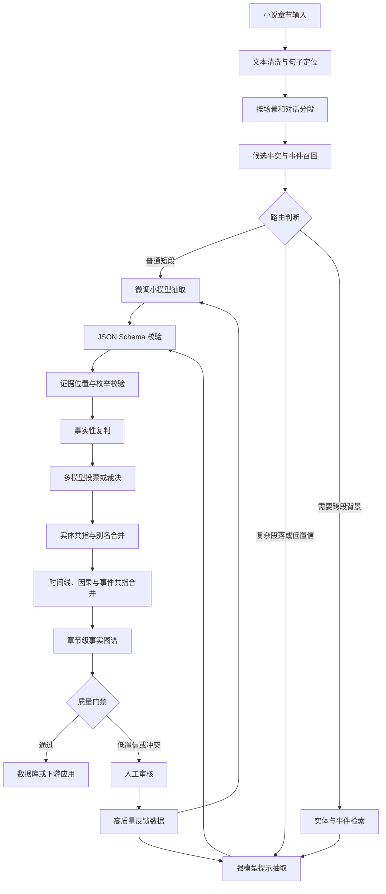

# 小说“事实句子”与叙事结构自动抽取的工程方案研究

## 执行摘要

✅ **核心结论：不要一开始就把任务定义成“从整章中找出所有事实句子”，也不要直接押注微调。** 更稳妥的做法是把它拆成三个层次：

1. 判断文本中的命题属于“已经发生的故事世界事实”“角色声称或相信的事实”“计划、假设、否定、回忆、梦境”等哪种状态；
2. 将一个句子拆成一个或多个原子事件，并抽取人物、时间、地点、动作、对象、因果和证据片段；
3. 在章节级别合并同一实体、同一事件和时间线，解决代词、别名、跨段因果等问题。

文学研究中的“realis event”通常指在虚构世界中被描写为真实存在、发生于某个时间和地点的事件；未来事件、假设、愿望、角色误解和叙述者评论不应简单地和这种事实混为一类。文学事件数据集也表明，小说事件识别本身就需要专门的标注规范，而不是照搬新闻或百科文本的信息抽取方法。citeturn5search1turn5search6

推荐的生产方案是 **“多阶段提示工程 harness + 小模型微调 + 章节级合并器”混合架构**：

- 用强模型处理困难的语义判断、生成初始标注和充当校验器；
- 用句级或短段级的 7B–14B 开放权重模型承担高频抽取；
- 用确定性代码校验 JSON、文本位置和枚举值；
- 用章节级模型或图合并器处理实体共指、时间、因果和事件去重；
- 对低置信、模型分歧和关键事实交给人工复核。

仅靠 JSON Schema 或结构化输出，可以解决“字段缺失、JSON 无法解析”等格式问题，但不会自动解决“语义是否正确”。OpenAI 和 Google 的结构化输出都强调输出遵循指定模式；这应被理解为**格式保证，而不是事实正确率保证**。citeturn0search0turn0search2

截至 **2026 年 8 月 1 日**，供应商托管微调的可用性并不稳定：OpenAI 官方文档表示其现有微调平台正在逐步关闭、已不再向新用户开放；Anthropic 文档表示 Claude API 当前不公开提供常规微调；Mistral 的部分托管微调文档已标记为 deprecated。因此，路线 A 最好理解为 **Llama、Mistral 等开放权重模型上的 LoRA/QLoRA 微调**，而不是把系统绑定在某个闭源厂商的微调接口上。citeturn2search0turn9search1turn9search2

在尚无真实业务数据的情况下，较合理的初期预算是：

| 阶段 | 精品人工数据 | 弱监督或合成数据 | 目标 |
|---|---:|---:|---|
| 可行性验证 | 300–800 个短段，约 2,000–8,000 个句子 | 5,000–20,000 条 | 验证定义、提示词和主要错误类型 |
| 可用版本 | 2,000–6,000 个短段，约 15,000–50,000 个句子 | 20,000–100,000 条 | 达到稳定的句级抽取与结构化输出 |
| 可部署版本 | 5,000–15,000 个短段，外加 200–500 个完整章节 | 100,000–500,000 条 | 覆盖跨段共指、时间线、因果和长尾现象 |
| 高要求生产版 | 15,000–50,000 个精审短段，1,000 章以上章节级验证样本 | 300,000–2,000,000 条 | 多体裁、多作者、低幻觉、持续迭代 |

以上属于**工程估计范围，不是行业统一标准**。官方微调文档提到，50–100 个高质量示例可能产生可观察改善，但这远低于复杂信息抽取达到稳定生产质量通常需要的规模。citeturn9search4turn2search3

## 任务定义与输出结构

“事实句子”至少有三种合理定义，项目启动前必须选定，否则标注者和模型会持续产生系统性分歧。

| 定义方案 | 纳入内容 | 优点 | 缺点 | 建议用途 |
|---|---|---|---|---|
| 严格故事事实 | 叙述者直接确认、已经发生或持续成立的故事世界事实 | 精确、容易转成知识图谱 | 会漏掉角色视角、传闻和后续被推翻的信息 | 人物档案、时间线、剧情数据库 |
| 带来源的命题 | 所有可抽取命题，同时记录“谁说的、谁相信、是否确定” | 信息完整，可保留不可靠叙述和角色认知 | Schema 和标注复杂，合并难度高 | 深度剧情理解、问答、推理 |
| 句子二分类 | 每句只标事实或非事实 | 实现快，适合初期模型 | 一个句子常同时包含事实、否定、愿望和多个事件，信息损失严重 | 只适合作为第一层筛选器 |

推荐采用第二种定义，在输出端再提供一个 `is_exportable_fact` 字段，将高可信故事事实筛选出来。这样既不会丢掉角色声称，也不会把角色的谎言直接写入最终知识库。

文学事件研究一般会区分实际事件、未来事件、假设事件和叙事层之外的概述。事件事实性数据集则进一步标注事件是否被支持、是否否定以及证据来自哪里。citeturn5search1turn5search6turn5search18

**建议的命题状态枚举：**

| 字段值 | 含义 | 示例 |
|---|---|---|
| `ASSERTED_REALIS` | 在故事世界中被确认发生或成立 | “他在三年前离开了村庄。” |
| `NEGATED` | 明确未发生或不成立 | “他没有打开那封信。” |
| `PLANNED_FUTURE` | 计划、承诺或预测的未来事件 | “明天我会去上海。” |
| `HYPOTHETICAL` | 假设、条件或反事实 | “如果他早到一步……” |
| `BELIEF` | 某角色相信，但文本没有确认 | “林岚认为钥匙在周伯手里。” |
| `REPORTED` | 传闻、转述、书信或二手消息 | “村里人说他已经死了。” |
| `QUESTIONED` | 疑问或不确定命题 | “难道她早就知道？” |
| `DREAM_OR_IMAGINATION` | 梦境、幻觉、想象 | “梦里，城门重新打开。” |
| `GENERAL_OR_META` | 一般规律、评论、叙事外说明 | “人在恐惧时总会犯错。” |
| `CONTRADICTED` | 后文明确推翻的早期命题 | 先称某人死亡，后证实是假死 |

“事实句子”不应是最小输出单位。一个句子可能包含多个事实：

> 顾南推开门，看见桌上的灯还亮着，而周伯已经离开了。

至少包含“推门”“看见”“灯亮着”“周伯离开”四个事件。更合理的结构是：

- `sentence`：原始句子；
- `propositions`：句子中拆出的原子命题；
- `events`：有触发词、参与者和时间的事件；
- `relations`：事件之间的时间、因果、包含、共指关系。

MAVEN-Arg 将事件检测、事件论元抽取和事件关系抽取视为不同但关联的任务；MAVEN-ERE 则单独覆盖事件共指、时间、因果和子事件关系，说明这些结构不宜被压缩成一个简单三元组。citeturn5search14turn5search30

**建议抽取的结构：**

| 结构 | 核心内容 | 是否建议首版上线 |
|---|---|---|
| 句子与原文位置 | 句子、字符起止位置、段落和章节编号 | 必须 |
| 实体 | 人物、组织、地点、物品、作品内概念 | 必须 |
| 实体共指 | 姓名、别名、称谓、代词指向同一实体 | 必须，但可分阶段完善 |
| 原子命题 | 主体、谓词、客体、状态、来源、置信度 | 必须 |
| 事件 | 触发词、事件类型、参与者、对象、地点、时间 | 必须 |
| 事件边界 | 原文中事件触发词和论元的字符位置 | 必须 |
| 时间关系 | 早于、晚于、同时、包含、时间未知 | 第二阶段 |
| 因果关系 | 导致、促成、阻止、动机、条件 | 第二阶段 |
| 事件共指 | 不同表述是否指同一件事 | 第二阶段 |
| 子事件关系 | 某行动是否属于更大的事件 | 后续增强 |
| 叙述层级 | 主线、回忆、梦境、故事中的故事 | 第二阶段 |
| 证据 | 支撑命题的原始文本片段 | 必须 |
| 冲突与修订 | 后续文本是否推翻、纠正或补充 | 第二阶段 |

下面是一个自造的小说片段，避免涉及具体作品版权。

```text
昨夜十一点，顾南从书房后门离开。林岚并没有看见他，
但她听见院门响了一声。第二天清晨，周伯告诉她：
“顾先生昨晚一直在楼上。”林岚没有相信。
```

期望输出可以设计为：

```json
{
  "document_id": "novel_demo_001",
  "chapter_id": "ch_03",
  "segment_id": "ch_03_seg_017",
  "source_text": "昨夜十一点，顾南从书房后门离开。林岚并没有看见他，但她听见院门响了一声。第二天清晨，周伯告诉她：“顾先生昨晚一直在楼上。”林岚没有相信。",
  "entities": [
    {
      "entity_id": "person_gu_nan",
      "canonical_name": "顾南",
      "type": "PERSON",
      "mentions": [
        {
          "text": "顾南",
          "start_char": 6,
          "end_char": 8
        },
        {
          "text": "他",
          "start_char": 26,
          "end_char": 27
        },
        {
          "text": "顾先生",
          "start_char": 57,
          "end_char": 60
        }
      ]
    },
    {
      "entity_id": "person_lin_lan",
      "canonical_name": "林岚",
      "type": "PERSON",
      "mentions": [
        {
          "text": "林岚",
          "start_char": 19,
          "end_char": 21
        }
      ]
    },
    {
      "entity_id": "person_zhou_bo",
      "canonical_name": "周伯",
      "type": "PERSON",
      "mentions": [
        {
          "text": "周伯",
          "start_char": 50,
          "end_char": 52
        }
      ]
    }
  ],
  "propositions": [
    {
      "proposition_id": "p1",
      "subject_entity_id": "person_gu_nan",
      "predicate": "离开",
      "object": "书房后门",
      "factuality": "ASSERTED_REALIS",
      "perspective_holder": "NARRATOR",
      "polarity": "POSITIVE",
      "time_expression": "昨夜十一点",
      "normalized_time": {
        "type": "RELATIVE",
        "value": "PREVIOUS_DAY_23:00"
      },
      "evidence": {
        "text": "昨夜十一点，顾南从书房后门离开",
        "start_char": 0,
        "end_char": 17
      },
      "confidence": 0.98,
      "is_exportable_fact": true
    },
    {
      "proposition_id": "p2",
      "subject_entity_id": "person_lin_lan",
      "predicate": "看见",
      "object_entity_id": "person_gu_nan",
      "factuality": "NEGATED",
      "perspective_holder": "NARRATOR",
      "polarity": "NEGATIVE",
      "evidence": {
        "text": "林岚并没有看见他",
        "start_char": 19,
        "end_char": 28
      },
      "confidence": 0.99,
      "is_exportable_fact": true
    },
    {
      "proposition_id": "p3",
      "subject_entity_id": "person_gu_nan",
      "predicate": "一直在",
      "object": "楼上",
      "factuality": "REPORTED",
      "perspective_holder": "person_zhou_bo",
      "polarity": "POSITIVE",
      "evidence": {
        "text": "顾先生昨晚一直在楼上",
        "start_char": 57,
        "end_char": 68
      },
      "confidence": 0.95,
      "is_exportable_fact": false
    },
    {
      "proposition_id": "p4",
      "subject_entity_id": "person_lin_lan",
      "predicate": "相信",
      "object_proposition_id": "p3",
      "factuality": "NEGATED",
      "perspective_holder": "NARRATOR",
      "polarity": "NEGATIVE",
      "evidence": {
        "text": "林岚没有相信",
        "start_char": 70,
        "end_char": 76
      },
      "confidence": 0.99,
      "is_exportable_fact": true
    }
  ],
  "events": [
    {
      "event_id": "e1",
      "event_type": "MOVEMENT.LEAVE",
      "trigger": {
        "text": "离开",
        "start_char": 14,
        "end_char": 16
      },
      "participants": [
        {
          "role": "AGENT",
          "entity_id": "person_gu_nan"
        }
      ],
      "location": "书房后门",
      "time_expression": "昨夜十一点",
      "factuality": "ASSERTED_REALIS"
    },
    {
      "event_id": "e2",
      "event_type": "SOUND.OCCUR",
      "trigger": {
        "text": "响",
        "start_char": 36,
        "end_char": 37
      },
      "participants": [
        {
          "role": "PERCEIVER",
          "entity_id": "person_lin_lan"
        }
      ],
      "factuality": "ASSERTED_REALIS"
    }
  ],
  "relations": [
    {
      "relation_type": "TEMPORAL_BEFORE",
      "source_event_id": "e1",
      "target_proposition_id": "p3",
      "confidence": 0.83
    },
    {
      "relation_type": "CONTRADICTS",
      "source_proposition_id": "p1",
      "target_proposition_id": "p3",
      "confidence": 0.93
    }
  ],
  "quality": {
    "schema_valid": true,
    "all_evidence_spans_valid": true,
    "requires_human_review": true,
    "review_reasons": [
      "叙述者事实与角色陈述发生冲突"
    ]
  }
}
```

Schema 中最好保留 `evidence.start_char` 和 `evidence.end_char`。这样校验器可以直接检查输出是否来自原文，也便于人工界面自动高亮。缺少原文位置时，模型很容易生成语义听起来合理、但文本中并不存在的事件。

## 技术路线与系统架构

两条路线并不是互斥选择。工程上通常是先用提示工程建立基准和数据生产线，再决定哪些环节值得微调。

| 维度 | 微调大模型 | 提示工程与多阶段 harness | 混合方案 |
|---|---|---|---|
| 适合模型 | Llama、Mistral 等开放权重模型；7B–14B 做抽取，30B–70B 做复杂关系 | GPT-family、Claude、Gemini 等强 API 模型；也可使用开放模型 | 小模型抽取，强模型校验和处理难例 |
| 初始准确率 | 数据不足时不稳定 | 通常最快得到较高基线 | 通常最高 |
| 格式稳定性 | 取决于训练数据和约束解码 | 支持严格 Schema 时很高 | 很高 |
| 语义准确率 | 取决于标注质量和覆盖度 | 依赖提示设计、模型能力和分段 | 可把两者优势结合 |
| 可修复性 | 修改行为往往需要补数据和重训 | 可单独改提示词、检索、规则或校验器 | 高 |
| 延迟 | 单次推理通常较低 | 多次链式调用，延迟较高 | 中等 |
| 单位调用成本 | 批量稳定后较低 | 按 API token 和调用次数计费 | 可通过模型路由控制 |
| 前期工程复杂度 | 数据和训练管线重 | 编排、日志和校验逻辑重 | 最高 |
| 长尾问题 | 必须有对应训练数据 | 可临时增加规则或困难提示 | 最容易处理 |
| 厂商依赖 | 自部署较低，托管微调较高 | API 路线较高 | 可控制 |
| 推荐阶段 | 任务定义稳定、量大且成本敏感后 | POC 和首版必选 | 生产推荐 |

OpenAI 官方建议从评估和提示优化开始，再决定是否微调；Mistral 文档也曾明确建议优先尝试提示工程，因为其迭代更快、资源要求更低。citeturn2search0turn2search2

**模型规模建议：**

| 模型层级 | 适合任务 | 局限 |
|---|---|---|
| 传统抽取模型或 UIE 类模型 | 实体、短句关系、固定 Schema、低延迟批处理 | 对不可靠叙述、复杂时态和跨段推理较弱 |
| 7B–14B 开放权重 LLM | 句级事实分类、短段事件和论元抽取 | 长距离共指和隐含因果容易出错 |
| 30B–70B 开放权重 LLM | 跨段实体合并、复杂关系、章节摘要 | GPU 成本和延迟较高 |
| 旗舰 API 模型 | 初始标注、困难案例、校验、章节级推理 | 调用成本、数据合规和供应商依赖 |
| 双模型架构 | 小模型召回，强模型复核 | 编排更复杂，但成本质量最均衡 |

PaddleNLP 的 UIE 系列可以作为中文抽取基线，它将命名实体、关系、事件等任务放入统一信息抽取框架；其后续 PP-UIE 版本支持更长输入。它不一定能直接解决小说事实性问题，但很适合用于对照实验：判断真正困难的是“抽取文本位置”，还是“理解叙述状态”。citeturn10search16turn10search28

**推荐 harness 链路：**

1. 预处理器清理章节标题、空白、引号和特殊符号；
2. 场景分段器识别段落、对话轮次、时间跳转和场景切换；
3. 候选筛选器快速找出含事件、状态或关系的句子；
4. 主抽取器输出命题、实体、事件和证据；
5. 事实性校验器重新判断每个命题的状态；
6. 文本校验器检查证据片段是否真实存在；
7. 实体合并器完成别名和代词消歧；
8. 章节合并器生成时间线和事件关系；
9. 冲突检测器标记前后矛盾；
10. 投票器或强模型裁决分歧；
11. 低置信样本进入人工复核。

自一致性方法通过对同一问题采样多条推理路径，再选择最一致的结果，在多个推理任务上明显优于单次贪心生成；不过投票会近似线性增加推理成本，因此不建议对每个普通句子都运行三到五次，而应只用于低置信和关键事实。citeturn7search1



推荐的合并策略不是“让最后一个模型重新生成整章 JSON”，而是维护一个可更新的结构化状态：

```text
entity_registry
event_registry
timeline
unresolved_mentions
contradiction_queue
chapter_summary
```

每个短段只提交增量操作，例如 `CREATE_EVENT`、`LINK_ENTITY`、`UPDATE_FACTUALITY`、`ADD_CONTRADICTION`。这比反复重写完整 JSON 更容易追踪错误和回滚。

## 长文本、分段与微调粒度

现代模型即使支持十万到一百万 token，也不代表能够同样可靠地使用窗口中的每个位置。“Lost in the Middle”研究发现，相关信息位于长上下文中部时，模型表现可能明显下降；最新长上下文模型已经改善这一问题，但厂商自己的评测仍显示，不同模型在百万 token 检索上的差距可能非常大。citeturn8search2turn8search0

因此，“上下文窗口装得下整本书”不能直接推出“应该把整本书一次输入”。

| 输入粒度 | 优点 | 主要问题 | 推荐用途 |
|---|---|---|---|
| 单句 | 便宜、容易标注、适合分类 | 代词、时间、引语来源经常缺失 | 候选召回和简单事实性判断 |
| 句子加相邻句 | 能处理局部指代和否定 | 跨场景信息仍不足 | 句级主抽取 |
| 500–1,500 token 短段 | 信息和成本较均衡 | 需要重叠与后续合并 | 默认推理与微调单位 |
| 4,000–12,000 token 场景 | 适合关系和事件共指 | 输出长、错误更难定位 | 场景级二次处理 |
| 整章 | 保留完整局部剧情 | 容易漏中部细节，输出可能截断 | 最终检查，不建议作为唯一抽取方式 |
| 整本书 | 理论上背景最完整 | 成本高、定位难、评估难、有效上下文不确定 | 只用于特定全局查询 |

**推荐分段规则：**

- 基础窗口控制在约 **800–1,600 token**；
- 相邻窗口保留 **15%–25% 重叠**；
- 不在引号中间、人物动作链中间或明显因果连接词后强制截断；
- 时间跳转、地点改变、视角人物改变时优先切段；
- 对话至少保留“发言者识别句 + 前一轮对话 + 当前轮”；
- 将章节开头的时间地点信息复制进后续相关窗口；
- 给每个窗口附带轻量的 `context_packet`，而不是重复完整章节。

```json
{
  "context_packet": {
    "chapter_time_anchor": "第二天清晨",
    "current_scene_location": "顾宅",
    "active_characters": [
      "顾南",
      "林岚",
      "周伯"
    ],
    "entity_aliases": {
      "顾先生": "顾南",
      "他": "待消歧"
    },
    "recent_events": [
      "顾南昨夜从书房后门离开",
      "林岚听到院门声"
    ],
    "unresolved_questions": [
      "周伯是否故意提供虚假不在场证明"
    ]
  }
}
```

上下文保持有四种主要方法：

| 方法 | 做法 | 优点 | 风险 |
|---|---|---|---|
| 滑动窗口 | 相邻短段重复一部分内容 | 简单、可复现、便于并行 | 重复计算、重复事件需要去重 |
| 摘要中继 | 每段结束生成摘要，传给下一段 | 上下文小 | 摘要错误会逐段累积 |
| 结构化记忆 | 保存实体、事件和时间线表 | 可验证、可更新、适合合并 | 设计复杂 |
| 检索增强 | 根据当前人物和事件检索历史片段 | 节省 token，适合长小说 | 检索漏召回时会误判 |

Anthropic 的上下文管理方案也采用清理陈旧上下文、保留结构化记忆的思路，以避免长任务持续堆积无关内容。citeturn0search16

**微调粒度建议：**

不建议只训练“整章输入、整章 JSON 输出”。它存在四个问题：

- 每个样本 token 很长，GPU 利用率和 batch size 较差；
- 一个 JSON 字段错误会影响整个样本损失；
- 很难判断模型到底学会了哪类事件；
- 训练和推理阶段的输出容易超过长度上限。

推荐采用三层训练：

| 训练层 | 输入 | 输出 | 作用 |
|---|---|---|---|
| 事实性分类层 | 单句加前后文 | 命题状态、来源、否定、置信度 | 提升事实判断精度 |
| 结构抽取层 | 500–1,500 token 短段 | 实体、事件、论元、证据 | 承担主要工作量 |
| 合并决策层 | 两个实体或事件加相关证据 | 同一/不同、时间、因果、冲突 | 处理章节级结构 |

可以先微调句级或短段级模型，再用章节级 harness 合并。只有积累了数百到数千个高质量章节后，才考虑训练章节级生成模型。

训练损失可以设计为：

\[
L =
\lambda_{json}L_{token}
+\lambda_{span}L_{span}
+\lambda_{fact}L_{factuality}
+\lambda_{rel}L_{relation}
+\lambda_{cons}L_{consistency}
\]

大白话解释：

- `L_token`：JSON 文本有没有按照标准答案生成；
- `L_span`：实体、触发词和证据位置找得准不准；
- `L_factuality`：事实、否定、传闻、假设有没有分对；
- `L_relation`：时间和因果关系有没有分对；
- `L_consistency`：字段之间是否自相矛盾，例如 `NEGATED` 却同时标记为肯定事实。

如果模型框架不支持多任务损失，也可以把这些目标拆成多个训练任务混合采样。因果、梦境、反事实等长尾类别应提高采样权重，避免被大量普通事实淹没。

QLoRA 通过冻结量化后的基础模型、只训练低秩适配参数，大幅降低显存需求；原论文曾展示在单张 48GB GPU 上微调 65B 模型的可行性。对本项目而言，7B–14B 模型通常是成本、延迟和效果更均衡的起点。citeturn2search3

## 数据生产、规模与成本

高质量数据生产应是一个“先少量人工定规则，再自动扩展，再人工纠错”的循环，而不是一次性外包大量标注。

| 数据生成方法 | 典型流程 | 优点 | 主要风险 | 适合比例 |
|---|---|---|---|---:|
| 双人独立人工标注 | 两人标注同一样本，第三人裁决 | 质量最高，可发现定义歧义 | 贵、慢 | 精品集的 20%–100% |
| 单人标注加抽检 | 一人标注，质检员抽查 | 成本较低 | 系统性偏差不易发现 | 简单样本 |
| 模型预标注加人工修订 | 强模型先填 JSON，人只修错 | 通常效率最高 | 人可能受模型答案锚定 | 主力方法 |
| 弱监督 | 规则、词典、知识库分别打标签，再融合 | 适合大规模召回 | 标签有偏、规则相关性高 | 大规模训练补充 |
| 合成数据 | 模型生成小说片段及标准答案 | 可控制长尾类别 | 文风单一、标签和文本可能同时错误 | 10%–50% |
| Agent 自标注 | 生成器、批评器、裁决器多轮处理 | 自动化程度高 | 多个 Agent 可能共享同一偏差 | 中低风险样本 |
| 规则加模型混合 | 规则控制位置与枚举，模型做语义 | 可验证性强 | 工程链路复杂 | 生产推荐 |
| 主动学习 | 优先让人标模型最不确定的数据 | 提高人工投入效率 | 不确定度需校准 | 持续迭代阶段 |

Snorkel 的弱监督方法允许编写多个有噪声的标注函数，并对它们的准确性和相关性进行建模，而不是简单多数投票。其论文和 Google 的 DryBell 实践表明，组织内现有规则、数据库和启发式方法可以转成大规模监督信号。citeturn1search0turn1search16

Self-Instruct 的流程是由模型生成指令、输入和答案，再过滤无效或过度相似的样本；微软 Phi 系列也展示了高质量合成数据对小模型训练的价值。不过这些结果来自指令跟随、代码和推理等领域，不能直接证明合成小说事件数据一定有效。citeturn1search1turn1search2turn1search14

小说领域已经出现使用 GPT 生成文学关系抽取标注的数据集，这证明方法可行，但相关研究也将人工验证和主动学习列为后续提升可靠性的关键方向。citeturn5search5

**建议的数据生产流程：**

| 步骤 | 产出 | 质量控制 |
|---|---|---|
| 编写标注手册 | 定义、边界、正反例、疑难例 | 由产品、文学编辑、算法共同确认 |
| 试标 200–300 段 | 第一版 Gold 数据 | 全量双标和裁决 |
| 分歧分析 | 易混类别和规则缺口 | 每类至少整理 20 个边界例 |
| 扩展至 2,000 段 | 稳定评估集与初始训练集 | 20%–30% 双标 |
| 模型预标注 | 批量候选数据 | 显示证据位置，人工只接受或修改 |
| 合成长尾样本 | 梦境、传闻、谎言、反事实等 | 必须经过规则和模型双检 |
| 主动学习 | 高价值难例 | 优先标模型分歧和低置信样本 |
| 版本化发布 | 数据集版本、Schema 版本 | 训练集、验证集、测试集严格隔离 |

**推荐质量标准属于上线门槛建议，并非统一行业规定：**

| 指标 | 建议阈值 |
|---|---:|
| 句子事实性 Cohen’s κ 或 Krippendorff’s α | ≥ 0.75 |
| 实体和证据 Span F1 | ≥ 0.90 |
| 事件触发词 Span F1 | ≥ 0.85 |
| 普通事件论元标注一致性 | ≥ 0.80 |
| 因果、事件共指标注一致性 | ≥ 0.70 |
| Gold 数据 Schema 合法率 | 100% |
| 证据字符位置有效率 | 100% |
| 未经裁决的标注分歧 | 0 |
| 合成数据重复率 | < 5% |
| 合成数据自动验收通过率 | 建议 ≥ 90%，不达标则不入库 |

Cohen’s Kappa、F1、Fleiss’ Kappa 和 Krippendorff’s Alpha 都是标注一致性常用指标；事件标注研究也常同时报告分类一致性和文本范围 F1。citeturn7search0turn7search4turn7search12

**可使用的工具：**

| 工具 | 主要用途 | 适配性 |
|---|---|---|
| Label Studio | 文本高亮、分类、模型预标注、Webhook | 适合自定义实体、事件和复核界面 |
| doccano | 文本分类、序列标注、序列到序列 | 轻量，适合快速启动 |
| Argilla | LLM 数据整理、人工和模型反馈、数据版本管理 | 适合持续数据循环 |
| Snorkel | 规则和弱监督标签融合 | 适合生成大规模候选标签 |
| Distilabel | 合成数据和 AI 反馈流水线 | 适合多模型生成与校验 |
| PaddleNLP UIE | 中文实体、关系、事件抽取基线 | 适合低成本对照和预标注 |
| PAI iTAG | 云端文本实体、分类和关系标注 | 适合已有阿里云体系的团队 |

Label Studio 支持模型预标注和主动学习集成；doccano 支持文本分类、序列标注和序列到序列任务；Argilla 面向人工与模型共同构建高质量数据；Snorkel 提供程序化弱监督。citeturn6search0turn6search1turn6search2turn6search15

阿里云 iTAG 提供文本实体识别、文本分类和实体关系模板，以及标注、检查、验收流程，但其旧版服务截至 2026 年 8 月进入维护和白名单阶段，选型时应确认新版能力和长期支持计划。citeturn10search15turn10search24turn10search3

**数据量估算：**

官方经验表明，50 个精心设计的示例可能足以判断微调是否有效，但复杂文档抽取需要覆盖远多于 50 种语言和叙事组合。citeturn9search4

| 训练目标 | 精品样本建议 | 批量样本建议 | 说明 |
|---|---:|---:|---|
| 事实/非事实二分类 | 2,000–10,000 句 | 20,000–100,000 句 | 定义清楚时相对容易 |
| 多类事实性分类 | 8,000–30,000 命题 | 50,000–300,000 命题 | 需覆盖否定、传闻、梦境、假设 |
| 实体与事件抽取 | 5,000–20,000 短段 | 50,000–500,000 短段 | 每段可能含多个事件 |
| 事件论元和关系 | 10,000–50,000 事件 | 100,000–1,000,000 事件 | 因果和共指是长尾 |
| 章节级合并 | 200–1,000 精审章节 | 2,000–20,000 机器标注章节 | 最容易被体裁和写作风格影响 |
| 多类型小说生产版 | 1,000 章以上验证覆盖 | 数十万到数百万短段 | 必须按体裁和作者做分层评测 |

作为量级参照，Literary Event Detection 数据集在 100 本书中标注了约 21 万 token；MAVEN 包含约 11.8 万个事件提及；NovelCR 的中英文小说共指数据分别包含约 14.8 万和 31.1 万实体提及。这些规模不能直接转成项目最低需求，但能说明完整文学事件和长距离共指标注通常远超几百条示例。citeturn5search1turn5search2turn5search13

**成本模型：**

API 生成或推理成本可按下面的公式计算：

\[
C_{API}
=
N \times K \times
\frac{T_{in}P_{in}+T_{out}P_{out}}{1,000,000}
\]

其中：

- `N`：处理段数；
- `K`：每段平均调用次数；
- `T_in`、`T_out`：平均输入、输出 token；
- `P_in`、`P_out`：每百万 token 单价。

假设处理 10 万个短段，每段输入 1,500 token、输出 300 token，一次调用，不计算缓存和失败重试：

| 模型价格档位假设 | 输入/输出单价，美元/百万 token | 预计成本 |
|---|---:|---:|
| 低价快速模型 | 0.1 / 0.6 | 约 33 美元 |
| 中档模型 | 1 / 6 | 约 330 美元 |
| 高能力模型 | 5 / 30 | 约 1,650 美元 |
| 高能力模型加二次校验 | 按总调用量增加 60%–120% | 约 2,640–3,630 美元 |

这是纯 token 成本，不包括检索、存储、并发、失败重试、人工复核和工程运维。截至 2026 年 8 月，OpenAI 官方不同模型的短上下文价格覆盖约 0.1–5 美元输入、0.6–30 美元输出每百万 token 的较大区间；Claude Sonnet 4.6 的公开起始价格为 3/15 美元每百万 token。价格变化快，正式预算应保存“模型、版本、价格日期”三项。citeturn4search8turn4search9

上下文缓存对重复传入固定 Schema、标注规范、实体表和示例很有价值。Anthropic 当前文档中缓存读取成本约为普通输入价格的 10%；Google 和 OpenAI 也提供不同形式的缓存或批处理价格。citeturn9search33turn3search0turn4search8

人工成本可用：

\[
C_{human}
=
N \times M/60 \times R \times A
\]

其中 `M` 是每条处理分钟数，`R` 是每小时人力成本，`A` 是标注轮次和裁决系数。

例如：

- 10,000 个短段；
- 每段平均 3 分钟；
- 内部综合人力成本按 80 元/小时假设；
- 单人标注约 500 小时，即约 4 万元；
- 双人独立标注加 15% 样本裁决，约 1,075 小时，即约 8.6 万元；
- 若由文学编辑或知识工程专家承担，单位成本可能明显更高。

以上是预算演算假设，不代表统一市场报价。

自部署微调成本可以用 GPU 小时计算。当前 AWS H100 容量块约为 4.72–5.19 美元/GPU 小时，Google Cloud A3 High 的八卡 H100 实例公开价格约 88.49 美元/小时，即约 11.06 美元/GPU 小时。citeturn4search6turn4search3

| 训练规模 | 粗略资源假设 | 单次训练基础设施估计 |
|---|---|---:|
| 7B–14B QLoRA | 1 张 H100，4–12 小时 | 约 20–130 美元 |
| 30B QLoRA | 1–4 张 H100，8–20 小时 | 约 40–880 美元 |
| 70B QLoRA | 4–8 张 H100，8–24 小时 | 约 160–2,100 美元 |
| 多轮搜索和失败实验 | 正式训练费用的 3–10 倍 | 常见总预算为数百至数万美元 |

真正昂贵的通常不是最后一次训练，而是数据清洗、超参数实验、评估、部署优化和持续维护。

降低成本最有效的措施通常是：

- 小模型做候选召回，强模型只处理难例；
- 对 Schema、规范和实体表启用缓存；
- 使用批处理接口生成离线数据；
- 先规则验证证据位置，再调用模型复核；
- 对普通样本单次调用，对低置信样本才投票；
- 只把人工时间投入到模型分歧、罕见类别和高风险事实；
- 将章节历史保存为结构化记忆，不重复输入整章；
- 定期蒸馏强模型能力到小模型。

## 评估、质量保障与上线

模型评估不能只看“整体准确率”。小说事实抽取至少需要六组指标。

| 层级 | 指标 | 说明 |
|---|---|---|
| 格式层 | JSON 解析率、Schema 通过率、必填字段完整率 | 判断系统是否能被程序稳定消费 |
| 分类层 | Macro-F1、每类 Precision/Recall、AUPRC | 重点观察否定、传闻、梦境等少数类 |
| 文本范围层 | Entity Span F1、Trigger Span F1、Evidence Span F1 | 判断是否真正指向原文 |
| 事件层 | 事件类型 F1、论元 F1、事件元组 Exact Match | 判断结构抽取得是否完整 |
| 关系层 | 时间、因果、共指、冲突各自 F1 | 不能和实体指标混成一个总分 |
| 章节层 | 实体一致性、时间线冲突率、重复事件率 | 判断局部正确结果能否正确合并 |
| 可信度层 | 校准误差、置信区间、选择性准确率 | 判断低置信路由是否可靠 |
| 业务层 | 错误事实率、人工修订率、每章处理成本 | 判断是否能上线 |

建议设立以下生产门禁：

| 门禁 | 建议目标 |
|---|---:|
| Schema 通过率 | ≥ 99.9% |
| 证据字符位置有效率 | ≥ 99.9% |
| 高置信可导出事实 Precision | ≥ 95% |
| 高置信可导出事实 Recall | ≥ 85% |
| 无原文证据的命题率 | ≤ 0.5% |
| 实体错误合并率 | ≤ 1% |
| 严重时间线冲突率 | ≤ 1% |
| 人工复核样本比例 | 初期 10%–30%，稳定后降至 2%–10% |

这些是风险偏保守的工程建议。若产品更看重覆盖率，例如用于小说搜索和推荐，可以适当降低 Precision 门槛；若输出直接进入人物百科或剧情数据库，应优先保证 Precision。

LLM-as-a-judge 可以用来评价开放式输出。MT-Bench 研究中，强 LLM 评判与人类偏好的吻合度超过 80%，但也发现位置偏差、冗长偏差和偏爱自身输出等问题；G-Eval 同样指出 LLM 评价可能偏好 LLM 生成文本。因此，评判模型不能替代固定 Gold 测试集。citeturn7search2turn7search3

推荐采用三类校验器：

**确定性校验器**

- JSON Schema 是否通过；
- `start_char/end_char` 是否对应原文；
- `entity_id` 是否存在；
- 枚举是否在允许范围；
- `NEGATED` 与 `polarity=POSITIVE` 等明显冲突；
- 关系两端是否为有效事件；
- 是否生成原文中不存在的人名和事件。

**模型语义校验器**

- 命题是否被证据直接支持；
- 发言者是谁；
- 引语是角色主张还是叙述者确认；
- 是否属于回忆、梦境或假设；
- 是否将“没有看见”误写成“事件没有发生”；
- 是否错误推断隐含因果。

**章节一致性校验器**

- 同一人物是否被拆成多个 ID；
- 两个不同人物是否被错误合并；
- 时间关系是否形成循环；
- 同一事件是否重复出现；
- 新命题是否推翻旧命题；
- 角色认知是否被错误升级为客观事实。

人工抽检建议按风险分层：

| 样本类型 | 建议抽检比例 |
|---|---:|
| 高置信、模型一致、规则全部通过 | 1%–3% |
| 单模型输出或置信度中等 | 5%–10% |
| 模型间分歧 | 50%–100% |
| 因果、事件共指、人物身份反转 | 30%–100% |
| 系统准备自动写入正式知识库 | 按风险至少 10%，关键事实全检 |
| 新作者、新体裁或新语言 | 首批 500–1,000 段全量或高比例检查 |

上线时不要直接替换旧系统，应采用：

1. **离线回放**：在历史章节上运行新版本，与旧版本和 Gold 集比较；
2. **影子运行**：生产流量同时发送给新旧版本，但只使用旧版本结果；
3. **小流量灰度**：先处理 1%–5% 非关键数据；
4. **版本锁定**：记录基础模型、Adapter、提示词、Schema、检索索引和规则版本；
5. **自动回滚**：Schema 失败率、事实错误率或延迟超过阈值时切回旧版本；
6. **双写对比**：新旧结果同时保存，方便逐字段分析；
7. **冷冻测试集**：任何训练数据和合成数据都不得进入最终测试集。

在线反馈应优先收集：

- 用户删除的错误事实；
- 用户手动合并或拆开的实体；
- 被标记为传闻、假设或梦境的内容；
- 模型之间不一致的样本；
- Validator 不通过的输出；
- 置信度很高但人工判错的样本；
- 新体裁、新叙述视角和特殊标点样本。

每次模型更新应同时发布：

```json
{
  "release_id": "fact-extractor-2026-08-r3",
  "base_model": "model_name_and_version",
  "adapter_version": "adapter_r3",
  "prompt_version": "prompt_v12",
  "schema_version": "novel_fact_schema_v4",
  "training_dataset_version": "novel_gold_2026_07",
  "evaluation_dataset_version": "novel_eval_locked_v2",
  "known_limitations": [
    "第二人称叙事准确率偏低",
    "多人快速对话中的说话者识别仍不稳定"
  ]
}
```

## 实施路线图与结论

推荐按约 **十二到十六周**推进。项目不应以“完成一次模型训练”为完成标准，而应以“形成可评估、可回滚、可持续生产数据的系统”为目标。

| 时间 | 优先级 | 工作内容 | 可交付物 | 通过条件 |
|---|---|---|---|---|
| 第 1–2 周 | 最高 | 明确定义、Schema 和标注边界 | 标注手册、JSON Schema、100 个边界案例 | 产品、标注和算法对主要类别达成一致 |
| 第 2–4 周 | 最高 | 建立单模型与多阶段提示基线 | 可运行 harness、日志、首版评估报告 | Schema ≥99%，完成主要错误分类 |
| 第 3–5 周 | 最高 | 标注 300–800 个短段 | Gold v0.1、双标一致性报告 | 事实性 κ 建议 ≥0.70 |
| 第 5–7 周 | 高 | 扩展至 2,000–6,000 短段 | Gold v0.2、锁定测试集 | 各主要体裁和叙述类型有覆盖 |
| 第 6–9 周 | 高 | 建立弱监督、合成和预标注流水线 | 2万–10万候选样本 | 自动规则通过率和人工抽检达标 |
| 第 8–11 周 | 中高 | 微调 7B–14B 模型 | Adapter、推理服务、对比报告 | 成本或延迟明显优于强模型基线 |
| 第 10–12 周 | 高 | 建立实体、时间和冲突合并器 | 章节级事实图、可视化审核界面 | 章节一致性指标达到门槛 |
| 第 12–14 周 | 高 | 影子运行与人工抽检 | 生产回放报告、风险清单 | 无严重数据污染和不可回滚问题 |
| 第 14–16 周 | 中高 | 灰度上线与反馈循环 | 灰度服务、回滚机制、数据迭代流程 | 高置信事实 Precision 达到目标 |

不同最终方案的综合判断如下。准确率区间是针对定义稳定、拥有独立 Gold 测试集后的**工程目标估计**，不是现成论文结论。

| 方案 | 句级事实性 Macro-F1 目标估计 | 完整事件结构 F1 目标估计 | 成本 | 延迟 | 工程复杂度 | 可维护性 |
|---|---:|---:|---|---|---|---|
| 单次强模型提示 | 0.80–0.90 | 0.55–0.75 | 中 | 低至中 | 低 | 中 |
| 多阶段提示 harness | 0.87–0.94 | 0.65–0.82 | 中高 | 高 | 中高 | 高 |
| 7B–14B 句/段级微调 | 0.84–0.92 | 0.60–0.80 | 前期高、批量低 | 低 | 高 | 中 |
| 整章生成式微调 | 0.82–0.92 | 0.55–0.78 | 高 | 高 | 很高 | 低 |
| 小模型抽取加强模型校验 | 0.90–0.96 | 0.72–0.87 | 中 | 中 | 高 | 高 |
| 混合模型加人工风险复核 | 取决于人工门禁，可高于 0.95 Precision | 关键事件可达到较高可靠性 | 中高 | 中高 | 很高 | 最高 |

**最终建议可以压缩成六个动作：**

1. 将“事实”定义为带有事实状态、信息来源和证据的命题，而不是简单的句子二分类。
2. 首版以 800–1,600 token 短段为主处理单位，同时保留字符位置和上下文包。
3. 先完成 300–800 段双标 Gold 数据和可重复的 harness 基线，再决定微调。
4. 可用阶段准备约 2,000–6,000 个精审短段，配合 2万–10万弱监督或合成样本。
5. 微调优先选择 7B–14B 开放权重模型，只训练句级、短段级和合并决策任务，不直接从整章生成全部结构。
6. 生产系统采用“小模型抽取、规则校验、强模型复核、章节级图合并、低置信人工审核”的混合方式。

🔥 **最重要的设计原则是：每一个输出事实都必须能回指原文证据，并明确是谁在什么叙述层级下作出的主张。** 小说中的角色会撒谎、误解、做梦、假设和改变看法；如果系统不保留这些状态，即使 JSON 完全合法，也会生成一个剧情上错误的“事实数据库”。

来源：ChatGPT