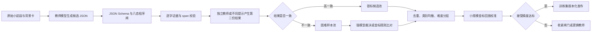
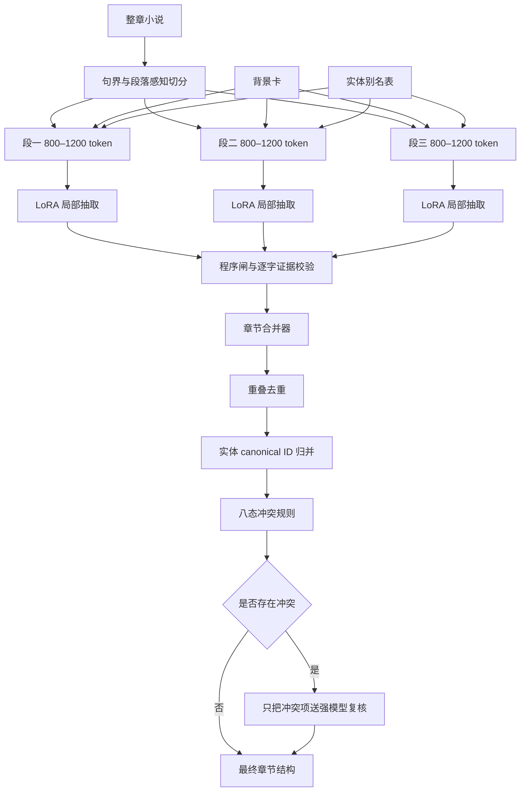
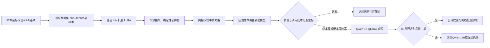

# 中文网文“事实句子”结构化抽取：微调、数据生产、训练粒度与部署成本调研

## 执行摘要

✅ **建议继续用火山方舟托管 LoRA 完成首轮验证，但不要把它当成长期可迁移资产。** 火山方舟公开文档确认精调模型可以导出到方舟内部的“模型仓库”，用于评测、量化、推理和增量训练；但公开资料没有明确承诺可以把豆包 LoRA Adapter 以 `safetensors` 等形式下载到方舟外部，也没有给出跨基础模型版本直接迁移 Adapter 的保证。因此，现阶段应把真正可持有的资产定义为：**训练数据、八态合同、评测集、生成脚本、程序闸和错误分类体系**，而不是托管 Adapter。火山方舟还说明，模型版本的一般生命周期约为三至六个月，存在 EOM、EOL 和重新训练、回归测试的现实风险。citeturn21search0turn21search1turn21search2

✅ **在每月不超过一万章的范围内，单次托管 LoRA 推理大概率比常驻自部署便宜。** 按火山方舟最新公开价格页面搜索结果中 Doubao Seed 2.0 Lite 的短上下文档位、精调推理为基础模型价格的两至二点五倍，以及公开云 GPU 价格估算：中章八千小说 token、约三千二百输出 token，单次精调推理约 **0.154 元/章**；一万章约 **1,539 元/月**。一张 A10 级七至八十亿参数模型的公开常驻实例参考价约 **5,286 元/月**，还未计算运维。只有在每章重复调用六次左右时，纯算力交叉点才下降到约 **5,700 章/月**；算上运维后接近一万章。实际价格应以方舟控制台、合同折扣、批量推理价格和缓存命中情况为准。citeturn20search0turn20search1turn22search0turn15view3

✅ **微调值得做，但目标不应是“让模型学会整章思考”，而应是“让模型稳定执行局部合同”。** 公开信息抽取研究普遍发现：只有极少标签、极少样本时，few-shot 大模型才容易占优；达到数百个高质量样本后，微调小模型通常在 F1、延迟和成本上更有优势。任务定向蒸馏也曾使小模型平均超过 ChatGPT 七至九个绝对 F1 点，而未经信息抽取对齐的通用模型在复杂 schema、负样本和格式遵循上容易失败。citeturn17view0turn19view0turn18view8turn19view2

✅ **主训练粒度建议用八百至一千二百 token 的短段，而不是整章。** 每段带一百五十至二百五十 token 重叠、章节背景卡和实体表；章节级结果由确定性合并器完成去重、证据定位、别名归并和冲突处理。三千 token 短章可以保留整章实验组；八千和一万五千 token 章节不宜作为主要训练单元。长上下文模型“能装下”不等于“能稳定利用”，相关证据位于上下文中间时性能会下降，纯粹增加输入长度也可能降低推理质量。citeturn18view4turn18view5turn18view3

✅ **现有四十章金标已经足够启动，不应等待几千章人工标注。** 按一千二百 token 分段，四十章大约能产生短章一百二十段、中章三百二十段、长章六百段。推荐首训目标为 **六百至一千二百个精品段样本**，随后通过 Agent 生成 **五千至一万五千个经过程序闸和独立校验的银标段样本**。跨题材生产级目标可以提高到两千至五千个精品样本、两万至五万个银标样本。这里的“条”应指独立的“文本段—目标 JSON”训练对，不是 JSON 中的一条事实。

✅ **共指与梦境、回忆不建议塞进八态合同。** 低成本做法是在合同外增加一个旁路元数据层：`canonical_entity_id`、`alias_map`、`narrative_frame` 和置信度。逐字证据仍保留小说原文，八态输出不变。优先落地“规则＋背景卡＋冲突路由”的轻量混合方案，而不是立即训练完整共指模型。NovelCR 中文数据有三十一万余个 mention，其中百分之八十三的共指关系跨越三句以上，说明纯局部规则无法解决所有问题，但也意味着不应让主抽取模型同时承担全部长距离共指责任。citeturn17view1turn18view9

**总推荐路线：**

> 托管豆包 LoRA 做首训 → 短段抽取模型 → 确定性章节合并器 → 规则化共指与叙事帧旁路 → 仅把冲突样本送给较强模型 → 当调用轮数、模型版本控制或数据规模越过阈值后，再迁移到自持 Qwen 8B；Qwen 14B 只有在实测比 8B 高出至少三至五个 F1 点时才值得生产部署。

## 托管微调与自持权重的全周期成本

### 托管 LoRA 的资产归属与迁移风险

火山方舟公开文档支持 LoRA 和全参数精调，并说明 LoRA 精调后的在线推理使用公共资源池，性能和稳定性保障较弱，更适合小流量测试、宽松延迟要求和离线批量处理；价格通常为基础模型推理价格的两至二点五倍。厂商还把“提示词效果不佳、格式不稳定”列为有监督微调的典型适用场景。citeturn20search0turn20search2

关于 Adapter 的归属，公开文档能够证明的是：

| 问题 | 公开资料能够确认的内容 | 目前不能确认的内容 |
|---|---|---|
| 精调产物保存在哪里 | 可导出到火山方舟内部“模型仓库” | 是否可以下载到本地 |
| 后续能做什么 | 体验、评测、推理、量化、增量训练 | 是否能在 vLLM、Transformers 中直接加载 |
| 基础模型升级 | 可以围绕方舟支持的模型继续精调 | 老 Adapter 能否无损挂载到新版本 |
| 权利归属 | 未发现公开文档声称平台取得用户训练数据所有权 | Adapter 文件的交付形式、退出后的保留期 |
| 跨云迁移 | 用户上传的自定义模型可进入平台 | 豆包私有基础模型上的 LoRA 能否迁到其他云 |

因此，不能直接下结论说“Adapter 属于平台”，也不能下结论说“用户可以带走”。更稳妥的工程假设是：**在拿到书面确认前，把豆包 Adapter 按不可外迁处理。** 方舟公开页面目前只描述了向平台内部模型仓库导出，而没有公开说明外部下载接口。citeturn21search1turn21search2turn20search6

在购买首训前，应让销售或技术支持书面回答下面几个问题：

1. 精调产物是否可以导出为 LoRA Adapter 文件，格式是否为 PEFT、`safetensors` 或其他公开格式。
2. 基础模型 EOM、EOL 后，原精调 Endpoint 和 Adapter 保留多久。
3. 能否固定基础模型版本，最长固定期是多少。
4. 新基础模型发布后，Adapter 是直接迁移还是必须重新训练。
5. 数据集、日志、检查点和精调模型删除后的保留与审计机制。
6. 退出平台时，哪些产物可下载，哪些只能删除。

火山方舟说明一般模型版本生命周期约三至六个月，因此至少要按每半年一次迁移回归来做预算。一次迁移通常包含重新精调、四十章金标回放、阈值重调、提示词适配、线上灰度和回滚准备；结合当前规模，可以先按 **三至十个人日加一轮完整评测**做内部规划，这一人力区间属于工程预算假设，不是厂商承诺。citeturn21search0

### 可参数化成本模型

托管成本可以写成：

\[
C_{\text{host}}(N)
=
N \times K \times
\frac{T_{in}P_{in}+T_{out}P_{out}}{10^6}
+
\frac{C_{train}}{M}
\]

其中：

- \(N\)：每月处理章数；
- \(K\)：每章模型调用轮数；
- \(T_{in}\)、\(T_{out}\)：每轮输入、输出 token；
- \(P_{in}\)、\(P_{out}\)：精调模型每百万 token 单价；
- \(C_{train}\)：一次训练成本；
- \(M\)：训练成本摊销月数。

自部署常驻服务的成本可以写成：

\[
C_{\text{self}}(N)
=
R \times G_{\text{month}}
+
C_{\text{ops}}
+
C_{\text{storage}}
+
C_{\text{training-amortized}}
\]

其中 \(R\) 是副本数。离线弹性服务则改成“实际 GPU 小时 × 小时单价”，但还要计算启动、模型加载、任务排队和低利用率损耗。

本报告成本图采用以下预算条件：

| 参数 | 默认值 | 说明 |
|---|---:|---|
| Doubao Seed 2.0 Lite 基础输入价 | 1.2 元/百万 token | 官方最新价格页搜索结果的短上下文档位 |
| 基础输出价 | 18 元/百万 token | 同一公开价格页档位 |
| LoRA 推理倍率 | 2.25 倍 | 官方两至二点五倍区间的中位数 |
| 短章输入、输出 | 4,000 / 1,200 token | 小说正文三千，加提示词和 JSON |
| 中章输入、输出 | 9,000 / 3,200 token | 小说正文八千，加提示词和 JSON |
| 长章输入、输出 | 16,000 / 6,000 token | 小说正文一万五千，加提示词和 JSON |
| 重 Harness | 六轮完整调用 | 实际应同时测三、六、八轮 |
| 七至八十亿模型常驻算力 | 5,286 元/月 | 一张 A10 级实例的公开参考价 |
| 十四十亿模型常驻算力 | 17,101 元/月 | 一张高显存实例公开参考价 |
| 自部署运维预算 | 4,000 元/月 | 内部规划值，非云厂商价格 |
| 高可用副本 | 默认一个 | 两副本时常驻算力近似翻倍 |

当前模型价格页面明确提醒价格应以实际下单结果为准；企业折扣、批量推理、缓存和套餐可能使实际托管价格低于图中结果。自部署价格采用透明的公开云实例作为资源档位参考，而不是 Qwen 实测吞吐基准。citeturn20search1turn22search0turn15view3


[下载成本模型明细 CSV](sandbox:/mnt/data/novel_extraction_cost_model.csv)

### 成本曲线结果

| 场景 | 单章成本 | 一百章/月 | 一千章/月 | 一万章/月 | 对七至八十亿纯算力交叉点 |
|---|---:|---:|---:|---:|---:|
| 短章、LoRA 一次调用 | 0.059 元 | 5.94 元 | 59.4 元 | 594 元 | 约 89,000 章 |
| 中章、LoRA 一次调用 | 0.154 元 | 15.39 元 | 153.9 元 | 1,539 元 | 约 34,000 章 |
| 长章、LoRA 一次调用 | 0.286 元 | 28.62 元 | 286.2 元 | 2,862 元 | 约 18,500 章 |
| 中章、六轮重 Harness | 0.923 元 | 92.34 元 | 923.4 元 | 9,234 元 | 约 5,700 章 |
| 自部署七至八十亿纯算力 | — | 5,286 元 | 5,286 元 | 5,286 元 | 固定成本 |
| 自部署七至八十亿规划 TCO | — | 9,286 元 | 9,286 元 | 9,286 元 | 固定成本 |
| 自部署十四十亿规划 TCO | — | 21,101 元 | 21,101 元 | 21,101 元 | 固定成本 |

这张表说明：

- **单轮精调推理下，一万章以内没有成本理由自部署。**
- 六轮完整大模型 Harness 会让托管费用迅速接近自部署，但这并不意味着立即自部署，因为自部署还要承担升级、监控、故障、量化退化和低利用率。
- 六轮 Harness 对七至八十亿“纯 GPU”交叉约在五千七百章，对含四千元运维预算的 TCO 交叉约在一万章。
- 如果方舟合同价比公开价低百分之五十，六轮场景的 TCO 交叉点将提高到约两万章。
- 如果改成八轮，交叉点会比六轮低约百分之二十五。
- 如果输出 JSON 比假设长一倍，成本不会只增加一点，因为输出 token 单价明显高于输入 token 单价。citeturn20search0turn22search0turn15view3

### 成本参数敏感性

| 参数 | 低位 | 默认 | 高位 | 对结果的影响 |
|---|---:|---:|---:|---|
| 每月章数 \(N\) | 一百 | 一千 | 一万 | 托管线性增长，自部署常驻近似固定 |
| 正文 token/章 | 三千 | 八千 | 一万五千 | 长章单轮成本约为短章四点八倍 |
| 输出/正文比例 | 百分之二十 | 百分之四十 | 百分之七十 | 输出价高，通常是最大成本变量 |
| 完整模型调用轮数 | 一 | 六 | 八 | 六轮约为单轮六倍，不会因“检查”自动变便宜 |
| LoRA 价格倍率 | 二倍 | 二点二五倍 | 二点五倍 | 交叉点约反向变化正负百分之十一 |
| 在线副本数 | 一 | 一 | 二 | 高可用时自部署常驻成本接近翻倍 |
| GPU 利用率 | 百分之二十 | 百分之五十 | 百分之八十 | 低利用率会使自部署单章成本大幅上升 |
| 推理批次 | 单请求 | 连续批处理 | 大离线批次 | 批次越好，GPU 吞吐越高，但首包和单章延迟可能上升 |
| 模型大小 | 七至八十亿 | 七至八十亿 | 十四十亿 | 十四十亿公开实例档位约为八十亿的三倍 |
| SLO | 小时级批处理 | 分钟级完成 | 在线高可用 | 越严格越需要常驻、冗余和容量预留 |

Qwen 官方推荐用 vLLM 部署，原因包括 PagedAttention、连续批处理和高吞吐；它也提供 OpenAI 兼容接口，能降低从托管 API 迁移时的业务代码改造量。Qwen3 预训练上下文主要到三万二千七百六十八 token，更长上下文需要 YaRN 等扩展，而且官方提示在不需要长上下文时开启 YaRN 可能降低短文本表现。citeturn18view2turn18view3

在 QLoRA 训练可行性上，Qwen 官方 MS-SWIFT 示例展示了 Qwen3-8B 在一张 A10、二十二 GB 显存上进行两千六百个短样本的一轮 LoRA 训练，示例耗时约三十分钟、最大长度两千零四十八；Unsloth 文档则声称四比特 QLoRA 下 Qwen3-14B 可以放入十六 GB T4。两者只能证明“能跑”，不能证明长文本生产训练的吞吐、稳定性和最终质量。citeturn24view3turn24view0

自部署训练预算建议不要直接猜总价，而是先测十、三十、一百 GPU 小时三个档位：

| 训练资源档位 | 十 GPU 小时 | 三十 GPU 小时 | 一百 GPU 小时 |
|---|---:|---:|---:|
| A10 级七至八十亿，12.18 元/小时 | 122 元 | 365 元 | 1,218 元 |
| 高显存十四十亿档，33.25 元/小时 | 333 元 | 998 元 | 3,325 元 |

这些只包含 GPU 实例，不包含数据生产、失败重跑、评测、存储和工程人力。公开实例价格显示，七至八十亿蒸馏模型可放在一张 A10，十四十亿推荐更高显存档位；生产部署应以实际 Qwen 量化方式、上下文长度和并发压测为准。citeturn15view3

**成本维度的决策：** 目前继续托管 LoRA。出现下面条件中的任意两个，再启动自持权重迁移会更合理：

- 六至八轮 Harness 下月处理量持续超过一万至两万中章；
- 单轮抽取量持续超过三万至五万中章；
- 必须固定模型版本超过半年；
- 必须取得 Adapter 或完整权重的可下载交付物；
- 要做自定义 constrained decoding、logits 处理或更细的置信度校准；
- 已有其他 Qwen 工作负载，可以共享 GPU，使平均利用率长期超过百分之五十；
- Qwen 8B 在同一金标集上达到托管模型九成五以上质量，且单章成本确认更低。

**证据来源：** 火山方舟模型精调、价格、下线公告与模型仓库文档；Qwen 官方 MS-SWIFT、Unsloth 和 vLLM 文档；腾讯云公开大模型部署资源及价格。citeturn20search0turn21search0turn21search1turn18view2turn24view3turn15view3

## few-shot 提示与小模型微调

### 公开证据给出的方向

EMNLP 2023 的系统研究覆盖九个数据集、命名实体识别、关系抽取、事件检测和事件论元抽取四类任务，并比较了一至二十 shot 甚至更多样本。结果是：未经信息抽取专门微调的大模型只在标签和样本都极其稀缺时容易占优；达到数百个标注样本后，微调小模型通常显著超过 few-shot 大模型，且延迟和推理成本更低。论文还发现，大模型更适合作为困难样本的 reranker，使用“小模型过滤、LLM 只检查困难样本”的混合方式，平均增加约二点四个 F1。citeturn16view0turn17view0

UniversalNER 使用大模型生产任务定向数据，再微调更小的学生模型。在四十三个数据集、九个领域的开放命名实体识别评测中，学生模型平均超过通用指令模型三十多个绝对 F1 点，并平均超过 ChatGPT 七至九个 F1 点。这说明 **Agent 生成训练数据＋小模型任务蒸馏**是可行路线，但 NER 比整章八态事实抽取简单，不能直接照搬其收益数字。citeturn19view0

InstructUIE 把信息抽取统一成“指令、候选 schema、文本 → 结构化结果”的生成问题，使用三十二个数据集进行专门指令微调。论文报告 GPT-3.5-turbo 在 OntoNotes 上只有 18.22 F1，而任务对齐后的模型在多个监督和零样本抽取设置中显著更强。YAYI-UIE 进一步把类似方法扩展到中文、英文和 JSON 输出，说明中文信息抽取对专门任务微调是有响应的。citeturn18view8turn12view2

ADELIE 则展示了另一面：复杂 schema、任务说明和输出格式需要专门对齐。其训练集包含八万三千五百八十五个信息抽取实例，输出格式包含 JSON，并使用 GPT-3.5 扩展指令、GPT-4 为八千个实例生成解释。它还发现，未经专门 few-shot 对齐的 GoLLIE 在增加示例后反而下降四点三个 F1，说明“多塞几个示例”不一定提高质量。citeturn19view2turn19view3

### 微调获得至少十个 F1 点的判据

下面的概率不是论文给出的通用统计概率，而是结合公开研究与你当前任务条件形成的**工程先验**，应通过四十章金标更新。

| 条件 | few-shot 现状 | 数据条件 | 主要错误 | \(P(\Delta F1 \ge 10)\) |
|---|---|---|---|---:|
| 高收益区 | 基线 F1 不高于五十五 | 至少五百个精品段样本，或两千个高置信银标 | 漏抽、乱加字段、八态混淆、格式漂移、负样本误报 | 百分之六十五至八十 |
| 中高收益区 | 基线 F1 五十五至六十五 | 八百至一千五百个精品段样本 | 局部语义和 schema 遵循为主，少量共指 | 百分之五十至七十 |
| 中收益区 | 基线 F1 六十五至七十五 | 一千至三千个高质量段样本 | 局部错误和长距离错误各半 | 百分之三十至五十 |
| 低收益区 | 基线已超过七十五 | 数据量充足 | 错误集中在跨段共指、梦境边界、隐含因果 | 百分之十至三十 |
| 高风险区 | 任意 | 少于两百个样本，或银标未校验 | 同一个模型既生成又修复、错误高度相关 | 百分之十至二十五 |
| 整章稀疏区 | 任意 | 只有四十个整章训练对 | 输出很长、每章结构差异大 | 百分之十至三十五 |

你的项目处于相对有利的位置，因为：

- 八态合同是封闭 schema，而不是开放问答；
- 有逐字证据校验和程序闸，可以自动拒绝一部分幻觉数据；
- 已有四十章种子金标，可以校准 Agent 银标的真实精度；
- 当前 API 准确率约一半，仍有较大的可提升空间；
- 很多错误可能是格式、边界、负样本和合同执行问题，这些比“理解整部小说世界观”更适合微调。

不利因素是：网文共指、别名、零代词、梦境和回忆属于长距离叙事理解，仅靠局部 LoRA 不一定解决。公开研究也显示信息抽取专门微调对 schema 和格式很有效，但长跨度共指至今仍与人类存在明显差距。citeturn19view2turn17view1

### 数据量建议

这里应区分“精品数据”“银标数据”和“原子监督量”。

| 阶段 | 精品段样本 | 自动银标段样本 | 预期用途 |
|---|---:|---:|---|
| 可行性验证 | 三百至六百 | 零至两千 | 验证格式、八态、明显漏抽是否可学 |
| 可用版本 | 八百至一千五百 | 五千至一万五千 | 形成稳定局部抽取器 |
| 跨小说增强 | 两千至五千 | 两万至五万 | 覆盖题材、文风、对话、倒叙和长尾状态 |
| 整章训练对照组 | 四十至一百 | 一百至三百 | 只用于实验，不宜作为主训练集 |

“精品段样本”至少满足：

| 闸门 | 合格标准 |
|---|---|
| JSON 与 schema | 百分之百通过 |
| 八态枚举和字段依赖 | 百分之百合法 |
| 逐字证据 | 百分之百能在输入段或明确背景卡中定位 |
| span 偏移 | 百分之百可重建原文位置 |
| 重复事实 | 重复率低于百分之一，或有明确合并规则 |
| 金标回放精度 | 自动接受银标在种子金标上的 precision 至少百分之九十，推荐百分之九十五 |
| 稀有状态覆盖 | 每个关键状态至少一百至三百个有效实例 |
| 负样本 | 必须包含“没有事实”“只是假设”“只在梦中”“仅为他人说法”等难负例 |
| 数据泄漏 | 按小说或故事线切分，不能随机把相邻段分到训练集和测试集 |
| 教师一致性 | 高置信样本直接收录，模型分歧样本进入困难队列 |

四十章金标按一千二百 token 分段后，大致会得到：

| 章节类型 | 每章段数 | 四十章段数 |
|---|---:|---:|
| 三千 token 短章 | 约三至四段 | 一百二十至一百六十 |
| 八千 token 中章 | 约八至十段 | 三百二十至四百 |
| 一万五千 token 长章 | 约十五至十九段 | 六百至七百六十 |

因此，现有金标并不只是“四十条数据”。经过合理切分，它可能已经是三百至七百个训练对；JSON 内部的事实、状态和负例还提供了更多原子监督信号。

### Agent 批量生产数据的方法

不建议让一个模型一次性生成银标，再让同一模型用近似相同提示词“自我检查”。这种方式容易保留相关性错误：它不知道的地方，第二遍通常仍不知道。

更可靠的生产过程是：



可操作的批量生产原则如下：

- **小说正文不生成，只生成标注。** 避免模型同时编写文本和答案，减少不可验证信息。
- **先生成候选，再做硬校验。** JSON 合法、字段依赖、证据逐字命中、span 偏移和枚举值全部由程序判断。
- **使用不同模型家族做交叉校验。** 至少使用不同 checkpoint、不同系统提示；理想情况是一家闭源强模型加一家不同架构模型。
- **只接受高置信一致结果。** 宁可丢弃百分之五十不确定数据，也不要把系统性错误灌入微调。
- **针对失败模式定向生产。** 不应平均采样，应主动提高梦境、回忆、假设、转述、否定、同名人物、零代词和跨段别名的比例。
- **保留 rejected 数据。** 被程序闸拒绝的数据可以作为 DPO 或困难负例，但不能直接当 SFT 正例。
- **教师输出不应含无法验证的解释链。** 训练目标只保留最终结构、必要的可审计中间字段和逐字证据，减少无关输出 token。
- **使用正式 API，不建议自动操作消费级网页。** API 更容易版本固定、记录 token、重试、做并发控制和保存完整审计日志；网页 Agent 容易遇到页面改版、会话污染、账号限制和复现困难。

ADELIE 的公开数据生产方式与此方向相似：先人工定义任务指令，再让 GPT-3.5 扩展指令和格式，使用 GPT-4 生成部分解释，并通过已有 ground truth 自动构造偏好数据；UniversalNER 则证明了任务定向蒸馏可以让小模型超过教师在特定抽取任务上的平均表现。citeturn19view2turn19view0

### 可复现实验设置

few-shot 与微调必须使用同一测试集、同一 schema 和相同后处理，不能拿“带七次修复的 API”与“微调裸输出”直接比较。

推荐设置：

| 项目 | 设置 |
|---|---|
| 数据切分 | 按小说或故事线切分；四十章可暂按二十四训练、八验证、八测试 |
| Few-shot | 零、二、四、八个检索式示例 |
| SFT 数据量 | 二百、五百、一千、三千个段样本 |
| 模型 | 豆包基础版、豆包 LoRA；后续加入 Qwen 8B QLoRA |
| 随机性 | 温度零主测；训练至少三个随机种子 |
| 抽取指标 | span-level precision、recall、micro-F1、macro-F1 |
| 合同指标 | 八态混淆矩阵、非法状态率、字段缺失率 |
| 证据指标 | 逐字证据命中率、span 偏移正确率 |
| 工程指标 | JSON 有效率、重试率、每章成本、p50/p95 完成时间 |
| 章节指标 | 别名一致率、重复率、跨段冲突率、章节级完整率 |

**微调的立项门槛：** 在八章独立测试集上，相对当前最强 few-shot 方案至少提高五个 F1，或者在 F1 相近时把调用轮数降低一半以上。达到十个 F1 属于明确成功；低于三个 F1 且成本没有下降，应暂停扩数据，先检查错误是否主要来自共指、合同定义或金标不一致。

**证据来源：** EMNLP few-shot 信息抽取对比研究；UniversalNER 定向蒸馏；InstructUIE、YAYI-UIE 和 ADELIE 的任务对齐与结构化输出实践。citeturn17view0turn19view0turn18view8turn12view2turn19view2

## 训练粒度与章节合并

### 为什么整章输入并不等于整章能力

Qwen3 的主要预训练上下文长度为三万二千七百六十八 token，扩展后可以支持更长输入；但官方文档也明确提示，扩展上下文需要 RoPE/YaRN 配置，且不必要地启用长上下文扩展可能降低短文本表现。对于十五千 token 小说正文，加提示词、背景卡和六千以上 JSON 输出，虽然总 token 可能仍在窗口内，但已经接近会明显压缩批次和 KV Cache 容量的区域。citeturn18view3

更麻烦的地方不是“窗口装不下”，而是：

- 模型对上下文中间位置的信息利用较差；
- 输入越长，相关信息被无关情节、描写和对话稀释；
- 输出越长，越容易出现漏字段、重复、截断和局部格式损坏；
- 四十个整章样本只提供四十次参数更新层面的独立结构变化；
- 整章错误很难精确归因，模型可能学到小说风格而不是抽取边界；
- 长序列迫使训练使用更小 batch、更强梯度累积和更多显存；
- 线上解码成本由长 JSON 输出主导，很难做到低延迟。

“Lost in the Middle”研究显示，相关信息位于长上下文中部时，多个模型的表现明显下降；更长上下文模型也不一定更善于使用窗口内的信息。后续研究进一步发现，即便屏蔽无关 token，只增加输入长度本身也会降低推理表现，而把任务转成“先找证据，再在短上下文中推理”可以改善结果。citeturn18view4turn18view5

### 训练粒度质量与成本对比

下面质量区间是结合公开长文本研究和信息抽取实践给出的**立项估计**，不是现成的中文网文公开 benchmark 结果，必须由你的四十章金标实测更新。

| 维度 | 整章级 JSON 微调 | 短段微调＋章节合并器 |
|---|---|---|
| 主要输入 | 整章正文、完整提示、完整 schema | 八百至一千二百 token 文本段、背景卡、局部 schema |
| 单样本总 token | 短章约四至五千；中章约十一至十三千；长章约二十至二十四千 | 通常一千三百至两千二百 |
| 四十章可得样本数 | 四十 | 约一百二十至七百六十 |
| 推荐精品样本量 | 三百至八百个完整章节对 | 六百至一千五百个段对 |
| 推荐银标量 | 一千至三千章，生产难度很高 | 五千至一万五千段 |
| 局部证据 precision 规划区间 | 百分之七十五至八十八 | 百分之八十二至九十二 |
| 局部证据 recall 规划区间 | 百分之六十至七十八 | 百分之七十二至八十八 |
| JSON 一次有效率 | 百分之九十至九十八 | 配合 schema 可超过百分之九十九 |
| 章节内部一致性 | 百分之七十至八十五 | 合并器后规划为百分之八十五至九十五 |
| 跨段重复 | 模型内部重复，较难定位 | 重叠区会产生重复，但容易程序去重 |
| 长距离共指 | 理论上下文更全，实际利用不稳定 | 依赖背景卡和共指旁路 |
| 训练显存 | 高，batch 小 | 低，batch 和 packing 更友好 |
| 错误定位 | 困难 | 可定位到段、事实、字段和闸门 |
| 推理并发 | 较低 | 多段可并行，吞吐更高 |
| 合并复杂度 | 低 | 中等，但多数规则可确定化 |
| 适用范围 | 短章、输出稀疏、强模型 | 中长章、密集结构、生产环境 |

类似的文档到 JSON 工程实践通常采用 token 切分、并行 schema 抽取、合并和多层校验，而不是让单个生成请求直接承担全部文档结构。citeturn15view8

### 训练成本估算

设 LoRA 训练价为 \(P_{train}\) 元/百万训练 token，则：

\[
C_{train}
=
\frac{\text{样本数} \times \text{平均样本 token} \times \text{epoch}}
{10^6}
\times P_{train}
\]

公开二手资料曾给出豆包 Lite LoRA 约三十元/百万训练 token 的历史参考，但这不是本报告日期下的官方合同价，只能作为预算锚点，实际应向方舟询价。citeturn2search3

| 训练方案 | 训练 token | 按三十元/百万 token 参考 |
|---|---:|---:|
| 一千段 × 一千八百 token × 三轮 | 五百四十万 | 约 162 元 |
| 五千段 × 一千八百 token × 三轮 | 两千七百万 | 约 810 元 |
| 三百个中章 × 一万二千 token × 三轮 | 一千零八十万 | 约 324 元 |
| 三百个长章 × 两万二千 token × 三轮 | 一千九百八十万 | 约 594 元 |

从训练 token 总量看，整章并不一定贵很多；真正的问题是**数据难生产、有效独立样本少、显存和 batch 效率差、错误密度高**。短段会产生重叠 token，可能多花百分之十五至三十训练量，但通常换来更稳定的监督和更高并发。

ADELIE 为提高文档级信息抽取效果，把训练上下文设为两千零四十八 token，并过滤超过两千零四十八 token 的训练实例；其八万余训练实例在七十亿参数模型上进行两轮 SFT，使用约一百二十 A100 GPU 小时。这不是说两千零四十八是唯一正确长度，而是说明成熟的信息抽取训练也倾向把监督单元控制在较短范围，而不是无条件塞入完整长文档。citeturn19view2turn19view3

### 推荐的段级架构



推荐具体参数：

| 参数 | 推荐值 |
|---|---|
| 主段长度 | 八百至一千二百 token |
| 可实验范围 | 五百至一千六百 token |
| 重叠 | 一百五十至二百五十 token |
| 切分位置 | 优先段落、句号、对话结束处，不硬切半句话 |
| 背景卡长度 | 建议三百至八百 token |
| 背景卡内容 | 已确认人物、别名、地点、时间、当前叙事帧、上一段未闭合事件 |
| 输出 | 只输出当前段有直接证据的事实 |
| 跨段引用 | 使用 `canonical_entity_id`，但证据必须保留原文字面 |
| 合并器 | 确定性规则为主，模型只处理冲突 |
| 训练模式 | 主体为短段；保留百分之十至二十的短章、章节摘要或跨段样本做一致性训练 |

整章一次输出可以保留，但只适合以下条件同时成立时：

- 正文不超过三至五千 token；
- 输出少于一至两千 token；
- 事实密度低；
- JSON 使用严格 schema 或 constrained decoding；
- 独立测试中整章 recall 不比段级低五个点以上；
- 一次通过率超过百分之九十八；
- 不需要大量跨段共指推断。

对于八千和一万五千 token 的网文章节，**不建议把“一次输入整章、一次吐完整结构”作为主生产模式。**

**证据来源：** Qwen 官方上下文与部署文档；Lost in the Middle、Context Length Alone Hurts Performance；ADELIE 文档级信息抽取训练设置；长文档到结构化 JSON 的分块、合并与验证实践。citeturn18view3turn18view4turn18view5turn19view2turn15view8

## 共指与叙事世界补法

### 不改八态合同的设计原则

共指归并解决的是“他是谁”“少爷和沈公子是否同一人”；梦境、回忆解决的是“这件事发生在当前现实、过去回忆还是虚构梦境”。它们属于**解释层和上下文层**，不应强塞进事实状态合同。

推荐在八态结果之外增加旁路元数据：

```json
{
  "entity_context": {
    "mentions": [
      {
        "surface": "他",
        "span": [128, 129],
        "canonical_entity_id": "char_0007",
        "confidence": 0.96,
        "method": "rule_plus_context"
      }
    ],
    "aliases": {
      "char_0007": ["沈砚", "沈公子", "少爷"]
    }
  },
  "narrative_context": {
    "frame": "memory",
    "frame_span": [0, 462],
    "confidence": 0.91,
    "trigger_evidence": "他忽然想起三年前……"
  },
  "facts": [
    {
      "evidence": "他推开了门",
      "state": "原八态之一"
    }
  ]
}
```

这里的关键是：

- `evidence` 保持小说原文，不把“他”偷偷改写成“沈砚”；
- `canonical_entity_id` 供合并器和下游查询使用；
- `narrative_frame` 是事实解释条件，不新增第九种状态；
- 任何低置信归并都不能覆盖逐字证据；
- 旁路错误可以回滚，不会污染八态合同。

### 方案对比

| 方案 | 做法 | 实现复杂度 | 运行成本 | 预期整体 F1 提升 | 主要风险 |
|---|---|---:|---:|---:|---|
| 规则引擎 | 最近人物、性别、称谓、对话角色、梦境触发词、状态机 | 低，约三至五人日 | 接近零 | 一至三点 | 对零代词、远距离别名能力弱 |
| 提示工程 | 在抽取前生成背景卡；在抽取后复核别名和叙事帧 | 低到中 | token 增加约百分之五至十五 | 二至五点 | 与主模型错误相关，可能过度归并 |
| 独立共指模型 | 中文共指模型输出 mention cluster | 中到高，约一至两周 | 小模型可在 CPU 或轻 GPU 运行 | 三至七点 | 小说领域迁移、零代词、长跨度仍难 |
| 混合流水线 | 规则做高精度部分，模型只处理模糊项 | 中，约两至三周 | 通常只增加少量困难样本调用 | 四至八点 | 需要路由、置信度和冲突机制 |
| 主模型整章全包 | 抽取时同时理解共指、时间、梦境并生成全部 JSON | 表面低、调试高 | 长输入和多轮修复成本高 | 不稳定 | 错误不可拆、难审计、相关错误严重 |

表中的收益是针对你当前约五成准确率的工程规划区间，不是公开 benchmark 保证。应同时报告“整体 F1”和“受共指影响子集 F1”，否则大量简单样本会掩盖共指改善。

NovelCR 专门面向小说长跨度共指，中文部分包含约三十一万一千个 mention，百分之八十三的共指对跨越三句或更多；论文仍观察到最强基线与人类之间存在明显差距。这说明“只看当前句和上一句”的规则不够，但也说明直接上一个现成共指模型不会一次解决问题。citeturn16view2turn17view1

目前可以找到支持中文的轻量多语言共指模型，例如 Infon Coreference Pointer，公开模型卡称其支持中文并可通过 ONNX 在浏览器或本地运行，半精度模型约二百三十五 MB。不过它属于社区项目，不是成熟中文小说行业标准，必须在自己的网文金标上测完再决定是否进入生产。citeturn18view9

### 低成本规则层

**人物和别名归并规则：**

- 当前段已经出现唯一同姓、同称谓人物时，高置信映射；
- “少爷、师父、陛下、夫人、哥哥”等称谓结合说话人和当前场景解析；
- 人名、姓氏、职位、门派、亲属称谓建立 alias 候选图；
- 对话块维护 `speaker` 和 `addressee`；
- 代词只在性别、数、距离、语法角色和当前焦点一致时自动归并；
- 两个候选置信度接近时不强行决定，进入冲突队列；
- 零代词优先从上一句主语、当前对话说话人和持续动作主体中寻找候选。

**梦境与回忆规则：**

可建立段落级有限状态机：

| 叙事帧 | 常见进入线索 | 常见退出线索 |
|---|---|---|
| 梦境 | 梦见、梦中、恍惚间、眼前景象一变 | 惊醒、睁开眼、原来是梦 |
| 回忆 | 想起、回忆起、记得、那年、当时 | 思绪收回、回过神、眼前 |
| 假想 | 假如、若是、仿佛、似乎看见 | 但事实上、现实中 |
| 转述 | 听说、据说、他告诉她 | 叙述者回到当前观察 |
| 当前现实 | 默认帧 | 被其他帧显式覆盖 |

状态不能只按单个关键词判断。例如“她仿佛从梦中惊醒”不一定意味着前文真的处于梦境；应结合时态变化、段落边界和退出词。

### 提示层与合并层

在每个段的输入中加入短背景卡，而不是重复整章：

```text
已确认人物：
- char_0007：沈砚；别名：沈公子、少爷；男性
- char_0012：林晚；别名：阿晚；女性

当前场景：
- 地点：沈府书房
- 当前说话人：林晚
- 叙事帧：当前现实
- 上一段未闭合事件：沈砚正在寻找书信

规则：
- 输出证据必须逐字来自当前文本段。
- 可以引用 canonical_entity_id，但不得改写 evidence。
- 不能确定代词所指时，entity_id 输出 null，不得猜测。
```

抽取后再做一次确定性归并：

1. 按原文 span 排序。
2. 对重叠段中的相同证据、相同谓词和相同实体去重。
3. 合并高置信 alias。
4. 检查同一实体、同一时间、同一谓词是否出现状态冲突。
5. 只有冲突或低置信项进入模型复核。
6. 模型复核只看相关的两至五句话、候选实体和背景卡，不再看整章。

这种设计与公开信息抽取研究中的“SLM 处理简单样本，LLM 只 rerank 困难样本”方向一致，能避免每章七八次完整重跑。citeturn16view0

### 优先级建议

| 优先级 | 动作 | 原因 |
|---|---|---|
| P0 | 建立实体旁路 ID、alias 表和叙事帧 sidecar | 不改八态合同，后续所有方案都依赖 |
| P0 | 做梦境、回忆、转述的高精度规则状态机 | 成本极低，容易测 precision |
| P0 | 在段级抽取中加入短背景卡 | 比重复输入整章便宜 |
| P1 | 增加代词高置信规则和冲突队列 | 先解决容易且可审计的共指 |
| P1 | 仅对冲突项调用强模型 | 避免完整章节多轮 Harness |
| P2 | 在 NovelCR 和自有困难集上测试独立共指模型 | 用数据判断是否值得集成 |
| P3 | 当共指仍占剩余错误三成以上时，再训练专用小模型 | 避免提前投入复杂系统 |

**证据来源：** NovelCR 中文小说长跨度共指数据；社区中文多语言 ONNX 共指模型；few-shot IE 的过滤、困难样本 rerank 研究。citeturn17view1turn18view9turn17view0

## 推荐路线与工程实验

### 推荐的生产路线

**当前阶段：继续托管 LoRA。**

原因不是托管一定质量更高，而是当前 \(N\) 未知、数据仍在成形、四十章金标尚未跑完学习曲线。此时自部署会把精力分散到 GPU、驱动、量化、vLLM、监控和容量问题上，但未必解决抽取准确率。

建议分成以下演进路径：



**托管阶段必须做的可迁移准备：**

- 数据统一保存为模型无关的 JSONL；
- system prompt、user prompt、目标 JSON 分开存储；
- 保存原始正文哈希、span 偏移、合同版本和标注来源；
- 所有评测都能在豆包和 Qwen 上复跑；
- 模型调用封装成 OpenAI 兼容接口；
- 训练配置、随机种子、数据版本和结果全部登记；
- 不把方舟模型 ID 写死在业务代码中；
- 每次新模型上线自动跑四十章回归。

**转向自持 Qwen 8B 的门槛：**

- 在独立测试集上，Qwen 8B QLoRA 的事实 F1 至少达到托管方案的百分之九十五；
- JSON 有效率超过百分之九十九；
- 逐字证据命中率不低于百分之九十九点五；
- 每章平均模型调用不超过一点五轮；
- 实际 GPU 压测后，月成本低于托管成本至少百分之三十；
- 团队可以接受模型服务故障、升级和回滚责任；
- 预计模型需要固定半年以上。

**升级 Qwen 14B 的门槛：**

只有当 14B 相对 8B 在同一测试集上提高至少三至五个绝对 F1，或者使人工/强模型复核率下降一半以上，才值得承担约三倍的常驻实例档位。公开 QLoRA 文档证明十四十亿模型可以低显存训练，但生产长上下文推理的显存、并发和吞吐要求明显更高。citeturn24view0turn15view3

### 可直接执行的工程实验

| 实验 | 数据与设置 | 核心指标 | 预期成本 | 成功标准 |
|---|---|---|---:|---|
| 段级与整章粒度 A/B | 四十章按故事线切分；段级六百至一千样本；整章使用训练部分完整章节 | P/R/F1、JSON 有效率、证据命中、章节完整率、单章成本 | 托管训练与推理约二百至六百元规划预算 | 段级 F1 高五点以上，或同 F1 下成本降低一半 |
| 数据规模学习曲线 | 分别训练二百、五百、一千、三千段样本，每档至少两个随机种子 | F1 增量、稀有状态 recall、过拟合差距 | 约五百至两千元，取决于训练单价与重复次数 | 找到边际收益低于每增加一千样本提升一点 F1 的位置 |
| Agent 银标生产闸门 | 生成五千候选段；比较同模型自检、异模型交叉、程序闸组合 | 银标 precision、接受率、各状态覆盖、教师分歧率 | 教师 API 约三百至一千五百元规划预算 | 接受样本 precision 达百分之九十五，接受率不低于百分之二十 |
| 共指与叙事帧消融 | 从四十章中抽二百至四百个共指、梦境、回忆困难片段；测试规则、提示、独立模型、混合 | 受影响子集 F1、错误归并率、整体 F1、额外 token | 小于三百元 API 加三至十人日工程 | 混合方案整体提高三点以上，错误归并率低于百分之二 |
| 托管与自部署真实压测 | 回放一千个中章；豆包 LoRA 单轮、六轮 Harness、Qwen 8B vLLM A10 | 每章成本、tokens/s、GPU 利用率、p50/p95、F1、失败重试率 | A10 十至三十小时约一百二十至三百六十五元，加托管 API | 得到真实交叉点；GPU 利用率超过百分之五十且质量达门槛才进入迁移 |

### 实验顺序

最先应做“段级与整章粒度 A/B”，因为它决定后续数据生产单位。紧接着做数据规模学习曲线，判断四十章分段后是否已经足够。第三步搭建银标闸门，不要一上来生成五万条。共指方案在主抽取基线稳定后做消融，避免把主模型漏抽和共指错误混在一起。自部署压测放在最后，因为没有稳定数据、模型和输出粒度时，吞吐测试得到的成本交叉点没有长期意义。

### 最终决策表

| 决策 | 建议 |
|---|---|
| 是否继续豆包托管 LoRA | **继续，用于首训、学习曲线和首个可用版本** |
| 是否依赖豆包 Adapter 作为长期资产 | **不依赖，在书面确认外部导出前按不可迁移处理** |
| 是否立即自部署 Qwen | **不立即；先做 Qwen 8B 对照实验和真实压测** |
| 何时转自持 | **版本固定、权重交付或调用量中任意两项达到门槛时** |
| 主训练粒度 | **八百至一千二百 token 短段，重叠一百五十至二百五十 token** |
| 是否直接整章输出 | **只保留短章对照组，不作为中长章主生产方案** |
| 精品数据量 | **首版六百至一千二百段；可用版八百至一千五百段** |
| 银标数据量 | **先五千至一万五千，通过学习曲线再决定是否扩到五万** |
| 批量数据如何保证可用 | **程序硬闸＋不同教师交叉＋金标回放校准＋困难样本拒收** |
| 共指优先方案 | **旁路实体 ID＋规则＋背景卡＋冲突路由** |
| 梦境、回忆如何处理 | **叙事帧 sidecar，不增加或改动八态合同** |
| Harness 如何减重 | **完整模型检查改成字段级程序闸；强模型只看冲突事实** |
| Qwen 模型选择 | **先 8B；14B 必须用实测三至五 F1 增益证明价值** |

其实核心就一件事：**微调模型负责稳定完成局部、可验证、重复度高的合同；程序和合并器负责确定性工作；强模型只处理真正困难且无法规则化的少数样本。** 这样才能同时提高准确率、降低七八轮检查的调用成本，又保留未来从豆包迁到自持 Qwen 的空间。

来源：ChatGPT