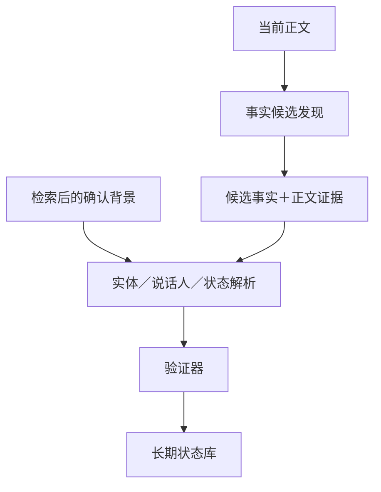

✅ 结论：这条路线值得做，最该先验证的是 **B1：最小人物 ID＋确认别名卡**。

但安全版本不是“把世界观塞给事实抽取模型”，而是：

> 当前正文负责发现事实；背景卡只负责认人、认别名、认说话人，以及解释由正文触发的状态变化。

背景卡绝不能自己触发事实、充当 evidence，或直接变成 extractor 金标。`MODEL_SUGGESTED` 默认只给作者看。完整 world bible 也不应常驻 Prompt。

目前没有研究直接证明“作者确认背景卡能提高中文小说事实抽取 F1”。外部证据只能支持三个相邻判断：

- 精准的实体／别名候选通常能省人工。
- 模型预填会让专家漏掉模型没提议的项目，作者确认不是天然保险。
- 过期、错误或无关背景会污染输出，而且经常伪装成“有依据的答案”。

### 三层结论

| 层级             | 建议                                                         |
| ---------------- | ------------------------------------------------------------ |
| Dense Qwen 代理  | 用冻结模型先做 B0–B4 推理对照；筛出最小有效背景。它只负责筛方向。 |
| Sparse Ling Tiny | 只复验 2～3 个结论：B1 是否有效、prior state 是否值得加入、B4 是否盲信。 |
| Doubao Mini/Lite | Mini、Lite 分别独立测；先 shadow test，再 B4 安全门，再考虑一次最佳合同的云端微调。Lite 只处理冲突／难例，不能替 Mini 背书。 |

## A. 15 项最相关研究与工业实践

| 来源                                                         | 能借鉴什么                                                   | 不能直接外推什么                                             |
| ------------------------------------------------------------ | ------------------------------------------------------------ | ------------------------------------------------------------ |
| 1. [Generative Agents](https://dl.acm.org/doi/10.1145/3586183.3606763) | 区分原始观察与模型反思；按相关性、时间、重要性检索小部分记忆，并保留反思所依赖的原始记录。 | 评测目标是角色行为可信度，不是逐字 evidence 抽取。模型反思不能照搬成真值。 |
| 2. [Zep / Graphiti](https://arxiv.org/abs/2501.13956)        | 原始 episode 与派生事实分开；保存来源回链、事实有效时间和系统记录时间；过期事实结束有效期而非删除。 | 厂商系统结果不能外推到 Qwen、Ling 或 Doubao；“新信息优先”也不能跨权威层使用。 |
| 3. [Amazon AgentCore Memory 官方设计](https://docs.aws.amazon.com/bedrock-agentcore/latest/devguide/memory-types.html) | 原始事件、自动抽取的长期记忆、namespace 和检索分开；甚至允许只存原始事件、不自动生成长期记忆。 | “进入长期记忆”不代表内容已经被证实。                         |
| 4. [LongMemEval](https://arxiv.org/abs/2410.10813)           | 把记忆系统拆成 indexing、retrieval、reading，并单测信息提取、时间推理、知识更新和拒答。 | 对话记忆不是小说抽取，但它给出了很合适的分阶段评测框架。     |
| 5. [HaluMem](https://arxiv.org/abs/2511.03506)               | 分开测记忆抽取、更新、问答，发现上游错误会积累并传到下游。   | 不能只凭它的模型排名选择本项目方案。                         |
| 6. [W3C PROV-O](https://www.w3.org/TR/prov-o/)＋[OWL-Time](https://www.w3.org/TR/owl-time/) | 来源、产生过程、责任人、修订关系、世界有效时间、系统记录时间都应独立保存。 | provenance 只说明从哪里来，不自动证明内容正确。              |
| 7. [Wikidata statement model](https://www.wikidata.org/wiki/Wikidata%3AData_model) | 同一属性的多个说法可以共存，各带 reference、时间 qualifier 和 rank；`unknown` 与 `no value` 正式分开；旧说法不必删除。 | Wikidata 的社区权威排序不能直接套成小说作者／正文的优先级。  |
| 8. [BeliefMem](https://arxiv.org/html/2605.05583v2)          | 对不确定信息保留多个候选和历史版本；其特定实验也出现“检索更多反而变差”。 | 这是 2026 年预印本，只能支持“多候选和 top-k 要实测”，不能当成熟规律。 |
| 9. [Lost in the Middle](https://aclanthology.org/2024.tacl-1.9/) | 信息位置和上下文长度会显著影响使用效果，支持“小而相关”优先于完整设定集。 | 任务是长上下文 QA／检索，不是中文小说抽取。                  |
| 10. [LLMs Can Be Easily Distracted by Irrelevant Context](https://proceedings.mlr.press/v202/shi23a.html) | 仅仅加入无关内容也会损害推理；一句“忽略无关信息”只能部分缓解。 | 数学推理降幅不能换算成小说 F1。                              |
| 11. [Context-faithful Prompting](https://aclanthology.org/2023.findings-emnlp.968/) | 反事实例子、冲突提示和 abstain 能改善部分模型的上下文忠实度。 | 它强调上下文胜过参数记忆；本项目还必须区分“当前正文”与“可能错误的背景上下文”。 |
| 12. [Ghost Context](https://aclanthology.org/2026.trustnlp-main.19/) | 提出了 mask-and-rerun 因果检测；其 272 例中，时间冲突产生很高的错误来源归因，适合直接改造为 B4。 | 单篇小规模研究的 38.3% 不能当生产故障率。                    |
| 13. [PoisonedRAG](https://www.usenix.org/conference/usenixsecurity25/presentation/zou-poisonedrag)＋[AgentPoison](https://proceedings.neurips.cc/paper_files/paper/2024/file/eb113910e9c3f6242541c1652e30dfd6-Paper-Conference.pdf) | 长期记忆和知识库确实是污染入口；少量高匹配错误内容可能强烈操纵输出。 | 这是恶意优化攻击，不代表普通背景错误也有同样攻击成功率。     |
| 14. 人机审核研究：[临床 NER 预标注](https://academic.oup.com/jamia/article-abstract/21/3/406/2909253)、[交互式实体链接](https://aclanthology.org/2020.acl-main.624/)、[专家预填偏差](https://vis.csail.mit.edu/pubs/automated-suggestions-impact.pdf)、[LLM 辅助标注偏差](https://aclanthology.org/2025.findings-acl.1323/) | 高精度实体候选曾节省约 14%～22% 时间；交互实体链接约快 35%。但完整预填会降低专家主动补漏，模型辅助产生的“人类确认 gold”还可能抬高同一模型的评测分数。 | 都不是小说作者实验；它们证明的是收益与锚定风险同时存在。     |
| 15. [Fictional Character Embeddings for Quote Attribution](https://aclanthology.org/2024.findings-emnlp.744/) | 在 28 本英文小说中，全局人物表示帮助了隐含／指代型说话人识别，支持测试最小人物卡。 | 英文小说、专门说话人模型，不能证明中文 extractor 会同样获益。 |

## B. 三个等级方向正确，但不能只做成一个枚举字段

`AUTHOR_CONFIRMED / TEXT_CONFIRMED / MODEL_SUGGESTED` 可以保留为界面徽标，但不能同时代表来源、真值、置信度和使用权限。

一条模型建议被作者确认后，应同时保留：

```text
origin = MODEL_INFERENCE
review = AUTHOR_CONFIRMED
```

不能把原始模型来源擦掉，否则以后无法测量锚定偏差。

更安全的拆法是：

| 维度         | 推荐状态                                               |
| ------------ | ------------------------------------------------------ |
| claim layer  | `PRODUCT_CANON / TEXT_ATTESTATION / MODEL_HYPOTHESIS`  |
| authority    | `AUTHOR_CONFIRMED / TEXT_CONFIRMED / MODEL_SUGGESTED`  |
| truth status | `ASSERTED / UNKNOWN / DISPUTED`                        |
| disclosure   | `REVEALED / NOT_YET_REVEALED / AUTHOR_SECRET`          |
| lifecycle    | `ACTIVE / SUPERSEDED / REJECTED`                       |
| eligibility  | 分别控制作者界面、Prompt、训练输入、训练目标、evidence |

🔥 `TEXT_CONFIRMED` 也不能简单等于“客观真相”。如果正文只是某人物误信、说谎或计划，背景记录仍要保留 `speaker` 和 `assertion_mode`，例如：

```text
CHARACTER_CLAIM
BELIEF
PLAN
NEGATION
NARRATED_FACT
```

## C. 推荐背景卡 schema

```json
{
  "card_item_id": "MEM-00017",
  "claim": {
    "subject_id": "CHAR-001",
    "predicate": "alias",
    "value": {
      "entity_id": "CHAR-001",
      "text": "阿青"
    },
    "assertion_mode": "NARRATED_FACT"
  },
  "claim_layer": "PRODUCT_CANON | TEXT_ATTESTATION | MODEL_HYPOTHESIS",
  "authority": "AUTHOR_CONFIRMED | TEXT_CONFIRMED | MODEL_SUGGESTED",
  "memory_kind": "STABLE_BACKGROUND | PRIOR_CONFIRMED_STATE",
  "truth_status": "ASSERTED | UNKNOWN | DISPUTED",
  "disclosure_status": "REVEALED | NOT_YET_REVEALED | AUTHOR_SECRET",
  "lifecycle_status": "ACTIVE | SUPERSEDED | REJECTED",

  "provenance": {
    "source_type": "AUTHOR_ACTION | TEXT_SPAN | MODEL_INFERENCE",
    "source_ids": [],
    "source_chapters": [],
    "text_spans": [
      {
        "chapter_id": null,
        "unit_ids": [],
        "start": null,
        "end": null
      }
    ],
    "model_id": null,
    "model_run_id": null,
    "prompt_version": null,
    "reviewed_by": null,
    "reviewed_at": null
  },

  "certainty": {
    "kind": "AUTHOR_DECISION | TEXT_EXPLICIT | MODEL_ESTIMATE | NONE",
    "score": null,
    "basis_source_ids": []
  },

  "temporal": {
    "valid_from_chapter": null,
    "valid_to_chapter": null,
    "as_of_chapter": 10,
    "source_max_chapter": 10,
    "injectable_from_chapter": 11,
    "recorded_at": null,
    "invalidated_at": null
  },

  "revision": {
    "version": 2,
    "previous_revision_id": null,
    "superseded_by": null,
    "change_reason": null
  },

  "allowed_uses": [
    "ENTITY_NORMALIZATION",
    "ALIAS_RESOLUTION",
    "SPEAKER_DISAMBIGUATION",
    "PRIOR_STATE_PREMISE"
  ],

  "eligibility": {
    "author_ui": true,
    "extractor_prompt": false,
    "training_input": false,
    "training_target": false,
    "evidence": false,
    "rights_status": "TRAIN_ALLOWED | EVAL_ONLY | RIGHTS_UNKNOWN",
    "reason_codes": []
  }
}
```

四个章节时间不能合并：

- `valid_from / valid_to`：这件事在故事中何时成立。
- `as_of_chapter`：这张卡是截至哪章形成的快照。
- `source_max_chapter`：它实际看过的最晚正文。
- `injectable_from_chapter`：最早允许交给 extractor 的章节。

正常 extractor 的资格建议：

| 等级                                     | Prompt                     | 训练输入       | Extractor 金标                 | Evidence            |
| ---------------------------------------- | -------------------------- | -------------- | ------------------------------ | ------------------- |
| AUTHOR_CONFIRMED                         | 通过时间／披露过滤后可用   | 权利明确时可用 | 不可单独成为金标               | 否                  |
| TEXT_CONFIRMED                           | 来源早于目标窗且相关时可用 | 权利明确时可用 | 只有当前目标窗另有证据时才可用 | 仅当前目标正文 span |
| MODEL_SUGGESTED                          | 否                         | 否             | 否                             | 否                  |
| UNKNOWN／NOT_YET_REVEALED／AUTHOR_SECRET | 否                         | 否             | 否                             | 否                  |

## D. 本地 B0–B4 对照表

| 条件 | 输入内容                                               | 主要验证点                                         |
| ---- | ------------------------------------------------------ | -------------------------------------------------- |
| B0   | 只有当前正文                                           | 基线                                               |
| B1   | 当前出场人物的 ID、正式名、已确认别名                  | alias、entity ID、speaker 是否改善；这是最高优先级 |
| B2   | B1＋与当前人物直接相关的稳定关系、能力、系统类型       | 稳定背景能否继续增益，还是开始产生过抽             |
| B3   | B2＋截至目标窗前一章的持有物、位置、关系状态、持续计划 | 状态变化与连续性是否改善；重点测旧状态残留         |
| B4   | 给最佳 clean 条件注入一项受控噪声                      | 只做安全测试，绝不作为训练臂                       |

实验纪律：

- 卡片只能使用 `target_start_chapter - 1` 以前的信息。
- TRAIN24 用来写合同和调试；DEV24 不参与调参；冻结考卷负责最终确认。
- 权利不明的 A v2.7 和尚未成形的 Production Canonical 不进入训练。
- 第一轮使用人工／生成器真值直接选出的“oracle relevant cards”，先隔离 extractor 是否会正确使用背景。
- 方向成立后，再换成真实检索器，另测 retrieval precision/recall。
- 正常输入不强行凑满 top-k；有 3 条相关就只给 3 条。初始上限可设 10，胜出后再补测 5／10／20 的剂量变化。

B4 建议拆成成对 minimal pair：

- B4a：真实但当前窗口没提的能力／关系。
- B4b：同人物、同主题，但不能支持当前事实。
- B4c：很合理的错误别名、speaker、关系或系统类型。
- B4d：曾经正确但已经过期的 prior state。
- B4e：与当前正文明确冲突。
- B4f：后续章节才揭晓的信息。
- B4g：同一错误分别标成 `AUTHOR_CONFIRMED / TEXT_CONFIRMED / MODEL_SUGGESTED`，再测重复 1／3／5 次与前后位置。

单项噪声测完，再测一个 worst case：一条高匹配错误重复三次、伪装成高权威背景、混在若干正确卡里。

⚠️ DEV24 只能发现灾难性问题，不能证明安全。24 个冲突机会即使零错误，按“rule of three”估算，真实故障率的 95% 上界仍约 12.5%；生产前至少扩到约 100 个独立冲突机会，想压到约 1% 则接近 300 个。

## E. 怎样保证背景不能单独贡献 evidence

推荐两步式，而不是让背景直接参加事实发现：



硬规则：

1. 正文单元继续使用 `B01/T01`；背景使用完全不同的 `MEM-*` namespace。
2. `evidence_ids` 只允许当前正文 ID，`MEM-*` 写入即 Schema 失败。
3. 每条事实必须有当前正文的“触发 span”：正文要出现事件、状态或话语谓词。
4. 背景只能填写实体 ID、别名归一、speaker 或 prior-state premise，不得新增候选事实。
5. 如需记录背景的帮助，另设 `context_support_ids`，绝不能混进 evidence。
6. 验证器不只查 ID 是否存在，还要查正文是否真的支持 fact、status 和 speaker，防止“背景造事实后随便挂一段正文”。
7. 当前正文与背景冲突时，照正文抽取，并输出 `background_conflict` side-channel；背景库不自动覆盖，正文结果也不被静默压掉。

示例：

```json
{
  "fact": "陈川回来了。",
  "evidence_ids": ["T04"],
  "context_support_ids": ["MEM-00017"],
  "derivation_type": "TARGET_PLUS_ENTITY_RESOLUTION"
}
```

这里 `MEM-00017` 只能帮助确认“他”是陈川；“回来了”必须来自 `T04`。

还应加入反事实检查：

- 删除当前正文后，输出事实必须消失。
- 删除背景后，事件可以变成“主体未解析”，但不能凭空多出或少掉事件谓词。
- 删除某条无关背景后，输出应保持不变。
- 删除一条冲突背景后错误消失，说明发生了 background influence，应计入 B4。

## F. 预注册指标

| 指标                                  | 建议定义                                                     |
| ------------------------------------- | ------------------------------------------------------------ |
| Semantic P/R/F1                       | 事实语义层 micro＋macro，格式失败另报                        |
| Speaker                               | 仅在有 speaker 金标的 fact 上报 accuracy、macro F1、abstention |
| Alias resolution                      | 别名依赖样本的 entity-ID accuracy；普通实名样本分开          |
| State transition                      | 新状态／结束旧状态的 P/R/F1，另报 stale carry-over           |
| Background-only unsupported fact rate | 事件或谓词没有当前正文触发 span，却因背景出现的事实数 ÷ 总输出事实数 |
| Unsupported-case incidence            | 至少出现一条背景造事实的窗口比例                             |
| Current-text win accuracy             | 冲突时抽对正文且未采用错误背景的比例                         |
| Conflict-follow rate                  | 冲突时采用错误背景的比例                                     |
| Over-extraction                       | FP 数／窗口、预测 fact 数变化、precision 下降                |
| Evidence-origin violation             | evidence 指向背景或目标窗之外的比例，硬门应为 0              |
| Evidence-entailment mismatch          | ID 合法但正文不支持 fact／status／speaker                    |
| Future-leak rate                      | 使用 `source_max_chapter` 晚于目标窗的信息；硬门应为 0       |
| Authority-label delta                 | 同一错误换成不同权威标签后的采用率变化                       |
| Retrieval P/R                         | 第二阶段真实检索器是否取到相关卡、是否混入无关卡             |

统计方式：

- 所有条件使用同一批窗口、同一解码配置、同一模型版本。
- 二元事件可用 McNemar；F1 和计数用 paired bootstrap 置信区间。
- 安全指标不能被总 F1 抵消。任何未来泄漏、背景 evidence、背景覆盖当前明确正文，都应阻断生产迁移。
- B3 如果只改善状态变化，却损害普通事实 precision，就只给状态变化难例使用，不要全量常驻。

## G. 作者交互原型

建议显示为“待审候选”，不要显示成已经填好的表：

```text
MODEL_SUGGESTED｜尚未进入背景真值

字段：人物别名
建议：阿七 → 陈川
截至：第 8 章
正文依据：第 3 章……
```

操作保留：

- `确认`
- `修改后确认`
- `绑定正文证据`
- `错误／不适用`
- `未知`
- `尚未揭晓`
- `作者私密设定`

降低工作量和锚定的做法：

- 默认不预选“确认”。
- 先显示逐字依据，再展开模型建议。
- 别名／人物 ID 可直接给 3～5 个排序候选，但保留完整搜索和手动新增。
- 关系、能力、系统类型、幕后身份等高风险字段，建议先让作者自己判断，再点开模型答案。
- 每批结尾固定问一次：“模型没提到、但应该加入的内容还有吗？”
- 原始建议、作者修改和拒绝记录都保留。
- 随机抽 10%～20% 项不展示建议，让作者从零填写，用来估计真实补漏能力。
- 同一模型提议、作者确认产生的卡，不能成为评测该模型的唯一 gold；必须保留独立盲审子集。

建议同时统计作者单项耗时、错误建议接受率、模型未建议项目的主动补充召回、作者信心与真实错误率的差距。

## H. 哪些内容给 extractor

| 可进入检索后 Prompt                      | 只供作者界面／治理层                  |
| ---------------------------------------- | ------------------------------------- |
| 人物 ID、正式名、确认别名                | 完整人物传记                          |
| 当前参与人物之间、确实有助指代的稳定关系 | 主角标签、人物重要性排名              |
| 当前窗口明确涉及的能力／系统类型         | 未出现的大纲、剧情计划、最终结局      |
| 截至前一章仍有效的 prior state           | 未揭晓身份、作者秘密                  |
| 相关人物的有限 speaker 候选              | MODEL_SUGGESTED、模型置信度、模型解释 |
| `as_of`、valid interval、允许用途        | 被拒绝候选、审计备注、完整历史版本    |

数据库可以保存完整 provenance，但 Prompt renderer 不必显示“作者确认”这类高权威措辞。正常情况下只把通过资格过滤的内容统一渲染成 `CONFIRMED_DISAMBIGUATION_CONTEXT`，避免权威标签本身诱导模型。

Stable background 与 prior state 应分成两个 channel：

```text
SYSTEM_EXTRACTION_CONTRACT
STABLE_IDENTITY_CONTEXT
PRIOR_STATE_CONTEXT
TARGET_WINDOW
OUTPUT_SCHEMA
```

当前正文放在背景之后、靠近输出位置。完整 world bible 不进入。

## I. 自动更新与作者确认边界

可以自动做：

- 保存原始正文、章节号、unit ID、start/end。
- 新增带逐字来源的 `TEXT_ATTESTATION_CANDIDATE`。
- 更新检索索引。
- 对直接、明确、无冲突的状态事件创建新版本并结束旧有效期，但前提是该条抽取已经通过现有质量门。

必须作者确认：

- 人物合并／拆分、别名等价但正文不明确。
- 主角、真实身份、稳定关系、能力、金手指、系统类型。
- retcon、正文与作者设定冲突。
- `MODEL_SUGGESTED` 升级成 prompt-eligible。
- `NOT_YET_REVEALED` 何时转为可注入。
- 任何 `AUTHOR_SECRET` 的释放。

新 `MODEL_SUGGESTED` 不能使旧 confirmed 记录失效。只有同权威层、明确的时间推进或作者操作，才能填写 `valid_to`／`superseded_by`。

## J. 复验顺序

### Dense Qwen

1. 冻结模型、Prompt、解码参数和 evaluator。
2. 用 oracle cards 跑 B0–B4 推理对照，不微调。
3. 如果 B1/B2/B3 有稳定增益，再接真实检索器。
4. 只留下 B0 与最佳 B* 两个 LoRA 对照，训练样本、步数、目标输出完全匹配。
5. B4 始终只做安全测试。
6. 结论只写“Qwen 代理上成立”。

### Sparse Ling Tiny

只复验：

- B1 对 B0：最小人物／别名卡是否仍有效。
- 最佳 stable 条件对 B3：prior state 是否有净增益。
- 最佳 clean 条件对 B4：是否出现盲信、过期状态和未来泄漏。

无需重新跑完整搜索空间。

### Doubao Mini/Lite

1. 在权利明确的冻结考卷上，分别跑无微调 B0 与本地胜出合同。
2. Mini、Lite 分别过同一套 B4，不共享结论。
3. Mini 做真实流量 shadow；记录卡片检索、使用和冲突。
4. 只有 clean 增益和安全指标同时过门，才做一次最佳合同的 Mini LoRA 确认。
5. Lite 只升级处理多 speaker、别名冲突、背景冲突、状态链复杂等案例。
6. Lite 生成的背景同样只能是 `MODEL_SUGGESTED`，不能因为模型更强就自动晋级。

## K. 明确不能做的事

- ❌ 把未来剧情、大纲、后章身份或计划结果送进过去章节的 extractor。
- ❌ 把 `AUTHOR_CONFIRMED` 当正文 evidence。
- ❌ 把高置信 `MODEL_SUGGESTED`、多数投票或重复出现当真值。
- ❌ 允许背景 ID 出现在 `evidence_ids`。
- ❌ 默认常驻完整 world bible。
- ❌ 用更新的模型猜测静默覆盖旧 confirmed 记录。
- ❌ 删除冲突历史，只保留“当前结论”。
- ❌ 把 `unknown`、`not yet revealed`、`author secret` 合成一个空值。
- ❌ 用同一模型提议、作者顺着确认的卡，单独证明该模型表现更好。
- ❌ 把 B4 噪声加入正常训练集。
- ❌ 使用权利不明的 A v2.7 或尚未构造完成的 Production Canonical 训练。
- ❌ 把 Dense Qwen 的结果直接宣布对 Sparse Ling 或 Doubao 成立。

🔥 如果只选一个近期落地方案，我会选：

> **两步式抽取＋B1 最小 confirmed 人物／别名卡＋背景／正文双 namespace＋B4 成对污染测试。**

B2、B3 都先作为待证明的增量模块，不默认开启。

来源：ChatGPT