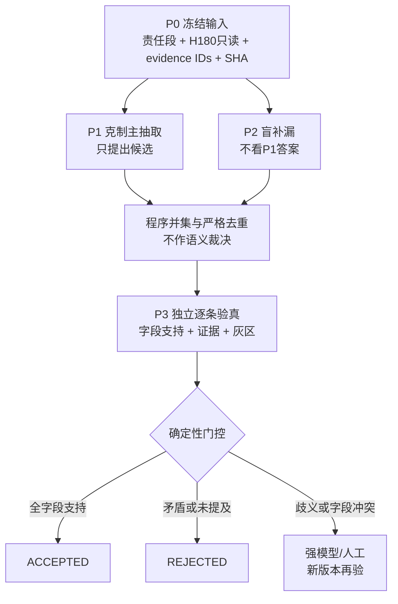

# 小说事实抽取多步管线调查：主抽取＋独立补漏＋逐条验真

日期：2026-08-11  
结论性质：外部研究先验＋四章本地待终审结果的下一格实验设计；不是生产放行结论

## 一句话结论

**有条件采用为下一格候选，但不能宣称已经“稳定修到可用”。** 最有依据的最小路线是：克制主抽取与盲补漏先形成候选并集，独立验真器只对单条事实及其字段作“支持／冲突／未提及／歧义”判断，程序负责严格去重、状态机和放行；灰区进入更强模型或人工。召回靠候选并集，精度靠逐条验真，二者之间用“灰区而非硬删”隔开。

现有研究不支持把“同一模型看到旧答案后整表反思、重写”当作主路线。它可能让文字更顺，却没有足够相似任务证据证明事实级 Precision/Recall 一起改善；在没有外部反馈时，LLM 自我纠错还可能把正确项改错。相反，候选生成—重排／验证—确定性门控在信息抽取、实体链接、事实核验和工业 groundedness 检查中有多来源先例，但这些只是结构性先验，**不能外推为当前四章、Mini、Lite 或生产环境已经有效**。

## 决策摘要

| 问题 | 决策 |
|---|---|
| 是否采用“主抽取＋盲补漏＋逐条验真＋程序门控” | 采用为下一格实验候选；通过统一盲审后再决定 |
| 是否采用同模型整表自检重写 | 否决为默认路线；仅保留为消融对照，不可自动覆盖原结果 |
| 补漏器是否看主答案 | 架构证明阶段绝不能看主答案、模型身份、置信度、理由或候选数量；只看同一冻结文本、规则和证据编号 |
| 验真器是否改写事实 | 不得“改写并批准”；只能逐字段判定、给证据、报灰区。任何语义修补都生成新版本并重新验真 |
| 不降召回的关键 | 不把“不确定”当“错误”硬删；将其送入灰区。只有在同批盲审中证明真候选存活率足够高，才能自动拒绝 |
| 模型家族 | 不按厂商配额；不同家族只是一项风险控制，真正保留条件是错误互补或验真校准通过 |
| 当前四章能否定案 | 不能。4/4 格式成功的 Wilson 95% 下界仅约 0.51；这只是冒烟筛，不是稳定性证据 |

## 1. 当前本地结果意味着什么

以下均沿用本地“待人工复核”口径，不把区间估分当作金标：

| 条件 | 完成/格式 | 预测数 | 宽松 P/R/F1 | Token | 时延 | 暂定角色判断 |
|---|---:|---:|---:|---:|---:|---|
| GLM 5.2 official，最低思考 | 4/4，4/4 | 30 | .667/.692/.679 | 5,524 | 20.5s | 克制主抽取 P1 的当前首选 |
| DeepSeek V4 Flash official，不思考 | 4/4，4/4 | 43 | .525/.808/.636 | 6,070 | 34.4s | 低成本补漏挑战者 |
| DeepSeek V4 Pro official，最低思考 | 4/4，4/4 | 67 | .387/.923/.545 | 6,997 | 61.0s | 高召回补漏 P2 的当前首选 |
| Doubao Seed 2.0 Lite official，最低思考 | 4/4，4/4 | — | .278/.769/.408 | 8,306 | 33.4s | 只能参加专用验真试镜，不能凭抽取分入选 |
| Ling 3.0 Flash，思考开，8,192 | 4/4，4/4 | 73 | .279/.731/.404 | 27,597 | 88.4s | 硬淘汰出前三至四；最多留诊断档 |

Ling 相对 DeepSeek V4 Pro：Token 约为 3.94 倍、时延约为 1.45 倍，召回低 0.192，F1 低 0.141。除非人工终审证明它恢复了其他候选都没有的关键必抽事实，否则没有角色价值，不能因厂商多样性保留。

GLM＋DeepSeek Pro 并集暂估覆盖 24/26 至 25/26 条必抽事实，说明“候选可见性”可能已接近上限；但并集误报多，所以接下来应测试的是验真后的净效果，而不是继续堆第四个高召回器。

## 2. 外部证据对四条路线的判决

| 路线 | 相似领域的现成证据 | 能推断什么 | 不能推断什么 | 本项目判决 |
|---|---|---|---|---|
| 1. 同模型看到旧答案后整表自检重写 | [Chain-of-Verification](https://arxiv.org/pdf/2309.11495) 表明“分解且隔离”的验证比直接联合生成更好；[Huang 等，ICLR 2024](https://arxiv.org/pdf/2310.01798) 发现无外部反馈的内在自我纠错经常退化 | 旧答案会形成锚定；验证问题与原回答隔离更合理 | 不能证明小说 IE 的事实级 P/R 改善；流畅度提升不是正确性提升 | **否决为默认方案** |
| 2. 同模型、隔离角色、遮蔽旧答案，只补漏或核字段 | CoVe 的 factored 设计让验证步骤不看原答案；开放式核查比容易“同意”的是/否问题更稳 | 输入隔离、字段化任务有降低相关错误的依据 | 同一权重仍可能共享盲点；不能自动批准 | **可作低成本对照或补丁工**，不得自签放行 |
| 3. 不同家族主抽取＋补漏＋逐条验真 | [SCORE](https://arxiv.org/pdf/2404.17140) 显示弱验证器会使最终准确率下降 11.2 点，强验证器只提升 3.6 点；[模型自偏好研究](https://arxiv.org/pdf/2404.13076) 和 [MT-Bench judge 分析](https://arxiv.org/html/2306.05685v4) 记录了自家答案偏好、位置与冗长偏差 | 独立模型能降低部分相关性，但必须用本地标签校准；验证器质量决定净效果 | “不同厂商”不等于独立，也不保证更准确 | **主候选**，但需盲化、随机顺序和本地硬负例 |
| 4. 生成候选＋小型判别器验真＋程序门控 | [MiniCheck](https://aclanthology.org/2024.emnlp-main.499.pdf) 用 770M 专用模型在其 groundedness 基准上接近 GPT-4 且成本大幅更低；[ARES](https://aclanthology.org/2024.naacl-long.20/) 用轻量 judge＋少量人工标签作域内评估；Google、Azure、NVIDIA 均提供 claim/evidence groundedness 或事实检查实践 | 专用判别器可能成为便宜门控；程序适合结构、ID、状态机与阈值 | 英文 groundedness/二分类成绩不能直接迁移到中文小说中的说话人、时态、计划/实际和局部责任边界 | **中期目标**；下一格先做校准，不直接放生产 |

工业实践只证明这种组件形态存在：Google 的 [Check Grounding](https://docs.cloud.google.com/generative-ai-app-builder/docs/check-grounding) 返回 claim 级分数与引文并允许阈值；Azure 提供 [groundedness 检测与 correction](https://learn.microsoft.com/en-us/azure/ai-services/content-safety/concepts/groundedness)；NVIDIA 的 [fact-checking rail](https://docs.nvidia.com/nemo/guardrails/configure-guardrails/guardrail-catalog/fact-checking) 明确依赖所给证据，并建议在通用提示不可靠时使用专用 verifier。它们没有发表与当前中文小说抽取等价的端到端 P/R 保证。

候选生成的基本规律也支持本设计：在 slot filling 和实体链接中，高召回候选生成先给下游重排器一个“可救回”的集合；漏在候选集外的真项，后级无法恢复（参见 [coarse-to-fine slot filling](https://aclanthology.org/D14-1089.pdf) 与 [实体链接的候选生成/排序](https://aclanthology.org/2021.naacl-main.65.pdf)）。但高召回候选会降低原始精度，必须看最终级联而不是单步分数。

## 3. 推荐的最小三步架构

逻辑上是“生成、验真、门控”三步；P1 与 P2 可并行，因此只增加一个生成关键路径。程序并集不是第四个语义模型步骤。

| 步骤 | 输入 | 输出 | 允许动作 | 禁止动作 | 失败回退 |
|---|---|---|---|---|---|
| P0 冻结与编号 | 完整自然责任段、只读前后文 H180、不可变 evidence ID、文本 SHA、抽取 Schema | 一份可复现输入包 | 标记责任区与只读区；校验编号、长度、SHA | 不改小说文本；不把 H180 编成可引用证据 | 输入不一致即停，不调用模型 |
| P1 克制主抽取 | P0 输入包 | 结构化候选；每项含字段、责任区证据 ID 与原文摘录 | 新增候选；显式报无事实 | 不审批自己；不引用责任区外证据；不猜缺失字段 | 格式/截断失败记为该块失败；实验格不自适应重跑 |
| P2 盲补漏 | 与 P1 完全相同的 P0 输入包 | 独立候选集 | 只补自己发现的事实 | **不得看** P1 自然语言、候选数、覆盖摘要、模型身份、置信度、理由；不得删除或改 P1 | 若成本实验以后要用 coverage mask，只能给 evidence IDs/跨度，且另立消融，不能混入本次架构证明 |
| 程序并集/去重 | P1、P2 原始候选及版本号 | 精确重复组、近重复冲突组、未合并候选 | 规范空格、实体 ID、确定性字段；合并完全等价项 | 不凭语义多数票；不把两个模型同意当作更真；不吞掉状态/时间/说话人冲突 | 不能确定等价即保留为冲突组，交给验真器 |
| P3 逐条验真 | 单个候选的字段矩阵；完整责任段；所引证据附近文本；H180 明确标为只读 | 字段级状态、总状态、精确证据 ID/摘录、歧义原因 | 输出 SUPPORTED、PARTIAL_FIELD_CONFLICT、CONTRADICTED、NOT_STATED、AMBIGUOUS | **不得看**来源模型/角色/置信度/理由/其他候选/金标；不得改写后立即批准；不得自行签发 ACCEPTED | 信息不足、共指不清或跨段冲突一律 AMBIGUOUS |
| 程序门控 | 候选版本、验真标签、结构规则、阈值 | ACCEPTED / REJECTED / PROVISIONAL | 全字段支持才自动接收；确定矛盾/未提及才拒绝；灰区升级 | 程序不判断语义；模型不能给自己绿票 | 新语义补丁生成新 candidate_version，再走盲验真；高风险灰区转强模型或人工 |

### 为什么这条路线可能“提精度而不牺牲完整召回”

严格说，**任何会自动删除候选的验证器都不能保证召回不降**。可落地的办法不是许诺零损失，而是把路径拆成三类：

1. 明确支持：自动接收。
2. 明确矛盾或责任段未提及：自动拒绝，但只有在校准集证明误拒率可接受后开启。
3. 不确定、部分字段冲突、证据边界问题：进入 PROVISIONAL，由强模型或人工解决，不计入“自动发布”，但保留在完整系统召回路径内。

因此应同时报告：自动发布集的 Precision/Recall，以及把灰区人工处理后的完整系统 Recall。只报自动集 F1 会掩盖把困难真事实都推给人工的做法。

## 4. 字段级语义与冲突处理

候选的规范指纹至少包含：

`主体实体｜关系/事件｜客体/值｜极性｜现实状态/模态｜认知来源/说话人｜条件｜时间锚｜证据跨度`

程序只在这些高风险字段全部一致时合并不同表述；表面措辞不同但指纹相同可视作同一事实。以下项目不得自动合并：

- “计划/希望/声称/猜测”与“已经发生/客观为真”；
- 肯定与否定，永久状态与临时状态；
- 不同说话人、叙述者与角色认知；
- 不同时间点、回忆与当前时线；
- 无条件事实与只在特定条件下成立的事实；
- 责任段内证据与只读前后文推断。

若候选主体、时间或说话人不清，验真器只能标出冲突字段和证据，不能“顺手修成看起来合理的版本”。语义修补形成新版本；旧版本保留审计链，新版本必须再次被一个看不到修补理由的 verifier 检查。

## 5. 第一轮 API 初筛：硬淘汰标准

这些阈值是为下一格预注册的 **DEV 决策门**，不是行业通行标准。每个 endpoint、模型版本、思考设置和输出上限视为不同条件。

### 5.1 机械门：先淘汰不可用条件

| 指标 | 硬门 | 用法 |
|---|---:|---|
| 调用完成率 | 本次四块必须 4/4；无 HTTP/服务失败 | 3/4 条件不得进入角色决赛；可留诊断档 |
| JSON/Schema 完成率 | 4/4 可解析且 Schema 合法 | 截断后“部分可读”仍算失败；不手工修 JSON |
| 证据越界 | 无效 evidence ID、H180 充证据、责任区外证据均为 0 | 任一越界即淘汰自动发布角色；可在研究档分析 |
| 引文一致性 | 100% 为对应 evidence ID 的逐字子串 | 不允许模型伪造摘录；程序直接检查 |
| Token 截断 | 0 | 达到上限且结构未闭合视为格式失败，不能靠增大上限掩盖无限扩张 |

四块全过只说明“可以继续测”。Wilson 95% 区间下界约 0.51；3/4 的下界约 0.30。因此生产稳定性必须用更多、按章节聚类的样本另证。

### 5.2 角色门：不能按总 F1 机械取前四

| 角色 | 预注册语义门 | 互补/成本门 |
|---|---|---|
| P1 克制主抽取 | 人工终审后 P ≥ 同批最佳稳定主抽取 P−0.03；R≥0.60；F1≥0.60；每个非空块至少 1 TP，最差块 F1≥0.40 | 在质量相当时选候选更少、Token/时延更低者 |
| P2 高召回补漏 | R≥0.85；与 P1 并集达到 ≥24/26 或 ≥0.92；至少新增 2 个 P1 漏掉的必抽真项 | 计算每恢复 1 个新增 Gold 带来的独有 FP 与增量 Token；无独有 TP 即淘汰 |
| V 不同家族逐条验真 | **不看抽取 F1 选。** 在独立 claim 校准集上，使自动接收 Precision 的双侧 95% CI 下界≥0.90；高风险硬负例不得误放行；真候选存活率须使端到端召回不劣于 P1 | 同时报告误拒、误放、灰区率、Brier/ECE（若输出概率）；未通过就空缺，不为多样性凑数 |
| L 可选低成本角色 | 与强角色最多相差 1 个 Gold，且 Token 或时延≤强角色 50%；或证明有不可替代的新增 TP/纠错 | 若在所有必要质量指标上被另一条件支配，或成本>同角色中位数 2 倍且无独特贡献，淘汰 |

自动接收 Precision 的 95% CI 下界≥0.90 是既有生产护栏。即使乐观假设样本独立且零错误，双侧精确区间也大约需要 36 个自动接收真项才可能跨过该门；章节内事实相关会进一步增加所需章节数。四章不够签生产票。

### 5.3 错误互补怎么用

对每个候选模型 `j`，至少计算：

- 新增真项：`ΔTP_j = |TP_j \ TP_P1|`；
- 并集召回增益：`ΔR_union = R(P1 ∪ j) − R(P1)`；
- P1 与 j 的 FN Jaccard、FP 语义簇重叠率；
- `独有 FP / 新增 TP`，以及 `增量 Token / 新增 TP`；
- 验真后的 TP 存活率、FP 拒绝率、误放行率、误拒率和灰区率；
- 最终 `ΔP、ΔR、ΔF1`，按章节报告最差值。

“不同家族”只是减少相关风险的先验，不是留人理由。若两个模型错误高度重合，留下更便宜、更稳的一个；若同一家族的 Flash 以很低成本恢复 Pro 的大部分独有真项，它可以作为低成本挑战者，但不能同时充当 Pro 候选的独立验真器。

## 6. 只留下三到四个预注册条件

| 条件 | 下一格职责 | 留下原因 | 当场淘汰条件 |
|---|---|---|---|
| GLM 5.2 official／最低思考 | P1 克制主抽取；也提供 Arm A/B 的同一基线 | 当前四块 P/F1 最好、4/4 格式、成本最低一档 | 人工终审后 P/F1 跌破 P1 门，或出现章节级零 TP/证据越界 |
| DeepSeek V4 Pro official／最低思考 | P2 高召回补漏 | 当前 R≈.923，最接近补漏角色；与 GLM 并集估计 24/26–25/26 | 新增 TP<2，或每新增 TP 的 FP/Token 负担超过 Flash 且无关键独有项 |
| DeepSeek V4 Flash official／不思考 | P2 的低成本挑战者，只争一个最终补漏席位 | F1 高于 Pro、Token/时延更低；测试是否能用较少成本保住足够并集召回 | 与 P1 并集未过召回门；或 Pro 有不可替代关键 TP 且总成本仍可接受 |
| Doubao Seed 2.0 Lite official／最低思考 | **仅作不同家族 verifier 试镜**，不是已入选的验真器 | 4/4 接口完整、时延尚可；现有抽取分不能证明验真能力 | claim 校准的误放/误拒/灰区任一未过门即删除该席位；宁可空缺或升级强模型，也不为厂商数保留 |

这不是“总榜前四”。最终应是 3 个左右：一个 P1、Pro/Flash 二选一的 P2、一个通过专用 claim 校准的 V；只有低成本挑战者确有价值时才保留第四条件。Ling 3.0 Flash 现在被硬淘汰；Qwen 高思考的格式、Token 和时延问题，以及其他 3/4 格式条件，也先淘汰。

## 7. 下一格：同批、一次跑完、统一盲审

### 7.1 预注册与冻结

- 抽样：至少 24 个从未用于调提示的责任块，优先 48 个；按小说/章节成簇。必须覆盖空/稀疏、多事实、代词与零主语、说话人/认知来源、否定、计划与现实、条件、时间/回忆、证据边界。若只能继续用四块，结果只能叫 DEV 冒烟。
- 固定：模型精确版本、endpoint、思考档、max tokens、temperature、stop、重试策略（建议实验格 retry=0）、Schema、提示 SHA、证据规则、合并键、门控规则和人工标签手册。
- 一次完成：所有生成候选在同一冻结批次各跑一遍；不得看中途分数后追加重跑、改提示或换上限。
- 统一盲审：把候选规范化、去来源标签、随机顺序；同一语义候选只建立一个人工裁决键，三个实验臂复用该裁决。审核者看不到模型、角色、置信度和成本。
- 验真专用集：从同一批原文构造/收集真候选、自然误报和最小字段变异硬负例，覆盖主语、否定、模态、说话人、时间、条件、部分支持和证据越界；它不向抽取器暴露。

### 7.2 最多三臂消融

| 实验臂 | 组成 | 要回答的问题 | 关键对比 |
|---|---|---|---|
| A 单模型 | P1＋机械 Schema/证据门；不做语义验真 | 当前克制单模型基线是多少 | 原始 P/R/F1、最差章、成本 |
| B 只验真 | 与 A 完全相同的 P1 候选＋P3 逐条验真＋程序门控 | 不增加候选时，验真净提高多少精度、误杀多少真项 | B−A 的 ΔP、ΔR、灰区、误拒、每减少一个 FP 的成本 |
| C 补漏＋验真 | P1＋盲 P2 并集＋同一个 P3＋同一程序门控 | 候选召回增益能否在验真后留下，并把精度拉回可用区 | C−B 的新增 TP、独有 FP、最终 ΔP/ΔR、每恢复一个 Gold 的成本 |

Arm C 可在内部把 Pro 与 Flash 作为预注册的 P2 挑战者分别计结果，但主结论仍只比较三种架构，不把模型调参膨胀成多臂。**不得**把同模型整表重写混进 Arm B；如需保留，它应另记为非晋级诊断，不参与三臂主检验。

### 7.3 采用判据

本轮只在以下条件同时成立时，把 C 晋级到未见确认集：

1. C 的人工终审 Precision 高于 A，且自动接收 Precision 达到预注册护栏；
2. C 的完整系统 Recall 不低于 A，点估计至少持平；正式确认集再用小说/章节聚类的配对 bootstrap 或预注册非劣界（例如 −0.01）；
3. C 相比 B 留下至少 2 个独有必抽真项，而不是只增加灰区和误报；
4. 最差章节、证据边界、说话人、否定、状态、条件、时间各切片均无不可接受退化；
5. 灰区率、调用数、Token 和关键路径时延在产品预算内；
6. 再用一批真正未见责任块确认一次，才讨论 Mini/Lite、训练或生产。

若 B 精度上升但召回明显下降，说明 verifier 是删项器而非可靠门控：提高拒绝门槛，把更多项送灰区。若 C 原始并集召回上升但验真后没有保住，问题在 verifier；若并集本身无新增真项，问题在补漏器，直接删掉 P2。

## 8. 每一步必须记录什么

| 层 | 质量与审计 | 调用/Token/时延 | 灰区与失败 |
|---|---|---|---|
| P0 | 文本 SHA、责任区/H180 边界、evidence ID 数、字符和输入 token | 预处理耗时 | SHA/编号不一致数 |
| P1/P2 | TP/FP/FN、P/R/F1、每章最差值、证据合法率、字段切片、候选数、独有 TP/FP、错误簇 | request ID、模型精确版本、提示 SHA、输入/输出/思考 token、首 token 与总时延、重试数 | 格式失败、Schema 失败、截断、空输出、越界 |
| P3 | 各标签分布、字段级准确率、TP 存活率、FP 拒绝率、误放/误拒、概率校准 Brier/ECE | 每候选与每章调用数、token、批处理大小、时延 | AMBIGUOUS/部分冲突率、验证器分歧、无证据率 |
| 程序门控 | 精确重复数、冲突组数、版本/patch 链、ACCEPTED/REJECTED/PROVISIONAL 数、端到端 P/R/F1、字段切片和最差章 | 程序耗时；总模型时间与关键路径时延 | 规则冲突、人工升级量、灰区解决耗时 |
| 总系统 | 自动发布集与人工完结集分别报告；按小说/章节聚类区间 | 每自动接收 TP 的 Token/费用；每新增 Gold 的增量 Token；每块总调用数 | 灰区占比、人工分钟/章、超 SLA 比例 |

Token 要分输入、可见输出和思考 token；时延既报串行总和，也报实际关键路径。P1/P2 并行时，用户时延更接近两者较大值而不是简单相加，但费用仍应相加。

## 9. 何时必须升级到更强模型或人工

以下情况不得由便宜 verifier 自动决定：

- 主体或说话人依赖跨句共指、零主语、自由间接引语；
- 计划、愿望、假设、传闻、角色信念与客观事实难分；
- 否定范围、条件范围、时间/回忆线、状态变化存在两种合理解释；
- 候选证据彼此冲突，或唯一支撑在只读上下文而不在责任段；
- verifier 与候选器同家族且结论涉及高风险字段，同时没有本地校准证明独立性；
- 修改会改变主体、极性、模态、说话人、条件或时间，而非纯格式规范；
- 新小说/体裁出现训练与 DEV 未见的错误簇，或章节最差值、灰区率超过预注册门；
- 事实将驱动不可逆记忆、发布或高影响后续行为。

人工或强模型仍只能生成/裁决一个新版本，不能直接覆盖审计链。无责任区内精确证据的项不得进入最终事实库。

## 10. 适用与失效条件

### 适用

- 真事实大多已被至少一个生成器提出，且 P1/P2 的 FN 不完全重合；
- 事实可以拆成稳定字段，并能锚定到不可变责任区证据；
- 有足够人工标签校准 verifier，尤其有自然误报和最小变异硬负例；
- 产品能接受一部分 PROVISIONAL 和人工升级；
- 允许程序保留版本、冲突组和来源审计。

### 失效

- P1/P2 的遗漏高度相关，候选并集仍漏关键事实；
- verifier 与 proposer 高度相关，或看到来源、理由和旧答案后形成确认偏差；
- 把“部分支持”压成二分类，导致错误字段被整体放行；[Factcheck-Bench](https://aclanthology.org/2024.findings-emnlp.830.pdf) 显示支持、部分支持、反驳和无关证据并不容易统一判断，错误陈述尤其难验；
- 用英文 groundedness 分数直接给中文小说定阈值；[VeriScore](https://aclanthology.org/2024.findings-emnlp.552/) 也提示不同长文本任务上的核验表现并不自动迁移；
- 一次让模型同时抽取、找证据、修正、审批，任务过载且无法定位错误。后续研究也发现分解粒度对不同 verifier 并无统一收益，必须实测（[Decomposition Dilemmas, NAACL 2025](https://aclanthology.org/2025.naacl-long.320.pdf)）；
- 为追求表面 Precision 把所有困难项推入灰区，却不报告完整召回和人工负担。

## 11. 最终采用/否决判决

**采用：** 将“GLM 克制主抽取＋DeepSeek Pro/Flash 盲补漏二选一＋通过专用校准的不同家族逐条验真＋程序门控”列为下一格。依据是多个相似领域都支持高召回候选集、独立逐条判断和确定性门控的分工，并且本地并集初估显示多数必抽事实已被某个模型看见。

**附条件：** 验真器必须盲化、逐字段、三至五态输出，并在同批人工标签上证明：精度净增、完整召回不退、关键切片无灾难性误放/误拒。不同家族是偏好，不是替代校准的通行证。

**否决：** 同一模型看到整份旧答案后重写整表；验证器“改写并批准”；用多数票提高置信；按总 F1 或厂商数量机械取前四；从四章直接推出 Mini/Lite 或生产可用。

**当前最重要的实证问题只有两个：**（1）DeepSeek 补漏相对 GLM 到底留下多少独有真项；（2）候选级 verifier 能否在保住这些真项的同时拒掉足够多独有误报。下一格若回答不了这两个问题，再复杂的流水线都只是流程感。

## 本地证据锚点（最多 5 条）

1. `TEMP/t5_r04_fresh_novel_four_chapter_model_screen_20260811_r01/all_api_scoring_r02/ALL_API_MODEL_SCOREBOARD.md`  
   SHA-256：`5fe2445a94e5b9e7f41f48f718719fdc172f296a146ad4f19de53f35c6eccb30`；97 次调用、30 个模型条件和当前待审估分。
2. `TEMP/t5_r04_fresh_novel_four_chapter_model_screen_20260811_r01/all_api_scoring_r02/SCORING_RECEIPT.json`  
   SHA-256：`885d38ba669cd88c2f7de4bb4d0c314fc75042f24f2712c24e85865a7277a6dd`；分数为待人工复核区间、1,132 个预测语义复核队列。
3. `references/survey-inbox/packages/T5_R04_FACT_EXTRACTION_RESEARCH_RETURNS_20260811_R01/historical_foundations/20260731_multistep_correction/小说事实抽取_同模型多步纠错与上下文工程方案_20260731.md`  
   SHA-256：`da791323ac085aac258f154e629ede67494cd1def5ceaa60b3383410d4140720`；已调查隔离角色、盲抽取与字段补丁。
4. `references/survey-inbox/packages/T5_R04_FACT_EXTRACTION_RESEARCH_RETURNS_20260811_R01/prior_batches/20260731_batch/returns/03_extractor_independent_validator_pipeline.md`  
   SHA-256：`bbe90a927a00fb8fd6ef76c40d0c756e4b02c1dce872d1a98e85b995c930695e`；已调查独立 verifier 与弱 verifier 风险。
5. `evidence/09_LING_3_FLASH_THINK_ON_SCHEMA_8192_RESULT.md`（附件研究包内）  
   Ling 3.0 Flash 8,192 条件的 4/4 完成、候选数、P/R/F1、Token 与时延凭据。

来源：ChatGPT
