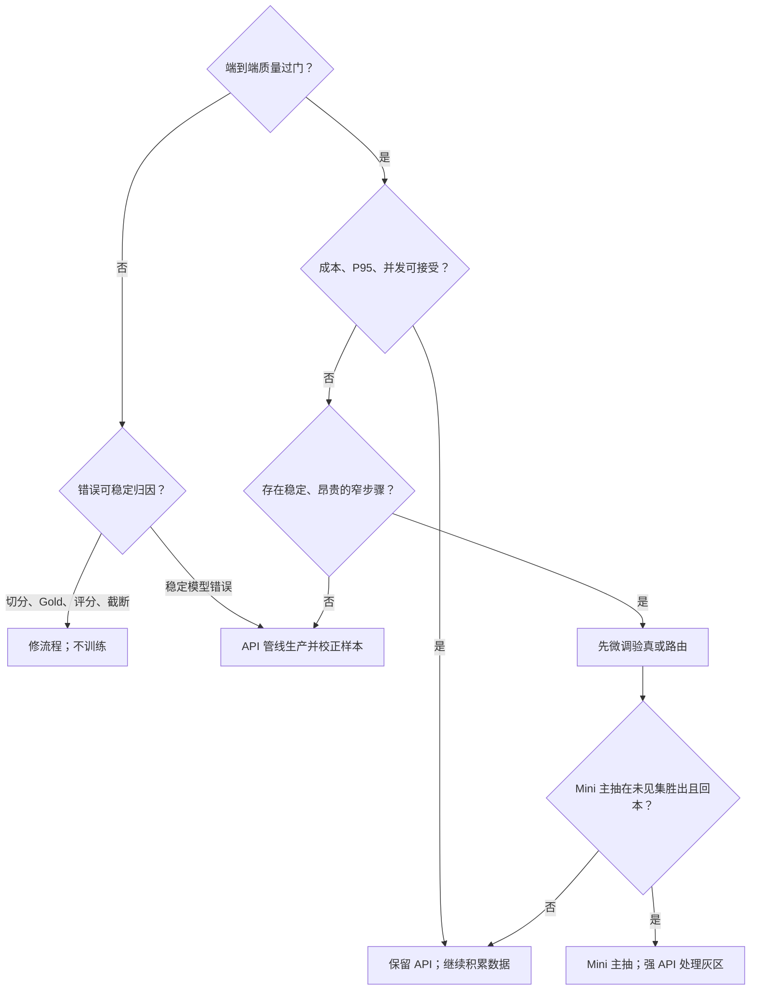

结论：当前应把“多步 API 管线”作为生产探索和数据积累主线，把“带证据的窄验真器”设为 Mini/Lite 的第一个训练候选；Mini/Lite 承担主抽取暂不具备启动条件。

这不是 API 与微调二选一，而是五段递进路线：

1. API 初筛淘汰结构完成率、截断、质量或成本明显不合格的档位。
2. 保留 3–4 个精度、召回和成本互补的候选。
3. 用多步 API 生产、纠错并积累真实样本。
4. 正确答案进入 SFT；同一输入的失败答案与人工修正答案组成 DPO 对。
5. 强 API 长期保留为教师、灰区升级和质量上限。

当前证据还不支持跳到第 4、5 段中的主抽取替换：

- GLM 5.2 的宽松 F1 0.679 仍只是四块 DEV 的临时估分；1,132 条预测尚未经过正式独立人工确认。
- Mini/Lite 当前 API 宽松 F1 约 0.41–0.44，且 Mini 思考档只有 3/4 结构完成。
- Ling 3.0 Flash 在 2,048 上限时思考内容吃完预算，没有最终 JSON；8,192 时才达到 4/4，但四题耗用 27,597 token、88.4 秒，分别约为 GLM 5.2 的 5.0 倍和 4.3 倍。
- 旧训练一条路线过抽、复读和触顶，另一条六题全空；这证明损失、Gold、切分或数据密度仍可能是主要变量，不能简单归因于“教材不够”。
- 方舟只读结果证明 Mini/Lite 260428 能做 SFT、全参 DPO 和 DPO-LoRA，不证明它们在本任务上该训练或能胜过 GLM。

## 1. API 初筛应改成约束优化

不要把 F1、价格、时延混成一个加权总分。更稳妥的选择是：

[
\min_R C_R
]

约束：

[
\begin{aligned}
F1_{\mathrm{lo95}} &\ge Q_{F1}\
P_{\mathrm{lo95}} &\ge Q_P,\quad R_{\mathrm{lo95}}\ge Q_R\
P(\text{结构完成}) &\ge Q_S\
P95(\text{延迟}) &\le SLA\
q_{\mathrm{human}} &\le H\
TPM,RPM,\text{并发} &\le \text{可用配额}
\end{aligned}
]

建议在初筛表中加入：

- HTTP 成功率、适配器成功率、JSON/schema 完成率。
- 截断率、触顶率、无最终答案率。
- 输入、缓存输入、思考、可见输出分别计量。
- P50/P95 完成时延，而不只是平均值。
- 每个模型对其他模型漏项的“独有真阳性”。
- 新增真阳性相对新增误报、token、时延的边际收益。
- 按小说、作者、长度和事实密度分桶后的最差表现。

思考 token 必须进入机械质量门。不同服务商对思考 token 的计费和输出上限处理不同，但官方文档明确说明思考可能占用输出预算或按输出计费：[OpenAI reasoning 指南](https://developers.openai.com/api/docs/guides/reasoning)、[Anthropic extended thinking](https://platform.claude.com/docs/en/build-with-claude/thinking)。

保留互补候选时，计算：

[
\Delta TP_j=TP_j\setminus\bigcup_{k\in S}TP_k
]

只有能贡献独有真阳性、显著价格优势或显著时延优势的模型才进入候选集。不能用召回独立假设推算联合召回，必须在同一批输入上计算真实并集。

API 级联和学习式路由已有论文证据：FrugalGPT 显示自适应级联可能在同等质量下大幅降费，但结论依赖具体任务；RouteLLM 表明偏好数据可以训练强弱模型路由器。这些结果支持“先测管线和路由”，不证明小说抽取能复制其收益。[FrugalGPT（TMLR 2024）](https://lingjiaochen.com/papers/2024_FrugalGPT_TMLR.pdf)、[RouteLLM](https://arxiv.org/html/2406.18665v4)。

## 2. 可直接代入本地数据的成本与延迟公式

对每个步骤 (s) 定义：

- (\pi_s)：请求进入该步骤的概率。
- (m_s)：一次调用机械可用的概率，即 HTTP、结构完整、未截断均成功。
- (R_s)：最多重试次数。
- (X_s,U_s,H_s,O_s)：固定前缀、动态输入、思考、可见输出 token。
- (h_0,h_r,h_w)：普通输入、缓存读取、缓存写入的比例，三者之和为 1。
- (p_{\mathrm{in}},p_{\mathrm{read}},p_{\mathrm{write}},p_{\mathrm{think}},p_{\mathrm{out}})：对应单价。
- (b_s)：批处理价格系数；同步请求取 1。

期望尝试次数：

[
A_s=\sum_{j=0}^{R_s}(1-m_s)^j
=\frac{1-(1-m_s)^{R_s+1}}{m_s}
]

单次尝试 token 成本：

[
K_s=b_s\left[
U_sp_{\mathrm{in}}
+X_s(h_0p_{\mathrm{in}}+h_rp_{\mathrm{read}}+h_wp_{\mathrm{write}})
+H_sp_{\mathrm{think}}
+O_sp_{\mathrm{out}}
\right]
]

每请求全成本：

[
C_R=
\sum_s\pi_sA_sK_s
+q_h\frac{t_hw_h}{60}
+q_ec_e
+\frac{F_{\mathrm{data}}+F_{\mathrm{train}}+F_{\mathrm{eval}}
+F_{\mathrm{deploy}}+F_{\mathrm{maint}}}{N}
]

其中：

- (q_h,t_h,w_h)：人工灰区率、每例分钟数、人工小时成本。
- (q_e,c_e)：漏过高风险错误的概率和期望损失；若不估风险，可先取 0。
- (N)：一个维护周期内的业务请求量，而非模型全生命周期请求量。
- 固定成本要包含数据清洗、双审、训练、部署、回归测试、漂移复验和重训。

两条路线 A、B 的回本请求量：

[
N^*=\frac{F_B-F_A}{V_A-V_B}
]

只有当 B 的变动成本 (V_B<V_A)、且两者通过同一质量线时，(N^*) 才有意义。

平均机器时延可估为：

[
E[L_R]=\sum_s\pi_sA_sL_s+q_hL_h
]

并行分支取 `max(分支时延)` 加合并时间。P95 不应由各步骤平均值相加，应拿真实调用分布做重放或 Monte Carlo。吞吐压力为：

[
\lambda_s=\lambda_{\mathrm{request}}\pi_sA_s
]

再分别检查 RPM、TPM、端点并发和排队利用率。

缓存和批处理优惠不能硬编码。比如 OpenAI 当前批处理文档写的是异步 24 小时窗口和特定折扣；缓存写入、读取和限额也各有规则。应代入实际供应商合同，并确认缓存与批量价格是否可叠加。[Prompt caching](https://developers.openai.com/api/docs/guides/prompt-caching)、[Batch API](https://developers.openai.com/api/docs/guides/batch)、[Anthropic 缓存计费](https://platform.claude.com/docs/en/build-with-claude/prompt-caching)。

## 3. 三条路线的采用条件

| 路线                                  | 更合算的条件                                                 | 否决或失败条件                                               |
| ------------------------------------- | ------------------------------------------------------------ | ------------------------------------------------------------ |
| 1. 全程通用 API 级联                  | API 已过质量线；业务量低到中等；规则、Gold、上下文切分仍在变化；长上下文和长尾样式明显；全成本低于预算 | 多步调用使 P95、TPM 或并发失控；人工灰区高；候选错误高度相关；维护多个厂商版本的成本超过节省 |
| 2. API 主抽取，Mini/Lite 做一个窄步骤 | 主抽取已过质量线；某一步占全成本或时延至少约 20%，且替换后会改变瓶颈；标签稳定、输入输出短、可校准；不额外增加一次串行调用 | 验真器要重新阅读整章且没有定位证据；路由标签随 API 版本快速变化；误放率无法压到产品要求；该步骤调用量太小，无法回本 |
| 3. Mini/Lite 主抽取，强 API 灰区升级  | 任务边界已冻结；独立未见集上不劣于或胜过 GLM；Mini 能自动处理约 80%–90%，API 升级率低于约 10%–20%；长上下文和高密度章节均过门；压力测试后仍回本 | 需要频繁升级 API、人工复核或重试；P95 长度下质量下降；规则持续变化；训练维护成本吃掉推理节省；未见作者/小说上出现整章漏抽或过抽 |

20%、80%–90%、10%–20%是本项目建议的工程门槛，不是论文常数。回本结论还应承受至少三种压力：业务量下降 30%、API 价格下降 30%、训练维护成本上升 50%。任何一种压力下立即亏损，说明替换收益过于脆弱。

## 4. 为什么窄验真器通常更适合作为第一个训练目标

推荐顺序：

**带证据验真器 → 路由器 → 补漏生成器 → 完整抽取器。**

带证据验真器只判断 `SUPPORTED / CONTRADICTED / NOT_STATED / AMBIGUOUS`，输出空间小，能直接校准误放率；完整抽取器还要同时学会边界、召回、证据、去重、状态、长度控制和 JSON。

公开研究也呈现明显的数据难度差：

- MiniCheck 的小型事实验真器用了约 14K–35K 训练项，在多个事实一致性数据集上接近 GPT-4，但合成标签人工抽查仍只有约 78%–80% 准确，说明验真器也不能依赖未复核的教师标签。[MiniCheck（EMNLP 2024）](https://aclanthology.org/2024.emnlp-main.499.pdf)
- VeriScore 的验真器用了 13,403 个 claim-evidence-label 项；其完整 claim extractor 则用了约 99,592 对训练样本，仍会漏词、过度合并和越界抽取。[VeriScore（Findings of EMNLP 2024）](https://aclanthology.org/2024.findings-emnlp.552.pdf)
- 临床抽取蒸馏案例用了数十万合成问答，并在真实外部数据上复验；8B 在部分任务超过教师，但在另一个外部集上 70B 仍最好。该案例同时发现“窄提取 + 确定性后处理”优于让模型直接完成完整资格判定。[npj Digital Medicine 2025](https://www.nature.com/articles/s41746-025-01681-4)

因此，窄验真器并非天然安全。若候选事实中的真实比例为 (\rho)，验真器真阳性率为 (t)、假阳性率为 (f)，通过验真后的精度为：

[
P=\frac{\rho t}{\rho t+(1-\rho)f}
]

若补漏候选中只有 30% 为真、(t=0.95)，而目标精度为 95%，则 (f) 必须低于约 2.1%。仅报告 macro-F1 或 balanced accuracy 不足以批准上线。

## 5. 训练数据和独立验证门槛

火山方舟官方经验给出的量级是：分类型 SFT 约 1K–3K，生成型 SFT 约 2K–3K；DPO 的单一明确风格约 2K–3K，明确标准的复杂任务约 5K–10K，标准含混时 10K 以上。官方同时指出 DPO 主要调整模型已有输出模式的概率，不适合凭空创造新能力。[方舟 SFT 数据建议](https://www.volcengine.com/docs/82379/1221664)、[方舟 DPO 实践](https://www.volcengine.com/docs/82379/1354009?lang=en)。这些只能作为启动先验；Google 官方所说的“从约 100 条开始”也只是可行性试验，不是生产替换证据。[Google SFT 数据准备](https://docs.cloud.google.com/gemini-enterprise-agent-platform/models/tuning/supervised-tuning/prepare-data)。

建议采用以下项目门槛：

| 目标                 | 可开试验                           | 可进入替换比较                                        |
| -------------------- | ---------------------------------- | ----------------------------------------------------- |
| 结构/训练烟雾测试    | 100–300 个高质量独立输入           | 不得据此做产品结论                                    |
| 窄验真器或路由器 SFT | 2K–3K 个 claim-evidence 或路由样本 | 5K 左右起，并检查学习曲线和各错误族                   |
| 聚焦 DPO             | 2K–3K 个同输入偏好对               | 多错误类型建议 5K–10K；含混规则 10K+                  |
| 完整生成式抽取器 SFT | 2K–3K 个完整责任块只够试验         | 5K–10K 个完整块才进入候选；仍须由学习曲线决定是否继续 |

数量单位不能混淆：完整抽取器按独立责任块计数，验真器按独立 claim-evidence 项计数，DPO 按同输入 chosen/rejected 对计数。一个章节拆出 30 条事实不能算 30 个独立章节。

建议的数据覆盖门：

- TRAIN 至少覆盖约 30 部小说、20 位作者；单一小说不超过 10%，单一作者不超过 15%。
- 每个关键失败族至少 100 个明确训练例；极少见但高风险的红线类型至少 50 个。
- 长度、事实密度、空答案、部分支持、否定、跨段证据和相似实体均有独立分桶。
- 规则/schema 连续两个评审周期、约 4–6 周不再实质变动。
- 复审改标率低于 3%，强制抽取/禁止抽取红线改标率低于 1%。
- 剩余错误中至少 80% 能稳定归因于模型，而不是切分、Gold、评分器、截断或流程变量。

这些比例是建议的启动纪律，不是普适定律。

### 来源隔离

按 `作者/系列/小说/译本或镜像来源` 建组，同一相关组只能出现在一个集合中。推荐：

- TRAIN：70%–80% 的来源组。
- DEV：10%–15%，至少约 300 个责任块；可反复用于选型，但永不回流训练。
- 未见确认集：10%–15%，建议至少 500 个责任块、12 部完全未见小说、10 位未见作者；确认集在最终比较前保持封存。

样本量最终应由来源聚类后的 bootstrap 方差决定：目标是主指标 95% 置信区间半宽不超过约 0.02。普通随机行切分会把同一小说或作者的相似表达泄漏到多个集合；NLP 研究已显示这种重叠会高估信息抽取模型。[GroupKFold](https://scikit-learn.org/stable/modules/generated/sklearn.model_selection.GroupKFold.html)、[NLP 数据泄漏研究](https://aclanthology.org/2021.eacl-main.113.pdf)。

### 人工复核强度

- TRAIN：100% 专业单审，至少 20%–30% 独立二审。
- 所有硬负例、部分支持、空答案、隐私项和红线状态：100% 二审并裁决。
- DEV 与未见确认集：100% 双盲独立复核，分歧由第三人裁决。
- DPO 对：100% 成对复核；chosen 必须是独立 Gold，不能只是“另一个 API 看起来更好”。
- 低置信或规范含混项进入 `AMBIGUOUS_HOLDOUT`，不进入 SFT/DPO。

## 6. 五类数据的过滤规则

| 数据来源           | 处理规则                                                     |
| ------------------ | ------------------------------------------------------------ |
| 用户失败           | 保存模型、提示、上下文和流程版本；先归因。缺上下文、切分错、截断、网络、适配器或评分问题不得变成训练例。只有模型可归责且人工修正完成的样本才进入候选池 |
| API 幻觉           | 永不作为 SFT 正例；只有同一输入存在独立核验的修正答案时，才可作为 DPO rejected。避免把纯格式错与语义正确答案配对，以免模型只学格式捷径 |
| DEV/确认集输出     | 隔离，不得训练。若确需回收，必须废弃整个旧集合并建立新的封存确认集 |
| 隐私或版权不清内容 | 无明确授权、用途或保留期限则排除；去除 PII、账号、秘密和用户标识，维护来源、删除和版本记录；另行核验教师输出能否用于蒸馏 |
| 低置信裁决         | 不以多数模型投票代替 Gold；三审仍无法确定则排除，或仅作为灰区升级测试 |

NIST 的生成式 AI 风险框架要求记录数据来源、隐私和知识产权尽职调查；供应商当前服务条款也应逐项核对，不能从“API 可用”推导出“输出可训练”。[NIST AI 600-1](https://nvlpubs.nist.gov/nistpubs/ai/NIST.AI.600-1.pdf)、[火山方舟服务条款](https://www.volcengine.com/docs/82379/1104498)。

## 7. SFT、DPO 与 DPO-LoRA 的顺序

| 顺序      | 适用条件                                                     | 不适用条件                                                   |
| --------- | ------------------------------------------------------------ | ------------------------------------------------------------ |
| SFT → DPO | 需要学新 schema、证据格式、完整抽取流程；当前结构完成不稳定；先用 Gold 建立能力，再用同输入失败/修正对调节过抽、漏抽和弃权边界 | Gold 仍变化；SFT 尚未在未见集证明学到任务；DPO 对只是人工风格偏好 |
| 只 DPO    | 基础模型已能稳定完成任务和格式，结构完成率接近 100%；失败是已有输出模式之间的稳定偏好；偏好对来自当前目标模型的真实失败 | 需要新能力、新标签语义或新 JSON 契约；当前 Mini/Lite 主抽取尚不满足 |
| DPO-LoRA  | 窄、单一、可逆的行为修正；希望低成本验证偏好方向；数据量中等 | 长上下文主抽取、多个互相冲突的能力、明显容量瓶颈；不能因 LoRA 便宜就省略独立验证 |

DPO 原论文的典型流程就是先 SFT，再从 SFT 模型产生偏好对；在没有 SFT 时，也建议先对 preferred completion 做最大似然训练以缓解分布偏移。[DPO 原论文](https://arxiv.org/pdf/2305.18290)。参数高效偏好训练的系统研究也发现，数据质量和信息量比单纯扩大数据更重要，未做指令训练的基础模型更容易在 DPO 中失败或过拟合。[PEFT 偏好对齐研究](https://arxiv.org/html/2406.04879v1)。

当前 Mini/Lite 若日后承担完整抽取，默认顺序应是 **SFT → 评估 → 只在残余偏好稳定时 DPO**。SFT 已足够时不必为了流程完整而加 DPO。窄验真器可以先做 SFT 或 DPO-LoRA 小试，但只 DPO 不应承担创建新抽取能力的责任。

## 8. 什么证据才足以说 Mini/Lite 超过当前 GLM 5.2

需要区分两个声明：

- “组件超过”：同样输入、token 上限、提示、后处理、重试政策下，Mini/Lite 单步骤超过 GLM。
- “产品路线超过”：Mini/Lite 路线在端到端质量、成本、P95、并发和人工率上超过最佳 GLM API 管线。

最低证据标准：

1. 在训练前冻结一套按作者/小说隔离的未见确认集。
2. GLM 5.2 固定模型版本和思考档；Mini/Lite 固定训练快照。
3. 完全相同的输入、上下文切分、后处理、最大输出和重试规则。
4. 评审者不知道输出来自哪个模型；100% 双审并裁决。
5. 按来源做 paired cluster bootstrap，而不是按单条事实随机 bootstrap。
6. “统计胜出”：(\Delta F1) 的 95% 置信区间下界大于 0。
7. “有实际价值的胜出”：建议下界进一步大于 +0.02；召回下界不低于 GLM 超过 0.01，且禁止事实率、整章空抽和灾难性过抽均不恶化。
8. 结构完成率建议至少 99.5%，并在 P95 长度章节上单独过门。
9. 结果不能由一部小说驱动；报告来源级中位数、最差十分位和每类失败。
10. 产品替换还须满足全成本和 P95；质量胜出但没有回本，只能称模型质量胜出。

当前四块 DEV 的 0.679、当前 1,132 条筛选预测、或厂商公开基准都不满足这些条件。使用 API 生成过训练数据的同一输入，也不能再承担盲测。

## 决策树

因此，本项目的具体触发点应写成：

- **现在**：继续 API 初筛和多步管线，补齐思考预算、结构完成率、截断、P95 和真实人工确认。
- **开窄步骤 SFT/DPO-LoRA**：API 端到端已过质量线；某窄步骤是明确成本或时延瓶颈；有至少 2K–3K 高质量样本、稳定标签和封存确认集。
- **开完整抽取 SFT**：边界冻结，错误主要是模型错误；至少 2K–3K 完整块只用于试验，5K–10K 且覆盖长尾后才进入替换比较。
- **开 DPO**：SFT 已学会任务；有同输入、同模型分布的失败/修正对；偏好标准稳定且成对复核。
- **升级路线 3**：未见确认集上质量真正超过 GLM，API 升级率降到约 10%–20% 以下，并在保守成本压力测试中仍回本。

本地证据锚点共 5 条：

1. `TEMP/.../ALL_API_MODEL_SCOREBOARD.md`｜SHA `5fe2445a94e5...c6eccb30`
2. `finetuning/.../TRAINED_READ_NO_WINNER_RESULT_TICKET.json`｜SHA `b0840724f071...e5a379d7a`
3. `runs/...TOKEN_WEIGHTED.../L6_MECHANICAL_FAIL_TICKET.json`｜SHA `b09f3d952c3c...e5b527a77`
4. `runs/...SAMPLE_MEAN.../L6_MECHANICAL_FAIL_TICKET.json`｜SHA `90e461e52735...990061066`
5. `evidence/11_ARK_MINI_LITE_FINETUNE_CAPABILITY_CHECK.md`｜SHA `0b7f1d8294e9...9f97ed4e`

上述关键论文数值均取自正文或全文 HTML；只读摘要和厂商营销数字没有进入采用门槛。

来源：ChatGPT