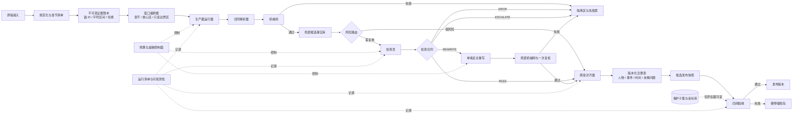
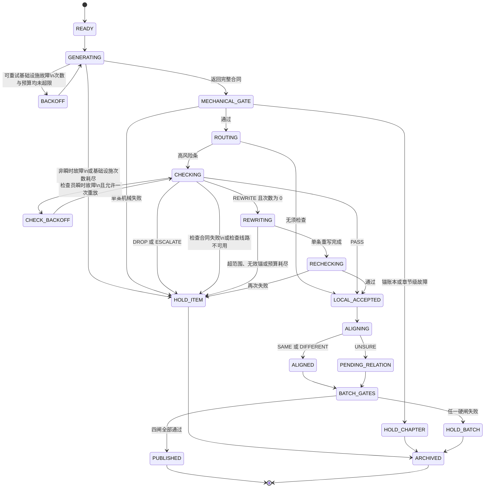

# 包C｜长篇结构化抽取架构调查

## 1. 结论先行

1. ✅ **章窗口方向正确**：百万字长篇不该整本入窗；长上下文即使装得下，也容易漏掉位于中部的信息。长章应按场景／段落切成“核心区＋只读重叠区”。([ACL文摘](https://aclanthology.org/2024.tacl-1.9/))
2. ✅ **跨章一致性应主要放在后处理层**：生产器负责提及、局部事件和原文证据；对齐器再做“章内聚类→跨章合并→不确定留档”。([ACL文摘](https://aclanthology.org/2025.emnlp-main.1737/))
3. ✅ **层级摘要可以建，但不能当证据**：它适合检索候选章节、生成角色卡和剧情阶段索引，不能替代原文锚，也不能反向覆盖抽取事实。([arXiv](https://arxiv.org/html/2401.18059v1))
4. ✅ **检查员应是分流器，不是真值机**：合同应输出标签、原因码、证据关系和有限重写指令；禁止直接整章改写或自动提交修改。([arXiv](https://arxiv.org/abs/2303.17651))
5. ✅ **基础设施重试与语义重写必须分账**：瞬时故障最多三次总尝试；单条语义重写一次；批次额外成本建议先按基础成本的 10% 封顶。([Google SRE](https://sre.google/sre-book/handling-overload/))
6. ✅ **硬停必须分作用范围**：可以只停一条、一个章节、整个批次或某个模型供应端，不能因为一条坏结果重跑全书。
7. 🔥 对照现状，最该补的三个组件是：**不可变证据账本、跨章对齐注册表、失败与预算控制面**。
8. ✅ “Prompt 冻结＋程序侧旁路”判断成立；下一阶段重点不应继续修 Prompt，而应把证据、状态、预算和版本关系做实。

------

## 2. 可操作建议清单

### 建议 1：先建立“证据账本”，再让任何模型开始抽取

**动作**

把原始小说规范化后，生成一份不可变的证据索引。最低字段建议如下：

```text
book_id
chapter_id
paragraph_id
sentence_id
char_start
char_end
text_hash
anchor_id
source_version
```

其中：

- `anchor_id` 只能由程序生成。
- 模型只能引用已有 `anchor_id`，无权新建。
- 原文发生任何修改，都生成新的 `source_version`，不能覆盖旧版本。
- 每条事实保存 `input_hash`，以后可以确认它究竟看过哪一版原文。
- 锚验真使用“ID 存在＋字符区间匹配＋文本哈希匹配”三项，而不是只查 ID。

JSON Schema 可以负责字段、枚举和条件约束；JSON Patch 适合表达有限、可审计的局部修改。([RFC 编辑器](https://www.rfc-editor.org/info/rfc6902/))

**对照判词**

你们已有“目录外锚”等机械闸，但如果锚 ID 的权威来源、字符区间和版本哈希没有独立成组件，机械闸仍可能只是在检查模型自己编出的目录。**证据账本应成为全流水线唯一的锚权威。**

------

### 建议 2：章作为默认窗口，长章采用“核心区＋只读边界区”

**动作**

不要按模型最大上下文硬塞。建议先计算实际可用空间：

```text
W_use =
  模型总上下文
  - 固定指令
  - 输出结构说明
  - 最大输出预留
  - 安全余量
```

试跑阶段可把核心区目标设为：

```text
T_core = W_use 的 65%～75%
```

这个比例是工程起始值，不是论文统一标准，需要用你们的章节长度和输出量校准。

切窗规则：

1. 普通章节能稳定放入核心区时，整章处理。
2. 超长章节优先按场景分隔、段落和对话块切分，固定 token 切分只作兜底。
3. 每窗附带前后 2～5 个段落作为只读边界区，并把重叠量封顶在核心区长度的约 10%。
4. **只有核心区拥有输出权**；边界区只能帮助理解，不能产出事实。
5. 跨边界事实按“最早锚所在核心区”确定唯一归属；无法确定时送入边界协调队列，不允许两个窗口都提交。
6. 去重键至少包含：标准化事实句、锚集合、局部实体集合。

长上下文存在明显的位置效应；重叠滑窗则是保留局部上下文、控制输入长度的常见做法。([ACL文摘](https://aclanthology.org/2024.tacl-1.9/))

**对照判词**

**保留“章为基本窗口”，但要补窗口所有权。**否则滑窗很容易把漏抽问题换成重复条、边界条和冲突条。

------

### 建议 3：层级摘要只走“检索旁路”，不走“事实主路”

**动作**

可以生成三类派生材料：

- **章节卡**：本章人物、局部事件、显式时间词、未解问题候选。
- **剧情段卡**：若干连续章节的阶段摘要。
- **角色卡**：别名、关系、出现章节、重要事件索引。

但必须标明：

```text
derived = true
evidence_grade = NON_AUTHORITATIVE
source_fact_ids = [...]
```

使用范围：

- 帮跨章对齐器找候选角色和候选事件。
- 帮查询系统做全书级检索。
- 帮人工查看剧情脉络。
- 不允许作为事实锚。
- 不允许摘要内容直接覆盖原文抽取。
- 不允许生产器把历史摘要当“已确认真相”。

RAPTOR 和 GraphRAG 都说明了层级摘要对长文检索、全局问题有价值，但它们解决的是检索与综合，不是原文证据权威问题。([arXiv](https://arxiv.org/html/2401.18059v1))

**对照判词**

可以补摘要层，但它应位于主抽取链路之外。**不要用“滚动摘要＋下一章”替代原文证据抽取**，否则早期摘要错误会逐章放大。

------

### 建议 4：跨章实体与事件采用五段式对齐，不强迫一次合并

**动作**

生产器不要直接输出全书级人物 ID。它只输出局部对象：

```text
mention_id
local_entity_id
surface_form
entity_type
descriptors
speaker_candidate
anchor_ids
chapter_id
uncertainty
```

事件则输出：

```text
local_event_id
predicate
participants_local
time_expression
location
polarity
modality
anchor_ids
```

跨章对齐器再走五步：

1. **识别提及**：名字、称号、代词、零指代候选、说话人候选。
2. **章内聚类**：先解决本章“他／师父／老者／本名”等关系。
3. **候选召回**：通过别名、类型、上下文向量、角色关系和相邻章节范围找少量候选。
4. **歧义裁定**：只有模糊候选对才调用规则、小模型或 LLM，输出：
   - `SAME`
   - `DIFFERENT`
   - `UNSURE`
5. **版本化合并**：`SAME` 才合并；`DIFFERENT` 写入禁止合并约束；`UNSURE` 保持分离，等待后文证据。

xCoRe 的代表性方案就是“提及识别→上下文内聚类→跨上下文合并”；BOOKCOREF 也表明，书籍尺度的共指远比短文困难，现有系统在完整书籍上会明显退化。([ACL文摘](https://aclanthology.org/2025.emnlp-main.1737/))

中文网文还存在称号、零指代、对话说话人和类型嵌套等特殊问题。中文小说研究通常也需要把共指与说话人识别结合；不同网文类型之间的实体分布差异很大，通用实体模型不能直接当真值。([ACL文摘](https://aclanthology.org/2025.coling-main.259/))

**对照判词**

**跨章对齐不能靠给生产器塞更多历史。**应该让生产器稳定地产出局部材料，再由可回滚、可拆分的注册表维护全书身份。

------

### 跨章一致性应放在哪一层

| 信息类型   | 抽取层负责                                     | 后处理图谱层负责                       | 推荐           |
| ---------- | ---------------------------------------------- | -------------------------------------- | -------------- |
| 人物与别名 | 提及文本、类型、局部称谓、说话人候选、锚       | 全书人物 ID、别名集合、合并／拆分记录  | 主要放图谱层   |
| 事件       | 局部谓词、参与人、时间词、地点、否定／假设状态 | 跨章事件去重、事件链、因果或包含关系   | 两层分工       |
| 时间       | 显式时间表达、“此前／三日后”等局部关系         | 全书时间轴、区间约束、冲突检测         | 主要放图谱层   |
| 未解问题   | 提问、悬念、承诺、任务、解决候选及锚           | `OPEN→PARTIAL→RESOLVED` 状态与跨章关联 | 主要放图谱层   |
| 原文真实性 | 原文锚和局部语义                               | 不得改写原文证据                       | 必须留在证据层 |
| 全局矛盾   | 输出局部属性和事件                             | 找出年龄、身份、生死、位置等冲突       | 放图谱层       |

文档级事件抽取研究也普遍把局部实体交互与全局事件结构分开建模，因为事件参数可能散落在多个句子里，而逐步合并容易传播错误。([ACL文摘](https://aclanthology.org/D19-1032/))

------

### 建议 5：检查员输出“裁定合同”，不要输出一篇评论

生成—反馈—修订是已有代表性路线；但 LLM 检查员存在自偏好、位置偏好、长度偏好和时间漂移，不能担任唯一真值。使用不同模型能减少部分相关错误，但依然不是可靠性保证。([arXiv](https://arxiv.org/abs/2303.17651))

**推荐合同**

```json
{
  "check_id": "CHK-...",
  "target_fact_id": "F-...",
  "input_hash": "...",
  "verdict": "PASS | DROP | REWRITE | ESCALATE",
  "reason_codes": [
    "ANCHOR_NOT_SUPPORTING"
  ],
  "evidence": [
    {
      "anchor_id": "A-...",
      "relation": "SUPPORTS | CONTRADICTS | INSUFFICIENT"
    }
  ],
  "rewrite_spec": {
    "allowed_fields": ["statement"],
    "preserve_fields": ["fact_id", "source_anchor_ids"],
    "max_targets": 1
  },
  "proposed_patch": [],
  "checker_status": {
    "complete": true,
    "truncated": false,
    "contract_version": "checker-v3"
  }
}
```

**四种结果的硬约束**

| 裁定       | 程序动作             | 合同限制                           |
| ---------- | -------------------- | ---------------------------------- |
| `PASS`     | 进入候选通过队列     | `proposed_patch` 必须为空          |
| `DROP`     | 单条隔离，不重写     | 必须有原因码和证据关系             |
| `REWRITE`  | 触发一次单条定点重写 | 只能指向一个既有事实，不能新建事实 |
| `ESCALATE` | 硬停该条或该章       | 不允许附带可自动执行的修改         |

**检查员禁止事项**

- 禁止新增输入中不存在的锚。
- 禁止把一条问题扩展成多条新事实。
- 禁止整章重写。
- 禁止直接提交补丁。
- 禁止用“整体感觉正确”代替证据关系。
- 禁止因自身截断、空响应或额度错误而判生产器失败。

JSON Patch 可以作为机械字段修改的表达方式，但建议只开放 `replace/remove/test` 的白名单子集，并由程序验证路径；涉及事实句内容时，更稳的是让检查员给出 `rewrite_spec`，由独立定点重写节点生成候选。([RFC 编辑器](https://www.rfc-editor.org/info/rfc6902/))

**检查输入也要收窄**

检查员通常只看：

```text
目标事实
该事实引用的原文锚
锚前后少量段落
局部人物／事件候选
检查合同
```

不要默认把整章或整本交给检查员。长文判断本身也会出现稳定性问题；2026 年的长篇评判预印本同样观察到，量表和参考材料并不能彻底解决长篇检查员的不稳定。([arXiv](https://arxiv.org/html/2606.01629v1))

**对照判词**

你们“检查员只分流／复核”的定位正确。最该改的不是检查员提示词，而是把**誊抄、截断、额度、合同不合法**全部变成独立的 `CHK_*` 故障类型，不能混进主采样质量分。

------

### 建议 6：把重试分成两个账本，并设置批次预算

#### 账本 A：基础设施重试

适用：

- 超时
- 429 限流
- 5xx
- 临时网络错误
- 供应端明确返回可重试

不适用：

- 锚不存在
- 事实不受原文支持
- JSON 字段语义错误
- 业务规则不通过
- 同一条反复产生同一种问题

建议上限：

```text
一次初始调用 + 最多两次基础设施重试
= 每个调用最多三次总尝试
```

采用指数退避加随机抖动，并由最外层编排器统一控制。SDK、HTTP 客户端、任务队列不能各自偷偷重试，否则三层各重试三次可能放大成大量请求。Google SRE 建议单请求最多三次尝试，并把客户端重试比例控制在 10% 以下；AWS 的自适应重试使用令牌桶限制故障时的请求放大。([Google SRE](https://sre.google/sre-book/handling-overload/))

#### 账本 B：语义修复

建议上限：

```text
每条事实：
- 定点重写：最多 1 次
- 重写后复检：最多 1 次
- 复检仍失败：硬停该条
```

跨章对齐中的 `UNSURE` 不应反复调用模型，应保留为待决关系。

#### 批次预算公式

```text
C_base =
  本批初次生产成本
  + 计划内检查成本

B_repair =
  min(绝对金额上限, ρ × C_base)

ρ 初始建议取 0.10
```

再将预算拆开：

```text
B_repair = B_infra + B_semantic
```

两个池默认不能互相透支。某次动作只有同时满足下面条件才能执行：

```text
该目标次数未超限
AND 对应预算池剩余 >= 该动作的 P95 成本
AND 模型供应端熔断器未打开
AND 错误类型允许重试
```

这里的 10% 是参考可靠性工程里的保守起始线，不是抽取任务的通用定律。试点后应根据你们的真实命中率和每类调用成本调整。Azure 的重试模式同样强调：仅瞬时故障应重试，非瞬时故障应取消；达到预定次数后应当作异常处理。([Microsoft Learn](https://learn.microsoft.com/en-us/azure/architecture/patterns/retry))

**对照判词**

检查员失败不能消耗“主采样语义修复预算”；主采样事实错误也不能记成供应端重试。**这两个账本分开后，费用和质量问题才不会互相掩盖。**

------

### 建议 7：设置分层硬停，而不是“继续跑”或“全批停”二选一

| 触发条件                             | 停止范围                 | 动作                                       |
| ------------------------------------ | ------------------------ | ------------------------------------------ |
| 一次定点重写后仍为同一原因码         | 单条                     | 隔离事实，保留前后版本                     |
| 最终候选仍含无效语义锚               | 单条；超过章节阈值则停章 | 不进入发布集                               |
| 目录／锚索引哈希不一致               | 章节                     | 停止该章全部后续模型调用                   |
| 检查员截断或合同失败，重放一次仍失败 | 检查员线路               | 打开检查员熔断；高风险条留档，不能自动通过 |
| 模型供应端错误率超过窗口阈值         | 供应端                   | 熔断，不影响已完成主采样                   |
| 重试或语义预算耗尽                   | 对应批次                 | 不再发模型请求，直接留档                   |
| 旧保护子集出现硬退化                 | 整批                     | 禁止发布                                   |
| 金标双尺未达线                       | 整批                     | 禁止发布                                   |
| 最终语义锚无效率不为零               | 整批                     | 禁止发布                                   |
| 跨章对象无法确定是否同一             | 该关系                   | 保留 `UNSURE`，不强行合并，不必停全书      |

**停手规则模板**

```text
WHEN
  attempts(target, action) >= cap(action)
OR
  remaining_budget(pool) < p95_cost(next_action)
OR
  same_reason_after_rewrite = true
OR
  non_retryable_error = true
OR
  protected_gate_failed = true
THEN
  stop(scope)
  preserve(last_valid_artifact)
  issue_failure_ticket()
  prohibit_automatic_accept()
```

**对照判词**

“硬停留档，不继续缝补”是正确方向，但要明确硬停作用范围。最常见的正确动作不是停全书，而是**停单条、停单章或停检查员线路，同时保住已经冻结的主采样产物**。

------

### 建议 8：四闸验收继续保留，但把金标隔离成离线评估区

建议形成两个网络权限域：

```text
生产域：
原文 → 生产器 → 检查员 → 对齐器 → 候选快照

评估域：
候选快照 + 保护子集 + 金标 → 四闸评估
```

模型调用只存在于生产域。金标库只允许评估器读取，不向生产器、检查员或重写器提供接口。

四闸建议固定顺序：

1. **机械闸**：Schema、锚目录、字符区间、长度、窗口所有权、重复条。
2. **旧子集不劣化**：用冻结输入和冻结主采样做版本回归。
3. **金标双尺**：精确匹配类指标与语义／任务类指标并列，不能互相替代。
4. **语义锚闸**：最终发布候选中，无效支持锚必须为零。

每次验收都绑定：

```text
run_id
source_hash
window_manifest_hash
generator_model_snapshot
checker_model_snapshot
generator_contract_version
checker_contract_version
code_commit
gate_config_version
```

**对照判词**

你们现有四闸思维已经比“让检查员拍板”稳。需要补的是**评估域隔离和整次运行清单**，这样金标既不进模型窗，也不会在程序调试中意外泄漏到路由逻辑。

------

### 🔥 对照“Prompt 冻结＋程序侧旁路”，最该补的三个组件

#### 1. 不可变证据账本／锚权威服务

主要解决：

- 模型伪造锚
- 原文版本变化
- 窗口重复归属
- 重写后锚漂移
- 无法复现某次输入

这是最高优先级。

#### 2. 跨章对齐注册表

主要解决：

- 人物别名和零指代
- 同名异人
- 事件跨章延续
- 时间顺序
- 未解问题状态
- 合并错误回滚

每次合并必须保存 `merge_decision_id`、证据、模型／规则版本，并支持拆分。

#### 3. 失败、预算与回放控制面

主要解决：

- 主采样与检查员故障混记
- 无限重试
- 供应端费用爆炸
- 单条失败重跑整章
- 无法从最后有效步骤恢复

Temporal 支持持久化流程、失败恢复和可配置重试；LangGraph 适合表达检查—重写—复检这类有状态的小流程。更稳的搭配是：**外层批次编排用耐久工作流，内层单条决策用显式状态图**。([Temporal文档](https://docs.temporal.io/encyclopedia/temporal-sdks))

------

### 开源工具／框架候选

| 候选                        | 适合承担的角色                                 | 对中文网文的适用判断                                         |
| --------------------------- | ---------------------------------------------- | ------------------------------------------------------------ |
| **Temporal**                | 批次工作流、检查点、超时、重试、硬停、回放     | 与语言无关；适合正式生产。试点期稍重，但百万字、多模型、多重试时价值明显。([Temporal文档](https://docs.temporal.io/encyclopedia/temporal-sdks)) |
| **LangGraph**               | 单条事实的检查、重写、复检状态图               | 与语言无关；适合内层状态机，不建议单独承担整本离线批处理和成本控制。([Docs by LangChain](https://docs.langchain.com/oss/python/langgraph/overview)) |
| **Ray Data**                | 大批量离线推理、长度分桶、CPU/GPU 并行         | 自建推理、大规模批量时合适；小试点或只走云 API 时可能过重。([Ray](https://docs.ray.io/en/latest/data/batch_inference.html)) |
| **vLLM**                    | 自建模型服务、批处理、约束 JSON 输出           | 中文质量取决于所选模型；结构化输出对生产器／检查员合同很有帮助。([vLLM](https://docs.vllm.ai/en/latest/features/structured_outputs/)) |
| **JSON Schema＋JSON Patch** | 输出合同、字段白名单、有限补丁                 | 强烈推荐，与中文无关；适合程序闸和检查员合同。([RFC 编辑器](https://www.rfc-editor.org/info/rfc6902/)) |
| **DuckDB＋Parquet**         | 运行产物、候选事实、错误票、回归查询           | 很适合离线批次和审计；起步阶段不必先上复杂图数据库。([DuckDB](https://duckdb.org/docs/lts/data/parquet/overview.html)) |
| **OpenTelemetry**           | 贯通生产器、检查员、重写器的日志、指标和调用链 | 与语言无关；适合拆分“质量失败”和“基础设施失败”。([OpenTelemetry](https://opentelemetry.io/docs/)) |
| **Microsoft GraphRAG**      | 图谱和层级摘要的设计参考                       | 可借鉴实体、关系和社区摘要思路；不建议直接把它当原文锚抽取器或唯一事实库。([GitHub](https://github.com/microsoft/graphrag)) |
| **HanLP／LTP**              | 分词、NER、语义角色、候选召回和规则特征        | 适合作为低成本候选器，不适合作为网文事实真值；必须按题材验证。([GitHub](https://github.com/hankcs/HanLP/)) |
| **xCoRe／BOOKCOREF 代码**   | 长文共指研究基线、跨窗口合并思路               | 适合原型和评测参考；不能未经验证直接用于中文网文，特别是零指代和称号体系。([ACL文摘](https://aclanthology.org/2025.emnlp-main.1737/)) |
| **doccano**                 | 人工复核、错误分类、离线金标维护               | 适合中文文本标注；金标项目应与生产模型调用彻底隔离。([GitHub](https://github.com/doccano/doccano)) |

------

## 3. 参考架构图



图里故意没有从金标库通向生产器、检查员或重写器的连线。

### 百万字级批次模块、输入输出与失败票

| 模块                  | 输入                       | 输出                              | 典型失败票                                                   |
| --------------------- | -------------------------- | --------------------------------- | ------------------------------------------------------------ |
| `BookIngestor`        | 原始文件                   | 规范化章节、`book_manifest`       | `INGEST_ENCODING`、`CHAPTER_BOUNDARY_INVALID`                |
| `AnchorAuthority`     | 章节文本                   | 锚账本、字符区间、哈希            | `ANCHOR_INDEX_FAILED`、`SOURCE_HASH_MISMATCH`                |
| `WindowPlanner`       | 锚账本、上下文预算         | `window_manifest`、核心／边界归属 | `WINDOW_OVERFLOW`、`OWNER_AMBIGUOUS`                         |
| `GeneratorRunner`     | 一个窗口                   | 原始模型响应                      | `GEN_TIMEOUT`、`GEN_RATE_LIMIT`、`GEN_TRUNCATED`             |
| `ContractParser`      | 原始响应                   | 类型化候选                        | `GEN_CONTRACT_INVALID`                                       |
| `MechanicalGate`      | 候选＋锚账本               | 通过条、拒绝条                    | `ANCHOR_OUT_OF_CATALOG`、`OVERLONG_FACT`、`DUPLICATE_OWNER`  |
| `CandidateStore`      | 通过的局部事实             | 不可变候选版本                    | `IDEMPOTENCY_CONFLICT`、`ARTIFACT_WRITE_FAILED`              |
| `RiskRouter`          | 候选及风险特征             | 直通／检查队列                    | `ROUTER_CONFIG_INVALID`                                      |
| `CheckerRunner`       | 单条事实、锚和局部上下文   | 检查合同                          | `CHK_TIMEOUT`、`CHK_TRUNCATED`、`CHK_COPY_ERROR`、`CHK_QUOTA` |
| `CheckerContractGate` | 检查合同                   | PASS／DROP／REWRITE／ESCALATE     | `CHK_CONTRACT_INVALID`、`CHK_ILLEGAL_PATCH`                  |
| `TargetedRewriter`    | 单个目标及重写范围         | 单条替换候选                      | `REWRITE_SCOPE_EXPANDED`、`REWRITE_EXHAUSTED`                |
| `CrossChapterAligner` | 局部实体和事件             | 全书级簇、待决关系                | `ALIGN_CONFLICT`、`CANNOT_LINK_VIOLATION`                    |
| `GraphRegistry`       | 对齐决策                   | 版本化人物／事件／时间图          | `MERGE_VERSION_CONFLICT`                                     |
| `FourGateEvaluator`   | 冻结候选快照＋离线评估材料 | 通过／硬停报告                    | `REGRESSION_GATE_FAILED`、`GOLD_GATE_FAILED`、`SEMANTIC_ANCHOR_NONZERO` |
| `PublisherArchive`    | 验收结果和全部中间产物     | 发布快照或留档包                  | `PUBLISH_VERSION_CONFLICT`                                   |

每张失败票至少保存：

```text
ticket_id
run_id
scope: FACT | CHAPTER | BATCH | PROVIDER
stage
error_class
retryable
target_ids
input_hashes
attempt_counts
budget_spent
last_valid_artifact
reason_codes
next_action
created_at
```

### 批次执行方式

百万字级任务建议分为两个阶段：

```text
阶段 A：局部抽取
章节可并行 → 主采样冻结 → 机械闸 → 风险路由

阶段 B：全书整理
按章节顺序或剧情分区 → 跨章对齐 → 图谱状态 → 四闸验收
```

工程上再加三条：

- 按输入长度分桶，避免极长章节拖住一整个批次。
- 每章、每窗口、每条事实都设幂等键，重复执行不能重复写入。
- 重跑只从最后一个有效产物继续，不重新调用已经冻结成功的生产器结果。

Ray Data 支持离线批推理和直接接入 vLLM 等推理引擎；Temporal 的工作流重放适合从中断步骤继续。([Ray](https://docs.ray.io/en/latest/data/batch_inference.html))

------

## 4. 重试／硬停状态机



### 状态机的几条硬规则

```text
1. 只有 TRANSIENT_INFRA 能走 BACKOFF。
2. MECHANICAL、SEMANTIC、GLOBAL_CONFLICT 不走盲重试。
3. 每条事实只能进入 REWRITING 一次。
4. RECHECKING 失败后没有第二轮修补。
5. UNSURE 是合法终态，不等于失败。
6. 检查员故障不得触发生产器重跑。
7. 预算不足时直接进入对应 HOLD 状态。
8. 四闸失败后只能产生新 run，不允许修改旧快照后原地“补过”。
```

### 推荐预算初值

| 动作                     | 单目标上限                 | 批次约束               |
| ------------------------ | -------------------------- | ---------------------- |
| 生产器瞬时故障重试       | 最多 2 次重试              | 计入 `B_infra`         |
| 检查员瞬时故障／截断重放 | 最多 1 次                  | 单独记 `CHK_*`         |
| 检查员语义复判           | 不做循环复判               | 输出 `UNSURE/ESCALATE` |
| 定点重写                 | 最多 1 次                  | 计入 `B_semantic`      |
| 重写后复检               | 最多 1 次                  | 失败即留档             |
| 跨章模糊关系             | 不循环调用                 | 保留 `UNSURE`          |
| 全批额外成本             | 起始建议不超过基础成本 10% | 超出立即停止新修复     |

------

## 5. 开放问题

1. **原子事实的最小粒度还需校准。**粒度过细会造成条数爆炸和重复；粒度过粗又会让一个锚同时支撑多个结论，检查和重写都变困难。
2. **哪些风险信号必须送检查员，需要用真实错误分布确定。**可先覆盖否定、假设、代词主语、跨段事件、边界事实和多锚事实，再保留少量低风险随机审计样本。
3. **中文网文的类型差异需要分题材评测。**玄幻称号、历史官职、群像对话和无限流身份切换，可能需要不同的候选召回与禁止合并规则。
4. **全书注册表允许保留多少 `UNSURE`。**这应按下游用途制定：搜索和人物浏览可以容忍，自动剧情推演或训练数据则可能需要更严格的人工处理。
5. **检查员独立性需要做对照实验。**应比较同模型、自家不同模型、不同模型家族三种方案，看错误相关性下降是否足以覆盖新增成本，而不是默认“第二模型一定更可靠”。

------

## 6. 参考来源列表

### 长上下文、切窗与层级检索

- Liu et al., **Lost in the Middle: How Language Models Use Long Contexts**, TACL 2024。长上下文中的信息位置会显著影响模型表现。([ACL文摘](https://aclanthology.org/2024.tacl-1.9/))
- **SLIDE: Sliding Localized Information for Document Extraction**，2025 预印本。长文档重叠滑窗抽取的近期实现。([arXiv](https://arxiv.org/html/2503.17952v1))
- Sarthi et al., **RAPTOR: Recursive Abstractive Processing for Tree-Organized Retrieval**。递归摘要树和多层级检索。([arXiv](https://arxiv.org/html/2401.18059v1))
- Microsoft Research, **GraphRAG**。图结构和社区层级摘要的工程参考。([微软](https://www.microsoft.com/en-us/research/blog/graphrag-new-tool-for-complex-data-discovery-now-on-github/))

### 文档级抽取与跨章对齐

- Zheng et al., **Doc2EDAG**, EMNLP-IJCNLP 2019。中文文档级事件抽取与事件图结构。([ACL文摘](https://aclanthology.org/D19-1032/))
- Du & Cardie, **Document-Level Event Role Filler Extraction using Multi-Granularity Contextualized Encoding**, ACL 2020。跨句事件参数和多粒度上下文。([ACL文摘](https://aclanthology.org/2020.acl-main.714/))
- Barhom et al., **Joint Modeling of Cross-document Entity and Event Coreference**, ACL 2019。实体和事件联合跨文档对齐。([ACL文摘](https://aclanthology.org/P19-1409/))
- Martinelli et al., **xCoRe: Cross-context Coreference Resolution**, EMNLP 2025。提及识别、上下文内成簇、跨上下文合并三段式。([ACL文摘](https://aclanthology.org/2025.emnlp-main.1737/))
- Martinelli et al., **BOOKCOREF: Coreference Resolution at Book Scale**, ACL 2025。书籍尺度共指基准与代码。([ACL文摘](https://aclanthology.org/2025.acl-long.1197/))

### 中文网文与小说实体

- Zhao et al., **GenWebNovel**, COLING 2025。中文网文实体语料，不同题材间实体差异明显。([ACL文摘](https://aclanthology.org/2025.coling-main.259/))
- Song & Liu, **Resolving Different Representations of Fictional Characters for Chinese Novels**, LREC-COLING 2024。中文小说人物共指和说话人抽取。([ACL文摘](https://aclanthology.org/2024.lrec-main.125/))
- Che et al., **N-LTP**, EMNLP 2021 Demo。中文分词、NER、句法、语义角色等候选工具。([ACL文摘](https://aclanthology.org/2021.emnlp-demo.6/))

### 检查员与重写

- Madaan et al., **Self-Refine: Iterative Refinement with Self-Feedback**。生成—反馈—修订的代表路线。([arXiv](https://arxiv.org/abs/2303.17651))
- Li et al., **A Survey on LLM-as-a-Judge**。检查员可靠性、偏差、自偏好和时间漂移综述。([arXiv](https://arxiv.org/html/2411.15594v6))
- **LongJudgeBench**, 2026 预印本。长篇输出评判仍存在明显稳定性缺口。([arXiv](https://arxiv.org/html/2606.01629v1))

### 重试、预算与耐久运行

- Google SRE, **Handling Overload**。单请求尝试上限、客户端重试比例和避免多层重试放大。([Google SRE](https://sre.google/sre-book/handling-overload/))
- AWS Builders’ Library, **Adaptive Retries / Token Bucket**。通过令牌桶和限流控制重试放大。([Amazon Web Services, Inc.](https://aws.amazon.com/builders-library/resilience-lessons-from-the-lunch-rush/))
- Microsoft Azure Architecture Center, **Retry Pattern**。区分瞬时与非瞬时错误、预定尝试次数和熔断。([Microsoft Learn](https://learn.microsoft.com/en-us/azure/architecture/patterns/retry))
- Temporal 文档。持久化流程、可配置重试与工作流重放。([Temporal文档](https://docs.temporal.io/encyclopedia/temporal-sdks))
- LangGraph 文档。状态图、检查点、恢复和长期状态存储。([Docs by LangChain](https://docs.langchain.com/oss/python/langgraph/overview))

### 合同、批处理与可观测性

- IETF **RFC 6902 JSON Patch**。结构化局部补丁标准。([RFC 编辑器](https://www.rfc-editor.org/info/rfc6902/))
- **JSON Schema**。结构化数据合同和验证规则。([JSON Schema](https://json-schema.org/))
- Ray Data 文档。离线批推理与 LLM 推理引擎接入。([Ray](https://docs.ray.io/en/latest/data/batch_inference.html))
- vLLM 文档。JSON Schema 等结构化输出。([vLLM](https://docs.vllm.ai/en/latest/features/structured_outputs/))
- DuckDB 文档。Parquet 批次存储和高效过滤查询。([DuckDB](https://duckdb.org/docs/lts/data/parquet/overview.html))
- OpenTelemetry 文档。调用链、指标和日志的统一观测。([OpenTelemetry](https://opentelemetry.io/docs/))
- doccano。开源文本标注与人工复核工具。([GitHub](https://github.com/doccano/doccano))

来源：ChatGPT