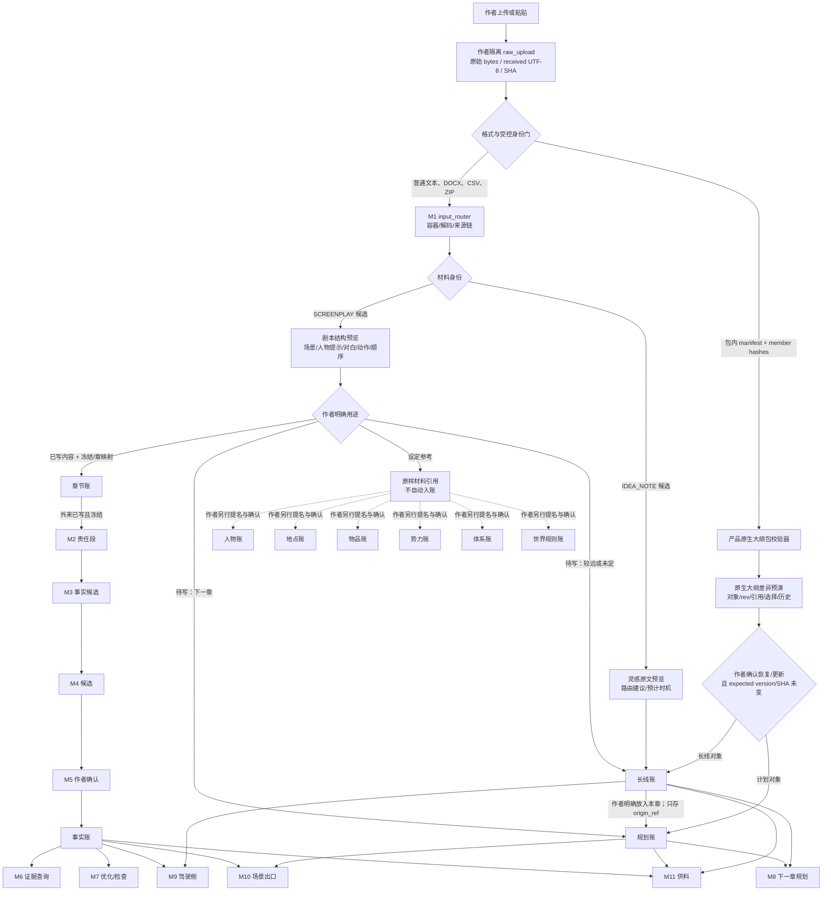

# 剧本、灵感与产品原生大纲导入设计 R01

- **状态**：`DESIGN_CANDIDATE_ONLY`
- **权限**：只读设计；不修改 R14、R03、C10、规划账合同或代码，不产生施工与自动采纳权。
- **目标**：给三类创作材料建立不误路由、可回源、可失败关闭的主路径。
- **非目标**：不新造 M12／M13；不建设统一导入平台、RAG、插件总线或通用数据库；不调用 API；不把任何候选直接升级为正式合同。

---

## 0. 结论

三类材料不能共用一个“导入后自动分账”的万能入口，但可以共用两件已经存在的底座：

1. **作者工作区的原始字节与原子提交能力**：先把作者交来的文件按 bytes 原样、作者隔离地保存，再做解析；
2. **M1／C10 的材料身份纪律**：格式识别只说明“这是什么容器”，材料身份必须来自作者声明或受合同约束的结构化入口，不能从后缀、标题或内容猜出真值权力。

然后分成三条独立适配器：

- **剧本适配器**只负责保留场景、人物提示、对白、动作和顺序；在作者明确它是“已写内容／待写计划／设定参考”前，不进任何账。
- **灵感适配器**先原样保存到长线账的灵感收件箱，允许 `UNPLACED`；路由器只给建议，不自动排下一章、不写事实账，也不静默复制到多本账。
- **产品原生大纲适配器**识别产品包内 manifest 和内容哈希，整包保留对象 ID、对象 rev、引用关系、选择记录与历史；导入前做差异预演，版本或 SHA 冲突就停，绝不覆盖 current。

这三条路径共享的是“原样保存、身份、回执、作者隔离”这层机械底座；转换规则、预览、确认和账本 writer 各自独立，因此不构成统一导入平台。

---

## 1. 身份核对与直接验证

| 项目 | 核对结果 |
|---|---|
| Project Sources release | `PROJECT_SOURCE_RELEASE_8e66fe30e71fdfed`；发布清单与八项 SHA 对齐 |
| 产品背景 | R14；背景 ZIP SHA-256 `cf22978d966401ebd0ca26b5df67de287a00ebd52f93fad232549cbbe3304010` |
| 原子需求背景 | R03；142 个唯一预期 |
| 完整代码基线 | `WORKSPACE_BASELINE_79bd2e2d6d0e_1ea1f200`；commit `79bd2e2d6d0eb28610d5ed4608288251c6ffa424` |
| 本窗口代码身份 | branch `codex/module-runtime-foundation-20260819-r01`；运行代码 commit `01efc50d863bf01ac048dc6c50284fcebc7e51f4`；差量参考 `a7b3ecb` |
| 本窗口 ZIP | SHA-256 `26317d112756dc6990df8b8e340a4cf8913a64f478e464540837e44be7c458be`；内部 `SHA256SUMS` 全部通过 |
| 当前缺口身份 | `future_gap_registered_not_formal_contract_not_implemented` |
| 本轮直接回归 | M1／C10／原样保存 115、意图路由与十本账目录 58、规划存储 14、长线读取 37、章槽快照 23；合计 **247 passed** |
| 包内上游基线 | 除两份依赖未版本化 TEMP fixture 的旧测试外，包内登记其余模块测试 1542 passed；本轮未把该登记冒充重新全量执行 |

### 主要代码与合同证据

- `02_current_route/novel-mvp/mvp/input_router.py`
- `02_current_route/novel-mvp/mvp/ingest.py`
- `02_current_route/novel-mvp/mvp/ingest_workspace.py`
- `02_current_route/novel-mvp/mvp/intake_identity.py`
- `02_current_route/novel-mvp/mvp/workspace.py`
- `02_current_route/novel-mvp/contracts/C10_INTAKE_MATERIAL_IDENTITY.md`
- `02_current_route/novel-mvp/design/LEDGER_DIRECTORY_DESIGN_R01.md`
- `02_current_route/novel-mvp/mvp/intent_router.py`
- `02_current_route/novel-mvp/contracts/PLAN_LEDGER_STORAGE.md`
- `02_current_route/novel-mvp/mvp/plan_workspace.py`
- `02_current_route/novel-mvp/mvp/planning_longline_view_tool.py`
- `01_current_truth/governance/progress/current-progress.md`
- `03_upstream_evidence/TEMP/chatgpt_review_cycles/module_runtime_pro_wave_20260820_r01/02_RUNTIME_DELTA_INDEX.md`

---

## 2. 当前行为审计

### 2.1 M1 当前真正支持什么

`input_router` 只做格式、容器、严格解码和来源链，不猜材料 role、不写 C1、不调模型。当前能力是：

| 输入 | 当前行为 | 不能夸大的地方 |
|---|---|---|
| TXT／MD | 严格解码；默认尝试 UTF-16 BOM、UTF-8-sig、GB18030 | 能读文本，不等于知道它是章节、剧本、灵感或大纲 |
| CSV | 作为严格解码文本进入；原始 bytes 与来源链可保留 | **没有行列、工作表、字段映射等表格语义** |
| DOCX | 只读 `word/document.xml` 主文档流；批注、页眉页脚、脚注、尾注、文本框、删除内容、altChunk 等未覆盖时整项阻断 | 当前不能宣称保留 Word 的全部结构，也没有剧本结构识别 |
| ZIP | 最多两层；拒绝绝对路径、`..`、软链接、重复成员、CRC 错误、超限文件数与大小；已知系统垃圾显式丢弃并给原因 | ZIP 只是容器；不能因包名或后缀认定材料身份 |
| Excel `.xls/.xlsx/.xlsm` | 明确阻断，提示每个需要的工作表另存为 CSV UTF-8；本批零 Excel 内容写入 | 当前没有工作簿读取能力 |
| 旧 DOC | 明确阻断，提示另存 DOCX | 不做不透明转换 |

当前格式识别有时会参考后缀，有时会看 ZIP／DOCX 内容签名；但这只是**容器识别**。`filename_chapter_no()` 也明确只辅助“已经被声明为 Chapter”的跨文件章序，不能授予 Chapter 身份。

### 2.2 C10 当前做到什么

正式 C10 v4 只认识：`INTRO`、`CHAPTER`、`SETTING`、`TITLE`、`TAGS` 和 `UNKNOWN`。当前事实：

- `material_unit_id`、`source_ref`、`source_sha256`、原样 span、`slice_sha256`、追加式 `identity_revisions` 可以复用；
- 身份、状态、basis、actor 分开；分类名本身不授予真值；
- 未知版本、未知 role、未知字段全部 fail closed，不能 fallback 成 Chapter；
- 只有 Confirmed Chapter 有资格进入 C1／M3；Setting、Title、Tags 等只能保存／展示，不能自动变事实；
- v4 Tags 合同已存在，但 producer／consumer 尚未完成；
- 历史 `kind=outline` 仍走旧兼容入口，直接写 legacy C1 outline，**它不是产品原生大纲安全导入路径**。

因此不能把 `SCREENPLAY`、`IDEA_NOTE` 或 `NATIVE_OUTLINE_PACKAGE` 塞进现有 v4 role，也不能借旧 outline 入口绕开对象版本和引用校验。

### 2.3 AuthorWorkspace 与十本账当前做到什么

AuthorWorkspace 已有以下可复用能力：

- `raw_upload` 内容寻址、不可变保存；
- 由认证 principal 派生作者隔离身份；同名项目、同名文件不会跨作者串读；
- 逻辑键白名单、拒绝软链接、拒绝路径猜测；
- `operation_id` 幂等、同操作不同载荷冲突；
- expected version／SHA 检查；竞争时抛 `VersionConflictError`；
- 多逻辑键同一 commit、prepare／recover、失败不暴露半套 current；
- 双读水位验证，防读取过程中 current 变化。

但当前 `ingest_workspace` 把一次 M1 批次保存成 `{uploads}` 的 current input manifest，它不是长期追加的三类创作材料档案；不能直接复用它来冒充多次导入历史。

十本账目录已有固定名称和路由原型，但实际能力不齐：

- 可复用切片：章节账、事实账、规划账；
- 零散材料：人物、地点、世界规则、长线；
- 尚无固定登记：物品、势力、体系；
- 目录只管“有哪些账、内容去哪”，不替各账 owner 写内容，也不是 M12。

### 2.4 M8 当前真实入口

- `intent_router` 是零模型、advice-only 路由：可建议 `chapter_plan`、`volume_outline`、`character_arc`、`relationship_arc`、`open_hook`，低置信时最多给两个候选和一个问题；返回 `writes=[]`。
- `PLAN_LEDGER_STORAGE` 保存 `plan-v2` 对象：稳定 ID、对象 rev、来源身份、章槽、场景、计划事件、故事线、伏笔、选项记录、引用与提交历史。它明确不是事实账。
- `plan_workspace.save_plan()` 可以按 expected version 原子保存完整 plan，但这只适合已验证的当前 plan，不足以承担“带历史、blob、引用图的原生包恢复”。
- 当前长线视图只实际读取 storylines 与 hooks，并明确把“卷纲、人物命运、灵感与预计使用时机”列为 unavailable。

所以已有 `intent_router` 可以复用为灵感的**建议器**，已有 plan 对象和选择记录可以复用为原生大纲的**载荷**；但当前没有灵感写入口，也没有完整长线账导入 owner。

---

## 3. 总体设计纪律

### 3.1 四段式主路径

所有三类材料都按下面顺序处理：

```text
A. 接收原件
→ B. 建立材料／包身份
→ C. 生成只读预览与差异
→ D. 作者明确动作后，由对应账本 owner 写入
```

硬规则：

1. **先原件，后解析**：只要输入通过根对象大小与基本名称安全门，就先把收到的 bytes 保存为作者隔离的 immutable raw upload。解析失败也不改写原件。
2. **格式不等于身份**：`.docx` 只说明容器；“剧本／灵感／产品原生大纲”必须来自作者声明或产品 manifest。
3. **预览零写入**：解析器、路由器、差异器都返回 `writes=[]`；没有作者动作就不碰十本账。
4. **一条内容一个 owner**：同一内容只在一处保存；其他账只存稳定引用。作者明确多次使用同一灵感时，保存的是多条 placement 引用，不复制成多份互不关联的内容。
5. **计划永不冒充事实**：剧本对白、灵感、原生大纲里的计划事件都不能直写事实账。
6. **current 只由版本门改变**：确认动作必须绑定 preview SHA、源版本、目标 expected version／SHA 和 operation_id；确认后目标变了就重做预览，不执行旧确认。
7. **身份历史追加，不静默改判**：材料用途改判、对象更新和路由变化都留 revision；旧版不覆盖新版。
8. **认证身份不从文件读取**：文件里的作者名、project_id、author_ref 都只是 provenance，不能授予访问权。

### 3.2 状态词

| 状态 | 含义 |
|---|---|
| `RAW_STORED` | 原始 bytes 已按作者隔离保存，尚未证明可解析 |
| `IDENTIFIED` | 材料种类由作者声明或受控 manifest 确认 |
| `PREVIEW_READY` | 结构／建议／差异可展示，账本仍未写 |
| `AWAITING_AUTHOR_DECISION` | 需要作者选择用途、位置或恢复模式 |
| `APPLYABLE` | 版本、引用和目标水位全部通过，可以提交 |
| `APPLIED` | 对应 owner 已原子提交并给回执 |
| `BLOCKED` | 原件仍可保留，但解析或应用失败；current 不变 |
| `QUARANTINED` | 输入存在损坏、未知版本或危险成员，只允许下载原件／查看损失回执 |

---

## 4. 入口到十本账与使用方总图



### 图的关键解释

- 剧本选择“已写内容”也只是进入章节账；只有作者明确冻结、章映射明确后，才有资格走外来道 M2→M5。对白不能直写 confirmed facts。
- 灵感默认只在长线账保留一份原文；进入规划账时使用 `origin_ref`，不是复制一份脱离原件的新文本。
- 原生大纲可以含规划账和长线账对象，但应用前必须分别由对应 owner 校验；当前长线 owner 未完成，所以现状只能设计，不能宣称可运行。
- 人物、地点、物品、势力、体系、世界规则账都不能由“设定参考”自动填充。作者后续提名并确认时才进入各自 owner。

---

# 5. 剧本导入主路径

## 5.1 作者看到什么

上传或粘贴后，界面按下面顺序展示：

1. **原件保存小票**：文件名、格式、bytes、SHA、编码、来源链、是否有未覆盖区域；
2. **结构预览**：按源顺序列出场景标题、人物提示、对白、动作、括号说明、转场、备注和无法识别块；
3. **一个最高优先级问题**：
   > 这份剧本在本项目里是：**已经写成的内容、准备以后写的计划，还是只作设定参考？**
4. **目标预览**：告诉作者确认后会进哪一本账、哪些内容只保留引用、哪些账绝不会动；
5. **按钮**：`只保存原件`、`确认用途并继续`。没有“自动入账”。

作者已在上传入口或包内声明明确用途时，跳过第 3 步；内容识别与声明冲突时，以声明不自动获胜，而是显示冲突并只问上述一个问题。

## 5.2 最小输入候选形状

```json
{
  "input_mode": "upload",
  "source_name": "第九集_修订二.docx",
  "raw_bytes": "<opaque bytes>",
  "encoding_hint": null,
  "declaration": {
    "material_kind": "SCREENPLAY",
    "intended_use": null,
    "lifecycle": "WORKING",
    "scope_hint": {
      "chapter_refs": []
    },
    "visibility": "AUTHOR"
  },
  "operation_id": "op-mfi-screenplay-0001"
}
```

### 字段来源

| 字段 | 身份 |
|---|---|
| `source_name`、`raw_bytes`、`encoding_hint`、declarations 传递方式 | **复用现有** `UploadSource` |
| `operation_id` | **复用现有** AuthorWorkspace 幂等语义 |
| raw blob 的 `content_sha256/size/metadata_sha256` | **复用现有** `raw_upload` receipt |
| `material_kind=SCREENPLAY` | **候选**；当前 C10 v4 不支持，需版本化扩展或窄 companion contract |
| `intended_use` | **候选**：`WRITTEN_CONTENT/FUTURE_PLAN/SETTING_REFERENCE` |
| `lifecycle`、`visibility` | R14 五轴语义可复用，字段仍是**候选** |
| `scope_hint` | **候选**，只作预览提示，不能授予 Chapter 身份 |

### C10 复用建议

推荐把**文本型剧本材料身份**放入未来 C10 版本化扩展，而不是另造模块：继续复用 `material_unit_id/source_ref/identity_revisions/basis/actor`，新增 `SCREENPLAY` role 与用途 sidecar。不能直接往 v4 schema 塞字段，也不能让 C10 role 本身授予事实、章节或规划权。

## 5.3 原始字节与原始结构怎样保存

- 文件上传：保存实际收到的全部 bytes，不做 Unicode、换行、空格或标点归一化；
- 粘贴：只能承诺保存服务端实际收到的 Unicode 字符序列及其 UTF-8 bytes，不能声称还原剪贴板原始编码；
- DOCX：保存原始 DOCX bytes，同时保存当前 M1 得到的主文档流 derived source；若有未覆盖区域，原件仍在隔离存储，但结构转换 `BLOCKED`；
- CSV：保存原始 bytes 和严格解码文本；当前不声称保留表格语义。未来如支持剧本 CSV，必须由作者明确列映射或受控产品模板，不靠列名猜；
- Excel：当前明确阻断，给 CSV UTF-8 转换说明；不能把工作簿当普通 ZIP 拆开；
- 剧本结构 projection 采用稳定 source span：
  - `scene_heading`
  - `character_cue`
  - `dialogue`
  - `parenthetical`
  - `action`
  - `transition`
  - `note`
  - `unknown_block`
- 每个 block 保存 `source_start/source_end/source_slice_sha256`，数组顺序就是源顺序；无法识别的内容进入 `unknown_block`，不丢弃。
- 人物提示先保留原字面，不自动绑定人物账 ID；候选实体链接另放 preview，确认前不落盘。

## 5.4 最小输出／预览候选形状

```json
{
  "contract": "SCREENPLAY_INTAKE_PREVIEW",
  "version": "v1-candidate",
  "status": "AWAITING_AUTHOR_DECISION",
  "source_identity": {
    "raw_blob_id": "i_<author>_raw_upload_<sha256>",
    "source_sha256": "<64 hex>",
    "source_name": "第九集_修订二.docx",
    "encoding": "utf-8",
    "derived_source_sha256": "<64 hex>"
  },
  "material_identity": {
    "material_unit_id": "m_<stable id>",
    "material_kind": "SCREENPLAY",
    "revision_no": 1,
    "basis": "USER_DECLARATION",
    "intended_use": null,
    "lifecycle": "WORKING"
  },
  "structure": {
    "order_basis": "SOURCE_ORDER",
    "scenes": [
      {
        "scene_id": "SP-SC-0001",
        "ordinal": 1,
        "heading": {
          "text": "内景 陈家堂屋 夜",
          "source_start": 0,
          "source_end": 9,
          "slice_sha256": "<64 hex>"
        },
        "blocks": [
          {
            "block_id": "SP-BL-0001",
            "type": "DIALOGUE",
            "speaker_text": "陈九棺",
            "text": "爷爷，是我。",
            "source_start": 10,
            "source_end": 21,
            "slice_sha256": "<64 hex>"
          }
        ]
      }
    ],
    "unparsed_spans": []
  },
  "routing_preview": {
    "question": "这份剧本是已写内容、待写计划，还是设定参考？",
    "allowed_targets": ["chapter_ledger", "plan_ledger", "longline_ledger", "source_only"],
    "writes": []
  },
  "preview_sha256": "<64 hex>"
}
```

字段身份：`source_identity` 中的 raw receipt、C10 source SHA／span 方式可复用；`SCREENPLAY_INTAKE_PREVIEW`、结构 block、用途和 routing preview 均是候选。

## 5.5 预览与确认点

### 用途一：已写内容

- 默认 `lifecycle=WORKING`，只是作者资产，不是证据；
- 只有作者明确冻结，并给出章／集映射后，才可写章节账的 screenplay source version；
- 章映射缺失时，不再追问一串问题：先保存为 `WRITTEN_CONTENT_UNMAPPED`，作者以后点“挂到章节”再处理；
- 冻结并映射后，进入外来道；需要 screenplay-aware 的 M2 责任段适配器，仍经 M3→M4→M5；
- 对白只证明角色说过某句话，不能把对白命题直接变世界事实。

### 用途二：待写计划

- 有明确“下一章／下一场”锚：预览为规划账候选；
- 没有明确时间：预览为长线账候选；
- 不自动把整份剧本变成下一章计划；场景顺序可以转成计划场景顺序，但必须显示对象 diff，作者确认后才写；
- 写入的事件仍是计划事件，不是已发生事实。

### 用途三：设定参考

- 默认只保存原件和 material identity；
- 不自动写人物、地点、世界规则、体系或事实账；
- 作者后续选中某一段并执行“提名为设定”时，才交给对应账本 owner，保留 source span 和作者确认记录。

## 5.6 能写入哪些账、绝不能自动写哪些账

| 用途 | 允许的第一目标 | 后续合法路线 | 禁止自动写入 |
|---|---|---|---|
| 已写内容 | 章节账的 screenplay source version | 冻结后走 M2→M3→M4→M5 | 事实、人物当前状态、世界规则、规划、长线 |
| 待写计划，近期 | 规划账 | M8／M10／M11 读取 | 事实、章节 current、实体当前状态 |
| 待写计划，远期／未定 | 长线账 | M8 到点提醒；作者可显式放入规划账 | 事实、下一章自动排期 |
| 设定参考 | 原样材料引用 | 作者逐段提名后交对应 owner | 十本账中的任何自动写入 |

## 5.7 下游使用方

- 已写且冻结：M2、M3、M4、M5；确认后才供 M6～M11；
- 近期计划：M8、M10、M11；
- 远期计划：M8、M9、M11；
- 设定参考：默认无人自动消费；作者明确授权后，M7／M8／M11 可按 source ref 读取相关片段。

## 5.8 剧本失败关闭

| 场景 | 处理 |
|---|---|
| 重复导入同一 bytes | 同作者同项目同身份返回 `ALREADY_STORED`，不新建第二份账本对象；若作者要当独立材料，必须显式“另存为独立材料实例” |
| 同材料旧修订 | 原件可存历史；应用为 current 时停止并展示 current rev，不覆盖 |
| 同材料 ID、同 rev、不同 SHA | `IDENTITY_CONTENT_CONFLICT`，隔离并停止 |
| 部分损坏／DOCX 未覆盖区域 | 原件进入隔离存储；无结构转换、无账本写入 |
| 编码多解且结果不一致 | 停在 preview 前，只问一个编码问题；不静默挑一个看似可读的结果 |
| 结构解析不全 | 未识别内容保留为 `unknown_block`；若关键场景顺序无法确定，禁止应用但可展示原文 |
| 跨作者 receipt／project_id | 文件中的 ID 不授予权限；只按当前认证作者保存，不能读取源作者工作区 |
| preview 后目标变化 | expected version／SHA 不符，旧确认失效，重做预览 |

---

# 6. 零散想法／灵感导入主路径

## 6.1 作者看到什么

作者在桌面或手机粘贴一句话时，先看到：

> 已原样保存为一条未放置灵感。它现在不会进入事实账，也不会自动排进下一章。

随后展示：

- 原文；
- 保存时间与版本；
- 建议去处和理由；
- 建议使用时机（如果能从明确锚点机械判断）；
- `先放着`、`放入建议位置`、`我自己选位置` 三个动作。

保存不等待分类回答。只有作者要求立即放置、而去处确实模糊时，才问一个问题，例如：

> 这条想法有明确章节位置，还是先留在长线灵感里？

## 6.2 默认去处

默认 owner 是**长线账的灵感收件箱**，对象状态 `UNPLACED`。这里的“无家”表示尚未绑定卷、线、人物或章节，不表示没有保存位置。

当前代码没有这个 writer：R14 与 R03 已要求灵感安全保存和到点提醒，但 `planning_longline_view_tool` 仍把“灵感与预计使用时机”列为 unavailable。因此本路径是候选，不能写成现有功能。

## 6.3 最小输入候选形状

```json
{
  "input_mode": "paste",
  "received_text": "也许让沈青在婚礼当天发现新郎早就知道她的秘密。",
  "declaration": {
    "material_kind": "IDEA_NOTE",
    "visibility": "AUTHOR"
  },
  "operation_id": "op-mfi-idea-0001"
}
```

| 字段 | 身份 |
|---|---|
| 精确接收文本、UTF-8 bytes、raw SHA | **复用现有原样保存纪律**；粘贴原始编码不可恢复 |
| `operation_id`、作者隔离 | **复用现有** AuthorWorkspace |
| `material_kind=IDEA_NOTE` | **候选** C10 文本 role 或 companion identity |
| `visibility` | R14 语义可复用，字段仍是**候选** |

## 6.4 最小输出候选形状

```json
{
  "contract": "IDEA_NOTE_RECORD",
  "version": "v1-candidate",
  "idea_id": "IDEA-0001",
  "rev": 1,
  "source_ref": {
    "material_unit_id": "m_<stable id>",
    "source_sha256": "<64 hex>",
    "start": 0,
    "end": 28,
    "slice_sha256": "<64 hex>"
  },
  "text": "也许让沈青在婚礼当天发现新郎早就知道她的秘密。",
  "commitment": "idea",
  "placement_status": "UNPLACED",
  "author_home": null,
  "timing": null,
  "placements": [],
  "advisory": {
    "primary_home": "relationship_arc",
    "candidate_homes": ["relationship_arc"],
    "confidence": 0.95,
    "reason": "包含明确的两人关系变化和未来场合。",
    "clarification_question": null,
    "advice_only": true,
    "writes": []
  }
}
```

### 字段来源

- `primary_home/candidate_homes/commitment/clarification_question/advice_only/writes=[]` 可复用现有 `intent_router` 语义；
- `idea_id/rev/placement_status/author_home/timing/placements` 是长线账候选字段；
- advisory 不是事实、不是作者决定，也不写入规划账；
- 建议解释必须引用实际信号，不只展示一个小数置信度。

## 6.5 原样保存、建议去处和使用时机

- 灵感原文作为唯一内容实体保存；建议、提醒、placement 都引用 `idea_id`；
- 路由建议映射：
  - `chapter_plan` → 规划账；
  - `volume_outline`、`character_arc`、`relationship_arc`、`open_hook` → 长线账内部位置；
- `author_home` 只有作者动作后才写；
- `timing` 可以是章节／章槽／故事线／开放条件的引用，也可保持 null；
- 到点提醒只显示“这条灵感可能相关”，不自动生成计划对象；
- 作者把灵感放进规划账时，规划对象存 `origin_ref=IDEA-0001`，长线账原文仍是唯一源；
- 同一灵感多次使用，只有作者每次明确动作才新增 placement 引用，不复制原文成多个失联对象。

## 6.6 能写入哪些账、绝不能自动写哪些账

| 动作 | 允许写入 | 禁止自动写入 |
|---|---|---|
| 随手保存 | 长线账灵感收件箱一处 | 事实、章节、规划、人物、地点、物品、势力、体系、世界规则 |
| 作者选择长期去处 | 长线账对应 subtype／引用关系 | 不复制到多处 |
| 作者选择本章使用 | 规划账新对象，带 `origin_ref`；长线账新增 placement 引用 | 事实、章节 current |
| 作者把灵感升级为作者 Canon | 另走作者签字／对应账本 owner，不属于“保存灵感”动作 | 不能由灵感保存按钮直接完成 |

## 6.7 下游使用方

- M8：规划下一章、到点提示、作者明确放置；
- M9：只读展示未放置／已放置／已使用；
- M11：仅在当前任务命中明确 placement／timing 时供料，并说明为什么加载；
- M7：不因为灵感与现状冲突就亮事实红灯，最多显示计划层提示；
- 事实账消费者：在作者另行确认前完全不可见。

## 6.8 灵感失败关闭

| 场景 | 处理 |
|---|---|
| 同一句重复粘贴 | 同 operation_id 回放；不同 operation_id 可提示“可能已保存”，默认不再建第二条，作者可显式另存 |
| 旧 rev 导入 | 保存为历史候选；不能覆盖 current idea rev |
| 文件含多条想法但无明确分隔 | 原文件先整体保存；不自动切成多条，预览只问一个“按整份保存还是按标记分开”问题 |
| 编码异常 | 原 bytes 隔离；不创建错误文本 idea |
| 路由低置信 | 仍先保存 `UNPLACED`；最多一个 clarification question，不阻塞保存 |
| 建议位置冲突 | 不写任何目标账；显示两个以内候选供作者选 |
| 跨作者 | 同文同名也按认证作者隔离；系统不告诉当前作者另一作者是否已保存同一内容 |
| 提醒失败／下游未消费 | 灵感原件和状态不变；提醒是派生结果，可重算 |

---

# 7. 产品原生大纲导入主路径

## 7.1 为什么不能走旧 outline 或普通 Markdown

产品原生大纲不是一段“看起来像大纲”的文字。它至少包含：

- 稳定对象 ID；
- 每个对象的 rev；
- 章槽、场景、计划事件、故事线、伏笔等引用关系；
- 作者当时看到的全部选项、推荐项、选择项、决定者和消化引用；
- current payload、对象历史、旧版 blob、提交水位；
- 长线对象与预计使用时机；
- 来源身份。

压成 Markdown 会丢失机器身份；走 `ingest(kind=outline)` 会绕开 planstore 引用与版本门；把 ZIP 当普通 ZIP 展开后，当前 input_router 又会把 JSON 成员判成 unsupported。因此需要一条**内容签名优先的产品包窄入口**。

## 7.2 作者看到什么

上传产品导出的包后，界面展示：

1. **包身份**：合同、版本、package ID、package revision、导出时间、原项目 lineage（仅 provenance）；
2. **完整性**：成员数量、每个 member SHA、root payload SHA、历史／blob 是否闭合；
3. **对象清单**：书核、章槽、场景、事件、故事线、伏笔、选项记录、长线对象数量；
4. **引用图检查**：缺失引用、重复 ID、rev 倒退、counter 漂移、未知扩展；
5. **目标差异**：新增、相同、更新、冲突；
6. **恢复模式**：
   - `更新原项目`：必须 lineage、base version、base SHA、story commit 水位一致；
   - `恢复到空项目`：只有 package 声明自足且依赖清单闭合时允许；
   - 不提供“自动并入一个已有不同项目”。
7. **确认按钮**：确认动作绑定 package SHA、preview SHA 和 target expected version／SHA。目标一变，确认失效。

粘贴 JSON 不会被当作产品原生大纲：它只能保存成普通未分类材料。v1 要求上传完整产品包，防止 manifest、历史和 blob 被粘贴动作截断。

## 7.3 产品原生大纲交换包候选形状

```text
manifest.json
ledgers/plan/current.json
ledgers/plan/history.jsonl
ledgers/plan/blobs/<sha256>.json
ledgers/longline/current.json
ledgers/longline/history.jsonl
ledgers/longline/blobs/<sha256>.json
dependencies/identity_manifest.json
```

说明：

- `plan/current.json` 直接保存合法 `plan-v2`，不改对象字段；
- `option_records` 保留当时所有选项、`chosen_key`、`recommended_key`、`decided_by`、`digest_applied`、`card_ref`；
- 当前 plan 中 storylines／hooks 可直接保留；完整卷纲、人物命运、灵感与预计时机需要未来长线 owner，现状不能假装已有；
- history 与 blob 用于复现旧 rev；
- dependency manifest 只登记外部引用的稳定 ID、类型和预期 SHA，不把事实账／实体账静默复制进大纲包；
- ZIP 容器安全仍复用 M1 的路径、软链接、嵌套、文件数、大小和 CRC 门，但**先识别 manifest，再决定走产品包校验器**，不是先按普通 ZIP 扩展所有成员。

### `manifest.json` 最小候选

```json
{
  "contract": "PRODUCT_NATIVE_OUTLINE_EXCHANGE",
  "version": "v1-candidate",
  "package_id": "NOX-0001",
  "package_revision": 3,
  "exported_at": "2026-08-21T01:00:00+08:00",
  "source_lineage": {
    "project_lineage_id": "PLN-LINEAGE-0001",
    "source_project_ref": "opaque-project-ref",
    "source_author_ref": "opaque-author-ref",
    "base_plan_version": 12,
    "base_plan_sha256": "<64 hex>",
    "story_commit_seq": 108
  },
  "owners": [
    {
      "ledger": "plan",
      "contract": "PLAN_LEDGER_STORAGE",
      "payload_version": "plan-v2-candidate-r07",
      "current_member": "ledgers/plan/current.json",
      "history_member": "ledgers/plan/history.jsonl"
    },
    {
      "ledger": "longline",
      "contract": "LONGLINE_LEDGER_STORAGE_CANDIDATE",
      "payload_version": "v1-candidate",
      "current_member": "ledgers/longline/current.json",
      "history_member": "ledgers/longline/history.jsonl"
    }
  ],
  "members": [
    {
      "path": "ledgers/plan/current.json",
      "bytes": 12345,
      "sha256": "<64 hex>",
      "content_type": "application/json"
    }
  ],
  "fingerprints": {
    "canonical_payload_sha256": "<64 hex>",
    "object_inventory_sha256": "<64 hex>",
    "reference_graph_sha256": "<64 hex>",
    "selection_records_sha256": "<64 hex>",
    "history_graph_sha256": "<64 hex>"
  }
}
```

### 字段来源

| 字段／对象 | 身份 |
|---|---|
| `plan-v2` 顶层、对象 ID、`source_identity`、时间、rev、note、引用、`option_records` | **复用现有规划账合同** |
| AuthorWorkspace expected version／SHA、operation_id、原子提交 | **复用现有** |
| history／blob 思路、story commit 水位 | **复用现有 planstore 纪律** |
| package contract、lineage、member manifest、fingerprints | **候选** |
| 完整 longline payload 与 owner | **候选且当前阻断** |
| 文件内 `source_author_ref/source_project_ref` | 只作 provenance；**不能复用为权限** |

## 7.4 导入预览候选形状

```json
{
  "contract": "PRODUCT_NATIVE_OUTLINE_IMPORT_PREVIEW",
  "version": "v1-candidate",
  "status": "APPLYABLE",
  "raw_package": {
    "blob_id": "i_<author>_raw_upload_<sha256>",
    "package_sha256": "<64 hex>"
  },
  "package_identity": {
    "package_id": "NOX-0001",
    "package_revision": 3,
    "lineage_id": "PLN-LINEAGE-0001"
  },
  "validation": {
    "manifest_valid": true,
    "member_hashes_valid": true,
    "object_ids_unique": true,
    "references_closed": true,
    "history_closed": true,
    "unknown_core_versions": []
  },
  "target": {
    "mode": "UPDATE_SAME_LINEAGE",
    "expected_plan_version": 12,
    "expected_plan_sha256": "<64 hex>",
    "expected_story_commit_seq": 108
  },
  "diff": [
    {
      "ledger": "plan",
      "object_id": "S-0004",
      "source_rev": 3,
      "target_rev": 2,
      "action": "UPDATE"
    }
  ],
  "writes": [],
  "preview_sha256": "<64 hex>"
}
```

## 7.5 导出→导入往返不变式

以下不变式必须全部成立，才能宣称“原生大纲无损往返”：

### A. 原件与载荷

1. 导入收到的原始 package bytes 永久保留其 `package_sha256`；
2. 不要求普通 ZIP 工具重新打包后容器 bytes 天然相同，真正的硬门是每个 member SHA 和 canonical payload SHA；若未来采用固定成员顺序、固定时间戳和固定压缩参数，可再把整包 SHA 升为确定性不变式；
3. 用户文本字段逐字不变，不做 trim、换行或 Unicode 归一化；
4. 未识别扩展必须保留为 opaque member 或整体阻断，不能读取后丢弃再继续。

### B. 对象身份与版本

5. 所有对象 ID 不变；导入动作自己的 operation_id 另存，不重写对象 ID；
6. 所有对象 rev 不变；仅因“导入”不能给每个对象无意义 +1；
7. `created_at/updated_at/source_identity/note` 原样保留；导入 provenance 存在包外回执中，不污染原对象；
8. `id_counters` 与实际最大 ID 对齐；不得重发、回收或按数组位置替换；
9. current pointer 只有全包提交成功后才切换，失败时旧 current 继续可读。

### C. 引用与顺序

10. `slot_sequence`、场序、计划事件顺序、选项顺序保持；
11. 所有内部引用闭合，导入后 `reference_graph_sha256` 不变；
12. 外部依赖引用按 ID＋预期 SHA 校验；目标缺失时阻断应用，不用同名对象代替；
13. unknown core version、dangling ref、重复 ID、rev 倒退、counter 漂移任一出现即整包不可应用。

### D. 作者选择

14. `options[]` 全量保留，未选项也不能丢；
15. `chosen_key/recommended_key/decided_by/decided_at/digest_applied/variant_note/card_ref/group_status` 原样不变；
16. 模型建议不能在导入时被改写成作者选择，`decided_by` 不重判；
17. 同一选择记录历史和旧 blob 可回放。

### E. 目标冲突与幂等

18. `UPDATE_SAME_LINEAGE` 必须同时匹配 lineage、base version、base SHA、story commit seq；任一不符就停；
19. 同 package SHA＋同 operation_id 重放返回同一成功回执，不重复追加历史；
20. 同 package ID＋同 revision＋不同 SHA 判为内容冲突；
21. 目标已存在完全相同 payload 时返回 `ALREADY_PRESENT`，不制造新 rev；
22. 不支持把一份包自动 merge 到一个已有不同 lineage 的项目。

### F. 往返指纹

在没有作者新修改时：

```text
export A
→ import A
→ export B
```

必须满足：

```text
A.canonical_payload_sha256 == B.canonical_payload_sha256
A.object_inventory_sha256 == B.object_inventory_sha256
A.reference_graph_sha256 == B.reference_graph_sha256
A.selection_records_sha256 == B.selection_records_sha256
A.history_graph_sha256 == B.history_graph_sha256
```

只要其中一个不同，就不能写“无损往返”。

## 7.6 能写入哪些账、绝不能自动写哪些账

| 包中对象 owner | 可写目标 | 条件 | 禁止自动写入 |
|---|---|---|---|
| 规划对象 | 规划账 | 合同／引用／history 全过；target expected version/SHA 未变；作者确认 | 事实、章节、实体账 |
| 长线对象 | 长线账 | 长线 owner 与正式存储合同存在；同一 guarded operation | 事实、章节、规划对象的复制副本 |
| 外部依赖清单 | 不写内容，只校验引用 | 目标对象 ID＋SHA 存在 | 不借大纲包复制事实或实体真值 |
| 包 provenance | AuthorWorkspace import receipt | 当前认证作者 | 不授予源作者项目访问权 |

## 7.7 下游使用方

应用成功后，仍按现有 owner 读取：

- M8 读取 current 规划＋长线；
- M9 只读驾驶舱；
- M10 场景出口；
- M11 供料；
- 章事实稿只消费已经 current 的规划对象；
- 事实账不会因为导入大纲而新增“已发生”。

## 7.8 产品原生大纲失败关闭

| 场景 | 处理 |
|---|---|
| 重复导入相同包 | `ALREADY_PRESENT`／幂等回放；不重复 history |
| 旧 package revision | 原件可保存；更新 current 阻断，除非作者明确进入“历史查看”而非应用 |
| 目标 current 比导出 base 更新 | `TARGET_VERSION_CONFLICT`；当前完全不变 |
| member 缺失、CRC 错、SHA 不符 | 整包 quarantined；无 plan／longline 写入 |
| JSON 编码异常 | 产品包核心 JSON 只接受严格 UTF-8；不做猜编码修复 |
| 未知 core contract/version | 保存原包，禁止应用；不能降级成 Markdown／普通 outline |
| 未知 extension namespace | 原样保留；当前 reader 不消费；如果无法保证往返，整体阻断 |
| dangling ref／ID 重复／counter 漂移 | 整包阻断 |
| preview 后 current 变化 | 旧 preview SHA 与 expected target 失效，重做 diff |
| 跨作者／不同 lineage | 文件内 ID 不授权；不同 lineage 不自动 merge；只允许保存原件或走未来显式 clone 设计 |
| 崩溃在多账提交中途 | 由 guarded commit 恢复；current 要么全旧，要么全新，不出现 plan 新、longline 旧 |

---

# 8. 三类材料的“一问原则”

“一问”不是把所有不确定性塞成一条很长的问题，而是每个停点只问**当前唯一阻断应用的最高影响问题**。作者回答后重新生成 preview；若还有另一个独立阻断，再单独问下一次。

| 材料 | 第一个必要问题 | 不问也能做什么 |
|---|---|---|
| 剧本 | “这是已写内容、待写计划，还是设定参考？” | 原件保存、结构预览、损失回执 |
| 灵感 | 保存不问；作者要求立即放置且模糊时问“有明确章节，还是先留长线？” | 原样保存为 `UNPLACED`、给 advice-only 建议 |
| 原生大纲 | manifest 缺目标模式时问“更新原项目，还是恢复到空项目？” | 原包保存、完整性验证、对象清单、差异预演 |

不能问的假问题：

- “看起来像第九章，要不要直接当第九章？”
- “这句像事实，要不要自动确认？”
- “这个大纲包比较旧，要不要覆盖新版？”

这类问题把安全默认放错了位置。正确默认都是“不写 current”。

---

# 9. 真实作者危险场景（20 个）

| ID | 频率 | 场景 | 错误产品行为 | 必须行为 |
|---|---|---|---|---|
| DS-01 | common | 作者上传分场剧本，标题写“第九章” | 仅凭文件名当 Confirmed Chapter | 只给章号 hint；先问剧本用途 |
| DS-02 | common | 剧本内容已经写完，但作者只是拿来参考改编 | 自动走 M2/M3 或写章节 current | 保存原件；用途未确认时零账本写入 |
| DS-03 | common | 待写剧本列了十场戏 | 默认把全部排进下一章 | 作者明确近期／远期后才写规划或长线 |
| DS-04 | common | 对白写“皇帝已经死了” | 把对白命题写 confirmed fact | 最多形成“角色说过”候选；仍经外来道与作者确认 |
| DS-05 | common | 灵感写“男主最后会杀掉师父” | 因句式肯定而写事实账 | 保存为 future idea，事实账不可见 |
| DS-06 | common | 灵感既像人物命运又像开放伏笔 | 同时复制进人物账、长线、规划 | 只存长线一份；给最多两个候选，一问后确定 home |
| DS-07 | common | 作者把同一句灵感连续粘贴两次 | 生成两个提醒、两个计划候选 | 去重提示；默认复用同一 idea，显式另存才建第二条 |
| DS-08 | common | 作者把产品大纲导出后改名为 `.md` 再上传 | 解析成普通 Markdown，丢 ID／rev／refs | 没有 manifest 就不认原生包；作为普通材料保存并警告 |
| DS-09 | common | 旧导出包导入到已继续修改的项目 | 覆盖 current | expected version／SHA 冲突强停 |
| DS-10 | medium | 剧本一个文件混有场景、人物表、导演备注、删改说明 | 丢掉非场景内容或混进对白 | 每段保留 type 或 `unknown_block` 与 source span |
| DS-11 | medium | 同名角色“老陈”与“陈九棺”可能是同一人 | 自动绑定人物 ID | 先保留字面；实体链接是候选，作者确认后才引用 |
| DS-12 | medium | DOCX 的关键对白在批注／文本框 | 主文档流读取后宣称完整 | 当前整项阻断并列出未覆盖区域；原 DOCX bytes 保留 |
| DS-13 | medium | GB18030 与 UTF-8 都能严格解码但文本含义不同 | 静默采用第一种 | 阻断并只问编码选择；记录作者选择 |
| DS-14 | medium | CSV 第一列是场次、第二列是人物、第三列是对白，但列名随意 | 按列名猜映射 | 当前只按文本保存；未来必须作者映射或受控模板 |
| DS-15 | medium | 作者上传剧本 rev 2，项目已有 rev 4 | 旧版变 current | 只可作为历史候选保存，应用 current 阻断 |
| DS-16 | medium | 原生大纲有一个 scene_ref 指向不存在的 scene | 自动删掉引用或按名字找替身 | 整包不可应用；显示 dangling ref |
| DS-17 | medium | 原生包来自另一项目，ID 恰好与当前项目相同 | 按 ID merge | lineage 不同强停；不自动 merge |
| DS-18 | rare | ZIP 中含 `../`、绝对路径、软链接或伪装工作簿 | 解包到工作区或当普通 ZIP | 复用 M1 安全门，整包阻断；原件隔离 |
| DS-19 | rare | 同 package ID／revision 出现两份不同 bytes | 任选一个或覆盖 | `IDENTITY_CONTENT_CONFLICT`，两份都不应用 |
| DS-20 | rare | 作者点确认后、提交前，另一窗口更新了规划账 | 旧 preview 继续写 | guarded expected version/SHA 失败，current 保持新版本 |

---

# 10. 建议施工顺序

共 6 张窄任务卡，详细机器形状见同包 `MULTI_FORM_CREATIVE_INTAKE_TASK_CARDS_R01.json`。

| 顺序 | 任务 | 只解决什么 | 不解决什么 |
|---:|---|---|---|
| 1 | MFI-01 原件先存与材料身份接缝 | raw-before-parse、幂等、作者隔离、候选身份回执 | 不解析、不路由、不写十本账 |
| 2 | MFI-02 剧本结构只读预览 | 场景／对白／动作／顺序／span；用途一问 | 不写章节、规划、事实 |
| 3 | MFI-03 灵感收件箱与 advice-only 路由 | 原样保存、UNPLACED、一处 owner、到点提示数据 | 不自动排章、不写事实 |
| 4 | MFI-04 原生大纲交换包与往返验证 | manifest、member hashes、对象／历史／选择指纹 | 不应用到 current |
| 5 | MFI-05 剧本／灵感确认后窄 writer | 作者确认后写章节或规划／长线；引用不复制 | 不做原生大纲恢复 |
| 6 | MFI-06 原生大纲 guarded restore/update | target diff、expected version/SHA、多账原子提交 | 不做任意项目 merge |

施工纪律：MFI-01 没关闭前，后面任何 parser 都不能先写临时“已解析结果”再补原件；MFI-04 没通过往返指纹前，MFI-06 不得施工 current writer。

---

# 11. 建议未来加入原子需求背景板的候选条目

以下只用于未来 R03 后续版本评审，**没有被采纳，也不修改当前 142 条**。候选 ID 故意使用 `CAND-MFI-*`，避免冒充正式编号。

| 候选 ID | 建议长期需求 | 建议归组 | 建议门级 | 与现有 R03 的关系 |
|---|---|---|---|---|
| CAND-MFI-M1-01 | 剧本进入系统时保留场景标题、人物提示、对白、动作、备注和源顺序；未知块可见，不静默丢失 | M1 | P0 硬门 | 补足 M1-E01／M1-E03 的剧本结构专项，不替代它们 |
| CAND-MFI-M1-02 | 剧本没有明确用途时，只问“已写／待写／参考”这一题；不能默认 Chapter、下一章或事实 | M1 | P0 硬门 | 细化 M1-B02 与材料五轴分诊 |
| CAND-MFI-M8-01 | 灵感保存不等分类：先原样进入一处 `UNPLACED` 收件箱，路由建议不写账，作者可改 | M8 | P0 硬门 | 收窄 M8-E06、M8-N01、M8-N04 的 writer 边界 |
| CAND-MFI-M8-02 | 灵感进入本章时，规划对象只引用唯一 idea；多次使用须作者逐次确认，不能静默复制多本账 | M8 | P1 | 增补 M8-N01 的“一处真源＋显式 placements” |
| CAND-MFI-X-01 | 产品原生大纲导出后再导入，稳定 ID、rev、引用图、对象顺序、全部选择记录和历史指纹不变 | 跨模块 | P0 硬门 | 新增原生交换包专项；承接 M8-N05、AE-X-C02 |
| CAND-MFI-X-02 | 原生大纲导入遇到 target version／SHA／story commit 冲突必须停，current 零变化 | 跨模块 | P0 硬门 | 细化 AE-AW-C03、AE-X-C05 |
| CAND-MFI-AW-01 | 在可接受大小内，原始上传先按 bytes 保存；后续损坏、未知版本或解析失败只能阻断转换，不能改写原件 | 作者工作区 | P0 硬门 | 细化 AE-AW-C05、M1-B03 |
| CAND-MFI-AW-02 | 文件内 author/project/lineage 只作 provenance；跨作者、不同 lineage、同 ID 碰撞都不能获得访问或自动 merge | 作者工作区／跨模块 | P0 硬门 | 细化 AE-AW-C01 与版本身份边界 |

### 建议测试材料

- 剧本：至少覆盖标准分场、混合导演备注、对白中传闻／谎言、同名人物、DOCX 未覆盖区域、CSV 无受控表头；
- 灵感：一句话、长段混合、多次重复、明确下一章、人物长期走向、关系变化、没有时机；
- 原生大纲：合法包、旧包、tampered member、dangling ref、重复 ID、rev 倒退、选择记录缺项、preview 后并发更新、跨 lineage；
- 不要求真实小说正文的机械项可用合成材料；剧本误事实与实体别名可加入权利清晰的短真实片段做语义验收。

---

# 12. 仍需 owner 冻结的三个点

这些不是向 CZ 追问，而是施工前必须有 owner 的冻结项：

1. **C10 版本策略**：推荐“文本型剧本／灵感走 C10 版本化 role 扩展；二进制原生大纲走独立 exchange manifest”，不要硬把三者塞进同一个 schema；
2. **长线账 writer**：M8 应继续拥有故事线、人物命运、伏笔、灵感和预计时机；账本目录只登记，不替 M8 写；
3. **原生包 apply owner**：plan payload 由 planstore 校验／提交；longline payload 由未来长线 owner 校验；AuthorWorkspace 只提供多键 guarded commit，不解释业务对象。

在这三点冻结前，可以先施工原样保存、只读 preview 和往返 validator；不能施工 current 写入并宣称全链完成。

---

# 13. 最终边界清单

✅ 可以复用：UploadSource、M1 安全容器／严格解码、C10 source identity 纪律、AuthorWorkspace raw blob／作者隔离／幂等／版本门、plan-v2 对象与选择记录、intent_router advice-only。

⚠️ 只能作为候选：SCREENPLAY／IDEA role、剧本结构 projection、灵感长线 writer、原生大纲 exchange manifest、完整 longline payload、原生包 restore writer。

❌ 不能复用为捷径：legacy `kind=outline`、普通 Markdown 展开、只凭后缀／文件名认身份、`save_plan()` 盲替换整包历史、把 `open_hook` 建议冒充灵感已保存。

❌ 永远不允许：剧本对白直写 confirmed fact；灵感自动排进下一章；原生大纲覆盖 current；设定参考自动写世界规则；文件内作者 ID 获得权限；解析失败留下半套账本结果。

来源：Project Sources R14／R03／workspace baseline；本窗口 current route 代码、合同与 247 项直接回归；ChatGPT Pro 外部设计。
