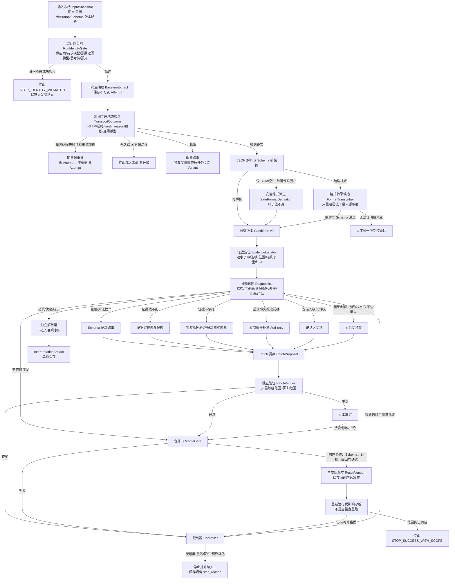

# 中文长篇小说事实抽取：可迭代、可纠错、可停止、可审计的候选管线

> 文档状态：独立咨询候选，不是已批准的产品合同，不替代 CCZ-57 或 CCZ-84 正式验收。  
> 证据日期：2026-08-27。  
> 证据边界：包内四题是合成探针，不是 Gold；五份 Deep Research 原件的外部来源链没有随 Markdown 完整保留。  
> 关键包内依据：`00_READ_ME_FIRST.md`、`01_BACKGROUND_AND_BOUNDARIES.md`、`03_LOCAL_PROBE/00_任务与边界.md`、`03_LOCAL_PROBE/01_合成题面.json`。

## 结论

✅ 推荐的候选形态不是“同一个模型反复想”，而是下面这条受控链：

**冻结输入与身份 → 一次主抽取 → 运输／身份／截断检查 → JSON／Schema 机械检查 → 安全的格式派生 → 证据定位 → 分轴诊断 → 按错误触发专项处理 → Patch 提案 → 独立验证 → 受控合并 → 新版本保存 → 停止或人工升级。**

这条链有四个硬约束：

1. **原始 attempt 永远不可变。** 后续任何“修好后的结果”都是派生版本，不能覆盖原始请求、原始回包或原始解析失败。包内已经用原始 stdout、meta、运行回执和派生纠正回执展示了这种做法：`03_LOCAL_PROBE/responses/raw/`、`03_LOCAL_PROBE/responses/*.meta.json`、`03_LOCAL_PROBE/06_派生纠正回执.md`。
2. **诊断、修复、验证、合并必须是四个不同动作。** 诊断器不得顺手改值；修复器只能交局部 Patch；验证器不得直接写正式结果；合并器只接受通过门槛的 Patch。
3. **每类错误交给最窄的处理器。** 代码围栏由程序剥；说话人问题交给说话人专项；已有因果两端但缺边时只补关系边；动机、伏笔和暗示不写回客观事实层。
4. **循环必须有新信息才值得继续。** 同一错误指纹重复、版本来回震荡、正确项被破坏、预算耗尽或验证器冲突，都要停。五份研究报告共同支持“外部反馈、局部修复、状态持久化、有限重试”的候选方向，但包内未保留完整一手来源，因此仍需本地验证：`02_RESEARCH/RAW/01_成熟GitHub_Agent的迭代纠错实现__RAW.md` 至 `02_RESEARCH/RAW/05_不同抽取错误该交给谁修__RAW.md`。

🔥 当前最应该先做的不是一套复杂 Agent，而是把**不可变原件、机械闸、Patch、验证、版本、停止原因**搭起来。专项模型只有在冻结消融证明净收益后再接入。

---

## 一张完整流程图



### 这张图里的“结果”有三种

- `Attempt`：某次真实调用的不可变事实，包括请求、回包、身份、耗时、Token、错误。它可以失败，也不能被“修成成功”。
- `CandidateVersion`：从一个 Attempt 解析或安全派生出的候选结构。它不是正式真值。
- `ResultVersion`：在某个基线版本上应用已验证 Patch 后生成的新版本。它保留父版本、Patch、验证和人工决定。

说白了就是：**调用历史、候选内容、正式合并版本不能塞进同一个 JSON 里。**

---

## 各模块是否应该存在

| 层 | 决定 | 大白话 | 工程名 | 是否直接改已有结果 |
|---|---|---|---|---|
| 输入冻结与运行身份 | 必须独立存在 | 先锁住“拿什么、用谁、怎么跑”，模型号不对就不发 | `InputSnapshot` + `RunIdentityGate` | 否 |
| 一次主抽取 | 必须存在 | 先拿一份基线，后续只在它上面诊断和提 Patch | `BaselineExtract` | 只创建新 Attempt |
| 运输／截断／身份结果 | 必须独立存在 | 接口成功不等于任务完成，返回模型也必须核对 | `TransportOutcome` | 否 |
| JSON／Schema 机械检查 | 必须独立存在 | 只回答“机器能否读、字段是否合法”，不评价内容对不对 | `ParserGate` + `SchemaGate` | 否 |
| 纯格式确定性派生 | 必须独立存在，范围要小 | 只剥单层围栏、BOM、首尾空白；不能猜括号、改句子 | `SafeFormatDerivation` | 不覆盖；创建派生版本 |
| 证据定位 | 必须独立存在 | 查证据是否真是正文里的连续原文，并记位置 | `EvidenceLocator` | 否 |
| 证据承托检查 | 必须和定位分开 | “原文里找得到”不等于“这段原文证明了这条事实” | `SupportVerifier` | 否 |
| 源文反向覆盖 | 应作为候选层，暂不默认开启 | 从正文反查未被任何事实覆盖的显式动作、台词、数字、否定 | `CoverageScanner` | 只能提 `add` Patch |
| 说话人专项 | 应独立，先做触发式消融 | 只处理“谁说／谁想／消息来自谁” | `SpeakerAttributionSpecialist` | 只碰 speaker、来源边或必要证据锚点 |
| 因果／时间／指代／状态／社会关系专项 | 共享框架，任务配置分开 | 都是“边”，但校验规则不同，不能用一个泛化提示混成一锅 | `RelationSpecialist[type]` | 只碰关系边或指定局部字段 |
| 动机、伏笔、暗示 | 必须独立解释层 | 允许给解释，但不能伪装成正文客观事实 | `InterpretationLayer` | 不得写事实层 |
| Patch 提案 | 必须独立存在 | 修复器只交修改单，不交整包替换结果 | `PatchProposal` | 否；只生成候选 Patch |
| 独立验证 | 必须存在；早期可人工承担 | 判断 Patch 是否真修对、有没有伤到原来正确项 | `PatchVerifier` | 否 |
| 合并与版本保存 | 必须独立存在 | 只有合并器能落新版本，而且每次都能回到父版本 | `MergeGate` + `ResultVersion` | 创建新版本，不覆盖父版本 |
| 预算、无进展、震荡、人工停损 | 必须独立存在 | 防止模型围着同一个错无限打转 | `RepairController` | 只改运行状态 |

### 哪些可以共用，哪些不能合并

**可以共用的：**

- 因果、时间、指代、状态变化、社会关系可以共用同一套任务编排、Patch 数据结构、预算和审计日志。
- 所有诊断可以共用统一的 `Diagnostic` 外壳。
- 所有专项修复可以共用统一的 `PatchProposal` 外壳。
- 所有验证可以共用统一的分轴 verdict 格式。

**不能合并的：**

- `JSON 合法` 与 `Schema 合法` 不能合并。包内 Doubao Lite Q2 是 JSON 本身坏掉；空 `speaker` 则是 JSON 可解析但 Schema 不合法：`03_LOCAL_PROBE/10_AgentPlan第二批观察.md`、`03_LOCAL_PROBE/06_派生纠正回执.md`。
- `Schema 合法` 与 `值正确` 不能合并。Doubao Mini、SenseNova 的 Q2 把“没有立刻站起来”标为“已发生”，Schema 仍合法：`03_LOCAL_PROBE/10_AgentPlan第二批观察.md`、`03_LOCAL_PROBE/12_sensenova68_ling30_observe.md`。
- `证据能定位` 与 `证据能承托` 不能合并。前者是字符串和位置问题，后者是语义判断。
- `显式事实覆盖` 与 `关系正确` 不能合并。Q4 多个结果抽到了跳闸与渗水两端，却没有因果边：`03_LOCAL_PROBE/04_逐题观察表.md`、`03_LOCAL_PROBE/08_官方Flash非思考观察.md`。
- `关系事实` 与 `动机／伏笔解释` 不能合并。后者可能合理，但不一定由文本直接证明。
- `修复` 与 `验证` 不能由同一动作完成。修复器天然倾向相信自己的修改，验证器要能拒绝它。
- `验证通过` 与 `产品可用` 不能合并。即使单条正确，调用数、耗时、费用和人工升级率也可能不可接受。


---

## 模块执行契约总表

这张表把每层的读写边界放在一起。详细规则见后面的 M00～M14。

| 模块（大白话／工程名） | 读取 | 输出 | 能否改已有结果 | 保存什么 | 机器触发 | 负责人 | 怎样证明净改善 | 必须停 |
|---|---|---|---|---|---|---|---|---|
| 锁住输入和身份／`InputSnapshot` + `RunIdentityGate` | 正文、背景卡、Prompt、Schema、精确模型身份、预算、授权 | `run_id`、`variant_id`、冻结快照 | 否 | 原文与配置哈希、目录快照、授权引用 | 每个 run；任一身份／权限不符 | 程序 | 身份漂移为 0，可按哈希重放 | 未授权、模型不符、配置不符 |
| 交第一版／`BaselineExtract` | 冻结快照 | 不可变 `Attempt`、可解析时的 `CandidateVersion v0` | 只创建，不覆盖 | 原始请求／回复、调用 ID、Token、耗时、费用 | 身份闸通过 | 主抽模型 + 程序 | 后续方案相对 one-shot 的 W→C、C→W 与成本 | 永久运输失败、身份漂移、预算不足 |
| 判断有没有完整回来／`TransportOutcome` | HTTP／SDK 回执、响应 envelope、冻结身份 | 成功、超时、截断、finish reason、返回模型 | 否 | 每次 Attempt 的运输回执和响应哈希 | 每个 Attempt | 程序 | 运输问题不再混入语义错误，截断可独立统计 | 身份异常、永久错误、重试预算耗尽 |
| 检查机器能否读／`ParserGate` + `SchemaGate` | 原始正文、冻结 Schema | 解析状态、Schema 状态、Pointer 级错误 | 否 | parser／validator 版本、错误列表、错误指纹 | 收到非空响应 | 程序 | 冻结错误集里的已定义格式错误全部检出；未覆盖类型明示 `NOT_CHECKED` | 校验器版本不明、错误重复且没有新策略 |
| 只剥外壳／`SafeFormatDerivation` | 原始响应、白名单变换、Schema | 派生 JSON、叶子不变量报告 | 不覆盖；只建派生件 | 变换步骤、前后哈希、叶子映射 | BOM、首尾空白或单层完整围栏 | 程序 | 解析成功增加，所有叶子值和数组顺序不变 | 非白名单变换、叶子无法一一对应 |
| 给证据钉位置／`EvidenceLocator` | 正文、背景卡边界、候选 facts | 字符区间、命中数、句数、来源部分 | 否 | `EvidenceAnchor`、定位器版本、匹配方式 | 每条候选事实 | 程序 | 正式候选均有可追踪连续锚点，歧义不静默通过 | 找不到、只在背景卡、多重歧义未解 |
| 看证据是否真能证明／`SupportVerifier` | 单条事实、状态、speaker、锚点和必要上下文 | `SUPPORTED/CONTRADICTED/INSUFFICIENT/AMBIGUOUS` | 否 | verdict、短理由、检查范围、争议 | 锚点已找到；或字段语义诊断命中 | 独立 verifier／人工／规则组合 | 错误放行和正确拒绝分别下降，C→W 不增加 | 冲突、跨章依赖、指代不唯一 |
| 从源文反查漏项／`CoverageScanner` | 正文、已定位锚点、覆盖图 | `CoverageGap`、add-only Patch 候选 | 只能提新增候选 | 未覆盖区段、触发词、候选和拒绝原因 | 显式动作／台词／数字／否定无锚点覆盖 | 程序 + 覆盖专项模型 | 显式事实召回增加，假项、重复、矛盾受控 | 无 Gold、两轮无新通过项、假项激增 |
| 只查谁说谁想／`SpeakerAttributionSpecialist` | 触发事实、局部上下文、角色表、指代候选 | speaker／来源边 Patch 或歧义结论 | 只碰 speaker、来源边、必要锚点 | 候选说话人、证据、被触碰路径、拒绝原因 | 引语／认知词存在且 speaker 缺失、空、冲突或泛化 | 说话人专项 + 程序规则 | 触发子集 W→C 增加，未触碰字段零变化 | 候选不唯一、跨章、两轮来回切换 |
| 只补关系边／`RelationSpecialist[type]` | 已验证端点、局部正文、当前关系图 | edge-only Patch、`NO_EDGE` 或 `AMBIGUOUS` | 只碰指定关系边和证据 | 端点 ID、边类型、方向、证据、图检查 | 因果／时间／指代／状态／关系变化信号命中 | 对应专项模型 + 程序 | 关系切片 W→C 高于整包重生成，diff 与 C→W 更低 | 端点不稳、方向不唯一、产生环、出现震荡 |
| 把推断另放一层／`InterpretationLayer` | 已验证事实、正文证据、必要上下文 | `InterpretationArtifact` | 不得改事实层 | 推断类型、证据、多个解释、作者决定 | 动机／伏笔／暗示请求或候选信号 | 解释模型／人工 | 作者可用性提升且不会被当成客观事实检索 | 材料不足、作者拒绝、解释越权 |
| 交修改单／`PatchProposal` | 基线版本、诊断、允许路径、局部正文 | 带前置条件和证据的 Patch | Patch 本身不写结果 | 基线哈希、操作、allowed/touched paths、diff、证据 | 某个可操作诊断命中 | 程序／专项模型／人工 | W→C 增加，C→W 与触碰范围小于重生成 | 越界、无证据、基线过期、混改多个无关错误 |
| 只判断能不能合／`PatchVerifier` | 基线局部、Patch、修改后预览、回归范围 | 分轴 verdict、争议、`ACCEPT/REJECT/HUMAN_REVIEW` | 否 | verifier 身份、提示版本、范围、原始 verdict | 每张语义 Patch；机械 Patch 走程序验证 | 程序／独立 verifier／人工 | 正确 Patch 放行、错误 Patch 拒绝、误拒和争议率分开达标 | 不覆盖该类型、结论冲突、验证成本越界 |
| 另建正式版本／`MergeGate` + `ResultVersion` | 父版本、Patch、验证、Schema、证据、预算 | 新版本或拒绝记录 | 只建子版本，不覆盖父版本 | 父子关系、Patch、完整内容、diff、哈希、人工决定 | Patch 通过所需验证且前置条件仍成立 | 程序合并器；人工可批准高风险项 | 未触碰字段不变，可回滚、可复放，回归为 0 | 前置条件失败、Schema／证据／回归门失败 |
| 决定继续还是停／`RepairController` | 预算、错误指纹、版本哈希、诊断向量、Patch 历史 | 下一动作、预算账、`stop_reason` | 只改运行状态 | 调用／Token／耗时／费用、进展、震荡、停止原因 | 每次诊断、验证或合并后 | 程序；争议时人工 | 无效调用、重复 Patch 和回归下降；停止可解释 | 无进展、震荡、回归、预算耗尽、人工接管 |

---

## 模块明细

## M00｜输入冻结与运行身份

**大白话：** 在任何调用前，把正文、背景卡、Prompt、Schema、模型身份和预算锁成一张只读快照。模型名或配置对不上就停，不许自动换号。

**读取：**

- 正文与背景卡原文；
- `prompt_version`、`prompt_sha256`；
- `schema_id`、`schema_sha256`；
- 供应商、请求模型 ID、预期返回模型 ID；
- 思考开关、思考档、温度、最大输出 Token；
- 调用授权、预算、允许的 fallback 列表。

**输出：** `InputSnapshot`、`RunIdentity`、`run_id`、`variant_id`。

**允许修改已有结果：** 不允许。

**保存：** 原文哈希、Prompt／Schema 哈希、模型目录快照、调用身份、授权来源、时间戳。

**机器触发：** 每次 run 必经；模型目录、模型 ID、供应商、思考能力或权限不匹配时触发停止。

**负责人：** 程序。

**怎样证明净改善：** 身份漂移为 0；任何未授权切模都被发网前拦截；同一变体可重放。

**必须停：** 请求模型不在目录、响应模型与冻结预期不符、思考模式与冻结配置不符、授权缺失。

**包内直接证据：** Agent Plan 的旧 DeepSeek 请求名已不在实时目录，系统发网前停止且没有换到新 ID：`03_LOCAL_PROBE/03_模型选择与身份.json`、`03_LOCAL_PROBE/06_派生纠正回执.md`。

---

## M01｜一次主抽取

**大白话：** 主模型只负责交第一版候选，不直接宣布“最终正确”。

**读取：** 冻结正文、背景卡、Prompt、Schema、采样配置。

**输出：** 不可变 `Attempt`，其中保存原始请求和原始回复；若能解析，再生成 `CandidateVersion v0`。

**允许修改已有结果：** 不允许。重试也必须创建新 `attempt_id`。

**保存：** 请求字节、响应字节、HTTP 状态、返回模型、finish reason、Token、耗时、费用、重试索引、原始哈希。

**机器触发：** 身份闸通过后只调用一次。后续不得因为某个局部错误默认整包重抽。

**负责人：** 主抽模型 + 程序封装。

**怎样证明净改善：** 以强 one-shot 基线为对照，后续模块要报告相对它的错转对、对转错和成本，不得只报修复后分数。

**必须停：** 运输永久失败、身份漂移、预算不足、输入超过已批准上限。

**当前建议：** 主抽默认使用低复杂度／非思考配置作为基线候选。包内低思考探针没有显示稳定语义收益，反而出现截断与坏 JSON；这只是在四道合成题上的直接现象，不是全局结论：`03_LOCAL_PROBE/14_thinking_low_observe.md`。

---

## M02｜运输、身份、完成态

**大白话：** 先判断“这次调用到底有没有完整回来”，再谈内容。

**读取：** HTTP／SDK 回执、响应 envelope、请求身份。

**输出：**

- `request_success`；
- `http_status`、`timeout`、`network_error`；
- `requested_model`、`response_model`、`identity_match`；
- `finish_reason`、`truncated`；
- `raw_response_hash`。

**允许修改已有结果：** 不允许。

**机器触发：** 所有 Attempt。

**负责人：** 程序。

**净改善证据：** 运输失败不再误算成抽取失败；身份异常不会污染模型对照；截断样本单独统计。

**必须停：** 身份不符立即停；永久 4xx／配置错误不重试；同一临时运输错误达到预算后停。

**重试纪律：**

- 临时网络／5xx／超时：相同身份最多 1～2 次，采用新 Attempt；具体上限需本地压测后定。
- “已发送但是否执行未知”要保留调用 ID 并查询，不可盲重发。
- 参数变化、换供应商、从 4096 改 8192，都算新 `variant_id`，不能混进普通重试。

---

## M03｜JSON 与 Schema 机械闸

**大白话：** 只做机器能确定的检查，不猜作者语义。

**读取：** 原始模型正文、冻结 Schema。

**输出：**

- `json_parse_ok`；
- `schema_ok`；
- 每个错误的 JSON Pointer；
- 非法空值、额外字段、缺失字段、枚举错误；
- `diagnostic_code`，例如 `JSON_UNESCAPED_QUOTE`、`SCHEMA_EMPTY_OPTIONAL`。

**允许修改已有结果：** 不允许。

**负责人：** 程序。

**净改善证据：** 在冻结格式错误集上，已定义错误类型全部检出；未覆盖类型必须显式标记 `NOT_CHECKED`。同一输入与校验器版本下结果可重复。

**必须停：** 解析器／Schema 自身版本不明确；格式转录后仍不能证明值来源；同一格式错误重复两次且无新策略。

**包内直接证据：**

- Doubao Lite Q2 回包完成但 JSON 结构散掉：`03_LOCAL_PROBE/responses/raw/doubao_seed_2_0_lite_Q2.stdout.bin`、`03_LOCAL_PROBE/10_AgentPlan第二批观察.md`。
- GLM-5.2 Q1／Q2 外层代码围栏，剥围栏后 Schema 合法：`03_LOCAL_PROBE/responses/raw/glm_5_2_Q1.stdout.bin`、`03_LOCAL_PROBE/09_AgentPlan第二批运行回执.json`。
- 多个 Q1／Q2 有空 `speaker`，JSON 可解析但 Schema 不合法：`03_LOCAL_PROBE/06_派生纠正回执.md`、`03_LOCAL_PROBE/08_官方Flash非思考观察.md`。

---

## M04｜安全格式派生

**大白话：** 只处理“不改变任何事实值”的外壳问题。

### 可自动做

- 去 UTF-8 BOM；
- 去首尾纯空白；
- 当且仅当正文由**一个完整单层** ` ```json ... ``` ` 或 ` ``` ... ``` ` 包裹时，剥掉围栏；
- 统一记录换行，但不改字符串内部字符；
- 重新解析并跑同一 Schema。

### 不能自动做

- 猜缺失逗号、括号或数组层级；
- 把中文引号擅自改成转义引号；
- 删除或重写事实句；
- 把非法枚举映射到“最像”的合法值；
- 把空 `speaker` 直接当成“没有说话人”。对话事实可能是漏填，纯删除会掩盖语义问题。

**输出：** `DerivedArtifact`，记录 `parent_attempt_id`、变换步骤、变换前后字节哈希、叶子值不变量检查。

**允许修改已有结果：** 不覆盖，只建派生件。

**负责人：** 程序。

**净改善门槛：** 解析／Schema 成功率提升，同时所有叶子字符串、数值、布尔值和数组顺序完全不变。任何叶子变化都算失败。

**停止：** 不是白名单变换、存在多层围栏、剥除后仍不合法、叶子值无法一一对应。

### 结构损坏时的候选做法

可测试一个**格式转录器**，它只读取“坏 JSON 原文 + Schema”，不读取小说正文，输出合法结构，并为每个叶子值给出其在原始回复中的字符区间。程序必须验证：

- 每个输出叶子都能在原始回复中找到等价原串；
- 没有新增叶子；
- 没有丢失可识别叶子；
- Schema 通过。

这目前只有设计依据，没有本地净收益证据，应先做消融，不能直接进入自动合并。

---

## M05｜证据定位

**大白话：** 给每条 evidence 在正文里钉一个位置，回答“它是不是原文连续片段”。

**读取：** 冻结正文、背景卡边界、候选 facts。

**输出：**

- `evidence_found`；
- `source_start`、`source_end`；
- `match_count`；
- `sentence_count`；
- 是否跨越正文边界、是否来自背景卡；
- `normalized_match_only`，只供诊断，不自动修改证据。

**允许修改已有结果：** 不允许。

**机器触发：** 每条事实。

**负责人：** 程序。

**净改善证据：** 正式版本中 100% evidence 有可追踪锚点；任何找不到或多重歧义的证据不会静默通过。

**必须停：** 找不到连续原文、证据只在背景卡、唯一位置不能确定、超过合同句数。

### 为什么不能和承托验证合并

“泥水渗进裤脚，他没有立刻站起来”能在正文中找到，但把它标成 `已发生` 还是 `否定` 不是字符串搜索能决定的。包内 Doubao Mini 和 SenseNova 在这里给出了 Schema 合法但语义可疑的结果：`03_LOCAL_PROBE/10_AgentPlan第二批观察.md`、`03_LOCAL_PROBE/12_sensenova68_ling30_observe.md`。

---

## M06｜证据承托检查

**大白话：** 判断这段证据是否真的能证明 `fact + status + speaker`。

**读取：** 单条事实、状态、speaker、证据锚点、必要的前后文窗口；不默认读取整包修复历史。

**输出：** 分轴 verdict：

- `SUPPORTED`：证据足够；
- `CONTRADICTED`：证据与事实冲突；
- `INSUFFICIENT`：原文存在但不足以承托；
- `AMBIGUOUS`：存在多个合理解释；
- `NOT_CHECKED`：当前检查器不覆盖。

同时输出覆盖范围和短理由，不要求也不保存隐藏思维链。

**允许修改已有结果：** 不允许。

**负责人：** 早期由人工或独立 verifier；以后可加规则和模型组合。

**净改善证据：** 在获批 Gold 上，错误放行率和正确拒绝率单独报告；修复后的 `C→W` 不增加。

**必须停：** verifier 与人工持续冲突、证据需要跨章知识、角色指代无法唯一确定、同一 Patch 两个 verifier 得出相反结论。

---

## M07｜源文反向覆盖与显式事实补漏

**大白话：** 不问“模型还想到了什么”，而是从正文逐段反查：哪些明确动作、台词、数字、否定、状态变化还没有任何事实覆盖。

**读取：** 冻结正文、已定位事实锚点、当前覆盖地图、触发词与句法候选。

**输出：** `CoverageGap` 和**只允许新增**的 Patch 候选。

**允许修改已有结果：** 不能改现有事实，只能提 `add`；去重和冲突由后续验证处理。

**机器信号：**

- 有人物／实体 + 明确动作，但没有任何事实锚点覆盖；
- 引号、说话动词、数字、时间、否定词、条件词、因果连接词未被事实覆盖；
- 长章节尾部或中段出现大块无覆盖区；
- 当前 Gold 切片确认漏抽集中在显式事实。

**负责人：** 程序生成候选区段，主抽模型或覆盖专项模型提出 add-only Patch，独立 verifier 验证。

**净改善证据：** 显式事实召回上升，同时新增项精度、重复率和矛盾率保持门槛；必须和等 Token 的独立采样对照。

**必须停：** 新增项大多是解释或复述、重复／矛盾升高、两轮后覆盖缺口指纹不变、没有正式 Gold 可判召回。

**当前状态：** 研究候选，需要本地验证。包内四题没有正式 Gold，不能据此证明覆盖收益。

---

## M08｜说话人专项

**大白话：** 只有出现说话、转述、认知来源问题时，才让专门处理器判断“谁说的／谁认为的／信息来自谁”。

**读取：** 触发事实、引语／认知句、局部前后文、角色实体表、指代候选；不读取无关事实。

**输出：**

- `speaker` 局部 Patch；或
- `attribution_edge`；或
- `AMBIGUOUS`／`SOURCE_UNKNOWN`，不强填。

**允许修改：** 只允许碰 `speaker`、来源链、必要的 evidence 锚点；不得重写其他事实、状态或关系。

**机器信号：**

- 引号或说话动词存在，但 speaker 缺失／空串；
- 认知、推测、转述事实没有来源；
- speaker 是“旁白”“对讲机”“众人”等疑似泛化值；
- speaker 与证据中的主语冲突。

**负责人：** 说话人专项模型；简单的直接引语邻接规则可由程序先做候选。

**净改善证据：** 只在触发子集上比较 speaker 的错转对、对转错；`touched_paths` 之外必须零变化。

**必须停：** 指代跨越过长、候选说话人不唯一、来源链超出当前上下文、同一 speaker 在两轮间来回切换。

**包内直接现象：**

- Q4 的“司机回了一句‘知道了’”有结果漏填 speaker，但 Schema 仍合法：`03_LOCAL_PROBE/04_逐题观察表.md`、`03_LOCAL_PROBE/08_官方Flash非思考观察.md`。
- Ling 在 Q2 给所有事实填 speaker，包括大量“旁白”，说明“字段非空”不等于说话人策略正确：`03_LOCAL_PROBE/12_sensenova68_ling30_observe.md`。

---

## M09｜关系专项族

**大白话：** 当实体或事件节点已经有了，只缺“它们之间是什么关系”时，只补边，不整包重写。

### 共用接口

```text
RelationSpecialist[type]
input  = source_window + endpoint_ids + current_edges + trigger
output = edge_patch[] | NO_EDGE | AMBIGUOUS
```

### 任务配置必须分开

| 类型 | 允许输出 | 典型触发 | 不能做什么 |
|---|---|---|---|
| 因果 `CAUSES` | 原因事件、结果事件、证据锚点、方向 | 因／因为／导致／所以／便／于是；两端已存在但无边 | 不得新增无证据动机 |
| 时间 `BEFORE/AFTER/OVERLAP` | 两事件时间边 | 前后、随后、直到、期间、先后词；时间矛盾 | 不得把篇章顺序一律当时间因果 |
| 指代 `COREFERS_TO` | mention → entity | 代词、多名同姓、称谓变化、跨句主体缺失 | 不得凭常识合并角色 |
| 状态变化 `TRANSITION` | 主体、before、after、触发事件 | 从 A 到 B、松开、倒下、恢复、失去、获得 | 不得把情绪暗示升级成确定状态 |
| 社会／资源关系 `RELATION_CHANGE` | relation、方向、有效时间 | 不再做助理、交还物、锁共用物、结盟／决裂 | 不得只凭象征动作断言法律或正式关系 |

**读取：** 只读相关节点、局部正文和当前边。

**输出：** edge-only Patch。

**允许修改：** 关系边及其证据，不允许重写已经通过验证的节点。

**负责人：** 对应专项模型；程序做触发和图一致性检查。

**净改善证据：** 关系切片的 W→C 高于整包 regenerate，C→W 和 diff 规模显著更低。

**必须停：** 端点本身未验证、关系方向不唯一、证据需要跨章、同一边在有／无之间震荡、Patch 改动了节点正文。

**当前最有理由先测的是因果边：** Q4 多个结果能抽到温控器跳闸与荔枝渗水，却没有明确因果命题；非思考 Mini／Lite 曾写出因果，最低思考又丢失，说明“端点存在但边不稳定”是可观察问题：`03_LOCAL_PROBE/10_AgentPlan第二批观察.md`、`03_LOCAL_PROBE/14_thinking_low_observe.md`。

---

## M10｜动机、伏笔和暗示的独立解释层

**大白话：** 可以解释“可能为什么这样做”“可能是不是伏笔”，但它不能混进客观事实库。

**读取：** 已验证事实、正文证据、必要上下文。

**输出：** `InterpretationArtifact`：

- `SOURCE_ATTESTED`：正文明确说出；
- `INFERENCE`：由事实推得，但正文未明说；
- `AMBIGUOUS`：多种解释；
- `INSUFFICIENT`：材料不足。

**允许修改事实层：** 不允许。

**负责人：** 独立解释模型或人工。

**净改善证据：** 作者认为解释有帮助、引用证据准确、不会被检索成客观事实；这属于产品研究，不是抽取准确率。

**必须停：** 解释被写成客观事实、来源不够、作者拒绝、多个解释无法区分。

**当前建议：** 不进入最小版本。包内没有正式 Gold 能定义“正确动机／正确伏笔”。

---

## M11｜Patch 提案

**大白话：** 修复器交的是“改哪一格、为什么改、证据在哪”，不是一份新整包。

**读取：** 基线版本、触发诊断、允许触碰路径、局部正文。

**输出：** Patch，至少包含：

```json
{
  "patch_id": "patch_...",
  "base_version_id": "ver_...",
  "base_content_sha256": "...",
  "trigger_diagnostic_ids": ["diag_..."],
  "producer": {
    "type": "program|main_model|specialist|human",
    "model_identity": "optional"
  },
  "scope": {
    "allowed_paths": ["/facts/f_12/speaker"],
    "touched_paths": ["/facts/f_12/speaker"]
  },
  "operations": [
    {
      "op": "add|remove|replace|test",
      "path": "/facts/f_12/speaker",
      "value": "司机"
    }
  ],
  "evidence_refs": ["span_..."],
  "before_after_diff": "...",
  "claimed_fix": "MISSING_SPEAKER"
}
```

**允许修改已有结果：** Patch 本身不修改；只有 MergeGate 能应用。

**负责人：** 程序、专项模型或人工。

**净改善证据：** Patch 触碰范围比整包 regenerate 小；W→C 增加，C→W 降低；未触碰字段哈希保持不变。

**必须停：** Patch 越界、基线哈希不符、没有证据、修改范围过大、一次 Patch 同时处理多个无关错误。

---

## M12｜独立验证

**大白话：** 验证器只回答“这张修改单能不能合”，不直接重写结果。

**读取：** 基线局部、Patch、修改后局部、证据锚点、受影响的回归范围。

**输出：**

```text
structure_verdict
value_verdict
support_verdict
coverage_verdict
relation_verdict
regression_verdict
scope_checked
disagreements
final_recommendation = ACCEPT | REJECT | HUMAN_REVIEW
```

**允许修改：** 不允许。

**负责人：**

- 机械不变量：程序；
- 语义承托／关系：独立 verifier；
- 高争议或高影响：人工。

“独立”最少意味着**不同提示、不同上下文、只看 Patch 而不是让修复器给自己打分**。是否必须换模型或供应商，需要消融决定。

**净改善证据：** 正确 Patch 放行率、错误 Patch 拒绝率、误拒率、人工争议率分别报告。

**必须停：** verifier 不能覆盖该类型、结果冲突、两次验证结论相反、验证成本高于修复收益。

---

## M13｜合并与版本保存

**大白话：** 合并是一道程序门，不是模型一句“看起来好了”。

**读取：** 父版本、Patch、验证结论、Schema、证据锚点、控制器预算。

**输出：** 新 `ResultVersion`，包括父版本、应用 Patch、完整内容哈希、版本 diff、验证和人工决定。

**允许修改：** 不覆盖父版本，只创建子版本。

**合并条件：**

- `base_version_id` 与内容哈希匹配；
- Patch 所有 `test` 前置条件通过；
- `touched_paths ⊆ allowed_paths`；
- 应用后 JSON／Schema 通过；
- 新证据能定位；
- 必需的承托／关系验证通过；
- 未触碰字段哈希不变；
- 不产生重复、矛盾或已知回归；
- 预算未超。

**必须停：** 任一条件失败；同一基线已有冲突 Patch；人工明确拒绝。

---

## M14｜预算、无进展、震荡、回归与人工停损

**大白话：** 不是“最多循环 5 次”这么简单，而是每次都要证明有新信息和净进展。

### 建议保存的预算

- `max_total_calls`；
- `max_calls_by_handler`；
- `max_attempts_per_error_signature`；
- `max_output_tokens_total`；
- `max_elapsed_ms`；
- `max_cost`；
- `max_human_reviews`；
- `max_patch_count`。

### 无进展

满足任一条件即可标记：

- 同一 `error_signature` 连续两次仍存在，严重度未下降；
- 新 Patch 通过后，诊断向量没有任何一轴改善；
- 修复器连续两次给出同值或同 Patch；
- 两轮新增事实全被 verifier 拒绝；
- Token／耗时增加，但 accepted fixes 为 0。

### 震荡

- 内容哈希在最近 4 个版本中重复；
- 同一路径出现 `A → B → A`；
- 同一关系边在“存在／不存在”之间切换；
- 两个处理器反复提交互为逆操作的 Patch。

### 回归

- 先前已通过的事实变成不承托；
- 正确项被删、状态变错、speaker 变错；
- 重复和矛盾增加；
- 未触碰字段发生变化；
- 运输／格式成功但产品指标恶化到门槛外。

### 停止原因必须是机器可读值

```text
STOP_SUCCESS_WITH_SCOPE
STOP_IDENTITY_MISMATCH
STOP_TRANSPORT_PERMANENT
STOP_TRUNCATION_UNRESOLVED
STOP_SCHEMA_UNRESOLVED
STOP_NO_PROGRESS
STOP_OSCILLATION
STOP_REGRESSION
STOP_BUDGET_EXHAUSTED
STOP_VERIFIER_CONFLICT
STOP_HUMAN_REQUIRED
STOP_CANCELLED
```

---

## 一次抽取、任务分解、思考、多轮补漏、独立互审各适合什么

| 方法 | 适合 | 不适合 | 当前判断 |
|---|---|---|---|
| 一次主抽取 | 建立低成本基线；抽显式动作、状态、关系节点 | 不能保证覆盖、证据承托或关系边完整 | 必须保留，后续都和它比较 |
| 任务分解 | 已知错误类型明确；说话人、因果边、时间边、指代等局部任务 | 错误类型不明、端点本身错误、拆分成本过高 | 最有希望，但要按触发子集消融 |
| 打开思考 | 可能用于狭窄复杂关系；需要单独验证 | 不应当作默认“升级键”；可能吃掉输出预算、写坏格式 | 当前四题探针不支持默认开启，见 `03_LOCAL_PROBE/14_thinking_low_observe.md` |
| 多轮反向覆盖／补漏 | 显式事实漏抽、长文尾部／中段覆盖不足 | 暗示、动机、证据薄弱的候选；没有 Gold 时无法证明召回 | 只做 add-only 候选，先测净增益 |
| 同模型自我批评 | 低成本生成诊断候选 | 容易重复原偏差或把正确项改坏 | 不能当验证器默认方案 |
| 独立 verifier | 验证局部 Patch、关系方向、证据承托 | verifier 本身未经校准、成本过高、任务定义含混 | 应存在；先人工／规则，模型独立性做消融 |
| 独立模型互审 | 检测模型族特有偏差、降低同源相关错误 | 不能自动等于真值；两个模型也可能一起错 | 只作为验证候选，不做多数票真值 |
| 整包 regenerate | 基线彻底不可解析且没有可恢复内容；Prompt 或 Schema 已正式升级 | 局部错误、关系漏边、speaker 缺失 | 默认禁止；必须作为新分支并证明优于 Patch-only |

外部公开研究可以为这些方向提供旁证，但不把它们升级成当前产品结论：有论文报告无外部反馈的自我修正可能退化，也有工作用多轮任务分解做信息抽取、用外部工具反馈做修正。它们与中文长篇目标任务之间仍有迁移距离。

---

## 分轴结果，不设一个总 PASS

每个 Attempt、CandidateVersion、Patch 和 ResultVersion都应并排保存：

| 轴 | 典型字段 | 能证明什么 | 不能证明什么 |
|---|---|---|---|
| 请求与身份 | HTTP、超时、finish reason、requested/response model | 调用是否完整、身份是否一致 | 内容是否正确 |
| JSON 解析 | `json_parse_ok` | 机器是否能读 | Schema 与语义是否正确 |
| Schema | required、enum、minLength、extra fields | 结构是否符合合同 | 字段值、证据、覆盖是否正确 |
| 字段值 | fact/status/speaker | 单字段是否符合标注 | evidence 是否承托、是否漏抽 |
| 证据定位 | start/end、连续、句数 | evidence 是否来自正文 | 是否真正证明命题 |
| 证据承托 | support verdict | 证据是否支持命题 | 源文是否还有漏项 |
| 显式事实覆盖 | Gold／锚点覆盖 | 明说事实是否漏抽 | 关系方向和解释是否正确 |
| 关系切片 | speaker/causal/time/coref/state/relation | 具体边是否正确 | 全章整体可用 |
| 修复净效应 | W→C、C→W、retained correct、diff | 修复是否有净收益 | 产品成本是否可接受 |
| 产品指标 | 调用数、Token、耗时、费用、人工率 | 能否落地 | 内容真值本身 |

任何界面上的“成功”都必须带作用域，例如：

```text
结构检查通过；证据定位 18/18；承托检查覆盖 12/18；
因果关系未检查；显式事实覆盖未知；需要人工审 2 条。
```

不能只显示一个绿色 PASS。

---

## 两级实施方案

## 最小可运行版本（建议现在只做到这里）

### 目标

用尽量少的模块，把当前最清楚的失败从“静默污染”变成“可见、可局部修、可回滚”。

### 模块

1. `InputSnapshot + RunIdentityGate`；
2. 一次非思考主抽取，保存不可变 Attempt；
3. 运输、身份、截断检查；
4. JSON 解析与 Draft 2020-12 Schema 检查；
5. 白名单格式派生：BOM／首尾空白／单层代码围栏；
6. evidence 逐字定位和位置保存；
7. 六轴诊断报告，不做总 PASS；
8. Patch 数据结构、before/after diff、版本保存；
9. 机械 Patch 由程序验证；语义 Patch 由人工批准；
10. 控制器：默认 1 次主抽 + 最多 1 次定向修复 + 必要时 1 次验证，重复错误立即停。

### 当前能处理

- 模型身份异常；
- 网络／超时／截断分类；
- 代码围栏；
- JSON／Schema 错误显式化；
- 空 `speaker` 的分流，而不是静默放行；
- evidence 不在正文；
- 局部 Patch、版本和回滚；
- Q4 这种“端点存在但关系边缺失”可被机器触发并交人工补边。

### 当前不自动做

- 通用坏 JSON 猜修；
- 源文反向补漏自动合并；
- 说话人模型自动改值；
- 因果／时间／指代模型自动补边；
- 同模型多轮自我批评；
- 动机、伏笔写回事实层；
- 模型多数票；
- 自动换供应商或模型 ID。

这个版本不“像 Agent”，但已经具备迭代、纠错、停止和审计的核心骨架。

## 演进版本（只有消融通过后再加）

按证据顺序接入：

1. **格式转录器**：只在叶子来源映射 100% 通过时启用；
2. **因果 edge-only 专项**：当前最明确的关系缺失候选；
3. **说话人专项**：只在缺失／空串／冲突子集触发；
4. **显式事实反向覆盖**：只生成 add-only Patch；
5. **证据承托 verifier**：先小切片校准；
6. **时间、指代、状态变化、社会关系专项**：各自独立消融；
7. **独立模型验证**：证明比同模型验证更可靠后接入；
8. **解释层**：作为作者辅助，不进入客观事实库。

任何演进模块都必须回答三件事：

- 它修对了多少原本错误项？
- 它把多少原本正确项改坏了？
- 它增加了多少调用、Token、耗时、费用和人工？

答不出来就不进默认链。

---

## 当前明确不该做的事

❌ 不把低思考或高思考设成默认“质量增强”。包内低思考样本出现大量截断、坏 JSON 和因果退化；8192 只显示部分截断得到缓解，不能证明语义更好：`03_LOCAL_PROBE/14_thinking_low_observe.md`、`03_LOCAL_PROBE/17_t8k_*_partial.json`。

❌ 不把所有失败都送回主模型整包 regenerate。这样最容易无痕覆盖正确项，也无法判断是哪一步带来变化。

❌ 不让修复模型兼任最终验证器。

❌ 不用 Schema PASS 代替事实正确、证据承托、覆盖完整或关系正确。

❌ 不让反向覆盖直接写正式结果。它只能提新增候选。

❌ 不把动机、伏笔、暗示塞进客观事实表。

❌ 不用四道合成题计算模型正式准确率、排名或“可上线”结论。

---

## 外部公开来源的有限复核

这次网页核对只确认了若干工程／研究模式确实有公开一手材料，并不替代中文长篇本地验证：

- JSON Schema 2020-12 的验证语义只约束实例结构，正好支持把“结构合法”和“内容正确”分开。
- RFC 6902 定义了对 JSON 文档的局部操作，可作为 Patch 外形参考；本设计仍需增加证据、作用域和验证字段。
- LangGraph 官方文档说明 checkpoint 可保存线程状态，interrupt 可能重跑节点，因此副作用应具备幂等性。
- Temporal 官方文档强调重试会重新执行 Activity，建议把动作拆细并保证幂等；永久错误不应盲重试。
- OpenReview 上的自我修正研究报告：没有外部反馈时，模型自我修正可能不稳定或退化；另有工具反馈框架显示外部验证可帮助修正。
- ChatIE 把零样本信息抽取拆成多轮子任务，说明“任务分解”是可测候选，但不能直接外推到中文长篇事实合同。

具体链接和包内证据等级见 `EVIDENCE_AND_UNCERTAINTY.md`。

---

## 关键包内路径索引

- 总边界：`00_READ_ME_FIRST.md`、`01_BACKGROUND_AND_BOUNDARIES.md`
- 合成题与非 Gold 声明：`03_LOCAL_PROBE/00_任务与边界.md`、`03_LOCAL_PROBE/01_合成题面.json`
- 冻结 Prompt／Schema：`03_LOCAL_PROBE/02_冻结Prompt.md`、`03_LOCAL_PROBE/frozen/novel_fact_extraction_v2.schema.json`
- 身份停止：`03_LOCAL_PROBE/03_模型选择与身份.json`、`03_LOCAL_PROBE/06_派生纠正回执.md`
- 空 speaker／Q4 因果缺失：`03_LOCAL_PROBE/04_逐题观察表.md`、`03_LOCAL_PROBE/08_官方Flash非思考观察.md`
- 坏 JSON／围栏／Schema 与语义分离：`03_LOCAL_PROBE/10_AgentPlan第二批观察.md`
- speaker 过填与状态标签问题：`03_LOCAL_PROBE/12_sensenova68_ling30_observe.md`
- 低思考截断、坏 JSON、因果退化：`03_LOCAL_PROBE/14_thinking_low_observe.md`
- 4096→8192 原始变体：`03_LOCAL_PROBE/requests/tl_*`、`03_LOCAL_PROBE/requests/t8k_*`、`03_LOCAL_PROBE/17_t8k_*_partial.json`
- Agent 迭代、恢复、停损研究候选：`02_RESEARCH/RAW/01_成熟GitHub_Agent的迭代纠错实现__RAW.md`、`02_RESEARCH/RAW/02_Coding_Agent如何发现并修正错误__RAW.md`、`02_RESEARCH/RAW/04_生产Agent的失败恢复与停损__RAW.md`
- 多轮方法与错误路由研究候选：`02_RESEARCH/RAW/03_一次生成与多轮自修的论文实证__RAW.md`、`02_RESEARCH/RAW/05_不同抽取错误该交给谁修__RAW.md`
