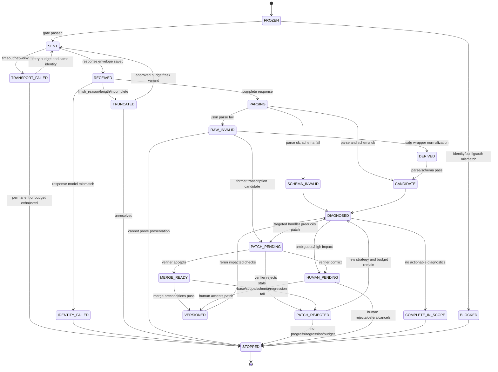

# 中文长篇小说事实抽取：错误路由与最小状态模型

> 文档状态：候选工程设计，不是正式接口合同。  
> 目标：让每次抽取、诊断、修复、验证、合并和停止都能回查。  
> 证据边界：四道本地题不是 Gold；五份研究报告的外部来源链没有随包完整保留。详见 `EVIDENCE_AND_UNCERTAINTY.md`。  
> 关键包内依据：`01_BACKGROUND_AND_BOUNDARIES.md`、`03_LOCAL_PROBE/04_逐题观察表.md`、`03_LOCAL_PROBE/10_AgentPlan第二批观察.md`、`03_LOCAL_PROBE/14_thinking_low_observe.md`。

## 结论

✅ 错误路由的核心规则是：**先判断错误属于哪一层，再给处理器最小修改权。**

- 运输和身份错误由程序处理，模型没有修改权。
- 代码围栏等纯外壳问题由确定性程序派生，不能顺手改叶子值。
- 结构损坏可试“格式转录”，但必须证明每个叶子来自原始回复；证明不了就拒绝。
- evidence 找不到由程序发现；evidence 不承托由独立 verifier 或人工判断。
- 漏显式事实只允许 add-only Patch。
- 说话人、因果、时间、指代、状态变化、社会关系要走各自专项配置。
- 动机、伏笔和暗示进入解释层，不写回客观事实。
- 多轮出现无进展、震荡或回归时，控制器停止，不让模型继续碰运气。

🔥 状态模型里最重要的不是“当前结果”，而是同时保留：**原始 Attempt、诊断、Patch、验证、版本和停止原因。**

---

## 错误路由总表

下表里的最大尝试数是候选默认值，需经过本地消融和稳定性压测后才能成为产品配置。

| 错误 | 可观察触发信号 | 推荐处理器 | 处理器只允许改变什么 | 验证方法 | 最大尝试与停损 | 失败时交给谁 |
|---|---|---|---|---|---|---|
| 运输失败 | DNS／连接错误、超时、5xx、SDK 异常、无响应体 | 程序重试器 | 不改任务输入、模型身份、Prompt、Schema；只新建 Attempt | HTTP／SDK 回执、调用 ID、响应哈希 | 同身份临时错误最多 1～2 次；永久 4xx 立即停；具体次数待压测 | 供应商／配置维护者；必要时人工决定是否开新变体 |
| 截断 | `finish_reason=length`、completion 达上限、响应状态 incomplete、JSON 尾部缺失 | 程序路由到“预算变体”或更窄任务 | 只能改 `max_output_tokens`，或改为已批准的窄任务；必须新建 `variant_id` | 比较截断率、格式、语义、Token、耗时；不把成功返回等同语义改善 | 每个 Attempt 最多 1 个预算变体；仍截断或成本越界就停 | 人工／配置负责人；可选择任务拆分，不自动换模型 |
| 模型身份异常 | 返回模型与预期不符、目录中请求 ID 消失、思考能力不匹配、供应商漂移 | `RunIdentityGate` | 什么都不能改；发网前或收包后停止 | 精确 ID 对照、目录快照、响应 envelope | 0 次修复；禁止静默 fallback | 配置负责人／人工 |
| 坏 JSON：单层代码围栏 | 去掉一个完整围栏后内部能直接解析 | 确定性格式派生器 | 只去 BOM、首尾空白、单层围栏 | 叶子值、数组顺序、键值完全不变；Schema 重检 | 1 次派生；不合法就转下一路由 | 格式转录候选或人工 |
| 坏 JSON：未转义引号、括号／数组损坏 | `JSONDecodeError`；能看到内容但结构散掉 | 候选格式转录器；未验证前可直接失败并重抽一次 | 只重建 JSON 语法；每个叶子必须映射到原始回复字符区间 | 叶子来源映射、无新增／无丢失、Schema、人工抽检 | 转录最多 1 次；映射不全立即拒绝；重抽最多 1 次 | 人工或主抽新分支 |
| 非法空值 | Schema `minLength` 失败；如 `speaker:""` | 程序分类器 + 说话人专项 | 纯叙述且确认不需要来源时可提 remove Patch；对话／认知事实只允许填 speaker 或标歧义 | 事实类型规则、evidence、speaker 专项或人工；应用后 Schema | 同一路径 1 次 Patch；对话来源不明不准直接删字段 | 说话人专项／人工 |
| 非法枚举／缺必填字段 | status 不在枚举、fact/evidence 缺失 | 局部字段修复器；必要时人工 | 只碰报错字段，不能重写整条无关内容 | Schema + evidence support + diff | 每条 1 次；无明确映射就停 | 人工；或放弃该候选事实 |
| evidence 找不到 | exact substring 0 次命中；只在背景卡命中；拼接非连续片段 | 程序定位器 + 证据修复候选 | 只换 evidence 和锚点；不能改事实含义 | 新 evidence 必须是正文连续子串，位置唯一，句数合规 | 每条 1 次；找不到就拒绝事实或人工 | 独立 verifier／人工 |
| evidence 多重命中／位置歧义 | 同一短句在正文出现多次 | 程序定位器 + 局部上下文消歧 | 只补充锚点或换成更充分的连续原文 | 主体、时序、邻接上下文；唯一位置 | 1 次；仍歧义则保留多候选并人工 | 人工 |
| evidence 不承托 | 原文存在，但缺主体、情态、否定、来源或关系方向；verifier 判 `INSUFFICIENT/CONTRADICTED` | 独立 support verifier + 局部事实／证据修复器 | 只碰该事实的 fact/status/speaker/evidence；不能改其他事实 | 修改前后逐字段验证；回归检查；争议记录 | 每条 1 次修复 + 1 次验证；冲突即停 | 人工 |
| 漏显式事实 | 正文中的动作、台词、数字、否定、状态词没有任何事实锚点覆盖 | `CoverageScanner` + add-only 抽取器 | 只能新增事实；不能改已有事实 | 新增项承托、去重、矛盾、Gold 召回／精度 | 每段 1 次扫描；第二轮没有新通过项即停 | 人工；或保留为未覆盖告警 |
| 漏说话人 | 引号／说话动词／认知来源存在，但 speaker 缺失、空串或与证据冲突 | 说话人专项 | 只改 speaker、来源链、必要 evidence 锚点 | speaker Gold 切片／人工；证据中的发话主体；未触碰字段哈希 | 每条 1 次；候选不唯一或跨章时停 | 人工 |
| speaker 过填／泛化 | 纯叙述大量填“旁白”；填“对讲机”“众人”等非具体来源 | 说话人专项或程序候选规则 | 只删除／替换 speaker；不能改事实 | 事实类型、证据、角色实体表；C→W 检查 | 每条 1 次；不确定则保留原值并标争议 | 人工 |
| 漏因果边 | 原因与结果节点都存在；正文有明确因果词或紧邻因果结构；当前无 `CAUSES` | 因果关系专项 | 只新增／修正因果 edge、方向、证据；不重写端点 | 端点先通过；证据承托；方向校验；与整包 regenerate 对照 | 每对端点 1 次；歧义或端点不稳就停 | 人工 |
| 漏时间边 | 事件节点存在且有先后／同时词；当前时间图缺边或冲突 | 时间关系专项 | 只改时间 edge | 时间词、时态、图环检测、人工 Gold | 每对 1 次；生成环或证据不足即停 | 人工 |
| 跨句指代 | 代词、称谓或省略主语无法唯一落到实体；不同事实主体冲突 | 指代专项 | 只添加 `mention→entity` 边或主体规范 ID；不重写事件文本 | 候选实体约束、局部／跨句证据、全局一致性 | 每 mention 1 次；候选并列、跨章或循环冲突即停 | 人工 |
| 状态变化漏失／方向错 | 同一主体存在 before/after 明示；status 或转移方向与文本冲突 | 状态变化专项 | 只补／改 `TRANSITION`、before/after、该事实 status | before/after 证据、同主体检查、时间顺序 | 每转移 1 次；暗示性情绪不得强判 | 人工 |
| 社会／资源关系变化 | “不再、交还、解除、锁上共用物”等信号；节点在但关系未表达 | 关系变化专项 | 只补关系 edge、有效时间和证据 | 明示语言优先；象征动作单独标不确定；人工 Gold | 每候选 1 次；只有象征动作时不自动合并 | 人工 |
| 动机／伏笔／暗示 | “似乎、像是、可能为了”、象征动作、读者推断；没有明示断言 | 独立解释层 | 只能创建 `InterpretationArtifact`，不得写客观 facts | 标签为 SOURCE_ATTESTED／INFERENCE／AMBIGUOUS／INSUFFICIENT；作者审阅 | 1 次解释；材料不足或作者拒绝即停 | 作者／人工 |
| 多轮回归 | 原先通过项变错、重复／矛盾增加、未触碰字段变化 | 回归检查器 + 控制器 | 不允许继续合并；可回到父版本 | W→C、C→W、retained correct、diff、版本哈希 | 任一高严重度回归立即停；低严重度最多 1 次修正 | 人工 |
| 无进展 | 同一错误指纹连续存在；accepted fix=0；成本增加但诊断不降 | 控制器 | 只改 run 状态 | 指纹历史、诊断向量、通过 Patch 数 | 同一指纹最多 2 次模型尝试；无新信息立即停 | 人工或结束为部分成功 |
| 震荡 | A→B→A、版本哈希重复、关系边反复增删、Patch 互逆 | 控制器 | 禁止下一轮自动修复 | 路径值历史、版本 DAG、Patch 逆操作检测 | 检出一次明确 2-cycle 即停 | 人工 |

### 当前材料不足以唯一决定处理器的地方

- **坏 JSON 的结构修复：** 可以“格式转录”也可以“新分支重抽”。包内只证明坏 JSON 会发生，没有证明哪条路净收益更高。
- **evidence 不承托：** 可以由独立模型、规则组合或人工处理。当前没有正式 Gold 校准 verifier。
- **跨句指代、时间边、状态变化：** 研究报告支持专项化候选，但本地四题太短，无法决定任务窗口、模型或阈值。
- **动机／伏笔：** 只能确定不应自动并入客观事实，无法从本包确定怎样评价“好解释”。
- **最大重试次数：** 表中数值是保守候选，不是已验证配置。

---

## 本地现象怎样映射到路由

| 包内现象 | 不能怎么处理 | 推荐路由 | 路径 |
|---|---|---|---|
| Doubao Turbo Q1/Q2、官方 Flash Q2 的空 `speaker` | 不能把“JSON 可解析”当通过，也不能一律删除字段 | Schema 诊断 → 事实类型分类 → 说话人专项／remove Patch 候选 | `03_LOCAL_PROBE/06_派生纠正回执.md`、`03_LOCAL_PROBE/08_官方Flash非思考观察.md` |
| GLM-5.2 Q1/Q2 外层围栏 | 不需要再让模型想一次 | 程序剥单层围栏 → 叶子不变量 → Schema | `03_LOCAL_PROBE/10_AgentPlan第二批观察.md`、`03_LOCAL_PROBE/responses/raw/glm_5_2_Q1.stdout.bin` |
| Doubao Lite Q2 数组结构散掉 | 不能用简单围栏剥除，也不能假装第一条就是完整结果 | 格式转录候选或一次新分支重抽；原始 Attempt 保留失败 | `03_LOCAL_PROBE/responses/raw/doubao_seed_2_0_lite_Q2.stdout.bin` |
| 千问低思考 Q2–Q4 未转义引号 | 不能靠 Schema，因为 JSON 还没解析 | 格式转录消融；若来源映射失败则拒绝 | `03_LOCAL_PROBE/14_thinking_low_observe.md`、`03_LOCAL_PROBE/responses/raw/tl_qwen38_max_Q2.stdout.bin` |
| Q4 端点有、因果边无 | 不能整包再生成后只看最终条数 | 因果 edge-only 专项 | `03_LOCAL_PROBE/04_逐题观察表.md`、`03_LOCAL_PROBE/08_官方Flash非思考观察.md` |
| “没有立刻站起来”标成已发生 | 不能靠 JSON／Schema 发现 | support/status verifier → 局部 status Patch | `03_LOCAL_PROBE/10_AgentPlan第二批观察.md`、`03_LOCAL_PROBE/12_sensenova68_ling30_observe.md` |
| 低思考吃满 4096，正文为空 | 不能当普通语义漏抽 | 截断路由，单独记录 finish reason 和 reasoning／completion 占用 | `03_LOCAL_PROBE/14_thinking_low_observe.md`、`03_LOCAL_PROBE/13_thinking_low_*_partial.json` |
| 8192 救回部分截断但仍有失败／回归 | 不能宣布“更大预算更聪明” | 冻结 4096/8192 A/B，分别看截断和语义 | `03_LOCAL_PROBE/requests/tl_*`、`03_LOCAL_PROBE/requests/t8k_*`、`03_LOCAL_PROBE/17_t8k_*_partial.json` |

---

## 状态机



### 状态与结果要分开

`run.status=STOPPED` 不等于“失败”。它可能是：

- `STOP_SUCCESS_WITH_SCOPE`：已完成声明过的检查范围；
- `STOP_HUMAN_REQUIRED`：存在无法自动决定的争议；
- `STOP_BUDGET_EXHAUSTED`：有未解决问题，但预算到顶；
- `STOP_IDENTITY_MISMATCH`：为了不污染实验而主动不发网。

每个停止状态都应保存 `unresolved_diagnostics[]`，不能把“停止”包装成“全量通过”。

---

## 最小必要数据结构

下面是候选结构，字段够后续程序实现和测试，但不应直接复制成正式产品合同。

```jsonc
{
  "run": {
    "run_id": "run_uuid",
    "trace_id": "trace_uuid",
    "project_scope": "CCZ-57-exploratory",
    "created_at": "ISO-8601",
    "updated_at": "ISO-8601",
    "status": "FROZEN|SENT|RECEIVED|DIAGNOSED|HUMAN_PENDING|STOPPED",
    "input_snapshot_id": "input_uuid",
    "baseline_attempt_id": "attempt_uuid|null",
    "current_version_id": "version_uuid|null",
    "controller_state_id": "controller_uuid",
    "stop": {
      "reason": "STOP_*|null",
      "message": "短说明",
      "scope_completed": ["transport", "schema", "evidence_location"],
      "scope_not_checked": ["causal", "coverage"],
      "unresolved_diagnostic_ids": ["diag_uuid"],
      "decided_by": "program|human|null",
      "decided_at": "ISO-8601|null"
    }
  },

  "input_snapshot": {
    "input_snapshot_id": "input_uuid",
    "source_document_id": "doc_uuid",
    "source_version": "chapter_version",
    "source_text_uri": "immutable://...",
    "source_text_sha256": "...",
    "background_card_uri": "immutable://...",
    "background_card_sha256": "...",
    "prompt": {
      "id": "prompt_id",
      "version": "v2.1",
      "uri": "immutable://...",
      "sha256": "..."
    },
    "schema": {
      "id": "novel-fact-extraction-v2.1",
      "draft": "2020-12",
      "uri": "immutable://...",
      "sha256": "..."
    },
    "language": "zh-CN",
    "frozen_at": "ISO-8601",
    "frozen_by": "program|human",
    "authorization_ref": "authority_uuid"
  },

  "attempts": [
    {
      "attempt_id": "attempt_uuid",
      "run_id": "run_uuid",
      "parent_attempt_id": "attempt_uuid|null",
      "variant_id": "variant_uuid",
      "stage": "baseline|transport_retry|format_transcription|speaker|causal|verifier",
      "purpose": "BASELINE_EXTRACTION|RETRY_TRANSPORT|FIX_JSON|...",
      "retry_index": 0,
      "request": {
        "provider": "provider_name",
        "endpoint": "logical_endpoint",
        "requested_model": "exact_id",
        "expected_response_model": "exact_id",
        "caller_identity": "service_account_or_user",
        "prompt_sha256": "...",
        "schema_sha256": "...",
        "input_sha256": "...",
        "temperature": 0,
        "thinking": "disabled|enabled",
        "reasoning_effort": "none|low|high|null",
        "max_output_tokens": 4096,
        "request_body_uri": "immutable://...",
        "request_body_sha256": "...",
        "provider_request_id": "...|null"
      },
      "transport": {
        "sent_at": "ISO-8601|null",
        "received_at": "ISO-8601|null",
        "http_status": 200,
        "timed_out": false,
        "network_error": null,
        "finish_reason": "stop|length|null",
        "incomplete_reason": null,
        "response_model": "exact_id|null",
        "identity_match": true,
        "raw_response_uri": "immutable://...",
        "raw_response_sha256": "..."
      },
      "usage": {
        "prompt_tokens": 0,
        "completion_tokens": 0,
        "reasoning_tokens": 0,
        "total_tokens": 0,
        "elapsed_ms": 0,
        "currency": "CNY|USD|unknown",
        "cost": null
      },
      "outcome": {
        "request_success": true,
        "truncated": false,
        "json_parse_ok": true,
        "schema_ok": false,
        "candidate_artifact_id": "artifact_uuid|null",
        "error_signature_ids": ["sig_uuid"]
      }
    }
  ],

  "artifacts": [
    {
      "artifact_id": "artifact_uuid",
      "artifact_type": "RAW_RESPONSE|DERIVED_JSON|CANDIDATE|INTERPRETATION",
      "parent_artifact_id": "artifact_uuid|null",
      "producer_attempt_id": "attempt_uuid|null",
      "content_uri": "immutable://...",
      "content_sha256": "...",
      "derivation": {
        "kind": "NONE|STRIP_FENCE|FORMAT_TRANSCRIPTION|APPLY_PATCHES",
        "steps": ["strip_single_outer_fence"],
        "leaf_invariant": true,
        "leaf_map_uri": "immutable://...|null"
      }
    }
  ],

  "facts": [
    {
      "fact_id": "fact_uuid",
      "version_id": "version_uuid",
      "fact": "事实文本",
      "status": "已发生",
      "speaker": "人物|null",
      "evidence_text": "连续原文",
      "evidence_anchor_id": "span_uuid|null",
      "source_order": 12,
      "origin": "baseline|coverage_patch|human",
      "active": true
    }
  ],

  "evidence_anchors": [
    {
      "evidence_anchor_id": "span_uuid",
      "input_snapshot_id": "input_uuid",
      "text": "连续原文",
      "start_char": 101,
      "end_char": 136,
      "sentence_count": 1,
      "match_count": 1,
      "exact_match": true,
      "source_part": "chapter|background_card",
      "locator_version": "evidence-locator-v1"
    }
  ],

  "diagnostics": [
    {
      "diagnostic_id": "diag_uuid",
      "run_id": "run_uuid",
      "attempt_id": "attempt_uuid|null",
      "version_id": "version_uuid|null",
      "axis": "TRANSPORT|IDENTITY|JSON|SCHEMA|VALUE|EVIDENCE_LOCATION|SUPPORT|COVERAGE|SPEAKER|CAUSAL|TEMPORAL|COREFERENCE|STATE|RELATION|REGRESSION|PRODUCT",
      "code": "SCHEMA_EMPTY_SPEAKER",
      "severity": "INFO|WARN|ERROR|BLOCKER",
      "target_paths": ["/facts/f_12/speaker"],
      "observed": "speaker is empty string",
      "expected": "omit or non-empty source",
      "evidence_refs": ["span_uuid"],
      "checker": {
        "type": "program|model|human",
        "name": "jsonschema",
        "version": "...",
        "model_identity": null
      },
      "coverage_scope": {
        "checked": ["schema.minLength"],
        "not_checked": ["speaker_correctness"]
      },
      "error_signature": "sha256(...) ",
      "created_at": "ISO-8601",
      "resolution": "OPEN|PATCHED|WAIVED|REJECTED|HUMAN_REQUIRED"
    }
  ],

  "patches": [
    {
      "patch_id": "patch_uuid",
      "run_id": "run_uuid",
      "base_version_id": "version_uuid",
      "base_content_sha256": "...",
      "producer_attempt_id": "attempt_uuid|null",
      "producer_type": "program|main_model|specialist|human",
      "handler": "SAFE_FORMAT|SPEAKER|CAUSAL|COVERAGE|...",
      "trigger_diagnostic_ids": ["diag_uuid"],
      "allowed_paths": ["/facts/f_12/speaker"],
      "touched_paths": ["/facts/f_12/speaker"],
      "operations": [
        {"op": "test", "path": "/facts/f_12/fact", "value": "司机回复知道了"},
        {"op": "add", "path": "/facts/f_12/speaker", "value": "司机"}
      ],
      "evidence_refs": ["span_uuid"],
      "claimed_fix_codes": ["MISSING_SPEAKER"],
      "before_diff_uri": "immutable://...",
      "after_preview_uri": "immutable://...",
      "patch_sha256": "...",
      "created_at": "ISO-8601",
      "status": "PROPOSED|VERIFIED|REJECTED|MERGED|SUPERSEDED"
    }
  ],

  "verifications": [
    {
      "verification_id": "verify_uuid",
      "patch_id": "patch_uuid",
      "verifier_type": "program|independent_model|human",
      "verifier_identity": "exact_model_or_user",
      "prompt_version": "verifier_prompt_v1|null",
      "verdicts": {
        "structure": "PASS|FAIL|NOT_CHECKED",
        "value": "PASS|FAIL|AMBIGUOUS|NOT_CHECKED",
        "evidence_location": "PASS|FAIL|NOT_CHECKED",
        "support": "SUPPORTED|CONTRADICTED|INSUFFICIENT|AMBIGUOUS|NOT_CHECKED",
        "coverage": "PASS|FAIL|NOT_CHECKED",
        "relation": "PASS|FAIL|AMBIGUOUS|NOT_CHECKED",
        "regression": "PASS|FAIL|NOT_CHECKED"
      },
      "scope_checked": ["/facts/f_12/speaker", "/facts/f_12/evidence"],
      "scope_not_checked": ["whole_chapter_coverage"],
      "disagreements": [],
      "recommendation": "ACCEPT|REJECT|HUMAN_REVIEW",
      "raw_output_uri": "immutable://...|null",
      "created_at": "ISO-8601"
    }
  ],

  "versions": [
    {
      "version_id": "version_uuid",
      "run_id": "run_uuid",
      "parent_version_id": "version_uuid|null",
      "base_attempt_id": "attempt_uuid",
      "applied_patch_ids": ["patch_uuid"],
      "content_uri": "immutable://...",
      "content_sha256": "...",
      "diff_uri": "immutable://...",
      "created_at": "ISO-8601",
      "created_by": "merge_gate",
      "merge_verdict": "MERGED|REJECTED",
      "human_decision_id": "human_uuid|null"
    }
  ],

  "human_decisions": [
    {
      "human_decision_id": "human_uuid",
      "reviewer": "user_or_role",
      "target_type": "PATCH|DIAGNOSTIC|VERSION",
      "target_id": "...",
      "decision": "ACCEPT|EDIT|REJECT|DEFER|WAIVE",
      "reason": "...",
      "scope": "this_fact|this_chapter|this_book|global",
      "created_at": "ISO-8601"
    }
  ],

  "controller_state": {
    "controller_state_id": "controller_uuid",
    "run_id": "run_uuid",
    "limits": {
      "max_total_calls": 3,
      "max_attempts_per_error_signature": 2,
      "max_total_tokens": 20000,
      "max_elapsed_ms": 180000,
      "max_cost": null,
      "max_patch_count": 5
    },
    "consumed": {
      "total_calls": 1,
      "total_tokens": 4615,
      "elapsed_ms": 53975,
      "cost": null,
      "patch_count": 0
    },
    "error_signature_history": ["sig_1", "sig_1"],
    "version_hash_history": ["hash_A", "hash_B", "hash_A"],
    "progress_vectors": [
      {
        "version_id": "version_uuid",
        "blockers": 1,
        "schema_errors": 0,
        "unsupported": 1,
        "coverage_gaps": 2,
        "relation_errors": 1,
        "regressions": 0,
        "accepted_fixes": 0
      }
    ],
    "no_progress": true,
    "oscillation": true,
    "regression": false,
    "next_action": "STOP_HUMAN_REQUIRED"
  }
}
```

### 为什么 `facts` 不能只用数组下标作为身份

数组增删后 `/facts/3` 可能不再是原来那条事实。建议每条事实有稳定 `fact_id`，Patch 的逻辑目标先解析到该 ID，再生成实际 JSON Pointer。否则一个 add Patch 可能让后续 replace Patch 错改别条。

### 为什么 Attempt 和 Version 都要有哈希

- Attempt 哈希证明原始回包没有被改过。
- Version 哈希用于 Patch 前置条件、并发冲突和震荡检测。
- Patch 哈希证明验证器审查的修改单与合并器应用的是同一张。

---

## 诊断结构

### 统一外壳，分轴代码

建议至少有这些 `axis/code`：

```text
TRANSPORT.TIMEOUT
TRANSPORT.HTTP_5XX
TRANSPORT.TRUNCATED
IDENTITY.REQUEST_MODEL_MISSING
IDENTITY.RESPONSE_MODEL_MISMATCH
JSON.OUTER_FENCE
JSON.UNESCAPED_QUOTE
JSON.UNBALANCED_STRUCTURE
SCHEMA.MISSING_REQUIRED
SCHEMA.EXTRA_FIELD
SCHEMA.EMPTY_OPTIONAL
SCHEMA.INVALID_ENUM
VALUE.STATUS_NEGATION_MISMATCH
VALUE.SPEAKER_INVALID
EVIDENCE.NOT_FOUND
EVIDENCE.NON_CONTIGUOUS
EVIDENCE.MULTIPLE_MATCHES
SUPPORT.INSUFFICIENT
SUPPORT.CONTRADICTED
COVERAGE.EXPLICIT_ACTION_GAP
COVERAGE.DIALOGUE_GAP
SPEAKER.MISSING
SPEAKER.AMBIGUOUS
SPEAKER.OVERFILLED_NARRATOR
CAUSAL.MISSING_EDGE
CAUSAL.REVERSED_EDGE
TEMPORAL.MISSING_EDGE
TEMPORAL.CYCLE
COREFERENCE.AMBIGUOUS
STATE.MISSING_TRANSITION
STATE.WRONG_DIRECTION
RELATION.MISSING_CHANGE
REGRESSION.CORRECT_TO_WRONG
REGRESSION.UNTOUCHED_PATH_CHANGED
REGRESSION.DUPLICATE_INCREASED
REGRESSION.CONTRADICTION_INCREASED
PRODUCT.BUDGET_EXCEEDED
PRODUCT.HUMAN_RATE_EXCEEDED
```

### 错误指纹

建议同时保存两个指纹：

```text
error_signature = sha256(
  axis + code + stable_target_ids + normalized_evidence_anchor + checker_version
)

state_fingerprint = sha256(
  current_version_hash + sorted(open_error_signatures)
)
```

- `error_signature` 用来判断同一个问题是否反复出现，不应包含 attempt ID。
- `state_fingerprint` 用来发现整个版本状态是否回到旧状态。

### 进展向量

不要把不同轴压成一个总分。可以保存一个向量：

```text
P = (
  transport_blockers,
  identity_blockers,
  json_errors,
  schema_errors,
  value_errors,
  evidence_location_errors,
  unsupported_claims,
  explicit_coverage_gaps,
  speaker_errors,
  relation_errors,
  regressions,
  duplicate_count,
  contradiction_count,
  accepted_fix_count,
  calls,
  tokens,
  elapsed,
  cost,
  human_reviews
)
```

“有进展”至少要求某个目标错误下降，且不能引入更高优先级的新错误。比如把 Schema 错修掉却新增事实错误，不算净改善。

---

## 无进展、震荡和回归检测

## 无进展伪代码

```python
if same_error_signature_attempts >= 2 and target_severity_not_lower:
    stop("STOP_NO_PROGRESS")

if last_two_patches_have_same_normalized_operations:
    stop("STOP_NO_PROGRESS")

if model_calls_since_last_accepted_fix >= 2:
    stop("STOP_NO_PROGRESS")

if consumed_budget_increased and no_axis_improved:
    stop("STOP_NO_PROGRESS")
```

## 震荡伪代码

```python
if current_version_hash in recent_version_hashes[-4:]:
    stop("STOP_OSCILLATION")

if path_history[path][-3:] == [A, B, A]:
    stop("STOP_OSCILLATION")

if patch_is_inverse_of_recent_patch(patch):
    stop("STOP_OSCILLATION")
```

## 回归门

```python
regression = any([
    correct_to_wrong > 0,
    untouched_paths_changed > 0,
    unsupported_claims_after > unsupported_claims_before,
    contradictions_after > contradictions_before,
    duplicates_after > duplicates_before,
    schema_errors_after > schema_errors_before,
])

if regression and severity >= HIGH:
    reject_patch()
    stop("STOP_REGRESSION")
```

“正确项”只能由正式 Gold、人工确认或已校准 verifier 标记。当前四题的观察表不能充当正式 Gold。

---

## Patch 例子

## 例 1：代码围栏

```json
{
  "handler": "SAFE_FORMAT",
  "base_artifact": "raw_glm_q1",
  "transformation": "strip_single_outer_markdown_fence",
  "leaf_invariant": true,
  "before_sha256": "...",
  "after_sha256": "...",
  "schema_ok_after": true
}
```

这不是语义修复，不需要模型。包内对应：`03_LOCAL_PROBE/responses/raw/glm_5_2_Q1.stdout.bin`。

## 例 2：空 speaker

```json
{
  "handler": "SPEAKER",
  "base_version_id": "ver_0",
  "trigger": "SCHEMA.EMPTY_OPTIONAL",
  "allowed_paths": ["/facts/f_1/speaker"],
  "proposal": {
    "op": "remove",
    "path": "/facts/f_1/speaker"
  },
  "preconditions": [
    "fact is narrative, not speech/thought/attribution",
    "evidence contains no attribution cue"
  ]
}
```

若事实含引号或说话动词，不能用这个 Patch，必须交说话人专项。包内对应空值现象：`03_LOCAL_PROBE/06_派生纠正回执.md`。

## 例 3：因果边

```json
{
  "handler": "CAUSAL",
  "base_version_id": "ver_0",
  "trigger": "CAUSAL.MISSING_EDGE",
  "allowed_paths": ["/relations/-"],
  "operations": [
    {
      "op": "add",
      "path": "/relations/-",
      "value": {
        "relation_id": "rel_uuid",
        "type": "CAUSES",
        "from_fact_id": "fact_jump_trip",
        "to_fact_id": "fact_lychee_leak",
        "evidence_anchor_id": "span_q4_sentence_1"
      }
    }
  ]
}
```

端点必须先通过证据承托；Patch 不允许改端点文本。包内对应：`03_LOCAL_PROBE/04_逐题观察表.md`、`03_LOCAL_PROBE/10_AgentPlan第二批观察.md`。

---

## 验证与争议

### 验证器要声明自己没检查什么

一个 verifier 只看了 causal edge，就必须写：

```json
{
  "scope_checked": ["causal_direction", "edge_evidence"],
  "scope_not_checked": ["whole_chapter_coverage", "speaker", "motivation"]
}
```

这样不会出现“关系通过”被误读成“整章事实全对”。

### 冲突不能自动多数票

出现以下情况时应保存 `VerificationDispute` 并交人工：

- 两个 verifier 对同一 Patch 得出相反结论；
- 规则通过、模型拒绝；
- 两个模型都给高置信但证据指向不同主体；
- 关系方向依赖跨章信息；
- Gold 标注本身有分歧。

多数票只能是一个观察信号，不能直接写真值。

---

## 运行身份、预算和调用账

每次调用至少保存：

- `provider`；
- `requested_model` 与 `response_model`；
- `thinking`、`reasoning_effort`；
- `prompt_id/version/hash`；
- `schema_id/version/hash`；
- `input_snapshot_id/hash`；
- `max_output_tokens`；
- `temperature`；
- `provider_request_id`；
- `http_status`、finish reason、截断；
- prompt/completion/reasoning/total tokens；
- elapsed time；
- 费用与币种，无法取得时写 `unknown`；
- 自动重试、人工重试、变体次数；
- 调用者身份与授权引用。

包内运行回执已经保留了其中相当一部分：`03_LOCAL_PROBE/05_运行回执.json`、`07_官方Flash非思考运行回执.json`、`09_AgentPlan第二批运行回执.json`、`11_sensenova68_ling30_run.json`、`13_thinking_low_run.json`、各 `*.meta.json`。

---

## 隐藏思维链边界

本设计不要求、也不依赖模型隐藏思维链。审计只保存可观察对象：

- 冻结输入；
- 请求配置；
- 原始输出；
- 工具／程序检查结果；
- Patch；
- 证据锚点；
- verifier 的结构化 verdict 和短理由；
- Token、耗时、费用；
- 合并与人工决定；
- 停止原因。

供应商回包中若包含可见 reasoning 字段，可作为原始响应的一部分归档，但不能把它当事实证据、正确性证明或产品必需字段。包内低思考样本已经显示 reasoning 可能消耗预算而没有交付最终 JSON：`03_LOCAL_PROBE/14_thinking_low_observe.md`。

---

## 外部公开来源的有限复核

这次网页核对确认：

- RFC 6902 提供局部 JSON 操作的标准外形，适合借鉴 `add/remove/replace/test`，但本设计额外要求基线哈希、作用域、证据和验证。
- JSON Schema 2020-12 明确是对实例结构约束的验证，不能承担语义真值判断。
- LangGraph 官方文档把 checkpoint 用于恢复／继续，并提醒 interrupt 可能重跑节点，副作用要幂等。
- Temporal 官方文档说明 Activity 重试会重新执行整个 Activity，建议动作拆细、保证幂等，并把永久错误设为不可重试。

这些只支持工程形态，不决定中文小说抽取里哪个 specialist 真能提高准确率。

---

## 关键包内路径

- 非 Gold 和边界：`03_LOCAL_PROBE/00_任务与边界.md`、`03_LOCAL_PROBE/01_合成题面.json`
- 冻结 Schema：`03_LOCAL_PROBE/frozen/novel_fact_extraction_v2.schema.json`
- 身份与停止：`03_LOCAL_PROBE/03_模型选择与身份.json`、`03_LOCAL_PROBE/06_派生纠正回执.md`
- 空值、坏 JSON、围栏、语义与 Schema 分离：`03_LOCAL_PROBE/04_逐题观察表.md`、`03_LOCAL_PROBE/08_官方Flash非思考观察.md`、`03_LOCAL_PROBE/10_AgentPlan第二批观察.md`
- speaker 与状态问题：`03_LOCAL_PROBE/12_sensenova68_ling30_observe.md`
- 思考、截断、坏 JSON、Token／耗时：`03_LOCAL_PROBE/14_thinking_low_observe.md`
- 8192 变体：`03_LOCAL_PROBE/requests/t8k_*`、`03_LOCAL_PROBE/17_t8k_*_partial.json`
- 状态、恢复、停损研究候选：`02_RESEARCH/RAW/01_成熟GitHub_Agent的迭代纠错实现__RAW.md`、`02_RESEARCH/RAW/04_生产Agent的失败恢复与停损__RAW.md`
- 错误路由研究候选：`02_RESEARCH/RAW/05_不同抽取错误该交给谁修__RAW.md`
