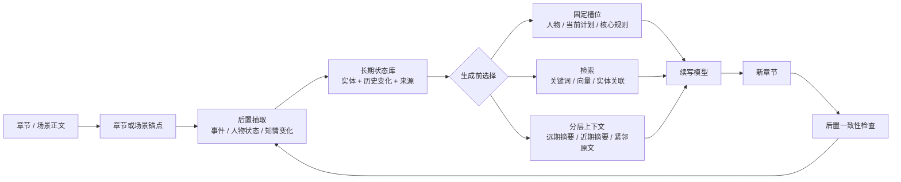

# #110 外调回包｜Deep Research｜2026-08-23

- 身份：外部参考，无产品或执行权威。候选，待 CZ 拍。
- 来源：ChatGPT Deep Research（项目里放 PACK_00–04）
- 源 commit：`87aad7ab`
- 下载原名：`deep-research-report - 2026-08-23T233420.207.md`
- 正文里的 `cite` 标记是 Deep Research 网页脚注，原样保留。
- ⚠️ 文末「十六个评分点」按完整性／时效性等**自造维度**写的，不是对照表 v0.1 那 16 行。对照表相关启示看本文前面五个问题，不看文末那张错表。咬合说明见同目录 `00_LANDING.md`。

---

# 长篇中文网文连载“台账”与叙事状态数据库：外部实践与学术证据调查

## 执行摘要

- **[有证据的做法] 外部实践并不存在一个统一的 “story bible 标准对象表”。** 稳定出现的是人物、关系、地点/世界设定、事件/场景、时间线、人物目标/动机、秘密或知情状态；而“人物困境”“爽点”“钩子”“作者—读者承诺”更常被做成标签、自由字段、剧情节点属性或分析结果，而不是普遍的一等实体。World Anvil、Campfire、Kanka、Plottr 都同时保留固定类别与自由扩展机制；学术上的 Story Intention Graph、BDI（Belief-Desire-Intention，信念—欲望—意图）叙事规划则把目标、意图、结果、信念差做得更严格。citeturn17view0turn17view4turn18view5turn19view7turn16view0turn20search1

- **[有证据的做法] “秘密/谁知道什么”是比“人物性格标签”更成熟的结构化对象。** World Anvil 的 Secrets 可以区分哪些角色知道秘密；叙事规划研究甚至显式区分“真实世界状态”和“某角色相信的世界状态”，角色可以因为错误信念行动失败、随后更新信念或把信息传给别人。这意味着“知情差”并不是纯写作经验词，而是有正式知识表示先例的对象。citeturn15view3turn20search0turn20search1turn20search6

- **[有证据的做法] AI 续写读取状态库时，公开实践主要不是“把整个台账塞进去”，而是三种机制组合：固定槽位、按相关性检索、分层上下文。** Re3 明确把人物/设定、前文大纲、近期摘要、紧邻原文和当前待写大纲分别放进 prompt；DOC 再把大纲做成层级结构并用 controller 约束；NovelAI/SillyTavern 则按关键词、过滤条件、优先级、预算乃至向量相似度激活 lore 条目。citeturn15view0turn15view1turn10view1turn10view5turn19view6turn19view4turn19view5

- **[有证据的做法] “每章内容清单”有非常直接的行业先例，但通常清的是 scene/beat/event，不是要求每章必须填齐固定数量的语义事实。** Plottr 把 Scene Card 明确放在章标题和 plotline 组成的二维结构中，一个章下可放若干场景卡，并连接人物、地点、标签和自定义属性；Campfire 也同时提供 manuscript chapter、timeline event 和 arc。citeturn19view7turn19view0turn17view5turn17view6

- **[U] 没找到可信公开证据支持“每章必须抽 N 条事实”是成熟行业惯例。** 相反，Kanka 除 `Name` 外允许大量字段为空；Plottr 不限制 Scene Card 数量；Re3 刻意不把人物事实限制为一套固定属性；DOC 和 Re3 的生成阶段也有跳过、动态推进或可变 outline 长度的设计。这里的“没找到”只是本轮公开资料调查结果，不能证明行业绝无此做法。citeturn18view5turn19view7turn14search1turn14search0

- **[U] 没找到直接实验回答“长篇中文网文 AI 因为知道本章必须填哪些台账字段，所以把剧情写歪了吗？”** 但一般性的 Goodhart 证据很强：当代理目标只是最终质量的不完美替代物时，继续强化代理指标可能使真实目标下降；可控生成研究也表明，多重控制之间会相互干扰。另一方面，DOC 是重要反例：它施加更强的大纲控制后，在其英文数千字故事实验里，人评的情节连贯、outline relevance 和 interestingness 均高于 Re3，因此“知道约束＝一定损害创作”同样没有证据。citeturn15view7turn11search3turn15view1

- **[有证据的做法] 公开管线里最接近 Goodhart 防线的模式，是把“写故事”和“查账/纠错”拆成不同阶段。** Re3 的主链是 Plan → Draft → Rewrite/Rerank → Edit：先生成，再从文本中抽人物事实并检查事实一致性，而不是把“人物属性表填充率”直接当成写作奖励。DOC 的开源实现还显式提供 control strength、skip/early-stop 一类控制强度机制。citeturn10view0turn15view0turn14search0

- **[U] 对“中文长篇连载”本身，公开可复现证据明显弱于英文中短篇、互动叙事和通用写作工具。** DENS 虽包含 Wattpad 长篇叙事，情绪分类的最佳基线也只有 60.4% micro-F1；ChapterBreak 专门证明跨章节长程上下文仍是语言模型难题。这里不能把英文短篇/互动叙事结果直接外推成中国网文留存、爽感或追读因果。citeturn20search14turn16view6 上传的外部知识库背景卡也明确把“中文网文章节特征→追读/留存”的透明因果证据列为缺口，并强调爽点、悬念等体验变量不应直接当机器真值；该背景卡自身定位也是**外部证据与未知的背景板，而非产品权威**。fileciteturn0file0

**本报告证据标记：**

**[有证据的做法]** = 至少有公开产品文档、开源实现或论文直接展示该做法。  
**[推断]** = 外部资料支持前提，但结论是本报告做的跨来源归纳，不是来源原话。  
**[U]** = 公开证据不足、没有直接目标任务实验，或只能确认“存在/不存在公开设计”而不能确认原因与效果。

## 研究边界与证据地图

本轮把“台账”拆成三层看：**写作工具里的 story bible/worldbuilding 数据；AI 生成时实际读取的 narrative memory；学术叙事系统里的显式状态表示**。这三者不能完全互换：World Anvil/Plottr 的目标主要是作者管理信息，NovelAI/SillyTavern 的 Lorebook/World Info 已经直接进入生成上下文，而 DramaBank、Glaive、Sabre、HeadSpace 一类研究关心的是机器如何表示人物目标、信念和动作因果。citeturn17view0turn19view7turn19view6turn19view4turn16view0turn20search4turn20search6turn20search0

- **[有证据的做法]** 世界设定管理产品普遍采用“少量固定实体类型 + 自定义字段/标签/关系”的混合模式，而非把所有叙事概念预定义成数据库表。citeturn17view0turn18view5turn19view7
- **[有证据的做法]** 学术叙事规划比商业写作工具更愿意严格表示目标、信念、意图、结果以及角色之间的信息差。citeturn16view0turn20search1turn20search6turn20search13
- **[U]** 公开来源里没有一个可视为“百万字中文连载状态数据库标准”的 schema 或公开 benchmark；因此下面凡涉及中国网文独特概念如“爽点”“憋屈”“追读钩子”，都要特别防止把邻近领域证据说成已经验证过的中文网文事实。DENS 的 Wattpad 数据、ACL 长故事生成以及 ChapterBreak 都更接近邻域证据，而非目标任务本身。citeturn20search14turn15view0turn15view1turn16view6

一个很重要的外部规律是：**“世界发生了什么”与“某个角色认为发生了什么”与“读者感受到什么”应被视为不同层。** HeadSpace/Sabre 把世界事实和角色信念分离；DENS、CR4-NarrEmote 则把情绪作为文本片段上的读者/标注者响应来采集。把这几种东西都塞进同一个“事实”字段，会丢掉它们原有的认识论边界。**[推断]** citeturn20search0turn20search6turn20search14turn16view5

## 对象类别：什么真的被做成了结构化对象

本节结论：

- **[有证据的做法]** 人物、关系、事件、地点/设定、时间线，是行业最稳定的一层。citeturn17view0turn17view4turn18view5turn19view7
- **[有证据的做法]** 人物目标/欲望/意图/结果，以及人物知情差，在学术上已经有比一般 writing software 更严谨的正式表示。citeturn16view0turn16view1turn20search1turn20search11
- **[有证据的做法]** 读者情绪与 suspense 可以结构化标注或预测，但“能标注”不等于“它是客观事实”，更不等于“爽点分数可跨题材通用”。citeturn20search14turn16view5turn20search18
- **[U]** 公开产品很少解释“为什么某对象没有做成一等实体”。能找到的直接原因主要集中在维护复杂度、粒度取舍和 schema 灵活性，而不是产品团队公开写出“我们试过爽点表，后来放弃了”。citeturn18view0turn18view1

### 对象类别对照表

| 对象类别 | 是否有结构化先例 | 先例 | 外部边界怎么定义 | 为什么没有都做成一等对象 / 放弃原因 |
|---|---|---|---|---|
| **人物 Character** | **是｜有证据的做法** | World Anvil Character；Campfire Characters；Kanka Characters；Re3 character descriptions。citeturn17view0turn17view4turn18view5turn15view0 | 通常是可被关系、场景、事件、设定引用的实体，并挂属性、描述、标签。World Anvil 的 Character 模板甚至有目标、成就、失败、创伤等提示项。citeturn17view1 | World Anvil 自己提醒模板框**不必全部填写**，说明“有字段”不代表“每个角色都应填满”。citeturn17view1 |
| **人物关系** | **是｜有证据的做法** | Campfire Relationships；World Anvil family tree/diplomacy；Kanka connections；Novelcrafter Relations。citeturn17view0turn17view4turn18view6 | 边一般连接两个实体；可进一步带关系类型、共享秘密、组织归属等信息。World Anvil 还提供专门关系可视化。citeturn17view0turn15view3 | **U：**没有发现主流产品公开说明曾因效果差而删除“人物关系”这一类别；相反，它是很稳定的核心类别。 |
| **人物目的/渴望/意图** | **是｜有证据的做法** | DramaBank Story Intention Graph；Glaive；IRIS；Sabre；World Anvil Goals & Aspirations。citeturn16view0turn20search4turn20search11turn20search6turn17view1 | 学术系统把 goal/desire 与 intention/plan 区分：目标是想达到的状态，意图是角色承诺去执行的行动方向；IRIS 还允许意图在失败后被修订。citeturn20search11turn20search5 | 商业产品常把 motivation/goal 做字段，而非完整状态机。**[推断]** 原因之一很可能是正式 BDI 模型的维护成本远高于普通作者笔记；公开产品没有给出直接因果说明。 |
| **达成态 / 目标结果** | **是｜有证据的做法** | DramaBank 直接表示 outcome；ENG 的评测任务包含 desire fulfillment。citeturn16view0turn16view1 | 不只是“角色想要 X”，还可以表示行动之后 X 是否达成、欲望是否 fulfilled。citeturn16view1 | **U：**在 World Anvil/Campfire/Plottr 等写作工具中，没有发现统一的“goal lifecycle 状态机”成为通用标准。 |
| **人物困境 / 冲突** | **部分是｜有证据的做法** | World Anvil 有 Wars & Conflicts；Plottr plotline 可追踪 main conflicts，custom attributes 可自由描述；Glaive 显式推理角色间 cooperation/conflict。citeturn17view0turn19view7turn20search4 | “战争/冲突”作为世界事件容易实体化；“某人物此刻的两难困境”则可能是目标、障碍、信念、选项之间的组合。 | **U：**没发现跨产品通用的 `Dilemma` 一等实体。**[推断]** 其语义通常可由 goal + obstacle/conflict + alternatives 组合表达，因而更常留在剧情卡/自定义属性中。citeturn19view7turn20search4 |
| **秘密 Secret** | **是，且很强｜有证据的做法** | World Anvil Secrets。citeturn15view3 | 可把秘密本身与“谁可见/谁知道”分开，并支持对不同人隐藏信息。citeturn15view3turn17view2 | 没发现明确“放弃秘密对象”的案例；这是世界观/RPG 产品里很稳定的需求。 |
| **人物知情差 / 错误信念** | **是｜有证据的做法** | HeadSpace、Christensen et al.、Sabre、Hide and Sneak。citeturn20search0turn20search1turn20search6turn20search9 | 世界真实状态与角色 belief 分离；角色的 belief 可以有限、错误，且能通过感知、失败或交流更新。citeturn20search1turn20search6 | 代价是状态空间会显著复杂化，尤其加入“角色 A 认为角色 B 相信……”的嵌套 Theory of Mind。Sabre甚至专门处理深层嵌套信念。citeturn20search6turn20search10 |
| **视角差 / POV** | **是，但要拆两义｜有证据的做法** | Novelcrafter 提供 previous/next scene same POV；World Anvil 支持平行 timeline；学术 belief planning 表示认知视角。citeturn18view7turn17view3turn20search1 | “叙事 POV”= 哪个角色/叙述者在讲；“认知视角”= 角色知道/相信什么。两者不是一回事。 | **[推断]** 把 POV 与知情状态压成一个字段会失真，因为一个 POV 章节里仍可能包含角色不知道的叙述信息，反之非 POV 角色也有自己的 belief state。citeturn18view7turn20search1 |
| **事件 / Plot beat / Scene** | **是｜有证据的做法** | Plottr Scene Cards；Kanka Events/Timelines；Campfire Timeline；DOC detailed outline。citeturn19view7turn18view5turn17view5turn15view1 | 通常可绑定时间、章/场景、人物、地点和 plotline；DOC 则把待发生事项组织成层级 outline。citeturn19view7turn10view5 | 工具会按宏观/微观拆层，而非用一个 event 表承载所有尺度。Kanka 明确说 Timeline 用于“大图景”，细粒度时间另用 Calendar。citeturn18view0 |
| **人物动态属性 / 当前状态** | **是｜有证据的做法** | Re3 编辑器维护按人物组织的事实属性字典；Campfire Arcs + Timeline；Novelcrafter Progressions 可替换具体 Codex detail。citeturn8view0turn17view5turn18view6 | 不是只有静态人设，还包括故事推进中会改变的属性。Novelcrafter 甚至允许进度变化只替换某个具体 detail。citeturn18view6 | Re3 没采用固定属性全集，而使用更开放的属性抽取思路，因为不同故事重要属性差异很大。**[有证据的设计取舍]** citeturn8view0 |
| **伏笔 / Foreshadowing** | **部分是｜有证据的做法** | Scrivener 的自定义 Label 可用于标“pivotal scenes”“foreshadowing”等；Plottr 标签/自定义属性也可承担此类标注。citeturn17view7turn19view7 | 多数写作工具把它当 scene/document metadata，而非带“埋下→回收”生命周期的标准实体。 | **U：**没有发现这些主流产品公开说明曾测试并放弃独立 Foreshadowing 对象。 |
| **钩子 / Cliffhanger** | **部分有｜U 到有证据之间** | ChapterBreak 研究把 cliffhanger 作为章节边界现象之一；通用写作工具可用标签标记。citeturn16view6turn17view7 | 更接近章节结束的文本设计/读者预期触发，而不是稳定世界事实。 | **U：**没有发现通用 story-bible 产品把“Hook”做成跨作品统一、一等、强类型状态对象的充分证据。 |
| **悬念 Suspense** | **是｜有证据的做法** | Wilmot & Keller 用人类 suspense 标注验证计算模型；其他计算叙事工作也按文本位置追踪 suspense。citeturn20search18turn6search12 | 是读者面对未来不确定性的响应变量，可随叙事进程变化，不等价于“文本里客观存在一个秘密”。citeturn20search18 | **[推断]** 适合记录为观测/预测层，而非和角色事实共享真值语义。 |
| **读者情绪** | **是｜有证据的做法** | DENS；2025 CR4-NarrEmote。citeturn20search14turn16view5 | 通常以 passage/sequence 为单位，由读者或众包标注者标情绪，而不是作者预先定义的世界状态。DENS 还说明长篇叙事情绪识别明显不是一个已经解决的问题。citeturn20search14 | 情绪有主观性和标注差异，因此研究通常保存人的判断而非宣称“文本真值”。citeturn16view5 |
| **“爽点/获得感”** | **U** | 没找到 ACL/AAAI 或上述官方产品中与中文网文“爽点”语义完全对应、且广泛采用的标准一等对象。 | 可与 reward、positive affect、desire fulfillment 等邻近概念类比，但不能视为同义。citeturn16view1turn20search14 | **U：**尤其缺“某种爽点 schema → 中国网文追读/订阅提升”的公开因果数据。上传背景材料也将这一点列为外部证据缺口。fileciteturn0file0 |
| **地点、组织、物品、规则、世界观 Lore** | **是｜有证据的做法** | World Anvil 25+ 模板；Kanka Locations/Organisations/Items/Abilities/Custom types；NovelAI Lorebook。citeturn17view0turn18view5turn19view6 | 通常是稳定可引用实体，适合作为生成时按需唤回的长程知识。 | 不是每个细节都必须升格为独立实体；产品普遍保留 freeform type、tags、properties/custom attributes。citeturn18view5turn19view7 |

这里最有价值的“放弃/收窄”证据，其实不是某家产品宣布“删掉爽点”，而是**公开系统主动拒绝过度固定化**。World Anvil 明说 Character Template 不要求每个框都填；Kanka 将宏观 Timeline 和微观 Calendar 分开，并公开解释 Calendar 因复杂度高、改一个功能可能带来数周开发和修 bug；Re3 对人物事实也不限定固定属性集合。citeturn17view1turn18view0turn18view1turn8view0

另一个明确但不能过度解读的案例是 Kanka 的实验性 AI 人物背景助手 Bragi 已于 **2026 年 5 月**移除。**[有证据的事实]** 可以确认它被移除；**[U]** 官方公开页面没有说明为什么移除，因此不能写成“因为 AI 写背景质量差/成本高所以失败”。citeturn18view4

## 生成端如何读取状态库

本节结论：

- **[有证据的做法]** 最成熟的模式是**混合式**：少量永远重要的信息放固定槽位，长尾 lore 走检索，历史正文按远近分层压缩。citeturn15view0turn10view1turn19view6turn19view5
- **[有证据的做法]** “检索相关条目”本身也分确定性关键词与不确定性向量检索；SillyTavern 官方直接提醒，embedding 检索无法准确预测最终会插入哪些 World Info。citeturn19view5
- **[有证据的做法]** 注入位置和优先级也是控制变量，不只是“检索到了没有”。NovelAI 与 SillyTavern 都允许改变 lore 的位置、触发范围、常驻/条件激活及预算。citeturn19view6turn19view4
- **[U]** World Anvil、Campfire、Kanka 等资料管理工具没有公开足够细的“其 AI 续写模块如何查询状态库”的当前架构，所以不能拿其 worldbuilding schema 反推生成算法。Kanka 的 Bragi 已被移除，更不能当当前生成架构证据。citeturn18view4

### 生成端数据取用设计对比表

| 设计 | 实际取哪些数据 / 怎么决定 | 优点 | 已知问题 | 公开例子与出处 |
|---|---|---|---|---|
| **固定槽位** | 预先规定 prompt 里永远有某些位置，例如 premise、setting、characters、当前 outline。 | 可预测、容易调试；关键约束不容易因检索漏掉。 | 状态库越大越不可能全部固定塞入；槽位太多会挤占正文上下文。 | Re3 的 plan 包括 premise/setting/characters/outline。citeturn15view0turn10view0 |
| **分层上下文注入** | Re3 区分“前几段的大纲”“近期故事摘要”“紧邻的正文原文”“下一段 outline”；DOC 延续并强化这种结构。 | 远历史压缩、近历史保真，可以同时顾及长期剧情和局部语气。 | 摘要会损失细节；层级设计本身要维护。 | Re3 的公开 prompt 图直接展示 Relevant Context、Previous Sections’ Outlines、Recent Story Summary、Upcoming Section Outline、Autoregressive Context。citeturn10view1turn15view0 |
| **关键词触发 Lorebook** | 当前故事最近上下文出现 activation key 时，插入对应 lore；可设置 always-on。 | 确定性强、作者容易理解为什么召回。 | 同义表达、别名、中文分词可能造成漏召回；关键词数量多时维护成本上升。 | NovelAI Lorebook。citeturn19view6 |
| **关键词 + 逻辑过滤** | 主 key 后再加 AND/NOT 等 secondary conditions，并按角色、生成类型、组、优先级过滤。 | 能表达“只有在角色 X + 地点 Y 同时出现时才加载”。 | 规则复杂后会变成另一个需要维护的逻辑系统。 | SillyTavern World Info 支持 AND ANY/ALL、NOT、Character Filter、Triggers、Group scoring。citeturn19view4turn19view5 |
| **向量/语义检索** | 用最近文本与 lore 内容的 embedding 相似度召回。Re3 也用检索模型选择与近期 passage 相关的 context。 | 不必准确命中关键词，对同义表达更友好。 | 检索是概率性的。SillyTavern 官方写明无法准确预测哪些条目最终会插入。 | Re3；SillyTavern Vector Storage。citeturn15view0turn19view5 |
| **Retriever → Ranker → Generator** | 先预测控制关键词/需求，再检索外部知识，再排序，最后生成。 | 把“找到候选”和“决定给模型什么”拆开。 | 管线更长，每一层都可能产生误差；研究任务和小说台账并不完全相同。 | MEGATRON-CNTRL 的 keyword predictor → knowledge retriever → contextual knowledge ranker → generator。citeturn16view7 |
| **层级规划 + 强控制器** | 大纲先递归细化，再让 controller 强制当前 passage 对齐 outline detail。 | 对剧情遵循度强；DOC 人评中 coherence、outline relevance、interestingness 均优于 Re3。 | 约束过细时控制和自由生成存在权衡，公开代码因此保留 control-strength、skip、early-stop 等参数。 | DOC 论文和官方 repo。citeturn15view1turn10view4turn10view5turn14search0 |
| **动态隐状态/记忆块** | 不把所有 plot state 显式写成数据库字段，而从 outline + 已生成文本动态计算 memory representation。 | 少人工 schema；能够表示 plot element 在较长文本中反复出现。 | 状态不透明，不容易做人工审计或精确 provenance。 | PlotMachines。citeturn15view2turn10view3 |
| **可编程 context API** | Prompt 可显式读取某个 Codex 条目的 notes/description、previousBeat/nextBeat、上一/下一同 POV 场景；条目还可设置完全不进入 AI context。 | 调用者可以控制“读什么”，不是只能依赖自动 RAG。 | 自定义关系过深可能导致上下文膨胀。Novelcrafter 会在深层嵌套条目超过一定程度时警告。 | Novelcrafter。citeturn18view6turn18view7 |

### 公开架构图

**Re3 有公开架构图。** Figure 1 明确画成 **Premise → Plan → Draft → Rewrite → Edit → Story**；而其 Draft prompt 图把远期计划、相关状态、近期摘要、紧邻原文分别展示。citeturn10view0turn10view1

**DOC 也有公开架构图。** Figure 1 把 detailed outliner 与 detailed controller 分开，Figure 2/3 展示递归细化 outline，以及生成 prompt 中人物、远/近摘要、Upcoming Events、紧邻原文等输入。citeturn10view4turn10view5

将这些公开系统拼起来，外部证据呈现出的总体模式如下。**注意：下图是本报告的跨来源归纳，属于 [推断]，不是任何一家产品的官方架构。**

支持这个归纳的原始先例分别来自 Re3/DOC 的层级 prompt、NovelAI/SillyTavern 的检索式 lore 激活，以及 Re3 的后置事实一致性编辑。citeturn15view0turn15view1turn19view6turn19view5

这里还有一个对中文非常具体的小坑：SillyTavern 的 World Info 文档指出，“整词匹配”机制对中文、日文这类不靠空格分词的语言可能不合适。**[有证据的做法]** 这说明把英文 lorebook 的关键词检索规则直接移植到中文，不应默认行为完全相同。citeturn15view6

## 章级锚定、跨章状态与事实密度不均

本节结论：

- **[有证据的做法]** “章→场景/剧情卡→人物地点标签”的内容清单，是已经存在的成熟写作工具模式；Plottr 是最明确的公开例子。citeturn19view7turn19view0
- **[有证据的做法]** 跨章延续通常不是“把事实复制进每一章”，而是让事件/场景保留原位置，同时用 arc、timeline、belief/intention state 或 current state 表示后续仍有效的状态。citeturn17view5turn20search11turn20search1
- **[U]** 主流写作产品公开文档里，尚未看到一个广泛采用的机制，要求每条语义事实都有 `chapter_id + source_span + valid_from + valid_to` 这类严格 provenance；学术生成系统也往往更关注“能用状态生成一致故事”，而不是出版级事实审计。
- **[有证据的做法]** 外部工具普遍允许信息密度不均、字段为空或卡片数量不固定；没有看到“高潮章和过渡章都按同一事实配额”成为公开最佳实践。citeturn18view5turn19view7turn17view1

### 章级锚定与跨章状态表示示例表

| 先例 | 数据模型 | 怎么落到章 / 场景 | 跨章怎么延续 | 局限与出处 |
|---|---|---|---|---|
| **Plottr** | `Chapter Heading × Plotline → Scene Card`；Scene Card 挂人物、地点、Tag、自定义属性。 | 官方明确说 Scene Card 用于在每个 chapter heading 下组织 scene details 和 major events。 | 同一 subplot/character arc 通过纵向 Plotline 贯穿多个章节；可按角色、标签、属性过滤。 | 这是最接近“每章内容清单”的公开先例；但它管理的是 scene/beat，不自动证明每个语义事实均有引用跨度。citeturn19view7turn19view0turn19view2 |
| **Campfire** | Manuscript chapter + Timeline event + Arc + Characters/Relationships。 | 章节在 manuscript 中组织；timeline 负责事件，event 可关联 Arc 来观察人物变化。 | Arc 和 character timeline 跨越多个事件/章节。 | 多模块关联，而非单一“事实账”。citeturn17view4turn17view5turn17view6 |
| **Novelcrafter** | Scene、beat、Codex entry、detail/progression。 | Prompt API 能读取 previous/next beat、previous/next same-POV scene；scene summary/content 有版本维度。 | Codex detail 可随着 progression 被替换，形成当前设定变化。 | 公开 changelog 能证明上下文接口和 progression，但不足以证明其内部使用严格的事实→原文 span 数据模型。**U** citeturn18view6turn18view7 |
| **Kanka** | Entry + Event/Timeline/Calendar/Reminder。 | 主要锚到世界内时间，不是小说章号。Reminder 把 entry 连接到 calendar date。 | 一个 entry 可在多个日期/多个 calendar 中出现；长事件建议拆成几个关键 milestone。 | Kanka 明确把 Timeline 定义为宏观历史；微观时间用 Calendar。不是章节原文 provenance 系统。citeturn18view0turn18view1turn18view2 |
| **Re3** | outline section + passage + summary + character attribute dictionary。 | 每一轮围绕当前 outline section 写 passage，并保留近期文本/摘要。 | 人物属性字典累积对角色当前事实的描述，后续 Edit 用于一致性检查。 | 论文公开设计没有展示“每个属性永久保存 chapter/source-span provenance”的数据库结构，因此章级事实追溯能力 **U**。citeturn15view0turn10view1turn8view0 |
| **DOC** | hierarchical outline item；每个细化项关联 setting/characters，再控制对应 passage。 | outline item 与生成的 passage 有天然对应。 | 上层 outline 保持长期结构，下层 details 控制局部剧情。 | 这是规划锚点而非“已发生事实账”；planned event 与 realised fact 要区分。citeturn15view1turn10view5 |
| **Belief/BDI narrative planners** | world state + per-character beliefs/goals/intentions。 | 通常锚到行动序列 step，而非自然语言小说章。 | action 改变 world state；感知/交流/失败可改变 belief；计划失败可引发 intention revision。 | 对跨章“人物知道了什么/还想做什么”的语义模型很强，但与自然语言章号的映射仍需另一层。citeturn20search1turn20search11turn20search13 |

### “每章内容清单”到底有没有先例

**[有证据的做法] 有，而且 Plottr 很直接。** 它的 Timeline 顶部可以表示章、beat、scene 或 plot point；每个章标题下面放 Scene Cards；Scene Card 记录该场景细节和主要事件，并挂人物、地点、标签、自定义属性。它还允许无限数量的 chapter headings、plotlines 和 Scene Cards。citeturn19view7

但这和下面这种机制并不等价：

> 第 218 章必须抽取 3 个人物状态、2 个关系变化、1 个秘密状态、1 个爽点。

**[U]** 本轮没有在上述官方产品、Re3/DOC/PlotMachines 或叙事状态研究里找到这种“按章事实定额”作为成熟公开方法。

更常见的外部模式是：

**章是容器，场景/事件按实际内容出现；字段可以没有值；真正需要跨章延续的东西在自己的实体或状态链上延续。** 这是一个**[推断]**，依据是 Plottr 不限制 Scene Card 数量、Kanka 除 Name 外 CSV 字段可以留空、World Anvil 明说模板字段不必全填。citeturn19view7turn18view5turn17view1

### 抽取密度不均：过渡章可以稀，高潮章可以密吗

**[有证据的做法] 字段为空是公开产品里的正常状态。** Kanka CSV 导入规则非常明确：`Name` 必须每行有值，Description、Type 等其他字段即使有空单元格也可以映射，且其他字段可以直接不映射。citeturn18view5

**[有证据的做法] 同一章/同一 narrative unit 的结构数量也不要求固定。** Plottr 明确对 chapter、plotline、Scene Card 数量均不设上限；并没有公开最小 Scene Card 数。citeturn19view7

**[有证据的做法] 在 AI 故事生成研究里，也能看到自适应而非死配额。** Re3 官方代码允许固定 outline 长度，也允许可变模式，并在长故事生成中根据 reranker 信号决定何时推进到下一 outline point；DOC 则提供最大 continuation substeps、skip/early-stop 等机制。这里的计数对象是“生成控制步骤”，不是“事实抽取数量”，但它说明强公开系统并没有把每个剧情单元机械要求成完全等密度。citeturn14search1turn14search0

**[有证据的反例/教训] 固定 schema 本身也可能不合适。** Re3 的人物一致性编辑没有预设一套固定人物属性，而采取类似 open information extraction 的开放属性方式，因为不同故事里真正重要的人物属性种类不同。citeturn8view0

因此：

**[推断] “按章定额”最明显的风险，是把“某章本来没有这个事实”误判成“系统漏抽了这个事实”。** 外部证据能证明叙事单元密度和字段存在性是可变的，但没有直接中文网文实验测过这种误伤程度。citeturn18view5turn19view7turn8view0

可靠性上还有一层更容易被忽略的问题：**“找到了原文”不等于“抽出的命题正确”。** 比如“他打算离开”不能被压成“他已经离开”，“她以为父亲已死”也不能被写成“父亲已死”。上传的外部评测背景卡将来源定位、语义支持、覆盖率、否定/模态、TP/FP/FN 明确分账；而 belief-planning 研究直接证明“角色相信的状态”可能不同于真实世界状态。fileciteturn0file0 citeturn20search1turn20search0

这也是为什么，**[推断] 真正的章级可靠锚定至少要区分四件事：发生事实、计划/意图、角色信念、读者/分析标签。** 否则章号标对了，语义仍可能入错账。citeturn16view0turn20search1turn20search14

## Goodhart 风险与公开管线防线

本节结论：

- **[U]** 没有找到直接针对“中文网文 AI 看见本章待填台账字段后，为了完成台账而扭曲剧情”的公开对照实验。
- **[有证据的风险]** 在更一般的机器学习中，过度优化不完美代理指标会使真实目标恶化，这正是可观测的 Goodhart/overoptimization 现象。citeturn15view7
- **[有证据的风险]** 多个生成控制条件会发生相互干扰，因此“再增加一个必须满足的账项”不是免费的。citeturn11search3
- **[有证据的反例]** 约束并不会天然毁掉故事。DOC 加强 outline control 后，其实验反而在人评 coherence、outline relevance 和 interestingness 上显著超过 Re3；所以风险点不在“AI 知道计划”，而在“什么被变成优化代理，以及控制力度是否压过了其他目标”。citeturn15view1

### 风险到底是什么

OpenAI 关于 reward-model overoptimization 的实验显示：当训练系统不断最大化一个并不完美地代表真实目标的 proxy reward 时，proxy 可以继续升，而 gold/真实表现反而下降。这个结果不是小说实验，所以只能作为**[有证据的一般机制 + 对小说的推断]**，不能写成“网文填账已经被证明会 Goodhart”。citeturn15view7

套到本题，潜在机制是：

其中 C→H 是**[推断]**；一般性 proxy overoptimization 与 controllable-generation interference 提供机制依据，但目前缺中文连载直接实验。citeturn15view7turn11search3

### 外部实践里能找到哪些防线

**防线：生成与抽取/核验拆阶段。——[有证据的做法]**

Re3 是最清楚的实例。它不是先给语言模型一张“这段必须新增人物年龄、武器、感情状态三个字段”的表，再把字段填满当目标；公开架构是 Plan → Draft → Rewrite/Rerank → Edit。事实一致性部分是在已有 draft 上抽人物属性并检查冲突。citeturn10view0turn15view0

这并不能证明“抽取永远不应该反馈到生成”，但它证明了一个已经发表并有效的模式：**生成器负责写，审计器负责查，二者目标可以分账。** Re3 相比同一基础模型直接长文生成，人评“全局情节连贯”绝对提高 14 个百分点，“与初始 premise 相关”提高 20 个百分点。citeturn15view0

**防线：只注入当前相关知识，不把整个账暴露给每一步生成。——[有证据的做法]**

NovelAI 只有 activation key 命中近期文本才插入 Lorebook entry；SillyTavern 可以按 key、角色、生成类型、优先级、token budget、向量相关度过滤；Novelcrafter 甚至允许某 Codex entry 永远不进入 AI context。citeturn19view6turn19view4turn19view5turn18view6

这类机制主要是上下文管理，并非论文明确称为“Goodhart 防线”；把它解释成降低“模型为了照顾所有账项而写作”的风险，是**[推断]**。其直接证据只能证明这些系统确实选择性注入，而非全库注入。citeturn19view6turn19view5

**防线：控制强度可调，而非每条规划都绝对硬执行。——[有证据的做法]**

DOC 的公开代码暴露 `control-strength`，并把它描述为“控制与让模型自由创作之间”的权衡；同时还有 skip、early-stop、max continuation substeps 等机制。citeturn14search0

这和论文结果放在一起非常重要：DOC 的强控制并没有让 interestingness 下滑，反而在人评上相对 Re3 提高 20.7 个百分点。也就是说，**“有结构控制”与“有趣”可以共存；真正应警惕的是把单一代理指标优化到失去其他评价维度。** 前半句是**[有证据的做法]**，后半句是由 Goodhart 文献做出的**[推断]**。citeturn15view1turn15view7

**防线：评测不要只看“计划/台账命中率”。——[有证据的测量实践；进一步结论为推断]**

DOC 的评价同时包含 plot coherence、outline relevance、interestingness，而不是只报“outline 执行了多少”；Re3 也同时看全局 plot coherence 和 premise relevance。citeturn15view1turn15view0

因此“**填充率不能成为唯一优化分数**”是本报告的**[推断]**，不是 DOC 作者提出的产品规则；但它同时受到两个外部方向支持：故事生成论文把 adherence 与整体质量分开测，Goodhart 实验说明单一 proxy 被过度优化会失真。citeturn15view1turn15view7

**防线：保留 Unknown/Abstain，而不是逼模型每格都给答案。——[推断，证据较强]**

Kanka 的大量字段天然可为空，World Anvil 明说模板不必全部填写；上传的评测背景卡则要求把“未读取、证据不足、不确定、FN”与已输出事实分账。由此推断，在自动抽取环境里，“没有足够证据”应与“字段为空即失败”区别对待。citeturn18view5turn17view1 fileciteturn0file0

### Goodhart 问题的证据边界

当前能负责任地说的是：

**[有证据]** 代理指标过度优化可能伤害真实目标；多控制条件可能互扰；生成和核验可以拆开；长故事控制并不天然降低 interestingness。citeturn15view7turn11search3turn15view0turn15view1

**[U]** 还不能说：“让中文网文 AI 看见本章应填的人物目标/秘密/钩子字段，会使追读率下降 X%。”本轮没有找到这种实验，也没有公开平台因果数据支持这种数字。

**[U]** 同样不能反过来说：“只要结构化台账越完整，中文网文就越连贯、越好看。”现有长故事论文最长也只是与百万字持续连载差异很大的实验环境；ChapterBreak 又显示跨章节长程信息本身仍然是困难任务。citeturn15view0turn15view1turn16view6

## 对十六个评分点的落位启示

> **外部参考、非产品或执行权威。**  
> 用户未给出已有“16 个评分点”的正式定义，因此下面按题目中指定的假设维度映射：完整性、时效性、粒度、可检索性、一致性、冲突解决、隐私/权限、可视化、可编辑性、自动化抽取率、错误率、可扩展性、跨章追踪、角色关系网、情绪/钩子标注、生成接口契合度。**这些维度均标记为“未指定假设”，不能视为已有产品口径。**

| 未指定假设评分点 | 外部落位启示 | 证据性质 |
|---|---|---|
| **完整性** | 外部证据不支持“每章固定 N 项才算完整”。World Anvil 允许模板项不填，Kanka 大量字段可为空；所以“完整”更接近“该有的信息有没有漏”，而不是“每格都非空”。citeturn17view1turn18view5 | **[推断] 外部参考** |
| **时效性** | 动态故事状态与历史记录不宜混同。Novelcrafter Progressions 会替换具体 detail，Kanka 则有 entry change history；这证明“当前值”和“历史变化”都有公开实践。citeturn18view6turn18view3 | **[有证据的做法]** |
| **粒度** | 不同尺度应允许不同对象。Kanka 明确把 macro Timeline 与 micro Calendar 分开；Plottr 则做到 Chapter/Scene Card 级。单一粒度覆盖世界历史和一章内动作不是行业唯一模式。citeturn18view0turn19view7 | **[有证据的做法]** |
| **可检索性** | 公开实践已覆盖 keyword、regex、逻辑过滤、vector similarity、角色过滤、tag/filter。向量检索更宽松，但 SillyTavern 明确承认不可精确预测命中项。citeturn19view4turn19view5turn19view6 | **[有证据的做法]** |
| **一致性** | 可以用人物事实字典和后置编辑查矛盾；Re3 是公开实例。另一方面，人物“错误信念”不能被一致性检查器误杀成世界事实矛盾。citeturn15view0turn20search0turn20search1 | **[有证据的做法]** |
| **冲突解决** | 外部叙事研究明确允许 `world truth ≠ character belief`；因此有些“冲突”应该并存，而非二选一覆盖。上传背景卡也要求 provenance、语义支持和不确定性分账。citeturn20search1turn20search6 fileciteturn0file0 | **[有证据的原则 + 推断]** |
| **隐私 / 权限** | World Anvil 可控制谁能看哪些内容，Secrets 还能限制角色/读者看到的信息；Kanka 也存在 private/visibility 机制。说明“可见性”已是 lore system 的成熟维度。citeturn17view2turn15view3turn18view5 | **[有证据的做法]** |
| **可视化** | Timeline、family tree、diplomacy web、plotline×chapter timeline 都有成熟产品先例。citeturn17view0turn17view3turn19view7 | **[有证据的做法]** |
| **可编辑性** | Scrivener 有 snapshot/revision workflow；Kanka 有 history，Novelcrafter 有内容/scene/Codex 的版本能力。不过 Kanka 明确承认 history 不覆盖 properties、articles、reminders 等子元素，说明“有版本历史”不等于全粒度可审计。citeturn17view7turn18view3 | **[有证据的做法与反例]** |
| **自动化抽取率** | Re3 证明人物事实可以自动抽取并用于一致性编辑；但没有公开中文百万字连载 benchmark 能告诉我们目标 schema 的真实 recall。上传评测背景也明确强调 precision 高并不代表没有漏抽。citeturn15view0 fileciteturn0file0 | **[U：目标任务效果未知]** |
| **错误率** | 应至少区分 FP、FN，以及“引用存在但语义抽错”。Belief-planning 又说明“他以为 X”与“X 为真”必须分开。citeturn20search1turn20search0 fileciteturn0file0 | **[有证据的评测原则]** |
| **可扩展性** | Kanka 支持 custom entry types/freeform type；Plottr 有 tags/custom attributes；Re3 的人物事实也不用固定属性全集。外部先例整体更支持“核心类型 + 开放扩展”，而非预建所有叙事语义表。citeturn18view5turn19view7turn8view0 | **[有证据的做法；总体模式为推断]** |
| **跨章追踪** | Plottr 用 plotline/arc 穿过各章；Campfire 用 Arc/Timeline；BDI 研究追踪 belief、goal、intention 的改变。严格“事实→章→原文跨度→有效期”公开标准则尚未找到。citeturn19view7turn17view5turn20search11 | **[有证据的部分做法；严格 provenance 为 U]** |
| **角色关系网** | World Anvil、Campfire、Kanka 都有直接先例；这属于证据最扎实的对象之一。关系中还可以承载共享秘密、家族关系、组织/政治关系。citeturn17view0turn17view4turn15view3 | **[有证据的做法]** |
| **情绪 / 钩子标注** | narrative emotion 与 suspense 有学术标注先例；Scrivener/Plottr 可用 labels/tags 表示 foreshadowing 等。但“爽点”“钩子强度”作为跨题材客观机器真值没有足够证据，尤其缺中文网文因果验证。citeturn20search14turn16view5turn20search18turn17view7 fileciteturn0file0 | **[情绪/悬念有证据；爽点/统一钩子分为 U]** |
| **生成接口契合度** | 外部最清晰的接口范式是：固定关键槽位 + 相关 lore 检索 + 远近分层上下文 + 可调控制强度 + 生成后审计，而不是每次把全库塞进 prompt。Re3、DOC、NovelAI、SillyTavern、Novelcrafter分别覆盖这些部件。citeturn15view0turn15view1turn19view6turn19view5turn18view7 | **[各部件有证据；组合为跨来源推断]** |

把这 16 个假设维度放回外部证据后，可以得到三条相对稳的边界。

**[有证据的外部参考] “事实层”最成熟。** 人物、关系、事件、时间、目标、意图、世界状态、角色信念及其变化，都有明确的数据模型或研究先例。DramaBank、ENG、Glaive、Sabre、HeadSpace 等甚至把其中一些概念形式化到了可计算程度。citeturn16view0turn16view1turn20search4turn20search6turn20search0

**[有证据 + U] “体验层”可以结构化，但不适合作为无条件真值。** Emotion、suspense 可以标注，可以建模；但读者判断本身是观测数据，长篇情绪识别也仍有明显误差。“爽点”“钩子是否有效”“这一章是否让读者获得感高”在中文网文目标任务上缺透明、可复现的因果证据。citeturn20search14turn16view5turn20search18 fileciteturn0file0

**[U] 当前最明显的研究空白不是“有没有 story bible”，而是有没有公开证据证明一套细粒度状态台账在百万字中文连载上同时做到：高召回、低误报、可靠章级 provenance、低维护成本，并且接入生成后真实提升长期一致性而不伤害创作质量。** Re3/DOC 已证明结构化计划与状态注入能帮助数千词长故事；ChapterBreak 又说明跨章节长程建模仍困难。两者之间还存在很大的外推距离。citeturn15view0turn15view1turn16view6

因此，本轮外部调查最能支持的不是“某一套台账 schema 已经被行业证明”，而是一个更窄的事实判断：**结构化叙事状态、按需检索、章/场景锚点、人物知情差、跨段状态更新和后置一致性检查，都有真实先例；固定每章配额、把爽点等体验词冻结为统一真值、以及用台账填充率代表故事质量，目前没有同等级证据。** 前半句为 **[有证据的做法]**；后半句因涉及公开资料的缺失判断，仍应保留 **[U]**。citeturn19view7turn20search1turn15view0turn19view6turn18view5 fileciteturn0file0